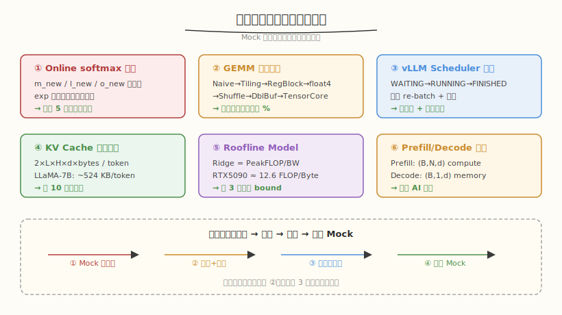
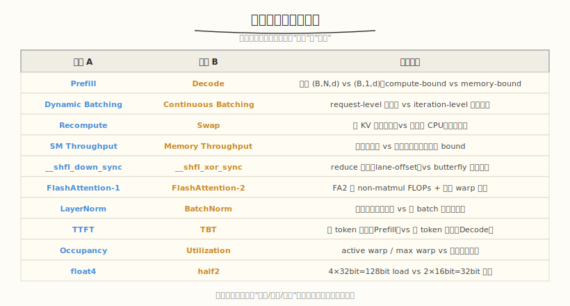
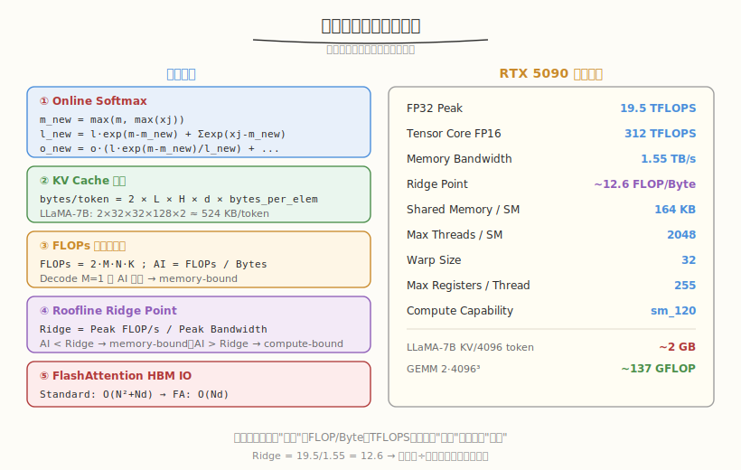

## Day 6：查漏补缺

### 🎯 目标

通过今天的学习，你将：

1. 能根据 Day 5 Mock 面试的**复盘记录**定位 3-5 个个人薄弱点<br>
2. 掌握**六大高频薄弱点**（Online Softmax / GEMM 层次 / vLLM Scheduler / KV Cache 内存 / Roofline / Prefill-Decode）的复习方法<br>
3. 整理一张**十大易混淆概念对比表**，面试时能一句话说清区别<br>
4. 熟练背诵**关键公式**（online softmax 三公式、KV Cache 内存、Ridge Point）和 **RTX 5090 参数**<br>
5. 能不看资料**默画** 8 个核心流程图（memory hierarchy、GEMM 层次、FA tiling、vLLM 架构等）<br>
6. 用自测系统 `knowledge_selftest.py` 完成至少一轮知识自检，薄弱点清零

> 💡 **为什么重要**：Day 5 的 Mock 面试暴露了"懂但讲不清楚"的问题。查漏补缺是把"模糊印象"变成"肌肉记忆"的最后一步——面试官追问时，你要能在 3 秒内给出准确数字和公式，而不是"大概是……"。

---

### 学前导读：从 Mock 到查漏补缺

Day 5 的 Mock 面试给你留了一张复盘表。现在的问题是：**那些卡壳的点，怎么从"记不住"变成"张口就来"？**

```
❌ "Ridge Point 大概是十几？"
❌ "KV Cache 好像几百 KB？具体记不清了"
❌ "online softmax 公式我知道，但写不出来"
❌ "LayerNorm 和 BatchNorm 都是归一化，区别是……嗯……"
```

| 学习阶段 | 目标 | 方法 |
|----------|------|------|
| Day 3-4 | 理解概念 | 看笔记、做面试题 |
| Day 5 | 检验表达 | Mock 面试、录音 |
| **Day 6** | **补齐漏洞** | **定位薄弱点 → 重学 → 默写 → 二次 Mock** |
| Day 7 | 全局复盘 | 能力地图、后续规划 |

查漏补缺的核心是**闭环**：不是"再读一遍"，而是"测→学→默→测"，直到薄弱点消除。

> 💡 **一句话总结**：面试准备的最后冲刺不是"学新东西"，而是"把模糊变精确"——每个数字、每个公式、每个对比，都要能秒答。

---

### 理论学习

#### 6.1 六大高频薄弱点定位与复习



从历次 Mock 面试和真实面经中，反复出现的薄弱点集中在以下六个。每个点给出"卡壳表现"和"复习方法"：

| 薄弱点 | 典型卡壳表现 | 复习方法 |
|--------|-------------|---------|
| **Online Softmax 推导** | "公式我知道，但写不全" | 手写 5 遍三公式，理解 `exp(m-m_new)` 缩放因子 |
| **GEMM 优化层次** | "记得有 tiling，但记不住每层 %" | 画 9 层阶梯图，背每层增益（1%→15%→45%→...→90%） |
| **vLLM Scheduler** | "知道有调度，但状态机讲不清" | 看源码 + 画 WAITING/RUNNING/FINISHED 流程图 |
| **KV Cache 内存** | "公式记不住，算不出数字" | 用 3 个不同模型算 10 次，背 LLaMA-7B = 524KB |
| **Roofline Model** | "会画图但 Ridge 算不出" | 记 Ridge = PeakFLOP/BW，RTX5090 = 19.5/1.55 ≈ 12.6 |
| **Prefill/Decode 强度** | "知道不同但说不清为什么" | 推导 M=1 时 AI 极低 → memory-bound |

##### 为什么这些点最容易卡壳？

这六个点的共同特征是**需要精确的数字或公式**，而不是模糊的概念描述。面试官区分"背了"和"懂了"的方法，就是追问数字：

- "Ridge Point 具体是多少？怎么算的？"
- "LLaMA-7B 每 token KV Cache 占多少？4096 token 呢？"
- "GEMM 到 cuBLAS 80%，每一层各占多少？"

回答"大概是"直接扣分，回答"12.6 FLOP/Byte，因为 19.5 TFLOPS 除以 1.55 TB/s"才达标。

#### 6.2 十大易混淆概念对比



面试官最爱用**对比题**区分候选人的理解深度。下面十个对比是高频考点，每个都要能一句话说清区别：

##### 为什么对比题这么重要？

对比题考察的不是"知不知道 A 和 B"，而是"能不能说清 A 和 B 的边界"。回答对比题的**通用套路**：

```
1. 说"粒度/维度/阶段"的差异（最本质）
2. 给一句量化或场景（佐证）
3. （可选）说一个容易搞错的点
```

**示例**（Prefill vs Decode）：

> "粒度差异：Prefill 输入 `(B, N, d)` 是 compute-bound，Decode 输入 `(B, 1, d)` 是 memory-bound。
> 量化：Decode 时 M=1，arithmetic intensity 极低，远低于 Ridge Point。
> 易错：Decode 不是'慢'，而是'带宽没吃满'，优化方向是 KV Cache 和 PagedAttention，不是加算力。"

##### 五级深入：LayerNorm vs BatchNorm

这两个是归一化家族里最容易混淆的。本质区别是 **reduce 的维度**：

- **BatchNorm**：reduce 跨 `(N, H, W)`，按**通道**归一化。每个通道 `c` 算一个 mean/var。
- **LayerNorm**：reduce 跨 `(C, H, W)`（或 feature 维），按**样本**归一化。每个样本算一个 mean/var。

| 维度 | BatchNorm | LayerNorm |
|------|-----------|-----------|
| reduce 轴 | batch + spatial | feature |
| mean/var 数量 | C 个（每通道一组） | N 个（每样本一组） |
| 训练/推理差异 | 有（推理用 running stats） | 无 |
| 适用场景 | CNN（图像） | Transformer / NLP |
| CUDA 实现 | 一个 block 一个通道 | 一个 block 一个样本 |

> ⚠️ BatchNorm 在推理时用**训练期累积的 running mean/var**，而不是实时计算——这是面试高频追问点。

#### 6.3 关键公式与参数速查



面试前必须能**秒写、秒背、秒算**的五组公式和一组参数：

##### 五组必背公式

```text
① Online Softmax
   m_new = max(m, max(xj))
   l_new = l · exp(m - m_new) + Σ exp(xj - m_new)
   o_new = o · (l · exp(m - m_new) / l_new) + Σ (exp(xj - m_new) / l_new) · vj

② KV Cache 内存
   bytes/token = 2 × L × H × d × bytes_per_elem
   LLaMA-7B (32层/32头/d=128/fp16): 2×32×32×128×2 = 524288 B ≈ 524 KB

③ FLOPs 与算术强度
   FLOPs = 2 · M · N · K    （GEMM）
   AI = FLOPs / Bytes       （Arithmetic Intensity）

④ Roofline Ridge Point
   Ridge = Peak FLOP/s / Peak Bandwidth
   RTX 5090 = 19.5 TFLOPS / 1.55 TB/s ≈ 12.6 FLOP/Byte
   AI < Ridge → memory-bound；AI > Ridge → compute-bound

⑤ FlashAttention HBM IO
   Standard: O(N² + Nd)    FlashAttention: O(Nd)
```

##### RTX 5090 关键参数

```text
FP32 Peak:            19.5 TFLOPS
Tensor Core FP16:     312 TFLOPS
Memory Bandwidth:     1.55 TB/s
Ridge Point:          ~12.6 FLOP/Byte
Shared Memory / SM:   164 KB
Max Threads / SM:     2048
Warp Size:            32
Max Registers/Thread: 255
Compute Capability:   sm_120
```

##### 背诵技巧

不要硬背数字，而是**记量纲，再推数字**：

- Ridge Point 的量纲是 `FLOP/Byte` → 用 `算力 ÷ 带宽` 自己推：`19.5 / 1.55 = 12.6`
- KV Cache 的量纲是 `Byte/token` → 用 `2 × L × H × d × bytes` 推
- GEMM FLOPs 的量纲是 `FLOP` → `2 × M × N × K`（2 是一次乘 + 一次加）

> 💡 **一句话总结**：面试官追求数字时，能**当场推导**比"背对了"更有说服力——这说明你理解公式，不是死记。

---

### Coding 任务：知识自测与薄弱点攻坚

#### 任务 1：创建 knowledge_selftest.py

创建文件 [kernels/knowledge_selftest.py](kernels/knowledge_selftest.py)，把六大薄弱点 + 关键公式 + RTX 5090 参数做成一个自测系统：

```python
# knowledge_selftest.py —— AI Infra 知识点自测系统
# 运行命令: python knowledge_selftest.py
# 依赖: 仅标准库
#
# 覆盖六大薄弱点：Online Softmax / GEMM 层次 / vLLM Scheduler /
#                  KV Cache 内存 / Roofline / Prefill-Decode
# 三种模式：
#   quiz    —— 随机抽题，限时口述后看答案
#   formula —— 关键公式默写（填空）
#   param   —— RTX 5090 关键参数快问快答

import random
import time

QUIZ_BANK = [
    {
        "topic": "Online Softmax",
        "q": "写出 online softmax 的三个更新公式（m / l / o）。",
        "a": (
            "m_new = max(m, max(xj))\n"
            "l_new = l * exp(m - m_new) + Σ exp(xj - m_new)\n"
            "o_new = o * (l * exp(m - m_new) / l_new) + Σ (exp(xj - m_new) / l_new) * vj\n"
            "\n要点：exp(m - m_new) 是统一参考点的缩放因子；"
            "避免物化 N×N 矩阵，IO 从 O(N²) 降到 O(Nd)。"
        ),
    },
    # ... 共 8 道题，覆盖六大薄弱点 + FlashAttention + PagedAttention
]

FORMULA_BLANKS = [
    {"prompt": "Online Softmax 的 m_new = ", "answer": "max(m, max(xj))"},
    {"prompt": "Online Softmax 的 l_new = l * ___ + Σ exp(xj - m_new)", "answer": "exp(m - m_new)"},
    {"prompt": "KV Cache bytes/token = 2 × L × H × ___ × bytes_per_elem", "answer": "d"},
    # ... 共 7 道填空
]

PARAM_QUIZ = [
    {"q": "RTX 5090 FP32 Peak (TFLOPS)?", "a": "19.5"},
    {"q": "RTX 5090 Memory Bandwidth (TB/s)?", "a": "1.55"},
    {"q": "RTX 5090 Ridge Point (FLOP/Byte)?", "a": "12.6"},
    # ... 共 10 道参数题
]

# 完整代码见 kernels/knowledge_selftest.py
```

完整代码见 [kernels/knowledge_selftest.py](kernels/knowledge_selftest.py)。

代码要点：
- **三种模式**：`quiz`（随机抽题口述）、`formula`（公式填空默写）、`param`（参数快问快答）
- **quiz 模式**：每题限时口述，回车看参考答案，记录用时
- **formula/param 模式**：自动判分，答错显示正确答案
- **覆盖全面**：8 道口述题 + 7 道填空 + 10 道参数，对应六大薄弱点

#### 任务 2：运行自测系统

```bash
python kernels/knowledge_selftest.py
```

**预期流程**（节选）：

```text
============================================================
       AI Infra 知识点自测系统（查漏补缺）
============================================================
覆盖六大薄弱点 + 关键公式 + RTX 5090 参数

命令：
  quiz    —— 随机抽题，限时口述后看答案
  formula —— 关键公式默写（填空）
  param   —— RTX 5090 关键参数快问快答
  all     —— 依次执行三种模式
  q       —— 退出

输入命令: quiz

=== 模式：随机抽题口述 ===

【第 1 题 / KV Cache 内存】
LLaMA-7B（32 层 / 32 头 / d=128 / fp16）每 token KV Cache 占多少？4096 token 呢？
--------------------------------------------------
回车看答案（q 退出）:
```

##### 观察重点

1. **quiz 模式**：每题能否在 3 分钟内口述完？超时说明还没形成肌肉记忆
2. **formula 模式**：7 道填空正确率是否 > 80%？错的题回到理论学习重学
3. **param 模式**：10 道参数是否全对？Ridge Point 必须能秒答 12.6
4. **二次自测**：针对错误项重学后，再跑一遍，直到全对

#### 任务 3：默写关键公式与流程图

不看任何资料，完成以下默写（用纸笔或文本编辑器）：

| 默写项 | 验收标准 | 用时目标 |
|--------|---------|---------|
| Online Softmax 三公式 | m_new / l_new / o_new 完整写出 | < 2 min |
| KV Cache 内存公式 + LLaMA-7B 数字 | 公式 + 524KB + 4096→2GB | < 1 min |
| GEMM 9 层优化 + 增益 % | Naive 1% → cuBLAS 90%+ | < 3 min |
| Roofline 图 + Ridge 计算 | 斜线/水平线 + 12.6 推导 | < 2 min |
| vLLM 架构图 | Engine→Scheduler→Worker→KV | < 3 min |
| Continuous Batching 时间线 | 3 个请求动态进出 | < 3 min |
| FlashAttention tiling 示意 | Q/K/V block + online softmax | < 3 min |
| GPU memory hierarchy | Register→Shared→L1/L2→HBM + 延迟 | < 2 min |

> 验收：8 项全部达标。某项卡壳 → 回到理论学习对应小节重学 → 重新默写。

#### 任务 4：LeetGPU 在线题目 —— Batch Normalization

**题目链接**：<https://leetgpu.com/challenges/batch-normalization>

**题目概述**：

给定 4D 输入 `x ∈ R^(N×C×H×W)`、`gamma[C]`、`beta[C]`，对每个通道 `c` 在 `(N, H, W)` 维度归一化：`y = gamma · (x - mean) / sqrt(var + eps) + beta`。

**约束条件**：`N,H,W` 较大（每通道 `NHW=65536`），`eps=1e-5`

**难度**：中等　**标签**：CUDA、Normalization、Reduction、数值稳定性

**与今日知识的关联**：

BatchNorm 是今日"易混淆概念 LayerNorm vs BatchNorm"的实战检验。它考察 **reduce 的维度**（BatchNorm 跨 batch/spatial、LayerNorm 跨 feature）和 **memory-bound kernel 的优化**（融合 reduce + normalize，IO 从 3 遍降到 1 遍）。面试中能讲清"两者 reduce 维度差异 + 融合实现 + 为什么 memory-bound"，归一化家族（RMSNorm / GroupNorm）就都是同构变体。

**解题思路**：

朴素方法是三遍 kernel（mean → var → normalize），每遍读一遍全局内存。优化思路是**融合单 kernel**：一个 block 处理一个通道，block 内用 warp shuffle reduce 算 mean/var，再融合 normalize 写回，IO 从 3 遍降到 1 遍。BatchNorm 算术强度极低（~0.5 FLOP/Byte），远低于 Ridge Point，是典型 memory-bound，优化重点是减少 IO 遍数。

> 💡 提交后在 [LeetGPU Batch Normalization](https://leetgpu.com/challenges/batch-normalization) 上记录通过耗时，用 ncu 对比三遍 vs 融合的 DRAM Throughput 差异。完整题解见 [Batch Normalization 题解](../../../../leetgpu/week8/day6/leetgpu-batch-normalization-solution.md)。

#### 任务 5：LeetCode 面试题 —— 最长递增子序列

**题目链接**：[300. 最长递增子序列](https://leetcode.cn/problems/longest-increasing-subsequence/)

**题目概述**：

给定整数数组 `nums`，找到最长**严格递增子序列**的长度。子序列不要求连续，但保持原顺序。

**与今日知识的关联**：

LIS 是动态规划的经典题，也是"查漏补缺"的最佳载体——它有 `O(n²)` DP 和 `O(n log n)` 贪心+二分两种解法，考察的是**能否从暴力优化到最优**的思维能力。这与 AI Infra 的优化思路同构：DP `O(n²)` → 贪心 `O(n log n)` 对应 Naive GEMM `1%` → cuBLAS `90%+`，都是"识别冗余、用更优数据结构/策略消除冗余"。此外，LIS 的"维护最小末尾以最大化未来可能性"和推理调度的"维护最小 TBT 以最大化吞吐"是同构的贪心思想。

**核心套路**：

```text
贪心 + 二分：维护 tails 数组，tails[k] = 长度 k+1 的最小末尾
 遍历 nums，对每个 x：
   pos = lower_bound(tails, x)   // 第一个 >= x
   if pos == len(tails): tails.append(x)   // 追加，LIS +1
   else: tails[pos] = x                     // 替换，保持最小末尾
 答案 = len(tails)
```

> 💡 完整题解（含 DP 与贪心+二分两种解法、复杂度对比、还原子序列、面试要点）见 [最长递增子序列题解](../../../../leetcode/daily/week8/day6/最长递增子序列.md)。

---

### 扩展实验

#### 实验 1：薄弱点清零挑战

运行 `python kernels/knowledge_selftest.py`，执行 `all` 模式（quiz + formula + param）。记录得分：

| 模式 | 第一次得分 | 重学后得分 | 是否清零 |
|------|----------|----------|---------|
| quiz（8 题） | /8 | /8 | |
| formula（7 题） | /7 | /7 | |
| param（10 题） | /10 | /10 | |

> 思考：哪类题错最多？是"公式记不住"还是"概念混淆"？前者靠默写，后者靠对比表。

#### 实验 2：默画 8 张核心图

不看资料，用纸笔默画以下 8 张图，每张限时 3 分钟，画完对照资料打分：

1. GPU memory hierarchy（含延迟数字）
2. GEMM 9 层优化阶梯（含 %）
3. FlashAttention tiling 示意
4. Online softmax 状态更新
5. vLLM 架构图
6. Continuous Batching 时间线（3 请求）
7. Prefill/Decode 数据流对比
8. Roofline Model（含 Ridge Point）

> 思考：哪张图画不全？画不全的图对应的知识点，就是你的盲区——回到对应 Day 的教程重学。

#### 实验 3：二次 Mock 面试

针对 Day 5 暴露的薄弱点和今天重学的内容，再做一轮 Mock 面试（用 `week8/day5/kernels/mock_interview.py`）。重点观察：

1. 之前卡壳的题，现在能否 3 分钟内流畅回答？
2. 被追问数字时，能否秒答（Ridge 12.6、KV 524KB、GEMM 70%）？
3. 对比题能否一句话说清区别（Prefill/Decode、LayerNorm/BatchNorm）？

> 思考：如果二次 Mock 仍有卡壳，说明薄弱点没真正消除——回到理论学习，用手写 5 遍的方式强制记忆。

---

### 今日总结

Day 6 我们针对 Mock 面试暴露的薄弱点做了最后冲刺：

1. **六大薄弱点定位**：Online Softmax 推导、GEMM 层次、vLLM Scheduler、KV Cache 内存、Roofline、Prefill/Decode 强度
2. **易混淆概念对比**：十大对比表（Prefill/Decode、LayerNorm/BatchNorm、float4/half2 等），用"粒度→量化→易错"三步法回答
3. **关键公式背诵**：online softmax 三公式、KV Cache 内存、FLOPs/AI、Ridge Point、FA HBM IO
4. **RTX 5090 参数**：19.5 TFLOPS、1.55 TB/s、Ridge 12.6、164KB shared mem 等，用"记量纲推数字"法
5. **自测系统**：`knowledge_selftest.py` 提供 quiz/formula/param 三模式，闭环测→学→默→测
6. **默画训练**：8 张核心流程图限时默画，画不全即盲区
7. **二次 Mock**：针对薄弱点重测，确认卡壳点清零

完成今天的查漏补缺后，你应该能对每个高频面试题在 3 秒内给出准确数字和公式。明天 Day 7 进入最终复盘，画 8 周能力地图、规划后续路线，完成整个学习闭环。

---

### 面试要点

1. **RTX 5090 的 Ridge Point 是多少？如何计算？含义是什么？**（⭐⭐⭐⭐ 高频）

<details>
<summary>点击查看答案</summary>

 - **数值**：约 12.6 FLOP/Byte
 - **计算**：Ridge Point = Peak FLOP/s / Peak Bandwidth = 19.5 TFLOPS / 1.55 TB/s ≈ 12.6
 - **含义**：算术强度 AI < 12.6 → memory-bound；AI > 12.6 → compute-bound
 - **推导**：不要硬背，用"算力 ÷ 带宽"当场推。Ridge 是 Roofline 图上斜线与水平线的交点。

</details>


2. **LLaMA-7B 每 token 的 KV Cache 占多少内存？4096 token 呢？**（⭐⭐⭐⭐ 高频）

<details>
<summary>点击查看答案</summary>

 - **公式**：`bytes/token = 2 × L × H × d × bytes_per_elem`
 - **LLaMA-7B**：32 层、32 头、d_head=128、fp16（2 bytes）
 - **计算**：2 × 32 × 32 × 128 × 2 = 524288 B ≈ 524 KB/token
 - **4096 token**：4096 × 524 KB ≈ 2 GB
 - **易错**：H 是 head 数，d 是 head_dim；多头时 H × d = hidden_dim

</details>


3. **LayerNorm 和 BatchNorm 的区别？reduce 维度分别是什么？**（⭐⭐⭐⭐ 高频）

<details>
<summary>点击查看答案</summary>

 - **BatchNorm**：reduce 跨 `(N, H, W)`，按**通道**归一化，每通道一组 mean/var（共 C 组）
 - **LayerNorm**：reduce 跨 `(C, H, W)`，按**样本**归一化，每样本一组 mean/var（共 N 组）
 - **训练/推理**：BatchNorm 推理用 running stats（不实时算）；LayerNorm 训练推理一致
 - **场景**：BatchNorm 用于 CNN（图像）；LayerNorm 用于 Transformer（NLP）
 - **CUDA 实现**：BatchNorm 一个 block 一个通道；LayerNorm 一个 block 一个样本

</details>


4. **写出 online softmax 的三个更新公式。`exp(m - m_new)` 的作用是什么？**（⭐⭐⭐⭐⭐ 必考）

<details>
<summary>点击查看答案</summary>

 ```
 m_new = max(m, max(xj))
 l_new = l × exp(m - m_new) + Σ exp(xj - m_new)
 o_new = o × (l × exp(m - m_new) / l_new) + Σ (exp(xj - m_new) / l_new) × vj
 ```
 - **`exp(m - m_new)` 的作用**：统一参考点的缩放因子。当新 block 的 max 比旧的大时，旧的累加值 `l` 和 `o` 需要按 `exp(m - m_new)` 缩小（因为 m 变大了，旧的 exp 值相对变小）。
 - **为什么避免物化 N×N**：online softmax 在 SRAM 内增量更新 m/l/o，不需要把完整的 S=QK^T 和 P=softmax(S) 写到 HBM，IO 从 O(N²) 降到 O(Nd)。

</details>


5. **你的 GEMM 优化到 cuBLAS 70%+，每一层优化的收益来源是什么？要达到 90% 还需做什么？**（⭐⭐⭐⭐⭐ 必考）

<details>
<summary>点击查看答案</summary>

 | 层次 | 增益 | 收益来源 |
 |------|------|---------|
 | Shared Memory Tiling | 1%→15% | K 维数据复用，减少全局重复读 |
 | Register Blocking | 15%→45% | 累加器驻留寄存器，减少 shared mem 访问 |
 | float4 向量化 | 45%→55% | 128-bit load 提升带宽利用率 |
 | Warp Shuffle | 55%→60% | 优化写回，减少非合并访问 |
 | Double Buffering | 60%→70% | 软件流水线掩盖传输延迟 |
 | Tensor Core | 70%→80%+ | WMMA/mma 硬件矩阵乘加 |
 | Auto-tuning | 80%→90%+ | 按尺寸选最优分块参数 |

 达到 90% 还需：① Tensor Core（WMMA 指令）② 完整 Double Buffering ③ CUTLASS 模板库 ④ 针对目标尺寸 exhaustive search

</details>
