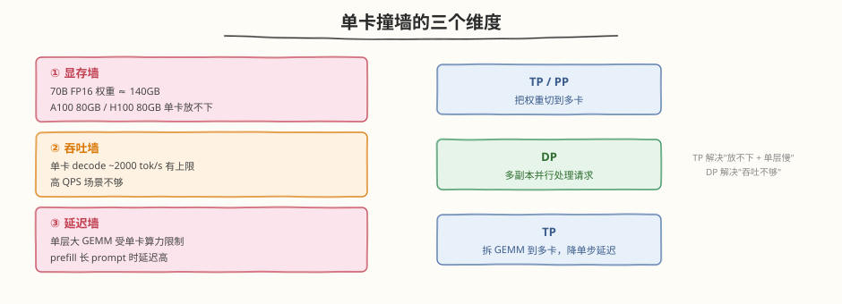
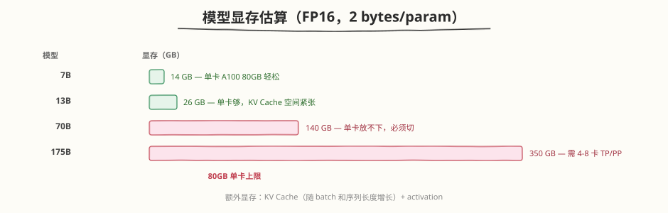
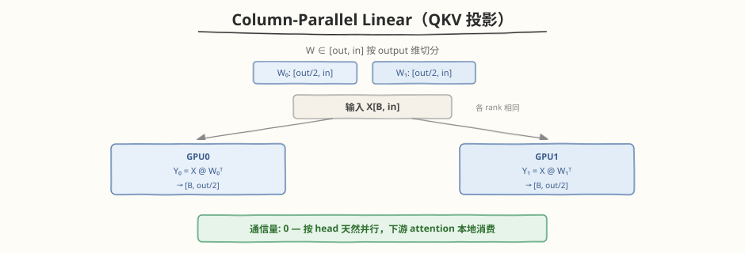
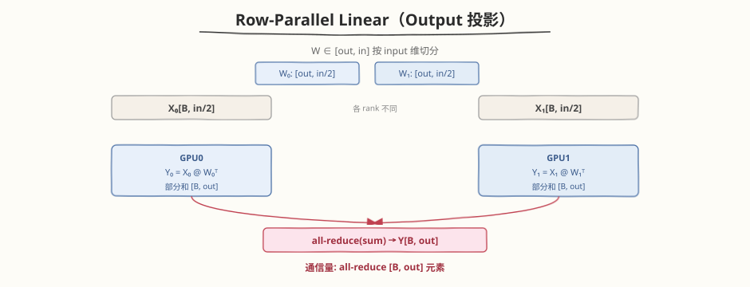
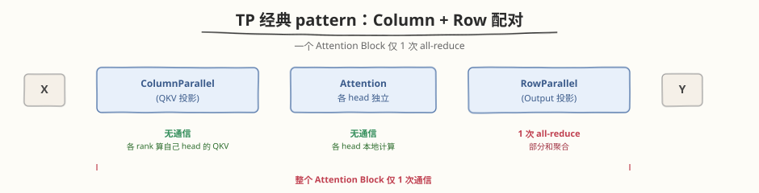

## Day 1：分布式推理 —— 为什么需要分布式 + TP + DP 定位

### 🎯 目标

通过今天的学习，你将：

1. 理解**为什么单卡不够**——模型太大（70B FP16 ≈ 140GB，单卡 A100 80GB 放不下）、吞吐需求（单卡 tok/s 上限低）、延迟需求（单层 GEMM 算力受限）三大动机<br>
2. 掌握 **Tensor Parallelism (TP)**——column-parallel linear（QKV 投影按 head 切）、row-parallel linear（Output 投影按 input 切 + all-reduce）、TP=2/4/8 的通信/算力权衡<br>
3. 了解 **Pipeline Parallelism (PP)** 的定位——按层切 stage、micro-batching 流水、bubble 代价；GPipe vs 1F1B 与 bubble ratio 完整推导详见 Day 2<br>
4. 理解 **Data Parallelism (DP)** 在推理中的定位——与 TP/PP 的区别，适合高吞吐多请求场景而非单大模型放置<br>
5. 了解 **NCCL collectives** 的通信量速查——all-reduce / all-gather / reduce-scatter 的定位与量级；ring 两阶段推导与带宽估算详见 Day 3<br>
6. 了解**通信计算重叠**的核心思路——双 CUDA Stream 把"串行加法"变成"取最大值"；代码实现、CUDA Graph 与收益边界详见 Day 4

> 💡 **为什么重要**：Day 3 分析了 SGLang/LightLLM 的高级特性（Speculative Decoding、Chunked Prefill、Prefix Caching），但它们都假设"模型能放进单卡"。当模型大到单卡放不下（如 70B+），或吞吐需求超过单卡上限时，就必须上**分布式推理**。TP/PP/DP 是分布式推理的三大基石，NCCL 通信与通信-计算重叠是把"分布式开销"压到最低的关键工程能力——这是面试"大模型分布式推理"的高频考点，也是 Mini 引擎从"单卡 demo"走向"多卡生产"的必经之路。

---

### 学前导读：为什么单卡不够

Day 1-3 的 Mini 引擎都跑在单卡上。但当模型规模和业务需求增长时，单卡会从三个维度撞墙：



| 维度 | 单卡瓶颈 | 分布式方案 | 代价 |
|------|---------|-----------|------|
| 显存 | 模型放不下 | TP（切权重）/ PP（切层） | 通信开销 |
| 吞吐 | tok/s 上限 | DP（切数据，多副本） | 显存翻倍 + grad all-reduce |
| 延迟 | 单层 GEMM 慢 | TP（单层算力 x N） | 每层 all-reduce |

> 💡 **一句话总结**：TP 解决"放不下 + 单层慢"，PP 解决"放不下"，DP 解决"吞吐不够"。实际系统常组合 DP+TP 或 DP+PP——外层 DP 切请求扩吞吐，内层 TP/PP 切模型放显存。

---

### 理论学习

#### 3b.1 为什么需要分布式推理

分布式推理的三大动机，对应三种不同的并行策略：

##### 动机 1：模型太大，单卡显存放不下



> ⚠️ **KV Cache 容易被忽略**：70B 模型即便权重切到 2 卡（每卡 70GB），KV Cache 在大 batch 长序列下可能再吃几十 GB，导致单卡仍 OOM。这就是为什么 TP=2 不一定够，常需 TP=4/8。

##### 动机 2：吞吐需求（throughput）

单卡 decode 吞吐有上限（受算力和带宽限制）。高 QPS 场景（如多人同时聊天）需要多副本并行——这就是 DP。每张卡跑一个完整模型副本，独立处理不同请求，吞吐近似线性扩展。

##### 动机 3：延迟需求（latency）

单层大 GEMM（如 70B 的 FFN，矩阵 [B, 8192]×[8192, 28672]）在单卡上耗时较长。TP 把这个 GEMM 切到 N 卡，每卡算 1/N，单步延迟近似降至 1/N（扣除通信开销后）。

#### 3b.2 Tensor Parallelism (TP)


TP 的核心思想：**把每一层的权重矩阵切到多卡，各卡并行计算同一层的不同部分，通过通信聚合结果**。

##### Column-Parallel Linear（QKV 投影用）

权重 $W \in \mathbb{R}^{out \times in}$ 按 **output 维**切分，每个 rank 持有 $W_i \in \mathbb{R}^{out/N \times in}$：



> 💡 **为什么 QKV 用 column-parallel**：Attention 天然按 head 分组，column 切分正好让每个 rank 持有若干 head 的 Q/K/V，后续 attention 计算完全本地化，无需跨 rank 通信。

##### Row-Parallel Linear（Output 投影用）

权重 $W \in \mathbb{R}^{out \times in}$ 按 **input 维**切分，每个 rank 持有 $W_i \in \mathbb{R}^{out \times in/N}$：



##### TP 的经典 pattern：Column + Row 配对

一个 Attention Block = ColumnParallel(QKV) + Attention + RowParallel(Output)，**全程只需 1 次 all-reduce**（在 Output 投影处）：



##### TP=2/4/8 权衡

| TP size | 算力提升 | 每层通信量 | 显存节省 | 适用场景 |
|---------|---------|-----------|---------|---------|
| TP=2 | x2 | 1 次 all-reduce（小） | 权重 ÷2 | 13B-34B 模型 |
| TP=4 | x4 | 1 次 all-reduce（中） | 权重 ÷4 | 70B 模型 |
| TP=8 | x8 | 1 次 all-reduce（大） | 权重 ÷8 | 175B 模型 |

> ⚠️ **TP 不是越大越好**：TP 增大后，all-reduce 通信量不变（每层都全量 all-reduce 输出），但每卡算的 GEMM 变小（算力利用率下降），且通信占比升高。通常 TP≤8，再大用 PP 补充。

#### 3b.3 Pipeline Parallelism (PP)

PP 的核心思想：**把模型的不同层切到不同卡（stage），数据像流水线一样流过各 stage**。

| 维度 | PP |
|------|-----|
| 切分对象 | 模型层（按 depth 切 P 段） |
| 每卡存储 | 1/P 的层权重 + activation |
| 通信 | stage 间 send/recv activation（点对点） |
| 代价 | 流水线 bubble（空泡） |
| 适用 | 超大模型（TP=8 仍放不下时叠加 PP） |

推理只有 forward，没有 backward，PP 的收益主要在**显存**（每卡只存部分层）。代价是 stage 间点对点通信和流水线空泡。bubble ratio = $(P-1)/(M+P-1)$，增大 micro-batch 数 $M$ 可降低空泡。

> 📖 **详见 Day 2**：PP 的 GPipe vs 1F1B 调度、bubble ratio 完整推导、Interleaved 1F1B（virtual pipeline）、推理 PP 部署形态（vLLM `pipeline_parallel_size`）在 Day 2 深入展开。

#### 3b.4 Data Parallelism (DP)

DP 的核心思想：**每张卡持有完整模型副本，各卡处理不同的请求/batch**。

##### DP vs TP/PP 的区别

| 维度 | DP | TP / PP |
|------|----|---------|
| 切分对象 | 输入数据 | 模型权重 |
| 每卡模型 | 完整副本 | 部分权重 |
| 通信 | grad all-reduce（训练）/ 无或很少（推理） | 每层 all-reduce（TP）/ send-recv（PP） |
| 扩展性 | 吞吐近似线性 | 受通信限制 |

##### DP 在推理中的定位

- **训练**：DP 是主流，每步 backward 后 grad all-reduce
- **推理**：DP 更简单——各卡独立处理请求，**无需跨卡通信**（除了请求路由）。吞吐近似线性扩展，是高 QPS 场景的首选
- **推理 DP 的通信**：仅请求分发（CPU 层面），GPU 间几乎无通信

> 💡 **推理 DP 的优势**：零 GPU 通信、实现简单、吞吐线性扩展。劣势是每卡要放完整模型（显存不省）。所以"模型放得下单卡"时，DP 是推理扩吞吐的最佳选择。

#### 3b.5 NCCL collectives

NCCL（NVIDIA Collective Communications Library）是 GPU 间集合通信的标准库，PyTorch 通过 `torch.distributed` 调用。各 collective 的通信量速查：

| collective | 作用 | 通信量 | 典型用途 |
|-----------|------|--------|---------|
| **all-reduce** | 全聚合 + 全分发 | $2V(N-1)/N$ | TP 输出聚合、DP 梯度同步 |
| **all-gather** | 各 rank 拼接不同块 | $V(N-1)/N$ | column-parallel 输出收集 |
| **reduce-scatter** | 全聚合 + 分散结果 | $V(N-1)/N$ | 拆分 all-reduce 的前半段 |
| **broadcast** | 单卡数据广播到所有 | $V$ | 初始化、参数同步 |
| **send/recv** | 点对点传输 | $V$ | PP stage 间传 activation |

> 📖 **详见 Day 3**：Ring all-reduce 的两阶段执行细节（reduce-scatter + all-gather）、Ring vs Tree 拓扑对比、各并行策略的通信量推导、NVLink/PCIe/IB 带宽常识与 α-β 通信模型在 Day 3 深入展开。Day 3 还提供 `dist_allreduce_demo.py`（torchrun 双进程实测）和 `ring_allreduce_sim.py`（调度模拟器）。

#### 3b.6 通信计算重叠


分布式推理的通信开销如果不能被计算掩盖，TP/PP 的加速比会被严重吃掉。**通信-计算重叠**是核心优化手段：

```
不重叠（串行）：total = T_compute + T_comm
重叠（双流）：  total ≈ max(T_compute, T_comm)
```

核心思路：用**双 CUDA Stream**（compute_stream + comm_stream）让上一层的 all-reduce 与本层的 GEMM 并行执行——两者数据无依赖（all-reduce 的是上一层输出，GEMM 用的是本层权重），可安全重叠。decode 阶段 shape 固定时，还可用 CUDA Graph 捕获整个双流 launch 序列，消除 Python/CPU launch 开销。

> 📖 **详见 Day 4**：双 Stream 的代码实现（`torch.cuda.Stream` + `wait_stream`）、TP 层内通信计算重叠策略（前半/后半 GEMM 切分）、CUDA Graph 捕获双流序列、Overlap 的收益边界（何时重叠有效、何时无效）在 Day 4 深入展开。Day 4 还补了 Sequence Parallelism（Megatron 2205.05198）——工业界主流做法。

### Coding 任务：TP 推理 demo

#### 任务 1：创建 tp_inference_demo.py

创建文件 [kernels/tp_inference_demo.py](https://github.com/hzchenxiaobin/ai-infra-notes/blob/main/aiinfra/daily/week9/day1/kernels/tp_inference_demo.py)，用 `torch.chunk` 在单卡上模拟 2-GPU TP 推理：

```python
# tp_inference_demo.py —— 2-GPU Tensor Parallelism 推理 Demo（单卡模拟）
# 运行命令: python tp_inference_demo.py
# 依赖: torch（CPU 或单 GPU 均可）

class ColumnParallelLinear(nn.Module):
    """列并行：W 按 output dim 切分，各 rank 输出 [B, out/tp]，无需通信"""
    def forward(self, x):
        shards = [x @ w.t() + b for w, b in zip(self.weights, self.bias)]
        return torch.cat(shards, dim=-1)

class RowParallelLinear(nn.Module):
    """行并行：W 按 input dim 切分，各 rank 输出部分和，all-reduce 聚合"""
    def forward(self, x):
        x_shards = torch.chunk(x, self.tp_size, dim=-1)
        partial = [x_i @ w.t() for x_i, w in zip(x_shards, self.weights)]
        # 模拟 all-reduce(sum)：真实场景用 torch.distributed.all_reduce(y)
        return torch.stack(partial, dim=0).sum(dim=0) + self.bias

class TPAttentionBlock(nn.Module):
    """ColumnParallel(QKV) + Attention + RowParallel(Output)，1 次 all-reduce"""
    ...
```

完整代码见 [kernels/tp_inference_demo.py](https://github.com/hzchenxiaobin/ai-infra-notes/blob/main/aiinfra/daily/week9/day1/kernels/tp_inference_demo.py)。

代码要点：
- `ColumnParallelLinear`：权重按 output dim 切成 `tp_size` 片，各片独立计算后 `torch.cat` 模拟拼接（真实 TP 下游按 head 消费，常无需 concat）
- `RowParallelLinear`：权重按 input dim 切，输入也按 input dim chunk，各 rank 算部分和后 `torch.stack().sum()` 模拟 all-reduce
- `TPAttentionBlock`：组合 Column(QKV) + Attention + Row(Output)，验证一个 block 仅需 1 次通信
- `single_gpu_forward`：用拼接后的完整权重做等价单卡 forward，用于正确性对比

#### 任务 2：运行 tp_inference_demo.py 并验证正确性

```bash
python kernels/tp_inference_demo.py
```

**预期输出**（节选）：

```text
================================================================
  正确性测试：TP=2 模拟 vs 单卡等价
================================================================
  output shape : TP=(2, 128, 512), single=(2, 128, 512)
  max abs diff : 2.53e-07
  result       : PASS

================================================================
  通信模式分析（TP=2，一个 Attention Block）
================================================================
  ColumnParallelLinear (QKV 投影):
    通信量: 0（无需 all-reduce，下游 attention 按 head 消费）
  RowParallelLinear (Output 投影):
    通信量: all-reduce(sum) [B, out] 元素，FP32 每元素 4B
  => 一个 Attention Block 共 1 次 all-reduce（在 output 投影处）

================================================================
  Demo 完成！TP 推理模拟 通过
```

##### 观察重点

1. **正确性**：TP=2 模拟输出与单卡等价输出 max diff < 1e-5（浮点累加顺序导致微小误差）
2. **通信 pattern**：一个 Attention Block 仅 1 次 all-reduce（Row(Output) 处），Column(QKV) 零通信
3. **单卡模拟局限**：无法体现真实多卡加速（GEMM 算力 x2），仅验证切分正确性与通信结构

#### 任务 3：通信重叠编码（见 Day 4）

双 CUDA Stream 通信-计算重叠的完整编码任务（`torch.cuda.Stream` + `wait_stream` + nsys 验证、TP 层内前半/后半 GEMM 切分、CUDA Graph 捕获双流序列）已归入 [Day 4](https://hzchenxiaobin.github.io/ai-infra-notes/week9/day4.html)，此处不再重复布置。本目录的 [kernels/comm_overlap_demo.py](https://github.com/hzchenxiaobin/ai-infra-notes/blob/main/aiinfra/daily/week9/day1/kernels/comm_overlap_demo.py) 仍可独立运行（需 CUDA 环境），作为 Day 4 的先修 demo 参考。

#### 任务 4：LeetGPU 在线题目 —— Matrix Copy

**题目链接**：<https://leetgpu.com/challenges/matrix-copy>

**与今日知识的关联**：分布式推理的核心开销是**通信**（all-reduce / send-recv），而通信的本质是**数据在 GPU 间搬运**——与 Matrix Copy 同构：都是 bandwidth-bound 的纯数据搬移。Matrix Copy 练习的是如何高效搬运（coalesced 读写、避免 bank conflict、用满显存带宽），这正是 NCCL kernel 内部的优化目标。理解 Matrix Copy 的带宽利用率分析，就能估算 all-reduce 的通信下限：`T_comm = V / bandwidth`。做好这题说明你掌握了"数据搬运的性能上限"，是分析通信开销的基础。

> 💡 提交后在 [LeetGPU Matrix Copy](https://leetgpu.com/challenges/matrix-copy) 上记录通过耗时。完整题解见 [Matrix Copy 题解](https://hzchenxiaobin.github.io/leetgpu/leetgpu-matrix-copy-solution.html)。

#### 任务 5：LeetCode 面试题（10 周计划 · 第 9 周 Day 1）

> 📅 今日题目来自 [10 周算法面试刷题计划](https://hzchenxiaobin.github.io/leetcode/problems/10-week-plan.html) 第 9 周「动态规划进阶——子序列、区间与二维 DP」Day 1（子数组与子序列），共 4 题。简单题快速过、中等题精做、困难题吃透；卡壳 20 分钟就看题解，看懂后自己默写一遍。

| 题目 | 难度 | 核心套路 | 题解 |
|------|------|---------|------|
| [139. 单词拆分](https://leetcode.cn/problems/word-break/) | 中等 | DP / BFS + 字典哈希 | [题解](https://hzchenxiaobin.github.io/leetcode/problems/139_单词拆分.html) |
| [152. 乘积最大子数组](https://leetcode.cn/problems/maximum-product-subarray/) | 中等 | 滚动 DP | [题解](https://hzchenxiaobin.github.io/leetcode/problems/152_乘积最大子数组.html) |
| [300. 最长递增子序列](https://leetcode.cn/problems/longest-increasing-subsequence/) | 中等 | DP + 二分（patience sorting） | [题解](https://hzchenxiaobin.github.io/leetcode/problems/300_最长递增子序列.html) |
| [354. 俄罗斯套娃信封问题](https://leetcode.cn/problems/russian-doll-envelopes/) | 困难 | 排序 + LIS（二分） | [题解](https://hzchenxiaobin.github.io/leetcode/problems/354_俄罗斯套娃信封问题.html) |

---

### 扩展实验

#### 实验 1：把 TP 模拟改成 TP=4

修改 `TP_SIZE = 4`（要求 `n_heads % 4 == 0`），重新运行正确性测试。观察：max diff 是否仍 < 1e-5？通信 pattern 分析中"每 block 1 次 all-reduce"是否不变？

> 思考：TP=4 时单卡 GEMM 算力 x4，但 all-reduce 通信量是否变化？（提示：不变，每层仍全量 all-reduce 输出 [B, out]。这正是 TP 通信占比随 N 升高的原因。）

#### 实验 2：用 torch.distributed 真实多卡跑 TP

若有 2+ GPU，把 `ColumnParallelLinear` / `RowParallelLinear` 中的 `torch.cat` / `torch.stack().sum()` 替换为真实的 `torch.distributed.all_reduce(y, op=ReduceOp.SUM)`。用 `torchrun --nproc_per_node=2 tp_inference_demo.py` 启动。对比真实多卡下的加速比与单卡模拟的差异。

> 思考：真实 2-GPU TP 的加速比为什么远不到 2x？（提示：all-reduce 通信开销 + kernel launch + 数据依赖。可通过 nsys 测量通信占比。）

#### 实验 3：通信计算重叠（见 Day 4）

"上一层 all-reduce 与本层 GEMM 重叠"的完整实现（双 Stream + `wait_stream` + nsys 验证）在 **Day 4** 展开，含 TP 层内前半/后半 GEMM 切分重叠策略和 CUDA Graph 捕获双流序列。

> 思考：为什么"上一层通信"能与"本层计算"重叠，而"同一层的通信"不能？（提示：同层内 Output 投影的 all-reduce 依赖该投影的部分和，存在数据依赖；跨层则无。Day 4 会用代码验证这一点。）

---

### 今日总结

Day 1 我们系统学习了分布式推理的动机与三大并行策略定位：

1. **三大动机**：显存墙（模型放不下）、吞吐墙（tok/s 不够）、延迟墙（单层 GEMM 慢），分别对应 TP/PP、DP、TP
2. **Tensor Parallelism**：column-parallel 切 QKV（按 head，零通信）+ row-parallel 切 Output（all-reduce 聚合），一个 Attention Block 仅 1 次通信
3. **Pipeline Parallelism**：按层切 stage、micro-batching 流水，推理 PP 解决"放不下"，代价是 stage 间通信与流水线空泡（1F1B 调度与 bubble ratio 推导详见 Day 2）
4. **Data Parallelism**：推理中各卡独立处理请求，零 GPU 通信，吞吐线性扩展，是高 QPS 首选
5. **NCCL collectives 速查**：all-reduce / all-gather / reduce-scatter 的定位与通信量量级（ring 推导与带宽估算详见 Day 3）
6. **通信-计算重叠**：双 CUDA Stream 让 total 从"串行加法"变成"取最大值"（实现与收益边界详见 Day 4）
7. **实测验证**：`tp_inference_demo.py` 验证 TP 切分正确性（max diff 2.5e-7）与通信 pattern（一个 Attention Block 仅 1 次 all-reduce）

掌握这些后，你就有了分布式推理的理论基础——Day 2–4 会分别深入 PP 调度、NCCL 通信量、通信计算重叠的工程细节。

---

### 面试要点

1. **TP 下 QKV 怎么切？为什么这样切？**（⭐⭐⭐⭐⭐ 必考）

<details>
<summary>点击查看答案</summary>

- **QKV 投影用 column-parallel**：权重 $W \in \mathbb{R}^{3d \times d}$ 按 **output 维**切分，每个 rank 持有 $W_i \in \mathbb{R}^{3d/N \times d}$
- **切 output 维的原因**：
  - Attention 天然按 head 分组，column 切分让每个 rank 持有若干完整 head 的 Q/K/V
  - 后续 attention 计算（$QK^T$、softmax、$\cdot V$）各 head 独立，完全本地化，**无需跨 rank 通信**
- **Output 投影用 row-parallel**：权重按 input 维切，各 rank 算部分和，**1 次 all-reduce 聚合**
- **整体通信**：一个 Attention Block 仅 1 次 all-reduce（在 Output 投影处），QKV 投影零通信
- **TP 经典配对**：Column + Row 配对是 TP 的标准 pattern，最小化通信次数

</details>


2. **all-reduce 的通信量是多少？ring 拓扑怎么工作？**（⭐⭐⭐⭐ 高频）

<details>
<summary>点击查看答案</summary>

- **通信量**：ring all-reduce 总通信量 = $2V(N-1)/N$（$V$ = 张量大小，$N$ = GPU 数）
  - 每卡发送 + 接收 = $2V(N-1)/N$，与 $N$ 近似无关（$N$ 大时趋近 $2V$）
- **ring 两阶段**：
  1. **reduce-scatter**（$N-1$ 步）：每步每卡 send 一块给右邻 + recv 左邻的块并累加，$N-1$ 步后每卡持有一个块的完整和
  2. **all-gather**（$N-1$ 步）：每步每卡 send 自己那块完整和给右邻，$N-1$ 步后每卡都有完整结果
- **为什么用 ring**：每卡只与左右邻居通信，带宽利用率高、无拥塞点；步数随 $N$ 线性增长但单步数据量小
- **对比**：朴素 all-reduce（全部发到一个卡再广播）通信量 $O(VN)$ 且中心卡拥塞，ring 是 $O(V)$

</details>


3. **1F1B 的 bubble ratio 怎么算？如何降低？**（⭐⭐⭐⭐ 高频）

<details>
<summary>点击查看答案</summary>

- **bubble ratio**：$\text{bubble} = (P-1)/(M+P-1)$
  - $P$ = pipeline stage 数（GPU 数）
  - $M$ = micro-batch 数
- **推导**：总时间 = $(M+P-1) \times t_{mb}$（从第一个 micro-batch 进入第一个 stage 到最后一个 micro-batch 离开最后一个 stage）。每个 stage 处理 $M$ 个 micro-batch，忙碌 $M \times t_{mb}$，空闲 $(P-1) \times t_{mb}$（启动填满 $P$ 个 stage 期间该 stage 在等待）。因此 bubble 占比 $= (P-1)/(M+P-1)$
- **降低方法**：
  1. **增大 $M$**（micro-batch 数）：$M \gg P$ 时 bubble → 0（主要手段）
  2. **减小 $P$**：但 $P$ 小则显存省得少，需权衡
  3. **interleaved schedule**（1F1B interleaved）：把每个 stage 再细分，进一步压空泡
- **推理场景**：prefill 长 prompt 可切 chunk 走流水线（类比 Chunked Prefill），相当于增大 $M$

</details>


4. **NCCL 的 ring 拓扑相比 tree 拓扑有什么优劣？**（⭐⭐⭐ 中频）

<details>
<summary>点击查看答案</summary>

- **ring 拓扑**：
  - 优势：带宽利用率高（每卡只与左右邻居通信，链路不争抢）、通信量与 $N$ 无关（$\approx 2V$）
  - 劣势：延迟随 $N$ 线性增长（$2(N-1)$ 步），小数据时步数开销显著
  - 适用：大数据 all-reduce（TP 输出聚合、DP 梯度同步）
- **tree 拓扑**：
  - 优势：延迟低（$\log N$ 步）
  - 劣势：根节点带宽争抢、通信量随 $N$ 增长
  - 适用：小数据 broadcast / reduce（参数同步、控制信息）
- **NCCL 自适应**：运行时根据 GPU 拓扑（NVLink、PCIe、InfiniBand）和数据大小自动选 ring/tree 或混合
- **实际**：TP/DP 大张量 all-reduce 几乎都用 ring；初始化小 broadcast 用 tree

</details>


5. **通信-计算重叠怎么实现？有什么前提和限制？**（⭐⭐⭐⭐⭐ 必考）

<details>
<summary>点击查看答案</summary>

- **实现**：双 CUDA Stream
  - `compute_stream` 跑 GEMM/Attention，`comm_stream` 跑 all-reduce
  - 无依赖时两流并发 launch，GPU 硬件调度并发执行
  - 有依赖时用 `stream.wait_stream()` 建立顺序
- **重叠前提**：
  1. **数据无依赖**：通信的数据与计算的数据不重叠（如上一层 all-reduce 与本层 GEMM 可重叠）
  2. **GPU 资源足够**：两路 kernel 需有空闲 SM 并发，否则单卡上仍串行
  3. **多卡场景更有效**：通信走 NVLink/IB（独立硬件），与计算 SM 完全解耦，重叠效果远好于单卡双流
- **收益**：total 从 $T_c + T_a$ 降到 $\max(T_c, T_a)$，典型加速 1.5-1.8x
- **CUDA Graph 进阶**：捕获双流 launch 序列，消除 Python/CPU launch 开销，decode 阶段 shape 固定时收益最大
- **限制**：prefill shape 动态变化，CUDA Graph 难以捕获，需多 graph 或回退 eager

</details>
