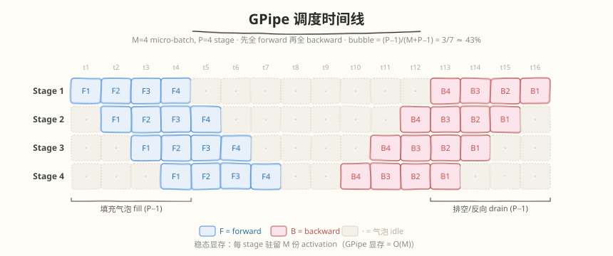
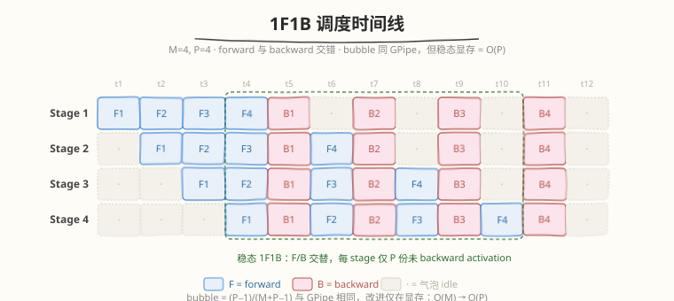
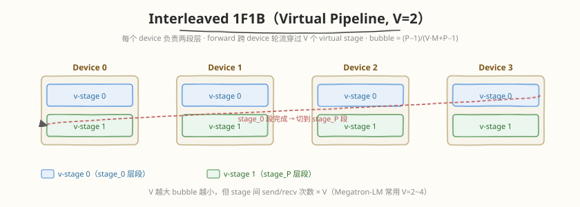
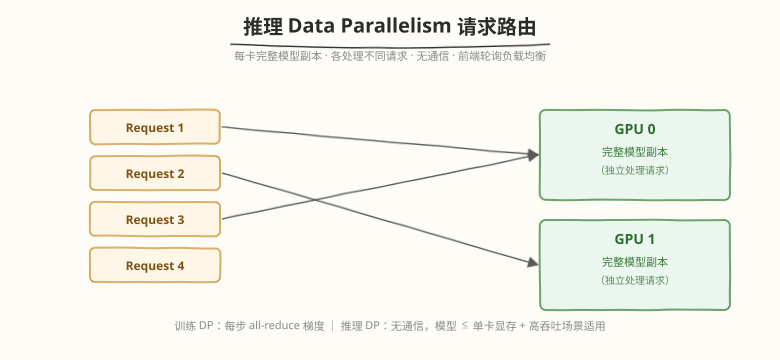

## Day 2：Pipeline Parallelism 与 DP —— 1F1B/bubble ratio/数据并行

### 🎯 目标

通过今天的学习，你将：

1. 深化 Day 1 的 PP 基础——从 GPipe 理解到 **1F1B 调度**的演进动机与内存优势<br>
2. 掌握 **bubble ratio** 公式 $\text{bubble} = (P-1)/(M+P-1)$，能计算不同 micro-batch 数 M 下的流水线气泡占比<br>
3. 理解 **DP（Data Parallelism）** 在推理中的定位——与训练 DP 的区别、高吞吐多请求场景的适用性<br>
4. 能推导 TP/PP/DP 三者的**通信量与显存权衡**，为给定模型选最优并行策略<br>
5. 理解 ** interleaved 1F1B**（virtual pipeline）如何进一步压缩 bubble<br>

> 💡 **为什么重要**：PP 的 bubble ratio 和 1F1B 调度是面试"大模型分布式训练/推理"的高频追问点。DP 在推理中的定位（vs 训练）也常被考察。Day 1 给了 TP/PP/DP 的概览，今天深化 PP 和 DP 的工程细节。

---

### 学前导读：从 GPipe 到 1F1B

Day 1 介绍了 PP 的基本概念：模型按层切分到 P 个 stage，micro-batch 流水线执行。但 Day 1 没展开 PP 的两种调度策略——GPipe 和 1F1B——以及它们的内存/气泡权衡：

| 调度 | 气泡占比 | 显存占用 | 复杂度 |
|------|---------|---------|--------|
| GPipe | (P-1)/(M+P-1) | 高（M 份 activation 同时驻留） | 简单 |
| **1F1B** | (P-1)/(M+P-1)（同） | **低**（稳态 1 份 activation） | 中 |
| Interleaved 1F1B | 更低 | 中 | 高 |

> 💡 **一句话总结**：1F1B 和 GPipe 的气泡相同，但 1F1B 的显存占用从 O(M) 降到 O(P)，是"相同速度 + 更省显存"的改进。

---

### 理论学习

#### 2.1 GPipe 调度

##### 执行模式

GPipe（2019）是最简单的 PP 调度：先做全部 forward，再做全部 backward。



- M=4 个 micro-batch，P=4 个 stage
- **填充气泡**（fill bubble）：前 P-1 步，后面的 stage 在等前面的 forward 到来
- **排空气泡**（drain bubble）：后 P-1 步，前面的 stage 在等 backward 回来
- 气泡总数 = 2(P-1)（fill + drain 各 P-1 步），总时间 = 2(M+P-1)，bubble ratio = 2(P-1) / 2(M+P-1) = (P-1)/(M+P-1)

##### GPipe 的显存问题

GPipe 在 forward 阶段要**保存所有 M 个 micro-batch 的 activation**（用于 backward）：

```
Stage 1 显存: M 份 activation × 层大小
```

M=4, 每份 activation 1GB → 4GB。大模型下显存压力大。

#### 2.2 1F1B 调度

##### 核心改进：交错 forward/backward

1F1B（One Forward One Backward）在 forward 第 i 个 micro-batch 后，尽快做 backward 第 i-(P-1) 个 micro-batch：



##### 显存优势

1F1B 的稳态阶段，每个 stage 只需保存 **P 份 activation**（而非 M 份）：

```
Stage i 在 forward 第 k 个 micro-batch 时, 已有未 backward 的 activation 数 = P (稳态)
```

| 调度 | 稳态 activation 数 | M=8, P=4 时 |
|------|-------------------|------------|
| GPipe | M | 8 份 |
| 1F1B | P | 4 份 |

##### 气泡相同

1F1B 的 bubble ratio 与 GPipe **相同**：`(P-1)/(M+P-1)`。改进只在于显存，不在于速度。

#### 2.3 Bubble Ratio 推导

##### 公式

```
bubble = (P - 1) / (M + P - 1)
```

- P = pipeline stage 数
- M = micro-batch 数
- 分子 P-1 = 简化后的气泡步数（原始 fill + drain 共 2(P-1) 步，分子分母同除 2 得 P-1）
- 分母 M+P-1 = 简化后的总步数（原始总时间 2(M+P-1)，同除 2 得 M+P-1）

##### 典型值

| M | P | bubble | 利用率 |
|---|---|--------|--------|
| 4 | 4 | 3/7 = 43% | 57% |
| 8 | 4 | 3/11 = 27% | 73% |
| 16 | 4 | 3/19 = 16% | 84% |
| 32 | 4 | 3/35 = 9% | 91% |
| 8 | 8 | 7/15 = 47% | 53% |
| 32 | 8 | 7/39 = 18% | 82% |

> 💡 **面试要点**：bubble 随 M 增大而减小，随 P 增大而增大。实践平衡点：M ≥ 4P（如 P=8 时 M≥32），bubble < 20%。

#### 2.4 Interleaved 1F1B（Virtual Pipeline）

##### 动机

标准 1F1B 的 bubble = (P-1)/(M+P-1)，当 P 大时（如 P=8）即使 M 大仍有可观气泡。

##### Interleaved 的思路

把每个 stage 的层再分成 V 个 **virtual stage**（sub-stage），让通信更频繁、bubble 更小：



##### Bubble 公式

```
interleaved bubble = (P - 1) / (V × M + P - 1)
```

V=1 退化为标准 1F1B（`(P-1)/(M+P-1)`）。V 越大 bubble 越小，但通信次数增 V 倍。注意公式分母多了 V 倍——把 M 个 micro-batch 切成 V 组轮流喂给 P 个 virtual stage，等效"工作总量"变为 V·M，气泡占比自然下降。

| V | P | M | bubble (标准 1F1B) | bubble (interleaved) |
|---|---|---|-------------|---------------------|
| 1 | 8 | 16 | 7/23 ≈ 30% | 30%（退化为标准） |
| 2 | 8 | 16 | 30% | 7/39 ≈ 18% |
| 4 | 8 | 16 | 30% | 7/71 ≈ 10% |

> ⚠️ **代价**：interleaved 增加通信次数 V 倍（每两个 virtual stage 之间一次 send/recv），且需要更复杂的调度。Megatron-LM 用 V=2~4。

#### 2.5 Data Parallelism（DP）在推理中的定位

##### 训练 DP vs 推理 DP

| 维度 | 训练 DP | 推理 DP |
|------|--------|--------|
| 目标 | 多卡并行梯度计算 | 多卡并行多请求 |
| 通信 | all-reduce 梯度（每步） | 无（各卡独立处理不同请求） |
| 模型副本 | 每卡完整模型 | 每卡完整模型 |
| 适用 | 大 batch 训练 | 高吞吐推理（多请求并发） |

##### 推理 DP 的通信

推理 DP **几乎无通信**——每个 worker 独立处理不同请求，只在前端做负载均衡：



##### DP + TP/PP 组合

| 策略 | 模型放置 | 通信 | 适用 |
|------|---------|------|------|
| DP only | 每卡完整模型 | 无 | 模型 ≤ 单卡显存，高吞吐 |
| TP only | 模型分到 N 卡 | all-reduce（每层） | 模型 > 单卡，低延迟 |
| DP + TP | TP 组内分模型，DP 组间复制 | TP 组内 all-reduce | 模型 > 单卡 + 高吞吐 |

> 💡 **面试要点**：推理中 DP 适合"模型能放进单卡 + 高吞吐"场景。模型放不下时用 TP/PP，再用 DP 做吞吐扩展。vLLM 的 `tensor_parallel_size` + `pipeline_parallel_size` + 数据并行就是这套。

##### 推理 PP 部署形态：vLLM `pipeline_parallel_size`

vLLM 通过 `pipeline_parallel_size`（简称 `pp_size`）配置 PP 度，与 `tensor_parallel_size`（`tp_size`）组合使用：

```python
from vllm import LLM
# TP=4 + PP=2：模型分到 8 张卡，每 4 张一组做 TP，两组间做 PP
llm = LLM(model="meta-llama/Llama-3-70B",
          tensor_parallel_size=4,
          pipeline_parallel_size=2)
```

PP 在推理框架中的实现要点：

| 维度 | 训练 PP | 推理 PP（vLLM） |
|------|---------|----------------|
| 调度 | 1F1B / Interleaved | 简化版流水（只有 forward） |
| bubble | $(P-1)/(M+P-1)$ | 通过 micro-batching prefill 降低 |
| 通信 | stage 间 send/recv activation | NCCL send/recv（hidden states） |
| 显存 | 每卡存 1/P 层权重 + activation | 同，但无 backward activation |
| 触发条件 | 模型 > 单卡显存 | TP=8 仍放不下时才加 PP |

> ⚠️ **PP vs TP 的取舍**：PP 有 bubble 开销且增加 latency（请求要串行穿过所有 stage），TP 无 bubble 但每层有 all-reduce。实践中优先 TP（到单卡显存上限），TP 不够再加 PP。vLLM 默认 `pp_size=1`，只有超大模型（如 70B+ on 8×A100）才设 `pp_size>1`。

#### 2.6 三维并行的通信量对比

| 并行 | 通信原语 | 通信量 | 频率 |
|------|---------|--------|------|
| DP (训练) | all-reduce | 2×模型参数量 | 每步 |
| DP (推理) | 无 | 0 | — |
| TP | all-reduce | 2×activation 大小 | 每层 |
| PP | send/recv | activation 大小 | 每 stage 边界 |
| EP | all-to-all | top-k×token×expert_dim | 每层 MoE |

##### 显存权衡

| 并行 | 显存节省 | 通信代价 |
|------|---------|---------|
| TP | 参数分到 N 卡，但 activation 不分 | 每层 all-reduce |
| PP | 参数 + activation 都分到 P 卡 | 每 stage 边界 send/recv + bubble |
| DP | 无显存节省（每卡完整副本） | 无（推理）/ all-reduce（训练） |

---

### Coding 任务

#### 任务 1：1F1B 调度模拟器

创建 `kernels/pipeline_schedule_sim.py`，模拟 GPipe vs 1F1B 的调度时间线：

```python
def simulate_gpipe(P, M):
    """模拟 GPipe 调度, 返回时间线和 bubble ratio.

    每个 stage 的 timeline 是 list of (phase, micro_batch, start, end).
    时间单位: 1 个 micro-batch 在一个 stage 上的执行时间 = 1.
    """
    timeline = [[] for _ in range(P)]
    # Forward phase: M 个 micro-batch 依次穿过 P 个 stage
    for m in range(M):
        for s in range(P):
            # start = max(全局游标, 该 stage 上一个任务的结束时间)
            prev_end = timeline[s][-1][3] if timeline[s] else 0
            start = max(prev_end, timeline[s-1][-1][3] if s > 0 and timeline[s-1] else 0)
            if m > 0 or s > 0:
                # 依赖前一个 stage 的同 micro-batch forward 完成
                if s > 0:
                    start = max(start, timeline[s-1][-1][3])
            timeline[s].append(('F', m, start, start + 1))
    # Backward phase: 反向, 从最后一个 stage 开始
    for m in reversed(range(M)):
        for s in reversed(range(P)):
            prev_end = timeline[s][-1][3] if timeline[s] else 0
            start = prev_end
            if s < P - 1:
                start = max(start, timeline[s+1][-1][3])
            timeline[s].append(('B', m, start, start + 1))
    total = max(ts[-1][3] for ts in timeline if ts)
    useful = 2 * M * P  # forward + backward, 每个 micro-batch 每个 stage 1 单位
    bubble = (total * P - useful) / (total * P)
    return timeline, bubble, total

def simulate_1f1b(P, M):
    """模拟 1F1B 调度 (steady-state interleaved forward/backward).

    1F1B 的关键: warmup 阶段每个 stage i 先做 P-1-i 个 forward,
    然后进入稳态 1F1B (forward + backward 交替),
    最后 cooldown 把剩余的 backward 做完.
    显存优势: 每个 stage 稳态只有 P 份未 backward 的 activation (GPipe 是 M 份).
    """
    timeline = [[] for _ in range(P)]
    # 用一个事件队列模拟: (time, stage, phase, micro_batch)
    # forward 依赖: stage 0 可立即开始; stage s 依赖 stage s-1 的同 micro forward
    # backward 依赖: stage P-1 forward 完成后可开始; stage s 依赖 stage s+1 的同 micro backward
    fwd_done = [[-1] * M for _ in range(P)]  # fwd_done[s][m] = end time, -1 = 未完成
    bwd_done = [[-1] * M for _ in range(P)]
    fwd_next = [0] * P   # 每个 stage 下一个要 forward 的 micro-batch
    bwd_next = [0] * M    # 占位, 用 bwd_count 代替
    bwd_count = [0] * P

    # 简化: 用 step-by-step 调度模拟 (每个时间步每个 stage 做一件事)
    t = 0
    fwd_remaining = M
    bwd_remaining = M
    # warmup: stage s 先做 P-1-s 个 forward (填充流水线)
    # 然后稳态: forward + backward 交替
    # cooldown: 把所有 backward 做完
    # 这里用贪心: 每个时间步, 每个 stage 优先做 1F1B (如果能 backward 就 backward, 否则 forward)
    total_ops = 2 * M * P
    done_ops = 0
    while done_ops < total_ops:
        scheduled_this_step = [False] * P
        for s in range(P):
            # 优先 backward (1F1B 稳态: forward 之后尽快 backward)
            can_bwd = False
            bwd_m = -1
            for m in range(M):
                if bwd_done[s][m] < 0:  # 未完成
                    # backward 依赖: stage s 的 forward 已完成, 且 stage s+1 的 backward 已完成 (或 s==P-1)
                    if fwd_done[s][m] >= 0 and t >= fwd_done[s][m]:
                        if s == P - 1:
                            can_bwd = True
                            bwd_m = m
                            break
                        elif bwd_done[s+1][m] >= 0 and t >= bwd_done[s+1][m]:
                            can_bwd = True
                            bwd_m = m
                            break
            if can_bwd:
                # 检查 stage 上一个任务的结束时间
                prev_end = timeline[s][-1][3] if timeline[s] else 0
                start = max(t, prev_end)
                timeline[s].append(('B', bwd_m, start, start + 1))
                bwd_done[s][bwd_m] = start + 1
                scheduled_this_step[s] = True
                done_ops += 1
                continue
            # 否则 forward
            can_fwd = False
            fwd_m = -1
            for m in range(M):
                if fwd_done[s][m] < 0:
                    if s == 0:
                        can_fwd = True
                        fwd_m = m
                        break
                    elif fwd_done[s-1][m] >= 0 and t >= fwd_done[s-1][m]:
                        can_fwd = True
                        fwd_m = m
                        break
            if can_fwd:
                prev_end = timeline[s][-1][3] if timeline[s] else 0
                start = max(t, prev_end)
                timeline[s].append(('F', fwd_m, start, start + 1))
                fwd_done[s][fwd_m] = start + 1
                scheduled_this_step[s] = True
                done_ops += 1
        t += 1
    total = max(ts[-1][3] for ts in timeline if ts)
    useful = 2 * M * P
    bubble = (total * P - useful) / (total * P)
    return timeline, bubble, total

# 对比
for P, M in [(4, 4), (4, 8), (8, 8), (8, 32)]:
    tl_g, bub_g, total_g = simulate_gpipe(P, M)
    tl_1, bub_1, total_1 = simulate_1f1b(P, M)
    print(f"P={P} M={M}: GPipe bubble={bub_g:.2%} (total={total_g}), "
          f"1F1B bubble={bub_1:.2%} (total={total_1})")
```

#### 任务 2：Bubble Ratio 计算器

```python
def bubble_ratio(P, M, V=1):
    if V == 1:
        return (P - 1) / (M + P - 1)
    else:
        return (P - 1) / (V * M + P - 1)

# 打印不同配置的 bubble
print("P | M | V | bubble")
for P in [4, 8]:
    for M in [4, 8, 16, 32]:
        for V in [1, 2, 4]:
            print(f"{P} | {M} | {V} | {bubble_ratio(P, M, V):.2%}")
```

#### 任务 3：LeetCode 面试题（10 周计划 · 第 9 周 Day 2）

> 📅 今日题目来自 [10 周算法面试刷题计划](https://hzchenxiaobin.github.io/leetcode/problems/10-week-plan.html) 第 9 周「动态规划进阶——子序列、区间与二维 DP」Day 2（回文与区间 DP），共 5 题。简单题快速过、中等题精做、困难题吃透；卡壳 20 分钟就看题解，看懂后自己默写一遍。

| 题目 | 难度 | 核心套路 | 题解 |
|------|------|---------|------|
| [647. 回文子串](https://leetcode.cn/problems/palindromic-substrings/) | 中等 | 中心扩展计数 | [题解](https://hzchenxiaobin.github.io/leetcode/problems/647_回文子串.html) |
| [516. 最长回文子序列](https://leetcode.cn/problems/longest-palindromic-subsequence/) | 中等 | 区间 DP / 反转 LCS | [题解](https://hzchenxiaobin.github.io/leetcode/problems/516_最长回文子序列.html) |
| [5. 最长回文子串](https://leetcode.cn/problems/longest-palindromic-substring/) | 中等 | 中心扩展 / Manacher | [题解](https://hzchenxiaobin.github.io/leetcode/problems/5_最长回文子串.html) |
| [312. 戳气球](https://leetcode.cn/problems/burst-balloons/) | 困难 | 区间 DP（最后戳谁） | [题解](https://hzchenxiaobin.github.io/leetcode/problems/312_戳气球.html) |
| [32. 最长有效括号](https://leetcode.cn/problems/longest-valid-parentheses/) | 困难 | DP / 栈 | [题解](https://hzchenxiaobin.github.io/leetcode/problems/32_最长有效括号.html) |

---

### 扩展实验

#### 实验 1：Interleaved 1F1B 调度模拟

扩展模拟器支持 V=2/4 的 interleaved 调度，对比 bubble 和通信次数。

#### 实验 2：显存占用模拟

模拟 GPipe vs 1F1B 的峰值显存（稳态 activation 数），验证 1F1B 的显存优势。

---

### 今日总结

1. **1F1B vs GPipe**：气泡相同，但 1F1B 稳态显存从 O(M) 降到 O(P)
2. **Bubble ratio**：`(P-1)/(M+P-1)`，M≥4P 时 < 20%
3. **Interleaved 1F1B**：V 个 virtual stage，bubble 降为 `(P-1)/(VM+P-1)`，代价是通信增 V 倍
4. **推理 DP**：无通信，每卡独立处理请求，适合"模型 ≤ 单卡 + 高吞吐"
5. **三维并行**：TP（每层 all-reduce）+ PP（stage 边界 send/recv + bubble）+ DP（无通信）的组合

---

### 面试要点

1. **1F1B 和 GPipe 的区别是什么？为什么 1F1B 更省显存？**

   <details>
   <summary>答案</summary>

   - **气泡相同**：都是 `(P-1)/(M+P-1)`
   - **显存差异**：GPipe 稳态保存 M 份 activation，1F1B 只保存 P 份
   - **原因**：1F1B 在 forward 第 k 个 micro-batch 后尽快 backward 第 k-(P-1) 个，释放 activation
   - **稳态**：1F1B 的每个 stage 同时只有 P 份未 backward 的 activation

   </details>

2. **Pipeline 的 bubble ratio 怎么算？如何减少？**

   <details>
   <summary>答案</summary>

   - 公式：`bubble = (P-1)/(M+P-1)`
   - 减少 bubble 的方法：
     1. 增大 M（micro-batch 数）——M≥4P 时 bubble < 20%
      2. Interleaved 1F1B（V 个 virtual stage）——bubble 降为 `(P-1)/(VM+P-1)`
     3. 减小 P（但会增大单 stage 显存）
   - 代价：interleaved 增加通信次数 V 倍

   </details>

3. **推理中的 DP 和训练中的 DP 有什么区别？**

   <details>
   <summary>答案</summary>

   - 训练 DP：每卡完整模型副本，每步 all-reduce 梯度
   - 推理 DP：每卡完整模型副本，各处理不同请求，**无通信**
   - 推理 DP 适合"模型 ≤ 单卡 + 高吞吐"场景
   - 模型放不下时用 TP/PP，再用 DP 做吞吐扩展（DP + TP 组合）

   </details>

4. **TP/PP/DP 三者的通信量怎么比较？**

   <details>
   <summary>答案</summary>

   - TP：每层 all-reduce，通信量 = 2×activation 大小（频率最高）
   - PP：每 stage 边界 send/recv，通信量 = activation 大小（频率低但有 bubble）
   - DP（训练）：每步 all-reduce 梯度，通信量 = 2×参数量（频率中）
   - DP（推理）：无通信
   - EP：每层 MoE all-to-all，通信量 = top-k×token×expert_dim

   </details>
