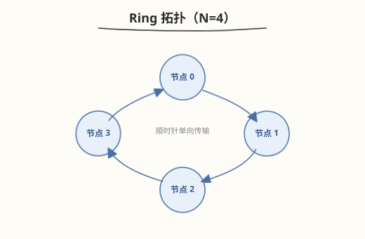
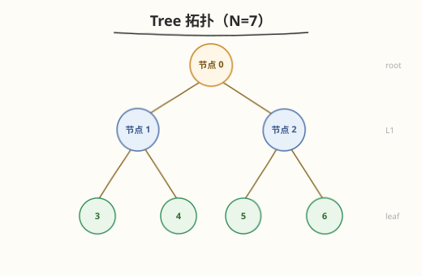

## Day 3：NCCL Collectives —— all-reduce/all-gather/reduce-scatter 通信量

### 🎯 目标

通过今天的学习，你将：

1. 掌握 NCCL 三大 collectives 的语义与通信量公式——all-reduce、all-gather、reduce-scatter<br>
2. 理解 **ring 拓扑**的通信步数推导——all-reduce 为什么是 `2(N-1)` 步<br>
3. 能对比 **ring vs tree** 拓扑的通信模式与适用场景<br>
4. 理解 TP 的 all-reduce、EP 的 all-to-all、ZeRO 的 reduce-scatter 各自的通信量<br>
5. 能为给定并行策略计算通信量，判断通信是否瓶颈<br>

> 💡 **为什么重要**：NCCL 是分布式训练/推理的通信底座。面试常问"all-reduce 通信量怎么算""ring 拓扑几步完成"。Day 1 给了 NCCL 概览，今天深化三大 collectives 的通信量推导。

---

### 学前导读：从"调 NCCL API"到"理解通信量"

Day 1 用 `torch.distributed.all_reduce` 做了 TP 的通信。但调用 API 不等于理解通信——面试官会追问"all-reduce 在 8 卡上要几步通信？每步传多少数据？"。

| Collective | 语义 | 通信量（每节点） | 步数（ring） |
|-----------|------|----------------|------------|
| all-reduce | 所有节点得到相同的 sum | 2×(N-1)/N × 数据量 | 2(N-1) |
| all-gather | 所有节点得到完整数据 | (N-1)/N × 数据量 | N-1 |
| reduce-scatter | 所有节点得到不同的分片 | (N-1)/N × 数据量 | N-1 |

> 💡 **一句话总结**：all-reduce = reduce-scatter + all-gather，所以是 2(N-1) 步。

---

### 理论学习

#### 3.1 Ring All-Reduce

##### 通信过程

N 个节点排成环，数据分成 N 块。All-reduce 分两个阶段：

**阶段 1：Reduce-Scatter（N-1 步）**
```
每步: 每节点把自己的第 i 块发给右邻, 接收左邻的第 i-1 块并累加
N-1 步后: 每节点拥有一个完整的 reduced 块（不同节点拥有不同块）
```

**阶段 2：All-Gather（N-1 步）**
```
每步: 每节点把自己的完整块发给右邻
N-1 步后: 每节点拥有所有 N 个完整块 = all-reduced 完整数据
```

##### 通信量

- 每节点每步发 1/N 数据量
- 总步数 2(N-1)
- 每节点总通信量 = 2(N-1) × (1/N) × 数据量 = **2(N-1)/N × 数据量**

##### 示例（N=4, 数据 4GB）

```
Reduce-Scatter (3 步):
  每步每节点发 1GB → 总发 3GB
All-Gather (3 步):
  每步每节点发 1GB → 总发 3GB
每节点总通信量: 6GB = 2×(4-1)/4 × 4GB = 6GB ✓
```

#### 3.2 All-Gather

##### 语义

每个节点有数据的一个分片，all-gather 后所有节点拥有完整数据。

##### Ring 实现

```
N-1 步: 每节点把自己的分片发给右邻, 接收左邻的分片
N-1 步后: 每节点拥有所有 N 个分片 = 完整数据
```

##### 通信量

- 每节点总通信量 = (N-1) × (1/N) × 数据量 = **(N-1)/N × 数据量**

##### 用途

- TP 的 column-parallel：各卡有自己 head 的结果，all-gather 拼成完整输出
- ZeRO-3 的参数收集

#### 3.3 Reduce-Scatter

##### 语义

每个节点有完整数据，reduce-scatter 后每个节点拥有 reduced 结果的一个分片。

##### Ring 实现

```
N-1 步: 每节点把一个块发给右邻, 接收左邻的块并累加
N-1 步后: 每节点拥有一个 reduced 分片
```

##### 通信量

- 每节点总通信量 = (N-1) × (1/N) × 数据量 = **(N-1)/N × 数据量**

##### 用途

- ZeRO 的梯度分片
- all-reduce 的前半段

#### 3.4 三者关系

```
all-reduce = reduce-scatter + all-gather
通信量: all-reduce (2(N-1)/N) = reduce-scatter ((N-1)/N) + all-gather ((N-1)/N)
```

| Collective | 通信量 | 步数 | 结果 |
|-----------|--------|------|------|
| reduce-scatter | (N-1)/N × D | N-1 | 每节点一个分片 |
| all-gather | (N-1)/N × D | N-1 | 每节点完整数据 |
| all-reduce | 2(N-1)/N × D | 2(N-1) | 每节点完整 reduced 数据 |

#### 3.5 Ring vs Tree 拓扑

##### Ring 拓扑



- 优点：带宽利用率高（每步每节点都在发/收）
- 缺点：步数多（2(N-1)），大 N 时延迟累积
- 适用：N ≤ 8（单机）、大消息

##### Tree 拓扑



- 优点：步数少（`log N`）
- 缺点：根节点带宽瓶颈
- 适用：小消息、大 N

##### NCCL 的混合策略

NCCL 默认用 **ring**（大消息）+ **tree**（小消息）混合：
- 大消息：ring 带宽利用率高
- 小消息：tree 延迟低
- 阈值：通常 ~1KB-4KB

#### 3.6 各并行的通信量

##### Tensor Parallelism (TP)

每层 forward 结束做 all-reduce：
```
通信量/层 = 2(N-1)/N × activation_size
activation_size = batch × seq_len × hidden_dim × sizeof(dtype)
```

N=8, batch=1, seq=2048, hidden=4096, FP16:
```
= 2×7/8 × 1×2048×4096×2 = 28.7 MB/层
```

##### Pipeline Parallelism (PP)

每 stage 边界做 send/recv：
```
通信量/stage = activation_size
```
（比 TP 少一个 all-reduce，但有 bubble）

##### Expert Parallelism (EP)

每层 MoE 做 all-to-all dispatch + all-to-all combine：
```
通信量/层 = 2 × tokens × top_k × expert_dim × sizeof(dtype)
```

##### Data Parallelism (DP, 训练)

每步 all-reduce 梯度：
```
通信量/步 = 2(N-1)/N × model_size
```

#### 3.7 GPU 互联带宽常识与 α-β 通信模型

##### 互联带宽速查

通信时间不仅取决于通信量，还取决于**物理互联带宽**。不同互联方式的带宽差异巨大：

| 互联类型 | 单向带宽 | 典型延迟 | 适用场景 |
|---------|---------|---------|---------|
| **NVLink 4**（H100） | **~450 GB/s**（双向 ~900） | ~1-2 μs | 同节点 8 GPU 互联 |
| **NVLink 3**（A100） | ~300 GB/s（双向 ~600） | ~1-2 μs | 同节点 8 GPU 互联 |
| **PCIe 5.0 x16** | ~64 GB/s | ~5-10 μs | 同节点 GPU-CPU / GPU-GPU（无 NVLink） |
| **PCIe 4.0 x16** | ~32 GB/s | ~5-10 μs | 同节点（老平台） |
| **InfiniBand HDR**（CX-6） | ~50 GB/s（200 Gb/s） | ~1-2 μs | 跨节点 GPU 互联 |
| **InfiniBand NDR**（CX-7） | ~100 GB/s（400 Gb/s） | ~1-2 μs | 跨节点（最新集群） |
| **RoCE v2**（200G） | ~25 GB/s | ~2-5 μs | 跨节点（以太网替代 IB） |

> 💡 **面试口述**：同节点 GPU 间走 NVLink（~450 GB/s），跨节点走 IB/RoCE（~50-100 GB/s）。NVLink 带宽是 IB 的 ~5-10 倍，所以分布式推理优先在同节点内做 TP（高带宽、低延迟），跨节点做 PP/DP（通信量小、容忍高延迟）。

##### α-β 通信模型

把通信时间拆成**启动延迟 $\alpha$ + 数据传输 size/BW**：

$$T_{\text{comm}} = \alpha + \frac{\text{size}}{\text{BW}}$$

| 参数 | 含义 | 典型值（NVLink 4） |
|------|------|------------------|
| $\alpha$ | 启动延迟（latency） | ~1-2 μs |
| BW | 带宽（bandwidth） | ~450 GB/s |
| size | 传输数据量（bytes） | 由 collective + tensor 大小决定 |

**应用示例**：TP all-reduce 28.7 MB（§3.6 TP 示例）走 NVLink 4：

```
T_comm = 2 μs + 28.7 MB / 450 GB/s = 2 μs + 63.8 μs ≈ 65.8 μs
```

走 IB NDR（跨节点）：

```
T_comm = 2 μs + 28.7 MB / 100 GB/s = 2 μs + 287 μs ≈ 289 μs
```

> 💡 **关键洞察**：
> - **大消息**（$\text{size} \gg \alpha \times \text{BW}$）：$\alpha$ 可忽略，$T \approx \text{size}/\text{BW}$，带宽主导
> - **小消息**（$\text{size} \ll \alpha \times \text{BW}$）：$T \approx \alpha$，延迟主导，此时用 tree all-reduce（步数 $\log N$）比 ring（步数 $2(N-1)$）快
> - NVLink 4 的 $\alpha \times \text{BW} \approx 2\,\mu\text{s} \times 450\,\text{GB/s} \approx 900\,\text{KB}$，所以 >1MB 的消息是带宽主导，<100KB 是延迟主导

##### 从通信量到通信时间

有了 §3.6 的通信量公式和本节的带宽/延迟，就能估算并行策略的通信开销：

| 并行 | 通信量 | 走 NVLink 4 的时间 | 走 IB NDR 的时间 |
|------|--------|-------------------|-----------------|
| TP all-reduce（28.7 MB） | 2×7/8×28.7 | ~66 μs | ~289 μs |
| PP send/recv（16.8 MB） | 16.8 | ~39 μs | ~170 μs |
| DP（推理） | 0 | 0 | 0 |

> ⚠️ **估算 vs 实测**：上表是理论估算，实际 wall-clock 还含 NCCL 内部优化（fusion、pipeline）、launch overhead、同步等待。用 `dist_allreduce_demo.py`（见 Coding 任务）实测对比。

---

### Coding 任务

#### 任务 1：通信量计算器

```python
def comm_cost(collective, data_size, N):
    if collective == "all_reduce":
        return 2 * (N - 1) / N * data_size, 2 * (N - 1)
    elif collective == "all_gather":
        return (N - 1) / N * data_size, N - 1
    elif collective == "reduce_scatter":
        return (N - 1) / N * data_size, N - 1

# TP all-reduce 通信量
for N in [2, 4, 8]:
    cost, steps = comm_cost("all_reduce", 1*2048*4096*2, N)  # batch×seq×hidden×FP16
    print(f"TP all-reduce N={N}: {cost/1e6:.2f} MB, {steps} steps")
```

#### 任务 2：NCCL Ring All-Reduce 模拟

```python
import numpy as np

def ring_all_reduce(data_chunks, N):
    """模拟 ring all-reduce, 返回每步通信"""
    # data_chunks: list of N arrays
    steps = []
    # Reduce-scatter phase
    for step in range(N - 1):
        # 每节点发 chunk[i], 收 chunk[(i-1) % N] 并累加
        ...
    # All-gather phase
    for step in range(N - 1):
        ...
    return steps

N = 4
chunks = [np.zeros(4) for _ in range(N)]
for i in range(N):
    chunks[i][i] = 1.0  # 每节点一个位置有 1
steps = ring_all_reduce(chunks, N)
print(f"Total steps: {len(steps)} (expect {2*(N-1)})")
```

#### 任务 3：LeetCode 面试题（10 周计划 · 第 9 周 Day 3）

> 📅 今日题目来自 [10 周算法面试刷题计划](https://hzchenxiaobin.github.io/leetcode/problems/10-week-plan.html) 第 9 周「动态规划进阶——子序列、区间与二维 DP」Day 3（二维 DP），共 6 题。简单题快速过、中等题精做、困难题吃透；卡壳 20 分钟就看题解，看懂后自己默写一遍。

| 题目 | 难度 | 核心套路 | 题解 |
|------|------|---------|------|
| [62. 不同路径](https://leetcode.cn/problems/unique-paths/) | 中等 | 组合数 / 二维 DP | [题解](https://hzchenxiaobin.github.io/leetcode/problems/62_不同路径.html) |
| [64. 最小路径和](https://leetcode.cn/problems/minimum-path-sum/) | 中等 | 二维 DP | [题解](https://hzchenxiaobin.github.io/leetcode/problems/64_最小路径和.html) |
| [120. 三角形最小路径和](https://leetcode.cn/problems/triangle/) | 中等 | 二维 DP（自底向上） | [题解](https://hzchenxiaobin.github.io/leetcode/problems/120_三角形最小路径和.html) |
| [1143. 最长公共子序列](https://leetcode.cn/problems/longest-common-subsequence/) | 中等 | 二维 DP（LCS） | [题解](https://hzchenxiaobin.github.io/leetcode/problems/1143_最长公共子序列.html) |
| [72. 编辑距离](https://leetcode.cn/problems/edit-distance/) | 困难 | 二维 DP（insert/delete/replace） | [题解](https://hzchenxiaobin.github.io/leetcode/problems/72_编辑距离.html) |
| [221. 最大正方形](https://leetcode.cn/problems/maximal-square/) | 中等 | DP（右下角最长边） | [题解](https://hzchenxiaobin.github.io/leetcode/problems/221_最大正方形.html) |

---

### 今日总结

1. **all-reduce = reduce-scatter + all-gather**，通信量 2(N-1)/N × D，步数 2(N-1)
2. **all-gather / reduce-scatter** 各 (N-1)/N × D，步数 N-1
3. **Ring 拓扑**：大消息带宽利用率高，步数多；**Tree 拓扑**：小消息延迟低，步数少
4. **TP**：每层 all-reduce activation；**PP**：每 stage send/recv；**EP**：每层 all-to-all；**DP**：每步 all-reduce 梯度

---

### 面试要点

1. **Ring all-reduce 的通信量是多少？怎么推导？**

   <details>
   <summary>答案</summary>

   - 通信量 = 2(N-1)/N × 数据量
   - 推导：reduce-scatter (N-1 步, 每步发 1/N 数据) + all-gather (N-1 步, 同)
   - 每节点总发/收 = 2 × (N-1) × (1/N) × D = 2(N-1)/N × D
   - 步数 = 2(N-1)

   </details>

2. **all-reduce、all-gather、reduce-scatter 的关系是什么？**

   <details>
   <summary>答案</summary>

   - all-reduce = reduce-scatter + all-gather
   - reduce-scatter：完整数据 → 每节点一个 reduced 分片
   - all-gather：分片 → 每节点完整数据
   - 通信量：all-reduce (2(N-1)/N) = reduce-scatter ((N-1)/N) + all-gather ((N-1)/N)

   </details>

3. **Ring 和 tree 拓扑各有什么优缺点？NCCL 怎么选？**

   <details>
   <summary>答案</summary>

   - Ring：带宽利用率高（每步每节点都在发收），步数多 2(N-1)，适合大消息 + 小 N
   - Tree：步数少 log N，根节点带宽瓶颈，适合小消息 + 大 N
   - NCCL 混合：大消息用 ring，小消息用 tree，阈值 ~1-4KB

   </details>
