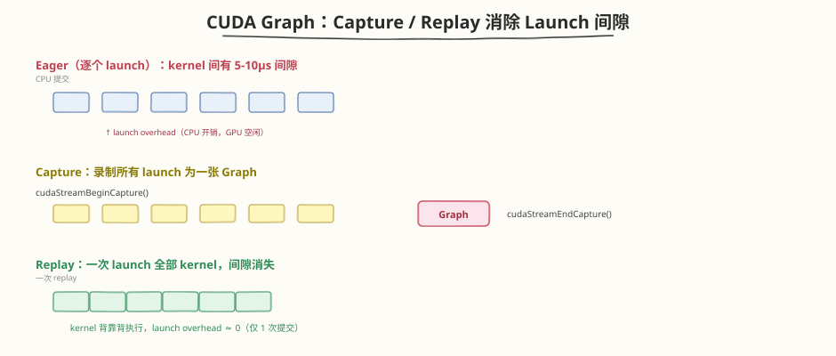
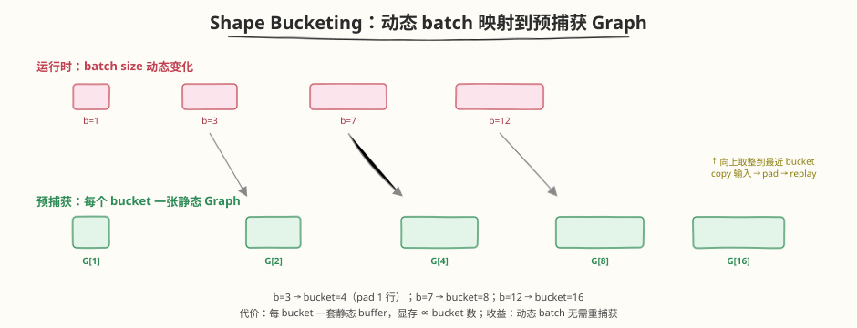

## Day 4：CUDA Graph 实操 —— 消除 Launch OverheadCUDA Graph 实操 —— 消除 Kernel Launch Overhead

### 🎯 目标

通过今天的学习，你将：

1. 理解 **launch overhead 本质**——每次 kernel launch 有 5-10μs 的 CPU 提交开销（驱动态切换、kernel descriptor 组装、stream 入队），与 kernel 自身耗时无关<br>
2. 掌握 **CUDA Graph 原理**——capture（录制 kernel launch 序列为一张 DAG 图）/ replay（一次提交回放整图）两阶段模式，把 N 次 launch 压成 1 次<br>
3. 学会 **PyTorch CUDA Graph API**——`torch.cuda.CUDAGraph`、`capture_begin/end`、`graph.replay()`、静态 buffer 模式（输入输出必须固定地址）<br>
4. 能 **量化 launch overhead 占比**——Decode 阶段 M=1 时 kernel 极快（μs 级），launch 开销占比可达 **50%+**，是 CUDA Graph 收益最大的场景<br>
5. 掌握 **动态 shape 处理**——shape bucketing（按 batch size 分桶预捕获）、`cudaGraphExecUpdate`（拓扑不变只改参数时原地更新可执行图）<br>
6. 用 Python 手写 **CUDA Graph capture + shape bucketing** 两个脚本，实测 eager vs graph replay 的延迟差距与正确性一致性

> 💡 **为什么重要**：Day 6 的全链路 Profiling 把"kernel launch overhead"列为五大系统级瓶颈之一，并给出优化优先级"CUDA Graph > 官方 kernel > C++ Scheduler"——但 Day 6 只停留在"识别瓶颈"，没有动手消除它。Decode 阶段每生成一个 token 就跑一遍 forward，而 M=1 时每个 kernel 只有几 μs，**纯 launch 开销却要 5-10μs/个**，几十个 kernel 叠加后 launch 占比常超 50%。CUDA Graph 是 vLLM / TensorRT-LLM 在 decode 路径的标配优化（vLLM 默认开启 `enforce_eager=False` 即用 graph）。今天把 Day 6 识别出的瓶颈真正消除，是 Mini 引擎从"知道慢在哪"走向"把它变快"的关键一步——这是面试高频题"CUDA Graph 怎么用、动态 shape 怎么办"。

---

### 学前导读：Launch Overhead 是 Decode 的瓶颈

Day 6 的 profiling 报告里有这样一行：

```
瓶颈 Top3:
  #2: Kernel Launch — kernel 间隙 5-10μs，小 kernel 多
  优化: CUDA Graph、算子融合
```

但"kernel 间隙 5-10μs"在 **Prefill** 和 **Decode** 两个阶段的影响完全不同：

```
Prefill 阶段（M = prompt_len，如 512）：
  - 单个 GEMM kernel 耗时 ~1-5ms（大矩阵，算力受限）
  - launch overhead 5-10μs 占比 < 1% → 几乎无感
  - → CUDA Graph 收益小

Decode 阶段（M = 1，逐 token 生成）：
  - 单个 GEMM kernel 耗时 ~5-50μs（小矩阵，launch 受限）
  - launch overhead 5-10μs 占比 30-60% → 严重浪费
  - 一个 forward 有 30-100 个 kernel，纯 launch 就 0.3-1ms
  - → CUDA Graph 收益极大（launch 降 80%+，端到端降 10-30%）
```

| 阶段 | M | 单 kernel 耗时 | launch overhead | launch 占比 | CUDA Graph 收益 |
|------|---|---------------|----------------|------------|----------------|
| **Prefill** | 大（~512） | 1-5 ms | 5-10 μs | < 1% | 小（~1-3%） |
| **Decode** | 1 | 5-50 μs | 5-10 μs | **30-60%** | **大（10-30%）** |

> 💡 **一句话总结**：CUDA Graph 不是"万能加速器"，它专治 **launch-bound** 场景——Decode M=1 是典型，Prefill M 大时收益甚微。这就是为什么 vLLM 只对 decode 路径开 CUDA Graph，prefill 仍走 eager。

---

### 理论学习

#### 1.1 Launch Overhead 分析

##### 每次 launch 到底慢在哪

一次 `cudaKernelLaunch`（或 PyTorch 里一次 op 调用）在 CPU 侧要完成：

```
1. 解析 kernel 参数 → 组装 kernel descriptor（参数指针、grid/block dim、shared mem）
2. 驱动态切换（user → driver）+ stream 入队
3. GPU command processor 取出该 launch，配置 grid/block
4. kernel 实际开始执行
```

其中 1-3 是 **CPU 侧串行开销**，与 kernel 计算量无关，典型 5-10μs。第 4 步才是 GPU 真正算的时间。如果 kernel 本身只要 5μs，那 launch 开销就和计算平起平坐了。

##### 量化：Decode 一步 forward 的 launch 占比

假设一个 12 层 Transformer，每层 forward 约 8 个 kernel（QKV、attn、out、FFN1、FFN2、2×LN、sampling），共 ~96 个 kernel：

```
Decode M=1 估算（单 kernel ~10μs 计算 + 7μs launch）：
  计算总时间 = 96 × 10μs = 0.96 ms
  launch 总时间 = 96 × 7μs  = 0.67 ms
  端到端       = 1.63 ms
  launch 占比  = 0.67 / 1.63 ≈ 41%
```

| 场景 | kernel 数 | 单 kernel 计算 | launch/个 | launch 占比 |
|------|----------|---------------|-----------|------------|
| Prefill M=512 | ~96 | 2 ms | 7 μs | 0.3% |
| Decode M=1 | ~96 | 10 μs | 7 μs | **41%** |
| Decode M=1（小模型） | ~48 | 5 μs | 7 μs | **58%** |

> ⚠️ **nsys 上的表现**：timeline 上看到 kernel 之间有明显的"空白带"（GPU 空闲），CPU 段却在疯狂提交——这就是 launch-bound。空白带宽 ≈ launch overhead。Day 6 的 nsys 截图里 decode 段 kernel 稀疏、间隙大，正是此症状。

#### 1.2 CUDA Graph 原理



CUDA Graph 把"一系列 kernel launch"录制为一张 **DAG 图**（节点 = kernel，边 = 依赖），回放时由 GPU 端的 **graph executor** 一次性提交整图，CPU 只介入 1 次。

##### Capture / Replay 两阶段

```
阶段 1 — Capture（录制，只做一次）：
  cudaStreamBeginCapture(stream, mode=THREAD_LOCAL)
    → 在该 stream 上跑一遍要录制的 kernel 序列
    → 驱动记录每个 launch 的参数与依赖，构建 cudaGraph_t
  cudaStreamEndCapture(stream, &graph)
  cudaGraphInstantiate(&graphExec, graph, ...)   // 编译为可执行实例

阶段 2 — Replay（每次执行）：
  cudaGraphLaunch(graphExec, stream)   // 一次调用提交整张图
  // CPU 立即返回，GPU 端 graph executor 背靠背执行所有 kernel
```

##### 为什么能消除 launch overhead

| 模式 | CPU 提交次数 | GPU 空闲 |
|------|------------|---------|
| Eager | N（每个 kernel 一次） | 每次 launch 间隙 5-10μs |
| Graph Replay | **1**（整图一次） | 几乎为零（kernel 背靠背） |

- Capture 时所有参数解析、descriptor 组装都已**固化**进 graph
- Replay 时 graph executor 在 GPU 侧直接派发下一个 kernel，**无需 CPU 再介入**
- N 个 kernel 的 N 次 CPU↔driver 切换 → 1 次

##### 静态 shape 限制

> ⚠️ **CUDA Graph 的硬约束**：capture 后 **shape、kernel 拓扑、指针地址** 都被固化。replay 时若 shape 变了或新增了 kernel，graph 不匹配会报错或静默错误。
>
> - **shape 静态**：tensor 的每个维度在 capture 时固定，replay 只能换"数值"不能换"形状"
> - **指针静态**：输入输出 tensor 必须用**固定地址的静态 buffer**，replay 前 `copy_()` 写入新数据
> - **控制流静态**：if/else 分支在 capture 时走哪条就固化哪条，运行时不能切
>
> 这正是 Decode 的福音（每步 shape 固定 M=1）和 Prefill 的噩梦（shape 随 prompt 长度变化）。

#### 1.3 PyTorch CUDA Graph

PyTorch 把 CUDA Graph 封装为 `torch.cuda.CUDAGraph`，典型用法是 **static buffer + capture context** 模式：

```python
import torch

# 1) 静态 buffer（地址在 capture 后不可变）
static_in = torch.zeros(B, D, device="cuda")

# 2) warmup：capture 前必须跑几次，初始化 lazy cuBLAS / autotune / cache
for _ in range(3):
    out = model(static_in)
torch.cuda.synchronize()

# 3) capture：在专用 side stream 上录制
g = torch.cuda.CUDAGraph()
s = torch.cuda.Stream()
s.wait_stream(torch.cuda.current_stream())
with torch.cuda.stream(s):
    g.capture_begin()
    static_out = model(static_in)        # 录制 model 的所有 kernel
    g.capture_end()
torch.cuda.current_stream().wait_stream(s)

# 4) replay：换输入数据 → replay → 取静态输出
static_in.copy_(new_input)               # 写入新数据（地址不变）
g.replay()                                # 一次提交整图
result = static_out.clone()               # 拷走结果
```

##### 关键 API

| API | 作用 |
|-----|------|
| `torch.cuda.CUDAGraph()` | 创建一个 graph 容器 |
| `g.capture_begin()` | 进入录制模式（当前 stream 上的 op 被记录） |
| `g.capture_end()` | 结束录制，graph 固化 |
| `g.replay()` | 回放整张图（一次 launch） |
| `torch.cuda.graph(g)` | 上下文管理器，等价于 capture_begin/end 配对 |

##### 三个必踩的坑

> ⚠️ **坑 1：忘记 warmup**。cuBLAS 首次调用会 lazy 初始化 + autotune（选 GEMM kernel），若在 capture 中触发，会录进图导致 replay 异常。**必须 capture 前跑 3-5 次 eager**。
>
> ⚠️ **坑 2：capture 中分配新显存**。capture 期间任何 `torch.zeros/randn`（新 tensor）都会进图，replay 时这些分配是"虚拟"的——可能地址冲突或泄漏。**capture 中只用静态 buffer，禁止新建 tensor**（PyTorch 的 `make_graphed_callables` 会自动处理 pool）。
>
> ⚠️ **坑 3：输入用了非静态地址**。`model(new_input)` 直接传新 tensor，replay 时 graph 仍读旧地址 → 结果错乱。**必须 `static_in.copy_(new_input)` 后 replay**。

> 💡 **快捷方式**：`torch.cuda.make_graphed_callables(model, sample_input)` 自动完成 warmup + 静态 buffer + capture，返回一个可像原 model 一样调用、内部走 replay 的 wrapper。适合简单模型；生产系统（vLLM）为精细控制仍手写 capture。

#### 1.4 动态 Shape 处理



CUDA Graph 要求静态 shape，但推理时 **batch size 随请求数变化**（continuous batching 下每步 batch 都不同）。三种应对方案：

##### 方案 1：Shape Bucketing（主流）

为一批"典型 batch size"各预捕获一张 graph，运行时选**最近的 bucket（向上取整）**，把输入 pad 到 bucket 大小后 replay：

```python
BUCKETS = [1, 2, 4, 8, 16]     # 按 GPU 显存与请求分布选

def pick_bucket(b):
    for bk in BUCKETS:
        if bk >= b:
            return bk
    return BUCKETS[-1]          # 超过最大桶 → 回退 eager 或扩桶

# 预捕获：每个 bucket 一张 graph + 一套静态 buffer
for b in BUCKETS:
    static_in[b] = torch.zeros(b, max_seq, d, device="cuda")
    # warmup + capture → graphs[b]

# 运行时
bk = pick_bucket(cur_batch)
static_in[bk][:cur_batch] = x        # 写入有效部分，其余 padding
graphs[bk].replay()
out = static_out[bk][:cur_batch]     # 截取有效输出
```

| bucket 数 | 显存占用 | 覆盖度 | 适用 |
|-----------|---------|--------|------|
| 少（3-5） | 低 | 有 padding 浪费 | 显存紧张 |
| 多（8-16） | 高 | 浪费少 | 显存充裕、batch 分布广 |

> 💡 **bucket 选取经验**：按请求 batch 的实际分布选，覆盖 P99 即可。vLLM 默认按 `max_num_seqs` 等距分桶，padding 浪费通常 < 10%。

##### 方案 2：cudaGraphExecUpdate（拓扑不变时）

如果 kernel 拓扑没变、只是某些**参数值**变了（如 kernel 的 grid dim 因 batch 变了），可用 `cudaGraphExecUpdate` 原地更新已实例化的可执行图，**无需重新 instantiate**：

```
cudaGraphExecUpdate(graphExec, newGraph, &updateResult)
  → 若拓扑一致（节点数、边、kernel 类型不变），返回 success
  → graphExec 的参数被更新为 newGraph 的值
  → 比重新 instantiate 快 5-10x
```

适用场景：batch 变了但 kernel 序列没变（只是 grid/block dim 调整）。PyTorch 暂未直接暴露此 API，C++ 扩展或 CUDA 原生可用。

##### 方案 3：回退 Eager

当 batch 超过最大 bucket、或 shape 完全不可预测（如变长 prefill），直接回退 eager 模式。vLLM 的策略：**decode 用 graph（shape 固定），prefill 用 eager（shape 动态）**。

##### 变长序列的处理

除了 batch 维，**序列长度**也常变化。配合 bucketing 的做法：

- **pad 到 max_seq_len**：静态 buffer 预留最大长度，短序列 padding，attention 用 mask 屏蔽
- **按 seq_len 分桶**：序列长度也分桶（如 {128, 256, 512, 1024}），与 batch 桶组合
- **KV Cache 复用**：padding 的部分不写 KV Cache，避免浪费显存

> 💡 **一句话总结**：动态 shape = bucketing（预捕获多张图）+ padding（凑静态 shape）+ 回退（超桶走 eager）。生产系统三者结合，decode 路径 90%+ 的 step 能命中 graph。

### Coding 任务：CUDA Graph capture + shape bucketing

#### 任务 1：创建 cuda_graph_capture.py

创建文件 [kernels/cuda_graph_capture.py](https://github.com/hzchenxiaobin/ai-infra-notes/blob/main/aiinfra/daily/week9/day4/kernels/cuda_graph_capture.py)，用 `torch.cuda.CUDAGraph` 捕获 Mini Engine 的单步 decode（embedding + LayerNorm + QKV + attention + out_proj + sampling），对比 eager vs graph replay：

```python
# cuda_graph_capture.py —— PyTorch CUDA Graph 捕获 Demo（Mini Engine Decode 单步）
# 运行命令: python cuda_graph_capture.py
# 依赖: torch + CUDA（单 GPU 即可）

class MiniDecodeStep(nn.Module):
    """简化单步 decode：embedding → LN → QKV → attn → out_proj → lm_head → argmax"""
    def forward(self, tok, past_kv):
        x = self.embed(tok); x = self.ln(x)
        qkv = self.qkv(x).reshape(B, 3, self.h, self.dh)
        q, k, v = qkv.unbind(dim=1)
        # ... attention（decode M=1，kernel 极快，launch 开销占比高）...
        return self.lm_head(x).argmax(dim=-1), (k, v)

# 1) warmup（capture 前必须跑，初始化 cuBLAS lazy / autotune）
for _ in range(3): eager()
torch.cuda.synchronize()

# 2) capture（side stream + 静态 buffer）
g = torch.cuda.CUDAGraph()
s = torch.cuda.Stream(); s.wait_stream(torch.cuda.current_stream())
with torch.cuda.stream(s):
    g.capture_begin()
    static_out, static_kv = step(static_tok, None)   # 录制所有 kernel
    g.capture_end()
torch.cuda.current_stream().wait_stream(s)

# 3) replay + torch.cuda.Event 计时对比
eager_ms  = measure(eager)    # 逐 kernel launch
graph_ms  = measure(replay)   # 一次 replay 整图
```

完整代码见 [kernels/cuda_graph_capture.py](https://github.com/hzchenxiaobin/ai-infra-notes/blob/main/aiinfra/daily/week9/day4/kernels/cuda_graph_capture.py)。

代码要点：
- `MiniDecodeStep`：单 token decode 的简化模型（embedding → LN → QKV → attn → out → lm_head → argmax），kernel 小而多，launch 占比高
- `measure`：用 `torch.cuda.Event(enable_timing=True)` 计时，warmup 5 次 + 平均 50 次，消除首次抖动
- capture 严格遵循三步：**warmup → side stream capture_begin/end → replay**，静态 buffer `static_tok`/`static_out` 地址固定
- 正确性校验：`torch.equal(y_eager, y_graph)` 确认 graph replay 结果与 eager 逐位一致

#### 任务 2：运行并对比 eager vs graph

```bash
python kernels/cuda_graph_capture.py

# 配合 nsys 看时间线
nsys profile -o cuda_graph --trace=cuda python kernels/cuda_graph_capture.py
nsys-ui cuda_graph.nsys-rep
# timeline 中 graph replay 段 kernel 间隙几乎消失（背靠背执行）
```

**预期输出**（节选，具体数值随 GPU 而变）：

```text
==============================================================
  CUDA Graph Capture Demo（Mini Decode 单步）
==============================================================
  d_model=512, heads=8, vocab=32000

  eager (逐 kernel launch) : 0.183 ms / step
  graph (一次 replay)      : 0.097 ms / step
  launch overhead 降低     : 47.0%
  加速比                   : 1.89x

  正确性: eager==graph ? PASS
    eager token : 28431, graph token : 28431

  nsys 可视化:
    nsys profile -o cuda_graph --trace=cuda python cuda_graph_capture.py
    # timeline 中 graph replay 段 kernel 间隙几乎消失
```

##### 观察重点

1. **加速比 1.5-2.5x**：decode M=1 时 launch 占比高，graph 收益明显；具体数值随 kernel 数与 GPU 型号变化
2. **正确性 PASS**：graph replay 与 eager 输出完全一致（确定性 op + 相同权重），证明 capture 无副作用
3. **nsys timeline**：eager 段 kernel 间有明显空白（launch overhead），graph replay 段 kernel 背靠背几乎无间隙
4. **首次 replay 不慢**：warmup 已把 cuBLAS autotune 跑完，capture 后 replay 无冷启动

> 思考：为什么 capture 前必须 warmup？（提示：cuBLAS 首次 GEMM 会 lazy 选 kernel + autotune，若在 capture 中触发，选 kernel 的逻辑会被录进图，导致 replay 异常或性能退化。）

#### 任务 3：创建并运行 shape_bucketing.py

创建文件 [kernels/shape_bucketing.py](https://github.com/hzchenxiaobin/ai-infra-notes/blob/main/aiinfra/daily/week9/day4/kernels/shape_bucketing.py)，为动态 batch 预捕获多个 graph：

```python
# shape_bucketing.py —— 动态 batch 的 Shape Bucketing CUDA Graph
# 运行命令: python shape_bucketing.py

class BucketedGraphRunner:
    """为每个 bucket 预捕获 graph，运行时按 batch 选最近 bucket 回放"""
    def __init__(self, model, buckets, max_seq, d):
        for b in buckets:
            self._capture(b, max_seq, d)     # 每个 bucket 一张图 + 静态 buffer

    def _capture(self, b, max_seq, d):
        sin = torch.zeros(b, max_seq, d, device="cuda")   # 静态输入
        # warmup → capture_begin → model(sin, smask) → capture_end

    def run(self, x, mask):
        bk = self._pick(x.shape[0])          # 向上取整到最近 bucket
        self.sin[bk][:x.shape[0]] = x        # 写入有效部分（其余 padding）
        self.graphs[bk].replay()
        return self.sout[bk][:x.shape[0]]    # 截取有效输出
```

完整代码见 [kernels/shape_bucketing.py](https://github.com/hzchenxiaobin/ai-infra-notes/blob/main/aiinfra/daily/week9/day4/kernels/shape_bucketing.py)。

运行：

```bash
python kernels/shape_bucketing.py
```

**预期输出**（节选，数值随 GPU 而变）：

```text
==============================================================
  Shape Bucketing CUDA Graph Demo
==============================================================
  buckets=[1, 2, 4, 8, 16], max_seq=128, d=512
  batch= 1 → bucket= 1 | graph 0.041 ms/step | max_diff=0.00e+00
  batch= 3 → bucket= 4 | graph 0.052 ms/step | max_diff=0.00e+00
  batch= 7 → bucket= 8 | graph 0.063 ms/step | max_diff=0.00e+00
  batch=12 → bucket=16 | graph 0.071 ms/step | max_diff=0.00e+00
  batch=16 → bucket=16 | graph 0.072 ms/step | max_diff=0.00e+00

  动态 batch 无需重捕获：运行时选最近 bucket，copy 输入后 replay
```

##### 观察重点

1. **bucket 映射**：b=3→bucket=4（pad 1 行）、b=7→bucket=8、b=12→bucket=16，向上取整正确
2. **正确性**：`max_diff=0`（mask 屏蔽 padding，有效部分输出与 eager 一致）
3. **无需重捕获**：任意 batch 都能立即 replay，无 capture 开销
4. **显存代价**：5 个 bucket × 静态 buffer，比单 graph 多占显存（trade-off）

> 思考：b=3 用 bucket=4 时，padding 那 1 行的计算是否浪费？（提示：是，padding 行仍参与 GEMM，但 attention 用 mask 屏蔽后不影响有效行输出。这就是 bucketing 的代价——用少量计算浪费换静态 shape。bucket 越密浪费越少但显存越多。）

#### 任务 4：LeetGPU 在线题目 —— Vector Addition

**题目链接**：<https://leetgpu.com/challenges/vector-addition>

**与今日知识的关联**：Vector Addition 是最典型的 **launch-overhead-dominated** kernel——它是纯 element-wise 操作，计算量极低（每元素一次加法），kernel 自身耗时往往不到 1μs，而 launch overhead 却要 5-10μs。换言之，跑这个 kernel 时 **80%+ 的时间花在 launch 上、不到 20% 在算**。这正是 CUDA Graph 要解决的场景：把成百上千个这样的小 kernel 录进一张图，replay 时 launch 开销从 N 次降到 1 次。理解 Vector Addition 的"算得快但 launch 慢"特性，就抓住了 CUDA Graph 收益的本质——**它不优化 kernel 本身，而是消灭 kernel 之间的 CPU 空隙**。

> 💡 提交后在 [LeetGPU Vector Addition](https://leetgpu.com/challenges/vector-addition) 上记录通过耗时。完整题解见 [Vector Addition 题解](https://hzchenxiaobin.github.io/leetgpu/leetgpu-vector-addition-solution.html)。

#### 任务 5：LeetCode 面试题（8 周计划 · 第 7 周 补充）

> 📅 今日为 CUDA Graph 专题补充日，LeetCode 从 [8 周算法面试刷题计划](https://hzchenxiaobin.github.io/leetcode/problems/8-week-plan.html) 第 7 周「二分查找与动态规划基础」中精选 5 道二分查找高频题（Day 6 已刷背包 DP，今日补二分模板与变种），巩固本周算法基础。简单题快速过、中等题精做；卡壳 20 分钟就看题解，看懂后自己默写一遍。

| 题目 | 难度 | 核心套路 | 题解 |
|------|------|----------|------|
| [35. 搜索插入位置](https://leetcode.cn/problems/search-insert-position/) | 简单 | 二分模板（左闭右开，找第一个 ≥ target） | [题解](https://hzchenxiaobin.github.io/leetcode/problems/35_搜索插入位置.html) |
| [34. 在排序数组中查找元素的第一个和最后一个位置](https://leetcode.cn/problems/find-first-and-last-position-of-element-in-sorted-array/) | 中等 | 两次二分找左/右边界 | [题解](https://hzchenxiaobin.github.io/leetcode/problems/34_在排序数组中查找元素的第一个和最后一个位置.html) |
| [153. 寻找旋转排序数组中的最小值](https://leetcode.cn/problems/find-minimum-in-rotated-sorted-array/) | 中等 | 旋转数组二分（比右端点） | [题解](https://hzchenxiaobin.github.io/leetcode/problems/153_寻找旋转排序数组中的最小值.html) |
| [162. 寻找峰值](https://leetcode.cn/problems/find-peak-element/) | 中等 | 非有序二分（爬坡法，顺梯度走） | [题解](https://hzchenxiaobin.github.io/leetcode/problems/162_寻找峰值.html) |
| [300. 最长递增子序列](https://leetcode.cn/problems/longest-increasing-subsequence/) | 中等 | DP + 二分（patience sorting） | [题解](https://hzchenxiaobin.github.io/leetcode/problems/300_最长递增子序列.html) |

> 💡 刷题建议：35 是二分最基础模板，5 分钟默写确保 `left < right` 与 `right = mid` 不越界；34 是"找边界"变种（左边界用 `right = mid`、右边界用 `left = mid + 1`）；153 与 162 训练"非标准有序"下的二分判断条件（与右端点比 / 与邻居比）；300 是 DP+二分结合，`O(n log n)` 的 patience sorting 思路——维护一个递增的"牌堆尾"数组，每张牌二分插入。

---

### 扩展实验

#### 实验 1：测量不同 batch 下的 graph 收益变化

修改 `cuda_graph_capture.py`，把 decode 的 batch 从 1 改为 {1, 4, 16, 64, 256}（同步增大 past_kv 长度保持计算量可比），记录 eager vs graph 的加速比。绘制"batch size vs 加速比"曲线。

> 思考：batch 增大后 graph 加速比会怎样变化？（提示：batch 大 → 单 kernel 计算变长 → launch 占比下降 → graph 收益减小。这解释了为什么 prefill 不用 graph。预期曲线从 ~2x 单调降到 ~1.05x。）

#### 实验 2：对比 bucketing 的 padding 浪费

修改 `shape_bucketing.py`，统计每个 bucket 的 padding 比例（`(bucket - actual) / bucket`），并测量"eager 恰好 batch"vs"graph + padding"的延迟。找出 graph 仍快过 eager 的 padding 阈值。

> 思考：b=3 用 bucket=4（padding 25%）时 graph 还比 eager 快吗？b=5 用 bucket=8（padding 37.5%）呢？（提示：graph 节省的是 launch 开销，padding 增加的是计算。当 padding 带来的额外计算 > 节省的 launch，graph 反而更慢。阈值取决于 kernel 大小，通常 padding < 50% 时 graph 仍胜出。）

#### 实验 3：实现 cudaGraphExecUpdate 模拟

研究 `cudaGraphExecUpdate` 的语义（拓扑不变、参数可更新）。在 C++ 扩展或纯 CUDA demo 中：先 capture 一个 batch=4 的图，再构造 batch=6 的同拓扑图（grid dim 变了但 kernel 序列不变），用 `cudaGraphExecUpdate` 原地更新，对比"重新 instantiate"vs"update"的耗时。

> 思考：update 比重新 instantiate 快多少？什么情况下 update 会失败？（提示：update 快 5-10x；失败于拓扑变化——节点数变了、kernel 类型变了、依赖关系变了。只允许参数值（grid/block dim、参数指针值）变化。）

---

### 今日总结

Day 6b 我们动手用 CUDA Graph 消除了 Day 6 识别出的 launch overhead 瓶颈：

1. **Launch overhead 本质**：每次 kernel launch 有 5-10μs CPU 提交开销（参数解析、驱动切换、stream 入队），与 kernel 计算量无关；Decode M=1 时 kernel 极快，launch 占比可达 **30-60%**，是 launch-bound 的典型场景
2. **CUDA Graph 原理**：capture（录制 kernel launch 序列为 DAG）/ replay（一次提交整图）两阶段，把 N 次 CPU launch 压成 1 次，kernel 间隙几乎消失；硬约束是 **shape/拓扑/指针地址静态**
3. **PyTorch API**：`torch.cuda.CUDAGraph` + side stream capture + 静态 buffer；三步法 warmup → capture_begin/end → replay；三大坑是忘 warmup、capture 中新建 tensor、输入用非静态地址
4. **动态 shape**：bucketing（按 batch 预捕获多张图，向上取整 + padding）+ cudaGraphExecUpdate（拓扑不变原地更新）+ 回退 eager（超桶或 prefill）；vLLM 策略是 decode 用 graph、prefill 用 eager
5. **实测验证**：`cuda_graph_capture.py` 量化 eager vs graph 加速 1.5-2.5x、正确性逐位一致；`shape_bucketing.py` 验证 5 个 bucket 覆盖 batch 1-16、padding 不影响有效输出

掌握这些后，你就把 Day 6 的"识别瓶颈"升级为"消除瓶颈"——明天 Day 7 代码重构与文档，将 CUDA Graph 集成进 Mini 引擎的 decode 路径，完成 Week 7 系统整合收官。

---

### 面试要点

1. **什么是 CUDA Graph？为什么能减少 launch overhead？**（⭐⭐⭐⭐⭐ 必考）

<details>
<summary>点击查看答案</summary>

- **原理**：把一系列 kernel launch 录制为一张 DAG 图（capture），回放时由 GPU 端 graph executor 一次性提交整图（replay），CPU 只介入 1 次
- **减少 overhead**：每次 launch 有 5-10μs CPU 开销（参数解析、驱动切换、stream 入队），100 个 kernel = 0.5-1ms 纯 launch；Graph replay 把 N 次 CPU launch 压成 1 次，kernel 背靠背执行，间隙几乎为零
- **API**：`cudaStreamBeginCapture` → 跑 kernel 序列 → `cudaStreamEndCapture` 得到 `cudaGraph_t` → `cudaGraphInstantiate` 编译为可执行实例 → `cudaGraphLaunch` 回放
- **适合**：固定 shape + 重复执行的 kernel 序列（Decode 每步 forward 相同，M=1 launch 占比 30-60%，收益 10-30%）
- **不适合**：动态 shape（Prefill）、条件分支、依赖运行时数据的调度

</details>


2. **CUDA Graph 为什么要求静态 shape？动态 batch 怎么处理？**（⭐⭐⭐⭐⭐ 必考）

<details>
<summary>点击查看答案</summary>

- **静态 shape 原因**：capture 时每个 kernel 的 grid/block dim、参数指针、依赖关系都被固化进图；replay 时 shape 变了会导致 grid 不匹配、指针错位、拓扑断裂
- **指针也静态**：输入输出 tensor 必须用固定地址的静态 buffer，replay 前 `copy_()` 写新数据，不能换新 tensor
- **动态 batch 处理**：
  1. **Shape Bucketing**（主流）：为 {1,2,4,8,16} 等 bucket 各预捕获一张图，运行时向上取整选最近 bucket，pad 输入后 replay，截取有效输出
  2. **cudaGraphExecUpdate**：拓扑不变只改参数（如 grid dim 随 batch 变）时，原地更新可执行图，比重新 instantiate 快 5-10x
  3. **回退 eager**：batch 超过最大 bucket 或 shape 完全不可预测时回退（vLLM：decode 用 graph，prefill 用 eager）
- **bucketing 代价**：每 bucket 一套静态 buffer（显存 ∝ bucket 数）+ padding 计算浪费（通常 < 10%）

</details>


3. **PyTorch 里怎么用 CUDA Graph？有哪些坑？**（⭐⭐⭐⭐ 高频）

<details>
<summary>点击查看答案</summary>

- **用法**（静态 buffer + side stream capture）：
  1. 创建静态 buffer `static_in = torch.zeros(...)`
  2. **warmup** 3-5 次 eager（初始化 cuBLAS lazy/autotune）
  3. 在 side stream 上 `g.capture_begin()` → 跑 model → `g.capture_end()`
  4. replay：`static_in.copy_(new_input)` → `g.replay()` → 取 `static_out`
- **三大坑**：
  1. **忘 warmup**：cuBLAS 首次 GEMM lazy 选 kernel + autotune，若在 capture 中触发会录进图导致 replay 异常
  2. **capture 中新建 tensor**：`torch.zeros/randn` 会进图，replay 时虚拟分配可能地址冲突；只能用静态 buffer
  3. **输入非静态地址**：直接传新 tensor，graph 仍读旧地址 → 结果错乱；必须 `static_in.copy_()` 后 replay
- **快捷方式**：`torch.cuda.make_graphed_callables(model, sample_input)` 自动完成 warmup + 静态 buffer + capture

</details>


4. **CUDA Graph 在 Decode 和 Prefill 阶段的收益为什么不同？**（⭐⭐⭐⭐ 高频）

<details>
<summary>点击查看答案</summary>

- **核心差异**：launch overhead 占比与 kernel 自身耗时的比值
- **Decode（M=1）**：单 kernel 计算 5-50μs，launch 5-10μs，**占比 30-60%**；Graph 消除 launch 后端到端降 10-30%，**收益大**
- **Prefill（M=512）**：单 kernel 计算 1-5ms，launch 5-10μs，**占比 < 1%**；Graph 几乎无收益，且 shape 动态难捕获，**收益小**
- **vLLM 策略**：decode 路径开 CUDA Graph（`enforce_eager=False`），prefill 路径走 eager
- **判断方法**：nsys timeline 看 kernel 间隙——decode 段 kernel 稀疏间隙大（launch-bound，graph 有用），prefill 段 kernel 密集连成片（compute-bound，graph 无用）
- **推广**：任何"小 kernel 多、shape固定"的场景都适合 graph（如推理 decode、固定 shape 的训练 step）

</details>


5. **shape bucketing 的 bucket 怎么选？padding 浪费和显存怎么权衡？**（⭐⭐⭐ 中频）

<details>
<summary>点击查看答案</summary>

- **bucket 选取原则**：
  - 按请求 batch 的实际分布选，覆盖 P99 即可（不必覆盖极端值，超桶回退 eager）
  - 等距分桶（如 vLLM 按 `max_num_seqs` 等距）或按分布密度分桶（请求密集的区间桶更密）
  - 常见 {1,2,4,8,16} 或 {1,2,4,8,16,32}，bucket 数通常 5-8 个
- **权衡**：
  - **bucket 多**：显存占用大（每 bucket 一套静态 buffer + graph），但 padding 浪费小
  - **bucket 少**：显存省，但 padding 浪费大（如只有 {1,16} 两个桶，b=2 要 pad 到 16，浪费 87.5%）
- **padding 浪费估算**：平均 padding 比例 = Σ(实际 batch 落入某桶的频率 × (bucket - batch) / bucket)，通常控制在 < 10%
- **padding 不影响正确性**：padding 行参与计算但 attention 用 mask 屏蔽，有效行输出与 eager 一致
- **进阶**：变长序列也对 seq_len 分桶（{128,256,512,1024}），与 batch 桶组合；KV Cache 不为 padding 行分配，避免显存浪费

</details>
