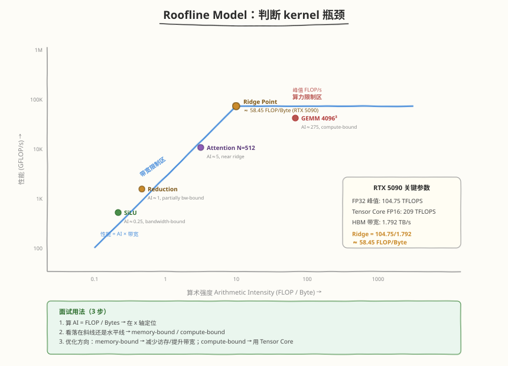

## Day 6：多硬件对比：NVIDIA CUDA vs Ascend CANN

> ⚠️ **定位声明**：本日为**概念对照-only**——无可执行验证练习（需昇腾环境）。内容是 NVIDIA/Ascend 的架构与编程模型对照，用于面试"多硬件适配"类问题。有昇腾环境时，可补充一个 Ascend CANN kernel 练习（见延伸阅读）。

### 🎯 目标

通过今天的学习，你将：

1. 理解 **GPU 与 NPU 的架构本质差异**——NVIDIA 的 **SM/warp/Tensor Core**（**SIMT**）vs Ascend **AI Core** 的 **Cube/Vector/Scalar/MTE**（指令级并行三单元流水）<br>
2. 掌握 **编程模型的对应映射**——`grid/block/thread` ↔ `grid/block/tiling`、**shared memory** ↔ **Unified Buffer**、**warp shuffle** ↔ UB 间 **DataCopy**、`__syncthreads` ↔ **sync barrier**
3. 对比 **工具链差异**——`nvcc` vs Ascend 编译器、**Nsight Compute/Systems** vs **msprof/Ascend Profiler**、cuBLAS/cuDNN/NCCL vs ACL BLAS/ACL NN/HCCL
4. 理解 **性能优化方法论的同与异**——coalesced access vs contiguous access、shared memory bank conflict vs **UB bank conflict**、**Tensor Core** vs **Cube Unit**、warp 切换 vs 三单元流水隐藏延迟
5. 学会 **CUDA kernel → Ascend kernel 的通用迁移策略**——哪些概念可直接迁移（tiling/合并/矩阵加速/双缓冲）、哪些必须重新设计（warp/thread 级优化）
6. 产出一份 **cuda_vs_ascend_comparison.py 速查脚本**，打印 6 张对比表（架构/编程模型/存储/工具/优化/迁移），面试前快速复习

> 💡 **为什么重要**：前 7 周 + Day 3 都围绕 NVIDIA CUDA。但国内 AI Infra 岗位越来越多要求"多硬件适配"——华为 Ascend 是国产算力主力。面试官问"你的 kernel 能不能跑在 Ascend 上"时，答"没了解过"直接丢分；答"我理解两边的架构映射，知道哪些可迁移、哪些要重设计"则体现全局视野。Day 6 用一张对比表把 CUDA 和 Ascend 的概念打通，是"单硬件工程师"到"多硬件视野"的关键一课。

---

### 学前导读：为什么要学多硬件对比

8 周以来我们写的所有 kernel（GEMM、FlashAttention、Softmax、RMSNorm……）都跑在 NVIDIA GPU 上。但现实是：

```
国内 AI Infra 的多硬件现状：
  - 互联网大厂：NVIDIA A100/H100 为主，但战略上引入国产算力降风险
  - 华为云/昇腾生态：Ascend 910/910B 是主力，CANN 是软件栈
  - 推理框架（vLLM/TensorRT-LLM）也在做"多后端"适配

只懂 CUDA 的瓶颈：
  - 面试官："你这 kernel 迁到 Ascend 要改什么？" → 答不上来
  - 业务方："我们要支持昇腾卡" → 你说"我只懂 CUDA"
  - 本质：只懂一种硬件 = 只会一种"表达计算"的方式
```

| 视角 | 只懂 CUDA | 懂多硬件对比 |
|------|-----------|-------------|
| 概念层 | "shared memory" | "shared memory ≈ Ascend UB" |
| 优化层 | "warp 切换隐藏延迟" | "warp 切换 vs 三单元流水，两种延迟隐藏范式" |
| 迁移层 | "重写一遍" | "tiling/合并/矩阵加速可迁移，warp 级要重设计" |
| 面试 | 单硬件工程师 | 有多硬件视野 |

> 💡 **一句话总结**：学多硬件对比不是"再学一遍 Ascend"，而是建立"概念映射表"——把已掌握的 CUDA 优化原理，映射到 Ascend 的对应概念上，实现"学一知二"。

---

### 理论学习

#### 1.1 GPU vs NPU 架构对比


两套硬件都用"算力单元 + 片上存储 + 数据搬运"的三件套，但**执行模型**根本不同：

##### NVIDIA GPU（CUDA 侧）

- **SM（Streaming Multiprocessor）**：GPU 基本计算单元，含多个 **CUDA Core**（标量 ALU）、**Tensor Core**（矩阵乘加速）、寄存器文件、**shared memory/L1**
- **Warp**：32 个 thread 组成，是 GPU 调度的最小单位，warp 内所有 thread 执行相同指令（**SIMT**）
- **Tensor Core**：矩阵乘加速单元，一条 `mma`/`wmma` 指令完成 D=A×B+C 的混合精度矩阵乘（如 16×16×16）
- **CUDA Core**：标量 ALU，做 FP32/INT32 标量运算，一个 SM 含数百个

##### Ascend AI Core（CANN 侧）

- **AI Core**：Ascend 基本计算单元（对应 SM），含 **Cube Unit**、**Vector Unit**、**Scalar Unit**、**MTE**
- **Cube Unit**：矩阵乘加速单元（对应 Tensor Core），一条指令完成 D=A×B+C（如 16×16×16 FP16）
- **Vector Unit**：向量计算单元（对应多个 CUDA Core 协同向量化），做 elementwise、归约、激活等，一次处理一个向量
- **Scalar Unit**：标量单元，做地址计算、控制流
- **MTE（Memory Transfer Engine）**：专用数据搬运单元，异步做 HBM↔UB 的 DMA
- **Ascend C++**：Ascend 的 kernel 编程语言（基于 C++ 扩展），提供 `Copy`/`Compute`/`pipe`/`TilingData` 等原语

##### 架构本质差异：SIMT vs 三单元流水

| 维度 | NVIDIA GPU | Ascend AI Core |
|------|-----------|----------------|
| 执行模型 | **SIMT**（warp=32 thread 同指令） | **指令级并行**（Cube/Vector/MTE 三单元流水） |
| 延迟隐藏 | **warp 切换**（一 warp 阻塞，硬件切到另一 warp） | **三单元流水**（MTE 搬数 + Cube 矩阵乘 + Vector 向量 可并行） |
| 数据搬运 | thread 自己发 load/store | **MTE 异步搬运**，与计算解耦 |
| 编排方式 | 硬件 warp scheduler 自动 | 软件**显式编排 pipe**（DoubleBuffer、barrier） |

> ⚠️ **关键洞察**：CUDA 靠"多 warp 并发 + 硬件切换"隐藏延迟；Ascend 靠"MTE/Cube/Vector 三单元流水 + 软件编排"隐藏延迟。这是两种延迟隐藏范式——理解这一点，就理解了为何 Ascend 编程强调"pipe 流水"而 CUDA 强调"高 occupancy"。

#### 1.2 编程模型对比表

CUDA 和 Ascend 的编程模型都有"层级 + 片上存储 + 同步"三件套，概念高度对应：

| 概念 | NVIDIA CUDA | Ascend CANN | 对应关系 |
|------|-------------|-------------|---------|
| **线程层次** | grid > block > thread | grid > block > **tiling** | block ↔ AI Core，tiling 是数据切分粒度 |
| **并行粒度** | thread（标量）+ warp（32） | tiling（一个 block 处理一个数据块） | Ascend 无 thread 概念 |
| **片上共享存储** | **shared memory**（~100KB/SM） | **Unified Buffer (UB)** | 手动管理、软件搬运 |
| **片上缓存** | L1 / register file | L1 cache / register | — |
| **warp/块内通信** | **warp shuffle**（`__shfl_*`） | UB 间 **DataCopy**（vector copy） | 直接寄存器交换 vs UB 拷贝 |
| **块内同步** | **`__syncthreads()`** | **sync barrier**（`pipe_barrier`） | 都是 block 级同步 |
| **向量化加载** | **float4**（128-bit load） | **DataCopy**（burst length） | 一次搬多元素 |
| **矩阵加速** | **Tensor Core**（WMMA/mma） | **Cube Unit**（matmul） | D=A×B+C 专用单元 |
| **kernel 语言** | CUDA C++（`.cu`） | **Ascend C++**（`.cpp`） | — |
| **数据搬运执行者** | thread 自带 load/store | **MTE** 异步 DMA | 计算与搬运解耦 |

> 💡 **映射口诀**：`shared memory → UB`、`warp shuffle → UB DataCopy`、`__syncthreads → sync barrier`、`Tensor Core → Cube Unit`、`float4 → DataCopy`。记住这五对，就能读懂 Ascend kernel 的骨架。

#### 1.3 工具链对比

| 工具类别 | NVIDIA | Ascend | 用途 |
|---------|--------|--------|------|
| **编译器** | `nvcc` | Ascend 编译器（`aoe`/`msauccomp`） | 编译 kernel |
| **Kernel Profiler** | **Nsight Compute**（`ncu`） | **msprof** / Ascend Profiler | 单 kernel 性能分析 |
| **System Profiler** | **Nsight Systems**（`nsys`） | **msprof**（system trace） | 全链路时序 |
| **运行时 API** | CUDA Runtime（`cudaXxx`） | **ACL**（Ascend Computing Language） | 显存/流/launch |
| **数学库** | cuBLAS / cuDNN | **ACL BLAS / ACL NN** | 标准算子 |
| **集合通信** | NCCL | **HCCL** | 多卡 all-reduce 等 |
| **框架集成** | PyTorch CUDA | **torch_npu**（PyTorch Ascend） | 训练/推理框架 |
| **调试器** | `cuda-gdb` | Ascend 调试工具 | 断点调试 |

##### Profiler 指标对应

| 分析维度 | ncu 指标 | msprof 指标 |
|---------|----------|-------------|
| 计算利用率 | SM Throughput、Achieved Occupancy | **Cube Utilization**、**Vector Utilization** |
| 访存带宽 | Memory Throughput | Memory Bandwidth（HBM/UB） |
| 瓶颈定位 | Warp Stall Reasons | **Mac Rate**、pipe stall |

> 💡 **迁移要点**：ncu 的"SM/Memory Throughput 对比 → Roofline 定位"方法论在 Ascend 上**完全适用**——只是把 SM Throughput 换成 Cube/Vector Utilization。Roofline 是硬件无关的。

#### 1.4 性能优化方法论对比



优化原理在两边**高度相通**，差异主要在"用什么机制实现"：

| 优化点 | CUDA | Ascend | 共性原理 |
|--------|------|--------|---------|
| **访存合并** | coalesced access（连续地址） | contiguous access（连续地址） | 连续访问打满带宽 |
| **bank 冲突** | shared memory **32 bank** conflict | **UB bank conflict** | 同 bank 串行化 |
| **数据复用** | shared memory tiling | UB tiling + L1 cache | tile 加载到片上复用 |
| **矩阵加速单元** | **Tensor Core**（WMMA/mma） | **Cube Unit**（matmul） | D=A×B+C 专用单元 |
| **向量化** | float4（128-bit） | DataCopy（burst） | 一次搬多元素 |
| **双缓冲** | double buffering（ping-pong） | **DoubleBuffer**（`pipe` `TQue`） | 前台算 + 后台搬 |
| **延迟隐藏** | **warp 切换**（多 warp 并发） | **三单元流水**（MTE+Cube+Vector） | 并发执行隐藏延迟 |
| **自动调优** | auto-tuning（参数搜索） | tiling 参数自动搜索 | 搜索最优参数 |

##### 三个核心差异要点

1. **访存合并**：CUDA 叫 coalesced，Ascend 叫 contiguous，**本质完全相同**——warp 内 32 thread 访问连续地址 ↔ Ascend DataCopy 的 burst 覆盖连续地址。naive transpose 必有一侧不连续，两边都要用 tile 修复。
2. **bank conflict**：CUDA shared memory 分 32 bank（对应 warp 32 thread）；Ascend UB 也有 bank 划分。**规避方法相同**：padding 打乱对齐、向量化访问不同 bank。
3. **Tensor Core vs Cube Unit**：都是矩阵乘专用单元，编程入口不同——CUDA 用 `wmma::load_matrix_sync` + `mma_sync`；Ascend 用 `Matmul` 接口或 Cube 指令。**思路一致**：把 GEMM 拆成 unit-sized tile 喂给加速单元。

> 💡 **一句话总结**：优化方法论"换汤不换药"——coalesced/contiguous、bank conflict、矩阵加速、双缓冲、Roofline 这些原理两边通用；差异只在"用 warp 切换还是三单元流水隐藏延迟"这一执行模型层面。

#### 1.5 迁移策略：CUDA kernel → Ascend kernel

##### 通用迁移五步法

1. **分析 CUDA kernel 数据流**：识别哪些是访存（global↔shared）、哪些是计算（GEMM/elementwise/reduce）、哪些是同步
2. **概念映射**（套用 1.2 的映射表）：shared memory → UB、Tensor Core → Cube、float4 → DataCopy、`__syncthreads` → sync barrier、warp shuffle → UB 间 copy
3. **重新设计 tiling**：Ascend 的 tiling 粒度由 **UB 容量 + Cube 指令尺寸**决定（CUDA 由"寄存器/shared mem/block size"决定），需重算 tile 形状
4. **改写为 Ascend C++**：用 `Copy`（HBM→UB）/ `Compute`（Cube/Vector）/ `Copy`（UB→HBM）+ `pipe` 编排三单元流水
5. **用 msprof 验证**：对比 Cube/Vector Utilization、Memory Bandwidth，迭代到接近峰值

##### 可迁移 vs 必须重新设计

| 概念 | CUDA | Ascend | 迁移性 |
|------|------|--------|--------|
| tiling 思想 | shared memory tile | UB tile | ✅ 直接迁移 |
| 访存合并 | coalesced | contiguous | ✅ 直接迁移 |
| 矩阵加速思路 | Tensor Core 用法 | Cube Unit 用法 | ✅ 思路迁移 |
| 双缓冲 | double buffer | pipe DoubleBuffer | ✅ 思路迁移 |
| Roofline 分析 | SM/Mem Throughput | Cube/Vector Util | ✅ 方法迁移 |
| **warp 级优化** | warp shuffle、32 对齐 | **无 warp 概念** | ❌ 重新设计 |
| **thread 寄存器分配** | per-thread reg | **tiling 级，无 thread** | ❌ 重新设计 |
| **block size 计算** | 由 reg/SMem 决定 | 由 UB 容量 + Cube 尺寸 | ❌ 重新设计 |
| **同步原语** | `__syncthreads` | sync barrier | ⚠️ 语义迁移（API 不同） |

> ⚠️ **最大坑**：CUDA 的"warp shuffle 归约"在 Ascend 上没有对应物——Ascend 的归约走 **Vector Unit + UB**，需用 `ReduceSum` 等 Vector 接口重写，不能照搬 shuffle 模板。这是"概念可迁移但实现要重写"的典型。

##### 核心映射速查（5 对）

| # | NVIDIA CUDA | Ascend CANN |
|---|-------------|-------------|
| 1 | shared memory | Unified Buffer (UB) |
| 2 | warp shuffle（`__shfl_*`） | UB 间 DataCopy |
| 3 | `__syncthreads()` | sync barrier |
| 4 | Tensor Core（WMMA/mma） | Cube Unit（matmul） |
| 5 | float4（128-bit load） | DataCopy（burst length） |

> 💡 记住这五对核心映射，就能读懂 Ascend kernel 的骨架。完整 14 维综合对比 + 6 张分类表（架构/编程模型/存储/工具/优化/迁移）的可打印版见 [kernels/cuda_vs_ascend_comparison.py](https://github.com/hzchenxiaobin/ai-infra-notes/blob/main/aiinfra/daily/week9/day6/kernels/cuda_vs_ascend_comparison.py)。

---

### Coding 任务：CUDA vs Ascend 对比速查脚本

#### 任务 1：阅读 cuda_vs_ascend_comparison.py 速查脚本

完整脚本见 [kernels/cuda_vs_ascend_comparison.py](https://github.com/hzchenxiaobin/ai-infra-notes/blob/main/aiinfra/daily/week9/day6/kernels/cuda_vs_ascend_comparison.py)，把 6 张对比表（架构/编程模型/存储/工具/优化/迁移）整理为可打印的速查脚本。

代码要点：
- **6 张对比表**：架构 / 编程模型 / 存储层次 / 工具链 / 优化技术 / 迁移策略，覆盖面试全部考点
- **数据驱动**：每张表是 `list[tuple]`，新增维度只需加一行，易维护
- **统一打印**：`print_table` 渲染 Markdown 表格，可直接贴进笔记
- **迁移性标注**：第 6 张表显式标注"可迁移 / 重新设计 / 语义迁移"，迁移决策一目了然

通读脚本，对照 §1.1-1.5 的理论内容自查：每张表的每一行能否用自己的话解释？

#### 任务 2：运行并打印速查表

```bash
python kernels/cuda_vs_ascend_comparison.py
```

**预期输出**（节选）：

```text
========================================================================
  CUDA vs Ascend CANN 多硬件对比速查表
========================================================================

### 1. 架构对比 (GPU vs NPU)

| 维度 | NVIDIA CUDA | Ascend CANN |
|---|---|---|
| 计算单元 | SM (Streaming Multiprocessor) | AI Core (Cube+Vector+Scalar+MTE) |
| 执行模型 | SIMT (warp=32 thread) | 指令级并行 (三单元流水) |
| 延迟隐藏 | warp 切换 (硬件调度) | 三单元流水 (软件 pipe) |

### 6. 迁移策略 (CUDA -> Ascend)

| 概念 | CUDA | Ascend | 迁移性 |
|---|---|---|---|
| tiling 思想 | shared memory tile | UB tile | 可迁移 |
| warp 级优化 | warp shuffle / 32 对齐 | 无 warp 概念 | 重新设计 |
```

##### 观察重点

1. **6 张表覆盖全维度**：从架构到迁移，一条龙对比，面试前过一遍即可复习
2. **迁移性表是决策表**：标出"可迁移 / 重新设计 / 语义迁移"，回答"哪些能搬、哪些要重写"
3. **输出可直接贴笔记**：Markdown 表格格式，复制即用

#### 任务 3：默写映射五对

不看资料，在纸上默写 CUDA → Ascend 的五对核心映射：`shared memory → ?`、`warp shuffle → ?`、`__syncthreads → ?`、`Tensor Core → ?`、`float4 → ?`。检查：能否再补出"延迟隐藏机制的差异"（warp 切换 vs 三单元流水）。

> 思考：为什么 Ascend 强调"pipe 流水"而 CUDA 强调"高 occupancy"？（提示：Ascend 靠三单元并行隐藏延迟，软件编排 pipe 是关键；CUDA 靠多 warp 并发，occupancy 决定能并发多少 warp。）

#### 任务 4：LeetGPU 在线题目 —— GEMM（多硬件视角）

**题目链接**：<https://leetgpu.com/challenges/general-matrix-multiplication-gemm>

**与今日知识的关联**：GEMM 是多硬件对比的**最佳标本**——它是两边都重点优化的算子，且正好体现今日所有对比维度。在 CUDA 侧，你用 **Tensor Core**（`wmma`/`mma`）把 GEMM 推到 80%+；在 Ascend 侧，同一个 GEMM 走 **Cube Unit** 路径（`Matmul` 接口），tiling 由 UB 容量 + Cube 指令尺寸（16×16×16）决定。两边的优化八层路径（Naive → Tiling → RegBlock → 向量化 → … → 矩阵加速单元）**结构完全同构**，只是每层的实现 API 换了。重做这道 GEMM 时，不要只盯 CUDA 优化，而是边写边问自己："这层在 Ascend 上对应什么？"

> 💡 提交后在 [LeetGPU GEMM](https://leetgpu.com/challenges/general-matrix-multiplication-gemm) 上记录通过耗时。完整题解（含 Tensor Core 路径、八层优化、与 Cube Unit 的对应）见 [GEMM 题解](https://hzchenxiaobin.github.io/leetgpu/leetgpu-gemm-solution.html)。

#### 任务 5：LeetCode 面试题（第 8 周精选）

> 📅 今日题目选自 [8 周算法面试刷题计划](https://hzchenxiaobin.github.io/leetcode/problems/8-week-plan.html) 第 8 周「动态规划进阶与图论」。本周不绑定单日，从本周挑 4 道经典 DP/图论题保持手感。

| 题目 | 难度 | 核心套路 | 题解 |
|------|------|----------|------|
| [72. 编辑距离](https://leetcode.cn/problems/edit-distance/) | 困难 | 二维 DP（insert/delete/replace） | [题解](https://hzchenxiaobin.github.io/leetcode/problems/72_编辑距离.html) |
| [1143. 最长公共子序列](https://leetcode.cn/problems/longest-common-subsequence/) | 中等 | 二维 DP（LCS） | [题解](https://hzchenxiaobin.github.io/leetcode/problems/1143_最长公共子序列.html) |
| [399. 除法求值](https://leetcode.cn/problems/evaluate-division/) | 中等 | 带权并查集 / 图搜索 | [题解](https://hzchenxiaobin.github.io/leetcode/problems/399_除法求值.html) |
| [133. 克隆图](https://leetcode.cn/problems/clone-graph/) | 中等 | DFS/BFS + 哈希克隆 | [题解](https://hzchenxiaobin.github.io/leetcode/problems/133_克隆图.html) |

---

### 扩展实验

#### 实验 1：画 CUDA ↔ Ascend 概念映射图

在纸上画一张双栏映射图：左栏列 CUDA 概念（SM/warp/Tensor Core/shared memory/warp shuffle/`__syncthreads`/float4），右栏列 Ascend 概念（AI Core/tiling/Cube/UB/DataCopy/sync barrier/DataCopy），用箭头连接对应概念。标注哪些是"直接迁移"、哪些是"重新设计"。

> 思考：映射图中哪条箭头最"粗"（最核心）？哪条最"虚"（需重新设计）？（提示：shared memory↔UB 最核心；warp shuffle↔? 最虚，因为 Ascend 无 warp。）

#### 实验 2：用对比表重读 Day 3 的 GEMM 八层

回到 Day 3 的 GEMM 八层优化路径（Naive → Tiling → RegBlock → float4 → Shuffle → DoubleBuffer → Tensor Core → Auto-tuning），用今天的映射表逐层问："这层在 Ascend 上叫什么、用什么 API？" 把八层写成 CUDA/Ascend 双栏对照。

> 思考：哪一层在 Ascend 上"消失"了？（提示：Warp Shuffle 层——Ascend 无 warp，这层归并到 Vector/UB 通信。）

#### 实验 3：默写延迟隐藏的两种范式

不看资料，分别默写：① CUDA 如何用 warp 切换隐藏延迟（occupancy 的作用）② Ascend 如何用三单元流水隐藏延迟（MTE/Cube/Vector 并行 + pipe 编排）。标注：哪种靠硬件自动、哪种靠软件显式编排？

> 思考：为什么 Ascend 的 pipe 编排是"软件责任"而 CUDA 的 warp 切换是"硬件责任"？（提示：SIMT 有硬件 warp scheduler 自动切换；Ascend 三单元是 VLIW 风格指令级并行，由编译器/程序员显式编排流水。）

---

### 今日总结

Day 6 我们用一张对比表把 NVIDIA CUDA 和 Ascend CANN 的概念打通：

1. **架构对比**：SM ↔ AI Core（Cube+Vector+Scalar+MTE）；执行模型 **SIMT（warp=32）** vs **指令级并行（三单元流水）**；延迟隐藏 **warp 切换** vs **MTE/Cube/Vector 流水**
2. **编程模型映射五对**：`shared memory↔UB`、`warp shuffle↔UB DataCopy`、`__syncthreads↔sync barrier`、`Tensor Core↔Cube Unit`、`float4↔DataCopy`
3. **工具链对应**：`nvcc`↔Ascend 编译器、`ncu`/`nsys`↔`msprof`、cuBLAS/cuDNN/NCCL↔ACL BLAS/ACL NN/HCCL、PyTorch CUDA↔torch_npu
4. **优化方法论同大于异**：coalesced↔contiguous、bank conflict（shared mem↔UB）、Tensor Core↔Cube、双缓冲、Roofline——原理通用，只在延迟隐藏机制上根本不同
5. **迁移策略**：tiling/合并/矩阵加速/双缓冲/Roofline **可迁移**；warp 级优化/thread 寄存器/block size **重新设计**；同步原语**语义迁移**
6. **最大坑**：warp shuffle 归约在 Ascend 无对应物，需用 Vector Unit + UB 重写——"概念可迁移但实现要重写"的典型
7. **速查脚本**：`cuda_vs_ascend_comparison.py` 打印 6 张对比表，面试前快速复习

掌握这些后，你就有了"多硬件视野"——面试官问"kernel 能不能跑在 Ascend 上"，你能用映射表回答"哪些直接搬、哪些要重写、为什么"，体现超越单硬件的全局理解。

---

### 面试要点

1. **GPU 和 NPU 在执行模型上的核心差异是什么？**（⭐⭐⭐⭐ 高频）

<details>
<summary>点击查看答案</summary>

 - **NVIDIA GPU**：**SIMT**（Single Instruction Multiple Thread），warp=32 thread 是调度最小单位，warp 内同指令；靠**硬件 warp scheduler** 在多 warp 间切换隐藏延迟（occupancy 是关键）
 - **Ascend AI Core**：**指令级并行**，Cube/Vector/Scalar/MTE 三大单元可并行执行不同指令（VLIW 风格）；靠**软件编排 pipe 流水**（MTE 搬数 + Cube 矩阵乘 + Vector 向量并行）隐藏延迟
 - **本质差异**：CUDA 延迟隐藏靠"warp 切换"（硬件自动），Ascend 靠"三单元流水"（软件显式编排）
 - **推论**：CUDA 强调高 occupancy（多 warp 并发），Ascend 强调 pipe 流水编排（DoubleBuffer、barrier）

</details>


2. **CUDA 的 shared memory 对应 Ascend 的什么？bank conflict 有何异同？**（⭐⭐⭐⭐ 高频）

<details>
<summary>点击查看答案</summary>

 - **对应关系**：CUDA **shared memory** ↔ Ascend **Unified Buffer (UB)**，都是片上软件管理的高速存储，手动搬数据进来复用
 - **bank conflict 相同点**：两者都分 bank，同一时刻多 thread/向量访问同一 bank → 串行化；规避方法相同——**padding 打乱对齐、向量化访问不同 bank**
 - **bank conflict 差异点**：CUDA shared memory 分 **32 bank**（对应 warp 32 thread）；Ascend UB 的 bank 划分由型号决定，按向量访问模式对齐
 - **共性原理**：都是"片上存储的访问模式冲突"，优化思路完全可迁移

</details>


3. **CUDA 的 warp shuffle 在 Ascend 上如何迁移？**（⭐⭐⭐ 中频）

<details>
<summary>点击查看答案</summary>

 - **warp shuffle 没有直接对应物**：Ascend 无 warp 概念，不存在"warp 内寄存器直接交换"
 - **迁移方向**：warp 级通信 → **UB 间 DataCopy**（数据拷到 UB 再读）；warp shuffle 归约 → **Vector Unit 的 `ReduceSum` 接口**
 - **代价**：shuffle ~1-2 cycles，UB DataCopy 更慢，归约实现要重写
 - **结论**：这是"概念可迁移（归约需求存在）但实现必须重写"的典型——不能照搬 CUDA 的 shuffle 归约模板

</details>


4. **CUDA 的 Tensor Core 和 Ascend 的 Cube Unit 有什么异同？**（⭐⭐⭐⭐ 高频）

<details>
<summary>点击查看答案</summary>

 - **相同点**：都是**矩阵乘加速专用单元**，做 D=A×B+C 的混合精度矩阵乘；都用 tile 喂数据（如 16×16×16）；都是 GEMM 优化的天花板手段
 - **差异点**：
   - 编程入口：CUDA 用 `wmma::load_matrix_sync` + `mma_sync`（或 `mma` PTX）；Ascend 用 `Matmul` 接口 / Cube 指令
   - 数据布局：CUDA Tensor Core 对矩阵布局有要求（row/col-major）；Ascend Cube 对数据布局有自己的对齐规则
   - tiling 决定：CUDA tile 由 block/warp 划分；Ascend tile 由 UB 容量 + Cube 指令尺寸决定
 - **共性**：两者都是"GEMM 八层优化"的最后一层，思路完全同构

</details>


5. **把一个 CUDA GEMM kernel 迁移到 Ascend，需要哪些步骤？哪些能直接迁移，哪些要重新设计？**（⭐⭐⭐⭐⭐ 必考）

<details>
<summary>点击查看答案</summary>

 - **五步法**：① 分析 CUDA kernel 数据流（访存/计算/同步）② 概念映射（shared mem→UB、Tensor Core→Cube、float4→DataCopy、`__syncthreads`→sync barrier）③ 重新设计 tiling（由 UB 容量+Cube 指令尺寸决定）④ 改写为 Ascend C++（Copy/Compute/pipe）⑤ msprof 验证
 - **可直接迁移**：tiling 思想、访存合并（coalesced→contiguous）、矩阵加速思路（Tensor Core→Cube）、双缓冲、Roofline 分析法
 - **必须重新设计**：warp 级优化（无 warp）、thread 寄存器分配（无 thread）、block size 计算（改由 UB+Cube 决定）、warp shuffle 归约（改用 Vector `ReduceSum`）
 - **语义迁移**：同步原语（`__syncthreads`→sync barrier，语义同、API 不同）
 - **核心洞察**：优化方法论"换汤不换药"，只有"warp 切换 vs 三单元流水"这一执行模型层面根本不同

</details>
