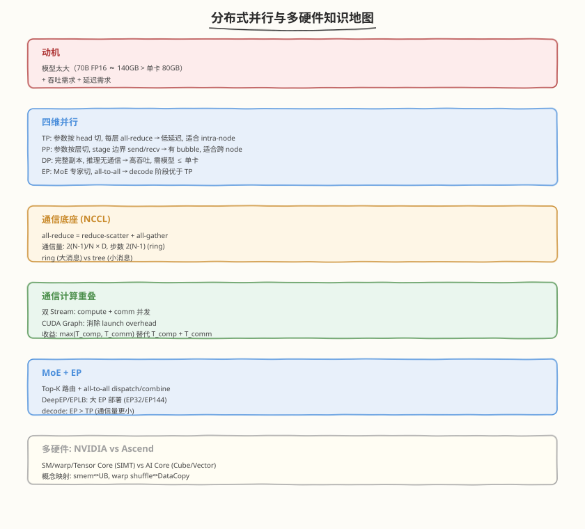

## Day 7：复盘与面试 Q&A —— 分布式/MoE/多硬件

### 🎯 目标

通过今天的学习，你将：

1. 能画出 **分布式并行知识地图**——TP/PP/DP/EP 四维并行 + NCCL 通信 + 通信计算重叠 + MoE + 多硬件 
2. 能回答"给定模型大小和 GPU 数，选什么并行策略"的完整决策链 
3. 掌握分布式推理的核心面试题——通信量计算、bubble ratio、overlap 策略、EP vs TP 选择 

> 💡 **为什么重要**：分布式并行是 75%+ JD 要求的大主题，面试从"70B 模型怎么部署"开始能连追 5-8 问。今天把 Week 9 的知识收敛成"一张地图 + 10 道 Q&A"。

---

### 本周知识地图

### 并行策略选择决策表

| 模型大小 | GPU 数 | 推荐策略 | 通信 | 备注 |
|---------|--------|---------|------|------|
| ≤ 单卡（如 7B FP16） | N | DP（每卡完整副本） | 无 | 高吞吐 |
| > 单卡, ≤ 2 卡 | 2 | TP=2 | 每层 all-reduce | NVLink 必须 |
| > 2 卡, ≤ 8 卡 | 8 | TP=8 | 每层 all-reduce | intra-node |
| > 8 卡 | 16+ | TP=8 + PP=2+ | TP intra-node, PP inter-node | |
| MoE 模型 | 8+ | EP=8（decode）+ TP（prefill） | all-to-all | DeepSeek 风格 |
| 超大 MoE | 144+ | EP=144 | all-to-all | DeepSeek-V3 |

### 通信量速查

| 并行 | 原语 | 通信量/层 | 步数(ring) |
|------|------|----------|-----------|
| TP | all-reduce | 2(N-1)/N × activation | 2(N-1) |
| PP | send/recv | activation | 1（+bubble） |
| DP(训练) | all-reduce | 2(N-1)/N × 参数量 | 2(N-1) |
| DP(推理) | 无 | 0 | — |
| EP | all-to-all | 2 × tokens × top_k × expert_dim | 1-2 |

---

### 面试 Q&A 收敛

#### Q1：70B 模型怎么部署到 8 卡 A100？

答案

- 70B FP16 权重 ≈ 140GB，单卡 A100 80GB 放不下
- **权重显存**：TP=8（每卡 ~17.5GB 参数）
- **KV Cache 显存**（易漏算！）：70B 级别 n_layer=80, n_kv_head=8(GQA), d_head=128, FP16
  - bytes/token = 2 × 80 × 8 × 128 × 2B = 327,680 B ≈ 320 KB/token
  - 4K context × batch 8 = 32K tokens → ~10GB KV Cache（TP=8 每卡 ~1.25GB）
  - 32K context × batch 8 → ~80GB KV Cache（每卡 ~10GB，加上权重 17.5GB = 27.5GB，80GB 够用）
- 方案：TP=8（每卡 ~17.5GB 参数 + activation + KV Cache）
- 通信：每层 all-reduce activation（~28MB/层，NVLink 400GB/s）
- 延迟：TP 通信开销 ~10-15%，可接受
- 如果跨 node：TP=8 intra-node + PP=2 inter-node（TP 通信走 NVLink，PP 走 PCIe/IB）

> ⚠️ **面试陷阱**：很多人只算权重显存（140GB），忘了 KV Cache。长上下文场景 KV Cache 可能比权重还大——这就是 PagedAttention/量化 KV Cache 存在的原因。

#### Q2：TP/PP/DP 怎么选？各自的通信和显存特点？

答案

| 并行 | 显存节省 | 通信 | 适合 |
|------|---------|------|------|
| TP | 参数分 N 卡，activation 不分 | 每层 all-reduce（频率高） | intra-node, 低延迟 |
| PP | 参数 + activation 都分 | stage 边界 send/recv + bubble | inter-node |
| DP | 无显存节省 | 推理无通信 | 模型 ≤ 单卡 + 高吞吐 |
| EP | MoE 专家分卡 | all-to-all | MoE decode |

选择原则：TP 优先 intra-node（NVLink），PP 用于 inter-node，DP 做吞吐扩展。

#### Q3：Ring all-reduce 的通信量怎么算？

答案

- 通信量 = 2(N-1)/N × 数据量 = reduce-scatter（(N-1)/N × D）+ all-gather（(N-1)/N × D）两段，步数 2(N-1)
- 完整两阶段推导、通信量计算与 ring 模拟器详见 [Day 3 §3.1](https://hzchenxiaobin.github.io/ai-infra-notes/week9/day3.html)

#### Q4：PP 的 bubble ratio 怎么算？怎么减少？

答案

- bubble = (P-1)/(M+P-1)；增大 M（M≥4P 时 < 20%）或用 interleaved 1F1B 降低；1F1B 把显存从 O(M) 降到 O(P)
- 完整推导、1F1B 调度模拟与推理 PP 部署形态详见 [Day 2 §2.3](https://hzchenxiaobin.github.io/ai-infra-notes/week9/day2.html)

#### Q5：TP 的 all-reduce 怎么和计算重叠？

答案

- GEMM 按输出切两半 Y1/Y2，compute_stream 算后半与 comm_stream 对前半做 all-reduce 并发重叠；CUDA Graph 捕获双流序列消除 launch overhead；收益 = min(T_comp, T_comm)
- 代码实现、收益边界与 Sequence Parallelism 详见 [Day 4 §4.2](https://hzchenxiaobin.github.io/ai-infra-notes/week9/day4.html)

#### Q6：MoE 的 EP 和 TP 怎么选？为什么 decode 阶段 EP 更优？

答案

- decode batch 小（M=1~8）时 EP 的 all-to-all 流量小；TP all-reduce 每层都做、延迟固定，batch 小时无法被摊薄，开销占比大
- prefill batch 大（M=N）时 TP all-reduce 被计算摊薄，且无 all-to-all
- 通信量公式、EP vs TP 对比表与 DeepSeek 混合策略详见 [Day 5 §4](https://hzchenxiaobin.github.io/ai-infra-notes/week9/day5.html)

#### Q7：NCCL 的 ring 和 tree 拓扑各适合什么场景？

答案

- Ring：步数 2(N-1) 但带宽利用率高（每步每节点都在发收），适合大消息；Tree：步数 log N、延迟低但根节点瓶颈，适合小消息；NCCL 按消息大小自适应混合
- 拓扑细节、选择阈值与 NCCL 自适应策略详见 [Day 3 §3.5](https://hzchenxiaobin.github.io/ai-infra-notes/week9/day3.html)

#### Q8：CUDA 和 Ascend 的架构映射是什么？

答案

| CUDA | Ascend CANN |
|------|------------|
| SM/warp | AI Core (Cube/Vector/Scalar) |
| Tensor Core (WMMA) | Cube Unit (matmul) |
| shared memory | Unified Buffer (UB) |
| warp shuffle | UB 间 DataCopy |
| `__syncthreads` | sync barrier |
| grid/block/thread | grid/block/tiling |
| Nsight Compute | msprof |

可迁移：tiling/合并/矩阵加速/双缓冲。需重设计：warp/thread 级优化。

#### Q9：DeepEP 和 EPLB 是什么？

答案

- **DeepEP**：DeepSeek 开源的高性能 EP 通信库，优化 all-to-all dispatch/combine
- **EPLB**：Expert Parallel Load Balancing，MoE 专家的负载均衡分配，解决"某些专家被路由过多"的不均衡问题
- 用于大 EP 部署（EP32/EP144），DeepSeek-V3/R1 的生产实践

#### Q10：分布式推理的通信开销占多少？怎么判断通信是否瓶颈？

答案

- TP=8, 70B, batch=1, seq=2048：通信 ~10-15% 总 latency
- 判断方法：
  - nsys 看 NCCL kernel 占比
  - 对比 T_compute vs T_comm（comm > 30% 时需优化）
  - 优化方向：overlap（双 Stream）+ CUDA Graph + 减少 TP 度（用 PP 替代）

---

#### 任务 2：本周 LeetCode 题目回顾（10 周计划 · 第 9 周）

本周 LeetCode 题目对应 [10 周算法面试刷题计划](https://hzchenxiaobin.github.io/leetcode/problems/10-week-plan.html) 第 9 周「动态规划进阶——子序列、区间与二维 DP」（点击查看题解）：

| Day | 主题 | LeetCode 题目 |
|---|---|---|
| Day 1 | 子数组与子序列 | [139. 单词拆分](https://hzchenxiaobin.github.io/leetcode/problems/139_单词拆分.html)、[152. 乘积最大子数组](https://hzchenxiaobin.github.io/leetcode/problems/152_乘积最大子数组.html)、[300. 最长递增子序列](https://hzchenxiaobin.github.io/leetcode/problems/300_最长递增子序列.html)、[354. 俄罗斯套娃信封问题](https://hzchenxiaobin.github.io/leetcode/problems/354_俄罗斯套娃信封问题.html) |
| Day 2 | 回文与区间 DP | [647. 回文子串](https://hzchenxiaobin.github.io/leetcode/problems/647_回文子串.html)、[516. 最长回文子序列](https://hzchenxiaobin.github.io/leetcode/problems/516_最长回文子序列.html)、[5. 最长回文子串](https://hzchenxiaobin.github.io/leetcode/problems/5_最长回文子串.html)、[312. 戳气球](https://hzchenxiaobin.github.io/leetcode/problems/312_戳气球.html)、[32. 最长有效括号](https://hzchenxiaobin.github.io/leetcode/problems/32_最长有效括号.html) |
| Day 3 | 二维 DP | [62. 不同路径](https://hzchenxiaobin.github.io/leetcode/problems/62_不同路径.html)、[64. 最小路径和](https://hzchenxiaobin.github.io/leetcode/problems/64_最小路径和.html)、[120. 三角形最小路径和](https://hzchenxiaobin.github.io/leetcode/problems/120_三角形最小路径和.html)、[1143. 最长公共子序列](https://hzchenxiaobin.github.io/leetcode/problems/1143_最长公共子序列.html)、[72. 编辑距离](https://hzchenxiaobin.github.io/leetcode/problems/72_编辑距离.html)、[221. 最大正方形](https://hzchenxiaobin.github.io/leetcode/problems/221_最大正方形.html) |

> 💡 回顾重点：本周 LeetCode 题对应 10 周刷题计划第 9 周「动态规划进阶——子序列、区间与二维 DP」。重做本周错题、总结模板笔记；没做完的题目今天补上。

---
### 本周复盘 Checklist

- [ ] 能解释 TP/PP/DP/EP 四维并行的通信模式
- [ ] 能推导 ring all-reduce 的通信量（2(N-1)/N × D）
- [ ] 能算 PP 的 bubble ratio 并知道怎么减少
- [ ] 能解释 1F1B vs GPipe 的显存优势
- [ ] 能描述双 Stream 通信计算重叠的实现
- [ ] 能解释 CUDA Graph 在分布式推理中的作用
- [ ] 能说出 MoE EP vs TP 的选择依据
- [ ] 能列出 CUDA vs Ascend 的架构映射
- [ ] 能为给定模型大小选并行策略

---

### 场景化动手任务

> 拿到以下场景约束，写出并行方案 + 通信量估算 + 显存预算。每个场景限时 10 分钟口述。

#### 场景 1：LLaMA-3-70B，8×A100 80GB，32K context，batch=4

约束：单卡 80GB，需放下权重 + KV Cache + activation

- 权重：70B × FP16 ≈ 140GB → TP=8（每卡 17.5GB）
- KV Cache：2 × 80 × 8 × 128 × 2B × 32K × 4 = ~40GB（每卡 5GB）
- 通信：TP all-reduce 每层 2 × 4 × 32K × 8192 × 2B × 7/8 ≈ 183 MB/层（NVLink 4 ~0.4ms）
- 写出：TP 度选择依据 + 通信占比估算 + 是否需要 PP

#### 场景 2：Mixtral 8×7B（MoE），4×H100 80GB，decode batch=1

约束：MoE 模型，decode 阶段 batch=1，追求低延迟

- 权重：8 专家 × 7B × FP16 ≈ 56GB + 共享层 ~7GB = ~63GB
- EP 选择：8 专家分到 4 卡（每卡 2 专家），每卡 ~16GB
- 通信：EP all-to-all 每层 2 × 1 × 2 × 4096 × 2B × (1-1/4) ≈ 24KB（极小，延迟主导）
- 写出：EP vs TP 选择依据 + decode 通信量为何小 + 是否需要 EP+TP 混合

#### 场景 3：DeepSeek-V3 671B（MoE），16×H100 80GB 跨 2 节点

约束：超大规模 MoE，跨节点（NVLink intra-node + IB inter-node）

- 权重：671B × FP16 ≈ 1.3TB → 需要 EP + TP + PP 组合
- 方案：EP=8（专家分布）+ TP=2（非 MoE 层）+ PP=2（跨节点）
- 通信：EP all-to-all 跨节点走 IB（~100GB/s），MoE 层通信 ~2 × tokens × top_k × hidden × (1-1/EP)
- 写出：三维并行组合策略 + 哪层走 NVLink / 哪层走 IB + bubble 估算

> 💡 面试中这类"给约束写方案"的题越来越常见，核心考查：能否把通信量公式（§3.6-3.7）和显存口算（KV Cache）快速应用到具体场景。

---

### 下周预告

Week 10 是项目整合与面试冲刺——把 Week 1-9 的知识整合到 Mini 引擎，做全链路 Profiling、面试题库、Mock 面试、最终复盘。
