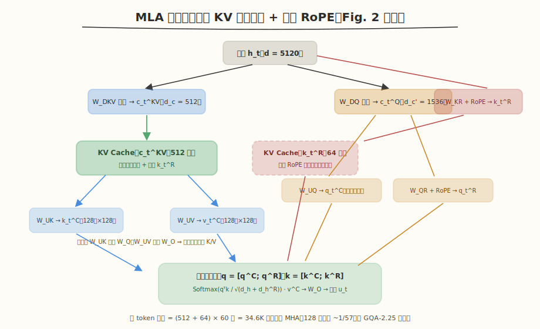
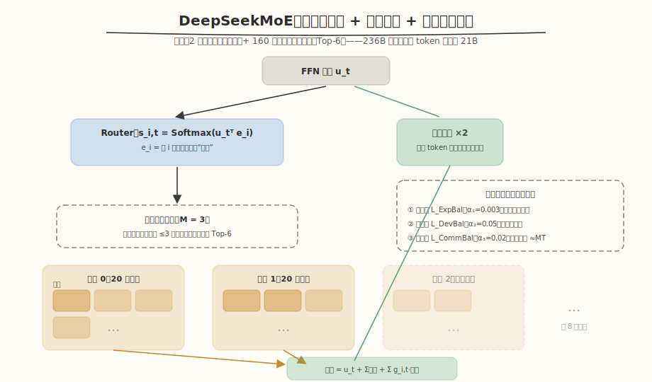
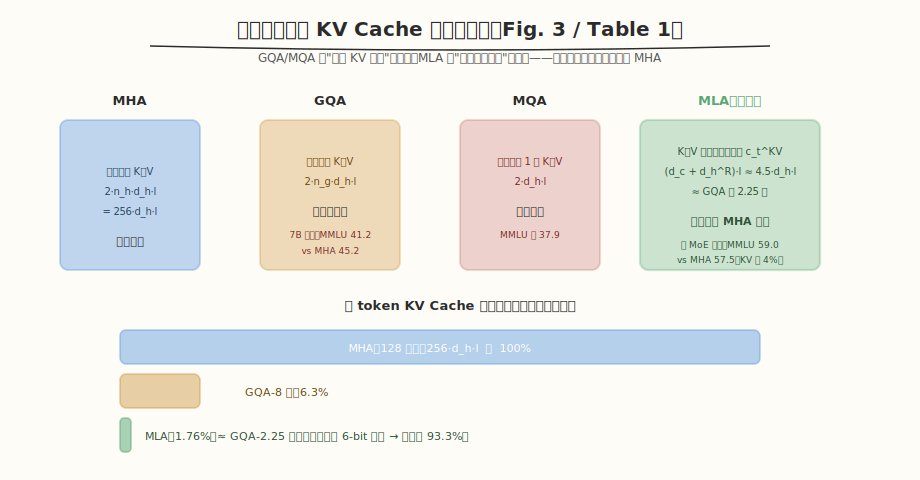
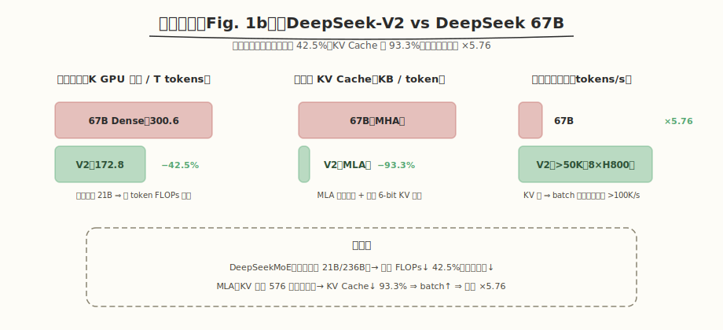

# DeepSeek-V2: A Strong, Economical, and Efficient Mixture-of-Experts Language Model —— 论文精读

> 原文 PDF：[deepseek_v2.pdf](deepseek_v2.pdf)
> 精读规范：[`../SKILL.md`](../SKILL.md)
> 系列精读：MHA 本体见 [Attention Is All You Need](../attention_is_all_you_need/README.md)；KV Cache 为何是吞吐瓶颈见 [vLLM](../vllm/README.md)；KV 更小后如何配合量化部署见 [GPTQ](../gptq/README.md)

---

## 1. Metadata

| 项目 | 内容 |
|---|---|
| Title | DeepSeek-V2: A Strong, Economical, and Efficient Mixture-of-Experts Language Model |
| Authors | DeepSeek-AI（research@deepseek.com） |
| 机构 | 深度求索（DeepSeek） |
| Venue | arXiv 技术报告（无会议） |
| Year | 2024（v1: 2024-05；v5: 2024-06-19） |
| arXiv | [2405.04434](https://arxiv.org/abs/2405.04434) |
| Code / Weights | [deepseek-ai/DeepSeek-V2](https://github.com/deepseek-ai/DeepSeek-V2)（含 DeepSeek-V2-Lite） |
| 任务 | 开源 MoE 大语言模型（预训练 + SFT + RL 全链路） |
| 关键词 | MLA, Low-Rank KV Compression, Decoupled RoPE, DeepSeekMoE, Device-Limited Routing, GRPO, YaRN |

---

## 2. Summary

DeepSeek-V2 是一个 236B 总参数、21B 激活参数的 MoE 模型，靠两个架构创新同时实现"强性能、经济训练、高效推理"：注意力侧的 **MLA**（Multi-head Latent Attention）与 FFN 侧的 **DeepSeekMoE**。

- **Problem**：大模型能力随参数增长，但训练成本和推理吞吐成为瓶颈——MHA 的 KV Cache 限制 batch 与上下文长度；稠密模型每 token 的 FLOPs 与参数成正比。已有的省 KV 方案（GQA/MQA）以性能下降为代价。
- **Method**：MLA 把 K/V **联合低秩压缩**成隐向量 $c_t^{KV}$（512 维）缓存，配合**解耦 RoPE**（单独的共享键 $k_t^R$ 携带位置信息）保住位置编码与矩阵吸收；DeepSeekMoE 用**细粒度专家切分**（160 路由 + 2 共享，Top-6 激活）+ **设备受限路由**（每 token 至多发往 $M=3$ 台设备）+ 三级负载均衡损失控制专家并行的通信开销。
- **Result**：8.1T token 预训练后，仅 21B 激活参数即在开源模型中达到第一梯队；对比 DeepSeek 67B：训练成本 **−42.5%**、KV Cache **−93.3%**、最大生成吞吐 **×5.76**；消融显示 MLA 性能**优于 MHA** 而 KV 仅为其 4%。
- **Contribution**：证明"省 KV Cache"与"强注意力"不是二选一——低秩压缩路线（而非减少头数）可以兼得；并把 MoE 的训练-通信-均衡工程问题系统化，MLA + DeepSeekMoE 成为 DeepSeek-V3/R1 的架构基石。

---

## 3. Background

### 3.1 已有方法及其问题

- **MHA 的 KV Cache 瓶颈**：标准 MHA 每 token 需缓存 $2 n_h d_h l$ 个元素（DeepSeek-V2 的 128 头配置下约 197 万元素/token），限制最大 batch 和序列长度——这与 vLLM 论文诊断的是同一个瓶颈，只是 vLLM 从**存储管理**入手，本文从**结构**入手。
- **GQA / MQA**：让多个 query 头共享 K/V（组共享或全共享），KV Cache 降一个数量级，但论文附录 D.1 的 7B 消融显示性能明显受损（MMLU：MHA 45.2 → GQA-8 41.2 → MQA 37.9）——**省显存与保能力被视为 trade-off**。
- **稠密模型的训练成本**：每 token FLOPs 与参数量成正比，扩大规模就要等比例烧钱；传统 MoE（GShard）用稀疏激活缓解，但粗粒度专家 + 简单路由存在**专家冗余**（不同专家学到相似知识）与**路由崩塌**（负载集中到少数专家）问题，且专家并行的 all-to-all 通信会吃掉稀疏省下的算力。

### 3.2 作者真正想解决的问题

> 能不能在**不牺牲能力**的前提下，同时解决两件事：(1) KV Cache 降一个数量级以上；(2) 训练成本大幅低于同等能力的稠密模型？换句话说——"经济"和"强"能不能不是 trade-off？

---

## 4. Core Idea

```text
Problem     MHA 的 KV Cache 卡死推理吞吐；GQA/MQA 省 KV 但掉能力；
            稠密模型训练成本与参数线性挂钩
   ↓
Observation ① GQA/MQA 掉能力的根源是「减少 K/V 头数」= 粗暴砍掉表示容量；
            K/V 矩阵本身很可能是低秩的 —— 压缩表示比砍头更优
            ② MoE 专家粗粒度导致知识冗余；细粒度切分 + 共享专家
            可以让专家更专精
   ↓
Insight     把 K、V「联合」压缩进一个低秩隐向量 c_t^KV 并只缓存它；
            位置信息交给独立的解耦 RoPE 键，使上投影矩阵可在推理时
            被吸收（不真的展开 K/V）——缓存小、计算不增、能力不降
   ↓
Method      MLA（低秩 KV 联合压缩 + 解耦 RoPE + Q 低秩压缩）
            + DeepSeekMoE（细粒度专家 + 共享专家 + 设备受限路由
            + 三级均衡损失 + token 丢弃）
   ↓
Benefit     KV Cache = MHA 的 ~1/57（消融 MoE 上 4%），性能反超 MHA；
            训练成本 −42.5%，生成吞吐 ×5.76，21B 激活达开源第一梯队
```

一句话：**DeepSeek-V2 的答案是把"省"从"砍容量"改为"压秩"——KV 联合低秩压缩解决推理，细粒度稀疏专家解决训练，两者都不以能力为代价。**

---

## 5. Method

### 5.1 MLA：低秩 KV 联合压缩



- **Purpose**：把每 token 的 KV Cache 从 $2 n_h d_h l$ 压到 $(d_c + d_h^R) l$，同时保持（甚至超过）MHA 的表达能力。
- **Input / Output**：注意力输入 $h_t \in \mathbb{R}^d$；输出 $u_t \in \mathbb{R}^d$。
- **核心操作**：$h_t$ 先经降维矩阵 $W^{DKV}$ 压成 **KV 联合隐向量** $c_t^{KV} \in \mathbb{R}^{d_c}$（$d_c = 512 \ll d_h n_h = 16384$），K 和 V 都从它上投影恢复：$k_t^C = W^{UK} c_t^{KV}$，$v_t^C = W^{UV} c_t^{KV}$。**推理只缓存 $c_t^{KV}$**。
- **矩阵吸收**：由于矩阵乘法结合律，推理时 $W^{UK}$ 可吸进 $W^Q$、$W^{UV}$ 可吸进 $W^O$——**无需真的把 K/V 展开**就能算注意力（见 §6.3）。这让 MLA 在 decode 时既省缓存又不增加计算。
- **Query 也低秩压缩**：$c_t^Q = W^{DQ} h_t$，$q_t^C = W^{UQ} c_t^Q$（$d_c' = 1536$）——不减 KV Cache，目的是**降低训练激活显存**。
- **为什么比 GQA/MQA 强**：GQA/MQA 是"结构化砍掉 K/V 头"，信息通道数直接变少；MLA 保留全部 128 个头的计算图，只是让每个头的 K/V 从一个共享低秩子空间生成——**头的多样性通过上投影矩阵保留**，压缩的是冗余而非容量。消融（Table 9）实证：大 MoE 上 MLA MMLU 59.0 vs MHA 57.5，KV 仅 4%。

### 5.2 解耦 RoPE（Decoupled Rotary Position Embedding）

- **问题**：RoPE 对 Q/K 施加位置相关的旋转。若直接对 $k_t^C$ 加 RoPE，则 $W^{UK}$ 与位置敏感的 RoPE 矩阵耦合——由于矩阵乘法**不可交换**，$W^{UK}$ 无法再在推理时吸进 $W^Q$，只能对每个前缀 token 重新算 K，推理效率崩塌。
- **方案**：新增**专门携带位置信息**的解耦 query/key：$q_t^R = \mathrm{RoPE}(W^{QR} c_t^Q)$（逐头，$d_h^R = 64$），$k_t^R = \mathrm{RoPE}(W^{KR} h_t)$（**全头共享**一份）；最终 $q_{t,i} = [q_{t,i}^C; q_{t,i}^R]$，$k_{t,i} = [k_{t,i}^C; k_t^R]$。
- **效果**：内容路径（$q^C, k^C$）保持位置无关 ⇒ 矩阵吸收依然成立；位置路径只增加 $d_h^R = 64$ 维共享缓存。总 KV Cache $= (d_c + d_h^R) \cdot l = (512 + 64) \times 60 = 34.6$K 元素/token。

### 5.3 DeepSeekMoE：细粒度专家 + 共享专家



- **基本结构**：除第一层外所有 FFN 换成 MoE 层：$N_s = 2$ 个**共享专家**（所有 token 必过，捕捉通用知识，缓解路由专家间的知识冗余）+ $N_r = 160$ 个**路由专家**（中间维度 1536 的细粒度专家，每 token 激活 $K_r = 6$ 个）。
- **路由**：$s_{i,t} = \mathrm{Softmax}_i(u_t^\top e_i)$，其中 $e_i$ 是第 $i$ 个专家的"质心"向量；取 Top-$K_r$ 并按亲和力 $g_{i,t}$ 加权。
- **为什么细粒度**：同样的激活参数量下，把 1 个大专家切成 $m$ 个小专家并激活其中 $k$ 个，组合空间从"选 1"变为 $\binom{Nm}{k}$——专家可以更专精，知识获取更准确（DeepSeekMoE 论文 Dai et al., 2024 的结论，本文沿用）。

### 5.4 让 MoE 训得动：通信与均衡的工程三件套

- **设备受限路由（Device-Limited Routing）**：专家并行把 160 个专家铺在 $D = 8$ 台设备上；细粒度激活（每 token 6 个）意味着 all-to-all 通信频繁。做法：先选亲和力最高的 $M = 3$ 台**设备**，再在其中做 Top-6——把每 token 的通信目标限定在 ≤3 台设备。实测 $M \geq 3$ 时性能与无限制 Top-K 基本持平。
- **三级负载均衡损失**：专家级 $\mathcal{L}_{ExpBal}$（$\alpha_1 = 0.003$，防路由崩塌）、设备级 $\mathcal{L}_{DevBal}$（$\alpha_2 = 0.05$，算力均衡）、通信级 $\mathcal{L}_{CommBal}$（$\alpha_3 = 0.02$，让每台设备**接收**的 hidden state 也均衡——发送已被路由机制限住，接收需要损失来管）。
- **Token 丢弃**：均衡损失只能"鼓励"不能"保证"，训练时按设备算力预算（capacity factor = 1.0）丢弃亲和力最低的 token；约 10% 的训练序列永不丢弃以保持训练-推理一致性；**评估时不丢**。

### 5.5 长上下文扩展与部署优化

- **YaRN 扩窗**：4K → 128K。YaRN 只施加在**解耦共享键 $k_t^R$**（RoPE 的唯一载体）；scale $s = 40$，目标长度 160K；因注意力结构不同，调整长度缩放因子 $\sqrt{t} = 0.0707 \ln s + 1$ 以最小化 PPL。仅用 **32K 序列、1000 步**训练，即在 128K 全窗口 NIAH 测试中表现稳健。
- **部署**：参数转 FP8；KV Cache 再做平均每元素 6 bit 量化；单机 8×H800 生成吞吐 >50K tokens/s（67B 的 5.76 倍），prompt 输入吞吐 >100K tokens/s。

### 5.6 训练基建与对齐

- **预训练**：HAI-LLM 框架；16 路 zero-bubble 流水并行 + 8 路专家并行 + ZeRO-1 数据并行；因激活参数少 + 算子重计算，**不用张量并行**（省通信）；共享专家计算与 all-to-all 通信重叠；MLA 基于改进版 FlashAttention-2 优化。硬件为 H800 集群（NVLink + InfiniBand）。每 T token：DeepSeek 67B 300.6K GPU 小时 vs V2 **172.8K（−42.5%）**。
- **SFT**：1.5M 条（1.2M helpful + 0.3M safety），2 epoch，lr $5 \times 10^{-6}$。讨论发现：SFT 数据 <10K 时 IFEval 显著下降——**"少量 SFT 足够"对该规模模型不成立**。
- **RL（GRPO）**：放弃与 policy 同规模的 critic，用组内奖励均值/方差做 baseline（式 6.8）；**两阶段**——先用 $RM_{reasoning}$ 做代码/数学推理对齐（发现推理能力可持续提升更久），再用 helpful + safety + rule 多奖励做人类偏好对齐；在线 RL 显著优于离线；工程上用 hybrid engine（训练/推理不同并行策略）+ **vLLM 做推理后端** + CPU offload 调度。

---

## 6. Formula Explanation

### 6.1 MHA 基线与 KV Cache 记账

$$
q_t = W^Q h_t,\quad k_t = W^K h_t,\quad v_t = W^V h_t; \qquad
o_{t,i} = \sum_{j=1}^{t} \mathrm{Softmax}_j\!\left(\frac{q_{t,i}^\top k_{j,i}}{\sqrt{d_h}}\right) v_{j,i}
$$

| 变量 | 含义 | DeepSeek-V2 取值 |
|---|---|---|
| $d$ | embedding 维度 | 5120 |
| $n_h$ | 注意力头数 | 128 |
| $d_h$ | 每头维度 | 128 |
| $l$ | 层数 | 60 |

- **KV Cache 公式**：MHA 每 token 缓存 $2 n_h d_h l$ 个元素 = $2 \times 128 \times 128 \times 60 \approx 1.97$M。这是全部后续设计的"账本基准"。

### 6.2 MLA 的低秩联合压缩（全文核心）

$$
c_t^{KV} = W^{DKV} h_t, \qquad k_t^C = W^{UK} c_t^{KV}, \qquad v_t^C = W^{UV} c_t^{KV}
$$

| 变量 | 含义 | 维度 |
|---|---|---|
| $c_t^{KV}$ | K/V 联合压缩隐向量（**唯一需要缓存的 K/V 状态**） | $d_c = 512$ |
| $W^{DKV}$ | 降维矩阵 | $d_c \times d$ |
| $W^{UK}, W^{UV}$ | K/V 上投影矩阵 | $d_h n_h \times d_c$ |

- **为什么成立**：K、V 都是 $h_t$ 的线性函数，两个线性映射的复合 $W^{UK} W^{DKV}$ 是秩 ≤ $d_c$ 的低秩矩阵——相当于假设"逐头 K/V 的 $16384$ 维表示生活在一个 512 维子空间里"，让数据去学这个子空间。
- **联合压缩的妙处**：K 和 V 共享同一个隐向量 ⇒ 缓存只需一份 $d_c$ 而非两份；相比"K、V 各自压缩"进一步减半。
- **推理时缓存**：$d_c \cdot l = 512 \times 60 = 30.7$K 元素/token，是 MHA 的 ~1/64。

### 6.3 矩阵吸收：为什么推理不用展开 K/V

$$
q_{t,i}^{C\top} k_{j,i}^C = (W_i^{UQ} c_t^Q)^\top (W_i^{UK} c_j^{KV}) = c_t^{Q\top} \underbrace{(W_i^{UQ})^\top W_i^{UK}}_{\text{推理前离线合并}} c_j^{KV}
$$

- **为什么成立**：注意力分数只含 $q^\top k$ 的双线性形式，$W^{UK}$ 可被吸收进 query 侧矩阵；同理输出端 $\sum a_i v_i$ 后接 $W^O$，$W^{UV}$ 可被吸进 $W^O$。
- **作用**：decode 时直接在隐向量 $c^{KV}$ 上做注意力，**展开 K/V 的计算（$d_c \to 16384$ 维）完全省去**——缓存和计算双赢。
- **前提**：$c^{KV}$ 路径上不能有任何位置相关操作插在 $W^{UK}$ 与 $W^{UQ}$ 之间——这正是 RoPE 必须"解耦"的原因（§5.2）。

### 6.4 解耦 RoPE 的完整注意力

$$
q_{t,i} = [q_{t,i}^C;\ q_{t,i}^R], \quad k_{t,i} = [k_{t,i}^C;\ k_t^R], \qquad
o_{t,i} = \sum_{j=1}^{t} \mathrm{Softmax}_j\!\left(\frac{q_{t,i}^\top k_{j,i}}{\sqrt{d_h + d_h^R}}\right) v_{j,i}^C
$$

- $k^R$ **全头共享**（类似 MQA 只用于位置通道），缓存仅 $d_h^R = 64$ 维/层。
- 分母变为 $\sqrt{d_h + d_h^R}$：拼接后 QK 维度是 $d_h + d_h^R$，缩放保持 softmax 方差稳定（与标准 Transformer 的 $1/\sqrt{d_k}$ 同一动机）。
- **KV Cache 总账**：$(d_c + d_h^R) l \approx \frac{9}{2} d_h l$（$d_c = 4 d_h$，$d_h^R = d_h/2$）——Table 1 据此称"等于 GQA 仅 2.25 组"。

### 6.5 DeepSeekMoE 的前向与路由

$$
h_t' = u_t + \sum_{i=1}^{N_s} \mathrm{FFN}_i^{(s)}(u_t) + \sum_{i=1}^{N_r} g_{i,t}\, \mathrm{FFN}_i^{(r)}(u_t), \qquad
g_{i,t} = \begin{cases} s_{i,t}, & s_{i,t} \in \mathrm{Topk}(\{s_{j,t}\}, K_r) \\ 0, & \text{otherwise} \end{cases}, \qquad
s_{i,t} = \mathrm{Softmax}_i(u_t^\top e_i)
$$

- $e_i$：第 $i$ 个路由专家的**质心**——路由是"token 与专家质心的相似度匹配"，专家在训练中自然聚类专精。
- 共享专家无门控、恒等激活 ⇒ 通用知识不必在每个路由专家里重复学一遍。
- **Complexity**：每 token FLOPs 只与"共享 2 + 激活 6"个专家相关 ⇒ 236B 总参数只激活 21B，训练成本 −42.5% 的直接来源。

### 6.6 三级负载均衡损失

$$
\mathcal{L}_{ExpBal} = \alpha_1 \sum_{i=1}^{N_r} f_i P_i, \qquad
\mathcal{L}_{DevBal} = \alpha_2 \sum_{i=1}^{D} f_i' P_i', \qquad
\mathcal{L}_{CommBal} = \alpha_3 \sum_{i=1}^{D} f_i'' P_i''
$$

- $f_i$：选专家 $i$ 的 token 比例（硬统计，不可导）；$P_i$：token 对专家 $i$ 的平均亲和力（软，可导）。$f \cdot P$ 的乘积形式让梯度通过 $P$ 推动"少用超载专家"。
- 三级分别约束：**专家**不崩塌（$f_i$ 归一化因子 $N_r / K_r T$）、**设备**算力均衡（按专家组 $\mathcal{E}_i$ 聚合）、**通信**收发均衡（$f_i''$ 以 $D/MT$ 归一，鼓励每台设备接收 ≈ $MT$ 个 hidden state——发送上限已由路由机制保证）。
- **为什么需要三级**：三个失衡发生在不同粒度，单一损失无法同时覆盖——这是"应用语义下沉为损失函数"的典型系统设计。

### 6.7 GRPO 目标（对齐阶段）

$$
\mathcal{J}_{GRPO}(\theta) = \mathbb{E}\left[\frac{1}{G}\sum_{i=1}^{G}\left(\min\left(\frac{\pi_\theta(o_i|q)}{\pi_{\theta_{old}}(o_i|q)} A_i,\ \mathrm{clip}(\cdot, 1\pm\varepsilon) A_i\right) - \beta\, \mathbb{D}_{KL}(\pi_\theta \| \pi_{ref})\right)\right], \qquad
A_i = \frac{r_i - \mathrm{mean}(\{r_1..r_G\})}{\mathrm{std}(\{r_1..r_G\})}
$$

- **动机**：PPO 的 critic 与 policy 同规模，236B 模型上等于再养一个 236B——GRPO 用**同一问题采样 $G$ 个回答的组内统计**做 baseline，砍掉 critic。
- $A_i$ 的直觉：组内标准化——"比同组其他回答好多少"即优势，无需学习绝对价值函数。
- KL 项用无偏估计形式 $\frac{\pi_{ref}}{\pi_\theta} - \log\frac{\pi_{ref}}{\pi_\theta} - 1$（恒非负），防止策略偏离参考模型过远。
- **这项配方的后续影响远超本文**：GRPO 后来成为 DeepSeekMath/DeepSeek-R1 的 RL 核心算法。

---

## 7. Algorithm

**自然语言版（MLA decode 一步）**：输入 $h_t$ → 算 $c_t^{KV} = W^{DKV} h_t$ 与 $k_t^R = \mathrm{RoPE}(W^{KR} h_t)$，**追加进 KV Cache** → query 侧：$c_t^Q = W^{DQ} h_t$，$q^C = W^{UQ} c_t^Q$（推理时实际用吸收了 $W^{UK}$ 的合并矩阵），$q^R = \mathrm{RoPE}(W^{QR} c_t^Q)$ → 每头用 $[q^C; q^R]$ 对缓存的 $[c^{KV}; k^R]$ 做注意力 → $W^{UV}$ 已吸进 $W^O$，直接输出 $u_t$。

**伪代码版**：

```text
# MLA decode step（推理优化后形态）
c_kv = W_DKV @ h_t                       # 512 维，缓存
k_r  = RoPE(W_KR @ h_t)                  # 64 维，缓存（全头共享）
cache.append(c_kv, k_r)
q_c = (W_UQ_absorbed) @ (W_DQ @ h_t)     # W_UK 已离线吸进 query 侧
q_r = RoPE(W_QR @ c_q)
for each head i in 1..128:
    score_j = [q_c_i; q_r_i] · [c_kv_j; k_r_j] / sqrt(d_h + d_h^R)
    o_i = Σ_j softmax(score_j) · c_kv_j  # v 侧已吸进 W_O
u_t = W_O_absorbed @ concat(o_1..o_128)

# DeepSeekMoE 前向（训练）
scores = softmax(u_t @ E.T)              # 160 个专家亲和力
devices = top_devices(scores, M=3)       # 设备受限路由
top6 = top_k(scores[experts on devices], K_r=6)
h' = u_t + Σ_shared FFN_s(u_t) + Σ_{i in top6} g_i FFN_i(u_t)   # all-to-all 通信
loss += α1·L_ExpBal + α2·L_DevBal + α3·L_CommBal
```

**复杂度与瓶颈**：

- MLA decode：每 token 缓存 $576 \times 60 = 34.6$K 元素（MHA 的 1.76%）；注意力计算在 576 维隐空间进行，**矩阵吸收后不展开 K/V**——瓶颈从"搬 KV"转为正常的 GEMV，batch 上限大幅抬高。
- MoE 前向：计算量 ∝ 8 个专家（2 共享 + 6 激活）而非 160；瓶颈是专家并行的 **all-to-all 通信**——设备受限路由（M=3）+ 三级均衡 + 通信/计算重叠专为压它而设。
- 训练显存：Q 低秩压缩 + 算子重计算 ⇒ 无需张量并行。

---

## 8. Figures

### Figure 1（能力-成本总览）

(a) MMLU vs 激活参数：DeepSeek-V2 位于"低激活、高分"的左上角区域，超越 Mixtral 8x22B（39B 激活）而仅用 21B。(b) 三根柱状图：训练成本 −42.5%、KV Cache −93.3%、吞吐 ×5.76。**关键观察**：全文卖点不是单一 SOTA，而是"帕累托前移"——同性能下成本全面更低（见 §9.4 的 SVG 复刻）。

### Figure 2（整体架构）

Transformer block ×60：注意力部分是 MLA（数据流见 §5.1 SVG），FFN 部分是 DeepSeekMoE（见 §5.3 SVG）。注意图中标注 "Cached During Inference" 的只有 $c_t^{KV}$ 与 $k_t^R$ 两个盒子——**这张图的信息核心就是"缓存什么"**。

### Figure 3（MHA/GQA/MQA/MLA 对比）

见 §5.1/§9.2 的 SVG 复刻。数据流视角：GQA/MQA 让多个 query 头"挤"同一份 K/V；MLA 在 K/V 投影中间插入一个"压缩瓶颈"，所有头从共享隐向量展开。**关键观察**：前三种是"头数维度的共享"，MLA 是"秩维度的共享"——这是理解 MLA 为什么能反超 MHA 的钥匙：低秩瓶颈 + 学习的上投影 > 砍头。

### Figure 4（NIAH 128K 压力测试）

32K 训练、128K 评测全绿。**关键观察**：YaRN 只作用于解耦键 $k^R$ 且只训 1000 步即可泛化到 4 倍长度——解耦 RoPE 的设计顺带让长上下文扩展变得干净（位置通路是独立、低维、共享的）。

### Table 1 / 8 / 9（KV Cache 对比与消融）

Table 1：MLA $(d_c + d_h^R)l \approx \frac{9}{2} d_h l$ ≈ GQA-2.25 组，但能力 "Stronger"。Table 8（7B 消融）：MHA > GQA > MQA（MMLU 45.2/41.2/37.9），坐实"砍头掉能力"。Table 9（MLA vs MHA 消融，两个规模）：MLA 全面反超（大 MoE MMLU 59.0 vs 57.5）且 KV 仅 4%~14%。**关键观察**：这是全文最有说服力的一组实验——同架构、同数据、只换注意力，"更强且更省"被直接证实。

---

## 9. Experiments

### 9.1 设置

| 项目 | 配置 |
|---|---|
| 模型 | 60 层，$d = 5120$；MLA：$n_h = 128$，$d_h = 128$，$d_c = 512$，$d_c' = 1536$，$d_h^R = 64$；MoE：2 共享 + 160 路由（Top-6），专家中间维 1536，第一层稠密；总 236B / 激活 21B |
| 数据 | 8.1T tokens 多源语料（中文比英文多 ~12%），BBPE 100K 词表；预训练不掺 SFT 数据 |
| 训练 | AdamW（$\beta_2 = 0.95$），lr $2.4 \times 10^{-4}$，warmup 2K 步 + 60%/90% 处 ×0.316 阶梯衰减；batch 2304→9216（前 225B token 渐增）；seq 4K；H800 集群 |
| 均衡/路由 | $D = 8$ 设备，$M = 3$；$\alpha_1 = 0.003, \alpha_2 = 0.05, \alpha_3 = 0.02$；训练时 token 丢弃、评估不丢 |
| 长上下文 | YaRN（仅 $k^R$），$s = 40$，32K × 1000 步 → 128K |
| 对比模型 | DeepSeek 67B、Qwen1.5 72B、LLaMA3 70B、Mixtral 8x22B（内部框架统一评测设置） |

### 9.2 主结果（Table 2）



- 仅 21B 激活即在多数基准上**大幅超越 DeepSeek 67B**（MMLU 78.5 vs 71.3；MATH 43.6 vs 18.7；HumanEval 48.8 vs 45.1），与 70B 级稠密模型同档。
- 对 Qwen1.5 72B：英/码/数多数占优，中文多学科选择题（C-Eval/CMMLU）略逊；对 Mixtral 8x22B：英文相当且 MMLU 反超，中文碾压；对 LLaMA3 70B：承认英文基础略逊（训练英文 token 不足其 1/4），码/数相当，中文碾压。
- **为什么能证明观点**：对比组里激活参数最少的模型拿到第一梯队成绩——"经济性"不是以能力为代价换来的，Figure 1(a) 的帕累托位置就是论点本身。

### 9.3 消融（附录 B/D）

- **注意力消融（Table 8/9，见 §8）**：全文最关键证据——MLA > MHA > GQA > MQA 的能力排序与 MLA ≈ MHA × 4% 的 KV 同时成立。
- **V2-Lite（Table 6/7）**：16B 小模型（2.4B 激活）同配置复现优势，GSM8K 41.1 vs DeepSeek 7B 17.4——证明架构收益可下沉到小尺度，且为社区提供可复现研究平台。
- **设备受限路由**：$M \geq 3$ 时性能与无限制 Top-K 路由基本持平——通信限制几乎不花精度。

### 9.4 效率实测（§3.2.3）



- **训练**：每 T token 172.8K vs 300.6K GPU 小时（−42.5%）——稀疏激活的 FLOPs 节省 − 通信开销后净省 42.5%，说明工程三件套把 MoE 通信压到了可接受范围。
- **推理**：FP8 参数 + 6bit KV 量化 + MLA，8×H800 生成吞吐 >50K tok/s（×5.76）。**因果链完整**：MLA → KV −93.3% → batch ↑ → 吞吐 ↑——与 vLLM 的"显存决定 batch 决定吞吐"完全同构，本文从结构侧釜底抽薪。

### 9.5 对齐效果（Table 3/4/5）

- Chat (RL)：MT-Bench 8.97、AlpacaEval 2.0 38.9（超 LLaMA3 70B Instruct）；AlignBench 7.91，中文超 GPT-4-0613、中文语言项超 GPT-4-Turbo。
- RL 相对 SFT 在数学/代码继续提升（GSM8K 90.8→92.2，HumanEval 76.8→81.1）——验证两阶段 GRPO 中"推理先行"的设计。
- 同时观察到 **alignment tax**（BBH 等标准基准受损），通过数据与策略调到可接受折中。

### 9.6 作者真正证明了什么

"经济训练 + 高效推理 + 强能力"三角可以同立，且证据链分三层：**机制消融**（MLA vs MHA/GQA/MQA 同条件对照）→ **规模验证**（236B 全量训练 + 70B 级横向对比）→ **系统兑现**（GPU 小时与 tokens/s 的硬数字）。三层缺一，"economical and efficient"就只是口号。

---

## 10. Contributions

1. **MLA（Multi-head Latent Attention）**：K/V 联合低秩压缩 + 解耦 RoPE + 矩阵吸收，首次实现"KV Cache 降一个数量级以上且能力强于 MHA"，打破了 GQA/MQA 以来"省 KV 必掉能力"的共识，成为后续 DeepSeek-V3/R1 及多家模型的注意力标准件。
2. **DeepSeekMoE 的系统化落地**：细粒度专家 + 共享专家的基础上，补齐设备受限路由、三级负载均衡损失、token 丢弃一整套训练工程方案，让 236B MoE 的训练成本比 67B 稠密模型低 42.5%。
3. **全链路开源与实测**：8.1T 预训练 + SFT + GRPO 两阶段 RL 完整配方，配套 V2-Lite 小模型、FP8/6bit 部署数据与 5.76× 吞吐实测，为社区提供了可复现、可研究的 MoE 标杆。

---

## 11. Limitations

**Paper says**：

- 通用 LLM 局限：知识截止、幻觉、非中英文能力有限（语料以中英为主）。
- 对齐税：RL 提升开放对话的同时会损伤 BBH 等标准基准，只能调到"可接受的折中"。
- 英文基础能力略逊 LLaMA3 70B——英文训练 token 不足其 1/4（诚实承认数据差距而非架构差距）。

**Reviewer thinks**：

- **MLA 的"反超 MHA"结论依赖其自家消融**（Table 9 规模到 250B/420B token），且 MLA 侧多了 $W^{UK}/W^{UV}$ 等额外参数，对比是否严格等参/等 FLOPs 论文未逐项拆解；后续社区复现（如部分第三方训练）报告 MLA 在小规模未必稳定占优。
- **矩阵吸收在 prefill 与长 prompt 场景收益有限**：吸收形态主要省 decode 的 K/V 展开；prefill 时仍需完整上投影计算，128K 上下文的 prefill 成本未被充分讨论（>100K tok/s 输入吞吐依赖稀疏 FLOPs，但注意力本身仍是平方复杂度）。
- **KV Cache −93.3% 的数字叠加了 6bit 量化**（结构贡献 ~57×，量化再贡献 ~2.7×）——摘要式表述容易让人把功劳全记在 MLA 上；且 6bit KV 量化对 128K 长文精度的影响未单独消融。
- **路由质心 $e_i$ 的可解释性与崩塌动态**只在附录损失层面处理；token 丢弃（训练时丢弃低亲和力 token）对罕见知识的影响未见分析。
- **236B 模型的 GRPO 细节**（奖励模型规模、KL 系数 $\beta$、$G$ 大小）未完整披露，RL 部分复现难度高。

---

## 12. Related Work

| 方法 | 核心思想 | 与本文差异 | 优点 | 弱点 |
|---|---|---|---|---|
| MHA（Vaswani 2017） | 每头独立 Q/K/V | 本文注意力的对照基线 | 能力最强档 | KV Cache $2 n_h d_h l$，推理瓶颈 |
| MQA（Shazeer 2019） | 全头共享一份 K/V | 本文是"压秩"而非"砍头" | KV 最小（$2 d_h l$） | 能力明显受损（Table 8） |
| GQA（Ainslie 2023） | 分组共享 K/V | 同上；MLA ≈ GQA-2.25 组的缓存但更强 | 可调档位、实现简单 | 仍有能力折损 |
| GShard / Switch（Lepikhin 2021 / Fedus 2021） | 粗粒度 MoE + Top-1/2 路由 | 本文细粒度 160 专家 + Top-6 + 共享专家 | 稀疏计算的开创者 | 专家冗余、粒度粗 |
| DeepSeekMoE（Dai 2024） | 细粒度切分 + 共享专家 | 本文沿用其架构，补通信/均衡工程 | 专家专精度高 | 通信开销需额外机制压制 |
| RoPE / YaRN（Su 2024 / Peng 2023） | 旋转位置编码 / 高效扩窗 | 本文解耦 RoPE 以兼容低秩压缩 | 长上下文标配 | 与低秩 KV 压缩不兼容（本文解决） |
| GRPO 来源（DeepSeekMath, Shao 2024） | 无 critic 的组相对策略优化 | 本文首次用于 236B 级模型 + 两阶段策略 | 省一个 critic 模型 | 组采样成本高 |

---

## 13. Reproducibility

| 检查项 | 情况 |
|---|---|
| Code / Weights | ✅ 模型权重（V2 与 V2-Lite）公开；推理代码公开；训练框架 HAI-LLM 未开源 |
| Dataset | ⚠️ 8.1T 语料的构成、清洗流程仅概述；SFT 1.5M 与 RL 偏好数据未公开 |
| Hyperparameter | ✅ 架构超参（$d_c$、头数、专家数、$M$、$\alpha_{1..3}$）、训练超参（lr、batch schedule、YaRN 参数）几乎全给 |
| Training Details | ⚠️ 并行策略、MFU、通信优化有描述但无代码；GRPO 的奖励模型与关键系数（$\beta$、$G$）未完整披露 |
| Hardware | ✅ H800 集群，GPU 小时与吞吐数字给出实测口径 |

**评分：⭐⭐⭐⭐**（架构与训练超参披露在 200B+ 模型中属于最透明的一档，权重开放、V2-Lite 便于研究复现；扣一星给数据配方与 RL 细节的封闭——"能复现架构，难复现模型"。）

---

## 14. Reading Notes

1. GQA/MQA 省 KV 的方式是"砍 K/V 头数"，MLA 的方式是"K/V 联合低秩压缩"——**砍容量 vs 压冗余**，这是 MLA 能反超 MHA 的本质。
2. MLA 每 token 只缓存 $c_t^{KV}$（512 维）+ 解耦键 $k^R$（64 维），共 576 维 × 60 层 = MHA 的 1.76%。
3. **矩阵吸收**（$W^{UK}$ 吸进 $W^Q$、$W^{UV}$ 吸进 $W^O$）让推理不用展开 K/V——缓存和计算双赢，但要求内容通路位置无关。
4. RoPE 与低秩 KV 压缩不兼容（位置矩阵无法穿过乘法被吸收）⇒ 解耦 RoPE：内容走隐向量、位置走独立共享键。
5. DeepSeekMoE = 细粒度专家（160×Top-6，组合空间大）+ 共享专家（2 个必过，装通用知识）。
6. 细粒度专家的代价是通信——设备受限路由（M=3）把每 token 通信目标限到 3 台设备，性能几乎无损。
7. 负载均衡要管三个粒度：专家（防崩塌）、设备（防算力倾斜）、通信（防接收不均）——辅助损失是应用语义的数学化。
8. 稀疏激活 21B/236B ⇒ 训练 −42.5%；KV −93.3% ⇒ batch ↑ ⇒ 吞吐 ×5.76——两个数字各自对应一条干净的因果链。
9. YaRN 只施加在解耦键 $k^R$ 上、32K 训 1000 步即稳过 128K NIAH——位置通路独立化让扩窗也变简单。
10. GRPO 用组内均值/方差替代 critic，是在 236B 模型上做得起 RL 的关键；两阶段（先推理后偏好）后来成为 DeepSeek-R1 的范式原型。

---

## 15. Interview Version

**2 分钟版**：

> DeepSeek-V2 是 2024 年 DeepSeek 发布的 236B MoE 模型，每 token 只激活 21B，主打"强且省"。它有两个架构创新。第一是 MLA：传统 MHA 的 KV Cache 是推理瓶颈，GQA/MQA 靠减少 K/V 头数省显存但掉能力；MLA 改为把 K 和 V 联合压缩成一个 512 维的隐向量缓存起来，注意力用时再上投影——而且推理时上投影矩阵可以被吸收进 query 和输出矩阵，K/V 根本不用展开。为了兼容 RoPE，它把位置信息拆到一条独立的共享键通路上，叫解耦 RoPE。最终 KV Cache 只有 MHA 的约 1/57，消融显示能力还反超 MHA。第二是 DeepSeekMoE：160 个细粒度路由专家选 6 个，加 2 个所有 token 必过的共享专家；为了压住专家并行的通信，用设备受限路由把每个 token 的发送目标限到 3 台设备，再加专家级、设备级、通信级三种均衡损失。结果相对自家 67B 稠密模型：训练省 42.5%，KV Cache 减 93.3%，生成吞吐 5.76 倍，性能还全面更强。后来 V3 和 R1 都是在 MLA + DeepSeekMoE 这套地基上盖的。

**5 分钟版**（在 2 分钟版基础上展开）：

> 展开几个关键技术点。MLA 的数学本质是把 $W^K, W^V$ 分解成过 512 维瓶颈的低秩乘积，K 和 V 共享同一个隐向量所以缓存只需一份；矩阵吸收依赖乘法结合律，而 RoPE 的位置旋转矩阵会插在两个矩阵中间破坏吸收——这就是解耦 RoPE 存在的原因：内容通路保持位置无关，位置走一条全头共享的 64 维键，缓存只多 64 维。query 侧也做了低秩压缩，但目的是省训练激活显存而不是 KV。MoE 侧，细粒度切分的收益是组合空间：同样激活参数量，160 选 6 的专家组合远比几个大专家丰富，专家更专精；共享专家装通用知识，避免路由专家重复学习。工程上三个细节值得记：M=3 的设备受限路由、三级均衡损失（$f \cdot P$ 乘积形式让不可导的硬统计通过软亲和力传导梯度）、训练时 token 丢弃但保留 10% 序列不丢以保证训推一致。训练基建也配合：激活参数少所以不用张量并行，16 路 zero-bubble 流水 + 8 路专家并行 + ZeRO-1。长上下文用 YaRN 只改解耦键，32K 训 1000 步就上 128K。对齐用 GRPO——不要 critic，用组内标准化奖励当 baseline，先推理对齐再人类偏好；论文还诚实报告了对齐税和英文数据量的差距。局限方面要注意：93.3% 的 KV 缩减里叠了 6bit 量化的贡献，MLA 反超 MHA 的结论来自自家消融，prefill 的平方复杂度并未解决。

---

## 16. Engineering Insights

- **结构层省 KV 与系统层省 KV 的互补**：MLA（结构压缩）与 vLLM PagedAttention（存储管理）、KV 量化（数值压缩）是三个正交层面——本文部署时三者叠加（MLA 57× × 6bit 量化 2.7× ≈ 总 −93.3%）。做 serving 时这条"乘法链"思维比单点优化重要。
- **矩阵吸收 = 离线算子融合**：把 $W^{UK}$ 吸进 $W^Q$ 本质是"推理图重写"——decode kernel 直接在 576 维隐空间做注意力。这要求**训练架构设计时就为推理融合预留结合律路径**（位置通路必须可剥离），是训练-推理协同设计的典范。
- **缓存什么比算多少更重要**：MLA 论文图里最关键的两个盒子是标注 "Cached During Inference" 的 $c_t^{KV}$ 与 $k^R$；k^R 全头共享（位置通道上的 MQA）说明**共享粒度可以按信息类型选择**，不必一刀切。
- **MoE 的真实瓶颈是通信不是计算**：细粒度专家把 FLOPs 打下来后，all-to-all 成为瓶颈；设备受限路由（M=3）把通信从 $O(K_r \cdot D)$ 限到 $O(M)$，三级均衡损失管"发"也管"收"——路由算法、损失函数、并行策略是同一个问题的三个面。
- **无 TP 的决策**：激活参数少 + 重计算 ⇒ 放弃张量并行换通信开销下降——并行策略应按"激活量"而非"总量"设计，这与稠密模型的直觉相反。
- **训练-推理一致性**：10% 序列永不丢 token、评估不丢 token；Q 低秩压缩只为训练激活服务——**训练态与推理态允许不对称，但边界要显式管理**。
- **可迁移性**：MLA 的"低秩瓶颈 + 解耦位置"模式已被 DeepSeek-V3/R1、Kimi K2 等沿用；其 decode kernel 形态（隐向量注意力）催生了 FlashMLA 等专用 kernel——架构创新最终要沉淀为 kernel 生态才算完成。

---

## 17. Future Work

**作者自己提出的方向**：

- 继续扩大 MoE 规模且保持经济训练/推理，下一代目标对标 GPT-4；
- 对齐上追求"helpful + honest + safe"，减少人类监督需求；
- 从纯文本扩展到多模态。

**我认为后来真正发生的延续**：

- **DeepSeek-V3（671B/37B 激活）**：MLA + DeepSeekMoE 直接沿用，补上 FP8 训练、无辅助损失的负载均衡策略（对本文三级损失的再演进）、多 token 预测（MTP）。
- **DeepSeek-R1**：本文的 GRPO + 两阶段 RL（先推理后偏好）正是 R1 纯 RL 推理范式的原型。
- **MLA 的生态化**：FlashMLA / FlashInfer 的 MLA kernel、vLLM/SGLang 原生支持；Kimi K2 等外部模型也采用 MLA。
- **无辅助损失均衡**：V3 用 bias 项动态调整路由替代均衡损失，回答了本文"损失只能鼓励不能保证"的遗留问题。
- **长上下文与注意力稀疏化**：后续 NSA（原生稀疏注意力）等继续在"位置通路解耦"的地基上推进。

---

> **一句话总结**：DeepSeek-V2 用"K/V 联合低秩压缩 + 解耦 RoPE"替代"砍头"，用"细粒度专家 + 共享专家 + 通信感知路由"替代"粗粒度 MoE"，证明了省 KV、省训练与强能力可以同立——MLA 与 DeepSeekMoE 由此成为新一代高效大模型的架构地基。
