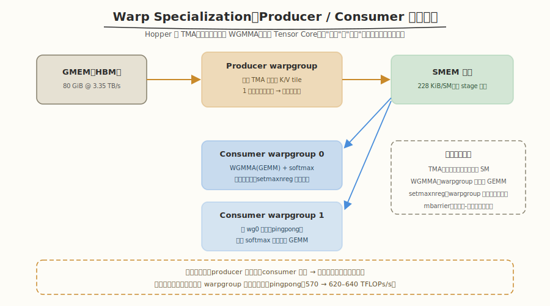
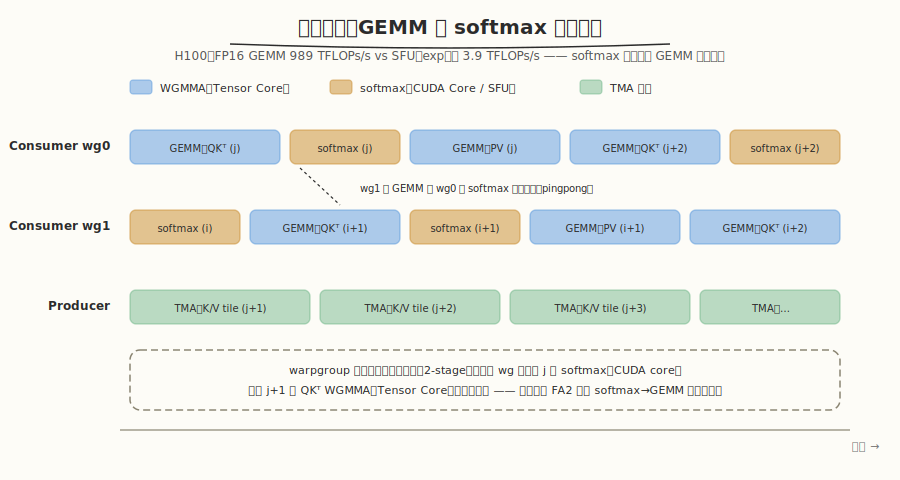
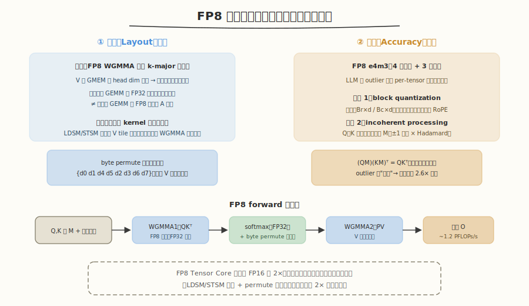
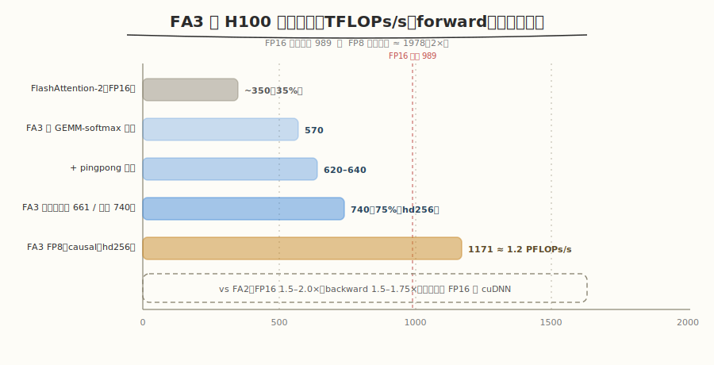

# FlashAttention-3 —— Fast and Accurate Attention with Asynchrony and Low-precision 论文精读

> 原文 PDF：[flashattention3.pdf](flashattention3.pdf)
> 精读规范：[`../SKILL.md`](../SKILL.md)
> 系列精读：[FlashAttention (FA1)](../flashattention/README.md) / [FlashAttention-2 (FA2)](../flashattention2/README.md)

---

## 1. Metadata

| 项目 | 内容 |
|---|---|
| Title | FlashAttention-3: Fast and Accurate Attention with Asynchrony and Low-precision |
| Authors | Jay Shah, Ganesh Bikshandi, Ying Zhang, Vijay Thakkar, Pradeep Ramani, Tri Dao |
| 机构 | Colfax Research / Meta / NVIDIA / Georgia Tech / Princeton / Together AI |
| Venue | arXiv 技术报告（2024）；后收录于 NeurIPS 2024 |
| Year | 2024（arXiv v1: 2024-07-11） |
| arXiv | [2407.08608](https://arxiv.org/abs/2407.08608) |
| Code | [Dao-AILab/flash-attention](https://github.com/Dao-AILab/flash-attention)（基于 CUTLASS 抽象实现） |
| 任务 | Hopper（H100）原生的注意力 kernel：异步 warp 特化 + GEMM/softmax 流水 + FP8 低精度 |
| 关键词 | WGMMA, TMA, Warp Specialization, Pingpong Scheduling, FP8, Block Quantization, Incoherent Processing |

---

## 2. Summary

FlashAttention-3 把 FA 系列从 Ampere（A100）带入 Hopper（H100）时代：算法框架不变，**用硬件原生特性把利用率和精度同时推进**。

- **Problem**：FA2 的设计面向 A100 的同步执行模型，搬到 H100 后**只有 35% 的利用率**——H100 的异步 Tensor Core（WGMMA）、异步拷贝引擎（TMA）、FP8 单元全部闲置。
- **Method**：三招——① **warp 特化**：producer/consumer 分工的异步流水（TMA 搬数与计算重叠），外加 pingpong 调度让两个 consumer warpgroup 的 GEMM 与 softmax 交替互掩；② **warpgroup 内的 GEMM-softmax 两级流水**：重排 FA2 的计算顺序打破串行依赖，让 softmax 藏进异步 WGMMA 的影子；③ **FP8 块量化 + incoherent processing**：在布局约束下用 kernel 内转置/字节重排打通 FP8 WGMMA，用分块量化和 Hadamard 旋转压住量化误差。
- **Result**：FP16 forward 最高 **740 TFLOPs/s（75% 利用率）**，比 FA2 快 **1.5–2.0×**（backward 1.5–1.75×）；FP8 接近 **1.2 PFLOPs/s**；FP8 数值误差比 per-tensor 量化基线低 **2.6×**。
- **Contribution**：示范了"硬件特性驱动的 kernel 设计"完整范式——异步性、低精度这两大 Hopper 红利如何系统性地吃进一个生产级算子。

---

## 3. Background

### 3.1 FA2 在 H100 上为什么只有 35%

FA2 的成功建立在 Ampere 的模型上：warp 同步执行、GEMM 与其他指令串行发射。Hopper 改变了游戏规则：

- **异步执行单元**：TMA 是独立的拷贝硬件（不占 SM 发射带宽）；WGMMA 是 warpgroup 级（4 个 warp 协作）的异步 Tensor Core 指令，发射后立即返回；
- **寄存器可重分配**：`setmaxnreg` 允许 warpgroup 之间动态划转寄存器；
- **FP8 Tensor Core**：吞吐是 FP16 的 2×；
- **算力悬殊拉大**：H100 FP16 GEMM 峰值 **989 TFLOPs/s**，而 special function unit（exp 等）只有约 **3.9 TFLOPs/s**——FA2 里"省一点 non-matmul"的思路在 H100 上不够了，softmax 必须被**完全隐藏**。

### 3.2 低精度的拦路虎

FP8（e4m3：4 位指数 + 3 位尾数）精度脆弱，且 LLM 激活存在 **outlier**（少数极大值）；同时 FP8 WGMMA 有严格的布局约束（操作数只收 k-major），与 attention 双 GEMM 背靠背融合的寄存器布局天然冲突。

### 3.3 作者真正想解决的问题

> 如何让 attention kernel **原生于** Hopper 的异步执行模型，并在不崩精度的前提下吃到 FP8 的 2× 算力？

---

## 4. Core Idea

```
Problem     FA2 在 H100 只有 35% 利用率：同步模型用不上 WGMMA/TMA 的异步性，FP8 也不敢碰
   ↓
Observation H100 的搬数（TMA）、矩阵乘（WGMMA）、普通计算（CUDA core/SFU）
            是三条可以并行推进的硬件通路；它们之间的依赖是"块级"的，可以流水化
   ↓
Insight     ① 把搬数和计算分给不同的 warp（producer/consumer），异步天然重叠
            ② softmax 慢（SFU 3.9 vs GEMM 989 TFLOPs/s），但可以让它和一个块的
               WGMMA 同时跑——只要重排顺序解除 softmax→GEMM 的串行依赖
            ③ FP8 的 2× 算力值得为它做布局手术和量化补偿
   ↓
Method      warp 特化 + pingpong 调度（级间重叠）
            2-stage WGMMA-softmax 流水（级内重叠）
            FP8：LDSM/STSM 片上转置 + byte permute 布局转换 + 块量化 + Hadamard 旋转
   ↓
Benefit     FP16 达 740 TFLOPs/s（75% 峰值），FP8 近 1.2 PFLOPs/s，
            且 FP8 误差反比朴素量化低 2.6×——速度与精度双赢
```

---

## 5. Method

### 5.1 Producer-Consumer 异步（warp 特化 + pingpong）



- **Purpose**：把 TMA 搬数与计算重叠起来——让 Hopper 的异步执行单元（TMA / WGMMA / CUDA core）同时有活干，Tensor Core 不空转。
- **Algorithm（角色分工）**：CTA 内的 warpgroup 分为 **producer**（只发 TMA 搬 K/V tile）和 **consumer**（只做计算）。分工让编译器更容易生成最优指令调度。
- **Algorithm（寄存器重分配）**：TMA 只需 1 个线程驱动，producer 几乎不用寄存器；`setmaxnreg` 把省下的寄存器划给 consumer（MMA 需要大量累加器寄存器）。
- **Algorithm（同步原语）**：producer/consumer 之间用 mbarrier 做块级握手的多 stage 流水。
- **Algorithm（Pingpong 调度）**：两个 consumer warpgroup 交替——wg0 做 softmax（CUDA core/SFU）时 wg1 做 GEMM（Tensor Core），反之亦然。一个 SM 的 Tensor Core 与 CUDA core 同时有活干。
- **Benefit**：实测 hd128 FP16 forward 从 **570 → 620–640 TFLOPs/s**。

### 5.2 Warpgroup 内的 GEMM-Softmax 流水（2-stage）



- **Purpose**：打破 FA2 "GEMM(QKᵀ) → softmax → GEMM(PV) → 下一块 GEMM(QKᵀ)" 的严格串行链——Tensor Core 在 softmax 期间空转。
- **Algorithm（重排，rework FA2）**：2-stage 版本中，块 $j$ 的 softmax 在 CUDA core 上执行的同时，**块 $j+1$ 的 QKᵀ WGMMA 在 Tensor Core 上异步执行**——为此要重新组织 online softmax 的更新顺序，绕开"softmax 输出是下一个 GEMM 输入"的直接依赖（利用 $O$ 累加器作为缓冲：当前块的 PV 与下一块的 QKᵀ 无数据依赖）。
- **Limitations**：寄存器压力上升（需同时驻留两块的状态），3-stage 变体进一步加深流水但 tile 大小与流水深度更难平衡（附录讨论）。
- **Benefit（消融确认，Table 2，batch 4、seqlen 8448、hd128）**：GEMM-softmax 流水 + warp 特化从 **570 → 661 TFLOPs/s**。

### 5.3 FP8：布局手术与量化补偿



- **Purpose**：吃下 FP8 Tensor Core 的 2× 算力，同时把量化误差压住。

**布局（Layout）侧**：

- FP8 WGMMA 只接受 **k-major** 操作数，而 V 通常按 head dim 连续存储 → 第二个 GEMM 需要 V 按序列维连续。论文放弃 GMEM 预转置（推理时 memory-bound 太浪费），选择 **kernel 内用 LDSM/STSM 指令转置 V tile**，并安排在前一个 WGMMA 的影子下执行；
- 第一个 GEMM 的 **FP32 累加器寄存器布局 ≠ 第二个 GEMM 的 FP8 操作数 A 布局** → 用 **byte permute** 按 `{d0 d1 d4 d5 d2 d3 d6 d7}` 重排寄存器（等效于 P 的列置换），配合片上转置时对 V 做匹配的行置换，数学结果不变。

**精度（Accuracy）侧**：

1. **Block quantization**：Q/K/V 按块（$B_r \times d$ / $B_c \times d$）各自一个缩放因子（而非 per-tensor 一个）；量化可**融合进 RoPE**（memory-bound，免费）；FA3 的分块结构天然按块反缩放 S，零计算成本。
2. **Incoherent processing**：Q、K 先乘随机正交矩阵 $M$（±1 随机对角 × Hadamard，$O(d \log d)$，同样融入 RoPE）。因为 $MM^\top = I$，$(QM)(KM)^\top = QK^\top$ **不改变输出**，但每个元素变成随机加权和，outlier 被"摊平"，量化误差大降。
3. 中间计算（softmax、rescale）保持 **FP32**——FP16 FA3 数值误差与 FA2 持平且优于标准实现；FP8 版本误差比 per-tensor 量化基线低 **2.6×**。

---

## 6. Formula Explanation

### 6.1 Incoherent Processing 的正交不变性

$$
(QM)(KM)^\top = QMM^\top K^\top = QK^\top \quad (\because\; M\ \text{正交},\ MM^\top = I)
$$

- **变量**：$M$ 为 $d \times d$ 随机正交矩阵，实现取 $M = D_1 H D_2$（随机 ±1 对角 × Hadamard）。
- **为什么成立**：正交变换保持内积，注意力得分逐元素不变。
- **为什么有用**：量化误差取决于张量的动态范围与 outlier；乘 $M$ 后每个元素是原向量的随机加权和，outlier 能量被均匀分散到所有维度——**信息不变，但分布对量化友好**。这与 QuaRot/SpinQuant 等后续量化工作同源。
- **成本**：Hadamard 变换 $O(d \log d)$，且可融合进前置的 RoPE（memory-bound 操作有富余算力），论文口径为"no extra computation cost"。

### 6.2 Block Quantization 的误差缩放到 S

分块量化后，$S_{ij}$ 块的真实值 = 量化计算值 ×（Q 块缩放 × K 块缩放）——**逐块反量化只是一个标量乘**，可并入 softmax 的 $\alpha$ 缩放，零额外计算。

### 6.3 Softmax 的 FP32 保持

尽管 GEMM 输入是 FP8，softmax 的 $\exp$、求和、rescale 全程 FP32——这是 FA3 FP16 版"误差与 FA2 相同、优于标准实现"的原因，也呼应了 FA1 时代"中间结果留在高精度"的一贯原则。

---

## 7. Algorithm

**自然语言版（FP16 forward）**：每个 CTA 处理一个 Q 块。Producer warpgroup 持续用 TMA 把后续 K/V tile 预取进 SMEM 多 stage 缓冲；两个 consumer warpgroup 以 pingpong 方式交替：各自内部跑 2-stage 流水——在块 $j$ 的 softmax（CUDA core）期间异步发射块 $j+1$ 的 QKᵀ WGMMA，随后发射 PV WGMMA；online softmax 的 rescale 顺序为重排过的 FA2 变体；mbarrier 管理 producer 与 consumer 的缓冲交接。

**伪代码骨架（consumer 主循环）**：

```text
# producer（另一个 warpgroup）：for j: TMA(K_j, V_j) → smem stage[j mod S]; mbarrier.arrive
for j in 1..Tc:                       # consumer 主循环（2-stage）
    wait mbarrier(K_j, V_j 就绪)
    WGMMA_async: S_{j+1} = Q · K_{j+1}ᵀ      # ← 下一个块的 GEMM 先发射（异步）
    softmax 本地计算 on 块 j：m/ℓ 更新、rescale（CUDA core/SFU）
    wait WGMMA(S_{j+1}) 完成（下一轮用）
    WGMMA_async: O += P_j · V_j
    更新 O 累加器与统计量（FP32）
# pingpong：wg0/wg1 的上述循环相位错开，使 GEMM 与 softmax 在 SM 上互补
```

**复杂度与瓶颈**：FLOPs 不变；瓶颈分析从"IO/占用率"转为**发射级调度**——目标是让 Tensor Core pipeline 永不空转。FP8 额外引入布局转换指令（LDSM/STSM/permute），全部安排在异步 WGMMA 的影子下。

---

## 8. Figures

### Figure 1（Pingpong 调度）

两个 warpgroup 的 GEMM/softmax 时间线交错：一个做 softmax 时另一个做 GEMM。**关键观察**：作者诚实注明"实际执行没有图中这么干净"，但仍带来 570→620–640 的提升——图是调度意图，不是精确的 cycle 图。

### Figure 2（2-stage WGMMA-softmax 流水）

同一 warpgroup 内，块 $j$ 的 softmax 与块 $j+1$ 的 QKᵀ WGMMA 并行。**关键观察**：与 Fig. 1 是**两个正交层级**的重叠——warpgroup 之间（pingpong）与 warpgroup 之内（2-stage），共同目标是 Tensor Core 不空转。

### Figures 3–4（FP32 累加器 vs FP8 操作数的寄存器布局）

逐线程逐寄存器画出两种布局的差异。**关键观察**：这是全文最"硬核"的两张图——它说明 FP8 的难点不在算法而在**数据布局工程**：融合背靠背 GEMM 时，上一个 GEMM 的输出布局必须能被下一个 GEMM 直接消费。

### Figures 5–7（基准曲线）

FP16 forward/backward、FP8 forward（hd64/128/256、有无 causal）：FA3 全区间领先，中长序列 FP16 超 cuDNN。**关键观察**：head dim 256 时 FP8 逼近 1.2 PFLOPs/s——大头维度更利于打满 FP8 Tensor Core。

---

## 9. Experiments

### 9.1 效率（H100 80GB SXM5）



设置同 FA2（总 token 16k，hidden 2048，hd 64/128/256）：

| 指标 | 数值 |
|---|---|
| FP16 forward | 最高 **740 TFLOPs/s（75% 峰值）**，vs FA2 **1.5–2.0×**，vs 标准实现 3–16× |
| FP16 backward | vs FA2 **1.5–1.75×**（如 hd128：FA2 ~318 → FA3 ~561 TFLOPs/s @16k） |
| FP8 forward（hd256） | 最高 **1171 TFLOPs/s ≈ 1.2 PFLOPs/s** |
| vs cuDNN（厂商优化闭源库） | ≥1k 序列 FP16 **反超**，FP8 持平或领先（hd64 领先） |

### 9.2 消融（Table 2：batch 4, seqlen 8448, 16 heads, hd128）

| 配置 | 时间 | 吞吐 |
|---|---|---|
| GEMM-softmax 流水，无 warp 特化 | 4.105 ms | 570 TFLOPs/s |
| **FA3 完整** | **3.538 ms** | **661 TFLOPs/s** |

另：pingpong 单独贡献 570 → 620–640。**为什么能证明观点**：提升被逐一归因到 warp 特化与两级流水，不是"整体变快说不清为什么"。

### 9.3 FP8 精度（§4.3）

以 FP64 为参考、按 LLM outlier 分布合成 Q/K/V：FA3 FP8（块量化 + incoherent）的数值误差比标准注意力 + per-tensor 量化低 **2.6×**；FP16 FA3 误差与 FA2 相同（中间值 FP32 的功劳）。

### 9.4 作者真正证明了什么

① 同一套 FA 算法框架，换一套硬件原生实现可以再拿 1.5–2×；② 异步性是可以工程化管理的（warp 特化 + 两级流水）；③ FP8 的精度损失可以用零成本的数学变换（正交旋转 + 分块量化）实质性压住。

---

## 10. Contributions

1. **Hopper 原生 attention**：首个系统性利用 WGMMA/TMA 异步性的 FA 实现——warp 特化 + pingpong + warpgroup 内 2-stage 流水，FP16 达 75% 峰值（740 TFLOPs/s）。
2. **FP8 attention 工程范式**：kernel 内 LDSM/STSM 转置 + byte permute 解决布局冲突，块量化 + incoherent processing 解决精度——FP8 近 1.2 PFLOPs/s 且误差比基线低 2.6×。
3. **方法论示范**：展示了"新硬件特性 → 执行模型重构 → 数值补偿"的完整 kernel 演进路径，为 Blackwell（FP4）时代预先写好剧本。

---

## 11. Limitations

**Paper says**：

- 寄存器压力是 2-stage/3-stage 流水的主要约束，tile 大小与流水深度难以兼得；
- 实现基于 CUTLASS 抽象但仍需专家级 kernel 工程，泛化到非 Hopper 架构需要重做；
- pingpong 实际效果"不如示意图干净"（调度受制于硬件仲裁）。

**Reviewer thinks**：

- **绑定 Hopper 过深**：WGMMA/TMA/setmaxnreg/LDSM/STSM 全是 Hopper 专有——FA2 的"Triton 可近似复现"优势在 FA3 上明显减弱，这是性能与可移植性的经典权衡；
- FP8 只覆盖 **forward**（backward 仍是 FP16），端到端训练的 FP8 化留给了后续工作；
- 精度验证用**合成 outlier 分布**而非真实 LLM 激活/真实下游任务——2.6× 的改善在实际模型精度上的传导未被直接测量；
- 与 cuDNN 的对比口径是"中短序列落后、长序列反超"，说明 FA3 的流水开销在小 shape 上有固定成本——并非全区间支配性优势；
- 3-stage 变体只出现在附录，主文数字均来自 2-stage，流水深度的设计空间探索不完整。

---

## 12. Related Work

| 方法 | 核心思想 | 与本文差异 | 优点 | 弱点 |
|---|---|---|---|---|
| FlashAttention (FA1) | IO-aware tiling + online softmax | FA3 的算法框架来源 | IO 近最优 | 面向 Ampere 同步模型 |
| FlashAttention-2 | 并行度 + warp 划分 + 砍 non-matmul | FA3 重排其计算顺序以适配异步 | 执行高效、可移植 | H100 仅 35% 利用率 |
| cuDNN attention（NVIDIA） | 厂商闭源优化 | FA3 中长序列反超 | 高度调优 | 闭源、不可定制 |
| Triton FA | 高层 DSL 实现 | FA3 用 CUTLASS 直写硬件特性 | 易改易移植 | 达不到 FA3 的硬件利用率 |
| QuaRot / SpinQuant（量化） | 正交旋转压 outlier | incoherent processing 同源思想 | 模型级量化 | 面向权重/激活，非 kernel 内 |
| MQA/GQA/MLA | KV 压缩变体 | 与 FA3 正交可组合 | 省 KV Cache | 不解决执行效率 |
| CUTLASS FMHA | NVIDIA 官方模板 | FA3 基于 CUTLASS 原语但自研流水 | 维护性好 | 灵活性受限 |

---

## 13. Reproducibility

| 检查项 | 情况 |
|---|---|
| Code | ✅ 官方 flash-attention 库（CUTLASS 实现），含 FP8 路径 |
| Benchmark | ✅ 设置完整（token 数、shape、FLOPs 口径与 FA2 一致） |
| 消融 | ✅ warp 特化/流水/pingpong 分别归因（Table 2） |
| 精度方法 | ✅ 合成 outlier 分布 + FP64 参考，方法描述完整 |
| Hardware | ⚠️ 仅限 H100 SXM5（132 SM 口径）；其他 SKU 需重调 |

**评分：⭐⭐⭐⭐☆**（代码、基准、消融齐全；扣一星：深度绑定单一硬件 + FP8 精度缺少真实模型端到端验证，普通研究者复现 FP8 路径门槛高。）

---

## 14. Reading Notes

1. FA2 在 H100 只有 35% 利用率——**换架构不换实现，等于浪费一半硬件**。
2. Hopper 三红利：TMA 异步拷贝、WGMMA 异步 GEMM、FP8 双倍算力——FA3 三招分别对应。
3. Warp 特化 = producer 只搬数 + consumer 只算数，`setmaxnreg` 把寄存器从 producer 划给 consumer。
4. Pingpong：两个 consumer warpgroup 的 softmax 与 GEMM 交错互掩（570→620–640 TFLOPs/s）。
5. 2-stage 流水：warpgroup 内块 j 的 softmax 与块 j+1 的 QKᵀ WGMMA 并行——需要重排 FA2 打破串行依赖。
6. H100 上 GEMM 989 vs SFU 3.9 TFLOPs/s：softmax 不是"省"的问题，是"藏"的问题。
7. FP8 难点一半在布局：k-major 约束 → LDSM/STSM 片上转置；累加器≠操作数布局 → byte permute。
8. Incoherent processing：乘正交矩阵 $M$ 不改变 $QK^\top$，却把 outlier 摊平——量化误差 2.6× 下降，成本 $O(d \log d)$ 且可融进 RoPE。
9. Block quantization 与 FA 的分块结构天然契合：逐块反缩放只是一个标量乘。
10. FP16 达 740 TFLOPs/s（75%），FP8 近 1.2 PFLOPs/s；中长序列反超 cuDNN——开源 kernel 首次在 H100 上压过厂商库。

---

## 15. Interview Version

**2 分钟版**：

> FlashAttention-3 是 2024 年 Tri Dao 团队和 NVIDIA、Meta 等合作的工作，目标是把 FA2 在 H100 上 35% 的利用率救回来。手段是三招：第一，warp 特化——用 Hopper 的 TMA 异步拷贝和 WGMMA 异步 Tensor Core，把 warpgroup 分成只搬数的 producer 和只计算的 consumer，两个 consumer 之间再 pingpong，让一个做 softmax 时另一个做 GEMM；第二，warpgroup 内部再做 2-stage 流水，重排 FA2 的顺序，让当前块的 softmax 和下一块的 QKᵀ WGMMA 并行——因为 H100 上 exp 的吞吐只有 GEMM 的 1/250，softmax 必须整个藏起来；第三，FP8——用 kernel 内 LDSM/STSM 转置和字节重排解决布局约束，用分块量化和 Hadamard 正交旋转压量化误差。结果 FP16 到 740 TFLOPs/s（75% 峰值），FP8 接近 1.2 PFLOPs/s，误差还比朴素 FP8 低 2.6 倍。

**5 分钟版**（在 2 分钟版基础上展开）：

> 讲几个面试官可能追问的细节。异步性管理：producer/consumer 之间用 mbarrier 握手，多 stage SMEM 流水；`setmaxnreg` 把 producer 几乎不用的寄存器划给 consumer——因为 TMA 一个线程就能驱动。依赖重排：FA2 的 GEMM→softmax→GEMM 是串行链，FA3 利用 O 累加器作为缓冲，让块 j 的 PV GEMM 与块 j+1 的 QKᵀ GEMM 没有数据依赖，从而把 softmax 挪到异步 WGMMA 的影子下。FP8 布局：FP8 WGMMA 只收 k-major 操作数，所以 V 要片上转置；第一个 GEMM 的 FP32 累加器布局和第二个 GEMM 的 FP8 操作数布局不一致，用 byte permute 按固定模式重排，再配合 V 的行置换保持数学等价。精度：incoherent processing 乘随机正交矩阵 M（±1 对角乘 Hadamard），利用 $(QM)(KM)^\top = QK^\top$ 的不变性摊平 outlier，这个想法和 QuaRot 同源。消融上，warp 特化加两级流水从 570 提到 661 TFLOPs/s。局限也要答得出：FP8 只有 forward、深度绑定 Hopper、精度验证是合成分布而非真实模型——这些正是后续工作和面试加分点。

---

## 16. Engineering Insights

- **硬件特性清单 → 执行模型重构**：FA3 是"对着新硬件 feature list 重写 kernel"的范本。面试/工作中拿到新架构（Blackwell、TPU v5、昇腾）的第一步同样是：列出异步单元、专用指令、精度格式，然后问"现有 kernel 的哪条假设被打破了"。
- **两条并行通路思维**：TMA（搬数）、Tensor Core（GEMM）、CUDA core/SFU（其他）是三条独立资源；kernel 优化的高级形态是**资源级流水**——任何时刻三条通路都不空转。Pingpong（跨 warpgroup）+ 2-stage（warpgroup 内）正是这个思想的两层实例。
- **依赖是设计出来的**：FA2→FA3 的"rework"说明串行依赖很多时候是**表达顺序**而非**逻辑必需**——引入缓冲（O 累加器）即可解耦。写 kernel 时主动问：这个依赖是真的，还是只是我这么写的？
- **布局工程与算法同等重要**：FP8 的一半工作量在 LDSM/STSM/byte permute——融合多个 GEMM 时，"上一个算子的输出布局能否被下一个直接消费"必须在设计图上就解决。
- **免费午餐位置**：块量化融进 RoPE、Hadamard 融进 RoPE、转置藏进 WGMMA 影子——**memory-bound 操作和异步窗口是白捡算力的两个地方**。
- **寄存器是稀缺货币**：`setmaxnreg` 的启示是寄存器分配本身可以成为调度变量；流水深度、tile 大小、occupancy 的三角权衡最终都落到寄存器预算上。
- **对推理引擎的传导**：FA3 的 FP8 路径直接服务 inference（forward only）；配合 KV Cache 量化，是 H100 推理栈（TensorRT-LLM、FlashInfer）的关键构件。

---

## 17. Future Work

**作者自己提出的方向**：

- FP8 推广到 backward pass（完整 FP8 训练）；
- 3-stage 及更深流水的设计空间；
- 将 warp 特化与低精度技术推广到 attention 之外的算子。

**我认为后来真正发生的延续**：

- **Blackwell 适配**：FP4/更细粒度量化格式 + tcgen05 指令——FA3 的"布局 + 量化补偿"框架直接平移；
- **推理框架集成**：FlashInfer、TensorRT-LLM 吸收 FA3 的 Hopper kernel；FA3 的 FP8 forward 成为长上下文推理的标准路径；
- **量化主线合流**：incoherent processing 与 QuaRot/SpinQuant 的思想汇合，"旋转量化"成为 LLM 压缩的标准工具；
- **自动化方向**：CUTLASS FMHA 模板、Helion/Triton 的 warp-specialization 支持——把 FA3 的手工流水变成可编程抽象，回应 FA1 时代就提出的"高级语言写 IO-aware kernel"。

---

> **一句话总结**：FA1 教会 attention 看内存层级，FA2 教会它填满 SM，FA3 教会它驾驭异步与低精度——同一个数学公式，三次贴着硬件进化，各自兑现一个数量级中最大的一块红利。
