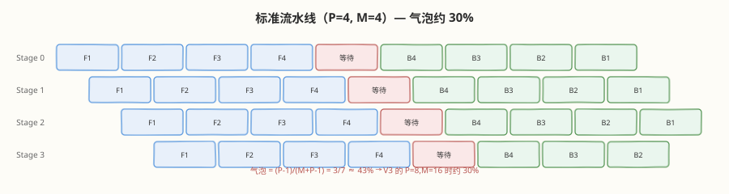
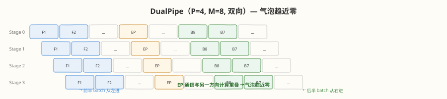
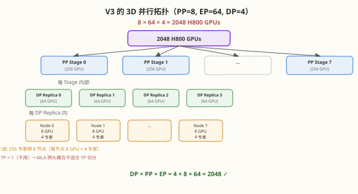

# Day 3（周三）：训练效率与基础设施 —— 万卡集群怎么炼模型

> **本周定位**：本专题是"读论文"视角的一周——不写 kernel，目标是跟上 2025–2026 年开源大模型最前沿（DeepSeek V3 → R1 → V3.2 与 Kimi K1.5 → K2 → K3 两条技术线）。Day 3 转向前沿实验室真正的护城河——**训练工程和优化器**。Day 1 学了 V3 的架构（671B/37B MoE），Day 2 学了 R1 的 RL（GRPO 每步采 64 个回复），但"671B 模型怎么训得动""万亿参数训练为什么不崩"——这些问题的答案全在今天。用三篇材料拼出全景：DeepSeek-V3 报告第 3 章（[arXiv:2412.19437](https://arxiv.org/abs/2412.19437)）的 DualPipe + FP8 + EP 通信、Moonlight 论文的 Muon 优化器规模化验证、以及《Kimi K2》（[arXiv:2507.20534](https://arxiv.org/abs/2507.20534)）预训练章节的 MuonClip / QK-clip。
>
> **前置要求**：已完成 Day 1（理解 DeepSeekMoE 的 256 专家 × 8 节点 EP 架构）和 Day 2（理解 RL 训练的 rollout 成本）；了解混合精度训练基本概念（FP16/BF16/FP32）即可
>
> **今日目标**：① 掌握大模型训练的 3D 并行策略（DP + PP + EP），能说清 V3 为什么不用 TP、PP=8/EP=64/DP=4 怎么组合在 2048 张 H800 上；② 吃透 DualPipe 双向流水线的气泡消除原理；③ 理解 FP8 混合精度训练的精度风险与 V3 的 tile-wise scaling 解法；④ 掌握 Muon 优化器的矩阵正交化原理，能说清它凭什么挑战 AdamW；⑤ 理解 MuonClip 的 QK-clip 如何消灭万亿参数训练的 loss spike
>
> **时间投入**：5h（精读 V3 报告第 3 章 1.5h + Muon/Moonlight 1h + K2 MuonClip 1h + 动手算训练账单 0.5h + 整理笔记 1h）
>
> **检验标准**：能画出"数据并行 + 流水线并行 + 专家并行"三者如何组合在 V3 的 2048 张 GPU 上，且能给出关键数字（FP8 省约一半计算、DualPipe 气泡接近零、V3 训练成本约 558 万美元、K2 在 15.5T token 上零 loss spike）

---

## 本日在本周知识图谱中的位置

| 本日产出 | 对应本周后续内容 |
|----------|-----------------|
| 3D 并行策略（DP + PP + EP，无 TP） | Day 5 Agentic RL（RL 训练系统同样需要 3D 并行部署 policy + ref 模型） |
| DualPipe 双向流水线 + 计算-通信重叠 | Day 6 K3（2.8T 模型的训练工程基础，更大模型更依赖流水线效率） |
| FP8 混合精度 + tile-wise scaling | Day 4 长上下文（FP8 KV cache 降低长上下文显存，Day 1 已预告） |
| Muon 优化器（矩阵正交化 + token 效率） | Day 5 K2 全貌（Muon 是 K2 预训练的核心优化器，贯穿 agentic 训练） |
| QK-clip 防训练崩溃 | Day 6 K3（3T 级模型的训练稳定性保障） |
| V3 训练成本约 558 万美元 | Day 7 整合（理解"训练效率是前沿实验室的护城河"这一全景） |

> 💡 **Day 3 的定位**：今天建立"读训练基础设施章节的框架"——拿到任何一篇技术报告的训练章节，先找四个要素：**用了什么并行策略（DP/TP/PP/EP 怎么组合）、什么精度（BF16/FP8）、什么优化器（AdamW/Muon/其他）、训练稳定性怎么保证（loss spike 频率）**。V3 和 K2 的差异全落在这四点上。

---

### 学习任务 1：训练并行策略全景 —— DP / TP / PP / EP 四维并行（40 分钟）

#### 为什么单卡装不下 671B

Day 1 算过：V3 的 671B 参数在 BF16 下约 1.3 TB——单张 H800（80 GB 显存）只装得下约 6%。训练时还要存优化器状态（AdamW 的 momentum + variance，各一份 = 2.6 TB）和梯度（1.3 TB），总共约 **5.2 TB**——需要约 65 张 H800 才能装下权重 + 优化器。再加上激活显存，**必须切分到多卡**。

#### 四种并行策略

| 策略 | 切什么 | 切法 | 通信模式 | V3 用不用 |
|------|--------|------|---------|----------|
| **DP**（数据并行） | 数据 | 每卡持完整模型副本，各处理不同 batch | all-reduce 梯度 | ✅ DP=4 |
| **TP**（张量并行） | 权重矩阵 | 把 $W$ 按行/列切到多卡，各算一部分 | all-reduce 每层结果 | ❌ **不用** |
| **PP**（流水线并行） | 层 | 模型按层切成 $P$ 段，各段在不同卡上 | 点对点传激活 | ✅ PP=8 |
| **EP**（专家并行） | 专家 | 256 个专家铺到多卡，每卡持部分专家 | all-to-all dispatch/combine | ✅ EP=64 GPU（8 节点） |

#### V3 为什么不用 TP

TP（Megatron-LM 的核心策略）把注意力/FFN 的权重矩阵按行/列切到多卡，每卡只算部分 GEMM——但 V3 的 **MLA 不适合 TP**：

- MLA 的核心是低秩压缩（$c^{KV} = W^{DKV} h$，512 维潜向量），压缩后的表示是**跨头耦合**的——不能像 MHA 那样把每个头分到不同卡上
- 矩阵吸收（$W^{UK}$ 吸进查询侧）后，推理时的矩阵结构和标准 attention 不同，TP 切分方式需要重写
- V3 的 MoE 专家本来就是"天然可切分"的（每个专家独立）——EP 替代了 TP 的角色

> 💡 **关键洞察**：Megatron 经典的 3D 并行是 DP + TP + PP，V3 换成了 **DP + PP + EP**——用专家并行替代张量并行。这是因为 MoE 的专家天然可独立分配到不同 GPU，比切分权重矩阵更自然、通信更少。这也意味着**读懂 V3 的训练拓扑要跳出 Megatron 的框架**。

#### EP 的 all-to-all 通信：MoE 的命脉

Day 1 学过 V3 的 MoE 层：256 路由专家 Top-8，节点受限路由 $M{=}4$。EP 的数据流：

```
每个 GPU 持有 4 个专家（256 专家 / 64 GPU = 4）
每个 micro-batch 的数据流：
  1. 本地路由：计算 Top-8 专家选择
  2. all-to-all dispatch：把 token 发到持有目标专家的 GPU（最多 4 个节点）
  3. 专家计算：每个 GPU 用本地专家 FFN 处理收到的 token
  4. all-to-all combine：把结果发回原始 GPU
  5. 加权聚合：用门控权重合并 8 个专家的输出
```

| 通信量 | 公式（每层每 micro-batch） | 说明 |
|--------|--------------------------|------|
| dispatch | $B \times d \times M / N_{\text{nodes}}$ | $B$=batch/token 数，$d$=隐藏维度 7168，$M{=}4$ 节点 |
| combine | 同上 | 结果原路返回 |
| 总计 | $2 \times B \times d \times M / N_{\text{nodes}}$ | 每层两次 all-to-all，58 个 MoE 层 → 116 次 |

V3 的优化：
- **节点受限路由**（$M{=}4$ 而非 8）：通信量砍半
- **all-to-all 与计算重叠**：DualPipe 的核心设计目标就是把这个通信藏起来
- **DeepEP**：DeepSeek 开源的专用 EP 通信 kernel，低延迟 all-to-all dispatch/combine

> ⚠️ **EP 通信是 MoE 训练的最大瓶颈**：稠密模型用 TP，通信是 all-reduce（每层 2 次，可 overlap）；MoE 用 EP，通信是 all-to-all（每层 2 次，数据依赖更复杂）。V3 的 DualPipe、节点受限路由、DeepEP 三个设计全是为了压这条通信——这就是 Day 1 说的"Day 3 会再遇到 MoE 通信的工程挑战"。

---

### 学习任务 2：DualPipe 精读 —— 双向流水线把气泡压到零（50 分钟，今日核心）

精读 V3 报告 §3.2。DualPipe 是 V3 训练系统的核心创新——专门为 MoE + EP 设计的双向流水线并行算法。

#### 流水线并行的气泡问题

PP 把模型按层切成 $P$ 段（V3 的 $P{=}8$），每段在不同 GPU 上。一个 batch 被分成 $M$ 个 micro-batch 依次流入流水线：



**气泡**：前几个 micro-batch 的 forward 还没流到后面的 stage，后面的 stage 在空等；最后的 micro-batch 的 backward 还没流回前面的 stage，前面的 stage 也在空等。

气泡占比公式：

$$\text{bubble} = \frac{P - 1}{M + P - 1}$$

以 V3 的 $P{=}8$、$M{=}16$ 为例：气泡 $= 7/23 \approx 30\%$——近三成算力浪费在空等上。

#### 1F1B 的改进

标准 GPipe 先做所有 forward 再做所有 backward，气泡一样但激活显存大（要存所有 $M$ 个 micro-batch 的中间结果）。**1F1B**（one forward one backward）交错执行：做完一个 micro-batch 的 forward 立刻排队它的 backward——激活显存降到 $O(P)$ 而非 $O(M)$，但**气泡不变**。

#### DualPipe 的核心：双向 + 计算-通信重叠

DualPipe 的两个关键设计：

**设计 1：双向流水线**

micro-batch 从流水线**两端同时进入**——前半从 Stage 0 → Stage $P{-}1$，后半从 Stage $P{-}1$ → Stage 0：



每个 stage 在等一个方向的 micro-batch 时，可以处理另一个方向的——**双向交叉填充把单方向的等待气泡填掉**。

**设计 2：EP 通信与计算重叠**

每个 stage 做 MoE 前向/反向时，有两段 all-to-all 通信（dispatch + combine）。DualPipe 把这段通信时间**和另一个方向的计算重叠**：

| 时隙 | 方向 A | 方向 B |
|------|--------|--------|
| 1 | 方向 A 的 EP all-to-all 通信 | 方向 B 的 forward/backward 计算 |
| 2 | 方向 A 的 forward/backward 计算 | 方向 B 的 EP all-to-all 通信 |

> 💡 **核心洞察**：DualPipe 不是"减少气泡"，而是"用有用的工作填充气泡"——EP 通信本来是纯等待，现在被另一个方向的计算填满了。当 micro-batch 数 $M$ 远大于 PP 段数 $P$ 时，气泡趋近于零。

#### DualPipe 的效果

| 指标 | 标准 1F1B（$P{=}8, M{=}16$） | DualPipe（同配置） |
|------|---------------------------|-------------------|
| 气泡占比 | ~30% | **接近 0**（$M \gg P$ 时） |
| EP 通信隐藏 | 无（通信时 GPU 空等） | **完全重叠**（通信与反向计算并行） |
| 激活显存 | $O(P)$（1F1B 已优化） | $O(P)$（同 1F1B） |

> ⚠️ **DualPipe 的前提**：需要 micro-batch 数 $M$ 足够多（V3 训练时 $M \geq 16$），且 micro-batch 是偶数（双向各一半）。当 $M$ 太少（如推理时 $M{=}1$），DualPipe 退化为标准流水线——它是**训练专用**优化。

> 💡 **连接 Day 2**：R1 的 RL 训练也用 DualPipe。但 RL 的 rollout 是逐 token 生成（$M{=}1$），无法用 DualPipe 加速——这就是为什么 Day 2 说"RL 的 rollout 是训练系统最贵的部分"。DualPipe 只能加速 prefill/forward/backward，加速不了 autoregressive decode。

---

### 学习任务 3：FP8 混合精度训练 —— 在精度边缘跳舞（50 分钟，今日核心）

精读 V3 报告 §3.3。FP8 是 V3 训练效率的关键——把大部分 GEMM 从 BF16 降到 FP8，计算量减半（H800 的 FP8 Tensor Core 算力是 BF16 的 2 倍）。

#### FP8 格式：比 BF16 少一个字节

| 格式 | 总位数 | 指数位 | 尾数位 | 动态范围 | 精度 | 每元素字节 |
|------|--------|--------|--------|---------|------|-----------|
| FP32 | 32 | 8 | 23 | ±3.4e38 | ~7 位有效数字 | 4 |
| BF16 | 16 | 8 | 7 | ±3.4e38 | ~2 位有效数字 | 2 |
| FP16 | 16 | 5 | 10 | ±65504 | ~3 位有效数字 | 2 |
| **FP8 E4M3** | 8 | 4 | 3 | **±448** | ~1 位有效数字 | **1** |
| **FP8 E5M2** | 8 | 5 | 2 | **±57344** | ~0.5 位有效数字 | **1** |

> 💡 **关键观察**：FP8 E4M3 的动态范围只有 ±448（BF16 是 ±3.4e38）——**小了 8 个数量级**。如果张量里有超过 448 的值，FP8 直接溢出变 inf。这就是 FP8 训练的核心风险：**不是算不准，而是会溢出**。

#### FP8 训练的三个精度风险

| 风险 | 描述 | 后果 |
|------|------|------|
| **激活值溢出** | 前向传播中某些激活值 > 448 | FP8 变 inf → NaN 传播 → loss spike |
| **梯度下溢** | 反向传播中梯度太小（< 2^-9 ≈ 0.002） | FP8 变 0 → 梯度消失 → 训练停滞 |
| **累积误差** | GEMM 用 FP8 输入但 FP32 累加，累加值转回 FP8 时丢精度 | 累积偏差 → 模型质量下降 |

#### V3 的解法：tile-wise scaling + 在线量化

**核心创新 1：tile-wise（分块）缩放因子**

传统做法是每个张量一个缩放因子（per-tensor scaling）——但一个 $m \times n$ 的矩阵里，不同区域的值范围可能差几十倍，一个缩放因子顾此失彼。

V3 的做法：**每 128 × 128 的块（tile）一个独立的缩放因子**：

$$\text{scale}_{\text{tile}} = \frac{448}{\max(|\text{tile}|)}$$

- 缩放粒度从 per-tensor（1 个）到 per-tile（$m/128 \times n/128$ 个）
- 每个 tile 独立适配自己的值范围，不互相拖累
- 类比：per-tensor 是"一张照片一个曝光值"，tile-wise 是"每个 128×128 像素块一个曝光值"——后者能同时拍亮处和暗处

**核心创新 2：在线动态量化（Online Quantization）**

- 权重：**离线量化**（训练开始时量化一次，后续不变——权重变化慢）
- 激活：**在线量化**（每次前向传播实时统计 max，算出缩放因子，再量化）
- 不需要校准数据集（和推理量化不同），因为训练时每步都在自适应

**核心创新 3：选择性 FP8（不是全部 FP8）**

V3 不是把所有计算都降到 FP8，而是**只在安全的地方用 FP8**：

| 计算 | 精度 | 原因 |
|------|------|------|
| MoE 层 FFN 的 GEMM | **FP8** | 专家 FFN 的值范围可控，收益最大 |
| 注意力前向 GEMM（$Q,K,V$ 投影） | **FP8** | 收益大，值范围可控 |
| 注意力 softmax | BF16 | softmax 对精度敏感（exp/div），不能用 FP8 |
| 注意力 score 计算（$QK^T$） | BF16 | 动态范围大，FP8 会溢出 |
| 3 层稠密 FFN | BF16 | 稠密层值范围波动大，FP8 不安全 |
| 梯度累加 | FP32 | 反向传播的累加必须高精度 |
| 优化器状态 | FP32 | AdamW/Muon 的 momentum 必须高精度 |

> 💡 **一句话总结**：V3 的 FP8 = tile-wise scaling（细粒度防溢出）+ 在线量化（自适应激活值范围）+ 选择性应用（只用在安全的 GEMM 上）。效果是大部分前向 GEMM 用 FP8，反向梯度的累加和优化器状态保持 FP32——**在不掉点的前提下省约一半计算**。

#### FP8 的收益

| 指标 | BF16 训练 | FP8 训练 | 收益 |
|------|----------|---------|------|
| Tensor Core 算力（H800） | ~990 TFLOPS | ~1979 TFLOPS | **2×** |
| 激活显存（前向） | 2 bytes/元素 | 1 byte/元素 | **2×** |
| KV cache 显存（训练时存激活） | 2 bytes/元素 | 1 byte/元素 | **2×** |
| 通信量（EP all-to-all） | 2 bytes/元素 | 1 byte/元素 | **2×** |
| 训练质量 | 基线 | **无损**（消融验证） | — |

> ⚠️ **回答关键问题：FP8 训练的精度风险在哪**？三个风险：① 激活值溢出（E4M3 范围只有 ±448，超了变 inf）；② 梯度下溢（小梯度变 0）；③ 累积误差（FP32 累加转回 FP8 时丢精度）。DeepSeek 的解法：tile-wise scaling（每 128×128 块独立缩放因子，不互相拖累）+ 在线动态量化（实时适配激活值范围）+ 选择性 FP8（softmax/score/梯度累加保持 BF16/FP32）。三者结合让 FP8 训练做到"省一半计算、零质量损失"。

---

### 学习任务 4：Muon 优化器精读 —— 矩阵正交化挑战 AdamW（50 分钟，今日核心）

精读 Moonlight 论文（MoonshotAI）。Muon 是 2024 年提出、2025 年被 Moonshot 在 Moonlight 和 K2 中规模化验证的新优化器——第一个在万亿参数级别挑战 AdamW 统治地位的方案。

#### AdamW 回顾：为什么它统治了 8 年

AdamW（2017，Loshchilov & Hutter）是大模型训练的事实标准。核心机制：

$$m_t = \beta_1 m_{t-1} + (1{-}\beta_1) g_t \quad \text{（一阶动量）}$$

$$v_t = \beta_2 v_{t-1} + (1{-}\beta_2) g_t^2 \quad \text{（二阶动量）}$$

$$W_{t+1} = W_t - \eta \cdot \frac{m_t}{\sqrt{v_t} + \epsilon} \quad \text{（更新）}$$

- $m_t$：梯度的指数移动平均（momentum，方向）
- $v_t$：梯度平方的指数移动平均（variance，每参数自适应学习率）
- $\frac{m_t}{\sqrt{v_t}}$：每个参数独立缩放——梯度大的参数缩小、梯度小的参数放大

**AdamW 的优点**：自适应学习率（不用手调 lr）、收敛稳定、对超参数不敏感。
**AdamW 的盲点**：把权重矩阵当成"一维向量的集合"——每个参数独立处理，**忽略了矩阵的二维结构**。

#### Muon 的核心思想：把梯度"正交化"

权重矩阵 $W \in \mathbb{R}^{m \times n}$ 是二维的。它的梯度 $G$ 也是二维的。对 $G$ 做 SVD 分解：

$$G = U \Sigma V^T, \quad \Sigma = \text{diag}(\sigma_1, \sigma_2, \dots)$$

- $U, V$：左右奇异向量（"方向"）
- $\Sigma$：奇异值（各方向的"幅度"）

AdamW 的问题：它对每个元素独立缩放，**不区分方向**——幅度大的方向（大 $\sigma$）和幅度小的方向（小 $\sigma$）被同等对待，导致更新在"大方向"上走太多、"小方向"上走太少。

Muon 的解法：**把梯度的奇异值全部拉成 1（正交化）**，让更新在每个方向上走等距：

$$G_{\perp} = U V^T \quad \text{（正交化后的梯度，所有奇异值 = 1）}$$

更新变成：$W_{t+1} = W_t - \eta \cdot G_{\perp}$——每个方向等步长前进。

#### Newton-Schulz 迭代：不用 SVD 的正交化

SVD 太贵（$O(\min(m,n) \cdot m \cdot n)$）。Muon 用 **Newton-Schulz 迭代**近似正交化：

$$X_0 = \frac{G}{\|G\|_F}, \quad X_{k+1} = \frac{1}{2} X_k \left( 3I - X_k^T X_k \right)$$

- 迭代 3-5 次即可收敛到 $UV^T$（正交分量）
- 每次迭代只需矩阵乘法（$O(m \cdot n \cdot \min(m,n))$），比 SVD 便宜
- 可以融合进训练的 GPU kernel，开销远小于一次前向传播

#### Muon 的完整算法

```
对每个 2D 权重矩阵 W ∈ R^{m×n}:
1. 计算梯度: g = ∇L(W)
2. 更新动量: m = β·m + (1-β)·g          （和 AdamW 一样）
3. 正交化:   m_⊥ = NewtonSchulz(m / ||m||_F)  （5 次迭代）
4. 缩放:    update = m_⊥ · √(m·n) / ||m_⊥||_F
5. 更新:    W = W - lr · update

对 1D 参数（bias、LayerNorm、Embedding）:
  → 用 AdamW（向量不能正交化）
```

> 💡 **Muon = Momentum + Orthogonalization**。它保留了 AdamW 的 momentum（方向平滑），但把 momentum 正交化（方向等权）——相当于在 AdamW 的基础上加了一层"矩阵结构感知"。

#### Muon vs AdamW 对比

| 维度 | AdamW | Muon |
|------|-------|------|
| **更新粒度** | 每参数独立（标量级） | 每矩阵整体（方向级） |
| **结构感知** | 无（忽略 2D 结构） | 有（正交化保留方向结构） |
| **方向等权** | 否（大方向走多、小方向走少） | **是**（所有奇异值 = 1，等步长） |
| **1D 参数** | AdamW | AdamW（回退） |
| **额外开销** | 无 | Newton-Schulz 5 次迭代（~5% 训练时间） |
| **token 效率** | 基线 | **~2×**（同 loss 所需 token 减半） |

#### Moonlight 的规模化验证

Moonshot 在 Moonlight 论文中用 3B/15B MoE 模型对比 Muon 和 AdamW：

| 指标 | AdamW | Muon |
|------|-------|------|
| 到达相同 loss 所需 token | 1× | **~0.5×**（token 效率翻倍） |
| 最终 loss | 基线 | **更低**（更优解） |
| 训练稳定性 | 基线 | 相当（无额外 spike） |
| 额外计算开销 | — | ~5%（Newton-Schulz 迭代） |

> 💡 **回答关键问题：为什么 AdamW 统治了这么多年，Muon 凭什么挑战它**？AdamW 统治是因为"自适应学习率 + 稳定 + 简单"三合一，8 年来没人找到明显更好的方案。Muon 的突破在于**从标量级优化跳到矩阵级优化**：AdamW 对每个参数独立缩放（$m/\sqrt{v}$），忽略了权重矩阵的二维结构——不同奇异方向的梯度幅度差异大，导致更新偏重大方向、忽略轻方向。Muon 用 Newton-Schulz 迭代把梯度的奇异值全拉成 1（正交化），让每个方向等步长前进，相当于"矩阵结构感知的自适应学习率"。Moonlight 实验证明 token 效率约翻倍——同样的算力能训两倍的 token 或训出更低的 loss。代价是 ~5% 的额外计算（Newton-Schulz 迭代），在大模型上这笔账非常划算。

> ⚠️ **Muon 的适用范围**：只对 2D 权重矩阵有效（Linear/FFN/Embedding 的权重），1D 参数（bias、LayerNorm $\gamma/\beta$）仍用 AdamW。Muon 是"混合优化器"——不是完全替代 AdamW，而是在能正交化的地方用 Muon、不能的地方回退 AdamW。

---

### 学习任务 5：MuonClip / QK-clip —— 消灭万亿参数训练的 loss spike（30 分钟）

精读 K2 论文预训练章节。K2（~1T 总参 / 32B 激活）在 15.5T token 上预训练，**全程零 loss spike**——这在万亿参数级别是前所未有的。核心功臣是 MuonClip。

#### Loss spike：大模型训练的头号杀手

**Loss spike**（损失尖峰）：训练过程中 loss 突然飙升然后恢复。原因通常是某些 step 的梯度爆炸或数值不稳定。

| 模型规模 | loss spike 频率 | 后果 |
|----------|----------------|------|
| 7B-70B | 偶尔 | 回滚几个 step 即可 |
| 100B-300B | 经常 | 需要频繁回滚，浪费算力 |
| **1T+** | **几乎必然** | 传统优化器（AdamW）几乎无法避免 |

> ⚠️ **为什么模型越大越容易 spike**：大模型的 attention logits（$QK^T$）值范围随训练推进不断增大——当某些 head 的 $Q \cdot K$ 超过 ~1000 时，softmax 变成近似 one-hot（某个 token 的注意力权重 → 1，其余 → 0），导致：① 梯度消失（softmax 饱和区导数 → 0）；② 数值溢出（exp(1000) = inf）；③ loss 突然飙升。

#### 根因：attention logits 爆炸

训练过程中，$Q$ 和 $K$ 向量会逐渐变得"对齐"——某些 query-key 对的点积越来越大。原因是标准训练目标鼓励"精确匹配"（相关 token 注意力高），但没有机制约束 logits 的上界。

| 传统解法 | 问题 |
|---------|------|
| Attention temperature（$QK^T / \sqrt{d}$） | 固定缩放，不随训练自适应 |
| Logit clipping（$QK^T \to \text{clip}(QK^T, -\tau, \tau)$） | 截断梯度，影响学习 |
| 降低学习率 | 全局影响，治标不治本 |

#### QK-clip：权重级自适应缩放

K2 的 QK-clip 机制——**不截断 logits，而是缩放权重矩阵**：

```
QK-clip 算法:
1. 训练中定期检查: max_logit = max(|Q · K^T|) across all heads
2. 如果 max_logit > 阈值 τ:
   α = sqrt(τ / max_logit)          （计算缩放因子，α < 1）
   W_Q ← α · W_Q                    （缩放 Q 投影权重）
   W_K ← α · W_K                    （缩放 K 投影权重）
   → 未来 Q·K^T 被缩小 α² 倍
3. 否则: 不干预
```

| 特点 | 说明 |
|------|------|
| **权重级而非 logit 级** | 缩放 $W_Q, W_K$ 而非截断 $QK^T$——不破坏梯度流 |
| **自适应** | 只在 logits 真的爆了时才缩放，平时不干预 |
| **渐进** | 每次 α 接近 1（小幅缩放），不会突变 |
| **可逆** | 如果后续训练 logits 自然下降，不触发缩放 |

#### MuonClip = Muon + QK-clip

K2 把 Muon 优化器和 QK-clip 组合，命名为 **MuonClip**：

| 组件 | 解决什么 | 作用层 |
|------|---------|--------|
| **Muon** | 优化器效率（token 效率 ~2×） | 所有 2D 权重矩阵 |
| **QK-clip** | attention logits 爆炸 → loss spike | 注意力的 $W_Q, W_K$ |

#### K2 的训练结果

| 指标 | 值 | 说明 |
|------|-----|------|
| 模型规模 | ~1T 总参 / 32B 激活 | 万亿级 MoE |
| 训练 token | 15.5T | 大规模预训练 |
| **loss spike 次数** | **0** | 万亿参数级别首次实现 |
| 优化器 | MuonClip（Muon + QK-clip） | — |
| 对比 AdamW | 同规模 AdamW 训练几乎必然 spike | — |

> 💡 **连接 Day 2**：K2 的预训练用 MuonClip 保证了稳定性，后训练（Day 5 会讲）用 GRPO 做 agentic RL。MuonClip 解决的是"预训练稳定性"，GRPO 解决的是"RL 训练效率"——两者是 K2 训练系统的两大支柱。Day 2 说"RL 的 rollout 是最贵的部分"，今天补充："预训练的 loss spike 是最大的风险"——MuonClip 把这个风险归零。

> ⚠️ **为什么 QK-clip 不截断 logits 而缩放权重**？截断 logits（$\text{clip}(QK^T, -\tau, \tau)$）会改变 softmax 的梯度——在截断区梯度变 0，模型在这些区域无法学习。缩放 $W_Q, W_K$ 是"从源头调小水龙头"而非"在出水口截断"——梯度流完整保留，只是未来的 $Q, K$ 向量整体变小。这就像调节相机光圈（缩放权重）vs 后期裁剪过曝照片（截断 logits）——前者保留全部信息，后者丢失细节。

---

### 学习任务 6：动手算 V3 训练账单 —— 万卡集群的经济模型（30 分钟）

这是 README 检验标准的动手环节：**能画出 DP + PP + EP 如何组合在 V3 的 2048 张 GPU 上，并算出训练成本**。

#### V3 的 3D 并行拓扑

用以下超参数画拓扑图：

| 超参数 | 值 | 推导 |
|--------|-----|------|
| 总 GPU 数 | 2048 H800 | V3 报告原文 |
| PP 段数 | 8 | 61 层分 8 段，每段约 7-8 层 |
| EP 组大小 | 64 GPU（8 节点 × 8 GPU/节点） | 256 专家 / 64 GPU = 4 专家/GPU |
| DP 副本数 | 4 | 2048 / (8 × 64) = 4 |
| TP | **1（不用）** | MLA 不适合 TP |

**3D 并行拓扑图**：



#### 训练成本计算

| 项 | 值 | 来源/推导 |
|----|-----|----------|
| 总 GPU 数 | 2048 H800 | V3 报告 |
| 总 GPU 小时 | 2.79M | V3 报告 |
| 训练 token | 14.8T | V3 报告 |
| 墙钟时间 | 2.79M / 2048 ≈ **1362 小时 ≈ 57 天** | 总 GPU 小时 / GPU 数 |
| H800 租赁价 | ~$2/小时 | 2024 年市场价 |
| **总成本** | 2.79M × $2 ≈ **$5.576M** | GPU 小时 × 单价 |
| 每百万 token 成本 | $5.576M / 14.8M ≈ **$0.38** | 总成本 / token 数（百万） |

#### 关键对比

| 模型 | 估算训练成本 | 说明 |
|------|-------------|------|
| GPT-4（估算） | $60-100M | 2023 年，稠密大模型 |
| **DeepSeek-V3** | **~$5.6M** | 2024 年，MoE + FP8 + DualPipe |
| Llama 3 405B（估算） | ~$500M+ | 2024 年，稠密大模型 |

V3 的训练成本仅为 GPT-4 估算的 **1/10**，性能却相当甚至超越——这就是"训练效率是护城河"的精确含义。

#### 效率来源拆解

| 优化 | 节省比例 | 机制 |
|------|---------|------|
| **MoE 稀疏激活** | ~18× FLOPs | 37B 激活 vs 671B 稠密（Day 1 算过） |
| **FP8 混合精度** | ~2× 算力 | H800 FP8 Tensor Core 是 BF16 的 2 倍 |
| **DualPipe** | ~30% → ~0% 气泡 | 流水线气泡从 30% 降到接近零 |
| **节点受限路由** | ~2× EP 通信 | $M{=}4$ 节点 vs $M{=}8$ |
| **MTP** | ~1.5× 数据效率 | 多 token 预测提供更稠密监督（Day 1 提过） |

> 💡 **你的任务**：合上笔记，自己画一遍 V3 的 3D 并行拓扑（PP=8, EP=64, DP=4），并验证 $8 \times 64 \times 4 = 2048$。然后算一遍：如果 V3 不用 FP8（只用 BF16），训练成本会增加多少？（答案：约翻倍，$5.6M → ~$11.2M，因为 GPU 小时约翻倍）

---

### 面试题积累（今日 3 道）

**Q7：DualPipe 和标准 1F1B 流水线有什么区别？怎么把气泡压到接近零？**
> 标准 1F1B 的气泡占比是 $(P{-}1)/(M{+}P{-}1)$（$P$=流水线段数，$M$=micro-batch 数），V3 的 $P{=}8$、$M{=}16$ 时气泡约 30%。1F1B 虽然优化了激活显存（从 $O(M)$ 降到 $O(P)$），但气泡和 GPipe 一样。DualPipe 的两个核心设计：① **双向流水线**——micro-batch 从流水线两端同时进入，前半从 Stage 0 → 7，后半从 Stage 7 → 0，每个 stage 在等一个方向的 micro-batch 时处理另一个方向的，用有用工作填充等待气泡；② **EP 通信与计算重叠**——MoE 的 all-to-all 通信本来是纯等待，DualPipe 把它和另一个方向的前向/反向计算重叠执行。当 $M \gg P$ 时几乎所有等待都被填充，气泡趋近于零。DualPipe 是专门为 MoE+EP 设计的——如果没有 EP 的 all-to-all 通信可重叠，双向流水线的收益会小很多。

**Q8：FP8 训练的精度风险在哪？DeepSeek-V3 的 tile-wise scaling 怎么解决的？**
> FP8 E4M3 的动态范围只有 ±448（BF16 是 ±3.4e38），小了 8 个数量级——三个风险：① 激活值超过 448 变 inf → NaN 传播 → loss spike；② 小梯度低于 2^-9 变 0 → 梯度消失；③ FP32 累加转回 FP8 时丢精度。V3 的 tile-wise scaling：不是每张量一个缩放因子（per-tensor 太粗，一张量内值范围可能差几十倍），而是每 128×128 的块一个独立缩放因子 $\text{scale} = 448 / \max(|\text{tile}|)$——粒度细了 $m/128 \times n/128$ 倍，每个块独立适配自己的值范围。配合在线动态量化（激活每步实时统计 max 并量化，无需校准）和选择性 FP8（softmax/score/梯度累加保持 BF16/FP32，只对 MoE FFN 和 $Q/K/V$ 投影的 GEMM 用 FP8），最终做到"省约一半计算、零质量损失"。

**Q9：Muon 优化器凭什么挑战 AdamW？Newton-Schulz 正交化起什么作用？**
> AdamW 把权重矩阵当一维向量处理——每个参数独立缩放（$m/\sqrt{v}$），忽略了矩阵的二维结构。对梯度做 SVD：$G = U\Sigma V^T$，不同奇异方向（$U,V$ 的列）的梯度幅度（$\Sigma$ 的对角元）差异大，AdamW 的 per-element 缩放导致更新在幅度大的方向走太多、小方向走太少。Muon 用 Newton-Schulz 迭代（$X_{k+1} = \frac{1}{2}X_k(3I - X_k^TX_k)$，5 次迭代收敛）把梯度的奇异值全拉成 1（正交化 $G_\perp = UV^T$），让每个方向等步长前进——相当于"矩阵结构感知的自适应学习率"。Moonlight 实验验证 token 效率约翻倍（同 loss 所需 token 减半），代价仅 ~5% 额外计算。Muon 只对 2D 权重矩阵有效，1D 参数（bias/LayerNorm）回退 AdamW，是混合优化器。

---

### 今日检查清单

- [ ] 能列出四种并行策略（DP/TP/PP/EP）各自切什么、通信模式是什么
- [ ] 能解释 V3 为什么不用 TP（MLA 的压缩表示跨头耦合，不适合 TP 切分）
- [ ] 能画出 V3 的 3D 并行拓扑：PP=8, EP=64 GPU（8 节点）, DP=4，验证 $8×64×4=2048$
- [ ] 能写出 EP 的 all-to-all 数据流（路由 → dispatch → 专家计算 → combine → 聚合）
- [ ] 能写出标准流水线气泡公式 $\text{bubble} = (P{-}1)/(M{+}P{-}1)$，并算 V3 的 $P{=}8, M{=}16$ 时约 30%
- [ ] 能解释 DualPipe 的两个设计（双向流水线 + EP 通信与计算重叠）
- [ ] 能解释为什么 DualPipe 在 $M \gg P$ 时气泡趋近零
- [ ] 能列出 FP8 E4M3 的关键参数：8 位、范围 ±448、1 字节
- [ ] 能说出 FP8 训练的三个精度风险（溢出/下溢/累积误差）
- [ ] 能解释 tile-wise scaling（每 128×128 块一个缩放因子）为什么比 per-tensor 好
- [ ] 能列出 V3 的选择性 FP8 策略（哪些用 FP8、哪些保持 BF16/FP32）
- [ ] 能写出 AdamW 的更新公式 $W \leftarrow W - \eta \cdot m/(\sqrt{v}+\epsilon)$
- [ ] 能解释 Muon 的正交化原理（SVD → 奇异值拉 1 → 方向等步长）
- [ ] 能写出 Newton-Schulz 迭代公式 $X_{k+1} = \frac{1}{2}X_k(3I - X_k^TX_k)$
- [ ] 能解释 Muon 为什么 token 效率约 2×（方向等权 → 更高效利用每个 token 的梯度信息）
- [ ] 能解释 QK-clip 为什么缩放权重而非截断 logits（保梯度流、自适应、渐进）
- [ ] 能记住 K2 的关键数字：~1T 参数、15.5T token、零 loss spike
- [ ] 能算出 V3 训练成本约 $5.576M（2.79M GPU 小时 × $2）
- [ ] 能一句话回答检验标准：DP+PP+EP 组合成 PP=8/EP=64/DP=4 在 2048 GPU 上，成本约 558 万美元

#### 明日预告

Day 4 进入 2026 年最热的架构方向——**稀疏注意力**。今天学的 FP8 和 DualPipe 是"让训练便宜"的工程手段，明天学的是"让长上下文便宜"的架构创新。重点对照读三篇：① DeepSeek-V3.2 的 **DSA（DeepSeek 稀疏注意力）**——在 Day 1 的 MLA 基础上再砍长上下文成本，让 V4 敢默认 1M token 上下文；② Kimi Linear 的混合线性注意力；③ MoBA 的 block 级 MoE 式注意力选择。今天的 FP8 KV cache（训练时省一半激活显存）是 Day 4 的伏笔——明天会看到稀疏注意力如何从计算复杂度上把 $O(n^2)$ 砍到 $O(n \log n)$ 甚至 $O(n)$。建议今晚回顾 Day 1 任务 3 的 MLA 显存账（MHA 523 GB vs MLA 9.2 GB），明天 DSA 会在这个基础上再砍一刀。
