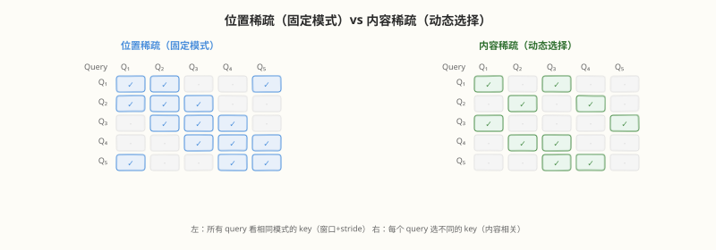
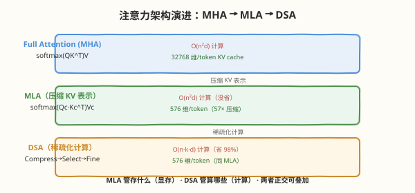
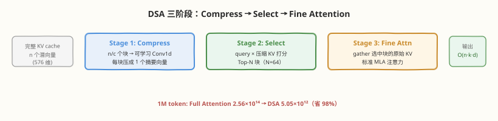
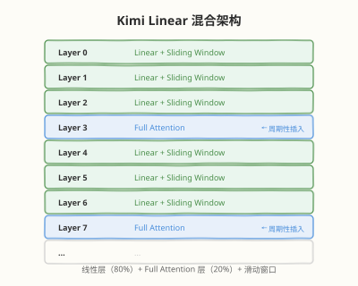
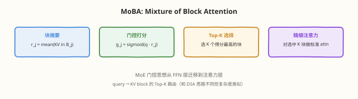

# Day 4（周四）：长上下文与高效注意力 —— 稀疏注意力时代

> **本周定位**：本专题是"读论文"视角的一周——不写 kernel，目标是跟上 2025–2026 年开源大模型最前沿（DeepSeek V3 → R1 → V3.2 与 Kimi K1.5 → K2 → K3 两条技术线）。Day 4 是 2026 年最热的架构方向——**让百万 token 上下文变得便宜**。Day 1 的 MLA 把 KV cache 从 4.0 MB/token 压到 70 KB/token（57× 压缩），但**计算复杂度仍然是 $O(n^2)$**——1M token 上下文的注意力计算约 1 EFLOP/层，这不是省显存能解决的。今天对照读三篇论文：《DeepSeek-V3.2-Exp》的 **DSA**（在 MLA 基础上砍计算复杂度）、《Kimi Linear》的混合线性注意力（$O(n)$ 复杂度）、《MoBA》的 block 级 MoE 式注意力选择，理解从 $O(n^2)$ 到 $O(n \log n)$ 再到 $O(n)$ 的三条路线。
>
> **前置要求**：已完成 Day 1（掌握 MLA 的低秩压缩与矩阵吸收、KV cache 显存公式）和 Day 3（了解 FP8 对 KV cache 的影响）；理解注意力计算 $\text{softmax}(QK^T)V$ 的基本流程
>
> **今日目标**：① 能说清"MLA 解决了显存但没解决计算"这一关键区分；② 掌握 DSA 的三阶段（Compress → Select → Fine attention）及复杂度 $O(n \cdot k \cdot d)$；③ 理解线性注意力的核函数变换 $\phi(Q)(\phi(K)^T V)$ 为什么能做到 $O(nd^2)$、代价是什么；④ 掌握 MoBA 把 MoE 门控思想用到 block 级注意力选择的机制；⑤ 理解 Lightning Indexer 作为稀疏注意力高效落地的工程桥梁；⑥ 独立完成四方案对比表
>
> **时间投入**：5h（精读 DSA 1.5h + Kimi Linear 1h + MoBA 0.5h + 动手画对比表 0.5h + 整理笔记 1.5h）
>
> **检验标准**：能画出 Full Attention / MLA / DSA / 线性注意力 / MoBA 在"计算复杂度、KV cache 大小、长文本性能、短文本性能"四个维度上的对比表，且能解释为什么 DSA 和 MLA 可以叠加（解决不同层面的问题）

---

## 本日在本周知识图谱中的位置

| 本日产出 | 对应本周后续内容 |
|----------|-----------------|
| DSA 三阶段（Compress → Select → Fine attention） | Day 6 K3 的 KDA（理解新注意力的"参照系"从 MLA+DSA 出发） |
| 线性注意力的核函数变换与递归式计算 | Day 6 K3 的 KDA（K3 的 Delta Attention 与线性注意力有亲缘关系） |
| MLA vs DSA vs 线性 vs MoBA 对比表 | Day 7 整合（四条主线之一的"稀疏/线性注意力"全景图） |
| Lightning Indexer 的工程角色 | Day 5 Agentic RL（Agent 长上下文推理的成本基础） |
| 1M token 上下文的经济可行性分析 | Day 6 V4 默认 1M 上下文的商业逻辑 |

> 💡 **Day 4 的定位**：今天建立"读注意力架构章节的框架"——拿到任何一篇注意力创新论文，先找三个要素：**计算复杂度多少（$O(n^2)$ / $O(n \log n)$ / $O(n)$）、KV cache 存什么（完整向量 / 压缩潜向量 / 固定大小状态矩阵）、稀疏模式怎么定（content-based / position-based / learned）**。DSA、Kimi Linear、MoBA 的差异全落在这三点上。

---

### 学习任务 1：长上下文的经济学问题 —— MLA 省显存但不省计算（30 分钟）

#### 复习 Day 1：MLA 解决了什么

Day 1 算过 V3 的 MLA 显存账（61 层、$n_h{=}128$、$d_h{=}128$、BF16）：

| 方案 | 每 token 每层缓存 | 每 token 全模型 | 128K 上下文 × batch 1 |
|------|------------------|----------------|----------------------|
| MHA | 32768 元素 | ≈ 4.0 MB | ≈ 523 GB（不可行） |
| MLA | 576 元素 | ≈ 70 KB | ≈ 9.2 GB（轻松） |

MLA 把 KV cache 压缩 57×，让 128K 上下文的显存从"不可行"变成"轻松"。

#### 但 MLA 没解决的问题：计算复杂度

MLA 压缩的是**缓存什么**，不是**算多少**。注意力计算仍然是：

$$\text{Attention}(Q, K, V) = \text{softmax}\left(\frac{QK^T}{\sqrt{d}}\right) V$$

即使 $K, V$ 被压缩成 576 维潜向量，计算注意力分数时仍然要对**所有历史 token** 做 $Q \cdot K^T$——复杂度 $O(n^2 \cdot d_h)$，与序列长度的平方成正比。

#### 1M token 上下文的计算账单

以 V3 配置（$n_h{=}128$, $d_h{=}128$, $L{=}61$ 层）计算 1M token 上下文的注意力 FLOPs：

| 项 | 公式 | 值 |
|----|------|-----|
| 每头每层 | $2 \times n^2 \times d_h$ | $2 \times (10^6)^2 \times 128 = 2.56 \times 10^{14}$ |
| 全模型 | $\times n_h \times L$ | $2.56 \times 10^{14} \times 128 \times 61 \approx 2.0 \times 10^{18}$ |
| **总计** | | **≈ 2.0 EFLOPs**（每 token 生成都要算） |

对比：H800 BF16 算力 ~990 TFLOPS，生成 1 个 token 的注意力计算就要 $2.0 \times 10^{18} / 990 \times 10^{12} \approx 2000$ 秒——**一个 token 要等半小时**，完全不可行。

> 💡 **关键区分**：
> - **MLA 解决的是显存问题**——存什么、存多少（576 维 vs 32768 维）
> - **稀疏注意力解决的是计算问题**——算哪些、算多少（$O(n \cdot k)$ vs $O(n^2)$）
> - 两者**解决不同层面的问题，可以叠加**——这是今天最重要的 takeaway

#### 长上下文的两笔账

| 账 | 问题 | MLA 的答案 | 稀疏注意力的答案 | 能叠加吗 |
|----|------|-----------|-----------------|---------|
| **KV cache 显存** | 存得下吗？ | 576 维/token/层（57× 压缩） | 仍是 576 维（缓存不变，只是稀疏访问） | ✅ DSA 建在 MLA 上 |
| **注意力计算** | 算得动吗？ | $O(n^2 d)$（没省） | $O(n \cdot k \cdot d)$，$k \ll n$ | ✅ DSA = MLA + 稀疏化 |

> ⚠️ **这就是为什么 V4 敢默认 1M token 上下文**：MLA 压了显存（存得下），DSA 砍了计算（算得动），FP8 压了带宽（传得快）——三者叠加才让 1M 上下文从"理论可行"变成"商业可行"。Day 3 的 FP8 是今天的伏笔：FP8 KV cache 把长上下文的显存带宽再砍一半。

---

### 学习任务 2：稀疏注意力基础 —— 从 $O(n^2)$ 到 $O(n \cdot k)$（30 分钟）

#### 核心直觉：不是所有 token 都需要互相 attend

Full Attention 中每个 query 对所有 key 计算注意力分数——但实际上，绝大多数注意力权重集中在少数 key 上（softmax 的长尾分布）。如果能**只算重要的那些**，跳过不重要的，计算量就能大幅下降。

#### 稀疏注意力的三大路线

| 路线 | 代表方法 | 怎么定"重要" | 复杂度 | 代表作 |
|------|---------|------------|--------|--------|
| **基于位置** | 滑动窗口 / 稀疏模式 | 固定模式（如"只看最近 256 token + 每 128 取 1 个"） | $O(n \cdot w)$，$w$=窗口 | Longformer, BigBird |
| **基于内容** | top-k 选择 | 用 query 和 key 的相似度动态选 | $O(n \cdot k \cdot d)$，$k$=选中数 | **DSA**, Reformer |
| **基于学习** | 门控/路由 | 学一个 gate 决定 attend 哪些块 | $O(n \cdot K \cdot B \cdot d)$ | **MoBA** |

#### 位置稀疏 vs 内容稀疏

- **位置稀疏**：所有 query 看相同模式的 key（如最近 $w$ 个 + 等间隔采样）——简单但不灵活
- **内容稀疏**：每个 query 根据内容动态选择不同的 key——灵活但需要先算一遍"哪些重要"

> 💡 **核心挑战**：内容稀疏要选"重要"的 key，但选之前不知道哪些重要——这是鸡生蛋问题。解法是**粗粒度预筛**：先用便宜的方式（如块级压缩）估算哪些区域重要，再用细粒度注意力精确算。DSA 就是这个思路。

---

### 学习任务 3：DSA 精读 —— DeepSeek 稀疏注意力的三阶段（60 分钟，今日核心）

精读《DeepSeek-V3.2-Exp: Boosting Long-Context Efficiency with DeepSeek Sparse Attention》。DSA 是 2026 年稀疏注意力的标杆——首次做到"稀疏化后不损失性能"，是 V4 默认 1M 上下文的核心技术。

#### 架构定位：DSA = MLA + 稀疏化

DSA 不是独立的新注意力，而是**在 MLA 基础上加一层稀疏化**：

- MLA 压缩的是**缓存**（576 维潜向量，不变）
- DSA 稀疏化的是**计算**（只对选中的 $k$ 个 token 算注意力，$k \ll n$）
- **两者正交，叠加使用**

#### DSA 的三阶段流程

**三阶段详细步骤**：

1. **输入**：query $q_t$，完整 KV cache $\{c^{KV}_1, \dots, c^{KV}_n\}$（MLA 潜向量，576 维/token）
2. **Compress**：将 $n$ 个 KV 潜向量分成 $n/c$ 个块（块大小 $c$，如 $c{=}64$），对每块做 pooling 得到 1 个压缩表示 $c^{KV}_{\text{compressed}}[j] = \text{Pool}(c^{KV}_{j \cdot c:(j+1) \cdot c})$，产出 $n/c$ 个压缩 KV 向量
3. **Select**：计算 $q_t$ 与所有压缩 KV 的粗粒度注意力分数 $\text{score}_j = q_t \cdot c^{KV}_{\text{compressed}}[j]$，选 Top-N 个得分最高的块（$N \ll n/c$）
4. **Fine attention**：从完整 KV cache 中取出选中 $N$ 块的原始 KV，对这些 token 做标准 MLA 注意力 $\text{softmax}(q_t \cdot c^{KV}_{\text{selected}}{}^T) \cdot V_{\text{selected}}$

#### 为什么三阶段能省计算

| 阶段 | 计算量 | 说明 |
|------|--------|------|
| Compress | $O(n \cdot d)$（pooling） | 每块做一次平均/卷积，总 $n/c$ 块 × $c$ 个/块 × $d$ 维 ≈ $O(nd)$ |
| Select | $O(n \cdot \frac{n}{c} \cdot d) = O(\frac{n^2}{c} d)$ | query × 压缩 KV，比 Full Attention 少 $c$ 倍 |
| Fine attention | $O(n \cdot N \cdot c \cdot d)$ | query × 选中 token，$N \cdot c \ll n$ |

以 1M token、$c{=}64$、$N{=}64$（选 64 块 × 64 token/块 = 4096 token）为例：

| 阶段 | FLOPs（每头每层） | 占比 |
|------|------------------|------|
| Full Attention（对照） | $2 \times 10^6 \times 10^6 \times 128 = 2.56 \times 10^{14}$ | 100% |
| Compress | $2 \times 10^6 \times 128 = 2.56 \times 10^8$ | <0.001% |
| Select | $2 \times 10^6 \times 15625 \times 128 = 4.0 \times 10^{12}$ | ~1.6% |
| Fine attention | $2 \times 10^6 \times 4096 \times 128 = 1.05 \times 10^{12}$ | ~0.4% |
| **DSA 总计** | $\approx 5.05 \times 10^{12}$ | **~2.0%**（省 98%） |

DSA 把 1M token 的注意力计算从 $2.56 \times 10^{14}$ 砍到 $5.05 \times 10^{12}$——**省了约 50 倍**，且论文报告性能无损。

#### Compress 的具体实现

压缩不是简单平均——V3.2 用的是**可学习的卷积 pooling**：

$$\bar{c}_j^{KV} = \text{Conv1d}\left(\text{concat}(c_{j \cdot c}^{KV}, \dots, c_{(j+1)\cdot c - 1}^{KV})\right)$$

- 输入：$c$ 个 576 维潜向量（一块的完整 KV）
- 输出：1 个 576 维压缩表示
- Conv1d 的 kernel 是**可训练的**——模型学会怎么把 64 个 token 压成 1 个"摘要"

> 💡 **类比**：Compress 像给每段文本写"摘要"，Select 像根据摘要选"最相关的段落"，Fine attention 僐精读选中的段落。你不会逐字读 100 万字的书，而是先看目录（Compress）、找到相关章节（Select）、再精读那几章（Fine attention）——DSA 就是这个思路的算法化。

#### Select 的 Top-N 机制

- 对每个 query $q_t$，计算它与所有 $n/c$ 个压缩 KV 的点积
- 选得分最高的 $N$ 个块（Top-N）
- $N$ 是超参数——$N$ 大则更精确但更慢，$N$ 小则更快但可能漏掉重要信息

V3.2 的论文消融显示：$N{=}64$（即每 query 只 attend 4096 个 token）时，性能与 Full Attention 几乎一致——这说明**注意力权重确实高度集中**，绝大多数 token 的注意力权重趋近于 0。

#### Lightning Indexer：稀疏注意力的工程桥梁

DSA 的算法很优雅，但落地有一个工程挑战：**Select 阶段选出的 $N$ 个块在 KV cache 中是不连续的**——需要从散落的位置 gather KV 向量。

| 挑战 | 描述 | Lightning Indexer 的解法 |
|------|------|--------------------------|
| 不连续 gather | 选中的 $N$ 块散布在 $n$ 个位置，需要 gather 它们的 KV | 优化的 index gather kernel，预计算索引 |
| 动态索引 | 每个 query 的选中块不同，索引是动态的 | 在线计算索引 + 异步 gather |
| 与 MLA 兼容 | MLA 的矩阵吸收改变了注意力计算路径 | 在潜向量空间做 gather，不破坏吸收 |

Lightning Indexer 是 DeepSeek 的专用 kernel，把"选出哪些块"到"拿到这些块的 KV"之间的延迟压到最低——没有它，DSA 的理论加速会被 gather 开销吃掉。

> ⚠️ **Lightning Indexer 的定位**：它不是算法创新，而是**工程桥梁**——让"算法说 attend 这 4096 个 token"变成"GPU 高效地拿到这 4096 个 token 并算完注意力"。这和 Day 3 的 DeepEP（EP 通信 kernel）是同类——都是"算法想清楚了，工程要跟得上"。

#### DSA 的关键结论

| 维度 | Full Attention | MLA | DSA（MLA + 稀疏） |
|------|---------------|-----|-------------------|
| KV cache（每 token 每层） | 32768 维 | 576 维 | 576 维（不变） |
| 计算复杂度 | $O(n^2 d)$ | $O(n^2 d)$ | **$O(n \cdot k \cdot d)$**，$k \ll n$ |
| 1M token 相对计算量 | 100% | 100% | **~2%**（省 98%） |
| 长文本性能 | 基线 | 同 Full | **无损**（论文消融验证） |

> 💡 **一句话总结**：DSA = MLA（压缩 KV 缓存，576 维不变）+ Compress（块级摘要）+ Select（Top-N 选块）+ Fine attention（只算选中的）。把 $O(n^2)$ 的计算砍到 $O(n \cdot k)$，且性能无损——这就是"稀疏注意力做到不损失性能"的精确含义。

---

### 学习任务 4：线性注意力与 Kimi Linear —— 从 $O(n^2)$ 到 $O(n)$（60 分钟，今日核心）

精读《Kimi Linear》。如果说 DSA 是"在 Full Attention 基础上做减法"（去掉不重要的），线性注意力则是**换一条数学路线**——把 softmax 替换成核函数，从根本上改变计算顺序，复杂度降到 $O(n)$。

#### Full Attention 的计算瓶颈在哪

标准注意力：$\text{Attention}(Q, K, V) = \text{softmax}(QK^T) V$

展开：先算 $QK^T$（$n \times n$ 矩阵），再 softmax，再乘 $V$——瓶颈在 $QK^T$ 这个 $n \times n$ 的矩阵。**不管怎么优化，只要先算 $QK^T$，复杂度就是 $O(n^2)$**。

#### 线性注意力的数学：换计算顺序

核心观察：如果不做 softmax（或用可分解的核函数替代），可以**换计算顺序**：

$$\text{Full: } \text{softmax}(QK^T) V \quad \rightarrow \quad \text{先算 } QK^T \text{（}O(n^2 d)\text{），再乘 } V \text{（}O(n^2 d)\text{）}$$

$$\text{Linear: } \phi(Q) \left(\phi(K)^T V\right) \quad \rightarrow \quad \text{先算 } \phi(K)^T V \text{（}O(d^2 \cdot n)\text{ → 可递归），再乘 } \phi(Q) \text{（}O(n \cdot d^2)\text{）}$$

- $\phi(\cdot)$：核函数（feature map），把 $d$ 维向量映射到 $d'$ 维
- $\phi(K)^T V$ 是一个 $d' \times d$ 的矩阵 $S$——**大小与 $n$ 无关！**
- 计算 $S$ 可以**递归累加**：$S_t = S_{t-1} + \phi(k_t) v_t^T$——每步 $O(d^2)$

#### Decode 阶段的巨大优势

Full Attention decode 每步：$q_t \cdot K_{1:t}^T$ → $O(t \cdot d)$（要和所有历史 token 算）

线性注意力 decode 每步：
1. 更新状态：$S_t = S_{t-1} + \phi(k_t) v_t^T$ → $O(d^2)$
2. 计算输出：$o_t = \phi(q_t) \cdot S_t$ → $O(d^2)$

**总每步 $O(d^2)$，与序列长度 $t$ 无关！** KV cache 从"$n$ 个向量"变成"1 个 $d \times d$ 矩阵 $S$"。

| 方案 | Decode 每步复杂度 | KV cache（decode 时） | 与序列长度关系 |
|------|------------------|----------------------|--------------|
| Full Attention | $O(n \cdot d)$ | $n$ 个 $d$ 维向量 | 线性增长 |
| MLA | $O(n \cdot d_c)$，$d_c{=}576$ | $n$ 个 576 维向量 | 线性增长（慢 57×） |
| **线性注意力** | **$O(d^2)$** | **1 个 $d \times d$ 矩阵** | **与 $n$ 无关！** |

#### 代价：softmax 被替换 → 表达力下降

线性注意力用 $\phi(Q)(\phi(K)^T V)$ 替代 $\text{softmax}(QK^T) V$，**省掉 softmax 是有代价的**：

| 特性 | Full Attention（softmax） | 线性注意力（核函数） |
|------|-------------------------|---------------------|
| **注意力分布** | sharp（能高度聚焦关键 token） | flat（近似均匀，难以聚焦） |
| **长程衰减** | 天然支持（远距离 token 权重低） | 取决于核函数选择，通常较弱 |
| **精确检索** | 强（能精确找到某个关键 token） | 弱（信息被压缩到 $d \times d$ 矩阵，检索精度低） |
| **短文本性能** | 好 | **较差**（$d^2 > n \cdot d$ 时反而更贵） |

> 💡 **核心 trade-off**：线性注意力把 KV cache 从"随 $n$ 线性增长的向量序列"变成"固定大小的 $d \times d$ 矩阵"——$n$ 越大优势越大。但这个矩阵是**有损压缩**：所有历史信息被塞进 $d^2$ 个数字，无法精确检索某个特定 token。类比：Full Attention 是"能翻到书的任意一页"，线性注意力是"把整本书总结成一页笔记"——长上下文时笔记够用，但要查某个具体引用就不够精确。

#### Kimi Linear 的混合架构

Kimi Linear 不走极端——它用**混合架构**同时拿到线性注意力的效率和 Full Attention 的精度：

| 组件 | 作用 | 占比 |
|------|------|------|
| **线性注意力层** | 处理长上下文的"宏观理解"（信息聚合、趋势捕捉） | 大部分层（如 80%） |
| **Full Attention 层** | 处理需要精确检索的任务（如找某个具体事实） | 少数层（如 20%），周期性插入 |
| **滑动窗口注意力** | 处理局部上下文（最近 $w$ 个 token 的精确信息） | 每层都有一段窗口 |

> 💡 **为什么混合有效**：① 线性注意力层负责"压缩历史信息到固定状态"，让模型不需要 $O(n)$ 的 KV cache；② Full Attention 层周期性"刷新"精确信息，弥补线性注意力的检索精度不足；③ 滑动窗口保证局部上下文（最近 token）的精确处理——三者的组合让 Kimi Linear 号称在**各种上下文长度**下超越 Full Attention。

#### Kimi Linear 的核心声明

论文声称：在各种上下文长度（4K 到 128K+）上，Kimi Linear 的性能**超越** Full Attention——这很反直觉（线性注意力通常在短上下文吃亏）。

可能的解释：
- 混合架构的 Full Attention 层弥补了短文本劣势
- 线性注意力的"信息聚合"可能起到正则化作用（类似 MLA 的低秩正则化）
- 周期性 Full Attention 的精确检索 + 线性层的宏观理解互补

> ⚠️ **读论文提醒**：Kimi Linear 的"超越 Full Attention"声明需要仔细看消融实验——是同参数量同训练数据下的对比，还是不同配置？混合架构的比例（线性层 vs Full 层）对性能的影响多大？这些细节在精读时要关注。本周 Day 6 学 K3 时会看到 Moonshot 放弃了 Kimi Linear 转用 KDA——这可能暗示线性注意力的混合方案在某些维度有局限。

---

### 学习任务 5：MoBA —— 把 MoE 思想用到注意力选择（30 分钟）

精读《MoBA: Mixture of Block Attention》（Moonshot AI）。MoBA 是第三条路线——用 Day 1 学的 MoE 门控思想，让每个 query **动态路由到最相关的 block**。

#### 核心思想：注意力也有"专家"

Day 1 学过 MoE：每个 token 激活 Top-K 个 FFN 专家。MoBA 把同样的思想用到注意力：

| | MoE（FFN 层） | MoBA（注意力层） |
|--|-------------|-----------------|
| "专家"是什么 | FFN 子网络 | KV block（一段连续 token 的 KV） |
| 路由对象 | token → 专家 | query → KV block |
| 门控 | Sigmoid/Softmax 选 Top-K | 门控选 Top-K 个 block |
| 激活 | K 个 FFN 算输出 | K 个 block 算注意力 |

#### MoBA 的流程

#### MoBA vs DSA 对比

| 维度 | DSA | MoBA |
|------|-----|------|
| 压缩方式 | 可学习 Conv1d pooling | 平均/均值摘要 |
| 选择粒度 | 块级 Top-N | 块级 Top-K |
| 门控函数 | 点积分数排序 | Sigmoid 门控（像 MoE） |
| 与 MLA 关系 | 建在 MLA 上 | 独立（可配 MLA 也可不配） |
| 灵感来源 | 粗到细的信息检索 | MoE 路由 |
| 复杂度 | $O(n \cdot N \cdot c \cdot d)$ | $O(n \cdot K \cdot B \cdot d)$ |

> 💡 **MoBA 的定位**：它和 DSA 解决同一个问题（动态选择重要 KV 块），但思路不同——DSA 是"信息检索"视角（压缩→筛选→精读），MoBA 是"MoE 路由"视角（门控→选专家→算）。两者的复杂度类似，差异在压缩方式和门控设计。实践中 DSA 和 MLA 深度耦合（V3.2/V4），MoBA 更通用（可适配任意注意力变体）。

> ⚠️ **连接 Day 1**：MoBA 是 Day 1 学的 DeepSeekMoE 思想（细粒度专家 + Top-K 路由）从 FFN 层**迁移到注意力层**的应用。同一套门控思想，用在 FFN 上是 MoE（省 FFN 计算），用在注意力上是 MoBA（省注意力计算）——这就是"架构思想跨层复用"的典型案例。

---

### 学习任务 6：动手画四方案对比表（30 分钟）

这是 README 布置的动手任务。**合上论文，自己画一张表**，在"计算复杂度、KV cache 大小、长文本性能、短文本性能"四个维度上对比五种方案（可以最后对照）。

#### 自己先画（建议 10 分钟）

在纸上画一个 5 行 × 4 列的表，填入你能记住的内容。填完后再看下面的参考答案。

#### 参考答案

| 方案 | 计算复杂度 | KV cache 大小 | 长文本性能 | 短文本性能 |
|------|----------|-------------|----------|----------|
| **Full Attention** | $O(n^2 d)$ | $O(n)$ 每 token 存 $d$ 维 | 最好（全信息） | 最好 |
| **MLA** | $O(n^2 d)$（没省计算） | $O(n)$ 每 token 存 576 维（57× 压缩） | 最好（全信息） | 最好 |
| **DSA**（MLA + 稀疏） | **$O(n \cdot k \cdot d)$**，$k \ll n$ | 576 维/token（同 MLA，稀疏访问） | **接近 Full**（论文验证无损） | 最好（短文本 $n < k$ 时退化为 Full） |
| **线性注意力** | **$O(n \cdot d^2)$** | **$O(d^2)$** 固定状态矩阵（与 $n$ 无关） | 好（但检索精度下降） | **较差**（$d^2 > nd$ 时更贵） |
| **MoBA** | $O(n \cdot K \cdot B \cdot d)$ | $O(n)$ 存完整 KV（稀疏访问） | 接近 Full | 最好（短文本退化为 Full） |

#### 关键对比分析

**计算复杂度**：
- Full / MLA：$O(n^2)$——长上下文爆炸
- DSA / MoBA：$O(n \cdot k)$——$k$ 是选中 token 数，可控
- 线性：$O(n \cdot d^2)$——与 $n$ 线性，但 $d^2$ 可能比 $n \cdot k$ 大（短文本时）

**KV cache**：
- Full：$O(n)$ 个向量，每向量 $d$ 维——最大
- MLA / DSA / MoBA：$O(n)$ 个向量，每向量 576 维——MLA 压缩后
- 线性：$O(1)$ 个 $d \times d$ 矩阵——**唯一与 $n$ 无关**

**长文本性能**：
- Full / MLA：最好（全信息，但太贵）
- DSA：**无损**（论文消融验证）——这是 DSA 的核心突破
- MoBA：接近 Full（Top-K 选择丢的信息少）
- 线性：好但有损（$d \times d$ 矩阵是信息瓶颈）

**短文本性能**：
- Full / MLA / DSA / MoBA：都好（$n$ 小时稀疏退化为 Full）
- 线性：**较差**——$n < d$ 时 $O(nd^2) > O(n^2 d)$，且核函数的近似误差在小 $n$ 时更显著

#### 能否叠加

| 组合 | 能叠加吗 | 效果 |
|------|---------|------|
| MLA + DSA | ✅ | V3.2/V4 的实际方案：MLA 压缓存 + DSA 稀疏计算 |
| MLA + 线性 | ⚠️ 理论可以 | 线性注意力替换 softmax，MLA 的潜向量做 $\phi$ 的输入——但工程复杂 |
| DSA + MoBA | ❌ 冗余 | 两者都做"选重要块"，叠加无额外收益 |
| MLA + DSA + FP8 | ✅ | V4 的完整方案：MLA 压缓存 + DSA 稀疏计算 + FP8 压带宽 |

> 💡 **回答 README 自测题：MLA 和 DSA 分别解决什么问题？能叠加吗？** MLA 解决**显存问题**——把 KV cache 从 32768 维/token 压到 576 维（57× 压缩），但计算复杂度仍是 $O(n^2)$。DSA 解决**计算问题**——用 Compress→Select→Fine attention 三阶段只算 $k$ 个选中 token，复杂度降到 $O(n \cdot k)$。两者解决不同层面的问题（MLA 管"存什么"，DSA 管"算哪些"），**可以且应该叠加**——V3.2 就是 MLA + DSA 的组合，V4 再加 FP8 压带宽。这就是"V4 敢默认 1M token 上下文"的三重技术基础。

---

### 面试题积累（今日 3 道）

**Q10：MLA 已经把 KV cache 压缩了 57 倍，为什么还需要稀疏注意力？两者解决的是同一个问题吗？**
> 不是同一个问题。MLA 解决的是**显存问题**——把每 token 每层的 KV cache 从 32768 维压到 576 维（低秩压缩 + 解耦 RoPE + 矩阵吸收），让长上下文"存得下"。但 MLA 没有改变注意力计算的复杂度——计算注意力分数时仍要对所有 $n$ 个历史 token 做 $Q \cdot K^T$，复杂度 $O(n^2 d)$。1M token 上下文时每层注意力约 $2.56 \times 10^{14}$ FLOPs/头，全模型约 2 EFLOPs——生成一个 token 要等半小时。稀疏注意力（DSA）解决的是**计算问题**——用 Compress→Select→Fine attention 三阶段只对 $k \ll n$ 个选中 token 算注意力，复杂度降到 $O(n \cdot k \cdot d)$，省约 98%。两者正交：MLA 管"存什么"（576 维潜向量），DSA 管"算哪些"（Top-N 块），可以叠加——V3.2 就是 MLA + DSA 的组合。

**Q11：线性注意力为什么能做到 $O(n)$ 复杂度？代价是什么？Kimi Linear 怎么弥补的？**
> 标准 attention 是 $\text{softmax}(QK^T) V$——先算 $QK^T$（$n \times n$ 矩阵），复杂度 $O(n^2 d)$，瓶颈在 $QK^T$。线性注意力用核函数 $\phi(\cdot)$ 替代 softmax，变成 $\phi(Q)(\phi(K)^T V)$——先算 $\phi(K)^T V$（一个 $d' \times d$ 的矩阵 $S$，与 $n$ 无关），再乘 $\phi(Q)$。$S$ 可以递归累加 $S_t = S_{t-1} + \phi(k_t)v_t^T$，每步 $O(d^2)$——decode 时每步复杂度与序列长度 $n$ 无关，KV cache 从"$n$ 个向量"变成"1 个 $d \times d$ 矩阵"。代价是 softmax 被替换导致表达力下降：① 注意力分布变 flat（难以高度聚焦关键 token）；② 精确检索能力弱（所有信息塞进 $d^2$ 个数字的有损压缩）；③ 短文本性能差（$n < d$ 时 $O(nd^2) > O(n^2 d)$）。Kimi Linear 用混合架构弥补：大部分层用线性注意力（省长上下文成本），周期性插入 Full Attention 层（补精确检索），每层都有滑动窗口（保局部精度）——三者组合号称在各种上下文长度超越 Full Attention。

**Q12：DSA 的三阶段（Compress → Select → Fine attention）各自做什么？为什么能"稀疏化但不掉性能"？**
> ① **Compress**：把 $n$ 个 KV 潜向量分成 $n/c$ 个块（块大小 $c{=}64$），用可学习 Conv1d 把每块 $c$ 个向量压缩成 1 个摘要向量——得到 $n/c$ 个压缩表示。② **Select**：对每个 query，计算它与所有压缩表示的点积，选 Top-N 个得分最高的块（$N{=}64$，即选 4096 个 token）。③ **Fine attention**：从完整 KV cache 中 gather 选中 $N$ 块的原始潜向量，只对这些 token 做标准 MLA 注意力。能"不掉性能"的原因：注意力权重的分布是高度集中的（长尾分布）——绝大多数 token 的注意力权重趋近于 0，只有少数关键 token 有显著权重。DSA 的 Compress+Select 精准定位了这些关键 token 所在的块，Fine attention 只算它们——相当于"去掉了本来就不重要的 98% 计算"，所以无损。论文消融验证 $N{=}64$ 时性能与 Full Attention 一致，证实了注意力的稀疏性假设。配合 Lightning Indexer（高效 gather kernel）保证工程落地不掉速。

---

### 今日检查清单

- [ ] 能说清"MLA 解决显存、稀疏注意力解决计算"这一关键区分
- [ ] 能算出 1M token 上下文 Full Attention 的计算量约 2 EFLOPs/层
- [ ] 能列出稀疏注意力的三大路线（位置稀疏 / 内容稀疏 / 基于学习）
- [ ] 能写出 DSA 的三阶段：Compress（可学习 Conv1d pooling）→ Select（Top-N 块）→ Fine attention（选中块做 MLA）
- [ ] 能算 DSA 在 1M token 时的计算量约 Full Attention 的 2%（省 98%）
- [ ] 能解释 DSA 为什么"不掉性能"（注意力权重高度集中，去掉的是本来就不重要的计算）
- [ ] 能解释 Lightning Indexer 的工程角色（高效 gather 不连续的选中块 KV）
- [ ] 能写出线性注意力的核函数变换 $\phi(Q)(\phi(K)^T V)$，解释为什么先算 $\phi(K)^T V$ 能省到 $O(d^2)$
- [ ] 能解释线性注意力的 KV cache 是 $d \times d$ 矩阵 $S$（与 $n$ 无关），及递归更新 $S_t = S_{t-1} + \phi(k_t)v_t^T$
- [ ] 能列出线性注意力的三个代价（分布 flat / 检索弱 / 短文本差）
- [ ] 能画出 Kimi Linear 的混合架构（线性层 + 周期性 Full Attention 层 + 滑动窗口）
- [ ] 能解释 MoBA 把 MoE 门控思想从 FFN 层迁移到注意力层（query → KV block 的 Top-K 路由）
- [ ] 能独立画出五方案对比表（Full / MLA / DSA / 线性 / MoBA 在复杂度、KV cache、长/短文本性能上的取舍）
- [ ] 能解释为什么 MLA + DSA 可以叠加（解决不同层面问题），而 DSA + MoBA 是冗余的
- [ ] 能回答"V4 敢默认 1M 上下文"的三重技术基础：MLA 压缓存 + DSA 稀疏计算 + FP8 压带宽

#### 明日预告

Day 5 转向 2026 年竞争的主战场——**Agentic 智能**。今天学的稀疏注意力让长上下文变得便宜，明天要看的是"模型怎么用长上下文做多步推理和工具调用"。重点读 K2 的后训练章节（大规模 agentic 数据合成管线 + 真实/合成环境联合 RL，这是 K2 在 SWE-Bench 拿 65.8 的关键）和 V3.2 的可扩展 RL 框架（高算力版 V3.2-Speciale 拿下 IMO 和 IOI 金牌）。Day 2 学的 GRPO 和 RLVR 是基础——明天会看到它们如何从"数学推理"扩展到"环境交互"场景。建议今晚回顾 Day 2 的 RLVR 局限（只适用于答案可验证的任务），明天 agentic RL 正是把这个边界推到"工具调用结果可验证"的新范式。
