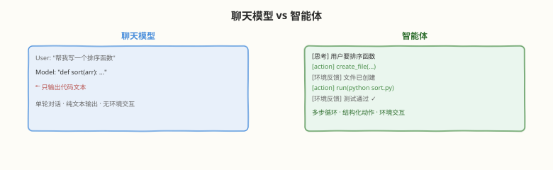
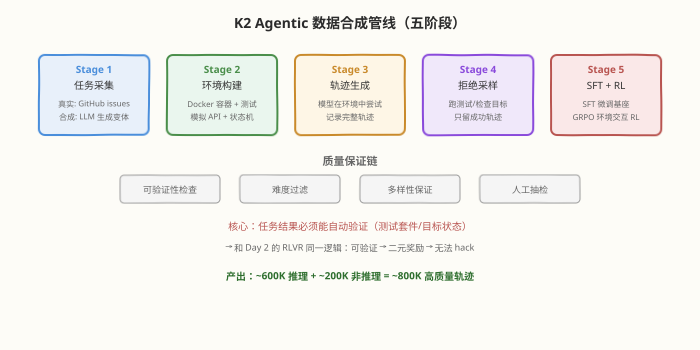
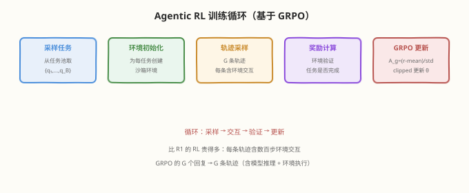

# Day 5（周五）：Agentic 智能 —— 从聊天模型到智能体

> **本周定位**：本专题是"读论文"视角的一周——不写 kernel，目标是跟上 2025–2026 年开源大模型最前沿（DeepSeek V3 → R1 → V3.2 与 Kimi K1.5 → K2 → K3 两条技术线）。Day 5 是 2026 年竞争的主战场——**Agent 能力是怎么"训"出来的**。前四天搭好了三块基础：Day 1 的 MoE 架构（K2 的 1T/32B 身体）、Day 2 的 GRPO + RLVR（Agent RL 的算法基础）、Day 4 的 DSA（Agent 的长上下文可以便宜了）。今天把这三块拼成 Agent：精读《Kimi K2》（[arXiv:2507.20534](https://arxiv.org/abs/2507.20534)）后训练章节的大规模 agentic 数据合成管线 + 真实/合成环境联合 RL、《DeepSeek-V3.2》（[arXiv:2512.02556](https://arxiv.org/abs/2512.02556)）的可扩展 RL 框架（高算力版 V3.2-Speciale 拿下 IMO 和 IOI 金牌），泛读《GLM-5》（[arXiv:2602.15763](https://arxiv.org/abs/2602.15763)）了解同代竞品思路。
>
> **前置要求**：已完成 Day 2（掌握 GRPO + RLVR 的算法与局限）和 Day 4（理解 DSA 让长上下文变便宜）；了解 tool calling / function calling 的基本概念（API 调用、代码执行）
>
> **今日目标**：① 理解从"聊天模型"到"智能体"的范式转变，能说清 Agent 和 chat model 的三个本质区别；② 掌握 K2 的大规模 agentic 数据合成管线（任务采集 → 环境构建 → 轨迹生成 → 拒绝采样筛选 → SFT+RL）；③ 理解环境交互 RL 如何把 Day 2 的 RLVR 从"答案可验证"扩展到"工具调用结果可验证"；④ 掌握 V3.2 可扩展 RL 框架的核心洞察——为什么 scaling post-training RL 比只卷预训练更有效；⑤ 能对比 K2 / V3.2 / GLM-5 三条 agentic 训练路线的异同
>
> **时间投入**：5h（精读 K2 后训练章节 1.5h + V3.2 可扩展 RL 1h + GLM-5 泛读 0.5h + 动手任务 0.5h + 整理笔记 1.5h）
>
> **检验标准**：能回答 README 自测题"为什么 V3.2 要用可扩展 RL 框架继续 scaling post-training 而不是只卷预训练"，且能给出具体数字（K2 SWE-Bench Verified 65.8、Tau2-Bench 66.1；V3.2-Speciale IMO/IOI 金牌）

---

## 本日在本周知识图谱中的位置

| 本日产出 | 对应本周后续内容 |
|----------|-----------------|
| Agentic 数据合成管线（任务→环境→轨迹→筛选） | Day 6 K3（更大模型的 agentic 能力需要更大数据管线） |
| 环境交互 RL（RLVR → 工具调用结果可验证） | Day 6 V4（1M 上下文 + agentic RL 的商业落地） |
| V3.2 可扩展 RL 框架（scaling post-training） | Day 7 整合（"为什么不只卷预训练"的核心论点） |
| K2 / V3.2 / GLM-5 三路线对比 | Day 7 大图（技术演进树的"Agent 分支"） |
| Agent 失败模式分析（动手任务） | Day 7 博客/分享（实战案例素材） |

> 💡 **Day 5 的定位**：今天建立"读后训练/agentic 章节的框架"——拿到任何一篇 agentic 训练报告，先找四个要素：**数据从哪来（真实采集/合成/混合）、环境怎么搭（沙箱/模拟器/真实 API）、RL 奖励怎么定（工具结果可验证/人工评判/模型评判）、scaling 在哪做（数据规模/RL 算力/模型规模）**。K2、V3.2、GLM-5 的差异全落在这四点上。

---

### 学习任务 1：从聊天模型到智能体 —— Agent 范式转变（30 分钟）

#### 聊天模型 vs 智能体：三个本质区别

| 维度 | 聊天模型（Chat Model） | 智能体（Agent） |
|------|----------------------|----------------|
| **交互模式** | 单轮或多轮对话，模型只输出文本 | 多步循环：观察 → 思考 → 行动 → 观察 → ... |
| **输出空间** | 纯文本（自然语言） | 文本 + **结构化动作**（API 调用、代码执行、文件操作） |
| **环境交互** | 无（模型不知道外部世界） | 有（模型调用工具后获得真实环境反馈） |

#### 为什么 Agent 需要 RL，不能只靠 SFT

SFT（监督微调）能教会模型"怎么调用工具"，但有两个硬伤：

| SFT 的问题 | 描述 | RL 的解法 |
|-----------|------|----------|
| **无法教多步规划** | SFT 数据是"正确轨迹"，但真实 Agent 要在错误中纠偏 | RL 让模型自己尝试，从成功/失败中学习规划策略 |
| **无法教"什么时候不该用工具"** | SFT 数据总有工具调用，模型学会"逢事必调工具" | RL 奖励惩罚冗余调用，模型学会判断"需不需要工具" |
| **SFT 数据是静态的** | 环境会变（API 更新、代码库变化），SFT 数据过时 | RL 在线与环境交互，天然适应环境变化 |

> 💡 **连接 Day 2**：R1 的 RLVR 证明了"纯 RL 能涌现推理能力"。Agent 的环境交互 RL 把这个思路再推一步——**不只奖励"答案对不对"，还奖励"整个行动序列是否达成目标"**。数学题的"可验证"是答案和 ground truth 比对；Agent 任务的"可验证"是工具调用后环境状态是否达到目标状态——两者本质相同，只是验证方式不同。

#### Agent 的核心能力栈

| 能力层 | 描述 | 训练方式 | Day 2/4 连接 |
|--------|------|---------|-------------|
| **工具调用** | 正确生成 API 调用参数、解析返回值 | SFT + RL | 基础层 |
| **多步规划** | 把复杂任务拆成子步骤，按序执行 | 环境交互 RL | R1 的分步推理迁移到行动空间 |
| **错误恢复** | 工具调用失败后调整策略、重试 | 环境交互 RL（从失败中学习） | R1 的反思 + 自我验证迁移到行动空间 |
| **长上下文管理** | 在数千步交互中保持任务上下文 | Day 4 的 DSA + 长上下文训练 | DSA 让长轨迹的 KV cache 可负担 |

> ⚠️ **关键观察**：R1 的推理能力（分步、反思、验证）和 Agent 的行动能力（规划、纠错、恢复）是**同一套认知能力在不同空间的应用**——R1 在"思维空间"里分步推理，Agent 在"行动空间"里分步执行。这就是为什么 R1 的 RL 方法可以迁移到 Agent 训练。

---

### 学习任务 2：K2 的 Agentic 数据合成管线精读 —— 数据工厂（50 分钟，今日核心）

精读 K2 论文后训练章节。K2 在 SWE-Bench Verified 拿到 65.8、Tau2-Bench 66.1 的关键，是一条大规模 agentic 数据合成管线。

#### 为什么需要"合成"数据

Agent 训练需要"完整的成功轨迹"——从任务输入到最终完成的每一步行动记录。但真实数据有三个问题：

| 问题 | 描述 |
|------|------|
| **数量不足** | 真实 agentic 交互数据（如程序员解决 GitHub issue 的完整过程）很少 |
| **质量不均** | 真实轨迹可能包含低效步骤、错误尝试——直接学反而有害 |
| **环境依赖** | 每条轨迹依赖特定环境（代码库版本、API 状态），难以泛化 |

K2 的解法：**用模型自己生成轨迹 + 用环境验证质量**——和 R1 Stage 3 的拒绝采样思路一脉相承，但扩展到 agentic 场景。

#### 五阶段数据合成管线

#### 环境构建的工程挑战

环境是 agentic 训练的"基础设施"——没有可靠的可执行环境，"可验证奖励"就是空话：

| 环境类型 | 挑战 | K2 的解法 |
|---------|------|----------|
| **代码执行环境** | 每个任务需要不同的依赖（Python 版本、库版本） | Docker 镜像模板 + 按任务动态构建 |
| **API 模拟环境** | 真实 API 有速率限制、成本、不可复现 | 合成 API 模拟器 + 状态机 |
| **文件系统环境** | 文件操作需要隔离（不能影响宿主） | 沙箱容器 + 快照/回滚 |
| **并行化** | 数十万任务要并行跑环境 | 分布式环境编排（类似 K8s + Ray） |

> 💡 **连接 Day 3**：Day 3 讲训练基础设施（DualPipe、FP8、EP），那是"模型训练"的 infra。今天讲的是"环境编排"的 infra——Agent 训练的 infra 比普通训练复杂得多：不仅要训模型，还要同时跑数万个沙箱环境、收集轨迹、验证结果。这就是为什么 Agent 训练被称为"系统工程的巅峰"。

#### 合成任务的质量保证

用 LLM 生成的合成任务可能"看似合理但实际不可解"——K2 的质量保证链：

1. **可验证性检查**：每个合成任务必须能被自动化验证（有测试套件或明确目标状态）
2. **难度过滤**：剔除太简单（模型一次就对）或太难（模型完全做不到）的任务
3. **多样性保证**：按任务类型/难度/工具组合分层采样，防分布偏斜
4. **人工抽检**：抽样人工审查合成任务的合理性

> ⚠️ **为什么"可验证"是 agentic 数据管线的命脉**：和 Day 2 的 RLVR 一样，如果任务结果不能自动验证，就只能靠人工或模型评判——前者不可扩展，后者有 reward hacking 风险。K2 选择"代码任务为主"正是因为代码任务有测试套件做天然验证器——这和 R1 选择"数学/代码任务为主"是同一个逻辑。

---

### 学习任务 3：环境交互 RL —— 从 RLVR 到 Agentic RL（50 分钟，今日核心）

精读 K2 论文的 RL 章节 + V3.2 的可扩展 RL 框架。这是 Day 2 GRPO + RLVR 的 agentic 扩展。

#### RLVR → Agentic RL：扩展奖励的"可验证"边界

Day 2 学过 RLVR 的核心——用规则/程序替代奖励模型，奖励是"对就是对、错就是错"的二元信号。但 Day 2 也指出 RLVR 的局限：

> ⚠️ RLVR 只适用于"答案可验证"的任务（数学、代码、逻辑）。开放式对话、创意写作等任务没有客观标准答案。

Agentic RL 把这个边界推到**"工具调用结果可验证"**：

| 任务类型 | Day 2 的 RLVR | Day 5 的 Agentic RL |
|---------|--------------|-------------------|
| 数学 | 答案 == ground truth | — |
| 代码 | 跑测试用例 | — |
| **Bug 修复** | — | 提交的代码改动通过全部测试 |
| **功能开发** | — | 新功能通过验收测试 |
| **工具调用** | — | API 调用序列达到目标状态 |
| **多步任务** | — | 最终交付物满足任务要求 |

**核心扩展**：从"最终答案可验证"到"最终交付物可验证"——Agent 任务的 reward 仍然是二元的（任务完成/未完成），但验证方式从"比对答案"变成"检查环境状态"。

#### Agentic RL 的训练流程

#### 和 Day 2 GRPO 的关键差异

| 维度 | Day 2 GRPO（R1） | Day 5 Agentic GRPO（K2） |
|------|------------------|------------------------|
| "回复"是什么 | 一段文本（思维链 + 答案） | 一条轨迹（多步行动 + 环境反馈） |
| 采样 $G$ 个回复 | 生成 $G$ 段文本 | 生成 $G$ 条轨迹（每条可能数百步） |
| 奖励计算 | 答案比对 | 环境状态验证 |
| 计算量 | $G \times$ 文本生成 | **$G \times$ 轨迹生成**（含环境交互，贵得多） |
| KL 惩罚 | 对文本 token 序列 | 对行动序列的 token 序列（同 GRPO） |

> 💡 **为什么 Agentic RL 比 R1 的 RL 贵得多**：R1 的一个"回复"是模型生成几千 token 的文本——纯 GPU 计算。K2 的一个"轨迹"是模型和环境交互数百步——每步包括模型推理 + 环境执行（如运行代码、调 API）+ 状态更新。$G{=}64$ 条轨迹并行跑，意味着同时维护 64 个沙箱环境——这是 Day 3 训练 infra 的全新挑战。

#### K2 的真实/合成环境联合 RL

K2 不是只用一种环境——它**混合真实和合成环境**：

| 环境类型 | 特点 | 适用任务 | K2 的用法 |
|---------|------|---------|----------|
| **真实环境** | 真实 API、真实代码库 | 部署后的真实场景验证 | 少量，用于最终质量评估 |
| **合成环境** | 模拟 API、容器化代码库 | 大规模训练 | 大量，用于 RL 训练的主体 |

为什么联合？合成环境可控、可并行、可复现——适合大规模 RL。但合成环境和真实环境有 gap——纯合成训练的 Agent 可能在真实环境中表现下降。K2 的策略：**合成环境为主训练 + 真实环境微调验证**。

#### K2 的 Agent 性能基准

| Benchmark | K2 得分 | 说明 |
|-----------|---------|------|
| **SWE-Bench Verified** | 65.8 | 软件工程：给 GitHub issue，Agent 提交代码修复，自动测试验证 |
| **Tau2-Bench** | 66.1 | 多轮工具调用：模拟客服/零售场景，多步对话 + 工具调用 |
| LiveCodeBench | — | 代码生成 |
| MATH-500 | — | 数学推理（预训练能力） |

> 💡 **SWE-Bench 是什么**：给 Agent 一个真实的 GitHub issue（如"这个函数有 bug"），Agent 需要理解 issue → 定位代码 → 编写修复 → 提交代码改动 → 通过项目的测试套件。这个 benchmark 直接验证 Agent 的端到端工程能力——不是"会不会写代码"，而是"能不能解决真实工程问题"。

---

### 学习任务 4：V3.2 可扩展 RL 框架 —— 从推理到竞赛（45 分钟，今日核心）

精读《DeepSeek-V3.2: Pushing the Frontier of Open Large Language Models》（[arXiv:2512.02556](https://arxiv.org/abs/2512.02556)）。V3.2 的三大突破：① Day 4 学的 DSA、② 今天学的可扩展 RL 框架、③ 大规模 agentic 任务合成管线。

#### 核心洞察：RL 也可以被"scaling"

Day 3 学过预训练的 scaling law——模型越大、数据越多、算力越多，loss 越低。V3.2 的核心发现：**post-training 的 RL 也有 scaling law——RL 算力越多，推理能力越强**。

| Scaling 维度 | 预训练 scaling | V3.2 的 RL scaling |
|-------------|--------------|-------------------|
| 什么在 scale | 模型参数 + 训练 token | RL 训练算力（rollout 步数 × GRPO 采样数 × 训练步数） |
| 效果 | 知识更广 | 推理更深、Agent 更强 |
| 边际收益递减？ | 14.8T token 后开始递减 | **尚未见顶**（IMO 金牌说明还有空间） |

> 💡 **回答 README 自测题：为什么 V3.2 要用可扩展 RL 框架继续 scaling post-training，而不是只卷预训练？** 两个原因：① **预训练的边际收益递减**——V3 已经在 14.8T token 上预训练，继续加 token 的知识增量越来越小（大部分知识已经学过了）。但推理能力不是"知识"——它是"怎么用知识解决问题"，这需要 RL 来训，不是靠多看几本书能学会的。② **RL 的 scaling 尚未见顶**——V3.2-Speciale 用高算力 RL 拿下 IMO 和 IOI 金牌，说明 RL 算力继续投入仍有显著回报。类比：预训练是"读书"（获取知识），RL 是"做题"（练习推理）——读了 14.8T token 的"书"后，继续读书的收益不如开始"做题"。

#### V3.2-Speciale：竞赛级推理

V3.2 的"高算力版"——V3.2-Speciale——用更大的 RL 算力做竞赛级训练：

| 维度 | V3.2（标准版） | V3.2-Speciale（高算力版） |
|------|--------------|------------------------|
| RL 算力 | 标准 | **大幅增加**（具体倍数未公开） |
| 训练任务 | 通用推理 + Agent | 竞赛级数学（IMO 级别） |
| 成就 | SWE-Bench / Tau2-Bench 领先 | **IMO 金牌、IOI 金牌** |
| 定位 | 通用模型 | 推理特化版 |

#### IMO / IOI 金牌意味着什么

| 竞赛 | 难度 | V3.2-Speciale 成就 | 说明 |
|------|------|-------------------|------|
| **IMO**（国际数学奥林匹克） | 人类顶尖高中生数学竞赛 | **金牌** | AI 首次达到 IMO 金牌水平 |
| **IOI**（国际信息学奥林匹克） | 人类顶尖高中生算法竞赛 | **金牌** | AI 首次达到 IOI 金牌水平 |

> ⚠️ **为什么 IMO/IOI 金牌是里程碑**：IMO 和 IOI 不是"刷题"——它们要求**创造性推理**（不是记住解法，而是发明解法）。R1（Day 2）在 AIME 2024 拿 79.8% 是"会做高考级数学"，IMO 金牌是"会做研究级数学"——这之间的差距正是 RL scaling 带来的。V3.2 证明了：**RL 算力的投入可以跨越从"会做题"到"会创造"的门槛**。

#### 可扩展 RL 框架的技术组成

V3.2 的"可扩展 RL 框架"不只是"多花算力"——它是一套系统工程：

| 组件 | 作用 | 连接前几日 |
|------|------|-----------|
| **大规模 RL 训练系统** | 支持数千 GPU 上的 GRPO 训练 | Day 3 的 DualPipe + 3D 并行 |
| **长思维链 rollout** | 支持生成数万 token 的推理轨迹 | Day 4 的 DSA（让长 KV cache 可负担） |
| **竞赛级任务集** | IMO/IOI 级别的训练任务 + 可验证奖励 | Day 2 的 RLVR（数学答案可验证） |
| **Agentic 任务合成管线** | 大规模 Agent 训练数据 | K2 同类技术 |
| **FP8 推理加速** | rollout 时的推理成本降低 | Day 3 的 FP8 |

> 💡 **Day 4 连接**：RL 的 rollout 需要模型生成数千甚至数万 token 的推理轨迹（IMO 级别的问题需要非常长的思维链）。Day 4 的 DSA 让这种长上下文的 KV cache 计算变得可负担——没有 DSA，V3.2-Speciale 的长轨迹 rollout 在工程上不可行。这就是为什么 Day 4 的"明日预告"说"Day 5 会看到 Day 4 的技术基础作用"。

---

### 学习任务 5：GLM-5 对照 + 三路线全景对比（30 分钟）

泛读《GLM-5: from vibe coding to agentic engineering》（[arXiv:2602.15763](https://arxiv.org/abs/2602.15763)），了解同代竞品的 agentic 训练思路。

#### GLM-5 的核心论点："从 vibe coding 到 agentic engineering"

| 概念 | 含义 | 代表阶段 |
|------|------|---------|
| **Vibe coding** | 人类凭直觉/经验写代码，AI 辅助补全 | 2023-2025（Copilot 时代） |
| **Agentic engineering** | AI Agent 自主完成工程任务（设计、编码、测试、调试） | 2026+（K2/V3.2/GLM-5 时代） |

GLM-5 的论点：行业正从"AI 辅助人类编码"转向"AI 自主完成工程"——这正是 K2 和 V3.2 也在推进的方向。

#### 三路线对比

| 维度 | K2 | V3.2 | GLM-5 |
|------|-----|------|-------|
| **模型规模** | ~1T/32B | 671B/37B（V3 基座） | 未公开 |
| **预训练优化器** | MuonClip | AdamW（V3）+ 后续 | 未公开 |
| **Agent 数据管线** | 大规模合成 + 真实环境 | 大规模合成管线 | 强调"vibe→agentic"转变 |
| **RL 算法** | GRPO（继承 R1） | GRPO + 可扩展框架 | 未详述 |
| **核心 benchmark** | SWE-Bench 65.8, Tau2-Bench 66.1 | IMO/IOI 金牌 | 工程任务 |
| **RL scaling 策略** | 数据规模 + 环境多样性 | **RL 算力规模**（Speciale） | 工程实践导向 |
| **侧重点** | Agent 实用性（SWE/Tau2） | 推理极限（IMO/IOI） | 工程范式转变 |

> 💡 **三条路线的本质差异**：
> - **K2**：实用 Agent——在真实工程 benchmark（SWE-Bench/Tau2-Bench）上做到最好，侧重"能干活"
> - **V3.2**：极限推理——用竞赛级 benchmark（IMO/IOI）验证推理能力的天花板，侧重"能思考"
> - **GLM-5**：范式转变——从"vibe coding"到"agentic engineering"的理念推动，侧重"能转型"

> ⚠️ **三路线不是互斥的**：K2 的 agentic 数据管线 + V3.2 的可扩展 RL + GLM-5 的工程范式理念，在实际系统中会融合。Day 6 的 K3 很可能整合这三条路线的精华——更大的模型 + 更强的 agentic 能力 + 更高效的训练。

---

### 学习任务 6：动手任务 —— 体验 Agentic 工作流（30 分钟）

这是 README 布置的动手任务：实际体验一次 agentic 工作流，记录模型在哪一步出错、为什么。

#### 任务选择

选一个支持工具调用的模型（如 DeepSeek-V3、Kimi K2、Claude、GPT-4 等），让它完成一个多步任务：

| 推荐任务 | 难度 | 工具需求 | 验证方式 |
|---------|------|---------|---------|
| "查某个城市的天气并写一段穿搭建议" | 低 | 天气 API + 文本生成 | 人工检查合理性 |
| "写一个 Python 脚本统计 CSV 文件行数并运行" | 中 | 代码执行 + 文件操作 | 脚本是否正确运行 |
| "查论文 arXiv:2501.12948 的标题和作者，生成 BibTeX 格式引用" | 中 | 搜索 + 文本生成 | BibTeX 格式是否正确 |
| "写一个 React 组件实现待办列表，包含增删改查" | 高 | 代码生成 + 执行 | 组件是否可运行 |

#### 观察记录表

在 Agent 执行过程中，记录以下信息：

| 步骤 | Agent 的思考 | Agent 的行动 | 环境反馈 | 是否正确 | 出错原因（如出错） |
|------|-------------|-------------|---------|---------|------------------|
| 1 | | | | | |
| 2 | | | | | |
| 3 | | | | | |
| ... | | | | | |

#### 常见 Agent 失败模式

观察 Agent 是否出现以下失败模式（这些正是 RL 训练要解决的问题）：

| 失败模式 | 描述 | 对应训练能力 |
|---------|------|-------------|
| **参数格式错误** | API 调用参数类型/格式不对 | 工具调用（SFT 可解决） |
| **工具选择错误** | 该用 A 工具却用了 B | 多步规划（RL 训练） |
| **死循环** | 重复调用同一工具/重复同一行动 | 错误恢复（RL 从失败中学习） |
| **上下文丢失** | 多步后忘记初始任务目标 | 长上下文管理（DSA + 长上下文训练） |
| **过度调用** | 不需要工具时强行调用 | RL 惩罚冗余调用 |
| **无法纠错** | 工具返回错误后不知怎么调整 | 错误恢复（R1 的反思迁移到行动空间） |

> 💡 **你的任务**：完成一次 agentic 工作流体验，填写观察记录表。找出至少一个"失败模式"并分析：这个失败是因为模型"不会做"（能力不足）还是"不知道该做"（规划不足）？结合任务 3 的分析，思考 RL 训练如何解决这个失败——是奖励信号的问题，还是环境设计的问题？

---

### 面试题积累（今日 3 道）

**Q13：Agentic RL 和 Day 2 的 RLVR 有什么本质区别？为什么 Agent 训练需要环境交互而不只是答案验证？**
> 本质区别在"可验证"的边界不同。RLVR（Day 2）验证的是"最终答案"——数学答案和 ground truth 比对、代码跑测试用例，奖励是二元的（对/错），但只看最终输出。Agentic RL 验证的是"最终交付物 + 整个行动轨迹的效果"——Agent 修 bug 后提交的代码改动是否通过全部测试、多步工具调用后环境状态是否达到目标。奖励仍是二元的，但验证方式从"比对答案"变成"检查环境状态"。需要环境交互的原因：① Agent 的输出不是一段文本而是一条多步行动轨迹，每步的行动会影响后续环境状态——不在真实/模拟环境中执行就无法判断行动是否正确；② Agent 需要从"失败中学习"（工具返回错误后怎么调整），这要求环境给出中间反馈，不只看最终结果；③ SFT 只能教"正确的轨迹长什么样"，RL 才能教"在错误中怎么纠偏"——而纠错经验只能在环境交互中积累。算法上 Agentic RL 仍用 GRPO（Day 2），只是"采样 G 个回复"变成"采样 G 条轨迹"，每条轨迹包含多步环境交互。

**Q14：K2 的 agentic 数据合成管线有哪几个阶段？为什么不能直接在真实任务上做 RL，要先合成数据？**
> 五阶段：① 任务采集（真实 GitHub issues + LLM 生成合成变体）；② 环境构建（Docker 容器 + 测试套件 / 模拟 API + 状态机）；③ 轨迹生成（让当前模型在环境中尝试，记录完整观察-思考-行动序列，每任务多条）；④ 拒绝采样筛选（代码任务跑测试保留通过的、工具任务检查目标状态，只留成功轨迹）；⑤ SFT + RL（用筛选轨迹微调，再在环境中做 GRPO）。不能直接在真实任务上做 RL 的三个原因：① **数量不足**——真实 agentic 数据（如完整 issue 解决过程）很少，RL 需要大量任务才能有效训练；② **质量不均**——真实轨迹可能包含低效步骤和错误尝试，直接学反而有害，合成 + 拒绝采样保证只学高质量轨迹；③ **环境依赖**——真实环境（真实 API、真实代码库）有速率限制、成本、不可复现，无法支撑大规模并行 RL。合成环境可控、可并行、可复现——适合训练主体，最后用少量真实环境做验证。

**Q15：为什么 V3.2 要用"可扩展 RL 框架"继续 scaling post-training，而不是只卷预训练？IMO 金牌说明了什么？**
> 两个原因：① **预训练边际收益递减**——V3 已在 14.8T token 上预训练，继续加 token 的知识增量越来越小（大部分知识已学过）。但推理能力不是"知识"而是"怎么用知识解决问题"，靠多看书学不会，需要 RL 练习。② **RL scaling 尚未见顶**——V3.2-Speciale 用高算力 RL 拿下 IMO 和 IOI 金牌，说明 RL 算力继续投入仍有显著回报。类比：预训练是"读书"（获取知识），RL 是"做题"（练习推理）——读了 14.8T token 的书后继续读书不如开始做题。IMO 金牌说明两件事：① RL scaling 能跨越从"会做题"（R1 的 AIME 79.8%）到"会创造"（IMO 要求发明解法）的门槛——这不是"记住解法"而是"发明解法"，证明 RL 不只强化已有能力还能激发新能力；② 推理能力的 scaling law 和预训练不同——预训练在 14.8T token 后递减，但 RL 在 IMO 级别仍有线性回报，这意味着 post-training RL 是下一阶段模型能力提升的主要杠杆。

---

### 今日检查清单

- [ ] 能说清聊天模型和智能体的三个本质区别（交互模式/输出空间/环境交互）
- [ ] 能解释为什么 Agent 需要 RL 而不能只靠 SFT（多步规划/错误恢复/环境适应）
- [ ] 能列出 K2 agentic 数据合成管线的五阶段（任务采集→环境构建→轨迹生成→拒绝采样→SFT+RL）
- [ ] 能解释环境构建的四个工程挑战（代码执行/API 模拟/文件系统/并行化）
- [ ] 能说清"合成任务质量保证"的四步（可验证性/难度过滤/多样性/人工抽检）
- [ ] 能解释 RLVR → Agentic RL 的扩展（从"答案可验证"到"工具调用结果可验证"）
- [ ] 能写出 Agentic GRPO 的训练流程（采样任务→环境初始化→轨迹采样→奖励计算→GRPO更新）
- [ ] 能说清 Agentic RL 比 R1 的 RL 贵多少（轨迹含环境交互 vs 纯文本生成）
- [ ] 能解释 K2 的真实/合成环境联合策略（合成为主训练 + 真实微调验证）
- [ ] 能记住 K2 的 benchmark 数字：SWE-Bench Verified 65.8、Tau2-Bench 66.1
- [ ] 能解释 SWE-Bench 是什么（GitHub issue → 定位代码 → 编写修复 → 测试验证）
- [ ] 能说清 V3.2 可扩展 RL 的核心洞察（RL 也有 scaling law，尚未见顶）
- [ ] 能回答"为什么不只卷预训练"（预训练边际递减 + RL 仍有线性回报）
- [ ] 能记住 V3.2-Speciale 的成就：IMO 金牌、IOI 金牌
- [ ] 能对比 K2 / V3.2 / GLM-5 三路线（实用 Agent / 极限推理 / 范式转变）
- [ ] 能列出六种常见 Agent 失败模式（参数错误/工具选择错误/死循环/上下文丢失/过度调用/无法纠错）
- [ ] 完成动手任务：体验一次 agentic 工作流并填写观察记录表

#### 明日预告

Day 6 站上当前（2026 年中）最前沿——**Kimi K3 与下一代架构**。今天学的 agentic RL 和可扩展 RL 是"训练方法"的前沿，明天看的是"模型架构"的下一步。重点读 K3 技术报告：2.8T 参数（全球首个开源 3T 级模型）、两项新架构——**KDA（Kimi Delta Attention）**新型注意力机制和 **Attention Residuals（AttnRes）**替代传统残差连接。今天学的 DSA/线性注意力（Day 4）是理解 KDA 的参照系，Day 1 的 MLA + 残差连接是理解 AttnRes 的参照系。还会补充视野：DeepSeek V4 系列（1.6T/49B，默认 1M 上下文）和"R2 至今未发布，网上流传的 R2 参数都是谣言"——学会辨别信息真伪本身就是前沿素养。建议今晚回顾 Day 1 的标准 Transformer 残差连接（$h' = h + \text{SubLayer}(h)$），明天 AttnRes 会挑战这个 2016 年 ResNet 以来的"标配"。
