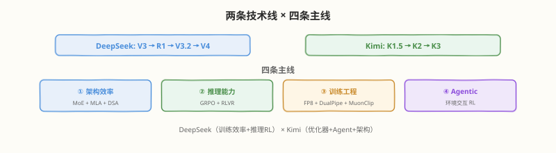
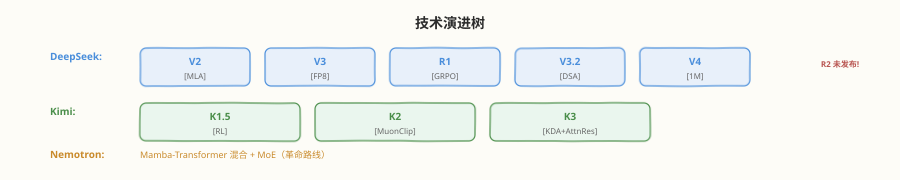
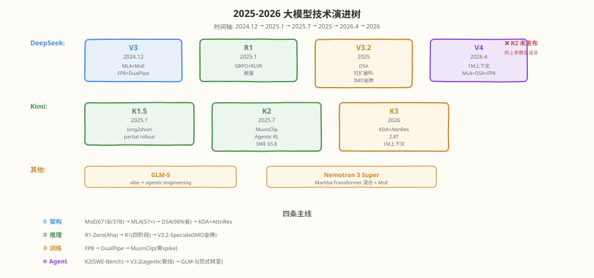

# Day 7（周日）：整合输出 —— 从输入到输出

> **本周定位**：本专题是"读论文"视角的一周——不写 kernel，目标是跟上 2025–2026 年开源大模型最前沿（DeepSeek V3 → R1 → V3.2 与 Kimi K1.5 → K2 → K3 两条技术线）。Day 7 是本周最后一天——**把六天的知识固化成自己的东西**。前六天搭好了四条主线：MoE 架构（Day 1）、RL 推理（Day 2）、训练基础设施（Day 3）、稀疏注意力（Day 4）、Agentic 训练（Day 5）、下一代架构（Day 6）。今天不学新东西，而是**输出**——写博客、做分享、画大图，用"教"来检验"学"。还有四道自测题要答——如果答不出就回炉对应那天。
>
> **前置要求**：已完成 Day 1-6 全部内容（或至少完成了 README 的取舍原则中保留的 Day 2 + Day 4）
>
> **今日目标**：① 完成三个输出任务中的至少一个（技术博客 / 15 分钟分享 / A3 技术演进树大图）；② 独立回答四道自测题，每题给出完整论证而非一句话；③ 能用"如果只能记 5 件事"的方式提炼本周精华；④ 形成自己的"读论文框架"——拿到任何一篇 2026 年大模型论文能用四要素/三层面框架快速定位
>
> **时间投入**：4h（自测题解答 1h + 输出任务 2h + 回顾提炼 1h）
>
> **检验标准**：四道自测题全部能独立答出且给出具体数字；至少完成一个输出任务；能用 5 句话向朋友说清"2025-2026 年大模型领域发生了什么"

---

## 本日在本周知识图谱中的位置

| 本日产出 | 对应价值 |
|----------|---------|
| 四道自测题完整解答 | 检验 Day 1/3/5/6 的核心理解，答不出即回炉 |
| 技术博客初稿（推荐） | 可发布的知识资产，"教是最好的学"的实践 |
| 10 页 slides 大纲 | 可用于内部分享/面试展示 |
| A3 技术演进树大图 | 一张纸回顾全周，长期记忆锚点 |
| "5 件事"提炼 | 如果只记 5 件事，是哪 5 件——强迫优先级思考 |
| "读论文框架"个人版 | 可复用于后续读任何大模型论文 |

> 💡 **Day 7 的定位**：今天不追求覆盖面，追求**固化**。学过的知识如果不在 24 小时内主动回忆和重组，遗忘曲线会让你在一周后忘掉 70%。今天的每个任务都是"主动回忆"——写博客是最高强度的主动回忆（要把碎片知识组织成线性叙事），画大图是空间组织（把时间线变成空间结构），自测题是定向检验（精准定位薄弱点）。

---

### 学习任务 1：四道自测题完整解答（60 分钟）

**合上笔记，先自己答，再对照下面的参考答案。**每题要求：① 给出核心结论；② 给出具体数字或公式；③ 给出"为什么"的论证。如果任何一题答不全，回炉对应那天。

---

#### 自测题 1：MLA 和 DSA 分别解决什么问题？能叠加吗？

**先自己答（3 分钟）**：

> （在此写下你的答案）

**参考答案**：

| 方案 | 解决什么问题 | 层面 | 关键数字 |
|------|-------------|------|---------|
| **MLA** | **显存问题**——KV cache 太大 | 存什么、存多少 | 576 维/token/层（vs MHA 32768 维，57× 压缩） |
| **DSA** | **计算问题**——注意力 $O(n^2)$ 计算量太大 | 算哪些、算多少 | $O(n \cdot k \cdot d)$（vs $O(n^2 d)$，1M token 省 98%） |

**能叠加吗？能。** 两者解决不同层面的问题：

- MLA 压缩的是 **KV cache 的表示**——把 32768 维的 $K, V$ 联合低秩压缩到 576 维潜向量 $c^{KV}$，推理时只缓存潜向量。但计算注意力分数时仍要对所有 $n$ 个历史 token 做 $Q \cdot K^T$——复杂度 $O(n^2)$ 没变。
- DSA 稀疏化的是 **注意力的计算范围**——用 Compress（块级摘要）→ Select（Top-N 选块）→ Fine attention（只算选中块）三阶段，只对 $k \ll n$ 个 token 算注意力。KV cache 仍然是 576 维潜向量（DSA 不改变缓存内容，只改变访问模式）。

**叠加后的效果**：MLA 压缓存 + DSA 稀疏计算 = V3.2 的实际方案。V4 再加 FP8 压带宽——三重叠加让 1M token 上下文从"理论可行"变成"商业可行"。

**回炉指引**：答不出"57× 压缩"或"省 98%"→ 回 Day 1 任务 3 和 Day 4 任务 3；答不出"能叠加因为解决不同层面"→ 回 Day 4 任务 6 的对比表。

---

#### 自测题 2：MuonClip 的 qk-clip 解决什么训练不稳定问题？

**先自己答（3 分钟）**：

> （在此写下你的答案）

**参考答案**：

**解决的问题**：万亿参数模型训练中的 **attention logits 爆炸 → loss spike**。

**根因链**：
1. 训练推进中，$Q$ 和 $K$ 向量逐渐"对齐"——某些 query-key 对的点积越来越大
2. 当 $Q \cdot K^T$ 超过约 1000 时，softmax 变成近似 one-hot（某个 token 权重 → 1，其余 → 0）
3. softmax 饱和区导数 → 0（梯度消失）+ $\exp(1000) = \text{inf}$（数值溢出）
4. loss 突然飙升 → loss spike

**模型越大越严重**：7B-70B 偶尔 spike；100B-300B 经常 spike；1T+ 几乎必然 spike——传统 AdamW 无法避免。

**QK-clip 的解法**：
- **不截断 logits**（截断 $QK^T$ 会破坏梯度流——截断区梯度变 0）
- **而是缩放权重**：当 $\max(|QK^T|) > \tau$ 时，$\alpha = \sqrt{\tau / \max(|QK^T|)}$，$W_Q \leftarrow \alpha \cdot W_Q$，$W_K \leftarrow \alpha \cdot W_K$——从源头调小未来的 $Q, K$
- 自适应（只在真爆了时才缩放）、渐进（$\alpha$ 接近 1）、可逆（logits 降了就不触发）

**MuonClip = Muon + QK-clip**：
- Muon 解决**优化器效率**（token 效率约 2×，Newton-Schulz 正交化）
- QK-clip 解决**训练稳定性**（attention logits 爆炸）
- K2 在 15.5T token 上预训练**零 loss spike**——万亿参数级别首次实现

**回炉指引**：答不出"attention logits 爆炸"或"softmax 饱和"→ 回 Day 3 任务 5；答不出"缩放权重而非截断 logits"→ 回 Day 3 任务 5 的 QK-clip 算法。

---

#### 自测题 3：为什么 V3.2 要用"可扩展 RL 框架"继续 scaling post-training，而不是只卷预训练？

**先自己答（3 分钟）**：

> （在此写下你的答案）

**参考答案**：

两个原因：

**① 预训练的边际收益递减**：
- V3 已在 14.8T token 上预训练——继续加 token 的知识增量越来越小（大部分知识已经学过了）
- 预训练是"读书"（获取知识）——读了 14.8T token 的书后，继续读书的收益递减
- 训练成本：V3 预训练约 $5.576M（2.79M GPU 小时 × $2）——继续卷预训练的边际成本/收益比变差

**② RL scaling 尚未见顶**：
- V3.2-Speciale 用高算力 RL 拿下 **IMO 金牌、IOI 金牌**——说明 RL 算力继续投入仍有显著回报
- RL 是"做题"（练习推理）——推理能力不是"知识"而是"怎么用知识解决问题"，靠多看书学不会
- IMO/IOI 金牌意味着跨越了从"会做题"（R1 的 AIME 79.8%）到"会创造"（IMO 要求发明解法）的门槛——证明 RL 不只强化已有能力还能激发新能力

**核心洞察**：预训练和 post-training RL 有不同的 scaling law——预训练在 14.8T token 后递减，但 RL 在 IMO 级别仍有线性回报。这意味着 **post-training RL 是下一阶段模型能力提升的主要杠杆**。

**回炉指引**：答不出"预训练边际递减"或"RL 尚未见顶"→ 回 Day 5 任务 4；答不出"IMO/IOI 金牌"→ 回 Day 5 任务 4 的 V3.2-Speciale。

---

#### 自测题 4：K3 的 KDA 和 AttnRes 分别属于架构的哪一层创新？

**先自己答（3 分钟）**：

> （在此写下你的答案）

**参考答案**：

| 创新 | 属于哪一层 | 改了什么 | 同层的前代方案 |
|------|----------|---------|--------------|
| **KDA** | **注意力层** | 注意力怎么算——在 delta（token 间变化量）上算注意力，而非原始表示 | MLA（KV 表示压缩）、DSA（计算稀疏化）、线性注意力（softmax 替换） |
| **AttnRes** | **残差/连接层** | 层间怎么传信息——用注意力门控 $\alpha(h), \beta(h)$ 替代恒等映射 1 | 标准残差连接 $h + F(h)$（ResNet 2016 以来的标配） |

**两者正交，可叠加**：KDA 管子层内部的注意力计算，AttnRes 管子层之间的信息传递——作用在 Transformer 的不同层面。K3 同时引入两者：一个解决"注意力怎么算更高效"，一个解决"深层网络怎么传信息更稳定"。

**三层架构创新框架**（今天任务 3 会详细展开）：
- **注意力层**：MLA → DSA → KDA（Day 1/4/6）
- **残差/连接层**：标准残差 → AttnRes（Day 1/6）
- **FFN/专家层**：稠密 FFN → MoE（Day 1）

**回炉指引**：答不出"KDA 属于注意力层、AttnRes 属于残差层"→ 回 Day 6 任务 2 和 3；答不出"两者正交可叠加"→ 回 Day 6 面试题 Q18。

---

### 学习任务 2：技术博客初稿 —— 《2026 大模型前沿技术全景》（90 分钟，推荐）

这是 README 推荐的输出任务。下面提供一个**完整的博客初稿框架**——你可以在此基础上填充、删改、加入自己的理解。

---

#### 《2026 大模型前沿技术全景：从 DeepSeek-V3.2 到 Kimi K3》

**副标题**：四条主线、两条技术线、一张演进图——一周读懂 2025-2026 开源大模型前沿

---

##### 引言：为什么 2025-2026 是大模型的"分水岭"

2024 年底，DeepSeek-V3 用 671B/37B 的 MoE 架构和 $5.576M 的训练成本证明了一件事：**开源模型可以做到和闭源旗舰相当的性能，但成本只有其 1/10**。这打开了一扇门——2025-2026 年，开源大模型沿着四条主线全面突破：

1. **架构效率**：MoE 稀疏激活 + MLA 压缩 + DSA 稀疏注意力，让"3T 参数 + 1M 上下文"变成商业可行
2. **推理能力**：R1 用纯 RL "训出"推理能力，证明推理不是"教"出来的而是"练"出来的
3. **训练工程**：FP8 + DualPipe + MuonClip，让万亿参数训练零 loss spike、成本减半
4. **Agentic 智能**：从"聊天模型"到"智能体"，环境交互 RL 把"可验证"从数学答案扩展到工具调用结果

本文用 DeepSeek（V3 → R1 → V3.2 → V4）和 Kimi（K1.5 → K2 → K3）两条技术线，串起这四条主线的演进。

---

##### 第一部分：架构效率 —— 从 671B 到 2.8T 的"省钱哲学"

**核心命题**：大模型的"大"不等于"贵"——MoE 让容量（总参数）和成本（激活参数）解耦。

**演进线索**：

| 模型 | 总参/激活 | 架构创新 | 训练成本 |
|------|----------|---------|---------|
| DeepSeek-V3 | 671B/37B | MLA（KV cache 压缩 57×）+ DeepSeekMoE（256 专家 Top-8） | ~$5.576M |
| DeepSeek-V4 | ~1.6T/49B | + DSA（注意力计算省 98%） | 未公开 |
| Kimi K3 | 2.8T/~32-49B | + KDA + AttnRes | 未公开 |

**关键洞察**：
- **MoE 是"省算力"**：每 token 只激活 1-2% 参数，容量和成本解耦（Day 1）
- **MLA 是"省显存"**：KV cache 从 32768 维压到 576 维/token/层（Day 1）
- **DSA 是"省计算"**：1M token 注意力从 $O(n^2)$ 砍到 $O(n \cdot k)$，省 98%（Day 4）
- **AttnRes 是"省稳定性代价"**：更深网络不需额外稳定化技巧（Day 6）

三者叠加（MLA + DSA + FP8）让 V4 敢默认 1M token 上下文——这就是"3T 参数 + 1M 上下文"商业可行的技术基础。

---

##### 第二部分：推理能力 —— R1 的革命与 RL scaling

**核心命题**：推理能力可以被 RL"练出来"，不需要海量人类标注的思维链数据。

**演进线索**：

| 模型 | 核心创新 | AIME 2024 | 关键数字 |
|------|---------|-----------|---------|
| V3-Base | 预训练基座 | ~15% | 14.8T token |
| R1-Zero | 纯 RL（GRPO + RLVR），无 SFT | ~52% | 涌现 Aha moment |
| R1 | 四阶段管线（冷启动→RL→SFT→RL） | 79.8% | 蒸馏 Qwen-32B 72.6% |
| V3.2-Speciale | 可扩展 RL（高算力 RL） | — | IMO/IOI 金牌 |

**关键洞察**：
- **GRPO 砍掉 critic**：用群组相对基线替代 value function，省约一半训练显存（Day 2）
- **RLVR 避免 reward hacking**：可验证奖励（答案对/错）不可被骗（Day 2）
- **Aha moment 是涌现**：反思行为从"反思→纠错→答对"的间接路径被 RL 选择，非显式训练（Day 2）
- **RL 也可 scaling**：预训练边际递减后，RL 算力是下一阶段能力提升的主要杠杆（Day 5）

---

##### 第三部分：训练工程 —— 万卡集群的"护城河"

**核心命题**：训练效率是前沿实验室真正的护城河——同样的算力，效率高的实验室能训出更强的模型。

**三大支柱**：

| 支柱 | 技术 | 效果 | 对应天 |
|------|------|------|--------|
| 精度 | FP8 tile-wise scaling | 计算量减半、零质量损失 | Day 3 |
| 并行 | DualPipe 双向流水线 | 气泡从 30% 降到接近零 | Day 3 |
| 优化器 | MuonClip（Muon + QK-clip） | token 效率 2× + 零 loss spike | Day 3 |

**关键数字**：
- V3 训练：2048 H800、2.79M GPU 小时、57 天、~$5.576M
- K2 训练：~1T 参数、15.5T token、**零 loss spike**（MuonClip 的功劳）
- 对比 GPT-4 估算 $60-100M——V3 成本仅 1/10

---

##### 第四部分：Agentic 智能 —— 2026 年的主战场

**核心命题**：从"聊天模型"到"智能体"——Agent 能力是"训"出来的，不是"提示"出来的。

**三条路线**：

| 路线 | 代表 | 核心策略 | 成就 |
|------|------|---------|------|
| 实用 Agent | K2 | 大规模数据合成管线 + 真实/合成环境联合 RL | SWE-Bench 65.8、Tau2-Bench 66.1 |
| 极限推理 | V3.2-Speciale | 可扩展 RL 框架（高算力 RL） | IMO/IOI 金牌 |
| 范式转变 | GLM-5 | 从 vibe coding 到 agentic engineering | 工程实践导向 |

**关键洞察**：
- **Agentic RL = Day 2 的 GRPO + 环境交互**：把 RLVR 从"答案可验证"扩展到"工具调用结果可验证"（Day 5）
- **数据合成管线是 Agent 训练的命脉**：真实数据不够，用模型生成轨迹 + 拒绝采样筛选（Day 5）
- **RL scaling 不只见于推理**：Agent 能力也随 RL 算力增加而提升（Day 5）

---

##### 第五部分：下一代架构 —— K3 与两条路线之争

**核心命题**：2026 年架构创新走向两条路——Transformer 内演化（K3）vs 范式混合（Nemotron）。

| 路线 | 代表 | 策略 | 哲学 |
|------|------|------|------|
| 演化 | K3 | KDA + AttnRes（Transformer 内改零件） | "Transformer 还能优化" |
| 革命 | Nemotron | Mamba-Transformer 混合 + MoE | "Transformer 需要被补充" |

**K3 的两项架构创新**：
- **KDA（注意力层）**：在 delta（token 间变化量）上算注意力，降低冗余计算
- **AttnRes（残差层）**：用注意力门控 $\alpha(h), \beta(h)$ 替代恒等映射 $h + F(h)$——挑战 ResNet 2016 年以来的"标配"

---

##### 结语：如果只能记 5 件事

1. **MoE 让"大"不等于"贵"**：671B 总参 / 37B 激活，容量和成本解耦
2. **R1 证明推理是"练"出来的**：纯 RL 涌现 Aha moment，GRPO 砍掉 critic 省一半显存
3. **MLA + DSA + FP8 让 1M 上下文商业可行**：压缓存 + 稀疏计算 + 压带宽
4. **RL scaling 是下一阶段的杠杆**：预训练边际递减，但 RL 在 IMO 级别仍有线性回报
5. **K3 的 AttnRes 挑战 9 年标配**：从恒等残差到注意力门控，深层网络一致 scaling 收益

---

##### 参考论文清单

| 论文 | arXiv | 对应主线 |
|------|-------|---------|
| DeepSeek-V3 | 2412.19437 | 架构 + 训练 |
| DeepSeek-R1 | 2501.12948 | 推理 RL |
| Kimi K2 | 2507.20534 | 训练 + Agent |
| DeepSeek-V3.2 | 2512.02556 | DSA + 可扩展 RL |
| GLM-5 | 2602.15763 | Agentic |
| Kimi K3 / AttnRes | MoonshotAI GitHub | 下一代架构 |

---

> 💡 **你的任务**：以上是博客初稿框架。你的任务是把它变成**你自己的博客**——① 加入你自己的理解和评论（哪条主线你最兴奋？为什么？）；② 加入你的动手任务体验（Day 2 的思维链观察、Day 5 的 Agent 失败模式分析）；③ 删掉你觉得不必要的部分，控制在一篇可发布的长度（3000-5000 字）；④ 如果你有自己的博客/公众号，发布它——"教是最好的学"。

---

### 学习任务 3：10 页 Slides 大纲 —— 15 分钟分享（45 分钟）

如果你选择做分享而非写博客，以下是 10 页 slides 的大纲：

---

#### Slide 1：标题页

```
2026 大模型前沿技术全景
从 DeepSeek-V3.2 到 Kimi K3
—— 一周读懂 2025-2026 开源大模型前沿
```

---

#### Slide 2：全景图——两条技术线 × 四条主线



---

#### Slide 3：架构效率——MoE 让"大"不等于"贵"

```
DeepSeek-V3: 671B 总参 / 37B 激活
  → 每 token 只用 37B 的算力，但拥有 671B 的知识容量
  → 训练成本 ~$5.576M（GPT-4 估算的 1/10）

MoE 本质:
  容量 ∝ 总参数（671B）
  成本 ∝ 激活参数（37B）
  两者解耦 = "用 37B 的价钱，买 671B 的脑子"
```

---

#### Slide 4：MLA + DSA —— 让 1M 上下文变便宜

```
两笔账:
  显存: MLA 把 KV cache 压缩 57×（32768 → 576 维/token/层）
  计算: DSA 把注意力计算省 98%（O(n²) → O(n·k)）

      MLA 管存什么 → 576 维潜向量
      DSA 管算哪些 → Top-N 块（4096 token）
      FP8 管带宽   → 1 字节/元素

三者叠加 → V4 默认 1M token 上下文
```

---

#### Slide 5：R1 的革命——推理是"练"出来的

```
R1-Zero: 纯 RL（GRPO + RLVR），无 SFT
  → AIME 2024 从 ~15% 涨到 ~52%
  → 涌现 Aha moment（"Wait, let me reconsider..."）

GRPO: 砍掉 critic，用群组均值做基线
  → 省约一半训练显存
  → A_i = (r_i - mean) / std

RLVR: 可验证奖励（答案对/错），不用奖励模型
  → 无法被骗 → 避免 reward hacking
```

---

#### Slide 6：训练工程——护城河在哪里

```
FP8: tile-wise scaling（每 128×128 块一个缩放因子）
  → 计算量减半，零质量损失

DualPipe: 双向流水线 + EP 通信重叠
  → 气泡从 30% 降到接近零

MuonClip: Muon（正交化，token 效率 2×）+ QK-clip（防 logits 爆炸）
  → K2 在 15.5T token 上零 loss spike

V3 训练: 2048 H800 × 57 天 × ~$5.576M
```

---

#### Slide 7：Agentic 智能——2026 主战场

```
聊天模型 → 智能体:
  单轮文本 → 多步行动（观察→思考→行动→...）
  无环境 → 有环境交互
  答案验证 → 交付物验证

K2: SWE-Bench 65.8、Tau2-Bench 66.1
  → 大规模数据合成管线 + 真实/合成环境联合 RL

V3.2-Speciale: IMO 金牌、IOI 金牌
  → 可扩展 RL（高算力 RL scaling）
```

---

#### Slide 8：下一代架构——K3 的两项创新

```
K3: 2.8T 参数，全球首个开源 3T 级模型

KDA（注意力层）: 在 delta（变化量）上算注意力
  → 降低冗余计算

AttnRes（残差层）: 用注意力门控替代恒等映射
  h' = h ⊙ α(h) + F(h) ⊙ β(h)
  → 挑战 ResNet 2016 年以来的"标配"
  → 一致 scaling 收益
```

---

#### Slide 9：技术演进树



---

#### Slide 10：如果只记 5 件事

```
1. MoE 让"大"不等于"贵"（671B/37B）
2. R1 证明推理是"练"出来的（GRPO + RLVR + Aha moment）
3. MLA + DSA + FP8 让 1M 上下文商业可行
4. RL scaling 是下一阶段杠杆（预训练递减，RL 未触顶）
5. AttnRes 挑战 9 年标配（恒等残差 → 注意力门控）
```

---

> 💡 **你的任务**：以上是 10 页 slides 的大纲。你的任务是：① 如果要做分享，用 PPT/Keynote/Slides 把它做成实际 slides（每页加图表/示意图）；② 控制在 15 分钟内讲完（每页约 1.5 分钟）；③ 找一个朋友/同事试讲一遍，记录他/她哪里听不懂——那些地方就是你自己理解不够深的地方。

---

### 学习任务 4：A3 技术演进树大图（45 分钟）

如果你选择画大图，以下是布局建议：

---

#### 布局方案（A3 横版）



#### 画图要点

| 要点 | 说明 |
|------|------|
| **时间轴** | 横轴标时间（2024.12 → 2026），每个模型对齐到发布时间 |
| **两条主线** | DeepSeek 和 Kimi 各一条横线，平行展示 |
| **节点标注** | 每个节点（模型）标注核心创新（2-3 个关键词） |
| **四色标注** | 四条主线用四种颜色——架构(蓝)、推理(红)、训练(绿)、Agent(橙) |
| **交叉连接** | 技术传承用虚线连接（如 R1 的 GRPO → K2 的 Agentic RL） |
| **谣言警示** | 在 R2 位置画一个 ❌ 标注"未发布" |
| **补充线** | GLM-5 和 Nemotron 作为"其他路线"在下方平行展示 |

> 💡 **你的任务**：拿一张 A3 纸（或用 Excalidraw / Miro / draw.io），画出这张演进树。画的过程中你会发现哪些连接记不清——那些就是需要回炉的地方。画完后贴在工位/书桌旁，长期作为"记忆锚点"。

---

### 学习任务 5：回顾提炼 —— "如果只能记 5 件事" + 个人读论文框架（30 分钟）

#### 如果只能记 5 件事

合上所有笔记，写下你认为本周最重要的 5 件事。下面是参考——你的版本可能不同，那正是你自己的知识优先级。

| # | 件事 | 为什么重要 | 对应天 |
|---|------|----------|--------|
| 1 | **MoE 让"大"不等于"贵"** | 容量(总参数)和成本(激活参数)解耦——这是 3T 模型商业可行的基础 | Day 1 |
| 2 | **R1 证明推理是"练"出来的** | 纯 RL 涌现 Aha moment——推理能力不靠标注数据而靠 RL 选择 | Day 2 |
| 3 | **MLA + DSA + FP8 让 1M 上下文商业可行** | 压缓存 + 稀疏计算 + 压带宽，三重叠加是 V4 的技术基础 | Day 1/3/4 |
| 4 | **RL scaling 是下一阶段杠杆** | 预训练边际递减，但 RL 在 IMO 级别仍有线性回报 | Day 5 |
| 5 | **AttnRes 挑战 9 年标配** | 从恒等残差到注意力门控——架构创新不在 FFN/注意力层，而在残差层 | Day 6 |

> 💡 **为什么"5 件事"比"全部记住"更有价值**：人的工作记忆容量是 7±2 个组块。如果你能在 5 句话内说清一周学的东西，说明你真正理解了优先级——这是"深度理解"的标志。如果你只能说"学了很多"但说不出哪 5 件最重要，说明知识还是碎片化的。

#### 个人"读论文框架"

本周每天结尾都强调了一个"读 XX 章节的框架"。把它们汇总成你的个人读论文工具箱：

| 章节类型 | 四要素框架 | 对应天 |
|---------|----------|--------|
| **模型结构** | 总参数 / 激活参数 / KV cache 每 token 大小 / 每层结构 | Day 1 |
| **RL 训练** | 算法(PPO/GRPO) / 奖励来源(模型/规则/可验证) / 有无 SFT 冷启动 / rollout 怎么做 | Day 2 |
| **训练基础设施** | 并行策略(DP/TP/PP/EP) / 精度(BF16/FP8) / 优化器(AdamW/Muon) / 稳定性(loss spike 频率) | Day 3 |
| **注意力架构** | 计算复杂度($O(n^2)$/O(nk)/$O(n)$) / KV cache 存什么(完整向量/潜向量/固定矩阵) / 稀疏模式(位置/内容/学习) | Day 4 |
| **后训练/Agentic** | 数据来源(真实/合成/混合) / 环境怎么搭(沙箱/模拟/真实API) / RL 奖励(工具结果可验证/人工/模型) / scaling 在哪(数据/算力/模型) | Day 5 |
| **架构创新** | 三层面定位：注意力层(MLA/DSA/KDA) / 残差层(标准残差/AttnRes) / FFN层(稠密/MoE) | Day 6 |

**使用方法**：拿到任何一篇 2026 年大模型论文，先翻到对应章节，用框架的四个要素快速定位——5 分钟内就能判断"这篇论文改了什么、属于哪层创新、和前代方案的关系"。

---

### 面试题积累（本周总复习，今日 3 道）

**Q19：用 5 句话说清"2025-2026 年大模型领域发生了什么"？**
> ① MoE 稀疏激活让模型"大而不贵"——DeepSeek-V3 用 671B 总参/37B 激活实现 GPT-4 级性能但训练成本仅 $5.576M（1/10）。② DeepSeek-R1 用纯 RL（GRPO + RLVR）"训出"推理能力——无 SFT、无奖励模型、无人工标注思维链，涌现了 Aha moment 反思行为（AIME 2024 从 ~15% 涨到 ~52%）。③ MLA（KV cache 压缩 57×）+ DSA（注意力计算省 98%）+ FP8（带宽减半）三重叠加让 1M token 上下文商业可行——V4 默认 1M 上下文。④ 训练工程成为护城河——FP8 tile-wise scaling + DualPipe 双向流水线 + MuonClip 优化器（token 效率 2× + 零 loss spike），让 K2 在 15.5T token 上预训练零 spike。⑤ 2026 年走向 Agentic 智能 + 下一代架构——K2 在 SWE-Bench 拿 65.8、V3.2-Speciale 拿 IMO/IOI 金牌（RL scaling 尚未见顶），K3 用 KDA + AttnRes 挑战 9 年标配残差连接做到 2.8T。

**Q20：DeepSeek 和 Kimi 两条技术线各自的核心贡献是什么？如果你要选一条深入研究，选哪条？**
> DeepSeek 线的核心贡献是"训练效率 + 推理 RL"：V3 的 MoE+MLA+FP8+DualPipe 是训练工程的标杆（$5.576M 训练 671B），R1 的 GRPO+RLVR 是推理 RL 的范式革命（纯 RL 涌现推理），V3.2 的 DSA+可扩展 RL 是长上下文+RL scaling 的结合（IMO 金牌）。Kimi 线的核心贡献是"优化器创新 + Agentic 工程"：K1.5 的 long2short+partial rollout 是 RL 工程化的先驱，K2 的 MuonClip+agentic 数据合成管线是万亿级训练+Agent 的实践标杆（SWE-Bench 65.8），K3 的 KDA+AttnRes 是架构创新的下一步（2.8T+挑战残差标配）。选哪条取决于方向：偏训练系统工程选 DeepSeek（infra 更完整），偏 Agent/应用工程选 Kimi（agentic 更前沿）。两条线的技术互相借鉴——K2 沿用了 R1 的 GRPO，V3.2 借鉴了 K2 的 agentic 管线思路。

**Q21：本周学了四条主线（架构/推理/训练/Agent），它们之间有什么内在联系？哪个是"因"哪个是"果"？**
> 四条主线不是独立的，而是一条因果链：**架构（MoE+MLA）是"因"** → 它让大模型训得起、装得下，才有了后续一切；**训练工程（FP8+DualPipe+MuonClip）是"放大器"** → 把架构的效率优势放大到万亿参数级（V3 $5.576M、K2 零 spike）；**推理 RL（GRPO+RLVR）是"能力突破"** → 在高效训练的基础上，用 RL 激发推理能力（R1 Aha moment、V3.2 IMO 金牌）；**Agentic RL 是"能力延伸"** → 把推理 RL 的方法迁移到行动空间（K2 SWE-Bench 65.8）。另一个关键联系：**稀疏注意力（DSA）是架构和 Agent 之间的桥梁**——Agent 的长轨迹需要长上下文，DSA 让长上下文可负担，所以没有 Day 4 的 DSA 就没有 Day 5 的 Agentic RL。这就是为什么本周的顺序是 架构→推理→训练→稀疏注意力→Agent→下一代架构——每一天都是后一天的基础。

---

### 今日检查清单

- [ ] 四道自测题全部独立答出（先自己答再对照参考答案）
- [ ] 自测题 1：MLA 解决显存（576 维，57× 压缩）、DSA 解决计算（省 98%），能叠加因为不同层面
- [ ] 自测题 2：QK-clip 解决 attention logits 爆炸→loss spike，缩放权重而非截断 logits，K2 零 spike
- [ ] 自测题 3：预训练边际递减 + RL 尚未见顶（IMO 金牌），RL 是下一阶段杠杆
- [ ] 自测题 4：KDA 属注意力层、AttnRes 属残差层，正交可叠加
- [ ] 完成至少一个输出任务（博客初稿 / 10 页 slides / A3 演进树大图）
- [ ] 博客任务：在初稿框架上加入自己的理解和动手任务体验，控制 3000-5000 字
- [ ] Slides 任务：做成实际 slides 并试讲一遍，记录听众听不懂的地方
- [ ] 大图任务：画出技术演进树，四色标注四条主线，R2 标注"未发布"
- [ ] 写下自己的"如果只能记 5 件事"版本（可能和参考不同，那是你的优先级）
- [ ] 形成个人"读论文框架"（六种章节类型 × 四要素）
- [ ] 能用 5 句话向朋友说清"2025-2026 年大模型领域发生了什么"
- [ ] 能说出四条主线的因果联系（架构是因→训练是放大器→推理是突破→Agent是延伸，DSA是架构和Agent的桥梁）

#### 本周总结

本周用 DeepSeek（V3 → R1 → V3.2 → V4）和 Kimi（K1.5 → K2 → K3）两条技术线，串起了 2025-2026 年开源大模型的四条主线——MoE 架构、RL 推理、训练基础设施、Agentic 训练——并展望了下一代架构（K3 的 KDA + AttnRes）。

**如果你完整走完了七天**，你现在应该能：
- 拿到任何一篇 2026 年大模型论文，用四要素框架在 5 分钟内定位它改了什么、属于哪层创新
- 向朋友解释清楚"为什么 V4 敢默认 1M 上下文"（MLA + DSA + FP8 三重叠加）
- 向朋友解释清楚"为什么 R1 的纯 RL 能涌现推理"（RL 做选择而非创造，基座模型的分布里有种子）
- 在面试中回答 GRPO vs PPO、MoE 为什么省算力、FP8 精度风险、AttnRes vs 标准残差等高频问题
- 辨别"R2 已发布"类的谣言（看源头/看时间/看细节/交叉验证）

**下一步建议**：
- 如果你对**训练工程**最感兴趣→深入 [MoE 专题](../moe/README.md) 和 [DeepGEMM 专题](../deepgemm/README.md)，看 Grouped GEMM 和 EP 通信的 kernel 级实现
- 如果你对**推理 RL**最感兴趣→重读 R1 论文全文，尝试复现 GRPO 的简化版
- 如果你对**长上下文**最感兴趣→深入 [Transformer 专题](../transformer/README.md) 的 FlashAttention 部分，理解 attention kernel 的演进
- 如果你对**Agentic**最感兴趣→实际用 K2 或 V3.2 做一个 Agent 项目，在实战中体会 Day 5 的失败模式

> 💡 **教是最好的学**。本周的知识如果不去输出（写博客/做分享/画大图），一周后会遗忘 70%。今天就完成你的输出任务——哪怕只是一篇 1000 字的短博客或一张手画的演进树，都比"我学了但没输出"强 10 倍。
