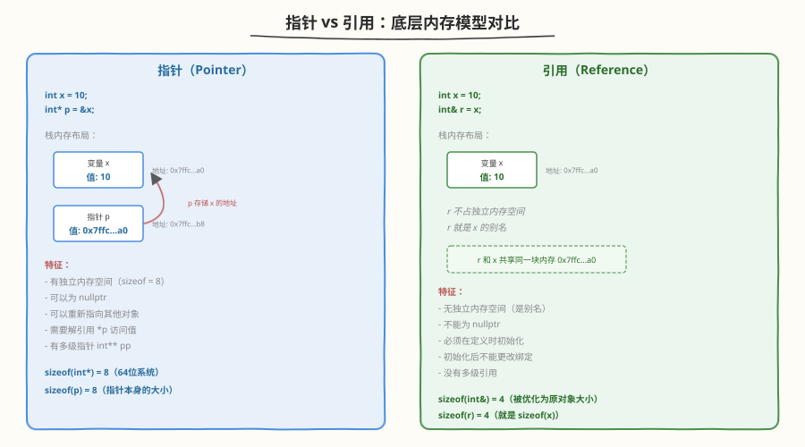
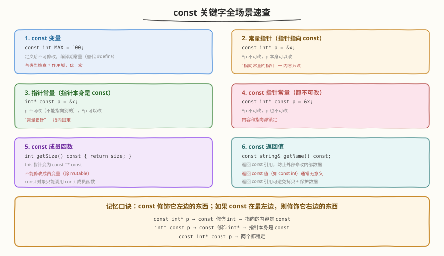
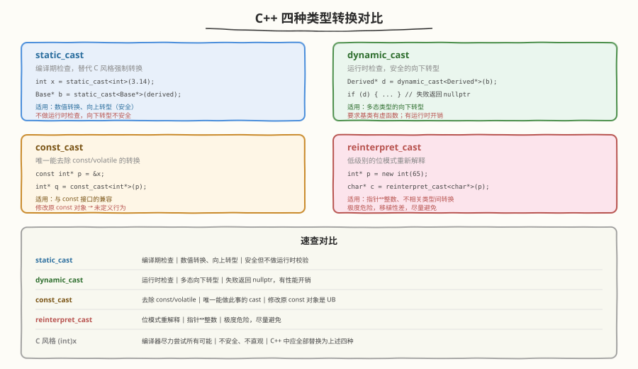

# Day 1（周一）：语言基础 + 关键字

> **今日目标**：把最常被"随口一问"的 C++ 基础题答扎实——指针/引用、const、static、类型转换
> **面试考察度**：⭐⭐⭐⭐⭐ 几乎每场必问
> **建议节奏**：上午学理论（2~3h）→ 下午刷题自测（2h）→ 晚上手写代码 + 复述（1~2h）

---

## 学习任务 1：指针 vs 引用（45 分钟）

### 核心区别



| 维度 | 指针（Pointer） | 引用（Reference） |
|------|----------------|------------------|
| 本质 | 独立的变量，存储目标地址 | 别名，不占独立内存 |
| 初始化 | 可以先声明后赋值 | **必须在定义时初始化** |
| 可否重新绑定 | 可以指向不同对象 | 初始化后**不能更改绑定** |
| nullptr | 可以为 nullptr | 不能为 nullptr |
| 多级 | 有 `int**`、`int***` | 没有多级引用 |
| sizeof | 8（64位系统，指针本身大小） | 等于原对象的 sizeof |
| 解引用 | 需要 `*p` 访问目标 | 直接使用，无需解引用 |

### 代码示例

```cpp
int x = 10;
int y = 20;

int* p = &x;    // 指针：p 存储 x 的地址
int& r = x;     // 引用：r 就是 x 的别名

p = &y;         // OK：指针可以重新指向
// r = y;       // 这是赋值！r 仍然绑定 x，相当于 x = y
*p = 30;        // y 变成 30
r = 40;         // x 变成 40
```

### 使用场景

- **用指针**：需要表示"无指向"（nullptr）、需要重新绑定、C 风格 API 兼容
- **用引用**：函数参数传递（避免拷贝）、运算符重载、保证非空

### 面试追问

> **Q：引用底层是怎么实现的？**
> A：大多数编译器用指针实现引用（即引用底层有地址），但 C++ 标准将引用定义为"别名"。编译器优化后引用通常不占额外内存。

> **Q：函数返回引用有什么风险？**
> A：不能返回局部变量的引用——函数结束后局部变量被销毁，引用变成悬空引用。

---

## 学习任务 2：const 的各种用法（45 分钟）



### 常量指针 vs 指针常量（最容易混淆）

```cpp
const int* p1;      // 指向 const int 的指针 → *p1 不可改，p1 可改
int* const p2;      // const 指针指向 int → p2 不可改，*p2 可改
const int* const p3; // 都不可改
```

**记忆技巧**：从右往左读——`const` 修饰它紧左边的东西。如果 `const` 在最左边，则修饰它右边的东西。

### const 成员函数

```cpp
class Widget {
    int size_ = 0;
    mutable int cache_ = 0;  // mutable 突破 const 限制
public:
    int getSize() const {     // const 成员函数
        // size_ = 10;        // 错误：不能修改成员变量
        cache_ = 10;          // OK：mutable 变量可以修改
        return size_;
    }
};

const Widget w;
w.getSize();                  // OK：const 对象只能调用 const 成员函数
```

### const 与 #define 对比

```cpp
#define MAX 100               // 宏：文本替换，无类型检查
const int MAX = 100;          // 有类型、有作用域、可调试

// 宏的坑：
#define SQUARE(x) x * x
int a = SQUARE(1 + 2);       // 展开为 1 + 2 * 1 + 2 = 5，不是 9！
```

---

## 学习任务 3：static 关键字（30 分钟）

### 四种用法

| 场景 | 作用 | 生命周期 |
|------|------|---------|
| 静态局部变量 | 函数内只初始化一次，跨调用保持值 | 程序运行期 |
| 静态成员变量 | 属于类而非对象，所有对象共享 | 程序运行期 |
| 静态成员函数 | 属于类，不能访问非静态成员 | — |
| 全局 static（文件作用域） | 限制变量/函数只在本文件可见 | 程序运行期 |

### 代码示例

```cpp
// 1. 静态局部变量
void counter() {
    static int count = 0;   // 只初始化一次
    count++;
    std::cout << count << std::endl;
}
counter();  // 输出 1
counter();  // 输出 2
counter();  // 输出 3

// 2. 静态成员
class Singleton {
    static Singleton* instance_;
    static int objCount_;
};
int Singleton::objCount_ = 0;  // 类外定义

// 3. 文件作用域 static
static int helper_count = 0;   // 只在本 .cpp 文件可见
static void internalHelper() {} // 只在本 .cpp 文件可见
```

---

## 学习任务 4：其他关键字（30 分钟）

### inline

```cpp
inline int square(int x) { return x * x; }
// 建议编译器内联展开，消除函数调用开销
// 只是建议，编译器可能忽略
// 类内定义的成员函数隐式 inline
```

### extern

```cpp
// 声明（不分配内存）
extern int globalVar;

// extern "C" 让 C++ 编译器使用 C 的链接方式
extern "C" void cFunction(int x);
```

### volatile

```cpp
volatile int flag = 0;
// 告诉编译器不要优化对该变量的访问
// 用于：硬件寄存器、信号处理、多线程标志

// ⚠️ volatile 不能保证线程安全！
// 它只防止编译器优化，不提供原子性和内存序保证
// 多线程应使用 std::atomic
```

### mutable

```cpp
class Cache {
    mutable std::map<int, int> cache_;  // 可在 const 函数中修改
public:
    int lookup(int key) const {
        auto it = cache_.find(key);
        if (it == cache_.end()) {
            cache_[key] = compute(key);  // OK：mutable
        }
        return cache_[key];
    }
};
```

### explicit

```cpp
class String {
    int size_;
public:
    explicit String(int size) : size_(size) {}  // 禁止隐式转换
};

String s1 = 10;       // 错误：explicit 禁止隐式转换
String s2(10);        // OK：直接初始化
String s3 = String(10); // OK：explicit 不禁止显式转换
```

---

## 学习任务 5：宏 vs const vs inline vs enum（20 分钟）

| 维度 | `#define` | `const` | `inline` | `enum` |
|------|-----------|---------|----------|--------|
| 类型检查 | 无 | 有 | 有 | 有（scoped enum 更强） |
| 作用域 | 无（全局文本替换） | 有 | 有 | 有 |
| 调试 | 不可见 | 可见 | 可见 | 可见 |
| 适用场景 | 条件编译、头文件保护 | 常量 | 小函数 | 枚举值 |

```cpp
// #define 的坑
#define PI 3.14159          // 无类型、无作用域
#define MAX(a,b) ((a)>(b)?(a):(b))  // 参数多次求值

// 现代 C++ 替代方案
constexpr double PI = 3.14159;
template<typename T>
T max_val(T a, T b) { return a > b ? a : b; }

// enum class（C++11）
enum class Color { Red, Green, Blue };
Color c = Color::Red;       // 强类型，不会隐式转 int
```

---

## 学习任务 6：类型转换（30 分钟）



### static_cast

```cpp
// 数值类型转换
double d = 3.14;
int i = static_cast<int>(d);   // 3

// 向上转型（安全）
Derived* dp = new Derived;
Base* bp = static_cast<Base*>(dp);

// 向下转型（不安全，不做运行时检查）
Base* bp = new Derived;
Derived* dp = static_cast<Derived*>(bp);  // 可能不安全
```

### dynamic_cast

```cpp
Base* bp = getShape();
Derived* dp = dynamic_cast<Derived*>(bp);
if (dp) {
    // 转换成功，bp 确实指向 Derived 对象
} else {
    // 转换失败，bp 不是 Derived 类型
}
// 要求 Base 有虚函数
```

### const_cast

```cpp
void print(const string& s) {
    // string& ns = const_cast<string&>(s);
    // ns[0] = 'X';  // 未定义行为！原对象是 const
}

// 合理使用场景：重载消除
class Text {
    string data_;
public:
    const char& get(int i) const { return data_[i]; }
    char& get(int i) {
        return const_cast<char&>(
            static_cast<const Text*>(this)->get(i)
        );
    }
};
```

### reinterpret_cast

```cpp
int x = 65;
char* p = reinterpret_cast<char*>(&x);
// 把 int 的内存按 char 解读

uintptr_t addr = reinterpret_cast<uintptr_t>(p);
// 指针转整数（调试用）
```

---

## 高频面试题自测

### Q1：const 指针和指向 const 的指针怎么区分？

<details>
<summary>点击查看答案</summary>

- `const int* p`（或 `int const* p`）：指向 const int 的指针，`*p` 不可改，`p` 可改
- `int* const p`：const 指针指向 int，`p` 不可改，`*p` 可改
- 记忆：`const` 修饰它左边的东西；若 `const` 在最左边，修饰右边的

</details>

### Q2：为什么析构函数要声明成 virtual？（预热 Day 3）

<details>
<summary>点击查看答案</summary>

通过基类指针删除派生类对象时，如果析构函数不是 virtual，只会调用基类析构函数，派生类部分不会被清理——内存泄漏。

```cpp
Base* p = new Derived;
delete p;  // 如果 ~Base() 不是 virtual，~Derived() 不会被调用
```

</details>

### Q3：volatile 能保证线程安全吗？

<details>
<summary>点击查看答案</summary>

**不能。** `volatile` 只防止编译器优化对该变量的读写（如缓存到寄存器），但不提供：
- 原子性（读-改-写不是原子的）
- 内存序保证（不阻止 CPU 重排序）

多线程应使用 `std::atomic` 或 `std::mutex`。（详见 Day 6）

</details>

---

## 动手练习

### 练习 1：用引用实现 swap

```cpp
void swap(int& a, int& b) {
    int tmp = a;
    a = b;
    b = tmp;
}

// C++ 标准库版本
#include <utility>
std::swap(a, b);
```

### 练习 2：写一个禁止拷贝的类

```cpp
// 方法 1：C++11 delete
class NonCopyable {
public:
    NonCopyable() = default;
    NonCopyable(const NonCopyable&) = delete;
    NonCopyable& operator=(const NonCopyable&) = delete;
};

// 方法 2：C++98（private + 不实现）
class NonCopyable {
    NonCopyable(const NonCopyable&);
    NonCopyable& operator=(const NonCopyable&);
protected:
    NonCopyable() = default;
    ~NonCopyable() = default;
};
```

---

## 今日小结

| 主题 | 核心要点 | 面试频率 |
|------|---------|---------|
| 指针 vs 引用 | 指针有独立内存、可为 null、可重绑定；引用是别名 | ⭐⭐⭐⭐⭐ |
| const | 修饰左边；const 成员函数不修改成员 | ⭐⭐⭐⭐⭐ |
| static | 四种用法，注意作用域和生命周期 | ⭐⭐⭐⭐ |
| 类型转换 | 四种 cast 各有用途，替代 C 风格转换 | ⭐⭐⭐⭐ |
| volatile | 不保证线程安全！ | ⭐⭐⭐ |

> **明日预告**：Day 2 内存管理 ⭐——重中之重，必考。new/delete 原理、内存分区、内存泄漏排查。
