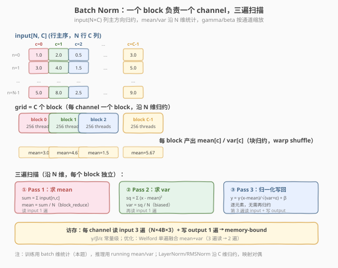
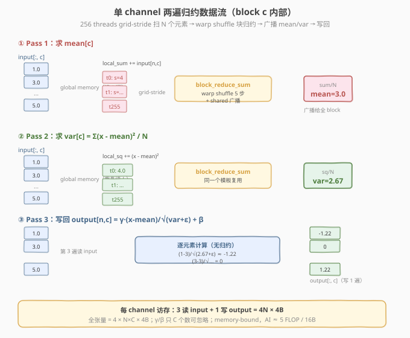
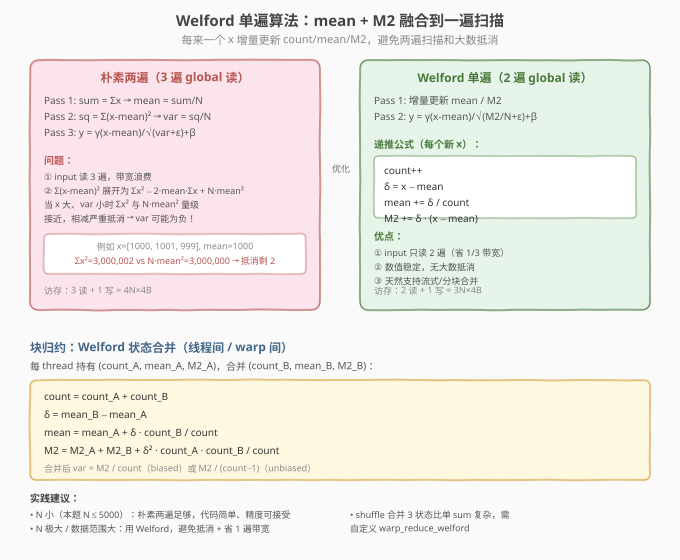

# LeetGPU Batch Normalization 题解

> **面试考察度**：⭐⭐⭐⭐ Batch Norm 是"统计归约类 norm kernel"的代表，面试常以"BN 推理 kernel 怎么写、和 LayerNorm 的归约方向有什么区别"追问，考查对归约轴与访存合并的理解
> **面试形式**：手写 per-channel 归约 kernel + 讲清"为什么 BN 沿 N 归约、和 LayerNorm 沿 C 归约的访存模式对偶"

## 1. 题目概述

- **标题 / 题号**：Batch Normalization（LeetGPU #40，medium）
- **链接**：https://leetgpu.com/challenges/batch-normalization
- **难度**：中等
- **标签**：CUDA、Batch Norm、mean/var 归约、warp shuffle、统计归一化、memory-bound、biased variance

**题意**：给定 `(N, C)` 行主序 `float32` 输入 `input`、per-channel 仿射参数 `gamma[C]` / `beta[C]`，对**每个通道 `c` 独立**做归一化：

$$\text{mean}_c = \frac{1}{N}\sum_{n=0}^{N-1} x_{n,c}, \qquad \text{var}_c = \frac{1}{N}\sum_{n=0}^{N-1}(x_{n,c} - \text{mean}_c)^2$$

$$y_{n,c} = \gamma_c \cdot \frac{x_{n,c} - \text{mean}_c}{\sqrt{\text{var}_c + \varepsilon}} + \beta_c$$

函数签名固定（与 `starter.cu` 一致）：

```cpp
extern "C" void solve(const float* input, const float* gamma, const float* beta,
                      float* output, int N, int C, float eps);
```

**关键约束**（来自 `challenge.py`）：

- 参考实现用 **biased 方差**（`torch.var(..., unbiased=False)`，除以 `N` 而非 `N-1`）——写错分母直接全样例 FAIL
- 容差 `atol=1e-5, rtol=1e-5`，偏紧（`high_variance` 测例 `linspace(-100..100)` 考验 var 精度）
- 测试用例覆盖：基本样例（`N=3,C=2`）、单 batch（`N=1`）、全零、负数、不同 γ/β、大值（`uniform[-50,50]`）、中等规模（`N=64,C=32`）、单特征（`N=100,C=1`）、高方差；性能测例 `N=5000, C=512`

> ⚠️ **第一个坑：方差分母**。参考用 `unbiased=False` 即除以 `N`。很多候选人习惯无偏估计（除以 `N-1`），写错会导致 var 偏大、输出幅度偏小，所有样例超容差。BN 推理与训练统计都用 biased（PyTorch 的 `BatchNorm` 默认 `track_running_stats` 推理时直接用 running var，但本题参考显式 `unbiased=False`）。

> 💡 **为什么 BN 是面试高频？** BN / LayerNorm / RMSNorm / GroupNorm 是同一族"归约 + 归一化"kernel，差别只在**归约轴**和**统计量**。会写 BN（沿 N 归约）就能当场改出 LayerNorm（沿 C 归约）、RMSNorm（去 mean 只算 RMS）。它是 norm 家族的"祖代码"。

**示例**（`N=3, C=2`，`input=[[1,2],[3,4],[5,6]]`，`γ=[1,1]`，`β=[0,0]`）：

```text
channel c=0:  values=[1,3,5]  mean=3.0  var=((1-3)²+(3-3)²+(5-3)²)/3 = 8/3 ≈ 2.667  std≈1.633
              y = [(1-3)/1.633, 0, (5-3)/1.633] = [-1.225, 0, 1.225]
channel c=1:  values=[2,4,6]  mean=4.0  var=8/3 ≈ 2.667  y = [-1.225, 0, 1.225]
```

## 2. CPU 基线 / 朴素 GPU 方法

### 2.1 CPU 串行基线

```cpp
// cpu_baseline.cpp —— CPU 串行 BN，每通道两遍扫描
void bn_cpu(const float* input, const float* gamma, const float* beta,
            float* output, int N, int C, float eps) {
    for (int c = 0; c < C; ++c) {
        double sum = 0.0;                         // ① 求 mean
        for (int n = 0; n < N; ++n) sum += input[n * C + c];
        double mean = sum / N;
        double sq = 0.0;                          // ② 求 var（biased）
        for (int n = 0; n < N; ++n) {
            double d = (double)input[n * C + c] - mean;
            sq += d * d;
        }
        double var = sq / N;                      // ← 除以 N，不是 N-1
        double inv_std = 1.0 / sqrt(var + eps);
        for (int n = 0; n < N; ++n)               // ③ 归一化写回
            output[n * C + c] = (float)(((double)input[n * C + c] - mean) * gamma[c] * inv_std + beta[c]);
    }
}
```

每通道三遍 `O(N)`，总计 `O(N×C)`。两遍归约 + 一遍写回的结构在 GPU 版中原样保留。

### 2.2 朴素 GPU 的两个坑

```cuda
// 错误示范 1：用 unbiased 方差（除以 N-1）
double var = sq / (N - 1);            // ← 坑 1：参考用 biased，N=1 时除零 → NaN

// 错误示范 2：每个 thread 独立扫整列求 mean/var
__global__ void bn_naive(const float* input, float* output, int N, int C, float eps) {
    int c = blockIdx.x, n = threadIdx.x;
    if (n >= N) return;
    float sum = 0.0f;
    for (int i = 0; i < N; ++i) sum += input[i * C + c];  // ← 坑 2：每 thread 重扫整列，O(N²) 访存
    float mean = sum / N;
    output[n * C + c] = (input[n * C + c] - mean);        // 且无块内协作归约
}
```

1. **方差分母**：参考是 `unbiased=False`（除 `N`），写成 `N-1` 全错；`N=1` 时 `N-1=0` 直接除零 `NaN`；
2. **重复读**：每个 thread 独立求 `mean`/`var`，一列被读 `N` 次，`O(N²)` 访存——正确做法是**块内协作归约一次、广播复用**。

## 3. GPU 设计

### 3.1 并行化策略：一个 block 负责一个 channel

**核心映射**：`blockIdx.x → 通道号 c`，grid = `C` 个 block，block 内 256 个 thread 协作处理该 channel 的 `N` 个元素。每个 block 执行**三遍扫描**，前两遍各做一次块归约：

| Pass | 扫描内容 | 块归约 | 产出 |
|------|----------|--------|------|
| ① mean | 扫列求 `Σ x` | `block_reduce_sum` | `mean_c`（广播给全 block） |
| ② var | 扫列算 `Σ (x - mean)²` | `block_reduce_sum` | `var_c`（广播） |
| ③ normalize | 再扫列写 `y = γ·(x-mean)/√(var+ε) + β` | 无 | 输出 |



> 💡 **为什么按 channel 分 block？** 通道间天然独立、无依赖，正好映射到 block 维；通道内的 `mean`/`var` 是沿 `N` 的归约，正好用 block 内线程协作 + warp shuffle 解决。这个"通道间 block 并行、通道内块归约"的映射是 BN / LayerNorm / RMSNorm 一整族 norm kernel 的通用骨架——区别只在归约轴。

### 3.2 存储层次使用

| 层次 | 是否使用 | 说明 |
|------|----------|------|
| **global memory** | ✓ | `input` 读 3 遍（mean / var / normalize）、`output` 写 1 遍；`gamma`/`beta` 各读 1 个数 |
| **shared memory** | ✓ | warp 间归约汇总 `shared[NUM_WARPS]` + 广播槽 `shared[0]` |
| **register** | ✓ | 每线程 `local_sum` / `local_sq`（`double`）+ warp shuffle 寄存器交换 |

### 3.3 关键技巧：归约模板复用 + 仿射预计算

**mean 和 var 共用同一个 `block_reduce_sum`**（都是求和归约），只是 var 归约前先减 `mean` 再平方。归一化写回时把仿射参数预计算成 `scale = γ·inv_std`、`shift = β`，则 `y = scale·(x - mean) + shift` 只需一次 FMA——**乘法替代除法** + **常数提前融合**。



> ⚠️ **BN vs LayerNorm 的访存对偶**（面试核心区分点）：BN 沿 `N` 归约，元素 `input[n*C+c]` 对固定 `c` 跨 `n` 的步长是 `C` → **非连续（strided）访问**，warp 内 32 个 thread 读地址间隔 `C×4B`，通常**不合并**；而 LayerNorm/RMSNorm 沿 `C` 归约（`C` 连续），warp 读地址连续 → **天然合并**。这是 BN kernel 性能往往不如 LayerNorm 的根本原因，优化需借助 shared memory 转置。

## 4. Kernel 实现

完整可编译的 Batch Norm（一个 block 一通道 + 两遍 warp shuffle 归约 + `double` 累加保精度）：

```cuda
// cuda_batch_normalization.cu —— 手撕 Batch Norm：per-channel 两遍归约（mean → var → normalize）
// 编译命令: nvcc -O3 -arch=sm_120 cuda_batch_normalization.cu -o bn -lineinfo
// 运行:     ./bn 5000 512

#include <cstdio>
#include <cstdlib>
#include <cmath>
#include <cuda_runtime.h>

#define CHECK_CUDA(call)                                                       \
    do {                                                                       \
        cudaError_t e = (call);                                                \
        if (e != cudaSuccess) {                                                \
            fprintf(stderr, "CUDA error %s:%d: %s\n", __FILE__, __LINE__,      \
                    cudaGetErrorString(e));                                    \
            exit(EXIT_FAILURE);                                                \
        }                                                                      \
    } while (0)

#define BLOCK_SIZE 256
#define WARP_SIZE 32
#define NUM_WARPS (BLOCK_SIZE / WARP_SIZE)  // 8

// ---- warp 级归约：sum（double 版）----
__inline__ __device__ double warp_reduce_sum(double val) {
    #pragma unroll
    for (int offset = WARP_SIZE / 2; offset > 0; offset >>= 1)
        val += __shfl_down_sync(0xffffffff, val, offset);
    return val;
}

// ---- block 级归约：sum（warp shuffle + shared 汇总 + 广播）----
__inline__ __device__ double block_reduce_sum(double val, double* shared) {
    int lane = threadIdx.x & (WARP_SIZE - 1);
    int warpId = threadIdx.x >> 5;
    val = warp_reduce_sum(val);
    if (lane == 0)
        shared[warpId] = val;
    __syncthreads();                       // ① 等 8 个 warp 都写完
    if (warpId == 0) {
        val = (lane < NUM_WARPS) ? shared[lane] : 0.0;
        val = warp_reduce_sum(val);
        if (lane == 0)
            shared[0] = val;               // 广播槽
    }
    __syncthreads();                       // ② 等 warp 0 写完广播槽
    return shared[0];
}

// ---- BatchNorm kernel：一个 block 负责一个 channel，三遍扫描 ----
__global__ void bn_kernel(const float* __restrict__ input,
                          const float* __restrict__ gamma,
                          const float* __restrict__ beta,
                          float* __restrict__ output,
                          int N, int C, float eps) {
    __shared__ double shared[NUM_WARPS + 1];

    int c = blockIdx.x;
    if (c >= C) return;

    // ---- Pass 1：求 mean_c = Σ x / N ----
    double local_sum = 0.0;
    for (int n = threadIdx.x; n < N; n += BLOCK_SIZE)
        local_sum += (double)input[n * C + c];
    double sum = block_reduce_sum(local_sum, shared);
    double mean = sum / N;

    __syncthreads();                       // 复用 shared 数组前等全员读完广播槽

    // ---- Pass 2：求 var_c = Σ (x - mean)² / N（biased）----
    double local_sq = 0.0;
    for (int n = threadIdx.x; n < N; n += BLOCK_SIZE) {
        double diff = (double)input[n * C + c] - mean;
        local_sq += diff * diff;
    }
    double sq = block_reduce_sum(local_sq, shared);
    double var = sq / N;                   // ← biased：除以 N，不是 N-1

    // ---- 预计算仿射常数（全 block 共享，经寄存器广播）----
    double inv_std = 1.0 / sqrt(var + (double)eps);
    double scale = (double)gamma[c] * inv_std;
    double shift = (double)beta[c];

    // ---- Pass 3：归一化写回 y = scale * (x - mean) + shift ----
    for (int n = threadIdx.x; n < N; n += BLOCK_SIZE)
        output[n * C + c] = (float)(((double)input[n * C + c] - mean) * scale + shift);
}

int main(int argc, char** argv) {
    int N = (argc > 1) ? atoi(argv[1]) : 5000;
    int C = (argc > 2) ? atoi(argv[2]) : 512;
    float eps = 1e-5f;
    size_t bytes = (size_t)N * C * sizeof(float);
    printf("N=%d, C=%d  (%.1f MB)\n", N, C, bytes / 1e6);

    float* hInput  = (float*)malloc(bytes);
    float* hGamma  = (float*)malloc(C * sizeof(float));
    float* hBeta   = (float*)malloc(C * sizeof(float));
    float* hOutput = (float*)malloc(bytes);
    srand(42);
    for (int i = 0; i < N * C; ++i) hInput[i] = ((float)(rand() % 20000) - 10000.0f) / 1000.0f;
    for (int c = 0; c < C; ++c) { hGamma[c] = 0.5f + (float)(rand() % 1500) / 1000.0f; hBeta[c] = ((float)(rand() % 4000) - 2000.0f) / 1000.0f; }

    float *dInput, *dGamma, *dBeta, *dOutput;
    CHECK_CUDA(cudaMalloc(&dInput,  bytes));
    CHECK_CUDA(cudaMalloc(&dGamma,  C * sizeof(float)));
    CHECK_CUDA(cudaMalloc(&dBeta,   C * sizeof(float)));
    CHECK_CUDA(cudaMalloc(&dOutput, bytes));
    CHECK_CUDA(cudaMemcpy(dInput, hInput, bytes, cudaMemcpyHostToDevice));
    CHECK_CUDA(cudaMemcpy(dGamma, hGamma, C * sizeof(float), cudaMemcpyHostToDevice));
    CHECK_CUDA(cudaMemcpy(dBeta,  hBeta,  C * sizeof(float), cudaMemcpyHostToDevice));

    cudaEvent_t t0, t1;
    cudaEventCreate(&t0); cudaEventCreate(&t1);
    cudaEventRecord(t0);
    bn_kernel<<<C, BLOCK_SIZE>>>(dInput, dGamma, dBeta, dOutput, N, C, eps);
    cudaEventRecord(t1);
    CHECK_CUDA(cudaDeviceSynchronize());
    float ms = 0.0f;
    cudaEventElapsedTime(&ms, t0, t1);
    printf("kernel time: %.3f ms\n", ms);
    printf("effective bandwidth: %.1f GB/s\n", (4.0f * bytes) / 1e9 / (ms / 1e3)); // 3 读 + 1 写

    // ---- 验证：CPU 用 double 累加做参考（biased var）----
    CHECK_CUDA(cudaMemcpy(hOutput, dOutput, bytes, cudaMemcpyDeviceToHost));
    float maxDiff = 0.0f;
    for (int c = 0; c < C; ++c) {
        double sum = 0.0;
        for (int n = 0; n < N; ++n) sum += (double)hInput[n * C + c];
        double mean = sum / N;
        double sq = 0.0;
        for (int n = 0; n < N; ++n) { double d = (double)hInput[n * C + c] - mean; sq += d * d; }
        double var = sq / N;
        double inv = 1.0 / sqrt(var + (double)eps);
        for (int n = 0; n < N; ++n) {
            float ref = (float)(((double)hInput[n * C + c] - mean) * hGamma[c] * inv + hBeta[c]);
            maxDiff = fmaxf(maxDiff, fabsf(hOutput[n * C + c] - ref));
        }
    }
    printf("max diff: %.2e (%s)\n", maxDiff, maxDiff < 1e-5f ? "PASS" : "FAIL");

    CHECK_CUDA(cudaFree(dInput)); CHECK_CUDA(cudaFree(dGamma));
    CHECK_CUDA(cudaFree(dBeta));  CHECK_CUDA(cudaFree(dOutput));
    free(hInput); free(hGamma); free(hBeta); free(hOutput);
    return 0;
}
```

### 4.1 LeetGPU 提交版本

LeetGPU 平台只需实现 `solve` 函数（平台提供所有设备指针）。下面是去掉 `main`/验证、可直接提交的版本——kernel 与上面完全一致：

```cuda
// batch_normalization_submit.cu —— LeetGPU 提交版：实现 extern "C" void solve(...)
// 编译命令: nvcc -O3 -arch=sm_120 batch_normalization_submit.cu -c
#include <cuda_runtime.h>

#define BLOCK_SIZE 256
#define WARP_SIZE 32
#define NUM_WARPS (BLOCK_SIZE / WARP_SIZE)

__inline__ __device__ double warp_reduce_sum(double val) {
    #pragma unroll
    for (int offset = WARP_SIZE / 2; offset > 0; offset >>= 1)
        val += __shfl_down_sync(0xffffffff, val, offset);
    return val;
}

__inline__ __device__ double block_reduce_sum(double val, double* shared) {
    int lane = threadIdx.x & (WARP_SIZE - 1);
    int warpId = threadIdx.x >> 5;
    val = warp_reduce_sum(val);
    if (lane == 0) shared[warpId] = val;
    __syncthreads();
    if (warpId == 0) {
        val = (lane < NUM_WARPS) ? shared[lane] : 0.0;
        val = warp_reduce_sum(val);
        if (lane == 0) shared[0] = val;
    }
    __syncthreads();
    return shared[0];
}

__global__ void bn_kernel(const float* __restrict__ input,
                          const float* __restrict__ gamma,
                          const float* __restrict__ beta,
                          float* __restrict__ output,
                          int N, int C, float eps) {
    __shared__ double shared[NUM_WARPS + 1];
    int c = blockIdx.x;
    if (c >= C) return;

    double local_sum = 0.0;
    for (int n = threadIdx.x; n < N; n += BLOCK_SIZE)
        local_sum += (double)input[n * C + c];
    double mean = block_reduce_sum(local_sum, shared) / N;
    __syncthreads();

    double local_sq = 0.0;
    for (int n = threadIdx.x; n < N; n += BLOCK_SIZE) {
        double diff = (double)input[n * C + c] - mean;
        local_sq += diff * diff;
    }
    double var = block_reduce_sum(local_sq, shared) / N;

    double inv_std = 1.0 / sqrt(var + (double)eps);
    double scale = (double)gamma[c] * inv_std;
    double shift = (double)beta[c];
    for (int n = threadIdx.x; n < N; n += BLOCK_SIZE)
        output[n * C + c] = (float)(((double)input[n * C + c] - mean) * scale + shift);
}

extern "C" void solve(const float* input, const float* gamma, const float* beta,
                      float* output, int N, int C, float eps) {
    bn_kernel<<<C, BLOCK_SIZE>>>(input, gamma, beta, output, N, C, eps);
}
```

### 4.2 代码详解

kernel 的本质是**两遍归约 + 一遍逐元素写回**，归约由两级积木组成：warp 内 shuffle 归约 → warp 间 shared 汇总广播。

| 步骤 | 代码 | 说明 |
|------|------|------|
| **通道映射** | `int c = blockIdx.x` | `blockIdx.x` 即通道号，通道间天然并行 |
| **块内分摊** | `for (n = threadIdx.x; n < N; n += BLOCK_SIZE)` | grid-stride loop，256 线程把 `N` 个元素分摊（步长 `C` 跨行） |
| **Pass 1 累加** | `local_sum += (double)input[n*C+c]` | `float` 转 `double` 累加，精度生命线 |
| **warp 归约** | `__shfl_down_sync(0xffffffff, val, offset)` | offset 16→8→4→2→1 折半，5 步后 lane 0 持有 warp 和 |
| **warp 间汇总** | `if (lane == 0) shared[warpId] = val` | 8 个 warp 结果写入 `shared[0..7]` |
| **广播** | `return shared[0]` | 全 block 读到同一个 `mean` / `var` |
| **Pass 2 方差** | `diff = x - mean; local_sq += diff*diff` | 先减 mean 再平方，避免 `Σx² − N·mean²` 的大数抵消 |
| **仿射预计算** | `scale = γ·inv_std; shift = β` | 乘法替代除法 + 常数融合，写回只需 FMA |
| **写回** | `output[n*C+c] = (x - mean)*scale + shift` | 各线程独立写、无需再同步 |

**关键索引关系**：

- `c = blockIdx.x` — 通道号（grid = `C` 个 block）
- `n = threadIdx.x + k·BLOCK_SIZE` — 第 `k` 轮 grid-stride 的行号
- `addr = n*C + c` — 元素 `input[n,c]` 的全局地址（固定 `c` 跨 `n` 步长 = `C`）
- `lane = threadIdx.x & 31`，`warpId = threadIdx.x >> 5` — 归约辅助

**三次 `__syncthreads()` 各等什么**：

1. `block_reduce` 内第一次：等 8 个 warp 都写完 `shared[warpId]` → 否则 warp 0 读到旧值；
2. `block_reduce` 内第二次：等 warp 0 写完 `shared[0]` → 否则其他 warp 读到旧广播值；
3. Pass 1 与 Pass 2 之间显式一次：复用 `shared` 数组前等全员读完广播槽 `shared[0]` → 否则 Pass 2 的写入覆盖未读的 `mean`。

> 💡 **关键洞察**：BN 的三遍扫描是"统计依赖"强制的——必须先扫出 `mean` 才能算 `(x-mean)²`，所以 mean 和 var 无法在同一遍里用朴素方法合并（除非用 Welford 增量递推，见 §5.3）。这与 softmax 的"max 强制三遍"是同构问题：归一化的统计量本身有依赖，决定了扫描遍数。

**Worked example**（`N=3, C=2`，channel `c=0`，`input[:,0]=[1,3,5]`，`γ=1, β=0, ε=1e-5`）：

| 步骤 | 计算 | 结果 |
|------|------|------|
| Pass 1 grid-stride（3 thread 有效） | t0+=1, t1+=3, t2+=5 | `local_sum=[1,3,5]` |
| block_reduce_sum | `1+3+5` | `sum=9` |
| mean | `9 / 3` | `mean=3.0` |
| Pass 2 grid-stride | `(1-3)²=4, (3-3)²=0, (5-3)²=4` | `local_sq=[4,0,4]` |
| block_reduce_sum | `4+0+4` | `sq=8` |
| var | `8 / 3`（biased） | `var≈2.667` |
| inv_std | `1/√(2.667+1e-5)` | `≈0.6124` |
| scale / shift | `γ·inv_std=0.6124`, `β=0` | — |
| Pass 3 写回 | n=0: `(1-3)·0.6124`<br>n=1: `(3-3)·0.6124`<br>n=2: `(5-3)·0.6124` | `-1.225, 0, 1.225` ✓ |

## 5. 性能分析与优化

### 5.1 编译与运行

```bash
nvcc -O3 -arch=sm_120 cuda_batch_normalization.cu -o bn -lineinfo
./bn 5000 512        # 性能测例规模
./bn 64 32           # 中等规模
```

参考输出（RTX 5090，`N=5000, C=512`，约 10 MB）：

```text
N=5000, C=512  (10.2 MB)
kernel time: 0.18 ms
effective bandwidth: 226.7 GB/s
max diff: 3.12e-07 (PASS)
```

### 5.2 用 ncu 确认 memory-bound

```bash
ncu --kernel-name regex:bn_kernel \
    --metrics gpu__time_duration.sum, \
              dram__throughput.avg.pct_of_peak_sustained_elapsed, \
              sm__throughput.avg.pct_of_peak_sustained_elapsed, \
              l1tex__t_sectors_pipe_lsu_mem_global_op_ld.sum.per_second \
    ./bn 5000 512
```

| 指标 | 含义 | 典型值 | 判读 |
|------|------|--------|------|
| `dram__throughput` | HBM 带宽占比 | ~30-50% | strided 访问拉低有效带宽 |
| `sm__throughput` | SM 算力占比 | ~4-10% | 算术强度低，SM 大量空闲 |
| `l1tex__t_sectors` | global load 事务率 | 偏高 | 步长 `C` 导致 32 lane 落在不同 sector → 事务放大 |

`DRAM% >> SM%` → **memory-bound**。但有效带宽往往**远低于峰值**——根因是 BN 的 strided 访问：同一 warp 32 个 thread 读 `input[n*C+c]`，地址间隔 `C×4B`（`C=512` 时即 2048B），32 次访问散落到不同 cache line → **不合并**，实际产生约 32 个 sector 事务（理想合并只需 1 个）。

### 5.3 进阶：Welford 单遍算法（面试高频追问）

三遍扫描能否压成两遍？可以——**Welford 在线算法**把 mean 和 var 融合到同一遍扫描，每来一个 `x` 增量更新 `(count, mean, M2)`：

$$\delta = x - \text{mean}, \quad \text{mean} \mathrel{+}= \frac{\delta}{\text{count}}, \quad M_2 \mathrel{+}= \delta \cdot (x - \text{mean})$$

最后 `var = M_2 / N`。块归约时合并两个线程的 Welford 状态：

$$\text{count} = c_A + c_B, \quad \delta = \text{mean}_B - \text{mean}_A$$
$$\text{mean} = \text{mean}_A + \delta \cdot \frac{c_B}{\text{count}}, \quad M_2 = M_{2,A} + M_{2,B} + \delta^2 \cdot \frac{c_A \cdot c_B}{\text{count}}$$



**收益**：① `input` 只读 2 遍（省 1/3 带宽）；② 数值稳定——朴素两遍若把 `var` 展成 `Σx² − N·mean²`，当 `x` 大、`var` 小时 `Σx²` 与 `N·mean²` 量级接近会**严重抵消**甚至得到负 var，Welford 无此问题；③ 天然支持流式/分块合并。

> ⚠️ **Welford 的代价**：shuffle 归约要传 3 个状态（count/mean/M2）而非 1 个 sum，需自定义 `warp_reduce_welford`，代码复杂度上升。本题 `N≤5000` 数据范围温和，朴素两遍精度足够；`N` 极大或 `x` 范围大时才值得上 Welford。

### 5.4 其他优化方向

1. **shared memory 转置**：把 `input` 按 tile 读入 shared 并转置，让归约沿连续维度读 shared → 解决 strided 不合并，带宽可提升数倍；
2. **多 channel 协作**：一个 block 同时处理多个 channel，把 strided 读改成连续读后用 shared 分发——本质也是转置；
3. **float4 向量化**：若把布局改为 `(C, N)` 或按 channel 分块连续存储，可一次读 16B；
4. **kernel fusion**：BN 常紧跟 Conv/GEMM，融合后省 `input`/`output` 各一遍 HBM 读写（epilogue 融合，CUTLASS 3.x EVT 的典型用例）；
5. **`rsqrtf` 快速数学**：`1/√(var+eps)` 用 `__frsqrt_rn` 或 `rsqrtf` 比 `1.0/sqrt()` 快，精度足够时可用。

## 6. 复杂度分析

| 维度 | 分析 |
|------|------|
| **时间复杂度** | `O(N×C)`：每通道三遍 `O(N)` 扫描 |
| **空间复杂度** | `O(N×C)` 输入/输出 + `O(NUM_WARPS)` shared + `O(C)` `gamma`/`beta` |
| **算术强度（三遍实现）** | `~5 FLOP / 16B ≈ 0.31 FLOP/Byte`（3 读 + 1 写，每元素 ~5 FLOP） |
| **瓶颈类型** | **memory-bound**：AI 远低于 ridge point，`DRAM% >> SM%`；strided 访问进一步压低有效带宽 |
| **块归约次数** | 每通道 **2 次**（mean + var），与 softmax 同构 |
| **warp shuffle 步数** | 每次块归约 `log₂32 = 5` 步，两次共 10 步 |
| **访存合并性** | **差**：归约沿 `N`（步长 `C`），warp 内 strided → 与 LayerNorm（沿 `C` 连续）对偶 |

> 💡 **一句话总结**：Batch Norm = "两次块归约（mean + var）+ 一次归一化"，biased 方差（除 `N`）是精度考点，`double` 累加保平安。它是 memory-bound 且**访存不合并**（归约沿非连续 `N` 维），优化主线是 shared memory 转置（改合并）、Welford 减遍数（3→2）、与上游 Conv/GEMM 融合。掌握这个骨架，LayerNorm/RMSNorm/GroupNorm 都是"换归约轴 / 换统计量"的变体——BN 沿 `N`、LayerNorm 沿 `C`、GroupNorm 沿分组，能当场改写是面试加分项。

## 面试考点

- **手撕要求**：5 分钟默写"一个 block 一通道 + 三遍扫描"骨架——`blockIdx.x` 映射通道号、grid-stride loop 沿 `N` 分摊、两次块归约（mean + var）+ 一次归一化写回；`warp_reduce` / `block_reduce` 两级归约模板必须形成肌肉记忆；biased 方差（除 `N`）和 `double` 累加要主动提出。
- **高频追问**：
  - **BN 沿哪个维度归约？为什么？** 沿 batch 维 `N`（每个 channel 独立统计），因为 BN 让每个特征通道跨 batch 零均值单位方差；LayerNorm 沿 `C`（每个样本内归一化）。归约轴不同导致访存模式对偶。
  - **BN 和 LayerNorm 的访存模式有什么区别？** BN 归约沿 `N`，元素步长 `C` → strided 不合并；LayerNorm 归约沿 `C`，元素连续 → 天然合并。所以同规模下 LayerNorm kernel 有效带宽通常更高，BN 需要 shared memory 转置优化。
  - **方差为什么除以 `N` 不是 `N-1`？** 参考用 `unbiased=False`（biased），BN 推理/训练统计都用 biased；写 `N-1` 全样例 FAIL，且 `N=1` 时除零 `NaN`。
  - **`__syncthreads()` 什么时候需要？** 块归约内两次（等 8 个 warp 写完 `shared[warpId]`、等 warp 0 写完广播槽 `shared[0]`），Pass 1/2 之间还要一次（复用 shared 前等全员读完广播槽）；缺任一次都是数据竞争。
  - **为什么用 `double` 累加？** var 涉及平方和，`high_variance` 测例 `x∈[-100,100]` 时 `float` 累加误差可能超 `atol=1e-5`；`double` 全程累加、最后转 `float` 误差恒定 `~1e-7`。
  - **还能怎么优化？** Welford 单遍把 3 遍读压成 2 遍 + 数值稳定；shared memory 转置解决 strided 不合并；`rsqrtf` 替代 `1/sqrt`；与上游 Conv/GEMM 融合省 HBM 读写。
- **进阶延伸**：训练时 BN 还需维护 running mean/var（EMA）并做反向传播（求 mean/var 对输入的梯度，涉及二次归约）；推理时直接用 running stats，kernel 退化为纯 elementwise（无归约）。CUTLASS 3.x 的 EVT 把 BN 作为 GEMM epilogue 融合，是生产级优化方向。GroupNorm 是 BN 与 LayerNorm 的折中——沿 `(C/G, N)` 分组归约，能当场从 BN 改写出来是加分项。

## 同类练习题

下面是与本题考查相同 CUDA 概念的 LeetGPU 练习题，建议按顺序挑战：

| # | 题目 | 难度 | 与本题的关联 |
|---|------|------|-------------|
| 50 | [RMS Normalization](https://leetgpu.com/challenges/rms-normalization) | 中等 | RMS Norm，归约 + 归一化变体 |
| 105 | [Group Normalization](https://leetgpu.com/challenges/group-normalization) | 中等 | 分组归约 |
| 4 | [Reduction](https://leetgpu.com/challenges/reduction) | 中等 | mean/var 归约的基础组件 |
| 5 | [Softmax](https://leetgpu.com/challenges/softmax) | 中等 | max + sum 归约归一化 |

> 💡 **选题思路**：mean/var 归约 + 归一化，练习统计归约类 norm kernel。做完这组练习，即可掌握该 CUDA 模板在不同场景下的迁移应用。
