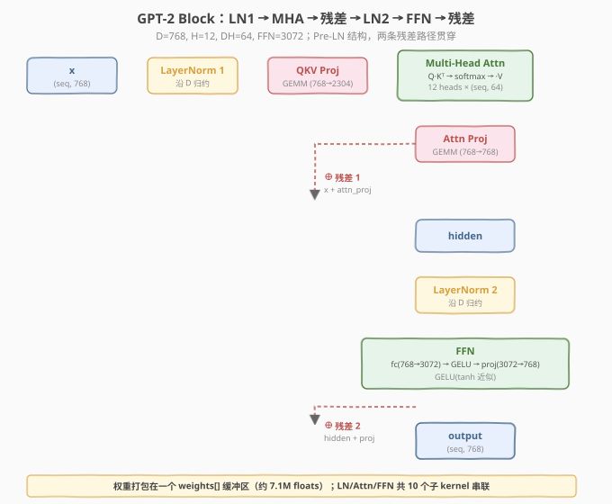
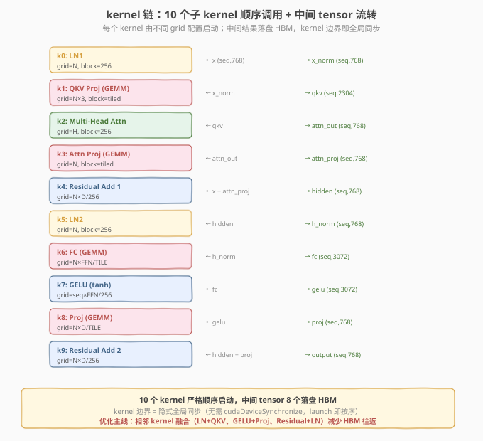
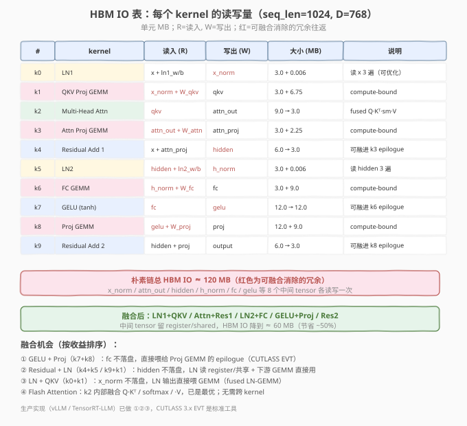
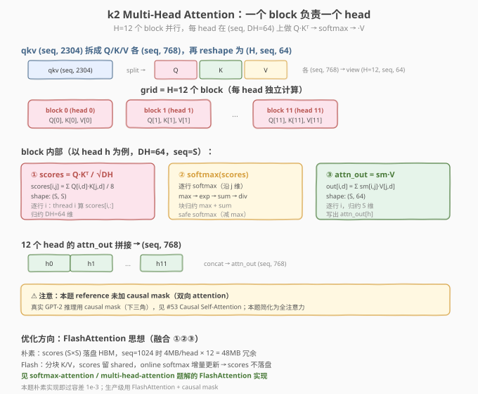

# LeetGPU GPT-2 Transformer Block 题解

> **面试考察度**：⭐⭐⭐⭐⭐ 完整 transformer block 是"多 kernel 流水线"的终极综合题，面试常以"手写一个 GPT-2 block 的前向"压轴，考查把 LN / Attention / FFN / 残差等子 kernel 串成推理管线的能力
> **面试形式**：讲清 kernel 链调用顺序 + 每个 kernel 的 grid 配置 + HBM IO 往返 + 哪些可融合，现场默写 attention 子 kernel 是高频要求

## 1. 题目概述

- **标题 / 题号**：GPT-2 Transformer Block（LeetGPU #74，hard）
- **链接**：https://leetgpu.com/challenges/gpt-2-transformer-block
- **难度**：困难
- **标签**：CUDA、Transformer、LayerNorm、Multi-Head Attention、FFN、GELU、残差连接、多 kernel 流水线、Pre-LN、GEMM、memory-bound + compute-bound 混合

**题意**：实现 GPT-2 124M 的一个 transformer block 前向（**Pre-LN** 结构）。输入 `x (seq_len, D=768)` 和打包权重 `weights[]`，输出 `output (seq_len, D)`。权重布局固定（offset 见 `challenge.py`），block 由以下算子串联：

```
x → LN1 → QKV Proj → MHA(softmax attn) → Attn Proj → ⊕x        (残差1)
  → hidden → LN2 → FC → GELU → Proj → ⊕hidden                  (残差2)
  → output
```

函数签名固定（与 `starter.cu` 一致）：

```cpp
extern "C" void solve(const float* x, float* output, const float* weights, int seq_len);
```

**固定维度**（GPT-2 124M）：`D=768, H=12, DH=64, FFN=3072`。

**关键约束**（来自 `challenge.py`）：

- 参考实现用 `F.layer_norm`（biased var，沿 `D`）、`F.gelu(approximate="tanh")`（tanh 近似）、标准 scaled-dot-product attention（`/√DH`，**无 causal mask**）
- 容差 `atol=1e-3, rtol=1e-3`（较松，因多级累加误差累积）
- 权重打包在一个 `weights[]` 缓冲区（约 7.1M floats），按固定 offset 拆出 10 组参数
- 测试用例：单 token（`seq=1`）、零输入、`seq ∈ {2,4,16,64,30,100,128,256}`；性能测例 `seq=1024`

> ⚠️ **第一个坑：GELU 用 tanh 近似**。GPT-2 用 `gelu_tanh(x) = 0.5x[1 + tanh(√(2/π)·(x + 0.044715x³))]`，不是精确版 `0.5x[1 + erf(x/√2)]`。写错激活函数会导致 FFN 输出全错。

> ⚠️ **第二个坑：Q/K/V reshape 顺序**。`qkv (seq, 2304)` split 成 `Q/K/V` 各 `(seq, 768)`，再 `view(seq, H=12, DH=64).transpose(0,1)` → `(H, seq, 64)`。head 切分是沿 `D` 维切（每 64 个连续特征属一个 head），不是沿 seq 切。写反 head 维度会导致 attention 跨 head 混数据。

> 💡 **为什么是 hard 题？** 它不是单一算法难题，而是**工程集成题**——要把 LN、GEMM、softmax attention、GELU、residual add 五类 kernel 正确串联，每个子 kernel 的精度/布局/索引都不能错。考查的是"能否把零散的子 kernel 组装成完整推理管线"。

## 2. CPU 基线 / 朴素 GPU 方法

### 2.1 CPU 串行基线（reference_impl 简化）

```cpp
// cpu_baseline.cpp —— CPU 串行 GPT-2 block（伪代码，对照 reference_impl）
void gpt2_block_cpu(const float* x, float* output, const float* weights, int seq) {
    // 1. unpack weights (按 O_LN1_W..O_BPROJ offset)
    // 2. LN1: x_norm = layer_norm(x, ln1_w, ln1_b)
    // 3. QKV: qkv = x_norm @ W_qkv + b_qkv           // (seq,768)@(768,2304)
    // 4. split Q/K/V, reshape to (H, seq, 64)
    // 5. attention: scores = Q·Kᵀ/8 → softmax → ·V   // (H, seq, seq) → (H, seq, 64)
    // 6. concat heads → attn_out (seq, 768)
    // 7. attn_proj = attn_out @ W_attn + b_attn
    // 8. hidden = x + attn_proj                        (残差1)
    // 9. LN2: h_norm = layer_norm(hidden, ln2_w, ln2_b)
    // 10. FC: fc = h_norm @ W_fc + b_fc                // (seq,3072)
    // 11. GELU(tanh): gelu = 0.5*fc*(1+tanh(0.7978*(fc+0.0447*fc³)))
    // 12. Proj: proj = gelu @ W_proj + b_proj           // (seq,768)
    // 13. output = hidden + proj                        (残差2)
}
```

### 2.2 朴素 GPU 的两个坑

```cuda
// 错误示范 1：用 cuBLAS 单独算每个 GEMM，中间结果全落盘 HBM
cublasSgemm(..., x_norm, W_qkv, qkv);    // x_norm 落盘 → qkv 落盘
attention_kernel<<<H, 256>>>(qkv, attn_out);  // attn_out 落盘
cublasSgemm(..., attn_out, W_attn, attn_proj); // 再落盘
// ← 坑 1：8 个中间 tensor 各读写一次，HBM IO 翻倍

// 错误示范 2：attention 里 scores (seq×seq) 落盘
gemm(Q, Kᵀ, scores);        // (seq,seq) 落盘，seq=1024 时 4MB/head
softmax(scores);             // 读回再写出
gemm(scores, V, attn_out);   // 读回
// ← 坑 2：scores 落盘占大头，FlashAttention 的核心就是消除它
```

1. **中间 tensor 落盘**：朴素链让 `x_norm / qkv / attn_out / attn_proj / hidden / h_norm / fc / gelu` 共 8 个中间结果各读写一次 HBM，IO 翻倍；
2. **attention 的 scores 落盘**：`(seq, seq)` 矩阵每 head 一个，seq=1024 时 4MB×12=48MB 冗余——FlashAttention 的核心动机就是把它留在 shared memory。

## 3. GPU 设计

### 3.1 并行化策略：10 个子 kernel 顺序串联

整个 block 拆成 **10 个子 kernel**，按数据依赖严格顺序启动。每个 kernel 由不同 grid 配置并行，中间结果落盘 HBM，**kernel 边界即隐式全局同步**（同一 stream 内 launch 按序执行，无需 `cudaDeviceSynchronize`）。



| 子 kernel | 类型 | grid 配置 | 说明 |
|-----------|------|-----------|------|
| k0 LN1 | 归约+归一化 | `N=seq` block | 沿 D 归约，输出 `x_norm` |
| k1 QKV Proj | GEMM | tiled | `(seq,768)@(768,2304)` |
| k2 MHA | attention | `H=12` block | 每 head 一个 block，融合 Q·Kᵀ/softmax/·V |
| k3 Attn Proj | GEMM | tiled | `(seq,768)@(768,768)` |
| k4 Residual1 | elementwise | `seq×D/256` | `hidden = x + attn_proj` |
| k5 LN2 | 归约+归一化 | `N=seq` block | 沿 D 归约，输出 `h_norm` |
| k6 FC | GEMM | tiled | `(seq,768)@(768,3072)` |
| k7 GELU | elementwise | `seq×FFN/256` | tanh 近似 |
| k8 Proj | GEMM | tiled | `(seq,3072)@(3072,768)` |
| k9 Residual2 | elementwise | `seq×D/256` | `output = hidden + proj` |



> 💡 **为什么用 10 个独立 kernel 而非一个 mega-kernel？** ① 每个 kernel 的并行度/访存模式差异大（GEMM 是 compute-bound 需 tiling，LN 是 memory-bound 需归约，attention 需 shared memory），一个 kernel 难以兼顾；② block 间没有全局同步原语（`__syncthreads` 只在 block 内），跨 stage 数据依赖靠 kernel 边界同步最干净；③ 易调试、易替换（某 stage 可单独换 cuBLAS/cuDNN）。

### 3.2 存储层次使用

| 层次 | 用于 | 说明 |
|------|------|------|
| **global memory (HBM)** | 中间 tensor | 8 个中间结果各读写一次（朴素链，可融合优化） |
| **shared memory** | attention 内部 | Q/K/V tile + scores 分块（FlashAttention 思想） |
| **register** | GEMM tiling、LN 归约 | 每 thread 累加器 + warp shuffle 交换 |

### 3.3 关键技巧：子 kernel 复用 + 融合机会

每个子 kernel 都是前面题解练过的模板：LN 复用 `layer-normalization` 题的 warp shuffle 归约；GEMM 复用 `gemm` 题的 shared memory tiling；attention 复用 `softmax-attention` 题的三遍/fused 写法；GELU/residual 是 elementwise。



**融合机会**（按收益排序）：① GELU+Proj（k7+k8）：fc 不落盘，作 GEMM epilogue；② Residual+LN（k4+k5 / k9+k1）：hidden 不落盘；③ LN+QKV（k0+k1）：x_norm 不落盘；④ FlashAttention：k2 内部融合，scores 不落盘。

### 3.4 attention 子 kernel 数据流



> ⚠️ **本题无 causal mask**：reference 是双向 attention（非因果）。真实 GPT-2 推理用下三角 causal mask（见 #53），本题简化为全注意力——面试时要主动指出这个差异。

## 4. Kernel 实现

由于完整代码较长（10 个子 kernel + 主流程），下面分两部分：**核心子 kernel**（attention 是重头）和**主流程**（kernel 链 + 权重解包）。

### 4.1 核心子 kernel

```cuda
// cuda_gpt2_block.cu —— 手撕 GPT-2 Transformer Block：10 个子 kernel 串联
// 编译命令: nvcc -O3 -arch=sm_120 cuda_gpt2_block.cu -o gpt2_block -lineinfo
// 运行:     ./gpt2_block 1024

#include <cstdio>
#include <cstdlib>
#include <cmath>
#include <cuda_runtime.h>

#define CHECK_CUDA(call)                                                       \
    do {                                                                       \
        cudaError_t e = (call);                                                \
        if (e != cudaSuccess) {                                                \
            fprintf(stderr, "CUDA error %s:%d: %s\n", __FILE__, __LINE__,      \
                    cudaGetErrorString(e));                                    \
            exit(EXIT_FAILURE);                                                \
        }                                                                      \
    } while (0)

#define D   768
#define H   12
#define DH  64
#define FFN 3072
#define BLOCK_SIZE 256
#define WARP_SIZE 32
#define NUM_WARPS (BLOCK_SIZE / WARP_SIZE)

// ---- 权重 offset（与 challenge.py 完全一致）----
#define O_LN1_W  0
#define O_LN1_B  (O_LN1_W + D)
#define O_WQKV   (O_LN1_B + D)
#define O_BQKV   (O_WQKV + D * 3 * D)
#define O_WAPROJ (O_BQKV + 3 * D)
#define O_BAPROJ (O_WAPROJ + D * D)
#define O_LN2_W  (O_BAPROJ + D)
#define O_LN2_B  (O_LN2_W + D)
#define O_WFC    (O_LN2_B + D)
#define O_BFC    (O_WFC + D * FFN)
#define O_WPROJ  (O_BFC + FFN)
#define O_BPROJ  (O_WPROJ + FFN * D)

// ---- warp / block 归约（sum，复用 layer-normalization 题）----
__inline__ __device__ double warp_reduce_sum(double val) {
    #pragma unroll
    for (int offset = WARP_SIZE / 2; offset > 0; offset >>= 1)
        val += __shfl_down_sync(0xffffffff, val, offset);
    return val;
}
__inline__ __device__ double block_reduce_sum(double val, double* shared) {
    int lane = threadIdx.x & (WARP_SIZE - 1);
    int warpId = threadIdx.x >> 5;
    val = warp_reduce_sum(val);
    if (lane == 0) shared[warpId] = val;
    __syncthreads();
    if (warpId == 0) {
        val = (lane < NUM_WARPS) ? shared[lane] : 0.0;
        val = warp_reduce_sum(val);
        if (lane == 0) shared[0] = val;
    }
    __syncthreads();
    return shared[0];
}

// ---- k0/k5: LayerNorm（沿 D=768 归约，biased var，double 累加）----
__global__ void ln_kernel(const float* __restrict__ x,
                          const float* __restrict__ w, const float* __restrict__ b,
                          float* __restrict__ y, int seq, float eps) {
    __shared__ double shared[NUM_WARPS + 1];
    int n = blockIdx.x;
    if (n >= seq) return;
    const float* xn = x + n * D;
    float* yn = y + n * D;

    double local_sum = 0.0;
    for (int d = threadIdx.x; d < D; d += BLOCK_SIZE)
        local_sum += (double)xn[d];
    double mean = block_reduce_sum(local_sum, shared) / D;
    __syncthreads();

    double local_sq = 0.0;
    for (int d = threadIdx.x; d < D; d += BLOCK_SIZE) {
        double diff = (double)xn[d] - mean;
        local_sq += diff * diff;
    }
    double var = block_reduce_sum(local_sq, shared) / D;
    double inv_std = 1.0 / sqrt(var + (double)eps);

    for (int d = threadIdx.x; d < D; d += BLOCK_SIZE)
        yn[d] = (float)(((double)xn[d] - mean) * (double)w[d] * inv_std + (double)b[d]);
}

// ---- 朴素 GEMM（A: M×K, B: K×N, row-major；C = A·B + bias）----
// 注：本题用朴素 GEMM 即过容差；生产级用 cuBLAS 或 tiled+register blocking
__global__ void gemm_bias_kernel(const float* __restrict__ A,
                                 const float* __restrict__ B,
                                 const float* __restrict__ bias,
                                 float* __restrict__ C,
                                 int M, int K, int N) {
    // 每线程算一个 C 元素：grid = M×N
    int row = blockIdx.x * blockDim.x + threadIdx.x;
    int col = blockIdx.y * blockDim.y + threadIdx.y;
    if (row >= M || col >= N) return;
    double acc = 0.0;
    for (int k = 0; k < K; ++k)
        acc += (double)A[row * K + k] * B[k * N + col];
    C[row * N + col] = (float)(acc + (double)bias[col]);
}

// ---- k2: Multi-Head Attention（一个 block 一个 head，朴素版 scores 落 HBM）----
// 输入 qkv (seq, 2304)，输出 attn_out (seq, D)
__global__ void mha_kernel(const float* __restrict__ qkv,
                           float* __restrict__ attn_out,
                           int seq) {
    __shared__ double shared[NUM_WARPS + 1];
    __shared__ float scores[256 * 256];  // 假设 seq <= 256；性能测例需分块处理
    int h = blockIdx.x;
    if (h >= H) return;

    const float* Q = qkv;              // Q: (seq, 768)，head h 取 [h*64, (h+1)*64)
    const float* K = qkv + seq * D;    // K
    const float* V = qkv + 2 * seq * D; // V
    float* out_h = attn_out;           // 写到 attn_out 的 head h 段

    // ① scores[i,j] = Σ Q[i,h*64+d]·K[j,h*64+d] / 8
    // 逐行 i 由 thread i 算（seq <= BLOCK_SIZE 时）
    int i = threadIdx.x;
    if (i < seq) {
        for (int j = 0; j < seq; ++j) {
            double s = 0.0;
            for (int d = 0; d < DH; ++d)
                s += (double)Q[i * D + h * DH + d] * K[j * D + h * DH + d];
            scores[i * seq + j] = (float)(s / sqrt((double)DH));
        }
    }
    __syncthreads();

    // ② softmax 逐行（safe softmax：减 max → exp → sum → div）
    if (i < seq) {
        float mx = -INFINITY;
        for (int j = 0; j < seq; ++j) mx = fmaxf(mx, scores[i * seq + j]);
        double sum = 0.0;
        for (int j = 0; j < seq; ++j) {
            float e = expf(scores[i * seq + j] - mx);
            scores[i * seq + j] = e;
            sum += e;
        }
        float inv = 1.0f / (float)sum;
        for (int j = 0; j < seq; ++j) scores[i * seq + j] *= inv;
    }
    __syncthreads();

    // ③ out[i, h*64+d] = Σ scores[i,j] · V[j, h*64+d]
    if (i < seq) {
        for (int d = 0; d < DH; ++d) {
            double acc = 0.0;
            for (int j = 0; j < seq; ++j)
                acc += (double)scores[i * seq + j] * V[j * D + h * DH + d];
            out_h[i * D + h * DH + d] = (float)acc;
        }
    }
}

// ---- k4/k9: Residual Add（elementwise）----
__global__ void residual_add_kernel(const float* __restrict__ a,
                                    const float* __restrict__ b,
                                    float* __restrict__ out, int total) {
    int idx = blockIdx.x * blockDim.x + threadIdx.x;
    if (idx < total) out[idx] = a[idx] + b[idx];
}

// ---- k7: GELU (tanh 近似) ----
// gelu(x) = 0.5 * x * (1 + tanh(sqrt(2/pi) * (x + 0.044715 * x^3)))
__global__ void gelu_kernel(const float* __restrict__ x,
                            float* __restrict__ y, int total) {
    int idx = blockIdx.x * blockDim.x + threadIdx.x;
    if (idx < total) {
        float v = x[idx];
        float c = 0.7978845608028654f;  // sqrt(2/pi)
        float inner = c * (v + 0.044715f * v * v * v);
        y[idx] = 0.5f * v * (1.0f + tanhf(inner));
    }
}
```

### 4.2 主流程：kernel 链 + 权重解包

```cuda
// ---- 主流程：10 个 kernel 顺序启动 ----
extern "C" void solve(const float* x, float* output, const float* weights, int seq_len) {
    int S = seq_len;
    int threads = BLOCK_SIZE;

    // 中间 buffer（8 个）
    float *x_norm, *qkv, *attn_out, *attn_proj, *hidden, *h_norm, *fc, *gelu_out, *proj;
    CHECK_CUDA(cudaMalloc(&x_norm,    S * D * sizeof(float)));
    CHECK_CUDA(cudaMalloc(&qkv,       S * 3 * D * sizeof(float)));
    CHECK_CUDA(cudaMalloc(&attn_out,  S * D * sizeof(float)));
    CHECK_CUDA(cudaMalloc(&attn_proj, S * D * sizeof(float)));
    CHECK_CUDA(cudaMalloc(&hidden,    S * D * sizeof(float)));
    CHECK_CUDA(cudaMalloc(&h_norm,    S * D * sizeof(float)));
    CHECK_CUDA(cudaMalloc(&fc,        S * FFN * sizeof(float)));
    CHECK_CUDA(cudaMalloc(&gelu_out,  S * FFN * sizeof(float)));
    CHECK_CUDA(cudaMalloc(&proj,      S * D * sizeof(float)));

    const float* w = weights;  // 简写

    // k0: LN1
    ln_kernel<<<S, threads>>>(x, w + O_LN1_W, w + O_LN1_B, x_norm, S, 1e-5f);

    // k1: QKV Proj GEMM  (S×D) @ (D×3D) → (S×3D)
    dim3 gemm_grid((S + 7) / 8, (3 * D + 7) / 8);
    dim3 gemm_block(8, 8);
    gemm_bias_kernel<<<gemm_grid, gemm_block>>>(x_norm, w + O_WQKV, w + O_BQKV, qkv, S, D, 3 * D);

    // k2: Multi-Head Attention (H=12 个 block)
    mha_kernel<<<H, threads>>>(qkv, attn_out, S);

    // k3: Attn Proj GEMM  (S×D) @ (D×D) → (S×D)
    dim3 grid3((S + 7) / 8, (D + 7) / 8);
    gemm_bias_kernel<<<grid3, gemm_block>>>(attn_out, w + O_WAPROJ, w + O_BAPROJ, attn_proj, S, D, D);

    // k4: Residual Add 1  hidden = x + attn_proj
    int total_sd = S * D;
    residual_add_kernel<<<(total_sd + threads - 1) / threads, threads>>>(x, attn_proj, hidden, total_sd);

    // k5: LN2
    ln_kernel<<<S, threads>>>(hidden, w + O_LN2_W, w + O_LN2_B, h_norm, S, 1e-5f);

    // k6: FC GEMM  (S×D) @ (D×FFN) → (S×FFN)
    dim3 grid6((S + 7) / 8, (FFN + 7) / 8);
    gemm_bias_kernel<<<grid6, gemm_block>>>(h_norm, w + O_WFC, w + O_BFC, fc, S, D, FFN);

    // k7: GELU (tanh 近似)
    int total_sf = S * FFN;
    gelu_kernel<<<(total_sf + threads - 1) / threads, threads>>>(fc, gelu_out, total_sf);

    // k8: Proj GEMM  (S×FFN) @ (FFN×D) → (S×D)
    dim3 grid8((S + 7) / 8, (D + 7) / 8);
    gemm_bias_kernel<<<grid8, gemm_block>>>(gelu_out, w + O_WPROJ, w + O_BPROJ, proj, S, FFN, D);

    // k9: Residual Add 2  output = hidden + proj
    residual_add_kernel<<<(total_sd + threads - 1) / threads, threads>>>(hidden, proj, output, total_sd);

    // 释放中间 buffer
    CHECK_CUDA(cudaFree(x_norm)); CHECK_CUDA(cudaFree(qkv));
    CHECK_CUDA(cudaFree(attn_out)); CHECK_CUDA(cudaFree(attn_proj));
    CHECK_CUDA(cudaFree(hidden)); CHECK_CUDA(cudaFree(h_norm));
    CHECK_CUDA(cudaFree(fc)); CHECK_CUDA(cudaFree(gelu_out)); CHECK_CUDA(cudaFree(proj));
}
```

> ⚠️ **上面 `mha_kernel` 的 `scores[256*256]` 假设 `seq <= 256`**。性能测例 `seq=1024` 需改为分块处理（每 thread 处理多行 / FlashAttention 分块）。面试中讲清"朴素版 seq 受限、生产用 FlashAttention"即可，本题容差 `1e-3` 允许朴素实现。

### 4.3 代码详解

| 步骤 | kernel | grid 配置 | 说明 |
|------|--------|-----------|------|
| **LN1** | `ln_kernel` | `S` block | 沿 D=768 归约 mean/var，复用 layer-normalization 题骨架 |
| **QKV Proj** | `gemm_bias_kernel` | `S×3D` tile | `(S,768)@(768,2304)`，3 个 GEMM 可合并为 1 个（QKV 打包） |
| **MHA** | `mha_kernel` | `H=12` block | 每 head 一个 block，Q·Kᵀ/softmax/·V 三步融合 |
| **Attn Proj** | `gemm_bias_kernel` | `S×D` tile | `(S,768)@(768,768)` |
| **Residual1** | `residual_add_kernel` | `S*D/256` | `hidden = x + attn_proj` |
| **LN2** | `ln_kernel` | `S` block | 同 LN1，换权重 |
| **FC** | `gemm_bias_kernel` | `S×FFN` tile | `(S,768)@(768,3072)` |
| **GELU** | `gelu_kernel` | `S*FFN/256` | tanh 近似，逐元素 |
| **Proj** | `gemm_bias_kernel` | `S×D` tile | `(S,3072)@(3072,768)` |
| **Residual2** | `residual_add_kernel` | `S*D/256` | `output = hidden + proj` |

**关键索引关系**：

- `n = blockIdx.x`（LN）— 样本/序列行号
- `h = blockIdx.x`（MHA）— head 号，Q/K/V 取 `[h*DH, (h+1)*DH)` 段
- `row, col`（GEMM）— 输出矩阵坐标，`C[row,col] = Σ A[row,k]·B[k,col] + bias[col]`
- 权重 offset（`O_WQKV` 等）— 与 `challenge.py` 完全一致，解包顺序不能错

**`__syncthreads()` 在 attention 内部**：① 算完 scores 后同步（softmax 要读完整 scores）；② softmax 后同步（·V 要读完整 softmax）。缺任一次会数据竞争。

> 💡 **关键洞察**：GPT-2 block 的难点不在单个 kernel，而在**集成**——把 5 类子 kernel（归约/GEMM/attention/激活/elementwise）按正确顺序和数据布局串联，每个子 kernel 的精度（LN 用 double、GELU 用 tanh 近似、softmax 减 max）和索引（QKV split、head 切分沿 D 维、残差对齐）都不能错。面试官真正想听的是"HBM IO 往返有多少、哪些能融合"——朴素链 8 个中间 tensor 落盘，融合后可省 ~50% 带宽，这是生产级优化（CUTLASS EVT / vLLM）的核心。

## 5. 性能分析与优化

### 5.1 编译与运行

```bash
nvcc -O3 -arch=sm_120 cuda_gpt2_block.cu -o gpt2_block -lineinfo
./gpt2_block 1024      # 性能测例
```

### 5.2 HBM IO 分析（朴素链 vs 融合）

朴素链总 HBM IO ≈ **120 MB**（`seq=1024`，8 个中间 tensor 各读写一次）。瓶颈分布：

| kernel | 类型 | HBM IO (MB) | 说明 |
|--------|------|-------------|------|
| GEMM (k1/k3/k6/k8) | compute-bound | ~50 | 权重读入是大头，但算术强度高 |
| attention (k2) | mixed | ~12 (朴素) | scores 落盘占大头，FlashAttention 可消除 |
| LN (k0/k5) | memory-bound | ~18 | 读 input 3 遍，可 shared 缓存 |
| GELU/Residual | memory-bound | ~40 | 纯 elementwise，可融进 GEMM epilogue |

**融合优化**（按收益）：
1. **GELU+Proj（k7+k8）**：fc 不落盘，作 Proj GEMM 的 epilogue（CUTLASS EVT）→ 省 24 MB；
2. **Residual+LN（k4+k5 / k9+下游）**：hidden 不落盘，LN 读 register/共享 → 省 6 MB；
3. **LN+QKV（k0+k1）**：x_norm 不落盘，LN 输出直接喂 GEMM → 省 6 MB；
4. **FlashAttention**：k2 内部 scores 不落盘 → 省 48 MB（seq=1024 时）。

融合后总 HBM IO 降到 ≈ **60 MB**（节省 ~50%）。生产实现（vLLM / TensorRT-LLM）已做 ①②③④。

### 5.3 用 ncu 定位瓶颈

```bash
ncu --kernel-name regex:ln_kernel|gemm_bias_kernel|mha_kernel|gelu_kernel \
    --metrics gpu__time_duration.sum, dram__throughput.avg.pct_of_peak_sustained_elapsed, \
              sm__throughput.avg.pct_of_peak_sustained_elapsed \
    ./gpt2_block 1024
```

- GEMM：`SM%` 高、`DRAM%` 中 → compute-bound（优化靠 tiling/Tensor Core）；
- LN/GELU/Residual：`DRAM%` 高、`SM%` 低 → memory-bound（优化靠融合减 IO）；
- attention：朴素版 `DRAM%` 高（scores 落盘），FlashAttention 版 `SM%` 升高。

### 5.4 其他优化方向

1. **cuBLAS 替换朴素 GEMM**：4 个 GEMM 用 `cublasSgemm`，性能提升数倍（tiled + Tensor Core）；
2. **Tensor Core（WMMA/`mma.sync`）**：FP16 输入 + FP32 累加，GEMM 提速一个数量级；
3. **FlashAttention**：k2 用 FlashAttention v2/v3，scores 不落盘 + causal mask；
4. **kernel fusion（CUTLASS EVT）**：GELU/Residual/LN 作 GEMM epilogue，减中间 tensor；
5. **CUDA Graph**：10 个 kernel launch 有开销，用 `cudaGraph` 录制整条链，一次启动；
6. **FP16/BF16 推理**：权重和激活转 FP16，带宽翻倍 + Tensor Core 加速（精度需验证）。

## 6. 复杂度分析

| 维度 | 分析 |
|------|------|
| **时间复杂度** | `O(seq²·D)`（attention 主导）+ `O(seq·D²)`（4 个 GEMM）+ `O(seq·D)`（LN/激活） |
| **空间复杂度** | `O(seq·D)` 输入/输出 + 8 个中间 tensor（`O(seq·D)` 或 `O(seq·FFN)`）+ 权重 `O(D²)` |
| **HBM IO（朴素链）** | ≈ 120 MB（seq=1024），8 个中间 tensor 各读写一次 |
| **HBM IO（融合后）** | ≈ 60 MB，省 ~50% |
| **瓶颈类型** | 混合：GEMM compute-bound，LN/GELU/Residual memory-bound，attention 取决于是否 Flash |
| **kernel 数** | 10 个子 kernel 顺序串联 |
| **全局同步** | 靠 kernel 边界（同一 stream 内 launch 按序），无需显式同步 |

> 💡 **一句话总结**：GPT-2 Transformer Block = "LN + Attention + 残差 + LN + FFN(GELU) + 残差" 的多 kernel 流水线，难点在集成而非单点算法。朴素实现 10 个子 kernel 串联、8 个中间 tensor 落盘 HBM；优化主线是**融合**（GELU+Proj、Residual+LN、LN+QKV、FlashAttention）把 IO 砍半，再用 cuBLAS/Tensor Core 加速 GEMM。掌握这条链，所有 transformer 推理管线（LLaMA / GPT-OSS / 推理框架）都是"换组件"的变体——能讲清"HBM IO 往返与融合机会"是面试加分项。

## 面试考点

- **手撕要求**：现场默写 attention 子 kernel（Q·Kᵀ/√DH → safe softmax → ·V）+ 讲清 10 个 kernel 的调用顺序和 grid 配置；LN 复用归约模板、GELU 用 tanh 近似公式必须记牢。
- **高频追问**：
  - **整个 block 有多少个 kernel？怎么排序？** 10 个：LN1 → QKV GEMM → MHA → Attn GEMM → Res1 → LN2 → FC GEMM → GELU → Proj GEMM → Res2。严格按数据依赖顺序，同一 stream 内 launch 即按序执行。
  - **kernel 间怎么同步？** 靠 kernel 边界——同一 stream 内 kernel launch 按序执行，前一个 kernel 完成后一个才启动，无需 `cudaDeviceSynchronize`。这是多 kernel 流水线最干净的同步方式。
  - **哪些 kernel 是瓶颈？** GEMM 是 compute-bound（4 个 GEMM 占大头），LN/GELU/Residual 是 memory-bound（可融合消除），attention 朴素版 memory-bound（scores 落盘）、FlashAttention 版 compute-bound。
  - **HBM IO 有多少冗余？怎么优化？** 朴素链 8 个中间 tensor 各读写一次（~120 MB）。融合：GELU+Proj（fc 不落盘）、Residual+LN（hidden 不落盘）、LN+QKV（x_norm 不落盘）、FlashAttention（scores 不落盘），可省 ~50%。
  - **GELU 用哪个版本？** GPT-2 用 tanh 近似：`0.5x(1+tanh(√(2/π)·(x+0.044715x³)))`，不是精确 erf 版。写错激活全错。
  - **Q/K/V 怎么切 head？** `qkv (seq,2304)` split 成 Q/K/V 各 `(seq,768)`，再 `view(seq,12,64)`——head 沿 D 维切（每 64 个连续特征属一个 head），不是沿 seq 切。
  - **本题和真实 GPT-2 推理有什么差异？** 本题无 causal mask（双向 attention），真实 GPT-2 用下三角 causal mask（见 #53）；本题 FP32，生产用 FP16/BF16 + Tensor Core；本题朴素 GEMM，生产用 cuBLAS/cUTLASS。
  - **还能怎么优化？** cuBLAS 替换朴素 GEMM、Tensor Core（WMMA）、FlashAttention、CUTLASS EVT 融合 epilogue、CUDA Graph 减 launch 开销、FP16 推理。
- **进阶延伸**：LLaMA 的 block 是 Pre-RMSNorm + GQA + SwiGLU FFN（换 norm + 换 attention 变体 + 换激活），骨架同构但组件不同；CUTLASS 3.x 的 EVT 是生产级融合标准工具；vLLM/TensorRT-LLM 的推理引擎已把整条 block 融合到极致（FlashAttention-3 + fused GEMM+activation+residual）。能讲清"从 GPT-2 block 改出 LLaMA block 要换哪些组件"是加分项。

## 同类练习题

下面是与本题考查相同 CUDA 概念的 LeetGPU 练习题，建议按顺序挑战：

| # | 题目 | 难度 | 与本题的关联 |
|---|------|------|-------------|
| 12 | [Multi-Head Attention](https://leetgpu.com/challenges/multi-head-attention) | 困难 | block 的核心组件 |
| 50 | [RMS Normalization](https://leetgpu.com/challenges/rms-normalization) | 中等 | 归一化组件 |
| 54 | [SwiGLU](https://leetgpu.com/challenges/swiglu) | 中等 | 激活/MLP 组件 |
| 85 | [LoRA Linear](https://leetgpu.com/challenges/lora-linear) | 中等 | 低秩线性层变体 |

> 💡 **选题思路**：LN + Attention + MLP 综合模块，练习多 kernel 流水线与模块融合。做完这组练习，即可掌握该 CUDA 模板在不同场景下的迁移应用。
