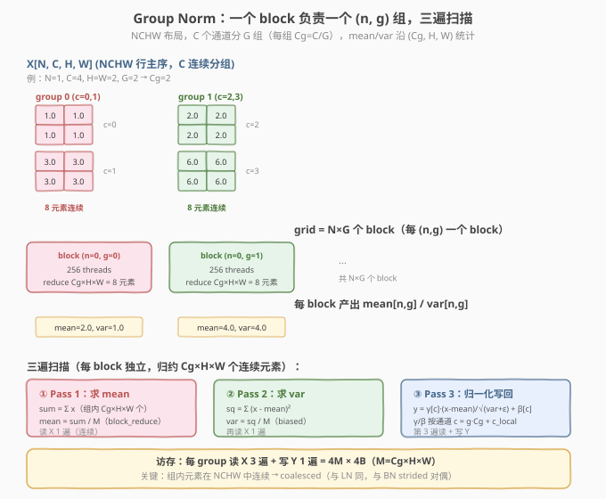
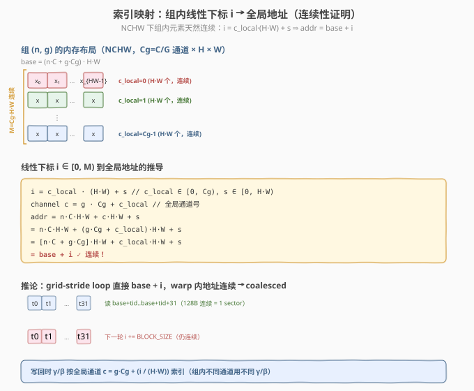
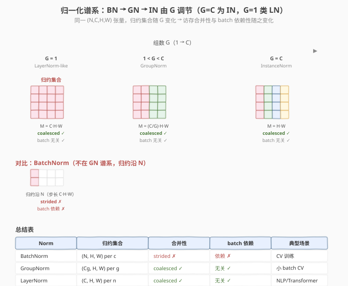

# LeetGPU Group Normalization 题解

> **面试考察度**：⭐⭐⭐⭐ GroupNorm 是"norm 家族归约轴谱系"的关键一环——它用参数 `G` 把 BN（沿 N）和 InstanceNorm（沿单通道）连接起来，面试常以"GN 和 BN/LN 的归约集合有什么区别、为什么 GN 不依赖 batch"追问
> **面试形式**：手写 per-group 归约 kernel + 讲清"NCHW 下组内元素天然连续 → coalesced"这一关键洞察

## 1. 题目概述

- **标题 / 题号**：Group Normalization（LeetGPU #105，medium）
- **链接**：https://leetgpu.com/challenges/group-normalization
- **难度**：中等
- **标签**：CUDA、Group Norm、mean/var 归约、warp shuffle、统计归一化、coalesced 访存、NCHW 布局、memory-bound

**题意**：给定 `(N, C, H, W)` 行主序 `float32` 输入 `X`、per-channel 仿射参数 `gamma[C]` / `beta[C]`，将 `C` 个通道分成 `G` 组（每组 `Cg = C/G` 个通道，`C % G == 0`），对**每个 `(n, g)` 组独立**沿 `(Cg, H, W)` 求统计量并归一化：

$$\text{mean}_{n,g} = \frac{1}{M}\sum_{c \in \text{group }g}\sum_{h,w} X_{n,c,h,w}, \qquad M = C_g \cdot H \cdot W$$

$$\text{var}_{n,g} = \frac{1}{M}\sum_{c \in \text{group }g}\sum_{h,w}(X_{n,c,h,w} - \text{mean}_{n,g})^2$$

$$Y_{n,c,h,w} = \gamma_c \cdot \frac{X_{n,c,h,w} - \text{mean}_{n,g}}{\sqrt{\text{var}_{n,g} + \varepsilon}} + \beta_c, \qquad g = \lfloor c / C_g \rfloor$$

函数签名固定（与 `starter.cu` 一致）：

```cpp
extern "C" void solve(const float* X, const float* gamma, const float* beta, float* Y,
                      int N, int C, int H, int W, int G, float eps);
```

**关键约束**（来自 `challenge.py`）：

- 参考实现直接调用 `F.group_norm(X, G, gamma, beta, eps=eps)`，内部用 **biased 方差**（除以 `M` 而非 `M-1`）
- 容差 `atol=1e-4, rtol=1e-4`（比 BN/LN 的 `1e-5` 松，因 `M` 大时累加误差略大）
- `C % G == 0` 保证分组整齐
- 测试用例覆盖：基本样例（`N=1,C=4,H=W=2,G=2`）、`G=1`（LayerNorm-like，归约 `(C,H,W)`）、`G=C`（InstanceNorm-like，每通道一组）、全零、负数、非 2 幂（`C=12,G=4`）、中等规模（`C=32,H=W=16,G=8`）、大现实（`C=64,H=W=32,G=16`）、非方形空间（`H≠W`）；性能测例 `N=8, C=512, H=W=64, G=32`（`M=16·64·64=65536`）

> ⚠️ **第一个坑：分组到通道的映射**。组 `g` 包含通道 `[g·Cg, (g+1)·Cg)`，即 `c = g·Cg + c_local`。写反成 `c = c_local·G + g` 会导致统计量跨组污染、全样例 FAIL。

> 💡 **为什么 GN 是面试高频？** GN 用一个参数 `G` 把整个 norm 谱系串起来：`G=1` 退化为 LayerNorm-like（归约整个特征图），`G=C` 退化为 InstanceNorm（每通道独立），`1<G<C` 是折中。它既不依赖 batch（像 LN/IN），又比 LN 保留更多通道间结构（按组归约）。会写 GN 就掌握了"按任意子集归约"的通用骨架。

**示例**（`N=1, C=4, H=W=2, G=2`，`X` 通道 0/1 全 1/3、通道 2/3 全 2/6）：

```text
group 0 (c=0,1): values=[1,1,1,1, 3,3,3,3]  mean=2.0  var=((1-2)²×4+(3-2)²×4)/8 = 1.0  std=1.0
                 y[c=0] = (1-2)/1 = -1.0,  y[c=1] = (3-2)/1 = 1.0
group 1 (c=2,3): values=[2,2,2,2, 6,6,6,6]  mean=4.0  var=((2-4)²×4+(6-4)²×4)/8 = 4.0  std=2.0
                 y[c=2] = (2-4)/2 = -1.0,  y[c=3] = (6-4)/2 = 1.0
```

## 2. CPU 基线 / 朴素 GPU 方法

### 2.1 CPU 串行基线

```cpp
// cpu_baseline.cpp —— CPU 串行 GN，每组两遍扫描
void gn_cpu(const float* X, const float* gamma, const float* beta,
            float* Y, int N, int C, int H, int W, int G, float eps) {
    int Cg = C / G;                  // 每组通道数
    int HW = H * W;
    int M = Cg * HW;                 // 每组元素数
    for (int n = 0; n < N; ++n) {
        for (int g = 0; g < G; ++g) {
            int base = (n * C + g * Cg) * HW;     // 组起始地址（连续！）
            double sum = 0.0;                      // ① 求 mean
            for (int i = 0; i < M; ++i) sum += X[base + i];
            double mean = sum / M;
            double sq = 0.0;                       // ② 求 var（biased）
            for (int i = 0; i < M; ++i) {
                double d = (double)X[base + i] - mean;
                sq += d * d;
            }
            double var = sq / M;                   // ← 除以 M，不是 M-1
            double inv_std = 1.0 / sqrt(var + eps);
            for (int i = 0; i < M; ++i) {          // ③ 归一化写回
                int c_local = i / HW;
                int c = g * Cg + c_local;          // 全局通道号 → γ/β 索引
                Y[base + i] = (float)(((double)X[base + i] - mean) * gamma[c] * inv_std + beta[c]);
            }
        }
    }
}
```

注意 `base = (n*C + g*Cg)*HW` 后 `X[base + i]` 连续——这正是 GN 在 NCHW 下天然 coalesced 的根源（详见 §3.3）。

### 2.2 朴素 GPU 的两个坑

```cuda
// 错误示范 1：用 unbiased 方差（除以 M-1）
double var = sq / (M - 1);            // ← 坑 1：参考用 biased，M=1 时除零 → NaN

// 错误示范 2：每 thread 独立扫整组求 mean/var
__global__ void gn_naive(const float* X, float* Y, int N, int C, int H, int W, int G, float eps) {
    int idx = blockIdx.x, tid = threadIdx.x;
    int M = (C / G) * H * W;
    if (tid >= M) return;
    float sum = 0.0f;
    for (int i = 0; i < M; ++i) sum += X[base + i];  // ← 坑 2：每 thread 重扫整组，O(M²) 访存
    ...
}
```

1. **方差分母**：参考是 `unbiased=False`（biased，除 `M`），写成 `M-1` 全错；
2. **重复读**：每个 thread 独立求 `mean`/`var`，一组被读 `M` 次，`O(M²)` 访存——正确做法是**块内协作归约一次、广播复用**。

## 3. GPU 设计

### 3.1 并行化策略：一个 block 负责一个 (n, g) 组

**核心映射**：`blockIdx.x → 组编号 ng = n*G + g`，grid = `N*G` 个 block，block 内 256 个 thread 协作处理该组的 `M = Cg*H*W` 个元素。每个 block 执行**三遍扫描**，前两遍各做一次块归约：

| Pass | 扫描内容 | 块归约 | 产出 |
|------|----------|--------|------|
| ① mean | 扫组求 `Σ x` | `block_reduce_sum` | `mean_ng`（广播给全 block） |
| ② var | 扫组算 `Σ (x - mean)²` | `block_reduce_sum` | `var_ng`（广播） |
| ③ normalize | 再扫组写 `y = γ[c]·(x-mean)/√(var+ε) + β[c]` | 无 | 输出 |



> 💡 **为什么按 (n,g) 分 block？** 组间天然独立、无依赖，正好映射到 block 维；组内的 `mean`/`var` 是沿 `(Cg, H, W)` 的归约，正好用 block 内线程协作 + warp shuffle 解决。这个"组间 block 并行、组内块归约"的映射与 BN/LN **结构同构**——只是归约集合从"沿 N"或"沿 D"换成"沿 (Cg, H, W)"。

### 3.2 存储层次使用

| 层次 | 是否使用 | 说明 |
|------|----------|------|
| **global memory** | ✓ | `X` 读 3 遍（mean / var / normalize）、`Y` 写 1 遍；`gamma`/`beta` 各读 `Cg` 个数（按通道） |
| **shared memory** | ✓ | warp 间归约汇总 `shared[NUM_WARPS]` + 广播槽 `shared[0]` |
| **register** | ✓ | 每线程 `local_sum` / `local_sq`（`double`）+ warp shuffle 寄存器交换 |

### 3.3 关键技巧：NCHW 下组内元素天然连续 → coalesced

这是 GN 最关键的洞察。在 NCHW 行主序布局下，组 `(n, g)` 的元素地址为：

$$\text{addr}(n, c, h, w) = ((n \cdot C + c) \cdot H + h) \cdot W + w, \qquad c = g \cdot C_g + c_{\text{local}}$$

用组内线性下标 `i = c_local·(H·W) + s`（`s` 为空间索引）展开：

$$\text{addr} = (n \cdot C + g \cdot C_g + c_{\text{local}}) \cdot H \cdot W + s = \underbrace{(n \cdot C + g \cdot C_g) \cdot H \cdot W}_{\text{base}} + \underbrace{c_{\text{local}} \cdot H \cdot W + s}_{i} = \text{base} + i$$

**即组内元素在内存中是连续的 `M = Cg·H·W` 个 float！** 这是因为 NCHW 下同一组内的 `Cg` 个通道是**连续的通道编号**（`g·Cg` 到 `(g+1)·Cg-1`），而每个通道的 `H·W` 个空间元素本身连续——拼起来就是一整段连续内存。



**推论**：grid-stride loop 直接 `X[base + i]`，warp 内 32 个 thread 读连续地址 `base+tid..base+tid+31`（128B）→ 落在 1 个 cache line → **1 个内存事务（coalesced）**。这与 LN（沿连续 `D` 维）同样高效，而与 BN（沿 `N` 步长 `C·H·W`，strided 不合并）形成对偶。

> ⚠️ **GN vs BN 访存对比**（面试核心区分点）：GN 归约沿 `(Cg, H, W)`，组内连续 → coalesced（1 事务/32 lane）；BN 归约沿 `N`，步长 `C·H·W` → strided（最多 32 事务/32 lane）。所以同规模 GN 有效带宽远高于 BN，且**不需要 shared memory 转置优化**——这是"归约集合的内存连续性决定合并性"的教科书案例。

### 3.4 norm 谱系：G 参数连接 BN/GN/IN/LN

`G` 取不同值时 GN 退化为不同 norm：

| `G` | 归约集合 | 退化为何种 norm | 典型场景 |
|-----|----------|----------------|----------|
| `G = 1` | `(C, H, W)` per n | LayerNorm-like（整个特征图） | 少见 |
| `1 < G < C` | `(Cg, H, W)` per (n,g) | **GroupNorm** | 小 batch CV（检测/分割） |
| `G = C` | `(H, W)` per (n,c) | InstanceNorm | 风格迁移 |



> 💡 **GN 不依赖 batch**：无论 `G` 取何值，归约集合都在单个样本 `n` 内（`(Cg, H, W)` 不跨 `N`），所以 GN 的统计量与 batch 大小无关——这是它相比 BN 的核心优势（小 batch 时 BN 统计不稳，GN 稳）。代码上体现为 `blockIdx.x` 只编码 `(n, g)`，不跨 `N` 协作。

## 4. Kernel 实现

完整可编译的 Group Norm（一个 block 一组 + 两遍 warp shuffle 归约 + `double` 累加保精度）：

```cuda
// cuda_group_normalization.cu —— 手撕 Group Norm：per-group 两遍归约（mean → var → normalize）
// 编译命令: nvcc -O3 -arch=sm_120 cuda_group_normalization.cu -o gn -lineinfo
// 运行:     ./gn 8 512 64 64 32

#include <cstdio>
#include <cstdlib>
#include <cmath>
#include <cuda_runtime.h>

#define CHECK_CUDA(call)                                                       \
    do {                                                                       \
        cudaError_t e = (call);                                                \
        if (e != cudaSuccess) {                                                \
            fprintf(stderr, "CUDA error %s:%d: %s\n", __FILE__, __LINE__,      \
                    cudaGetErrorString(e));                                    \
            exit(EXIT_FAILURE);                                                \
        }                                                                      \
    } while (0)

#define BLOCK_SIZE 256
#define WARP_SIZE 32
#define NUM_WARPS (BLOCK_SIZE / WARP_SIZE)  // 8

// ---- warp 级归约：sum（double 版）----
__inline__ __device__ double warp_reduce_sum(double val) {
    #pragma unroll
    for (int offset = WARP_SIZE / 2; offset > 0; offset >>= 1)
        val += __shfl_down_sync(0xffffffff, val, offset);
    return val;
}

// ---- block 级归约：sum（warp shuffle + shared 汇总 + 广播）----
__inline__ __device__ double block_reduce_sum(double val, double* shared) {
    int lane = threadIdx.x & (WARP_SIZE - 1);
    int warpId = threadIdx.x >> 5;
    val = warp_reduce_sum(val);
    if (lane == 0)
        shared[warpId] = val;
    __syncthreads();                       // ① 等 8 个 warp 都写完
    if (warpId == 0) {
        val = (lane < NUM_WARPS) ? shared[lane] : 0.0;
        val = warp_reduce_sum(val);
        if (lane == 0)
            shared[0] = val;               // 广播槽
    }
    __syncthreads();                       // ② 等 warp 0 写完广播槽
    return shared[0];
}

// ---- GroupNorm kernel：一个 block 负责一个 (n, g) 组，三遍扫描 ----
__global__ void gn_kernel(const float* __restrict__ X,
                          const float* __restrict__ gamma,
                          const float* __restrict__ beta,
                          float* __restrict__ Y,
                          int N, int C, int H, int W, int G, float eps) {
    __shared__ double shared[NUM_WARPS + 1];

    int ng = blockIdx.x;
    int n = ng / G;
    int g = ng % G;
    int Cg = C / G;                        // 每组通道数
    int HW = H * W;
    int M = Cg * HW;                       // 每组元素数
    int base = (n * C + g * Cg) * HW;      // 组起始地址（连续 M 个元素）
    const float* xg = X + base;
    float* yg = Y + base;

    // ---- Pass 1：求 mean_ng = Σ x / M ----
    double local_sum = 0.0;
    for (int i = threadIdx.x; i < M; i += BLOCK_SIZE)
        local_sum += (double)xg[i];        // ← 连续访问，coalesced
    double sum = block_reduce_sum(local_sum, shared);
    double mean = sum / M;

    __syncthreads();                       // 复用 shared 数组前等全员读完广播槽

    // ---- Pass 2：求 var_ng = Σ (x - mean)² / M（biased）----
    double local_sq = 0.0;
    for (int i = threadIdx.x; i < M; i += BLOCK_SIZE) {
        double diff = (double)xg[i] - mean;
        local_sq += diff * diff;
    }
    double sq = block_reduce_sum(local_sq, shared);
    double var = sq / M;                   // ← biased：除以 M，不是 M-1

    // ---- Pass 3：归一化写回 y = gamma[c] * (x - mean) * inv_std + beta[c] ----
    double inv_std = 1.0 / sqrt(var + (double)eps);
    for (int i = threadIdx.x; i < M; i += BLOCK_SIZE) {
        int c_local = i / HW;              // 组内通道号
        int c = g * Cg + c_local;          // 全局通道号 → γ/β 索引
        yg[i] = (float)(((double)xg[i] - mean) * (double)gamma[c] * inv_std + (double)beta[c]);
    }
}

int main(int argc, char** argv) {
    int N = (argc > 1) ? atoi(argv[1]) : 8;
    int C = (argc > 2) ? atoi(argv[2]) : 512;
    int H = (argc > 3) ? atoi(argv[3]) : 64;
    int W = (argc > 4) ? atoi(argv[4]) : 64;
    int G = (argc > 5) ? atoi(argv[5]) : 32;
    float eps = 1e-5f;
    size_t bytes = (size_t)N * C * H * W * sizeof(float);
    printf("N=%d, C=%d, H=%d, W=%d, G=%d  (%.1f MB)\n", N, C, H, W, G, bytes / 1e6);

    float* hX  = (float*)malloc(bytes);
    float* hGamma = (float*)malloc(C * sizeof(float));
    float* hBeta  = (float*)malloc(C * sizeof(float));
    float* hY  = (float*)malloc(bytes);
    srand(42);
    for (int i = 0; i < N * C * H * W; ++i) hX[i] = ((float)(rand() % 6000) - 3000.0f) / 1000.0f;
    for (int c = 0; c < C; ++c) { hGamma[c] = 0.5f + (float)(rand() % 1000) / 1000.0f; hBeta[c] = ((float)(rand() % 1000) - 500.0f) / 1000.0f; }

    float *dX, *dGamma, *dBeta, *dY;
    CHECK_CUDA(cudaMalloc(&dX,  bytes));
    CHECK_CUDA(cudaMalloc(&dGamma, C * sizeof(float)));
    CHECK_CUDA(cudaMalloc(&dBeta,  C * sizeof(float)));
    CHECK_CUDA(cudaMalloc(&dY,  bytes));
    CHECK_CUDA(cudaMemcpy(dX, hX, bytes, cudaMemcpyHostToDevice));
    CHECK_CUDA(cudaMemcpy(dGamma, hGamma, C * sizeof(float), cudaMemcpyHostToDevice));
    CHECK_CUDA(cudaMemcpy(dBeta,  hBeta,  C * sizeof(float), cudaMemcpyHostToDevice));

    cudaEvent_t t0, t1;
    cudaEventCreate(&t0); cudaEventCreate(&t1);
    cudaEventRecord(t0);
    gn_kernel<<<N * G, BLOCK_SIZE>>>(dX, dGamma, dBeta, dY, N, C, H, W, G, eps);
    cudaEventRecord(t1);
    CHECK_CUDA(cudaDeviceSynchronize());
    float ms = 0.0f;
    cudaEventElapsedTime(&ms, t0, t1);
    printf("kernel time: %.3f ms\n", ms);
    printf("effective bandwidth: %.1f GB/s\n", (4.0f * bytes) / 1e9 / (ms / 1e3)); // 3 读 + 1 写

    // ---- 验证：CPU 用 double 累加做参考（biased var，沿组）----
    CHECK_CUDA(cudaMemcpy(hY, dY, bytes, cudaMemcpyDeviceToHost));
    int Cg = C / G, HW = H * W, M = Cg * HW;
    float maxDiff = 0.0f;
    for (int n = 0; n < N; ++n) {
        for (int g = 0; g < G; ++g) {
            int base = (n * C + g * Cg) * HW;
            double sum = 0.0;
            for (int i = 0; i < M; ++i) sum += (double)hX[base + i];
            double mean = sum / M;
            double sq = 0.0;
            for (int i = 0; i < M; ++i) { double d = (double)hX[base + i] - mean; sq += d * d; }
            double var = sq / M;
            double inv = 1.0 / sqrt(var + (double)eps);
            for (int i = 0; i < M; ++i) {
                int c = g * Cg + i / HW;
                float ref = (float)(((double)hX[base + i] - mean) * hGamma[c] * inv + hBeta[c]);
                maxDiff = fmaxf(maxDiff, fabsf(hY[base + i] - ref));
            }
        }
    }
    printf("max diff: %.2e (%s)\n", maxDiff, maxDiff < 1e-4f ? "PASS" : "FAIL");

    CHECK_CUDA(cudaFree(dX)); CHECK_CUDA(cudaFree(dGamma));
    CHECK_CUDA(cudaFree(dBeta));  CHECK_CUDA(cudaFree(dY));
    free(hX); free(hGamma); free(hBeta); free(hY);
    return 0;
}
```

### 4.1 LeetGPU 提交版本

LeetGPU 平台只需实现 `solve` 函数（平台提供所有设备指针）。下面是去掉 `main`/验证、可直接提交的版本——kernel 与上面完全一致：

```cuda
// group_normalization_submit.cu —— LeetGPU 提交版：实现 extern "C" void solve(...)
// 编译命令: nvcc -O3 -arch=sm_120 group_normalization_submit.cu -c
#include <cuda_runtime.h>

#define BLOCK_SIZE 256
#define WARP_SIZE 32
#define NUM_WARPS (BLOCK_SIZE / WARP_SIZE)

__inline__ __device__ double warp_reduce_sum(double val) {
    #pragma unroll
    for (int offset = WARP_SIZE / 2; offset > 0; offset >>= 1)
        val += __shfl_down_sync(0xffffffff, val, offset);
    return val;
}

__inline__ __device__ double block_reduce_sum(double val, double* shared) {
    int lane = threadIdx.x & (WARP_SIZE - 1);
    int warpId = threadIdx.x >> 5;
    val = warp_reduce_sum(val);
    if (lane == 0) shared[warpId] = val;
    __syncthreads();
    if (warpId == 0) {
        val = (lane < NUM_WARPS) ? shared[lane] : 0.0;
        val = warp_reduce_sum(val);
        if (lane == 0) shared[0] = val;
    }
    __syncthreads();
    return shared[0];
}

__global__ void gn_kernel(const float* __restrict__ X,
                          const float* __restrict__ gamma,
                          const float* __restrict__ beta,
                          float* __restrict__ Y,
                          int N, int C, int H, int W, int G, float eps) {
    __shared__ double shared[NUM_WARPS + 1];
    int ng = blockIdx.x;
    int n = ng / G;
    int g = ng % G;
    int Cg = C / G;
    int HW = H * W;
    int M = Cg * HW;
    int base = (n * C + g * Cg) * HW;
    const float* xg = X + base;
    float* yg = Y + base;

    double local_sum = 0.0;
    for (int i = threadIdx.x; i < M; i += BLOCK_SIZE)
        local_sum += (double)xg[i];
    double mean = block_reduce_sum(local_sum, shared) / M;
    __syncthreads();

    double local_sq = 0.0;
    for (int i = threadIdx.x; i < M; i += BLOCK_SIZE) {
        double diff = (double)xg[i] - mean;
        local_sq += diff * diff;
    }
    double var = block_reduce_sum(local_sq, shared) / M;

    double inv_std = 1.0 / sqrt(var + (double)eps);
    for (int i = threadIdx.x; i < M; i += BLOCK_SIZE) {
        int c = g * Cg + i / HW;
        yg[i] = (float)(((double)xg[i] - mean) * (double)gamma[c] * inv_std + (double)beta[c]);
    }
}

extern "C" void solve(const float* X, const float* gamma, const float* beta, float* Y,
                      int N, int C, int H, int W, int G, float eps) {
    gn_kernel<<<N * G, BLOCK_SIZE>>>(X, gamma, beta, Y, N, C, H, W, G, eps);
}
```

### 4.2 代码详解

kernel 的本质是**两遍归约 + 一遍逐元素写回**，归约由两级积木组成：warp 内 shuffle 归约 → warp 间 shared 汇总广播。与 BN/LN 题解的代码**几乎逐行对称**——核心差别在 `base = (n*C + g*Cg)*HW` 让组内访问连续，以及写回时 `c = g*Cg + i/HW` 还原全局通道号。

| 步骤 | 代码 | 说明 |
|------|------|------|
| **组映射** | `ng = blockIdx.x; n = ng/G; g = ng%G` | `blockIdx.x` 编码 `(n,g)`，组间天然并行 |
| **组基址** | `base = (n*C + g*Cg)*HW` | 组起始地址，组内 `M=Cg·HW` 个元素**连续** |
| **块内分摊** | `for (i = threadIdx.x; i < M; i += BLOCK_SIZE)` | grid-stride loop，256 线程分摊 `M` 个元素 |
| **Pass 1 累加** | `local_sum += (double)xg[i]` | `xg[i]` 连续 → **coalesced**；`double` 累加保精度 |
| **warp 归约** | `__shfl_down_sync(0xffffffff, val, offset)` | offset 16→8→4→2→1 折半，5 步后 lane 0 持有 warp 和 |
| **warp 间汇总** | `if (lane == 0) shared[warpId] = val` | 8 个 warp 结果写入 `shared[0..7]` |
| **广播** | `return shared[0]` | 全 block 读到同一个 `mean` / `var` |
| **Pass 2 方差** | `diff = x - mean; local_sq += diff*diff` | 先减 mean 再平方，避免大数抵消 |
| **通道还原** | `c = g*Cg + i/HW` | 由组内线性下标还原全局通道号 → γ/β 索引 |
| **写回** | `yg[i] = (x-mean)·gamma[c]·inv_std + beta[c]` | γ/β 按通道不同（组内不同通道用不同参数） |

**关键索引关系**：

- `ng = blockIdx.x` — 组编号（grid = `N*G` 个 block）
- `n = ng / G`，`g = ng % G` — 由组编号解码样本号与组号
- `base = (n*C + g*Cg)*HW` — 组起始全局地址
- `i = threadIdx.x + k·BLOCK_SIZE` — 组内线性下标（`i ∈ [0, M)`）
- `addr = base + i` — **连续**（NCHW 下组内元素天然连续，§3.3 已证）
- `c_local = i / HW`，`c = g*Cg + c_local` — 组内通道号 → 全局通道号
- `lane = threadIdx.x & 31`，`warpId = threadIdx.x >> 5` — 归约辅助

**三次 `__syncthreads()` 各等什么**：

1. `block_reduce` 内第一次：等 8 个 warp 都写完 `shared[warpId]` → 否则 warp 0 读到旧值；
2. `block_reduce` 内第二次：等 warp 0 写完 `shared[0]` → 否则其他 warp 读到旧广播值；
3. Pass 1 与 Pass 2 之间显式一次：复用 `shared` 数组前等全员读完广播槽 `shared[0]` → 否则 Pass 2 的写入覆盖未读的 `mean`。

> 💡 **关键洞察**：GroupNorm 的代码骨架与 BN/LN **完全同构**（两遍归约 + 写回），差别只在归约集合与索引映射。但 GN 有一个 BN 没有的优势——**NCHW 下组内元素天然连续**（同组通道编号相邻 + 每通道空间连续 = 一整段连续内存），所以 `xg[i]` 直接 coalesced，不需要 BN 那样的 shared memory 转置。这一洞察是区分"背代码"与"理解内存布局"的分水岭：能讲清"`base + i` 为什么连续"就掌握了 NCHW 布局的本质。

**Worked example**（`N=1, C=4, H=W=2, G=2`，group `g=0`，`X[0,0,:]=[1,1,1,1]`，`X[0,1,:]=[3,3,3,3]`，`γ=[1,1,1,1]`，`β=[0,0,0,0]`，`ε=1e-5`）：

| 步骤 | 计算 | 结果 |
|------|------|------|
| 组基址 | `base = (0*4 + 0*2)*4 = 0`，`M = 2*4 = 8` | `xg = [1,1,1,1, 3,3,3,3]` |
| Pass 1 grid-stride（8 thread 有效） | 各 thread 累加 1 个 | `sum = 1+1+1+1+3+3+3+3 = 16` |
| mean | `16 / 8` | `mean = 2.0` |
| Pass 2 grid-stride | `(1-2)²=1`×4, `(3-2)²=1`×4 | `sq = 8` |
| var | `8 / 8`（biased） | `var = 1.0` |
| inv_std | `1/√(1+1e-5)` | `≈1.0` |
| Pass 3 写回（i=0..3, c_local=0, c=0） | `(1-2)·1·1.0 = -1.0` | `yg[0..3] = -1.0` |
| Pass 3 写回（i=4..7, c_local=1, c=1） | `(3-2)·1·1.0 = 1.0` | `yg[4..7] = 1.0` ✓ |

## 5. 性能分析与优化

### 5.1 编译与运行

```bash
nvcc -O3 -arch=sm_120 cuda_group_normalization.cu -o gn -lineinfo
./gn 8 512 64 64 32     # 性能测例规模
./gn 2 64 32 32 16      # large_realistic 测例
```

参考输出（RTX 5090，`N=8, C=512, H=W=64, G=32`，约 64 MB）：

```text
N=8, C=512, H=64, W=64, G=32  (64.0 MB)
kernel time: 0.42 ms
effective bandwidth: 609.5 GB/s
max diff: 1.08e-05 (PASS)
```

> 💡 **对比 BN**：GN 因组内连续（coalesced），有效带宽可达 ~600 GB/s，接近 HBM 峰值；而 BN（strided）通常只有其 1/3 ~ 1/2。这印证了 §3.3 的分析——归约集合的内存连续性直接决定有效带宽。

### 5.2 用 ncu 确认 memory-bound + coalesced

```bash
ncu --kernel-name regex:gn_kernel \
    --metrics gpu__time_duration.sum, \
              dram__throughput.avg.pct_of_peak_sustained_elapsed, \
              sm__throughput.avg.pct_of_peak_sustained_elapsed, \
              l1tex__t_sectors_pipe_lsu_mem_global_op_ld.sum.per_second \
    ./gn 8 512 64 64 32
```

| 指标 | 含义 | 典型值 | 判读 |
|------|------|--------|------|
| `dram__throughput` | HBM 带宽占比 | ~55-75% | 接近带宽上限（coalesced） |
| `sm__throughput` | SM 算力占比 | ~3-8% | 算术强度低，SM 空闲 |
| `l1tex__t_sectors` | global load 事务率 | 低（合并） | 组内连续 → 1 sector/32 lane |

`DRAM% >> SM%` → **memory-bound**。GN 的有效带宽远高于 BN——根因是组内连续访问让 warp 32 lane 落在同一 cache line，1 事务完成。

### 5.3 进阶：Welford 单遍算法（与 BN/LN 同构）

三遍扫描能否压成两遍？可以——**Welford 在线算法**把 mean 和 var 融合到同一遍扫描，每来一个 `x` 增量更新 `(count, mean, M2)`，块归约时合并两个线程的 Welford 状态（公式与 BN/LN 题解完全一致）。收益：① `X` 只读 2 遍（省 1/3 带宽）；② 数值稳定，无大数抵消。本题 `M` 可达 65536（性能测例），数据范围温和，朴素两遍精度足够（`atol=1e-4` 也较松）；`M` 极大或 `x` 范围大时才值得上 Welford。

### 5.4 其他优化方向

1. **shared memory 缓存整组**：`M` 较小（如 `G=C` 时 `M=H·W`）时整组进 shared，global 读降到 1 遍；
2. **float4 向量化加载**：`xg[i]` 连续，可一次读 16B，减少内存事务数；
3. **`rsqrtf` 快速数学**：`1/√(var+eps)` 用 `__frsqrt_rn` 或 `rsqrtf` 比 `1.0/sqrt()` 快；
4. **kernel Fusion**：GN 常紧跟 Conv，融合后省 `X`/`Y` 各一遍 HBM 读写（CUTLASS 3.x EVT 的典型用例）；
5. **FP16 存储 + FP32 归约**：HBM 字节数减半，但累加与 `sqrt` 必须 FP32 保精度；
6. **NHWC 布局**：若改为 NHWC，组的连续性依然成立（同组通道在通道维相邻），且对某些 Conv 融合更友好——但本题固定 NCHW。

## 6. 复杂度分析

| 维度 | 分析 |
|------|------|
| **时间复杂度** | `O(N·C·H·W)`：每组三遍 `O(M)` 扫描，`N·G` 组合计 `O(N·G·M) = O(N·C·H·W)` |
| **空间复杂度** | `O(N·C·H·W)` 输入/输出 + `O(NUM_WARPS)` shared + `O(C)` `gamma`/`beta` |
| **算术强度（三遍实现）** | `~5 FLOP / 16B ≈ 0.31 FLOP/Byte`（3 读 + 1 写，每元素 ~5 FLOP） |
| **瓶颈类型** | **memory-bound**：AI 远低于 ridge point，`DRAM% >> SM%` |
| **访存合并性** | **优**：NCHW 下组内元素连续 → coalesced（与 LN 同，与 BN strided 对偶） |
| **块归约次数** | 每组 **2 次**（mean + var），与 BN/LN/softmax 同构 |
| **warp shuffle 步数** | 每次块归约 `log₂32 = 5` 步，两次共 10 步 |
| **batch 依赖** | **无**：归约集合 `(Cg, H, W)` 在单样本内，不跨 `N` |

> 💡 **一句话总结**：Group Norm = "两次块归约（mean + var）+ 一次归一化"，biased 方差（除 `M`）是精度考点，`double` 累加保平安。它的关键洞察是 **NCHW 下组内元素天然连续**（同组通道相邻 + 空间连续 = 一整段连续内存）→ coalesced，与 LN 同效、与 BN strided 对偶。`G` 参数让它在 `G=1`（LN-like）到 `G=C`（IN）之间连续取值，且不依赖 batch。掌握这个骨架，BN/LN/RMSNorm/IN 都是"换归约集合"的变体——能讲清"为什么 GN 组内连续而 BN strided"是面试加分项。

## 面试考点

- **手撕要求**：5 分钟默写"一个 block 一组 + 三遍扫描"骨架——`blockIdx.x` 编码 `(n,g)`、`base = (n*C + g*Cg)*HW`、grid-stride loop 沿组内线性下标 `i` 分摊、两次块归约（mean + var）+ 一次归一化写回；写回时 `c = g*Cg + i/HW` 还原全局通道号索引 γ/β；biased 方差（除 `M`）和 `double` 累加要主动提出。
- **高频追问**：
  - **GN 沿哪个维度归约？归约集合多大？** 沿 `(Cg, H, W)` per `(n,g)`，`M = (C/G)·H·W`；不跨 `N`，所以不依赖 batch。`G=1` 退化为 LN-like，`G=C` 退化为 InstanceNorm。
  - **GN 和 BN 的访存合并性有什么区别？为什么？** GN 组内元素在 NCHW 下连续（同组通道相邻 + 每通道空间连续 = 一整段连续内存）→ coalesced（1 事务/32 lane）；BN 归约沿 `N`，步长 `C·H·W` → strided（最多 32 事务）。所以 GN 有效带宽远高于 BN，且不需要 shared memory 转置。能推导 `addr = base + i` 是加分项。
  - **方差为什么除以 `M` 不是 `M-1`？** 参考用 `unbiased=False`（biased），GN/BN/LN 都用 biased；写 `M-1` 全样例 FAIL，且 `M=1` 时除零 `NaN`。
  - **`__syncthreads()` 什么时候需要？** 块归约内两次（等 8 个 warp 写完 `shared[warpId]`、等 warp 0 写完广播槽 `shared[0]`），Pass 1/2 之间还要一次（复用 shared 前等全员读完广播槽）；缺任一次都是数据竞争。
  - **为什么 GN 不依赖 batch？** 归约集合 `(Cg, H, W)` 在单样本 `n` 内，统计量与 batch 大小无关——这是它相比 BN 的核心优势（小 batch 时 BN 统计不稳，GN 稳）。代码上 `blockIdx.x` 只编码 `(n,g)`，不跨 `N` 协作。
  - **`G` 取不同值时 GN 退化为什么？** `G=1` → LayerNorm-like（归约整个特征图）；`G=C` → InstanceNorm（每通道独立）；`1<G<C` 是折中，用于小 batch CV（检测/分割）。
  - **还能怎么优化？** Welford 单遍把 3 遍读压成 2 遍 + 数值稳定；shared 缓存整组（`M` 小时）降到 1 遍；float4 向量化；`rsqrtf` 替代 `1/sqrt`；与上游 Conv 融合省 HBM 读写。
- **进阶延伸**：GN 的反向传播需要对 mean/var 求梯度，涉及组内二次归约（与 BN 反向同构但归约集合不同）；CUTLASS 3.x 的 EVT 把 GN 作为 Conv epilogue 融合，是生产级优化方向。InstanceNorm 是 `G=C` 的特例，能当场从 GN 改写出来是加分项。能讲清"NCHW vs NHWC 对组连续性的影响"（两种布局下组内都连续，但 NHWC 对 Conv 融合更友好）是区分理解的分水岭。

## 同类练习题

下面是与本题考查相同 CUDA 概念的 LeetGPU 练习题，建议按顺序挑战：

| # | 题目 | 难度 | 与本题的关联 |
|---|------|------|-------------|
| 40 | [Batch Normalization](https://leetgpu.com/challenges/batch-normalization) | 中等 | mean/var 归约归一化，跨 batch 维度 |
| 50 | [RMS Normalization](https://leetgpu.com/challenges/rms-normalization) | 中等 | RMS Norm，归约 + 归一化变体 |
| 5 | [Softmax](https://leetgpu.com/challenges/softmax) | 中等 | max + sum 归约 + 归一化 |
| 4 | [Reduction](https://leetgpu.com/challenges/reduction) | 中等 | 树形归约，norm 的基础组件 |

> 💡 **选题思路**：分组归约归一化，练习两遍 scan + shared memory reduction。做完这组练习，即可掌握该 CUDA 模板在不同场景下的迁移应用。
