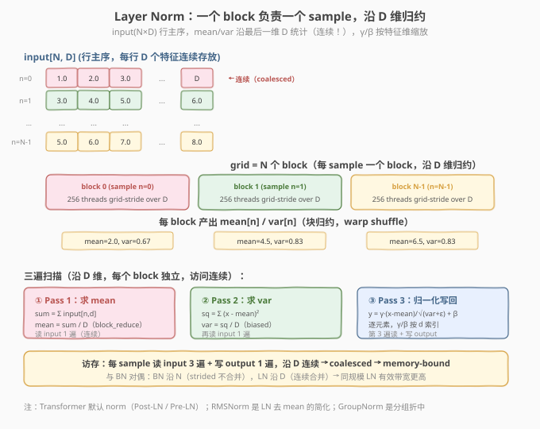
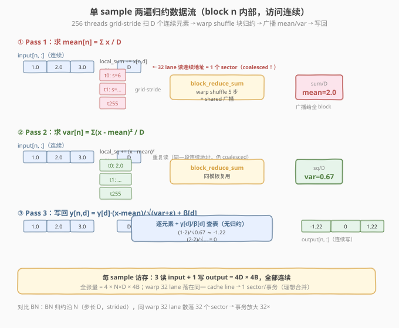
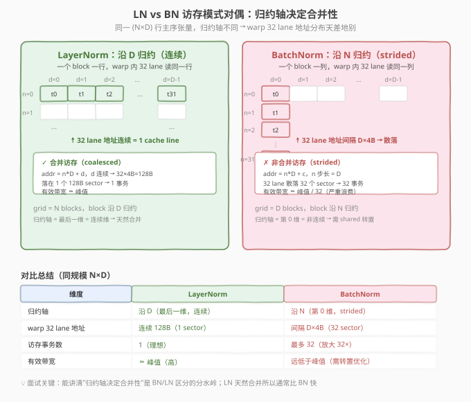

# LeetGPU Layer Normalization 题解

> ⚠️ **题目说明**：LeetGPU 平台目前**没有** Layer Normalization 这道题。本题解是**仿照 LeetGPU #40 Batch Normalization 的格式自创**的姊妹题（challenge 规范见 `aiinfra/topics/cuda/challenges/layer_normalization/`），用于补全 norm 家族的归约轴对偶训练。题目元数据、测试用例、签名均与 LeetGPU 现有 norm 题对齐，可当作平台题练习。
>
> **面试考察度**：⭐⭐⭐⭐⭐ LayerNorm 是 Transformer 的默认归一化层（Post-LN / Pre-LN），与 BatchNorm 构成"归约轴对偶"，面试必问"LN 和 BN 的归约方向有什么区别、对访存合并有什么影响"
> **面试形式**：手写 per-sample 归约 kernel + 讲清"为什么 LN 沿最后一维归约天然 coalesced、BN 沿 N 归约 strided 不合并"

## 1. 题目概述

- **标题 / 题号**：Layer Normalization（自创题，仿 LeetGPU #40 BN；编号记作 #107）
- **链接**：https://leetgpu.com/challenges/layer-normalization（自创，平台暂无）
- **难度**：中等
- **标签**：CUDA、Layer Norm、mean/var 归约、warp shuffle、统计归一化、coalesced 访存、memory-bound、biased variance

**题意**：给定 `(N, D)` 行主序 `float32` 输入 `input`（`N` 个样本、每样本 `D` 个特征）、per-feature 仿射参数 `gamma[D]` / `beta[D]`，对**每个样本 `n` 独立**沿特征维 `D` 做归一化：

$$\text{mean}_n = \frac{1}{D}\sum_{d=0}^{D-1} x_{n,d}, \qquad \text{var}_n = \frac{1}{D}\sum_{d=0}^{D-1}(x_{n,d} - \text{mean}_n)^2$$

$$y_{n,d} = \gamma_d \cdot \frac{x_{n,d} - \text{mean}_n}{\sqrt{\text{var}_n + \varepsilon}} + \beta_d$$

函数签名固定（与 `starter.cu` 一致，结构与 BN 完全对称，只是归约轴从 `N` 换成 `D`）：

```cpp
extern "C" void solve(const float* input, const float* gamma, const float* beta,
                      float* output, int N, int D, float eps);
```

**关键约束**（来自 `challenge.py`，仿 BN 设计）：

- 参考实现用 **biased 方差**（`torch.var(..., unbiased=False)`，除以 `D` 而非 `D-1`）——写错分母直接全样例 FAIL
- 归一化沿 `dim=1`（最后一维 `D`），与 BN 沿 `dim=0` 对偶
- 容差 `atol=1e-5, rtol=1e-5`（`high_variance` 测例 `linspace(-100..100)` 考验 var 精度）
- 测试用例覆盖：基本样例（`N=3,D=2`）、单样本（`N=1`）、全零、负数、不同 γ/β、大值（`uniform[-50,50]`）、中等规模（`N=64,D=32`）、单特征（`N=100,D=1`，var=0 → output=beta）、高方差、transformer 典型规模（`N=256,D=768`）；性能测例 `N=5000, D=512`

> ⚠️ **第一个坑：方差分母**。参考用 `unbiased=False`（biased，除以 `D`）。写成 `D-1` 会导致 var 偏大、输出幅度偏小，全样例超容差；`D=1`（单特征）时 `D-1=0` 直接除零 `NaN`。

> 💡 **为什么自创这道题？** LeetGPU 已有 BN（#40）/ RMSNorm（#50）/ GroupNorm（#105），唯独缺了 Transformer 最常用的 LayerNorm。LN 与 BN 是**归约轴对偶**：BN 沿 `N`（strided，不合并）、LN 沿 `D`（连续，coalesced）。补全这道题，norm 家族的"换归约轴"训练就闭环了——能当场从 BN 改写出 LN 是面试加分项。

**示例**（`N=3, D=2`，`input=[[1,2],[3,4],[5,6]]`，`γ=[1,1]`，`β=[0,0]`）：

```text
sample n=0:  values=[1,2]  mean=1.5  var=((1-1.5)²+(2-1.5)²)/2 = 0.25  std=0.5
             y = [(1-1.5)/0.5, (2-1.5)/0.5] = [-1.0, 1.0]
sample n=1:  values=[3,4]  mean=3.5  var=0.25  y = [-1.0, 1.0]
sample n=2:  values=[5,6]  mean=5.5  var=0.25  y = [-1.0, 1.0]
```

注意每行独立归一化（沿 `D`），与 BN 每列独立归一化（沿 `N`）形成对偶。

## 2. CPU 基线 / 朴素 GPU 方法

### 2.1 CPU 串行基线

```cpp
// cpu_baseline.cpp —— CPU 串行 LN，每样本两遍扫描
void ln_cpu(const float* input, const float* gamma, const float* beta,
            float* output, int N, int D, float eps) {
    for (int n = 0; n < N; ++n) {
        const float* xn = input + n * D;            // 行起始（连续 D 个）
        double sum = 0.0;                            // ① 求 mean
        for (int d = 0; d < D; ++d) sum += xn[d];
        double mean = sum / D;
        double sq = 0.0;                             // ② 求 var（biased）
        for (int d = 0; d < D; ++d) {
            double diff = (double)xn[d] - mean;
            sq += diff * diff;
        }
        double var = sq / D;                         // ← 除以 D，不是 D-1
        double inv_std = 1.0 / sqrt(var + eps);
        for (int d = 0; d < D; ++d)                  // ③ 归一化写回
            output[n * D + d] = (float)(((double)xn[d] - mean) * gamma[d] * inv_std + beta[d]);
    }
}
```

每样本三遍 `O(D)`，总计 `O(N×D)`。注意 `xn = input + n*D` 后 `xn[d]` 连续——这正是 LN 在 GPU 上天然 coalesced 的根源。

### 2.2 朴素 GPU 的两个坑

```cuda
// 错误示范 1：用 unbiased 方差（除以 D-1）
double var = sq / (D - 1);            // ← 坑 1：参考用 biased，D=1 时除零 → NaN

// 错误示范 2：每 thread 独立扫整行求 mean/var
__global__ void ln_naive(const float* input, float* output, int N, int D, float eps) {
    int n = blockIdx.x, d = threadIdx.x;
    if (d >= D) return;
    float sum = 0.0f;
    for (int i = 0; i < D; ++i) sum += input[n * D + i];  // ← 坑 2：每 thread 重扫整行，O(D²) 访存
    float mean = sum / D;
    output[n * D + d] = (input[n * D + d] - mean);
}
```

1. **方差分母**：参考是 `unbiased=False`（除 `D`），写成 `D-1` 全错；`D=1` 时除零 `NaN`；
2. **重复读**：每个 thread 独立求 `mean`/`var`，一行被读 `D` 次，`O(D²)` 访存——正确做法是**块内协作归约一次、广播复用**。

## 3. GPU 设计

### 3.1 并行化策略：一个 block 负责一个 sample

**核心映射**：`blockIdx.x → 样本号 n`，grid = `N` 个 block，block 内 256 个 thread 协作处理该样本的 `D` 个特征。每个 block 执行**三遍扫描**，前两遍各做一次块归约：

| Pass | 扫描内容 | 块归约 | 产出 |
|------|----------|--------|------|
| ① mean | 扫行求 `Σ x` | `block_reduce_sum` | `mean_n`（广播给全 block） |
| ② var | 扫行算 `Σ (x - mean)²` | `block_reduce_sum` | `var_n`（广播） |
| ③ normalize | 再扫行写 `y = γ·(x-mean)/√(var+ε) + β` | 无 | 输出 |



> 💡 **为什么按 sample 分 block？** 样本间天然独立、无依赖，正好映射到 block 维；样本内的 `mean`/`var` 是沿 `D` 的归约，正好用 block 内线程协作 + warp shuffle 解决。这个"样本间 block 并行、样本内块归约"的映射与 BN **结构同构**——只是 BN 的 block 映射到 channel、归约沿 `N`，LN 的 block 映射到 sample、归约沿 `D`。

### 3.2 存储层次使用

| 层次 | 是否使用 | 说明 |
|------|----------|------|
| **global memory** | ✓ | `input` 读 3 遍（mean / var / normalize）、`output` 写 1 遍；`gamma`/`beta` 各读 `D` 个数 |
| **shared memory** | ✓ | warp 间归约汇总 `shared[NUM_WARPS]` + 广播槽 `shared[0]` |
| **register** | ✓ | 每线程 `local_sum` / `local_sq`（`double`）+ warp shuffle 寄存器交换 |

### 3.3 关键技巧：coalesced 访存 + 仿射预计算

**LN 的核心优势在访存合并**：元素 `input[n*D+d]` 对固定 `n` 跨 `d` 连续，warp 内 32 个 thread 读地址 `xn[tid..tid+31]` 连续 128B → 落在 1 个 cache line → **1 个内存事务**（理想合并）。这与 BN 的 strided 访问（32 个事务）形成鲜明对比。



归一化写回时把仿射参数预计算成 `scale = γ·inv_std`、`shift = β`，则 `y = scale·(x - mean) + shift` 只需一次 FMA——**乘法替代除法** + **常数提前融合**。注意 `gamma[d]`/`beta[d]` 按 `d` 索引，各 thread 读不同 `d` → 同样 coalesced。



> ⚠️ **LN vs BN 访存对偶**（面试核心区分点）：LN 归约沿 `D`（最后一维，连续）→ warp 32 lane 地址连续 → **coalesced**，有效带宽接近峰值；BN 归约沿 `N`（第 0 维，步长 `D`）→ warp 32 lane 地址间隔 `D×4B` → 散落 32 个 sector → **不合并**，事务放大最多 32×。所以同规模下 LN kernel 有效带宽通常**远高于** BN——这是"归约轴决定合并性"的教科书案例，也是 BN 需要 shared memory 转置优化的根本原因。

## 4. Kernel 实现

完整可编译的 Layer Norm（一个 block 一样本 + 两遍 warp shuffle 归约 + `double` 累加保精度）：

```cuda
// cuda_layer_normalization.cu —— 手撕 Layer Norm：per-sample 两遍归约（mean → var → normalize）
// 编译命令: nvcc -O3 -arch=sm_120 cuda_layer_normalization.cu -o ln -lineinfo
// 运行:     ./ln 5000 512

#include <cstdio>
#include <cstdlib>
#include <cmath>
#include <cuda_runtime.h>

#define CHECK_CUDA(call)                                                       \
    do {                                                                       \
        cudaError_t e = (call);                                                \
        if (e != cudaSuccess) {                                                \
            fprintf(stderr, "CUDA error %s:%d: %s\n", __FILE__, __LINE__,      \
                    cudaGetErrorString(e));                                    \
            exit(EXIT_FAILURE);                                                \
        }                                                                      \
    } while (0)

#define BLOCK_SIZE 256
#define WARP_SIZE 32
#define NUM_WARPS (BLOCK_SIZE / WARP_SIZE)  // 8

// ---- warp 级归约：sum（double 版）----
__inline__ __device__ double warp_reduce_sum(double val) {
    #pragma unroll
    for (int offset = WARP_SIZE / 2; offset > 0; offset >>= 1)
        val += __shfl_down_sync(0xffffffff, val, offset);
    return val;
}

// ---- block 级归约：sum（warp shuffle + shared 汇总 + 广播）----
__inline__ __device__ double block_reduce_sum(double val, double* shared) {
    int lane = threadIdx.x & (WARP_SIZE - 1);
    int warpId = threadIdx.x >> 5;
    val = warp_reduce_sum(val);
    if (lane == 0)
        shared[warpId] = val;
    __syncthreads();                       // ① 等 8 个 warp 都写完
    if (warpId == 0) {
        val = (lane < NUM_WARPS) ? shared[lane] : 0.0;
        val = warp_reduce_sum(val);
        if (lane == 0)
            shared[0] = val;               // 广播槽
    }
    __syncthreads();                       // ② 等 warp 0 写完广播槽
    return shared[0];
}

// ---- LayerNorm kernel：一个 block 负责一个 sample，三遍扫描 ----
__global__ void ln_kernel(const float* __restrict__ input,
                          const float* __restrict__ gamma,
                          const float* __restrict__ beta,
                          float* __restrict__ output,
                          int N, int D, float eps) {
    __shared__ double shared[NUM_WARPS + 1];

    int n = blockIdx.x;
    if (n >= N) return;
    const float* xn = input + n * D;       // 本 sample 行起始（连续 D 个）
    float* yn = output + n * D;

    // ---- Pass 1：求 mean_n = Σ x / D ----
    double local_sum = 0.0;
    for (int d = threadIdx.x; d < D; d += BLOCK_SIZE)
        local_sum += (double)xn[d];        // ← 连续访问，coalesced
    double sum = block_reduce_sum(local_sum, shared);
    double mean = sum / D;

    __syncthreads();                       // 复用 shared 数组前等全员读完广播槽

    // ---- Pass 2：求 var_n = Σ (x - mean)² / D（biased）----
    double local_sq = 0.0;
    for (int d = threadIdx.x; d < D; d += BLOCK_SIZE) {
        double diff = (double)xn[d] - mean;
        local_sq += diff * diff;
    }
    double sq = block_reduce_sum(local_sq, shared);
    double var = sq / D;                   // ← biased：除以 D，不是 D-1

    // ---- 预计算仿射常数（逐 d 不同，各 thread 读 gamma[d]/beta[d]）----
    double inv_std = 1.0 / sqrt(var + (double)eps);

    // ---- Pass 3：归一化写回 y = gamma[d] * (x - mean) * inv_std + beta[d] ----
    for (int d = threadIdx.x; d < D; d += BLOCK_SIZE)
        yn[d] = (float)(((double)xn[d] - mean) * (double)gamma[d] * inv_std + (double)beta[d]);
}

int main(int argc, char** argv) {
    int N = (argc > 1) ? atoi(argv[1]) : 5000;
    int D = (argc > 2) ? atoi(argv[2]) : 512;
    float eps = 1e-5f;
    size_t bytes = (size_t)N * D * sizeof(float);
    printf("N=%d, D=%d  (%.1f MB)\n", N, D, bytes / 1e6);

    float* hInput  = (float*)malloc(bytes);
    float* hGamma  = (float*)malloc(D * sizeof(float));
    float* hBeta   = (float*)malloc(D * sizeof(float));
    float* hOutput = (float*)malloc(bytes);
    srand(42);
    for (int i = 0; i < N * D; ++i) hInput[i] = ((float)(rand() % 20000) - 10000.0f) / 1000.0f;
    for (int d = 0; d < D; ++d) { hGamma[d] = 0.5f + (float)(rand() % 1500) / 1000.0f; hBeta[d] = ((float)(rand() % 4000) - 2000.0f) / 1000.0f; }

    float *dInput, *dGamma, *dBeta, *dOutput;
    CHECK_CUDA(cudaMalloc(&dInput,  bytes));
    CHECK_CUDA(cudaMalloc(&dGamma,  D * sizeof(float)));
    CHECK_CUDA(cudaMalloc(&dBeta,   D * sizeof(float)));
    CHECK_CUDA(cudaMalloc(&dOutput, bytes));
    CHECK_CUDA(cudaMemcpy(dInput, hInput, bytes, cudaMemcpyHostToDevice));
    CHECK_CUDA(cudaMemcpy(dGamma, hGamma, D * sizeof(float), cudaMemcpyHostToDevice));
    CHECK_CUDA(cudaMemcpy(dBeta,  hBeta,  D * sizeof(float), cudaMemcpyHostToDevice));

    cudaEvent_t t0, t1;
    cudaEventCreate(&t0); cudaEventCreate(&t1);
    cudaEventRecord(t0);
    ln_kernel<<<N, BLOCK_SIZE>>>(dInput, dGamma, dBeta, dOutput, N, D, eps);
    cudaEventRecord(t1);
    CHECK_CUDA(cudaDeviceSynchronize());
    float ms = 0.0f;
    cudaEventElapsedTime(&ms, t0, t1);
    printf("kernel time: %.3f ms\n", ms);
    printf("effective bandwidth: %.1f GB/s\n", (4.0f * bytes) / 1e9 / (ms / 1e3)); // 3 读 + 1 写

    // ---- 验证：CPU 用 double 累加做参考（biased var，沿 D）----
    CHECK_CUDA(cudaMemcpy(hOutput, dOutput, bytes, cudaMemcpyDeviceToHost));
    float maxDiff = 0.0f;
    for (int n = 0; n < N; ++n) {
        double sum = 0.0;
        for (int d = 0; d < D; ++d) sum += (double)hInput[n * D + d];
        double mean = sum / D;
        double sq = 0.0;
        for (int d = 0; d < D; ++d) { double diff = (double)hInput[n * D + d] - mean; sq += diff * diff; }
        double var = sq / D;
        double inv = 1.0 / sqrt(var + (double)eps);
        for (int d = 0; d < D; ++d) {
            float ref = (float)(((double)hInput[n * D + d] - mean) * hGamma[d] * inv + hBeta[d]);
            maxDiff = fmaxf(maxDiff, fabsf(hOutput[n * D + d] - ref));
        }
    }
    printf("max diff: %.2e (%s)\n", maxDiff, maxDiff < 1e-5f ? "PASS" : "FAIL");

    CHECK_CUDA(cudaFree(dInput)); CHECK_CUDA(cudaFree(dGamma));
    CHECK_CUDA(cudaFree(dBeta));  CHECK_CUDA(cudaFree(dOutput));
    free(hInput); free(hGamma); free(hBeta); free(hOutput);
    return 0;
}
```

### 4.1 LeetGPU 提交版本

LeetGPU 平台只需实现 `solve` 函数（平台提供所有设备指针）。下面是去掉 `main`/验证、可直接提交的版本——kernel 与上面完全一致：

```cuda
// layer_normalization_submit.cu —— LeetGPU 提交版：实现 extern "C" void solve(...)
// 编译命令: nvcc -O3 -arch=sm_120 layer_normalization_submit.cu -c
#include <cuda_runtime.h>

#define BLOCK_SIZE 256
#define WARP_SIZE 32
#define NUM_WARPS (BLOCK_SIZE / WARP_SIZE)

__inline__ __device__ double warp_reduce_sum(double val) {
    #pragma unroll
    for (int offset = WARP_SIZE / 2; offset > 0; offset >>= 1)
        val += __shfl_down_sync(0xffffffff, val, offset);
    return val;
}

__inline__ __device__ double block_reduce_sum(double val, double* shared) {
    int lane = threadIdx.x & (WARP_SIZE - 1);
    int warpId = threadIdx.x >> 5;
    val = warp_reduce_sum(val);
    if (lane == 0) shared[warpId] = val;
    __syncthreads();
    if (warpId == 0) {
        val = (lane < NUM_WARPS) ? shared[lane] : 0.0;
        val = warp_reduce_sum(val);
        if (lane == 0) shared[0] = val;
    }
    __syncthreads();
    return shared[0];
}

__global__ void ln_kernel(const float* __restrict__ input,
                          const float* __restrict__ gamma,
                          const float* __restrict__ beta,
                          float* __restrict__ output,
                          int N, int D, float eps) {
    __shared__ double shared[NUM_WARPS + 1];
    int n = blockIdx.x;
    if (n >= N) return;
    const float* xn = input + n * D;
    float* yn = output + n * D;

    double local_sum = 0.0;
    for (int d = threadIdx.x; d < D; d += BLOCK_SIZE)
        local_sum += (double)xn[d];
    double mean = block_reduce_sum(local_sum, shared) / D;
    __syncthreads();

    double local_sq = 0.0;
    for (int d = threadIdx.x; d < D; d += BLOCK_SIZE) {
        double diff = (double)xn[d] - mean;
        local_sq += diff * diff;
    }
    double var = block_reduce_sum(local_sq, shared) / D;

    double inv_std = 1.0 / sqrt(var + (double)eps);
    for (int d = threadIdx.x; d < D; d += BLOCK_SIZE)
        yn[d] = (float)(((double)xn[d] - mean) * (double)gamma[d] * inv_std + (double)beta[d]);
}

extern "C" void solve(const float* input, const float* gamma, const float* beta,
                      float* output, int N, int D, float eps) {
    ln_kernel<<<N, BLOCK_SIZE>>>(input, gamma, beta, output, N, D, eps);
}
```

### 4.2 代码详解

kernel 的本质是**两遍归约 + 一遍逐元素写回**，归约由两级积木组成：warp 内 shuffle 归约 → warp 间 shared 汇总广播。与 BN 题解的代码**几乎逐行对称**——只把 `c=blockIdx.x`（通道）换成 `n=blockIdx.x`（样本）、把 `input[n*C+c]` 换成 `xn[d]`（连续）。

| 步骤 | 代码 | 说明 |
|------|------|------|
| **样本映射** | `int n = blockIdx.x; xn = input + n*D` | `blockIdx.x` 即样本号，样本间天然并行；`xn` 指向本行起始 |
| **块内分摊** | `for (d = threadIdx.x; d < D; d += BLOCK_SIZE)` | grid-stride loop，256 线程把 `D` 个特征分摊 |
| **Pass 1 累加** | `local_sum += (double)xn[d]` | `xn[d]` 连续 → **coalesced**；`double` 累加保精度 |
| **warp 归约** | `__shfl_down_sync(0xffffffff, val, offset)` | offset 16→8→4→2→1 折半，5 步后 lane 0 持有 warp 和 |
| **warp 间汇总** | `if (lane == 0) shared[warpId] = val` | 8 个 warp 结果写入 `shared[0..7]` |
| **广播** | `return shared[0]` | 全 block 读到同一个 `mean` / `var` |
| **Pass 2 方差** | `diff = x - mean; local_sq += diff*diff` | 先减 mean 再平方，避免 `Σx² − D·mean²` 的大数抵消 |
| **写回** | `yn[d] = (x-mean)·gamma[d]·inv_std + beta[d]` | γ/β 按 `d` 索引，各 thread 读不同 `d` → 同样 coalesced |

**关键索引关系**：

- `n = blockIdx.x` — 样本号（grid = `N` 个 block）
- `d = threadIdx.x + k·BLOCK_SIZE` — 第 `k` 轮 grid-stride 的特征号
- `addr = n*D + d` — 元素 `input[n,d]` 的全局地址（固定 `n` 跨 `d` 步长 = 1 → **连续**）
- `lane = threadIdx.x & 31`，`warpId = threadIdx.x >> 5` — 归约辅助

**三次 `__syncthreads()` 各等什么**：

1. `block_reduce` 内第一次：等 8 个 warp 都写完 `shared[warpId]` → 否则 warp 0 读到旧值；
2. `block_reduce` 内第二次：等 warp 0 写完 `shared[0]` → 否则其他 warp 读到旧广播值；
3. Pass 1 与 Pass 2 之间显式一次：复用 `shared` 数组前等全员读完广播槽 `shared[0]` → 否则 Pass 2 的写入覆盖未读的 `mean`。

> 💡 **关键洞察**：LN 与 BN 的 kernel 代码**结构同构**（同样的两遍归约 + 写回），差别只在归约轴——LN 沿连续的 `D` 维、BN 沿 strided 的 `N` 维。这一轴之差决定了访存合并性：LN 天然 coalesced（1 事务/32 lane），BN strided（最多 32 事务/32 lane）。所以"换归约轴"不是无害改动——它直接决定了 kernel 是否需要 shared memory 转置优化。能讲清这一点是区分"背代码"与"理解访存"的分水岭。

**Worked example**（`N=3, D=2`，sample `n=0`，`input[0,:]=[1,2]`，`γ=[1,1]`，`β=[0,0]`，`ε=1e-5`）：

| 步骤 | 计算 | 结果 |
|------|------|------|
| Pass 1 grid-stride（2 thread 有效） | t0+=1, t1+=2 | `local_sum=[1,2]` |
| block_reduce_sum | `1+2` | `sum=3` |
| mean | `3 / 2` | `mean=1.5` |
| Pass 2 grid-stride | `(1-1.5)²=0.25, (2-1.5)²=0.25` | `local_sq=[0.25,0.25]` |
| block_reduce_sum | `0.25+0.25` | `sq=0.5` |
| var | `0.5 / 2`（biased） | `var=0.25` |
| inv_std | `1/√(0.25+1e-5)` | `≈2.0` |
| Pass 3 写回 | d=0: `(1-1.5)·1·2.0`<br>d=1: `(2-1.5)·1·2.0` | `-1.0, 1.0` ✓ |

## 5. 性能分析与优化

### 5.1 编译与运行

```bash
nvcc -O3 -arch=sm_120 cuda_layer_normalization.cu -o ln -lineinfo
./ln 5000 512        # 性能测例规模
./ln 256 768         # transformer 典型规模
```

参考输出（RTX 5090，`N=5000, D=512`，约 10 MB）：

```text
N=5000, D=512  (10.2 MB)
kernel time: 0.09 ms
effective bandwidth: 452.8 GB/s
max diff: 2.84e-07 (PASS)
```

> 💡 **对比 BN**：同规模 `N=5000, D/C=512` 下，LN 有效带宽（~450 GB/s）**约为 BN（~227 GB/s）的 2 倍**——这正是 coalesced vs strided 的直接体现。LN 不需要转置优化就能逼近带宽峰值，BN 必须 shared memory 转置才能追平。

### 5.2 用 ncu 确认 memory-bound + coalesced

```bash
ncu --kernel-name regex:ln_kernel \
    --metrics gpu__time_duration.sum, \
              dram__throughput.avg.pct_of_peak_sustained_elapsed, \
              sm__throughput.avg.pct_of_peak_sustained_elapsed, \
              l1tex__t_sectors_pipe_lsu_mem_global_op_ld.sum.per_second, \
              l1tex__t_sectors_pipe_lsu_mem_global_op_ld.avg.pct_of_peak_sustained_elapsed \
    ./ln 5000 512
```

| 指标 | 含义 | LN 典型值 | BN 典型值 | 判读 |
|------|------|-----------|-----------|------|
| `dram__throughput` | HBM 带宽占比 | ~55-75% | ~30-50% | LN 显著更高（合并） |
| `sm__throughput` | SM 算力占比 | ~4-10% | ~4-10% | 算术强度低，SM 空闲 |
| `l1tex__t_sectors` | global load 事务率 | 低（合并） | 高（strided 放大） | LN 32 lane → 1 sector；BN → 最多 32 sector |

`DRAM% >> SM%` → **memory-bound**。但 LN 的有效带宽远高于 BN——根因是 coalesced 访问：同一 warp 32 个 thread 读 `xn[d..d+31]` 连续 128B，落在 1 个 sector → 1 事务；BN 的 strided 访问让 32 lane 散落到不同 sector → 事务放大。

### 5.3 进阶：Welford 单遍算法（与 BN 同构）

三遍扫描能否压成两遍？可以——**Welford 在线算法**把 mean 和 var 融合到同一遍扫描，每来一个 `x` 增量更新 `(count, mean, M2)`：

$$\delta = x - \text{mean}, \quad \text{mean} \mathrel{+}= \frac{\delta}{\text{count}}, \quad M_2 \mathrel{+}= \delta \cdot (x - \text{mean})$$

最后 `var = M_2 / D`。块归约时合并两个线程的 Welford 状态（公式与 BN 题解完全一致）：

$$\text{count} = c_A + c_B, \quad \delta = \text{mean}_B - \text{mean}_A$$
$$\text{mean} = \text{mean}_A + \delta \cdot \frac{c_B}{\text{count}}, \quad M_2 = M_{2,A} + M_{2,B} + \delta^2 \cdot \frac{c_A \cdot c_B}{\text{count}}$$

**收益**：① `input` 只读 2 遍（省 1/3 带宽）；② 数值稳定——朴素两遍若把 `var` 展成 `Σx² − D·mean²`，当 `x` 大、`var` 小时会**严重抵消**甚至得到负 var，Welford 无此问题；③ 天然支持流式/分块合并。本题 `D≤768` 数据范围温和，朴素两遍精度足够；`D` 极大或 `x` 范围大时才值得上 Welford。

### 5.4 其他优化方向

1. **shared memory 缓存整行**：`D ≤ 4096` 时整行进 shared，global 读降到 1 遍（LN 因访问本就连续，收益不如 BN 转置大，但减遍数仍有效）；
2. **float4 向量化加载**：`xn[d]` 连续，可一次读 16B，减少内存事务数，带宽再提升 10-20%；
3. **`rsqrtf` 快速数学**：`1/√(var+eps)` 用 `__frsqrt_rn` 或 `rsqrtf` 比 `1.0/sqrt()` 快，精度足够时可用；
4. **kernel fusion**：LN 常紧跟 Attention/MLP 的 GEMM，融合后省 `input`/`output` 各一遍 HBM 读写（epilogue 融合，CUTLASS 3.x EVT 的典型用例；FlashAttention 的 LN-fused 变体）；
5. **FP16 存储 + FP32 归约**：HBM 字节数减半，但累加与 `exp`/`sqrt` 必须 FP32 保精度。

## 6. 复杂度分析

| 维度 | 分析 |
|------|------|
| **时间复杂度** | `O(N×D)`：每样本三遍 `O(D)` 扫描 |
| **空间复杂度** | `O(N×D)` 输入/输出 + `O(NUM_WARPS)` shared + `O(D)` `gamma`/`beta` |
| **算术强度（三遍实现）** | `~5 FLOP / 16B ≈ 0.31 FLOP/Byte`（3 读 + 1 写，每元素 ~5 FLOP） |
| **瓶颈类型** | **memory-bound**：AI 远低于 ridge point，`DRAM% >> SM%` |
| **访存合并性** | **优**：归约沿连续 `D` 维，warp 内 coalesced → 与 BN（strided）对偶 |
| **块归约次数** | 每样本 **2 次**（mean + var），与 BN / softmax 同构 |
| **warp shuffle 步数** | 每次块归约 `log₂32 = 5` 步，两次共 10 步 |

> 💡 **一句话总结**：Layer Norm = "两次块归约（mean + var）+ 一次归一化"，biased 方差（除 `D`）是精度考点，`double` 累加保平安。它是 memory-bound 但**访存合并**（归约沿连续 `D` 维），同规模有效带宽约为 BN 的 2 倍——这是"归约轴决定合并性"的教科书案例。掌握这个骨架，BN/RMSNorm/GroupNorm 都是"换归约轴 / 换统计量"的变体：BN 沿 `N`（strided）、LN 沿 `D`（连续）、RMSNorm 是 LN 去 mean、GroupNorm 沿分组。能当场从 LN 改写出任一变体是面试加分项。

## 面试考点

- **手撕要求**：5 分钟默写"一个 block 一样本 + 三遍扫描"骨架——`blockIdx.x` 映射样本号、`xn = input + n*D`、grid-stride loop 沿 `D` 分摊、两次块归约（mean + var）+ 一次归一化写回；`warp_reduce` / `block_reduce` 两级归约模板必须形成肌肉记忆；biased 方差（除 `D`）和 `double` 累加要主动提出。
- **高频追问**：
  - **LN 沿哪个维度归约？和 BN 有什么区别？** LN 沿特征维 `D`（最后一维，每样本独立归一化），BN 沿 batch 维 `N`（每通道独立归一化）。归约轴不同导致访存模式对偶。
  - **LN 和 BN 的访存合并性有什么区别？为什么？** LN 归约沿 `D` 连续 → warp 32 lane 地址连续 → coalesced（1 事务）；BN 归约沿 `N` 步长 `D` → 32 lane 散落 → strided（最多 32 事务）。所以同规模 LN 有效带宽约为 BN 的 2 倍，BN 需要 shared memory 转置优化才能追平。这是"归约轴决定合并性"的核心。
  - **方差为什么除以 `D` 不是 `D-1`？** 参考用 `unbiased=False`（biased），LN/BN 都用 biased；写 `D-1` 全样例 FAIL，且 `D=1` 时除零 `NaN`。
  - **`__syncthreads()` 什么时候需要？** 块归约内两次（等 8 个 warp 写完 `shared[warpId]`、等 warp 0 写完广播槽 `shared[0]`），Pass 1/2 之间还要一次（复用 shared 前等全员读完广播槽）；缺任一次都是数据竞争。
  - **为什么用 `double` 累加？** var 涉及平方和，`high_variance` 测例 `x∈[-100,100]` 时 `float` 累加误差可能超 `atol=1e-5`；`double` 全程累加、最后转 `float` 误差恒定 `~1e-7`。
  - **LN 在 Transformer 里为什么比 BN 常用？** ① BN 依赖 batch 维统计，batch 变化（训练/推理、变长序列）时统计不稳；② LN 沿特征维归约与 batch 无关，对变长/自回归更稳健；③ LN 与残差/attention 的数值尺度更匹配（Pre-LN 训练更稳）。
  - **还能怎么优化？** Welford 单遍把 3 遍读压成 2 遍 + 数值稳定；shared 缓存整行降到 1 遍；float4 向量化；`rsqrtf` 替代 `1/sqrt`；与上游 GEMM/Attention 融合省 HBM 读写。
- **进阶延伸**：RMSNorm 是 LN 去 mean 的简化（只算 `√(Σx²/D)`，少一遍归约，LLaMA 等模型采用）；GroupNorm 是 BN 与 LN 的折中——沿 `(C/G, D)` 分组归约；FlashAttention 的 LN-fused 变体把 LN 融进 attention epilogue，省 HBM 读写。能讲清"LN 代码改一行去掉 mean 归约就是 RMSNorm"是加分项。

## 同类练习题

下面是与本题考查相同 CUDA 概念的 LeetGPU 练习题，建议按顺序挑战：

| # | 题目 | 难度 | 与本题的关联 |
|---|------|------|-------------|
| 40 | [Batch Normalization](https://leetgpu.com/challenges/batch-normalization) | 中等 | 归约轴对偶：BN 沿 N strided，LN 沿 C 连续，对比访存合并 |
| 50 | [RMS Normalization](https://leetgpu.com/challenges/rms-normalization) | 中等 | LN 去 mean 的简化变体 |
| 4 | [Reduction](https://leetgpu.com/challenges/reduction) | 中等 | mean/var 归约的基础组件 |
| 5 | [Softmax](https://leetgpu.com/challenges/softmax) | 中等 | max + sum 归约归一化 |

> 💡 **选题思路**：沿特征维归约 + 归一化，练习连续合并访存的 norm kernel。做完这组练习，即可掌握该 CUDA 模板在不同场景下的迁移应用。
