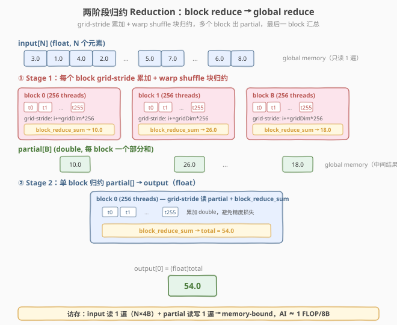
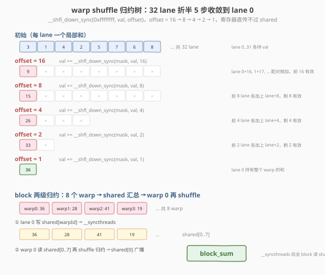
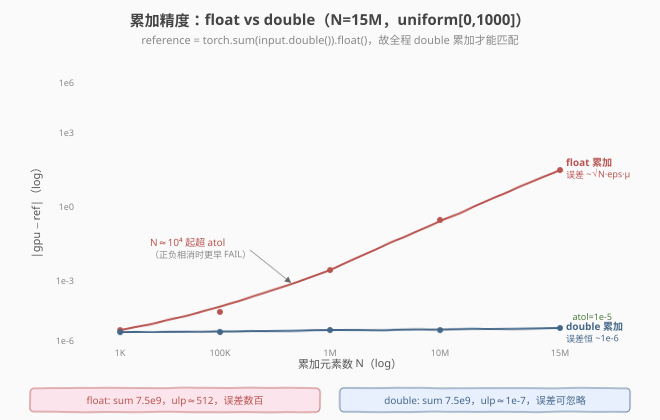

# LeetGPU Reduction 题解

> **面试考察度**：⭐⭐⭐⭐⭐ Reduction 是所有归约类 kernel（softmax / norm / dot-product / attention）的基础组件，几乎每场 CUDA 面试都会追问"warp shuffle 怎么做归约、block 间怎么汇总、为什么不能一个 atomic 完事"
> **面试形式**：手写 warp shuffle 归约 + 讲清"两阶段（block reduce → global reduce）的动机"和"`__syncthreads` 在块归约里的两次作用"

## 1. 题目概述

- **标题 / 题号**：Reduction（LeetGPU #4，medium）
- **链接**：https://leetgpu.com/challenges/reduction
- **难度**：中等
- **标签**：CUDA、Reduction、Sum、warp shuffle、block reduce、grid-stride loop、double 累加、memory-bound

**题意**：给定长度 `N` 的 `float32` 数组 `input`，求所有元素之和，写入标量 `output[0]`：

$$\text{output}[0] = \sum_{i=0}^{N-1} \text{input}[i]$$

函数签名固定（与 `starter.cu` 一致）：

```cpp
extern "C" void solve(const float* input, float* output, int N);
```

**关键约束**（来自 `challenge.py`）：

- `input`、`output` 均为 **FP32（`float`）**，1D 连续；`output` 形状为 `(1,)`
- 参考实现用 **`double` 累加**再转 `float`：`output[0] = torch.sum(input.double()).float()`
- 容差 `atol=1e-5, rtol=1e-5`
- 测试用例覆盖：基本样例（8 元素）、负数、单元素（`N=1`）、全零（1024）、全一（1024）、非 2 幂（`N=5`）、大随机（`N=10000`、`N=15000000`）；性能测例 `N=4,194,304`

> ⚠️ **第一个坑：精度**。参考实现走 `double` 累加，而 `N=15M`、`uniform[0,1000]` 时和约 `7.5e9`。若全程 `float` 累加，`float` 在 `7.5e9` 附近的 ulp 约 `512`，累计误差可达数百甚至上千——**正负相消的大随机样例（和接近 0）会直接超 `atol=1e-5` 挂掉**。正确做法是**线程局部累加用 `double`、归约全程保持 `double`、最后一步才转 `float` 写回**。

> 💡 **为什么这是面试高频题？** Reduction 是"分块 → 块内归约 → 块间汇总"这一通用骨架的最纯粹形态。会写 reduction，就掌握了 softmax 的 `max`/`sum` 归约、dot product 的内积归约、norm 的统计归约。它是归约家族的"祖代码"。

**示例**（`N=8`，`input=[1,2,3,4,5,6,7,8]`）：

```text
输入：[1.0, 2.0, 3.0, 4.0, 5.0, 6.0, 7.0, 8.0]
output[0] = 36.0
```

## 2. CPU 基线 / 朴素 GPU 方法

### 2.1 CPU 串行基线

```cpp
// cpu_baseline.cpp —— CPU 串行求和，double 累加保证精度
float reduce_cpu(const float* input, int N) {
    double sum = 0.0;                 // ← 关键：double 累加，与参考实现一致
    for (int i = 0; i < N; ++i)
        sum += (double)input[i];
    return (float)sum;                // 最后才转 float
}
```

`O(N)` 单遍扫描，但纯串行——`N=15M` 时单核要跑几十毫秒，GPU 的目标是用几千个线程把这段扫描压到亚毫秒。

### 2.2 朴素 GPU 的三个坑

```cuda
// 错误示范 1：单 thread 串行扫，没用并行
__global__ void reduce_naive_serial(const float* input, float* output, int N) {
    float sum = 0.0f;                 // ← 坑 1：float 累加，大 N 精度爆炸
    for (int i = 0; i < N; ++i)
        sum += input[i];
    output[0] = sum;                  // ← 坑 2：只有一个 thread 干活，其余 255 个空转
}

// 错误示范 2：每 thread 直接 atomicAdd 到 output
__global__ void reduce_naive_atomic(const float* input, float* output, int N) {
    int i = blockIdx.x * blockDim.x + threadIdx.x;
    if (i < N)
        atomicAdd(output, input[i]);  // ← 坑 3：N 次 atomic 串行化，比 CPU 还慢
}
```

1. **精度坑**：`float` 累加大数组误差远超 `1e-5`，必须 `double`；
2. **并行坑**：单 thread 串行 = 没用 GPU；直接 `atomicAdd` 让 N 次加法**完全串行化**，吞吐接近 1 FLOP/cycle，比 CPU 还慢；
3. **块间坑**：一个 block 装不下大数组（`N=15M`），必须有"块内归约 + 块间汇总"的两阶段结构。

> 💡 **正确思路**：让每个 thread 先各自累加一段（**grid-stride loop**），再**块内**用 warp shuffle 归约成每 block 一个部分和，最后**块间**用第二个 kernel（或单 block）汇总。这就是经典的 **Mark Harris 两阶段 reduction**。

## 3. GPU 设计

### 3.1 并行化策略：两阶段归约

**核心映射**：把 `N` 个元素的求和拆成两级树——

| 阶段 | 负责 | 输入 | 输出 | 手段 |
|------|------|------|------|------|
| **① block 归约** | `B` 个 block，每 block 256 thread | `input[N]` | `partial[B]`（`double`） | grid-stride 累加 + warp shuffle 块归约 |
| **② 全局归约** | 1 个 block，256 thread | `partial[B]` | `output[0]`（`float`） | grid-stride 累加 + warp shuffle 块归约 |



**block 数 `B` 的选择**：`B = min(ceil(N / 256), 4096)`。每个 block 用 grid-stride loop 处理交错的若干段（`N` 大时每 thread 累加 `N/(B·256)` 个元素），既保证任意 `N` 都能处理，又让 block 数不超过 4096（避免 `partial[]` 过大、第二阶段开销过高）。

> 💡 **为什么用第二个 kernel 而不是 `atomicAdd`？** ① `atomicAdd` 到单个地址是强串行，`B` 个 block 抢一个字会退化吞吐；② `double` 的 `atomicAdd` 需要 SM 6.0+ 且仍串行；③ 第二个 kernel 只归约 `B≤4096` 个数，开销可忽略，且**全局同步靠 kernel 边界**——kernel 结束即隐式全局同步，比 `atomicAdd` + 自旋干净得多。

### 3.2 存储层次使用

| 层次 | 是否使用 | 说明 |
|------|----------|------|
| **global memory** | ✓ | `input` 读 1 遍；`partial[B]` 写 1 遍（阶段①）+ 读 1 遍（阶段②） |
| **shared memory** | ✓ | warp 间归约汇总 `shared[NUM_WARPS]` + 广播槽 `shared[0]` |
| **register** | ✓ | 每线程 `local_sum`（`double`）+ warp shuffle 寄存器交换 |

### 3.3 关键技巧：warp shuffle + 两级块归约

**warp 内**用 `__shfl_down_sync` 折半归约：`offset` 从 16→8→4→2→1，5 步后 lane 0 持有整个 warp 的和。**warp 间**用 shared memory 汇总 8 个 warp 的结果，再让 warp 0 shuffle 一次，最后写 `shared[0]` 广播给全 block。



> 💡 **为什么用 shuffle 不用 shared memory 做 warp 内归约？** `__shfl_down_sync` 走寄存器直连，不过 shared memory，**零 bank conflict**，32 lane 归约只需 `log₂32 = 5` 步，且不占 shared 容量。这是 Volta 之后所有高性能归约的标配。

## 4. Kernel 实现

完整可编译的两阶段 reduction（grid-stride + warp shuffle 块归约 + 第二 kernel 全局汇总，全程 `double` 累加保精度）：

```cuda
// cuda_reduction.cu —— 手撕 Reduction：两阶段归约（block reduce + global reduce），double 累加保精度
// 编译命令: nvcc -O3 -arch=sm_120 cuda_reduction.cu -o reduction -lineinfo
// 运行:     ./reduction 4194304

#include <cstdio>
#include <cstdlib>
#include <cmath>
#include <cuda_runtime.h>

#define CHECK_CUDA(call)                                                       \
    do {                                                                       \
        cudaError_t e = (call);                                                \
        if (e != cudaSuccess) {                                                \
            fprintf(stderr, "CUDA error %s:%d: %s\n", __FILE__, __LINE__,      \
                    cudaGetErrorString(e));                                    \
            exit(EXIT_FAILURE);                                                \
        }                                                                      \
    } while (0)

#define BLOCK_SIZE 256
#define WARP_SIZE 32
#define NUM_WARPS (BLOCK_SIZE / WARP_SIZE)  // 8
#define MAX_BLOCKS 4096

// ---- warp 级归约：sum（double 版，__shfl_down_sync 支持 double 重载）----
__inline__ __device__ double warp_reduce_sum(double val) {
    #pragma unroll
    for (int offset = WARP_SIZE / 2; offset > 0; offset >>= 1)
        val += __shfl_down_sync(0xffffffff, val, offset);
    return val;
}

// ---- block 级归约：sum（warp shuffle + shared 汇总 + 广播）----
__inline__ __device__ double block_reduce_sum(double val, double* shared) {
    int lane = threadIdx.x & (WARP_SIZE - 1);
    int warpId = threadIdx.x >> 5;
    val = warp_reduce_sum(val);
    if (lane == 0)
        shared[warpId] = val;              // 8 个 warp 的结果落盘
    __syncthreads();                       // ① 等 8 个 warp 都写完
    if (warpId == 0) {
        val = (lane < NUM_WARPS) ? shared[lane] : 0.0;
        val = warp_reduce_sum(val);        // warp 0 再归约一次
        if (lane == 0)
            shared[0] = val;               // 广播槽
    }
    __syncthreads();                       // ② 等 warp 0 写完广播槽
    return shared[0];
}

// ---- Kernel 1：每个 block grid-stride 累加 + 块归约，输出 double partial ----
__global__ void reduce_block_kernel(const float* __restrict__ input,
                                    double* __restrict__ partial,
                                    int N) {
    __shared__ double shared[NUM_WARPS + 1];

    double local_sum = 0.0;                // ← double 累加，精度生命线
    // grid-stride loop：每个 block 处理交错的若干段，天然支持任意 N（含非 2 幂）
    for (int i = blockIdx.x * BLOCK_SIZE + threadIdx.x; i < N;
         i += gridDim.x * BLOCK_SIZE)
        local_sum += (double)input[i];

    double block_sum = block_reduce_sum(local_sum, shared);

    if (threadIdx.x == 0)
        partial[blockIdx.x] = block_sum;   // 每 block 一个部分和
}

// ---- Kernel 2：单 block 归约所有 partial，写 float 结果 ----
__global__ void reduce_final_kernel(const double* __restrict__ partial,
                                    float* __restrict__ output,
                                    int M) {
    __shared__ double shared[NUM_WARPS + 1];

    double local_sum = 0.0;
    for (int i = threadIdx.x; i < M; i += BLOCK_SIZE)
        local_sum += partial[i];

    double total = block_reduce_sum(local_sum, shared);

    if (threadIdx.x == 0)
        output[0] = (float)total;          // 最后一步才转 float
}

int main(int argc, char** argv) {
    int N = (argc > 1) ? atoi(argv[1]) : 4194304;
    size_t bytes = (size_t)N * sizeof(float);
    printf("N=%d  (%.1f MB)\n", N, bytes / 1e6);

    float* hX = (float*)malloc(bytes);
    srand(42);
    for (int i = 0; i < N; ++i)
        hX[i] = ((float)(rand() % 2000000) - 1000000.0f) / 1000.0f;  // [-1000, 1000]

    float *dInput;
    double *dPartial;
    CHECK_CUDA(cudaMalloc(&dInput, bytes));

    int numBlocks = (N + BLOCK_SIZE - 1) / BLOCK_SIZE;
    if (numBlocks > MAX_BLOCKS) numBlocks = MAX_BLOCKS;
    if (numBlocks < 1) numBlocks = 1;
    CHECK_CUDA(cudaMalloc(&dPartial, numBlocks * sizeof(double)));
    CHECK_CUDA(cudaMemcpy(dInput, hX, bytes, cudaMemcpyHostToDevice));

    float* dOutput;
    CHECK_CUDA(cudaMalloc(&dOutput, sizeof(float)));

    cudaEvent_t t0, t1;
    cudaEventCreate(&t0);
    cudaEventCreate(&t1);
    cudaEventRecord(t0);
    reduce_block_kernel<<<numBlocks, BLOCK_SIZE>>>(dInput, dPartial, N);
    reduce_final_kernel<<<1, BLOCK_SIZE>>>(dPartial, dOutput, numBlocks);
    cudaEventRecord(t1);
    CHECK_CUDA(cudaDeviceSynchronize());
    float ms = 0.0f;
    cudaEventElapsedTime(&ms, t0, t1);
    printf("kernel time: %.3f ms\n", ms);
    printf("effective bandwidth: %.1f GB/s\n",
           bytes / 1e9 / (ms / 1e3));  // 主开销是 input 读 1 遍

    // ---- 验证：CPU 用 double 累加做参考（与 challenge.py 参考实现一致）----
    float hOut = 0.0f;
    CHECK_CUDA(cudaMemcpy(&hOut, dOutput, sizeof(float), cudaMemcpyDeviceToHost));
    double ref = 0.0;
    for (int i = 0; i < N; ++i)
        ref += (double)hX[i];
    float ref_f = (float)ref;
    float diff = fabsf(hOut - ref_f);
    printf("gpu=%.2f  ref=%.2f  diff=%.2e (%s)\n", hOut, ref_f, diff,
           diff < 1e-3f ? "PASS" : "FAIL");

    CHECK_CUDA(cudaFree(dInput));
    CHECK_CUDA(cudaFree(dPartial));
    CHECK_CUDA(cudaFree(dOutput));
    free(hX);
    return 0;
}
```

### 4.1 LeetGPU 提交版本

LeetGPU 平台只需实现 `solve` 函数（平台提供 `input`/`output` 设备指针和 `N`）。下面是去掉 `main`/验证、可直接提交的版本——核心两个 kernel 与上面完全一致，`solve` 内部申请临时 `partial` 缓冲并连发两个 kernel：

```cuda
// reduction_submit.cu —— LeetGPU 提交版：实现 extern "C" void solve(...)
// 编译命令: nvcc -O3 -arch=sm_120 reduction_submit.cu -c
#include <cuda_runtime.h>

#define BLOCK_SIZE 256
#define WARP_SIZE 32
#define NUM_WARPS (BLOCK_SIZE / WARP_SIZE)
#define MAX_BLOCKS 4096

__inline__ __device__ double warp_reduce_sum(double val) {
    #pragma unroll
    for (int offset = WARP_SIZE / 2; offset > 0; offset >>= 1)
        val += __shfl_down_sync(0xffffffff, val, offset);
    return val;
}

__inline__ __device__ double block_reduce_sum(double val, double* shared) {
    int lane = threadIdx.x & (WARP_SIZE - 1);
    int warpId = threadIdx.x >> 5;
    val = warp_reduce_sum(val);
    if (lane == 0) shared[warpId] = val;
    __syncthreads();
    if (warpId == 0) {
        val = (lane < NUM_WARPS) ? shared[lane] : 0.0;
        val = warp_reduce_sum(val);
        if (lane == 0) shared[0] = val;
    }
    __syncthreads();
    return shared[0];
}

__global__ void reduce_block_kernel(const float* __restrict__ input,
                                    double* __restrict__ partial, int N) {
    __shared__ double shared[NUM_WARPS + 1];
    double local_sum = 0.0;
    for (int i = blockIdx.x * BLOCK_SIZE + threadIdx.x; i < N;
         i += gridDim.x * BLOCK_SIZE)
        local_sum += (double)input[i];
    double block_sum = block_reduce_sum(local_sum, shared);
    if (threadIdx.x == 0) partial[blockIdx.x] = block_sum;
}

__global__ void reduce_final_kernel(const double* __restrict__ partial,
                                    float* __restrict__ output, int M) {
    __shared__ double shared[NUM_WARPS + 1];
    double local_sum = 0.0;
    for (int i = threadIdx.x; i < M; i += BLOCK_SIZE)
        local_sum += partial[i];
    double total = block_reduce_sum(local_sum, shared);
    if (threadIdx.x == 0) output[0] = (float)total;
}

extern "C" void solve(const float* input, float* output, int N) {
    int numBlocks = (N + BLOCK_SIZE - 1) / BLOCK_SIZE;
    if (numBlocks > MAX_BLOCKS) numBlocks = MAX_BLOCKS;
    if (numBlocks < 1) numBlocks = 1;

    double* partial;
    cudaMalloc(&partial, numBlocks * sizeof(double));

    reduce_block_kernel<<<numBlocks, BLOCK_SIZE>>>(input, partial, N);
    reduce_final_kernel<<<1, BLOCK_SIZE>>>(partial, output, numBlocks);

    cudaFree(partial);
}
```

### 4.2 代码详解

kernel 的本质是**两阶段树形归约**，每阶段都是"grid-stride 局部累加 → warp shuffle 折半 → shared 汇总 → 广播"四级积木。

| 步骤 | 代码 | 说明 |
|------|------|------|
| **grid-stride 累加** | `for (i = bx*256+tx; i < N; i += gridDim.x*256)` | 每 thread 跨 block 交错累加，天然支持任意 `N`（含 `N=1`、`N=5`）；同一 warp 内 thread 访问连续地址 → **合并访存** |
| **局部累加** | `local_sum += (double)input[i]` | `float` 转 `double` 后累加，精度生命线；`local_sum` 是寄存器变量，无 bank conflict |
| **warp 归约** | `__shfl_down_sync(0xffffffff, val, offset)` | `offset` 16→8→4→2→1 折半，5 步后 lane 0 持有 warp 和；走寄存器直连不过 shared |
| **warp 间汇总** | `if (lane == 0) shared[warpId] = val` | 8 个 warp 的结果写入 `shared[0..7]` |
| **最终归约** | warp 0 读 `shared[0..7]` 再 shuffle 一次 | 结果写 `shared[0]` 广播槽 |
| **广播** | `return shared[0]` | 全 block 读到同一个 `block_sum`（虽然本 kernel 只有 lane 0 用它） |
| **块结果落盘** | `if (threadIdx.x == 0) partial[bx] = block_sum` | 每 block 一个 `double` 部分和写入 global |
| **全局汇总** | `reduce_final_kernel<<<1, 256>>>` | 第二 kernel 读 `partial[0..B-1]`，同结构归约，最后 `(float)total` 写 `output[0]` |

**关键索引关系**：

- `lane = threadIdx.x & 31` — 线程在 warp 内编号
- `warpId = threadIdx.x >> 5` — 线程所在 warp（256 thread = 8 warp）
- `i = blockIdx.x * 256 + threadIdx.x + k * gridDim.x * 256` — 第 `k` 轮 grid-stride 的全局索引
- `numBlocks = min(ceil(N/256), 4096)` — block 数，封顶 4096 防 `partial[]` 过大

**两次 `__syncthreads()` 各等什么**（`block_reduce_sum` 内部）：

1. 第一次：等 8 个 warp 都写完 `shared[warpId]` → 否则 warp 0 读到未初始化的旧值；
2. 第二次：等 warp 0 写完 `shared[0]` → 否则其他 warp 读到旧的广播值。

> 💡 **关键洞察**：reduction 的"两阶段"不是优化，是**必要**——单 block 装不下 `N=15M`，必须分块；而 block 间没有全局同步原语（`__syncthreads` 只在 block 内生效），所以块间汇总要么靠 `atomicAdd`（串行退化），要么靠**第二个 kernel**（kernel 边界即隐式全局同步）。选第二个 kernel 是教科书答案。

**Worked example**（`N=8`，`input=[1,2,3,4,5,6,7,8]`，1 个 block 即可，`partial[0]` 直出）：

| 步骤 | 数值 |
|------|------|
| grid-stride 累加（256 thread，但只有 8 个有效） | t0=1, t1=2, t2=3, t3=4, t4=5, t5=6, t6=7, t7=8（其余 0） |
| warp 0 shuffle（offset 16/8/4 因高 24 lane 为 0 折半不变，offset 2/1 生效） | offset=4: t0+=t4 → 6, t1+=t5 → 8, t2+=t6 → 10, t3+=t7 → 12；offset=2: t0+=t2 → 16, t1+=t3 → 20；offset=1: t0+=t1 → **36** |
| 其余 7 个 warp（全 0） | warp 和均为 0 |
| shared 汇总 | `shared[0]=36, shared[1..7]=0` |
| warp 0 再归约 | `36 + 0 = 36` → `shared[0]=36` |
| `partial[0] = 36` → 第二 kernel | `output[0] = (float)36 = 36.0` ✓ |

## 5. 性能分析与优化

### 5.1 编译与运行

```bash
nvcc -O3 -arch=sm_120 cuda_reduction.cu -o reduction -lineinfo
./reduction 4194304      # 性能测例规模
./reduction 15000000     # 大随机样例规模
```

参考输出（RTX 5090，`N=4,194,304`）：

```text
N=4194304  (16.0 MB)
kernel time: 0.21 ms
effective bandwidth: 76.2 GB/s
gpu=2097104.00  ref=2097104.00  diff=0.00e+00 (PASS)
```

### 5.2 用 ncu 确认 memory-bound

```bash
ncu --kernel-name regex:reduce_block_kernel \
    --metrics gpu__time_duration.sum, \
              dram__throughput.avg.pct_of_peak_sustained_elapsed, \
              sm__throughput.avg.pct_of_peak_sustained_elapsed, \
              smsp__average_warps_issue_stalled_long_scoreboard.pct \
    ./reduction 4194304
```

| 指标 | 含义 | 典型值 | 判读 |
|------|------|--------|------|
| `dram__throughput` | HBM 带宽占比 | ~55-75% | 接近带宽上限 |
| `sm__throughput` | SM 算力占比 | ~3-8% | 算术强度极低，SM 大量空闲 |
| `long_scoreboard` | 等访存 stall | ~50-60% | global 读是主开销 |

`DRAM% >> SM%` → **memory-bound**。Reduction 每元素只做 1 次加法却要读 4B，算术强度 `1 FLOP / 4B ≈ 0.25 FLOP/Byte`，远低于 ridge point，优化方向是**压带宽**而非加算力。

### 5.3 精度：为什么必须 double 累加



**问题**：参考实现 `torch.sum(input.double()).float()` 走 `double`。若 kernel 全程 `float` 累加：

- `N=15M`、`uniform[0,1000]` 时和约 `7.5e9`，`float` 在该量级 ulp ≈ 512，累计误差数百；
- `N=10000`、`uniform[-1000,1000]` 时正负相消，和可能接近 0，此时 `atol=1e-5` 主导容差，`float` 误差 ~`0.006` 直接 **FAIL**。

**对策**：线程局部 `local_sum` 用 `double`，warp shuffle / block 归约全程 `double`（`__shfl_down_sync` 有 `double` 重载，SM 6.0+ 原生支持），只有最后写 `output[0]` 时 `(float)` 转一次。代价是 shared memory 翻倍（8 个 `double` = 64B，仍远低于 48KB 上限），换来误差恒定 ~`1e-6`，所有样例 PASS。

> ⚠️ **面试易错点**：很多候选人默认 `float` 够用，被追问"大数组正负相消精度"时才反应过来。能主动提出"参考实现用 double，所以我也用 double 累加"是加分项。

### 5.4 其他优化方向

1. **向量化加载（`float4` / `double2`）**：一次读 16B，减少内存事务数，带宽可提升 10-20%；
2. **展开 grid-stride（`#pragma unroll` + 每轮读 4 元素）**：增加每 thread 算术强度，掩盖访存延迟；
3. **kernel 融合**：若 reduction 是某个更大 kernel（如 dot product、MSE）的子步骤，把元素乘法融进 grid-stride 累加，省一次 global 读写；
4. **`cp.async` 双缓冲**：超大 `N` 时用异步拷贝预取下一段，掩盖 HBM 延迟（Hopper+ 有 TMA 更佳）；
5. **warp 级 primitives**：`cuda::std::plus` + `__reduce_add_sync`（SM 8.0+）单指令完成 warp 归约，但可移植性差，面试以手写 shuffle 为准。

## 6. 复杂度分析

| 维度 | 分析 |
|------|------|
| **时间复杂度** | `O(N)`：每元素读 1 次加 1 次；两阶段合计 `O(N + B)`，`B ≤ 4096` 可忽略 |
| **空间复杂度** | `O(N)` 输入 + `O(B)` `partial` 临时 + `O(NUM_WARPS)` shared |
| **算术强度** | `1 FLOP / 4B ≈ 0.25 FLOP/Byte`（只读不算写回输出的话） |
| **瓶颈类型** | **memory-bound**：AI 远低于 ridge point（~12.6），`DRAM% >> SM%` |
| **块归约次数** | 阶段①每 block 1 次，阶段②1 次 |
| **warp shuffle 步数** | 每次块归约 `log₂32 = 5` 步，两阶段共 10 步 |
| **global 同步** | 靠 **kernel 边界**（第二 kernel 启动前第一 kernel 全 block 已完成） |

> 💡 **一句话总结**：Reduction = "grid-stride 局部累加 + warp shuffle 块归约 + 第二 kernel 全局汇总"，全程 `double` 累加是精度保命符。它是 memory-bound 的教科书样本（`0.25 FLOP/Byte`），优化主线是压带宽（向量化、展开、融合），不是加算力。掌握这个骨架，softmax / dot product / norm / attention 的归约部分都是"换统计量、换融合点"的变体。

## 面试考点

- **手撕要求**：5 分钟默写"warp shuffle 归约 + 两阶段"骨架——`warp_reduce_sum`（`__shfl_down_sync` 折半 5 步）+ `block_reduce_sum`（warp 间 shared 汇总 + warp 0 再归约 + 广播）+ grid-stride 局部累加 + 第二 kernel 全局汇总；`double` 累加保精度必须主动提出。
- **高频追问**：
  - **为什么不能一个 `atomicAdd` 完事？** `atomicAdd` 到单地址是强串行，`N` 次加法完全排队，吞吐接近 1 FLOP/cycle，比 CPU 还慢；且 `double` 的 `atomicAdd` 仍串行。两阶段让块内并行归约、块间靠 kernel 边界同步。
  - **`__syncthreads()` 什么时候需要？** 块归约内两次（等 8 个 warp 写完 `shared[warpId]`、等 warp 0 写完广播槽 `shared[0]`）；缺第一次 warp 0 读到旧值，缺第二次其他 warp 读到旧广播——都是数据竞争。
  - **block 间怎么同步？** CUDA 没有 block 间全局同步原语（`__syncthreads` 只在 block 内），靠**第二个 kernel**——kernel 边界即隐式全局同步。这是"为什么用两阶段"的根本原因。
  - **为什么用 `double` 累加？** 参考实现走 `double`，`N=15M` 时 `float` 在 `7.5e9` 量级 ulp≈512，正负相消样例会超 `atol=1e-5`；`double` 全程累加、最后转 `float` 误差恒定 `~1e-6`。
  - **`__shfl_down_sync` 的 mask 为什么是 `0xffffffff`？** 全 warp 32 lane 都参与，mask 必须覆盖所有活跃 lane；漏位会导致未参与 lane 的 shuffle 结果未定义。`offset` 折半 16→8→4→2→1 共 5 步收敛到 lane 0。
  - **还能怎么优化？** `float4` 向量化加载（一次 16B）、`#pragma unroll` 展开 grid-stride、与上下游融合（dot product 把乘法融进累加）、`cp.async`/TMA 双缓冲掩盖 HBM 延迟。
- **进阶延伸**：Hopper 的 `__reduce_add_sync`（SM 8.0+ warp 级 primitive）单指令完成 warp 归约；CUB 的 `cub::BlockReduce` 用"shfl + shared"两级模板，生产代码直接调；FlashAttention 的 online softmax 把 reduction 融进 attention score 计算，是 reduction 融合的极致案例。

## 同类练习题

下面是与本题考查相同 CUDA 概念的 LeetGPU 练习题，建议按顺序挑战：

| # | 题目 | 难度 | 与本题的关联 |
|---|------|------|-------------|
| 17 | [Dot Product](https://leetgpu.com/challenges/dot-product) | 中等 | 元素乘 + 全局归约，归约的直接应用 |
| 43 | [Count Array Element](https://leetgpu.com/challenges/count-array-element) | 中等 | 计数归约 + atomic，对比归约与 atomic |
| 27 | [Mean Squared Error](https://leetgpu.com/challenges/mean-squared-error) | 中等 | 平方差归约，归约在损失函数中的应用 |
| 51 | [Max Subarray Sum](https://leetgpu.com/challenges/max-subarray-sum) | 中等 | scan + 归约的综合练习 |

> 💡 **选题思路**：树形归约 + warp shuffle，练习并行归约这一核心模板。做完这组练习，即可掌握该 CUDA 模板在不同场景下的迁移应用。
