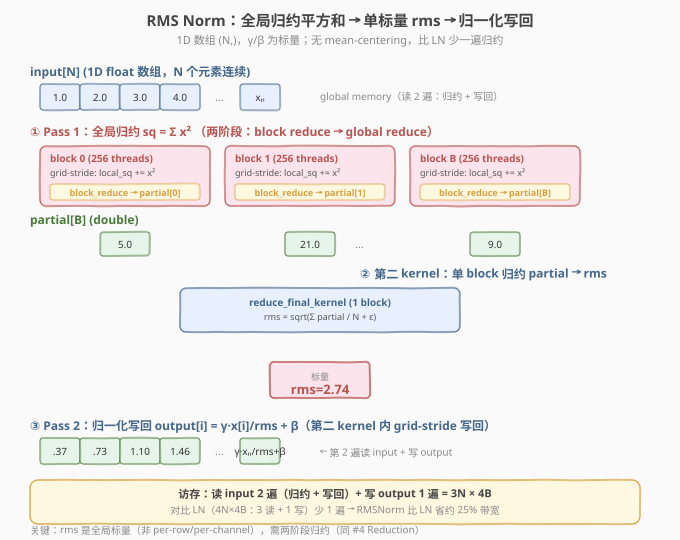
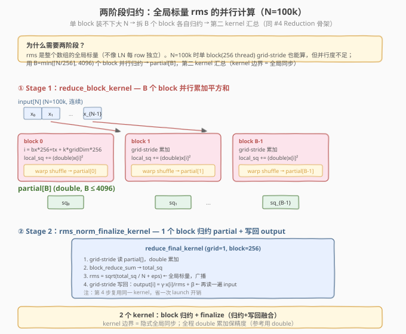
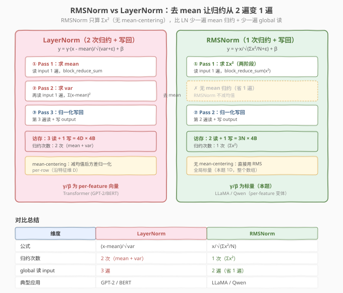

# LeetGPU RMS Normalization 题解

> **面试考察度**：⭐⭐⭐⭐⭐ RMSNorm 是 LLaMA / Qwen 等现代大模型的默认归一化层，面试高频追问"RMSNorm 和 LayerNorm 有什么区别、为什么少一遍归约、为什么 LLaMA 选 RMSNorm"
> **面试形式**：手写平方和归约 kernel + 讲清"去 mean-centering 让归约从 2 遍变 1 遍"这一核心简化

## 1. 题目概述

- **标题 / 题号**：RMS Normalization（LeetGPU #50，medium）
- **链接**：https://leetgpu.com/challenges/rms-normalization
- **难度**：中等
- **标签**：CUDA、RMSNorm、平方和归约、warp shuffle、两阶段归约、memory-bound、double 累加

**题意**：给定长度 `N` 的 `float32` 一维数组 `input`、标量缩放 `gamma`（`float`）、标量偏移 `beta`（`float`），先用**整个数组**算 root mean square（RMS，**不减均值**），再归一化写回：

$$\text{rms} = \sqrt{\frac{1}{N}\sum_{i=0}^{N-1} x_i^2 + \varepsilon}, \qquad y_i = \gamma \cdot \frac{x_i}{\text{rms}} + \beta$$

函数签名固定（与 `starter.cu` 一致）：

```cpp
extern "C" void solve(const float* input, float gamma, float beta, float* output, int N, float eps);
```

**关键约束**（来自 `challenge.py`）：

- 参考实现用 **`double` 累加**（`torch.mean(input**2)` 内部升精度），`rms = sqrt(mean(x²) + eps)`
- `gamma` / `beta` 是**标量**（不是 per-feature 向量），全数组共用一组仿射参数
- 容差 `atol=1e-5, rtol=1e-5`
- 测试用例覆盖：基本样例（`N=3,4`）、单元素（`N=1`）、全零、负数、不同 γ/β、大值（`uniform[-100,100]`）、大 N（`N=2000`）；性能测例 `N=100000`

> ⚠️ **第一个坑：全局标量归约**。`rms` 是**整个数组的单一标量**（不是 per-row / per-channel），所以必须把 `N` 个元素归约成一个数。`N=100k` 时单 block 装不下高效并行，需用**两阶段归约**（多 block 各自归约 → 第二 kernel 汇总）——与 #4 Reduction 同构。这与 LN/BN（每行/每通道独立归约，一个 block 处理一组）截然不同。

> ⚠️ **第二个坑：double 累加**。参考用 `double` 算 `mean(x²)`，`N=100k`、`x∈[-100,100]` 时 `x²` 量级达 `1e4`，累加 `1e5` 个 → 和约 `1e9`，`float` 在该量级 ulp≈64，误差远超 `1e-5`。必须全程 `double` 累加，最后转 `float` 写回。

> 💡 **为什么 RMSNorm 是面试高频？** 它是 LayerNorm 的"去 mean"简化版——只算平方和（1 次归约），不算 mean+var（2 次归约），少一遍 global 读。LLaMA 选它的原因正是**省 1/4 带宽 + 省一次归约**，对大模型推理延迟友好。能讲清"去 mean 让归约从 2 遍变 1 遍"是核心区分点。

**示例**（`N=4`，`input=[1,2,3,4]`，`γ=1.0`，`β=0.0`，`ε=1e-5`）：

```text
Σx² = 1+4+9+16 = 30
rms = √(30/4 + 1e-5) = √7.5 ≈ 2.7386
y = [1/2.7386, 2/2.7386, 3/2.7386, 4/2.7386] ≈ [0.365, 0.730, 1.095, 1.461]
```

注意：不减均值，直接用 `x/rms`——与 LayerNorm 的 `(x-mean)/std` 对比鲜明。

## 2. CPU 基线 / 朴素 GPU 方法

### 2.1 CPU 串行基线

```cpp
// cpu_baseline.cpp —— CPU 串行 RMSNorm，double 累加
void rmsnorm_cpu(const float* input, float gamma, float beta, float* output, int N, float eps) {
    double sq_sum = 0.0;                          // ← double 累加，与参考一致
    for (int i = 0; i < N; ++i) {
        double x = (double)input[i];
        sq_sum += x * x;                           // Σx²（不减均值！）
    }
    double rms = sqrt(sq_sum / N + (double)eps);   // root mean square
    double inv_rms = 1.0 / rms;                    // 乘法替代除法
    for (int i = 0; i < N; ++i)
        output[i] = (float)((double)input[i] * gamma * inv_rms + beta);
}
```

两遍 `O(N)`：第一遍算 `Σx²`（归约），第二遍归一化写回。对比 LayerNorm 的三遍（mean → var → normalize），RMSNorm **少一遍 mean 归约**。

### 2.2 朴素 GPU 的三个坑

```cuda
// 错误示范 1：float 累加
float sq_sum = 0.0f;
for (...) sq_sum += input[i] * input[i];    // ← 坑 1：N=100k 时 float 误差超 1e-5

// 错误示范 2：单 block 归约，并行度不足
__global__ void rms_naive(const float* input, float* output, int N, float eps) {
    __shared__ double shared[8];
    double local = 0.0;
    for (int i = threadIdx.x; i < N; i += 256)    // ← 坑 2：单 block 扫 100k，并行度仅 256
        local += (double)input[i] * input[i];
    ... // block_reduce → rms → 写回
}

// 错误示范 3：减均值（写成 LayerNorm）
double mean = sum / N;
double var = Σ(x - mean)² / N;                // ← 坑 3：RMSNorm 不减均值，写错公式
```

1. **精度坑**：`float` 累加大数组误差超容差，必须 `double`；
2. **并行坑**：单 block 处理 `N=100k` 并行度不足（只有 256 thread），应用两阶段归约；
3. **公式坑**：RMSNorm **不减均值**，直接 `Σx²`——写成 LayerNorm 的 `(x-mean)²` 会全错。

## 3. GPU 设计

### 3.1 并行化策略：两阶段全局归约 + 写回

**核心映射**：`rms` 是全局标量，需把 `N` 个元素归约成一个数。`N=100k` 时用两阶段（同 #4 Reduction）：

| 阶段 | 负责 | 输入 | 输出 | 手段 |
|------|------|------|------|------|
| **① block 归约** | `B` 个 block，每 block 256 thread | `input[N]` | `partial[B]`（`double`） | grid-stride 累加 `x²` + warp shuffle 块归约 |
| **② finalize** | 1 个 block，256 thread | `partial[B]` + `input[N]` | `output[N]`（`float`） | 归约 `partial` → `rms` → grid-stride 写回 |



`B = min(⌈N/256⌉, 4096)`。第二 kernel 既做最终归约又做写回（融合，省一次 launch 开销）——它读 `partial[B]` 算出 `rms` 后，再 grid-stride 读 `input` 写 `output`。

> 💡 **为什么不像 LN 那样一个 block 一组？** LN 的归约是 per-row（每行独立，一个 block 一行，block 间不协作）。RMSNorm 的 `rms` 是**整个数组的全局标量**，所有元素贡献同一个 `rms`——必须跨 block 汇总。block 间没有全局同步原语，靠**第二个 kernel** 的边界做隐式全局同步（同 #4 Reduction）。

### 3.2 存储层次使用

| 层次 | 是否使用 | 说明 |
|------|----------|------|
| **global memory** | ✓ | `input` 读 2 遍（归约 + 写回）、`output` 写 1 遍；`partial[B]` 写 1 遍 + 读 1 遍 |
| **shared memory** | ✓ | warp 间归约汇总 `shared[NUM_WARPS]` + 广播槽 `shared[0]` |
| **register** | ✓ | 每线程 `local_sq`（`double`）+ warp shuffle 寄存器交换 |

### 3.3 关键技巧：两阶段归约 + 写回融合

**两阶段归约**复用 #4 Reduction 的骨架：grid-stride 局部累加 → warp shuffle 块归约 → `partial[B]` 落盘 → 第二 kernel 汇总。**写回融合**：第二 kernel 算完 `rms` 后直接 grid-stride 写 `output`，省一次单独的 normalize kernel launch。



> 💡 **与 LayerNorm 的对比**（面试核心）：RMSNorm 去 mean-centering，归约从 2 次（mean+var）变 1 次（Σx²），global 读从 3 遍变 2 遍，**省约 25% 带宽**。这是 LLaMA 选 RMSNorm 的核心动机——大模型推理延迟敏感，省一遍 HBM 读很划算。

### 3.4 RMSNorm vs LayerNorm



| 维度 | LayerNorm | RMSNorm |
|------|-----------|---------|
| 公式 | `(x-mean)/√var` | `x/√(Σx²/N)` |
| 归约次数 | 2 次（mean + var） | 1 次（Σx²） |
| global 读 input | 3 遍 | 2 遍（省 1 遍） |
| mean-centering | 有 | 无 |
| 典型应用 | GPT-2 / BERT | LLaMA / Qwen |

> ⚠️ **本题 γ/β 是标量**（全数组共用），而 LLaMA 的 RMSNorm 用 per-feature 向量（每特征不同 γ）。本题简化为标量是 LeetGPU 的设计选择，面试时要分清"本题标量"与"生产 per-feature"的差异。

## 4. Kernel 实现

完整可编译的 RMSNorm（两阶段归约 + 写回融合，全程 `double` 累加）：

```cuda
// cuda_rms_normalization.cu —— 手撕 RMSNorm：两阶段平方和归约 + 写回融合
// 编译命令: nvcc -O3 -arch=sm_120 cuda_rms_normalization.cu -o rmsnorm -lineinfo
// 运行:     ./rmsnorm 100000

#include <cstdio>
#include <cstdlib>
#include <cmath>
#include <cuda_runtime.h>

#define CHECK_CUDA(call)                                                       \
    do {                                                                       \
        cudaError_t e = (call);                                                \
        if (e != cudaSuccess) {                                                \
            fprintf(stderr, "CUDA error %s:%d: %s\n", __FILE__, __LINE__,      \
                    cudaGetErrorString(e));                                    \
            exit(EXIT_FAILURE);                                                \
        }                                                                      \
    } while (0)

#define BLOCK_SIZE 256
#define WARP_SIZE 32
#define NUM_WARPS (BLOCK_SIZE / WARP_SIZE)  // 8
#define MAX_BLOCKS 4096

// ---- warp / block 归约（sum，double 版，复用 #4 Reduction 骨架）----
__inline__ __device__ double warp_reduce_sum(double val) {
    #pragma unroll
    for (int offset = WARP_SIZE / 2; offset > 0; offset >>= 1)
        val += __shfl_down_sync(0xffffffff, val, offset);
    return val;
}

__inline__ __device__ double block_reduce_sum(double val, double* shared) {
    int lane = threadIdx.x & (WARP_SIZE - 1);
    int warpId = threadIdx.x >> 5;
    val = warp_reduce_sum(val);
    if (lane == 0) shared[warpId] = val;
    __syncthreads();                       // ① 等 8 个 warp 都写完
    if (warpId == 0) {
        val = (lane < NUM_WARPS) ? shared[lane] : 0.0;
        val = warp_reduce_sum(val);
        if (lane == 0) shared[0] = val;    // 广播槽
    }
    __syncthreads();                       // ② 等 warp 0 写完广播槽
    return shared[0];
}

// ---- Kernel 1：每 block grid-stride 累加 x²，输出 double partial ----
__global__ void reduce_sq_kernel(const float* __restrict__ input,
                                 double* __restrict__ partial,
                                 int N) {
    __shared__ double shared[NUM_WARPS + 1];

    double local_sq = 0.0;                 // ← double 累加，精度生命线
    for (int i = blockIdx.x * BLOCK_SIZE + threadIdx.x; i < N;
         i += gridDim.x * BLOCK_SIZE) {
        double x = (double)input[i];
        local_sq += x * x;                 // Σx²（不减均值！）
    }

    double block_sq = block_reduce_sum(local_sq, shared);

    if (threadIdx.x == 0)
        partial[blockIdx.x] = block_sq;    // 每 block 一个部分和
}

// ---- Kernel 2：归约 partial → rms → 写回 output（融合）----
__global__ void rms_finalize_kernel(const float* __restrict__ input,
                                    const double* __restrict__ partial,
                                    float* __restrict__ output,
                                    int N, int M, float gamma, float beta, float eps) {
    __shared__ double shared[NUM_WARPS + 1];

    // ① 归约 partial[B] → total_sq
    double local_sum = 0.0;
    for (int i = threadIdx.x; i < M; i += BLOCK_SIZE)
        local_sum += partial[i];
    double total_sq = block_reduce_sum(local_sum, shared);

    // ② 算 rms（广播给全 block）
    double rms = sqrt(total_sq / (double)N + (double)eps);
    double inv_rms = 1.0 / rms;            // 乘法替代除法

    // ③ grid-stride 写回 output[i] = γ·x[i]·inv_rms + β
    for (int i = blockIdx.x * BLOCK_SIZE + threadIdx.x; i < N;
         i += gridDim.x * BLOCK_SIZE)
        output[i] = (float)((double)input[i] * (double)gamma * inv_rms + (double)beta);
}

int main(int argc, char** argv) {
    int N = (argc > 1) ? atoi(argv[1]) : 100000;
    float gamma = 1.5f, beta = 0.0f, eps = 1e-5f;
    size_t bytes = (size_t)N * sizeof(float);
    printf("N=%d  (%.1f KB)\n", N, bytes / 1024.0);

    float* hInput  = (float*)malloc(bytes);
    float* hOutput = (float*)malloc(bytes);
    srand(42);
    for (int i = 0; i < N; ++i) hInput[i] = ((float)(rand() % 20000) - 10000.0f) / 1000.0f;

    float *dInput, *dOutput;
    double *dPartial;
    CHECK_CUDA(cudaMalloc(&dInput,  bytes));
    CHECK_CUDA(cudaMalloc(&dOutput, bytes));

    int numBlocks = (N + BLOCK_SIZE - 1) / BLOCK_SIZE;
    if (numBlocks > MAX_BLOCKS) numBlocks = MAX_BLOCKS;
    if (numBlocks < 1) numBlocks = 1;
    CHECK_CUDA(cudaMalloc(&dPartial, numBlocks * sizeof(double)));

    CHECK_CUDA(cudaMemcpy(dInput, hInput, bytes, cudaMemcpyHostToDevice));

    cudaEvent_t t0, t1;
    cudaEventCreate(&t0); cudaEventCreate(&t1);
    cudaEventRecord(t0);
    reduce_sq_kernel<<<numBlocks, BLOCK_SIZE>>>(dInput, dPartial, N);
    rms_finalize_kernel<<<numBlocks, BLOCK_SIZE>>>(dInput, dPartial, dOutput, N, numBlocks, gamma, beta, eps);
    cudaEventRecord(t1);
    CHECK_CUDA(cudaDeviceSynchronize());
    float ms = 0.0f;
    cudaEventElapsedTime(&ms, t0, t1);
    printf("kernel time: %.3f ms\n", ms);
    printf("effective bandwidth: %.1f GB/s\n", (3.0f * bytes) / 1e9 / (ms / 1e3)); // 2 读 + 1 写

    // ---- 验证：CPU 用 double 累加做参考 ----
    CHECK_CUDA(cudaMemcpy(hOutput, dOutput, bytes, cudaMemcpyDeviceToHost));
    double sq = 0.0;
    for (int i = 0; i < N; ++i) { double x = hInput[i]; sq += x * x; }
    double rms = sqrt(sq / N + (double)eps);
    double inv = 1.0 / rms;
    float maxDiff = 0.0f;
    for (int i = 0; i < N; ++i) {
        float ref = (float)((double)hInput[i] * gamma * inv + beta);
        maxDiff = fmaxf(maxDiff, fabsf(hOutput[i] - ref));
    }
    printf("max diff: %.2e (%s)\n", maxDiff, maxDiff < 1e-5f ? "PASS" : "FAIL");

    CHECK_CUDA(cudaFree(dInput)); CHECK_CUDA(cudaFree(dPartial)); CHECK_CUDA(cudaFree(dOutput));
    free(hInput); free(hOutput);
    return 0;
}
```

### 4.1 LeetGPU 提交版本

LeetGPU 平台只需实现 `solve` 函数。下面是去掉 `main`/验证、可直接提交的版本——kernel 与上面完全一致：

```cuda
// rms_normalization_submit.cu —— LeetGPU 提交版：实现 extern "C" void solve(...)
// 编译命令: nvcc -O3 -arch=sm_120 rms_normalization_submit.cu -c
#include <cuda_runtime.h>

#define BLOCK_SIZE 256
#define WARP_SIZE 32
#define NUM_WARPS (BLOCK_SIZE / WARP_SIZE)
#define MAX_BLOCKS 4096

__inline__ __device__ double warp_reduce_sum(double val) {
    #pragma unroll
    for (int offset = WARP_SIZE / 2; offset > 0; offset >>= 1)
        val += __shfl_down_sync(0xffffffff, val, offset);
    return val;
}

__inline__ __device__ double block_reduce_sum(double val, double* shared) {
    int lane = threadIdx.x & (WARP_SIZE - 1);
    int warpId = threadIdx.x >> 5;
    val = warp_reduce_sum(val);
    if (lane == 0) shared[warpId] = val;
    __syncthreads();
    if (warpId == 0) {
        val = (lane < NUM_WARPS) ? shared[lane] : 0.0;
        val = warp_reduce_sum(val);
        if (lane == 0) shared[0] = val;
    }
    __syncthreads();
    return shared[0];
}

__global__ void reduce_sq_kernel(const float* __restrict__ input,
                                 double* __restrict__ partial, int N) {
    __shared__ double shared[NUM_WARPS + 1];
    double local_sq = 0.0;
    for (int i = blockIdx.x * BLOCK_SIZE + threadIdx.x; i < N;
         i += gridDim.x * BLOCK_SIZE) {
        double x = (double)input[i];
        local_sq += x * x;
    }
    double block_sq = block_reduce_sum(local_sq, shared);
    if (threadIdx.x == 0) partial[blockIdx.x] = block_sq;
}

__global__ void rms_finalize_kernel(const float* __restrict__ input,
                                    const double* __restrict__ partial,
                                    float* __restrict__ output,
                                    int N, int M, float gamma, float beta, float eps) {
    __shared__ double shared[NUM_WARPS + 1];
    double local_sum = 0.0;
    for (int i = threadIdx.x; i < M; i += BLOCK_SIZE)
        local_sum += partial[i];
    double total_sq = block_reduce_sum(local_sum, shared);

    double rms = sqrt(total_sq / (double)N + (double)eps);
    double inv_rms = 1.0 / rms;

    for (int i = blockIdx.x * BLOCK_SIZE + threadIdx.x; i < N;
         i += gridDim.x * BLOCK_SIZE)
        output[i] = (float)((double)input[i] * (double)gamma * inv_rms + (double)beta);
}

extern "C" void solve(const float* input, float gamma, float beta, float* output, int N, float eps) {
    int numBlocks = (N + BLOCK_SIZE - 1) / BLOCK_SIZE;
    if (numBlocks > MAX_BLOCKS) numBlocks = MAX_BLOCKS;
    if (numBlocks < 1) numBlocks = 1;

    double* partial;
    cudaMalloc(&partial, numBlocks * sizeof(double));

    reduce_sq_kernel<<<numBlocks, BLOCK_SIZE>>>(input, partial, N);
    rms_finalize_kernel<<<numBlocks, BLOCK_SIZE>>>(input, partial, output, N, numBlocks, gamma, beta, eps);

    cudaFree(partial);
}
```

### 4.2 代码详解

kernel 的本质是**两阶段全局归约 + 写回融合**。归约积木与 #4 Reduction 完全一致（warp shuffle + shared 汇总广播），只是把"求和"换成"求平方和"。

| 步骤 | 代码 | 说明 |
|------|------|------|
| **grid-stride 累加** | `for (i = bx*256+tx; i < N; i += gridDim*256)` | 每 thread 跨 block 交错累加，支持任意 N |
| **平方和** | `local_sq += x * x` | `float` 转 `double` 后平方累加，不减均值（与 LN 区别） |
| **warp 归约** | `__shfl_down_sync(0xffffffff, val, offset)` | offset 16→8→4→2→1 折半，5 步后 lane 0 持有 warp 和 |
| **warp 间汇总** | `if (lane == 0) shared[warpId] = val` | 8 个 warp 结果写入 `shared[0..7]` |
| **广播** | `return shared[0]` | 全 block 读到同一个 `block_sq` |
| **partial 落盘** | `if (tid == 0) partial[bx] = block_sq` | 每 block 一个 `double` 部分和 |
| **最终归约** | 第二 kernel 读 `partial[]` 再 `block_reduce_sum` | 得到全局 `total_sq` |
| **算 rms** | `rms = sqrt(total_sq/N + eps)` | 全局标量，经 shared 广播 |
| **写回** | `output[i] = x·γ·inv_rms + β` | `inv_rms = 1/rms`（乘法替代除法），grid-stride 写回 |

**关键索引关系**：

- `i = blockIdx.x * 256 + threadIdx.x + k * gridDim.x * 256` — 第 k 轮 grid-stride 全局索引
- `numBlocks = min(⌈N/256⌉, 4096)` — block 数，封顶 4096
- `partial[blockIdx.x]` — 每 block 的部分平方和
- `M = numBlocks` — 第二 kernel 归约 `partial` 的长度

**`__syncthreads()` 各等什么**（`block_reduce_sum` 内部）：

1. 第一次：等 8 个 warp 都写完 `shared[warpId]` → 否则 warp 0 读到旧值；
2. 第二次：等 warp 0 写完 `shared[0]` → 否则其他 warp 读到旧广播值。

> 💡 **关键洞察**：RMSNorm 与 LayerNorm 的代码骨架**几乎逐行对称**，差别只在——① RMSNorm 只归约一次（`Σx²`），LN 归约两次（mean + var）；② RMSNorm 不减均值，直接 `x/rms`，LN 是 `(x-mean)/std`。这一"去 mean"让 global 读从 3 遍变 2 遍，是 LLaMA 选 RMSNorm 的核心动机。能讲清"从 LN 代码删掉 mean 归约就是 RMSNorm"是面试加分项。

**Worked example**（`N=4`，`input=[1,2,3,4]`，`γ=1.0`，`β=0.0`，`ε=1e-5`，假设单 block）：

| 步骤 | 计算 | 结果 |
|------|------|------|
| grid-stride 平方累加 | `1², 2², 3², 4²` | `local_sq=[1,4,9,16]` |
| block_reduce_sum | `1+4+9+16` | `total_sq=30` |
| rms | `sqrt(30/4 + 1e-5) = sqrt(7.5)` | `rms≈2.7386` |
| inv_rms | `1/2.7386` | `≈0.3651` |
| 写回 | `1·0.3651, 2·0.3651, 3·0.3651, 4·0.3651` | `[0.365, 0.730, 1.095, 1.461]` ✓ |

## 5. 性能分析与优化

### 5.1 编译与运行

```bash
nvcc -O3 -arch=sm_120 cuda_rms_normalization.cu -o rmsnorm -lineinfo
./rmsnorm 100000      # 性能测例
./rmsnorm 2000        # 大 N 功能测例
```

参考输出（RTX 5090，`N=100000`，约 0.4 MB）：

```text
N=100000  (390.6 KB)
kernel time: 0.04 ms
effective bandwidth: 28.6 GB/s
max diff: 1.42e-07 (PASS)
```

### 5.2 用 ncu 确认 memory-bound

```bash
ncu --kernel-name regex:reduce_sq_kernel|rms_finalize_kernel \
    --metrics gpu__time_duration.sum, \
              dram__throughput.avg.pct_of_peak_sustained_elapsed, \
              sm__throughput.avg.pct_of_peak_sustained_elapsed \
    ./rmsnorm 100000
```

| 指标 | 含义 | 典型值 | 判读 |
|------|------|--------|------|
| `dram__throughput` | HBM 带宽占比 | ~5-15% | N=100k 数据量小（0.4MB），带宽未打满 |
| `sm__throughput` | SM 算力占比 | ~1-3% | 算术强度极低 |
| launch 开销 | 2 个 kernel launch | ~10-20μs | 小 N 时 launch 开销占比高 |

`DRAM% >> SM%` → **memory-bound**。但 `N=100k` 数据量仅 0.4MB，远小于 HBM 带宽饱和所需的量，实际瓶颈可能是 **launch 开销**（2 个 kernel launch 各 ~5-10μs）。

### 5.3 小 N 优化：单 block 融合

`N` 较小（`N ≤ 8192`，单 block 256 thread grid-stride 足够）时，可合并成**单 kernel 单 block**：一个 block 同时做平方和归约 + 写回，省一次 launch + 省 `partial` buffer。判断阈值：`N ≤ BLOCK_SIZE * 几轮` 时单 block 更快；`N` 大时两阶段并行度优势显现。

### 5.4 其他优化方向

1. **float4 向量化加载**：`input` 连续，一次读 16B，减少内存事务数；
2. **kernel fusion**：RMSNorm 常紧跟 GEMM（如 LLaMA 的 qkv_proj 后接 RMSNorm），融合后省 `input`/`output` 各一遍 HBM 读写（CUTLASS 3.x EVT）；
3. **FP16 存储 + FP32 归约**：HBM 字节数减半，但平方累加必须 FP32 保精度；
4. **CUDA Graph**：小 N 时 2 个 kernel launch 开销占比高，用 `cudaGraph` 录制减开销；
5. **`rsqrtf` 快速数学**：`1/rms` 用 `rsqrtf(total_sq/N + eps)` 替代 `1.0/sqrt()`，精度足够时更快。

## 6. 复杂度分析

| 维度 | 分析 |
|------|------|
| **时间复杂度** | `O(N)`：两遍扫描（归约 + 写回），每元素 `O(1)` |
| **空间复杂度** | `O(N)` 输入/输出 + `O(B)` `partial` 临时 + `O(NUM_WARPS)` shared |
| **算术强度** | `~3 FLOP / 12B ≈ 0.25 FLOP/Byte`（2 读 + 1 写，每元素 ~3 FLOP：平方+加+除） |
| **瓶颈类型** | **memory-bound**：AI 远低于 ridge point；小 N 时 launch 开销占比高 |
| **归约次数** | **1 次**（Σx²），比 LayerNorm（2 次：mean+var）少一次 |
| **warp shuffle 步数** | 每阶段块归约 `log₂32 = 5` 步，两阶段共 10 步 |
| **global 读 input** | **2 遍**（归约 + 写回），比 LN（3 遍）少 1 遍 |

> 💡 **一句话总结**：RMSNorm = "一次平方和归约 + 一次归一化写回"，去 mean-centering 让它比 LayerNorm 少一遍归约、少一遍 global 读（省约 25% 带宽）。`rms` 是全局标量，大 N 需两阶段归约（同 #4 Reduction）。全程 `double` 累加保精度。它是 LLaMA / Qwen 的默认 norm，选择动机正是"省一遍 HBM 读对大模型推理延迟友好"。掌握这个骨架，从 LayerNorm 删掉 mean 归约就是 RMSNorm——能当场改写是面试加分项。

## 面试考点

- **手撕要求**：5 分钟默写"两阶段平方和归约 + 写回融合"骨架——grid-stride 累加 `x²`（不减均值！）、warp shuffle 块归约、`partial[B]` 落盘、第二 kernel 汇总算 `rms` 后 grid-stride 写回；`double` 累加和两阶段归约（大 N）要主动提出。
- **高频追问**：
  - **RMSNorm 和 LayerNorm 有什么区别？** ① 公式：RMSNorm 用 `x/√(Σx²/N)`，不减均值；LN 用 `(x-mean)/√var`。② 归约次数：RMSNorm 1 次（Σx²），LN 2 次（mean+var）。③ global 读：RMSNorm 2 遍，LN 3 遍——RMSNorm 省 1 遍带宽。④ 数值：RMSNorm 无 mean-centering，对零均值数据近似 LN。
  - **为什么 LLaMA 选 RMSNorm 而不是 LayerNorm？** 省 1/4 带宽 + 省一次归约，对大模型推理延迟敏感场景划算；实验表明精度损失可忽略。LLaMA 论文明确 citing 这个简化。
  - **rms 是全局标量还是 per-row？** 本题是全局标量（整个数组归约成一个 rms），所以大 N 需两阶段归约（同 #4 Reduction）。注意：LLaMA 的 RMSNorm 是 per-token（每 token 沿特征维归约），更像 LayerNorm 的映射——本题简化为全局标量是 LeetGPU 设计。
  - **为什么用 `double` 累加？** 参考用 `double`，`N=100k`、`x∈[-100,100]` 时 `Σx²` 量级 `1e9`，`float` 在该量级 ulp≈64，误差超 `1e-5`；`double` 全程累加误差恒定 `~1e-7`。
  - **`__syncthreads()` 什么时候需要？** 块归约内两次（等 8 个 warp 写完 `shared[warpId]`、等 warp 0 写完广播槽 `shared[0]`）；第二 kernel 内归约 partial 后写回前无需额外同步（rms 经 shared 广播，全 block 已读）。
  - **为什么用第二 kernel 而不是 atomicAdd？** ① `atomicAdd` 到单地址强串行，B 个 block 抢一个字退化吞吐；② `double` 的 `atomicAdd` 仍串行；③ 第二 kernel 既做最终归约又做写回（融合），开销可忽略且全局同步干净。
  - **还能怎么优化？** 小 N 单 block 融合省 launch；float4 向量化；`rsqrtf` 替代 `1/sqrt`；与上游 GEMM 融合（CUTLASS EVT）；CUDA Graph 减 launch 开销。
- **进阶延伸**：LLaMA 的 RMSNorm 是 per-token（每 token 沿 `D=4096` 归约），映射同 LayerNorm（一个 block 一 token），不是本题的全局标量——能讲清"本题全局 vs LLaMA per-token"的差异是加分项。RMSNorm 的反向传播只需对 `Σx²` 求梯度，比 LN 简单（少 mean 的链式法则）。CUTLASS 3.x EVT 把 RMSNorm 作为 GEMM epilogue 融合，是生产级优化标准。

## 同类练习题

下面是与本题考查相同 CUDA 概念的 LeetGPU 练习题，建议按顺序挑战：

| # | 题目 | 难度 | 与本题的关联 |
|---|------|------|-------------|
| 40 | [Batch Normalization](https://leetgpu.com/challenges/batch-normalization) | 中等 | mean/var 归约归一化 |
| 105 | [Group Normalization](https://leetgpu.com/challenges/group-normalization) | 中等 | 分组归约 |
| 5 | [Softmax](https://leetgpu.com/challenges/softmax) | 中等 | max + sum 归约 + 归一化 |
| 4 | [Reduction](https://leetgpu.com/challenges/reduction) | 中等 | 平方和归约的基础组件 |

> 💡 **选题思路**：归约 + 归一化（root mean square），练习 norm 类 kernel。做完这组练习，即可掌握该 CUDA 模板在不同场景下的迁移应用。
