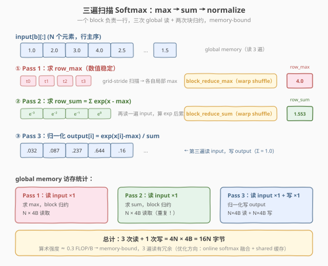
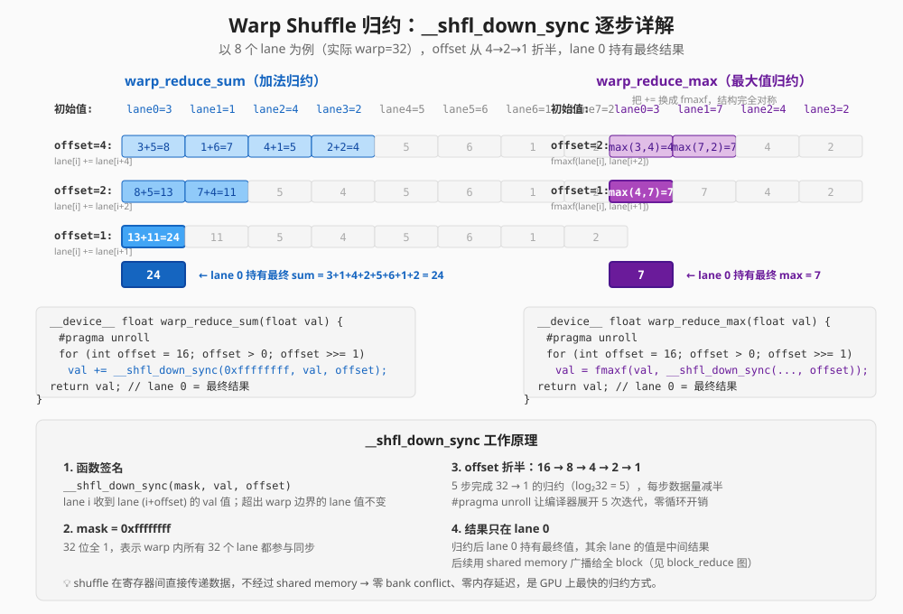
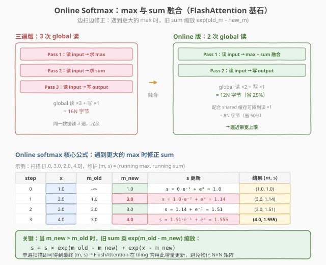

# LeetGPU Softmax 题解

> **面试考察度**：⭐⭐⭐⭐⭐ 出现频率最高的 CUDA 手撕题（见本专题 README 高频题第 1 条）
> **面试形式**：一般不要求完整可运行代码，手写 kernel + `block_size` / `grid_size` + launch 调用即可，但要能讲清每一步的动机

## 1. 题目概述

- **标题 / 题号**：Softmax（LeetGPU #5，medium）
- **链接**：https://leetgpu.com/challenges/softmax
- **难度**：中等（面试中属于"必须 5 分钟写出来"的基础题）
- **标签**：CUDA、Softmax、safe softmax、三遍扫描、warp shuffle reduce、memory-bound、数值稳定性

**题意**：给定 `M` 行 `D` 列的 `float32` 矩阵 `x`（行主序），对**每一行独立**做 softmax：

$$y_i = \frac{\exp(x_i - m)}{\sum_{j=0}^{D-1} \exp(x_j - m)}, \qquad m = \max_j x_j$$

**面试要点**（面试官真正想考察的三件事）：

1. **数值稳定性**：必须减行最大值 `m`（safe softmax），否则 `exp` 溢出 → `Inf/Inf = NaN`。面试中不写减 max 直接挂。
2. **归约基本功**：行内 `max` 和 `sum` 是两次块归约，warp shuffle 写法要形成肌肉记忆。
3. **并行映射**：一个 block 负责一行，能讲清为什么这样映射（行间天然并行、行内需归约）。

**示例**（单行 `D=4`）：

```text
输入：    [1.0, 2.0, 3.0, 4.0]
max   m = 4.0
x - m = [-3, -2, -1, 0]
exp   = [0.0498, 0.1353, 0.3679, 1.0000]   sum = 1.5530
output= [0.0321, 0.0871, 0.2369, 0.6439]
```

> 💡 **为什么必须减 max？** 利用 softmax 的平移不变性 $\text{softmax}(x) = \text{softmax}(x - c)$，减去行最大值后所有指数 $\le 0$，$\exp(x_i - m) \in (0, 1]$ 任何精度下都不溢出，且数学结果与朴素版完全相同——"免费的稳定性"。FP16 下 `exp(11.1)` 就超过上界 65504，所以 safe softmax 不是可选优化，是所有正确实现的标配。

## 2. CPU 基线 / 朴素 GPU 方法

### 2.1 CPU 串行基线

```cpp
// cpu_baseline.cpp —— CPU 串行 safe softmax，每行三遍扫描
void softmax_cpu(const float* x, float* y, int M, int D) {
    for (int r = 0; r < M; ++r) {
        const float* xr = x + r * D;
        float* yr = y + r * D;
        float m = xr[0];                                // ① 求 max
        for (int i = 1; i < D; ++i) m = fmaxf(m, xr[i]);
        float s = 0.0f;                                 // ② 求 sum(exp(x - m))
        for (int i = 0; i < D; ++i) s += expf(xr[i] - m);
        for (int i = 0; i < D; ++i)                     // ③ 归一化
            yr[i] = expf(xr[i] - m) / s;
    }
}
```

每行三遍 `O(D)`，总计 `O(M×D)`。三遍扫描的结构（max → sum → normalize）在 GPU 版中原样保留。

### 2.2 朴素 GPU 的两个坑

```cuda
// 错误示范：每线程独立扫整行 + 不减 max
__global__ void softmax_naive(const float* x, float* y, int M, int D) {
    int r = blockIdx.x, i = threadIdx.x;
    if (i >= D) return;
    float s = 0.0f;
    for (int j = 0; j < D; ++j)
        s += expf(x[r * D + j]);            // ← 坑 1：exp 溢出 → NaN
    y[r * D + i] = expf(x[r * D + i]) / s;  // ← 坑 2：每线程重扫整行，O(D²) 访存
}
```

1. **数值溢出**：不减 max，`exp(12)` 在 FP16 下直接 `Inf`，整行输出 `NaN`；
2. **重复读**：每个 thread 独立求 `sum`，一行被读 `D` 次，`O(D²)` 访存——正确做法是**块内协作归约一次、广播复用**。

## 3. GPU 设计

### 3.1 并行化策略：一个 block 负责一行

**核心映射**：`blockIdx.x → 行号 r`，grid = `M` 个 block，block 内 256 个 thread 协作处理该行的 `D` 个元素。每个 block 执行**三遍扫描**，前两遍各做一次块归约：

| Pass | 扫描内容 | 块归约 | 产出 |
|------|----------|--------|------|
| ① max | 扫行找最大值 | `block_reduce_max` | `row_max`（广播给全 block） |
| ② sum | 扫行算 `exp(x - row_max)` 求和 | `block_reduce_sum` | `row_sum`（广播） |
| ③ normalize | 再扫行写 `y = exp(x - row_max) / row_sum` | 无 | 输出 |



> 💡 **为什么按行分 block？** 行间天然独立、无依赖，正好映射到 block 维；行内的 `max`/`sum` 是归约，正好用 block 内线程协作 + warp shuffle 解决。这个"行间 block 并行、行内块归约"的映射是 softmax / layernorm / rmsnorm 一整族 norm kernel 的通用骨架。

### 3.2 存储层次使用

| 层次 | 是否使用 | 说明 |
|------|----------|------|
| **global memory** | ✓ | `x` 读 3 遍（max / sum / normalize）、`y` 写 1 遍 |
| **shared memory** | ✓ | warp 间归约汇总 `shared[NUM_WARPS]` + 广播槽 `shared[0]` |
| **register** | ✓ | 每线程 `local_max` / `local_sum` + warp shuffle 寄存器交换 |

### 3.3 关键技巧：一个归约模板，max/sum 通用

两次块归约共用同一套积木：`warp_reduce_*`（warp 内 `__shfl_down_sync` 折半归约）+ `block_reduce_*`（warp 间 shared 汇总 + 第一个 warp 再归约 + 广播）。sum 版和 max 版**几乎逐行对称**——把 `+=` 换成 `fmaxf`、初值 `0.0f` 换成 `-INFINITY` 即可。



> 💡 **面试加分点**：能脱口而出"`__shfl_down_sync` 在寄存器间直接传数据，不过 shared memory，零 bank conflict，warp 内 32 个 lane 归约只需 `log₂32 = 5` 步"。

## 4. Kernel 实现

完整可编译的 safe softmax（一个 block 一行 + warp shuffle 双归约 + 三遍扫描）：

```cuda
// cuda_softmax.cu —— 手撕 Softmax：三遍扫描（max → sum(exp) → normalize），safe softmax
// 编译命令: nvcc -O3 -arch=sm_120 cuda_softmax.cu -o softmax -lineinfo
// 运行:     ./softmax 128 8192

#include <cstdio>
#include <cstdlib>
#include <cmath>
#include <cuda_runtime.h>

#define CHECK_CUDA(call)                                                       \
    do {                                                                       \
        cudaError_t e = (call);                                                \
        if (e != cudaSuccess) {                                                \
            fprintf(stderr, "CUDA error %s:%d: %s\n", __FILE__, __LINE__,      \
                    cudaGetErrorString(e));                                    \
            exit(EXIT_FAILURE);                                                \
        }                                                                      \
    } while (0)

#define BLOCK_SIZE 256
#define WARP_SIZE 32
#define NUM_WARPS (BLOCK_SIZE / WARP_SIZE) // 8

// ---- warp 级归约：sum ----
__inline__ __device__ float warp_reduce_sum(float val) {
    #pragma unroll
    for (int offset = WARP_SIZE / 2; offset > 0; offset >>= 1)
        val += __shfl_down_sync(0xffffffff, val, offset);
    return val;
}

// ---- warp 级归约：max（把 + 换成 fmaxf）----
__inline__ __device__ float warp_reduce_max(float val) {
    #pragma unroll
    for (int offset = WARP_SIZE / 2; offset > 0; offset >>= 1)
        val = fmaxf(val, __shfl_down_sync(0xffffffff, val, offset));
    return val;
}

// ---- block 级归约：sum（warp shuffle + shared 汇总 + 广播）----
__inline__ __device__ float block_reduce_sum(float val, float* shared) {
    int lane = threadIdx.x & (WARP_SIZE - 1);
    int warpId = threadIdx.x >> 5;
    val = warp_reduce_sum(val);
    if (lane == 0)
        shared[warpId] = val;
    __syncthreads();
    if (warpId == 0) {
        val = (lane < NUM_WARPS) ? shared[lane] : 0.0f;
        val = warp_reduce_sum(val);
        if (lane == 0)
            shared[0] = val; // 广播槽
    }
    __syncthreads();
    return shared[0];
}

// ---- block 级归约：max（同结构，幺元为 -INFINITY）----
__inline__ __device__ float block_reduce_max(float val, float* shared) {
    int lane = threadIdx.x & (WARP_SIZE - 1);
    int warpId = threadIdx.x >> 5;
    val = warp_reduce_max(val);
    if (lane == 0)
        shared[warpId] = val;
    __syncthreads();
    if (warpId == 0) {
        val = (lane < NUM_WARPS) ? shared[lane] : -INFINITY;
        val = warp_reduce_max(val);
        if (lane == 0)
            shared[0] = val; // 广播槽
    }
    __syncthreads();
    return shared[0];
}

// ---- Softmax kernel：一个 block 负责一行，三遍扫描 ----
__global__ void softmax_kernel(const float* __restrict__ x,
                               float* __restrict__ y, int M, int D) {
    __shared__ float shared[NUM_WARPS + 1];

    int r = blockIdx.x;
    if (r >= M)
        return;
    const float* xr = x + r * D;
    float* yr = y + r * D;

    // ---- Pass 1：求 row_max（safe softmax 的关键）----
    float local_max = -INFINITY;
    for (int i = threadIdx.x; i < D; i += BLOCK_SIZE)
        local_max = fmaxf(local_max, xr[i]);
    float row_max = block_reduce_max(local_max, shared);

    __syncthreads(); // 等所有线程读完广播槽，再复用 shared 数组

    // ---- Pass 2：求 row_sum = Σ exp(x - row_max) ----
    float local_sum = 0.0f;
    for (int i = threadIdx.x; i < D; i += BLOCK_SIZE)
        local_sum += expf(xr[i] - row_max);
    float row_sum = block_reduce_sum(local_sum, shared);
    float inv_sum = 1.0f / row_sum; // 乘法替代除法

    // ---- Pass 3：归一化 y = exp(x - row_max) / row_sum ----
    for (int i = threadIdx.x; i < D; i += BLOCK_SIZE)
        yr[i] = expf(xr[i] - row_max) * inv_sum;
}

int main(int argc, char** argv) {
    int M = (argc > 1) ? atoi(argv[1]) : 128;
    int D = (argc > 2) ? atoi(argv[2]) : 8192;
    size_t bytes = (size_t)M * D * sizeof(float);
    printf("M=%d, D=%d  (%.1f MB)\n", M, D, bytes / 1e6);

    float* hX = (float*)malloc(bytes);
    float* hY = (float*)malloc(bytes);
    srand(42);
    for (int i = 0; i < M * D; ++i)
        hX[i] = ((float)(rand() % 20000) - 10000.0f) / 1000.0f; // [-10, 10]

    float *dX, *dY;
    CHECK_CUDA(cudaMalloc(&dX, bytes));
    CHECK_CUDA(cudaMalloc(&dY, bytes));
    CHECK_CUDA(cudaMemcpy(dX, hX, bytes, cudaMemcpyHostToDevice));

    cudaEvent_t t0, t1;
    cudaEventCreate(&t0);
    cudaEventCreate(&t1);
    cudaEventRecord(t0);
    softmax_kernel<<<M, BLOCK_SIZE>>>(dX, dY, M, D);
    cudaEventRecord(t1);
    CHECK_CUDA(cudaDeviceSynchronize());
    float ms = 0.0f;
    cudaEventElapsedTime(&ms, t0, t1);
    printf("kernel time: %.3f ms\n", ms);
    printf("effective bandwidth: %.1f GB/s\n",
           (4.0f * bytes) / 1e9 / (ms / 1e3)); // 3 遍读 x + 1 遍写 y

    // ---- 验证：CPU 用 double 累加做参考 ----
    CHECK_CUDA(cudaMemcpy(hY, dY, bytes, cudaMemcpyDeviceToHost));
    float maxDiff = 0.0f;
    for (int r = 0; r < M; ++r) {
        float m = hX[r * D];
        for (int i = 1; i < D; ++i)
            m = fmaxf(m, hX[r * D + i]);
        double s = 0.0;
        for (int i = 0; i < D; ++i)
            s += exp((double)hX[r * D + i] - m);
        for (int i = 0; i < D; ++i) {
            float ref = (float)(exp((double)hX[r * D + i] - m) / s);
            maxDiff = fmaxf(maxDiff, fabsf(hY[r * D + i] - ref));
        }
    }
    printf("max diff: %.2e (%s)\n", maxDiff, maxDiff < 1e-5f ? "PASS" : "FAIL");

    CHECK_CUDA(cudaFree(dX));
    CHECK_CUDA(cudaFree(dY));
    free(hX);
    free(hY);
    return 0;
}
```

### 4.1 面试手写版（kernel + launch）

面试现场通常只要求写 kernel 和 launch，上面 `main()` 的样板不用写。真正要默写出来的就是这 30 行：

```cuda
// 面试手写版：grid = M（一行一个 block），block = 256
__global__ void softmax_kernel(const float* __restrict__ x,
                               float* __restrict__ y, int M, int D) {
    __shared__ float shared[NUM_WARPS + 1];
    const float* xr = x + blockIdx.x * D;   // 本 block 负责的行
    float* yr = y + blockIdx.x * D;

    float local_max = -INFINITY;            // Pass 1: 行 max
    for (int i = threadIdx.x; i < D; i += BLOCK_SIZE)
        local_max = fmaxf(local_max, xr[i]);
    float row_max = block_reduce_max(local_max, shared);
    __syncthreads();

    float local_sum = 0.0f;                 // Pass 2: sum(exp(x - max))
    for (int i = threadIdx.x; i < D; i += BLOCK_SIZE)
        local_sum += expf(xr[i] - row_max);
    float row_sum = block_reduce_sum(local_sum, shared);

    float inv_sum = 1.0f / row_sum;         // Pass 3: 归一化
    for (int i = threadIdx.x; i < D; i += BLOCK_SIZE)
        yr[i] = expf(xr[i] - row_max) * inv_sum;
}

// launch：一行一个 block
softmax_kernel<<<M, 256>>>(x, y, M, D);
```

> ⚠️ **面试易错点**：① 忘记减 max；② `__shfl_down_sync` 的 mask 写错（固定 `0xffffffff`）；③ 两次归约之间漏了 `__syncthreads()`（复用 `shared` 数组前必须等全员读完广播槽）；④ `block_reduce` 里 lane 8~31 的默认值写错（sum 用 `0.0f`，max 用 `-INFINITY`）。

### 4.2 代码详解

kernel 的本质是**两遍归约 + 一遍逐元素写回**，归约由两级积木组成：warp 内 shuffle 归约 → warp 间 shared 汇总广播。

| 步骤 | 代码 | 说明 |
|------|------|------|
| **行映射** | `xr = x + blockIdx.x * D` | `blockIdx.x` 即行号，行间天然并行 |
| **块内分摊** | `for (i = threadIdx.x; i < D; i += BLOCK_SIZE)` | grid-stride loop，256 线程把 `D` 个元素分摊，各攒 `local_max` / `local_sum` |
| **warp 归约** | `__shfl_down_sync(0xffffffff, val, offset)` | offset 16→8→4→2→1 折半，5 步后 lane 0 持有 warp 结果 |
| **warp 间汇总** | `if (lane == 0) shared[warpId] = val` | 8 个 warp 的结果写入 `shared[0..7]` |
| **最终归约** | warp 0 读 `shared[0..7]` 再 shuffle 一次 | 结果写 `shared[0]` 广播槽 |
| **广播** | `return shared[0]` | 全 block 读到同一个 `row_max` / `row_sum` |
| **写回** | `yr[i] = expf(xr[i] - row_max) * inv_sum` | 乘法替代除法（GPU 上快 ~4 倍），各线程独立写、无需再同步 |

**关键索引关系**：

- `lane = threadIdx.x & 31` — 线程在 warp 内的编号
- `warpId = threadIdx.x >> 5` — 线程所在 warp 编号（256 线程 = 8 warp）
- 归约完成后**只有 lane 0** 持有正确结果，必须经 shared 广播给全 block

**两次 `__syncthreads()` 各等什么**（`block_reduce_*` 内部）：

1. 第一次：等 8 个 warp 都写完 `shared[warpId]` → 否则 warp 0 读到旧值；
2. 第二次：等 warp 0 写完 `shared[0]` → 否则其他 warp 读到旧的广播值。

> 💡 **关键洞察**：softmax 的三遍扫描结构是**数值稳定性强制的**——必须先扫出 `max` 才能安全地算 `exp`，所以 max 和 sum 无法简单合并（除非用 online softmax 的递推修正，见 §5.3）。这也是它比 RMSNorm（只需一次归约）多一遍扫描的根本原因。

## 5. 性能分析与优化

### 5.1 编译与运行

```bash
nvcc -O3 -arch=sm_120 cuda_softmax.cu -o softmax -lineinfo
./softmax 128 8192
```

参考输出（RTX 5090，来自 `leetgpu/week2/day4` 同版 kernel 实测）：

```text
M=128, D=8192  (4.0 MB)
kernel time: 0.28 ms
effective bandwidth: 57.1 GB/s
max diff: 8.34e-08 (PASS)
```

### 5.2 用 ncu 确认 memory-bound

```bash
ncu --kernel-name regex:softmax_kernel \
    --metrics gpu__time_duration.sum, \
              dram__throughput.avg.pct_of_peak_sustained_elapsed, \
              sm__throughput.avg.pct_of_peak_sustained_elapsed, \
              smsp__average_warps_issue_stalled_long_scoreboard.pct \
    ./softmax 128 8192
```

| 指标 | 含义 | 典型值 | 判读 |
|------|------|--------|------|
| `dram__throughput` | HBM 带宽占比 | ~40-55% | 远高于 SM 利用率 |
| `sm__throughput` | SM 算力占比 | ~6-12% | 算术强度极低，SM 大量空闲 |
| `long_scoreboard` | 等访存 stall | ~45-55% | 3 遍 global 读的代价 |

`DRAM% >> SM%` → **memory-bound**，优化方向是**减访存遍数、减字节数**，不是加算力。

### 5.3 进阶：online softmax（面试高频追问）

三遍扫描能否压成两遍？可以——这就是 FlashAttention 的核心思想 **online softmax**：把 max 和 sum 融合到同一遍扫描，每处理一个分块就增量修正：

$$m_{\text{new}} = \max(m_{\text{old}}, m_{\text{block}}), \qquad s_{\text{new}} = s_{\text{old}} \cdot e^{m_{\text{old}} - m_{\text{new}}} + s_{\text{block}} \cdot e^{m_{\text{block}} - m_{\text{new}}}$$

旧的部分和乘以修正因子 $e^{m_{\text{old}} - m_{\text{new}}}$ 重新对齐到新最大值，最后一遍只做归一化写回——global 读从 3 遍降到 2 遍。



**Worked example**（`x = [1, 3, 2]`，逐元素递推）：

| 步骤 | 读入 | `m` | `s`（已对齐到当前 `m`） |
|------|------|-----|------------------------|
| 初始 | — | `-inf` | `0` |
| 读 `1` | `x₀=1` | `1` | `0·e^{-inf-1} + e^{1-1} = 1` |
| 读 `3` | `x₁=3` | `3` | `1·e^{1-3} + e^{3-3} = e^{-2}+1 ≈ 1.135` |
| 读 `2` | `x₂=2` | `3` | `1.135·e^{0} + e^{2-3} ≈ 1.135+0.368 = 1.503` |

最终 `y = [e^{1-3}, e^{3-3}, e^{2-3}] / 1.503 ≈ [0.090, 0.665, 0.245]`，与三遍版一致。

### 5.4 其他优化方向

1. **shared memory 缓存整行**：`D ≤ 4096` 时整行进 shared，global 读降到 1 遍；
2. **float4 向量化访存**：一次读 16B，减少内存事务数；
3. **FP16 存储 + FP32 归约**：HBM 字节数减半，但 `exp` 与累加必须 FP32 保精度；
4. **kernel fusion**：把 softmax 融进下游 GEMM（FlashAttention 的动机），省掉 `y` 的写回。

## 6. 复杂度分析

| 维度 | 分析 |
|------|------|
| **时间复杂度** | `O(M×D)`：每行三遍 `O(D)` 扫描 |
| **空间复杂度** | `O(M×D)` 输入/输出 + `O(NUM_WARPS)` shared |
| **算术强度（理论下界）** | `~3 FLOP / 8B ≈ 0.375 FLOP/Byte`（1 读 + 1 写） |
| **算术强度（三遍实现）** | `~3 FLOP / 16B ≈ 0.19 FLOP/Byte`（3 读 + 1 写） |
| **瓶颈类型** | **memory-bound**：AI 远低于 ridge point（~12.6），`DRAM% >> SM%` |
| **块归约次数** | 每行 **2 次**（max + sum），比 RMSNorm（1 次）多一次 |
| **warp shuffle 步数** | 每次块归约 `log₂32 = 5` 步，两次共 10 步 |

> 💡 **一句话总结**：Softmax = "两次块归约（max + sum）+ 一次归一化"，safe softmax（减 max）决定三遍结构，warp shuffle 归约是基本功。它是 memory-bound 的教科书样本，优化主线是减遍数（online softmax 3→2 遍）、减字节（FP16）、做融合（FlashAttention）。掌握这个骨架，RMSNorm / LayerNorm 就是"删一个 reduce / 换一组统计量"的变体。

## 面试考点

- **手撕要求**：5 分钟默写"一个 block 一行 + 三遍扫描"骨架——`blockIdx.x` 映射行号、grid-stride loop 分摊行内元素、两次块归约（max + sum）+ 一次归一化写回；`warp_reduce` / `block_reduce` 两级归约模板（`__shfl_down_sync` + shared 广播）必须形成肌肉记忆。
- **高频追问**：
  - **为什么要减 max？** 平移不变性保证结果不变，减 max 后 `exp(x - m) ∈ (0, 1]` 永不溢出——safe softmax 是标配不是优化。
  - **`__syncthreads()` 什么时候需要？** 块归约内两次（等 8 个 warp 写完 `shared[warpId]`、等 warp 0 写完广播槽 `shared[0]`），两次归约之间还要一次（复用 shared 数组前等全员读完广播槽）；缺任一次都是数据竞争。
  - **为什么 max 归约的默认值是 `-INFINITY`？** max 的幺元是负无穷，sum 的幺元是 0；写反会导致空 warp 污染结果。
  - **为什么用 shuffle 不用 shared memory 做 warp 内归约？** shuffle 走寄存器直连，不过 shared memory，零 bank conflict，5 步完成 32 lane 归约。
  - **还能怎么优化？** online softmax 把 3 遍读压成 2 遍（FlashAttention 的核心递推）、shared 缓存整行降到 1 遍、float4 向量化、FP16 存储 + FP32 归约。
- **进阶延伸**：online softmax 的分块递推公式 $s_{\text{new}} = s_{\text{old}} \cdot e^{m_{\text{old}} - m_{\text{new}}} + s_{\text{block}} \cdot e^{m_{\text{block}} - m_{\text{new}}}$ 是 FlashAttention 的基础；RMSNorm / LayerNorm 是同一骨架换统计量的变体，能当场从 softmax 改写出来是加分项。

## 同类练习题

下面是与本题考查相同 CUDA 概念的 LeetGPU 练习题，建议按顺序挑战：

| # | 题目 | 难度 | 与本题的关联 |
|---|------|------|-------------|
| 50 | [RMS Normalization](https://leetgpu.com/challenges/rms-normalization) | 中等 | RMS Norm，归约 + 归一化变体 |
| 6 | [Softmax Attention](https://leetgpu.com/challenges/softmax-attention) | 中等 | fused softmax+matmul，数值稳定进阶 |
| 4 | [Reduction](https://leetgpu.com/challenges/reduction) | 中等 | 树形归约，softmax 的基础组件 |
| 40 | [Batch Normalization](https://leetgpu.com/challenges/batch-normalization) | 中等 | Batch Norm，mean/var 归约归一化 |

> 💡 **选题思路**：三遍 kernel + 数值稳定，练习归约与归一化的融合。做完这组练习，即可掌握该 CUDA 模板在不同场景下的迁移应用。
