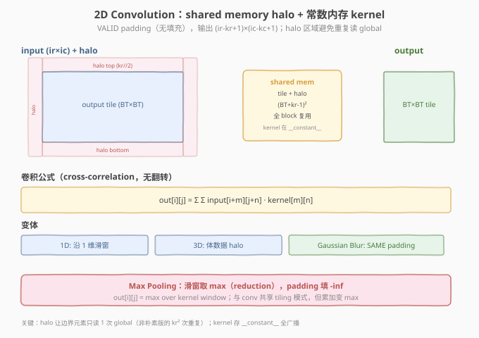

# LeetGPU 2D Max Pooling 题解

> **面试考察度**：⭐⭐⭐ 滑窗 reduction，与 conv 共享 tiling 模式但累加变 max；CV 部署基础
> **面试形式**：手写 max pooling + 讲清"padding 填 -inf 的 torch 语义"

## 1. 题目概述

- **标题 / 题号**：2D Max Pooling（LeetGPU #42，medium）
- **链接**：https://leetgpu.com/challenges/2d-max-pooling
- **难度**：中等
- **标签**：CUDA、Pooling、滑窗 reduction、padding、memory-bound

**题意**：`F.max_pool2d` over `(N, C, H, W)`，`kernel_size`、`stride`、`padding`。`H_out = (H + 2p - k) // s + 1`。padding 填 `-inf`（torch 语义，max 忽略）。输出展平。FP32，签名 `solve(const float* input, float* output, int N, int C, int H, int W, int kernel_size, int stride, int padding)`。容差 `1e-5`，性能测例 `N=4, C=64, H=W=256, k=3, s=2, p=1`。

## 2-4. 设计与实现

每输出像素在 `k×k` 窗口取 max（reduction）。朴素版每 thread 算一个输出，扫 `k×k` 窗口。padding 区域读 `-inf`（不参与 max）。



```cuda
// 2d_max_pooling_submit.cu
#include <cuda_runtime.h>

__global__ void maxpool2d_kernel(const float* input, float* output,
                                 int N, int C, int H, int W, int k, int s, int p) {
    int H_out = (H + 2*p - k) / s + 1;
    int W_out = (W + 2*p - k) / s + 1;
    int idx = blockIdx.x * blockDim.x + threadIdx.x;
    int total = N * C * H_out * W_out;
    if (idx >= total) return;

    int n = idx / (C * H_out * W_out);
    int c = (idx / (H_out * W_out)) % C;
    int oh = (idx / W_out) % H_out;
    int ow = idx % W_out;

    float maxval = -INFINITY;
    for (int kh = 0; kh < k; ++kh)
        for (int kw = 0; kw < k; ++kw) {
            int ih = oh * s - p + kh;
            int iw = ow * s - p + kw;
            if (ih >= 0 && ih < H && iw >= 0 && iw < W) {
                float v = input[((n * C + c) * H + ih) * W + iw];
                maxval = fmaxf(maxval, v);
            }
            // padding 区域：-inf，不更新 maxval
        }
    output[idx] = maxval;
}

extern "C" void solve(const float* input, float* output, int N, int C, int H, int W,
                      int kernel_size, int stride, int padding) {
    int H_out = (H + 2*padding - kernel_size) / stride + 1;
    int W_out = (W + 2*padding - kernel_size) / stride + 1;
    int total = N * C * H_out * W_out;
    int block = 256, grid = (total + block - 1) / block;
    maxpool2d_kernel<<<grid, block>>>(input, output, N, C, H, W, kernel_size, stride, padding);
}
```

### 4.1 代码详解

| 步骤 | 代码 | 说明 |
|------|------|------|
| **输出映射** | `(n, c, oh, ow)` | 每 thread 算一个输出 |
| **窗口 max** | `fmaxf(maxval, v)` | `k×k` 窗口取 max（reduction） |
| **padding** | `if (ih>=0 && ih<H && ...)` | 越界跳过（等价 `-inf`） |

> 💡 **关键洞察**：max pooling = "conv 的累加变 max"。padding 填 `-inf` 是 torch 语义——max 运算的幺元是 `-inf`（对应 sum 的 0），越界窗口不参与 max。与 conv 共享 tiling 模式。

## 5-6. 性能与复杂度

`O(N·C·H_out·W_out·k²)`，memory-bound。`k` 小时（3×3）朴素版够用。

> 💡 **一句话总结**：2D Max Pooling = "滑窗 max reduction + padding 填 -inf"，与 conv 共享 tiling 骨架。

## 面试考点

- **手撕要求**：默写 max pooling + 讲清 padding `-inf` 语义。
- **高频追问**：为什么 padding 填 `-inf`（max 幺元）；与 conv 的 tiling 对比（累加 vs max）；stride/padding 公式。

## 同类练习题

下面是与本题考查相同 CUDA 概念的 LeetGPU 练习题，建议按顺序挑战：

| # | 题目 | 难度 | 与本题的关联 |
|---|------|------|-------------|
| 10 | [2D Convolution](https://leetgpu.com/challenges/2d-convolution) | 中等 | 2D shared memory halo + tiling |
| 9 | [1D Convolution](https://leetgpu.com/challenges/1d-convolution) | 简单 | 1D 卷积，halo 基础 |
| 28 | [Gaussian Blur](https://leetgpu.com/challenges/gaussian-blur) | 中等 | 可分离卷积，滑窗模式 |
| 90 | [Causal Depthwise Conv1d](https://leetgpu.com/challenges/causal-depthwise-conv1d) | 中等 | 因果卷积变体 |

> 💡 **选题思路**：滑窗 reduction，练习 2D 索引映射与 padding 边界处理。做完这组练习，即可掌握该 CUDA 模板在不同场景下的迁移应用。
