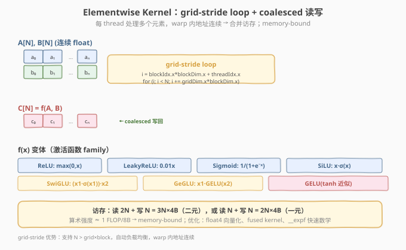

# LeetGPU Vector Addition 题解

> **面试考察度**：⭐⭐⭐ 最基础的 CUDA 入门题，面试偶尔作为热身；百度一面考过，追问 float4 向量化
> **面试形式**：手写 grid-stride loop + 讲清"为什么 grid 除 4 而非 block 除 4"

## 1. 题目概述

- **标题 / 题号**：Vector Addition（LeetGPU #1，easy）
- **链接**：https://leetgpu.com/challenges/vector-addition
- **难度**：简单
- **标签**：CUDA、elementwise、grid-stride loop、coalesced、memory-bound

**题意**：`C[i] = A[i] + B[i]`，长度 `N` 的 FP32 数组。签名 `extern "C" void solve(const float* A, const float* B, float* C, size_t N)`（注意 `N` 是 `size_t`）。容差 `1e-5`，性能测例 `N=25,000,000`。

## 2-3. CPU 基线与 GPU 设计

CPU 串行 `for` 循环。GPU：grid-stride loop，每 thread 处理多个元素，warp 内地址连续 → coalesced。纯 memory-bound（`1 FLOP / 12B`）。



## 4. Kernel 实现

```cuda
// vector_addition_submit.cu
#include <cuda_runtime.h>
#include <cstdint>

__global__ void vec_add_kernel(const float* A, const float* B, float* C, size_t N) {
    size_t tid = blockIdx.x * blockDim.x + threadIdx.x;
    size_t stride = gridDim.x * blockDim.x;
    for (size_t i = tid; i < N; i += stride)
        C[i] = A[i] + B[i];
}

extern "C" void solve(const float* A, const float* B, float* C, size_t N) {
    int block = 256;
    int grid = min((int)((N + block - 1) / block), 4096);
    vec_add_kernel<<<grid, block>>>(A, B, C, N);
}
```

### 4.1 代码详解

| 步骤 | 代码 | 说明 |
|------|------|------|
| **grid-stride** | `for (i = tid; i < N; i += stride)` | 支持 N > grid×block，自动负载均衡 |
| **加法** | `C[i] = A[i] + B[i]` | warp 内 32 lane 地址连续 → coalesced |

> 💡 **关键洞察**：grid-stride loop 是所有 elementwise kernel 的通用骨架——支持任意 N、自动负载均衡、warp 内连续访存。float4 向量化时 grid 除 4（每 thread 读 4 元素），block 不除 4（否则降 occupancy）。

## 5-6. 性能与复杂度

`O(N)`，`1 FLOP / 12B` ≈ `0.08 FLOP/Byte`，纯 memory-bound。优化：float4 向量化、fused（与后续 op 合并）。

> 💡 **一句话总结**：Vector Addition = "grid-stride + coalesced" 的最简形态，是所有 elementwise kernel 的祖代码。

## 面试考点

- **手撕要求**：默写 grid-stride loop。
- **高频追问**：float4 向量化时 grid 除 4 不是 block 除 4（降 occupancy）；grid-stride 优势（支持任意 N）。

## 同类练习题

下面是与本题考查相同 CUDA 概念的 LeetGPU 练习题，建议按顺序挑战：

| # | 题目 | 难度 | 与本题的关联 |
|---|------|------|-------------|
| 21 | [ReLU](https://leetgpu.com/challenges/relu) | 简单 | 同为逐元素 kernel，多了分支判断 |
| 31 | [Matrix Copy](https://leetgpu.com/challenges/matrix-copy) | 简单 | 纯拷贝，专注带宽优化与 float4 |
| 68 | [Sigmoid](https://leetgpu.com/challenges/sigmoid) | 简单 | 数学函数逐元素，练习 fused kernel 思想 |
| 63 | [Interleave](https://leetgpu.com/challenges/interleave) | 简单 | 写索引映射练习，coalesced 写回 |

> 💡 **选题思路**：memory-bound 逐元素 kernel，练习 grid-stride loop 与合并访存。做完这组练习，即可掌握该 CUDA 模板在不同场景下的迁移应用。
