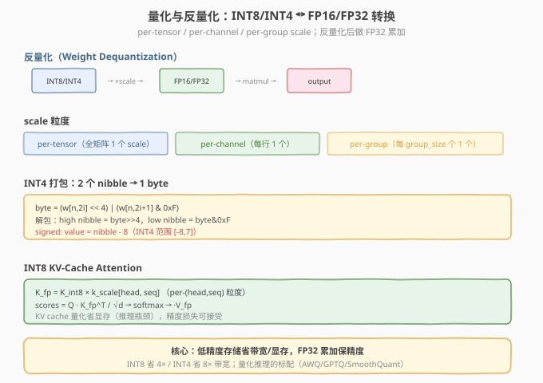

# LeetGPU Weight Dequantization 题解

> **面试考察度**：⭐⭐⭐⭐ 量化反量化是推理优化的基础操作，面试常考"per-group scale 怎么索引"
> **面试形式**：手写 + 讲清"block-wise dequant 与 scale 粒度"

## 1. 题目概述

- **标题 / 题号**：Weight Dequantization（LeetGPU #64，medium）
- **链接**：https://leetgpu.com/challenges/weight-dequantization
- **难度**：中等
- **标签**：CUDA、量化、反量化、per-group scale、elementwise、memory-bound

**题意**：分块反量化 `Y = X * S_expanded`。`X` 为 `(M, N)` FP32，`S` 为 `(ceil(M/TILE), ceil(N/TILE))` FP32（每 `TILE×TILE` 块一个 scale，在块内重复）。`Y[m][n] = X[m][n] * S[m/TILE][n/TILE]`。签名 `solve(const float* X, const float* S, float* Y, int M, int N, int TILE_SIZE)`。容差 `1e-5`，性能测例 `M=N=8192, TILE_SIZE=128`。

## 2-4. 设计与实现

elementwise kernel，每元素查对应块的 scale 相乘。`scale_idx = (m/TILE) * ceil(N/TILE) + (n/TILE)`。



```cuda
// weight_dequantization_submit.cu
#include <cuda_runtime.h>

__global__ void dequant_kernel(const float* X, const float* S, float* Y,
                               int M, int N, int TILE) {
    int m = blockIdx.y * blockDim.y + threadIdx.y;
    int n = blockIdx.x * blockDim.x + threadIdx.x;
    if (m >= M || n >= N) return;
    int s_m = m / TILE;
    int s_n = n / TILE;
    int s_cols = (N + TILE - 1) / TILE;
    float scale = S[s_m * s_cols + s_n];
    Y[m * N + n] = X[m * N + n] * scale;
}

extern "C" void solve(const float* X, const float* S, float* Y, int M, int N, int TILE_SIZE) {
    dim3 block(16, 16);
    dim3 grid((N + 15) / 16, (M + 15) / 16);
    dequant_kernel<<<grid, block>>>(X, S, Y, M, N, TILE_SIZE);
}
```

### 4.1 代码详解

| 步骤 | 代码 | 说明 |
|------|------|------|
| **scale 索引** | `S[m/TILE][n/TILE]` | 每 TILE×TILE 块共享一个 scale |
| **乘法** | `Y[m][n] = X[m][n] * scale` | 反量化 |

> 💡 **关键洞察**：per-group scale 的索引 `S[m/TILE][n/TILE]` 是量化推理的核心——每 `TILE×TILE` 块一个 scale，在块内所有元素共享。这与 AWQ/GPTQ 的 group_size 概念一致。

## 5-6. 性能与复杂度

`O(M·N)`，读 `X+S` 写 `Y`，memory-bound。优化：与下游 GEMM 融合（反量化在 GEMM epilogue）。

> 💡 **一句话总结**：Weight Dequantization = "per-group scale 索引 + elementwise 乘"，量化推理的基础操作。

## 面试考点

- **手撕要求**：默写 per-group scale 索引。
- **高频追问**：per-tensor/per-channel/per-group 区别；group_size 对精度的影响；为什么与 GEMM 融合（省中间 tensor）。

## 同类练习题

下面是与本题考查相同 CUDA 概念的 LeetGPU 练习题，建议按顺序挑战：

| # | 题目 | 难度 | 与本题的关联 |
|---|------|------|-------------|
| 32 | [INT8 Quantized MatMul](https://leetgpu.com/challenges/int8-quantized-matmul) | 中等 | 量化计算的应用 |
| 81 | [INT4 MatMul](https://leetgpu.com/challenges/int4-matmul) | 中等 | 4-bit 打包反量化 |
| 96 | [INT8 KV-Cache Attention](https://leetgpu.com/challenges/int8-kv-cache-attention) | 困难 | 量化 attention 应用 |
| 85 | [LoRA Linear](https://leetgpu.com/challenges/lora-linear) | 中等 | 低秩 + 量化推理 |

> 💡 **选题思路**：量化反量化到 fp16/fp32，练习低精度推理的基础操作。做完这组练习，即可掌握该 CUDA 模板在不同场景下的迁移应用。
