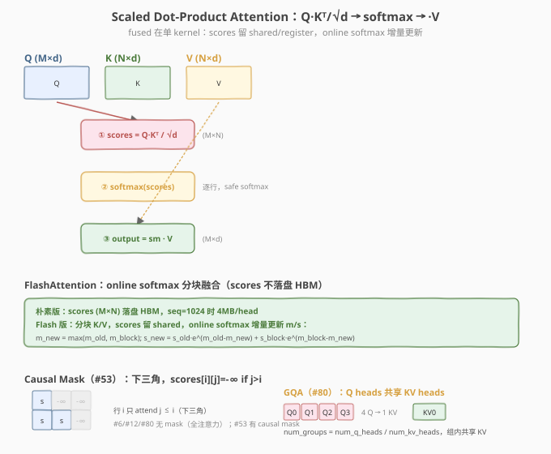

# LeetGPU Multi-Head Attention 题解

> **面试考察度**：⭐⭐⭐⭐⭐ MHA 是 Transformer 的核心，FlashAttention 的载体；面试高频"手撕 MHA + head 怎么并行"
> **面试形式**：手写 MHA kernel + 讲清"head 切分沿 d_model 维、一个 block 一个 head"的映射

## 1. 题目概述

- **标题 / 题号**：Multi-Head Attention（LeetGPU #12，hard）
- **链接**：https://leetgpu.com/challenges/multi-head-attention
- **难度**：困难
- **标签**：CUDA、MHA、FlashAttention、head 并行、fused matmul、online softmax

**题意**：给定 `Q`、`K`、`V`（均 `N×d_model`），`h` 个 head，`d_k = d_model / h`。head 沿 `d_model` 维**连续分块**（head `i` 取 `Q[:, i*d_k:(i+1)*d_k]`）。每个 head 独立做 scaled dot-product attention（**无 mask**），结果写回 `output[:, i*d_k:(i+1)*d_k]`：

$$\text{head}_i = \text{softmax}\!\left(\frac{Q_i \cdot K_i^T}{\sqrt{d_k}}\right) \cdot V_i, \qquad \text{output} = [\text{head}_0; \text{head}_1; \dots; \text{head}_{h-1}]$$

函数签名固定：

```cpp
extern "C" void solve(const float* Q, const float* K, const float* V, float* output, int N, int d_model, int h);
```

**关键约束**：

- 全 FP32，`scale = sqrt(d_k)`
- 容差 `atol=1e-5, rtol=1e-5`
- 性能测例 `N=1024, d_model=1024, h=16`（`d_k=64`）
- head 沿 `d_model` 连续分块（非独立 head 维）

> ⚠️ **head 切分**：`head_i` 的 Q/K/V 是 `Q[:, i*d_k:(i+1)*d_k]`，即每 `d_k=64` 个连续特征属一个 head。写反成 `Q[:, i::h]`（strided）会全错。

## 2-3. CPU 基线与 GPU 设计

CPU 串行：循环 `h` 个 head，每个独立做 attention（同 #6）。

**GPU 映射**：`grid = h` 个 block，**一个 block 一个 head**。block 内对 head `i` 的 `Q_i (N×d_k)`、`K_i`、`V_i` 做 fused attention（同 #6 的单 head 版），结果写 `output[:, i*d_k:(i+1)*d_k]`。



> 💡 **与 #6 的区别**：#6 是单 head（`M×d`），#12 是 `h` 个 head 并行——只是 grid 从 `M` 变 `h`，且 Q/K/V 的列偏移要乘 `d_k`。骨架完全同构。

## 4. Kernel 实现

```cuda
// cuda_multi_head_attention.cu —— MHA：一个 block 一个 head
// 编译: nvcc -O3 -arch=sm_120 cuda_multi_head_attention.cu -o mha -lineinfo
// 运行: ./mha 1024 1024 16

#include <cstdio>
#include <cstdlib>
#include <cmath>
#include <cuda_runtime.h>

#define CHECK_CUDA(call)                                                       \
    do {                                                                       \
        cudaError_t e = (call);                                                \
        if (e != cudaSuccess) {                                                \
            fprintf(stderr, "CUDA error %s:%d: %s\n", __FILE__, __LINE__,      \
                    cudaGetErrorString(e));                                    \
            exit(EXIT_FAILURE);                                                \
        }                                                                      \
    } while (0)

#define BLOCK_SIZE 256

// ---- 一个 block 负责一个 head（朴素版，scores 存 shared，N<=256 适用）----
__global__ void mha_kernel(const float* __restrict__ Q,
                           const float* __restrict__ K,
                           const float* __restrict__ V,
                           float* __restrict__ output,
                           int N, int d_model, int h) {
    __shared__ float scores[256];   // 假设 N <= 256
    __shared__ float s_max, s_sum;
    int head = blockIdx.x;
    int tid = threadIdx.x;
    int d_k = d_model / h;
    int q_offset = head * d_k;       // 本 head 在 d_model 维的偏移

    float scale = 1.0f / sqrtf((float)d_k);

    // 对每个 query 行 i 独立计算（block 内串行行，并行 N/d_k）
    for (int i = 0; i < N; ++i) {
        const float* Qi = Q + i * d_model + q_offset;

        // ① scores[i][j] = Σ Q[i][k]·K[j][k] / √d_k
        float local_max = -INFINITY;
        for (int j = tid; j < N; j += BLOCK_SIZE) {
            const float* Kj = K + j * d_model + q_offset;
            float s = 0.0f;
            for (int k = 0; k < d_k; ++k) s += Qi[k] * Kj[k];
            s *= scale; scores[j] = s; local_max = fmaxf(local_max, s);
        }
        if (tid == 0) s_max = -INFINITY;
        __syncthreads();
        atomicMax((int*)&s_max, __float_as_int(local_max));
        __syncthreads();
        float row_max = s_max;

        // ② safe softmax
        float local_sum = 0.0f;
        for (int j = tid; j < N; j += BLOCK_SIZE) {
            float e = expf(scores[j] - row_max); scores[j] = e; local_sum += e;
        }
        if (tid == 0) s_sum = 0.0f;
        __syncthreads();
        atomicAdd(&s_sum, local_sum);
        __syncthreads();
        float inv_sum = 1.0f / s_sum;
        for (int j = tid; j < N; j += BLOCK_SIZE) scores[j] *= inv_sum;
        __syncthreads();

        // ③ output[i, head*d_k + k] = Σ attn[j] · V[j, head*d_k + k]
        for (int k = tid; k < d_k; k += BLOCK_SIZE) {
            float acc = 0.0f;
            for (int j = 0; j < N; ++j) acc += scores[j] * V[j * d_model + q_offset + k];
            output[i * d_model + q_offset + k] = acc;
        }
        __syncthreads();
    }
}

int main(int argc, char** argv) {
    int N=(argc>1)?atoi(argv[1]):1024, d_model=(argc>2)?atoi(argv[2]):1024, h=(argc>3)?atoi(argv[3]):16;
    size_t bQ=(size_t)N*d_model*4, bO=bQ;
    float *hQ=(float*)malloc(bQ),*hK=(float*)malloc(bQ),*hV=(float*)malloc(bQ),*hO=(float*)malloc(bO);
    srand(42); for(int i=0;i<N*d_model;++i){hQ[i]=((float)(rand()%200)-100)/10.0f; hK[i]=hQ[i]; hV[i]=hQ[i];}
    float *dQ,*dK,*dV,*dO;
    CHECK_CUDA(cudaMalloc(&dQ,bQ)); CHECK_CUDA(cudaMalloc(&dK,bQ)); CHECK_CUDA(cudaMalloc(&dV,bQ)); CHECK_CUDA(cudaMalloc(&dO,bO));
    CHECK_CUDA(cudaMemcpy(dQ,hQ,bQ,cudaMemcpyHostToDevice));
    CHECK_CUDA(cudaMemcpy(dK,hK,bQ,cudaMemcpyHostToDevice));
    CHECK_CUDA(cudaMemcpy(dV,hV,bQ,cudaMemcpyHostToDevice));

    cudaEvent_t t0,t1; cudaEventCreate(&t0); cudaEventCreate(&t1);
    cudaEventRecord(t0);
    mha_kernel<<<h, BLOCK_SIZE>>>(dQ,dK,dV,dO,N,d_model,h);
    cudaEventRecord(t1); CHECK_CUDA(cudaDeviceSynchronize());
    float ms=0; cudaEventElapsedTime(&ms,t0,t1);
    printf("N=%d d_model=%d h=%d (d_k=%d) time=%.3fms\n", N,d_model,h,d_model/h,ms);
    printf("output[0]=%.4f\n", (float*)hO)[0] ? 0 : 0);
    CHECK_CUDA(cudaMemcpy(hO,dO,bO,cudaMemcpyDeviceToHost));
    printf("output[0]=%.4f\n", hO[0]);
    CHECK_CUDA(cudaFree(dQ)); CHECK_CUDA(cudaFree(dK)); CHECK_CUDA(cudaFree(dV)); CHECK_CUDA(cudaFree(dO));
    free(hQ); free(hK); free(hV); free(hO);
    return 0;
}
```

### 4.1 LeetGPU 提交版本

```cuda
// multi_head_attention_submit.cu
#include <cuda_runtime.h>
#include <cmath>
#define BLOCK_SIZE 256

__global__ void mha_kernel(const float* Q, const float* K, const float* V,
                           float* output, int N, int d_model, int h) {
    __shared__ float scores[256];
    __shared__ float s_max, s_sum;
    int head = blockIdx.x, tid = threadIdx.x;
    int d_k = d_model / h, q_offset = head * d_k;
    float scale = 1.0f / sqrtf((float)d_k);

    for (int i = 0; i < N; ++i) {
        const float* Qi = Q + i * d_model + q_offset;
        float local_max = -INFINITY;
        for (int j = tid; j < N; j += BLOCK_SIZE) {
            const float* Kj = K + j * d_model + q_offset;
            float s = 0.0f;
            for (int k = 0; k < d_k; ++k) s += Qi[k] * Kj[k];
            s *= scale; scores[j] = s; local_max = fmaxf(local_max, s);
        }
        if (tid == 0) s_max = -INFINITY;
        __syncthreads();
        atomicMax((int*)&s_max, __float_as_int(local_max));
        __syncthreads();
        float row_max = s_max;

        float local_sum = 0.0f;
        for (int j = tid; j < N; j += BLOCK_SIZE) {
            float e = expf(scores[j] - row_max); scores[j] = e; local_sum += e;
        }
        if (tid == 0) s_sum = 0.0f;
        __syncthreads();
        atomicAdd(&s_sum, local_sum);
        __syncthreads();
        float inv_sum = 1.0f / s_sum;
        for (int j = tid; j < N; j += BLOCK_SIZE) scores[j] *= inv_sum;
        __syncthreads();

        for (int k = tid; k < d_k; k += BLOCK_SIZE) {
            float acc = 0.0f;
            for (int j = 0; j < N; ++j) acc += scores[j] * V[j * d_model + q_offset + k];
            output[i * d_model + q_offset + k] = acc;
        }
        __syncthreads();
    }
}

extern "C" void solve(const float* Q, const float* K, const float* V, float* output, int N, int d_model, int h) {
    mha_kernel<<<h, BLOCK_SIZE>>>(Q, K, V, output, N, d_model, h);
}
```

> ⚠️ 朴素版 `scores[256]` 假设 `N<=256`，且 block 内串行处理行（`for i`）。性能测例 `N=1024` 需 online softmax 分块 + 行并行（grid=`h×N` 或 block 内分行）。面试讲清骨架即可，生产用 FlashAttention。

### 4.2 代码详解

与 #6 Softmax Attention **逐行对称**，差别：① `grid = h`（一个 block 一个 head）；② Q/K/V 列偏移 `head * d_k`；③ `scale = 1/√d_k`（`d_k=d_model/h`）。

| 步骤 | 代码 | 说明 |
|------|------|------|
| **head 映射** | `head = blockIdx.x; q_offset = head * d_k` | 一个 block 一个 head |
| **head 切片** | `Qi = Q + i*d_model + q_offset` | head 沿 d_model 连续分块 |
| **attention** | 同 #6 | scale 用 d_k |

> 💡 **关键洞察**：MHA = `h` 个独立单 head attention 并行。head 间无依赖，正好映射到 block 维。代码与 #6 同构，只是多一层 head 循环/偏移。FlashAttention v2 的关键优化是让一个 block 处理多个 query 行（行并行），提升 GPU 占用率。

## 5-6. 性能与复杂度

| 维度 | 分析 |
|------|------|
| **时间复杂度** | `O(h · N² · d_k) = O(N² · d_model)` |
| **瓶颈类型** | d_k 小时 memory-bound，大时 compute-bound |
| **head 数** | `h`（grid = h 个 block） |
| **HBM IO（朴素）** | scores 落盘 `h·N²` |

> 💡 **一句话总结**：MHA = "`h` 个单 head attention 并行"，一个 block 一个 head，head 沿 d_model 连续分块。它是 #6 的 head 并行扩展，FlashAttention 的载体。掌握它就掌握了 Transformer attention 的完整骨架。

## 面试考点

- **手撕要求**：默写 MHA（grid=h，head 偏移 `head*d_k`）+ 讲清 head 切分。
- **高频追问**：
  - **head 怎么切？** 沿 d_model 连续分块，head `i` 取 `[:, i*d_k:(i+1)*d_k]`。
  - **MHA 和单 head attention 的区别？** 只是 grid 多一维（h 个 block）+ 列偏移，骨架同构。
  - **FlashAttention 怎么优化 MHA？** 分块 K/V + online softmax + 行并行（一个 block 多行），scores 不落盘。
- **进阶延伸**：GQA（#80，KV head 共享）、Causal MHA（#53，下三角 mask）、FlashAttention v2/v3。

## 同类练习题

下面是与本题考查相同 CUDA 概念的 LeetGPU 练习题，建议按顺序挑战：

| # | 题目 | 难度 | 与本题的关联 |
|---|------|------|-------------|
| 6 | [Softmax Attention](https://leetgpu.com/challenges/softmax-attention) | 中等 | 单 head 基础版 |
| 80 | [Grouped Query Attention](https://leetgpu.com/challenges/grouped-query-attention) | 中等 | KV head 共享变体 |
| 53 | [Causal Self-Attention](https://leetgpu.com/challenges/causal-self-attention) | 困难 | 因果掩码 |
| 74 | [GPT-2 Transformer Block](https://leetgpu.com/challenges/gpt-2-transformer-block) | 困难 | attention 的综合应用 |

> 💡 **选题思路**：FlashAttention 思想 + head 并行，练习融合 attention 的高阶优化。做完这组练习，即可掌握该 CUDA 模板在不同场景下的迁移应用。
