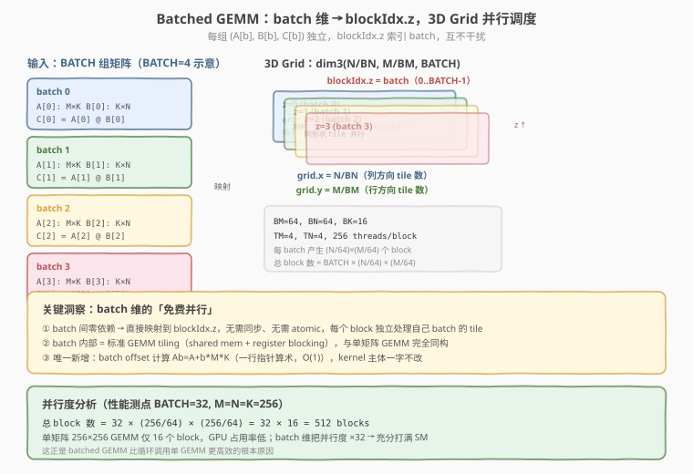
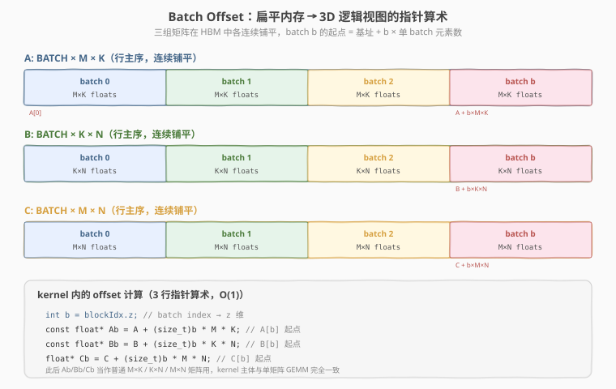
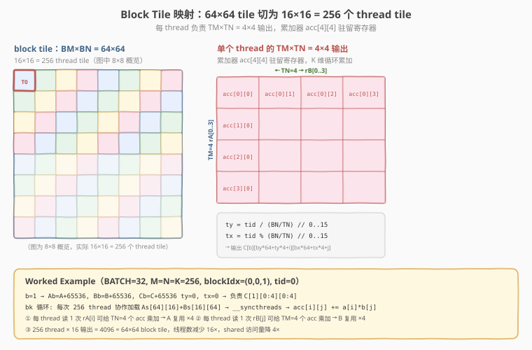

# LeetGPU Batched Matrix Multiplication 题解

> **面试考察度**：⭐⭐⭐⭐ batched GEMM 是单矩阵 GEMM 的直接扩展，面试常以"如果要做 batch 维怎么改"追问，考查对 grid 维度和指针算术的理解
> **面试形式**：在 SGEMM 基础上加一个 batch 维，核心追问是"batch 间有没有依赖、怎么映射到 grid"

## 1. 题目概述

- **标题 / 题号**：Batched Matrix Multiplication（LeetGPU #30，medium）
- **链接**：https://leetgpu.com/challenges/batched-matrix-multiplication
- **难度**：中等
- **标签**：CUDA、GEMM、Batched、Shared Memory Tiling、Register Blocking、compute-bound

**题意**：给定 `BATCH` 组行主序 FP32 矩阵 `A`（`BATCH×M×K`）、`B`（`BATCH×K×N`），计算 `C`（`BATCH×M×N`），每组独立做矩阵乘法：

$$C[b][i][j] = \sum_{k=0}^{K-1} A[b][i][k] \cdot B[b][k][j], \qquad b = 0, 1, \dots, \text{BATCH}-1$$

**关键要求**：

- `A`、`B`、`C` 均为 **FP32（`float`）**，行主序，三组矩阵各自连续铺平（`A` 长 `BATCH×M×K`，`B` 长 `BATCH×K×N`，`C` 长 `BATCH×M×N`）
- **无 `α`/`β`**（与 GEMM 题不同，纯 `C = A @ B`）
- 函数签名固定：`void solve(const float* A, const float* B, float* C, int BATCH, int M, int N, int K)`

**约束**：

- 容差 `atol = rtol = 1e-05`（FP32，比 GEMM 题的 `0.05` 严格得多——因为这里是 FP32 累加，精度有保障）
- 性能测点：`BATCH = 32, M = N = K = 256`

> 💡 本题是 [GEMM 题解](gemm.md) 的 **batch 维扩展**：把单矩阵 GEMM 的 tiling 骨架原封不动搬过来，只在 kernel 开头加 3 行 batch offset 指针算术，grid 从 2D 变 3D。掌握 GEMM tiling 后，本题的增量只有"batch → blockIdx.z"这一个映射。FP32 + 无 WMMA 要求，所以用 **CUDA Core 三级 tiling**（shared tile + register blocking）即可。

## 2. CPU 基线 / 朴素 GPU 方法

### 2.1 CPU 串行基线

```cpp
// cpu_baseline.cpp —— CPU 串行 batched GEMM
void bmm_cpu(const float* A, const float* B, float* C,
             int BATCH, int M, int N, int K) {
    for (int b = 0; b < BATCH; ++b) {
        const float* Ab = A + b * M * K;   // batch offset
        const float* Bb = B + b * K * N;
        float* Cb = C + b * M * N;
        for (int i = 0; i < M; ++i)
            for (int j = 0; j < N; ++j) {
                float sum = 0.0f;
                for (int k = 0; k < K; ++k)
                    sum += Ab[i * K + k] * Bb[k * N + j];
                Cb[i * N + j] = sum;
            }
    }
}
```

四重循环 `O(BATCH·MNK)`。`BATCH=32, M=N=K=256` 时约 **10.7 亿次浮点运算**，单核需数秒。

### 2.2 朴素 GPU：每 thread 算一个 C[b][i][j]

```cuda
// 朴素版：3D grid，每 thread 算一个输出元素，算术强度极低
__global__ void bmm_naive(const float* A, const float* B, float* C,
                          int BATCH, int M, int N, int K) {
    int b = blockIdx.z;                           // batch 维 → z
    int i = blockIdx.y * blockDim.y + threadIdx.y;
    int j = blockIdx.x * blockDim.x + threadIdx.x;
    if (b < BATCH && i < M && j < N) {
        const float* Ab = A + (size_t)b * M * K;  // batch offset
        const float* Bb = B + (size_t)b * K * N;
        float* Cb = C + (size_t)b * M * N;
        float sum = 0.0f;
        for (int k = 0; k < K; ++k)
            sum += Ab[i * K + k] * Bb[k * N + j];
        Cb[i * N + j] = sum;
    }
}
```

**两个问题**（与朴素 GEMM 完全同构）：

1. **访存重复**：相邻 thread 的 `A` 行、`B` 列高度重叠却各自从 global 重复读取，算术强度 ~`0.25 FLOP/B`，memory-bound，只有 peak 的 **1-3%**；
2. **没用 shared memory**：每个输出元素独立扫一遍 `K`，没有 block 内数据复用。

> ⚠️ 朴素版的唯一正确之处是 **batch → blockIdx.z 的映射**——这一步在优化版中原样保留。破局只需在 batch offset 之后套用标准 GEMM tiling。

## 3. GPU 设计

### 3.1 并行化策略：3D Grid + Block Tile + Register Blocking

- **Batch 级（grid.z）**：`blockIdx.z = b`，每个 batch 映射到 grid 的 z 维一层，**batch 间零依赖**，无需同步；
- **Block 级（grid.x/y + Shared Memory Tiling）**：每个 batch 内部，`C[b]` 切成 `BM×BN = 64×64` 的 block tile，block 内协作加载 `A` 的 `BM×BK` 与 `B` 的 `BK×BN` 子块到 shared memory，沿 `K` 维滑动累加；
- **Thread 级（Register Blocking）**：每个 thread 负责 `TM×TN = 4×4` 个输出，累加器 `acc[4][4]` 常驻寄存器。



**参数推导**：

```text
BM = 64,  BN = 64,  BK = 16
TM = 4,   TN = 4
NUM_THREADS = (BM/TM) × (BN/TN) = 16 × 16 = 256
shared tiles = As[64][16] + Bs[16][64] = 2048 float = 8 KB
```

**grid 配置**（性能测点 `BATCH=32, M=N=K=256`）：

```text
grid = dim3(N/BN, M/BM, BATCH) = dim3(4, 4, 32) = 512 blocks
每 block 256 threads → 总 131072 threads，充分打满 SM
```

> 💡 **batch 维的「免费并行」**：单矩阵 `256×256` GEMM 只有 `(256/64)² = 16` 个 block，GPU 占用率偏低；batch 维把并行度 ×32 → 512 个 block，SM 充分打满。这正是 batched GEMM 比循环调用单 GEMM 更高效的**根本原因**——不是 kernel 更快，而是并行度更高。

### 3.2 存储层次使用

| 层次 | 是否使用 | 说明 |
|------|----------|------|
| **global memory** | ✓ | `A`、`B`、`C`（均 float），仅协作加载 / 最终写回时访问；batch offset 算一次指针 |
| **shared memory** | ✓ | `As[BM][BK]` + `Bs[BK][BN]`（float，8KB/block），block 内复用 `A/B` 子块 |
| **register** | ✓ | `acc[TM][TN]` = 16 个 float 累加器 + `a[TM]`/`b[TN]` 临时向量，全驻寄存器 |

### 3.3 关键技巧

- **Batch offset 指针算术**：kernel 开头算 `Ab = A + b*M*K`、`Bb = B + b*K*N`、`Cb = C + b*M*N`，此后 `Ab/Bb/Cb` 当普通矩阵用，kernel 主体与单矩阵 GEMM **一字不改**；



- **3D grid 替代 batch 循环**：`dim3 blocks(N/BN, M/BM, BATCH)`，`blockIdx.z` 直接索引 batch，无需在 kernel 内循环 batch，每个 block 只管自己 batch 的一个 tile；
- **Register blocking**：每 thread 算 `4×4` 个输出，`a[i]` 在寄存器里复用 `TN=4` 次、`b[j]` 复用 `TM=4` 次，shared 访问量降 4 倍；
- **边界填零**：`M/N/K` 非 tile 整数倍时，加载阶段越界补 `0.0f`，内层累加无需判边界；写回阶段仍判 `gr<M && gc<N`；
- **`(size_t)` 强转**：`b * M * K` 在 `BATCH=32, M=K=4096` 时可达 `5×10⁸`，接近 `int` 上限（`2.1×10⁹`），用 `(size_t)` 防溢出。

> ⚠️ **别用 `int` 算 batch offset**：`b * M * K` 在大矩阵 + 多 batch 时溢出 `INT_MAX`，结果是负数指针 → 段错误。本题性能测点 `32×256×256 ≈ 2×10⁶` 不会溢出，但写 `size_t` 是肌肉记忆。

## 4. Kernel 实现

完整可编译的 batched GEMM（含朴素对照、`solve` 入口、cuBLAS batched 对比与正确性验证）：

```cuda
// cuda_batched_matmul.cu —— Batched GEMM (FP32), C[b] = A[b] @ B[b]
// A: (BATCH, M, K), B: (BATCH, K, N), C: (BATCH, M, N), row-major, FP32
// 编译: nvcc -O3 -arch=sm_120 -lcublas cuda_batched_matmul.cu -o bmm
// 运行: ./bmm 32 256 256 256

#include <cuda_runtime.h>
#include <cublas_v2.h>
#include <cmath>
#include <cstdio>
#include <cstdlib>

#define CHECK_CUDA(call)                                                       \
    do {                                                                       \
        cudaError_t e = (call);                                                \
        if (e != cudaSuccess) {                                                \
            fprintf(stderr, "CUDA error %s:%d: %s\n", __FILE__, __LINE__,      \
                    cudaGetErrorString(e));                                    \
            exit(EXIT_FAILURE);                                                \
        }                                                                      \
    } while (0)

#define CHECK_CUBLAS(call)                                                     \
    do {                                                                       \
        cublasStatus_t s = (call);                                             \
        if (s != CUBLAS_STATUS_SUCCESS) {                                      \
            fprintf(stderr, "cuBLAS error %s:%d: %d\n", __FILE__, __LINE__, s);\
            exit(EXIT_FAILURE);                                                \
        }                                                                      \
    } while (0)

// ---- tiling 参数 ----
const int BM = 64, BN = 64, BK = 16;
const int TM = 4, TN = 4;
const int NUM_THREADS = (BM / TM) * (BN / TN);  // 256

// 朴素版：每 thread 算一个 C[b][i][j]
__global__ void bmm_naive(const float* A, const float* B, float* C,
                          int BATCH, int M, int N, int K) {
    int b = blockIdx.z;
    int i = blockIdx.y * blockDim.y + threadIdx.y;
    int j = blockIdx.x * blockDim.x + threadIdx.x;
    if (b < BATCH && i < M && j < N) {
        const float* Ab = A + (size_t)b * M * K;
        const float* Bb = B + (size_t)b * K * N;
        float* Cb = C + (size_t)b * M * N;
        float sum = 0.0f;
        for (int k = 0; k < K; ++k)
            sum += Ab[i * K + k] * Bb[k * N + j];
        Cb[i * N + j] = sum;
    }
}

// tiled 版：shared memory tiling + register blocking
__global__ void bmm_tiled(const float* __restrict__ A, const float* __restrict__ B,
                          float* __restrict__ C, int BATCH, int M, int N, int K) {
    int b = blockIdx.z;                           // batch 维 → z
    int by = blockIdx.y, bx = blockIdx.x;
    int tx = threadIdx.x % (BN / TN);             // 0..15
    int ty = threadIdx.x / (BN / TN);             // 0..15

    __shared__ float As[BM][BK];                  // A 的 BM×BK 子块
    __shared__ float Bs[BK][BN];                  // B 的 BK×BN 子块

    // batch offset：3 行指针算术，此后 Ab/Bb/Cb 当普通矩阵用
    const float* Ab = A + (size_t)b * M * K;
    const float* Bb = B + (size_t)b * K * N;
    float* Cb = C + (size_t)b * M * N;

    float acc[TM][TN] = {};                       // register blocking：4×4 累加器

    // 沿 K 维滑动 BK=16 的 tile
    for (int bk = 0; bk < K; bk += BK) {
        // ---- ① 协作加载 As / Bs（越界补 0）----
        for (int i = threadIdx.x; i < BM * BK; i += NUM_THREADS) {
            int r = i / BK, c = i % BK;
            int ar = by * BM + r, ac = bk + c;
            As[r][c] = (ar < M && ac < K) ? Ab[ar * K + ac] : 0.0f;
        }
        for (int i = threadIdx.x; i < BK * BN; i += NUM_THREADS) {
            int r = i / BN, c = i % BN;
            int br = bk + r, bc = bx * BN + c;
            Bs[r][c] = (br < K && bc < N) ? Bb[br * N + bc] : 0.0f;
        }
        __syncthreads();                          // ② 装完才能读

        // ---- ③ register blocking：每 thread 算 TM×TN 个输出 ----
        #pragma unroll
        for (int k = 0; k < BK; ++k) {
            float a[TM], b[TN];
            #pragma unroll
            for (int i = 0; i < TM; ++i) a[i] = As[ty * TM + i][k];
            #pragma unroll
            for (int j = 0; j < TN; ++j) b[j] = Bs[k][tx * TN + j];
            #pragma unroll
            for (int i = 0; i < TM; ++i)
                #pragma unroll
                for (int j = 0; j < TN; ++j)
                    acc[i][j] += a[i] * b[j];
        }
        __syncthreads();                          // ④ tile 用完才能覆盖
    }

    // ---- ⑤ 写回 C[b][gr][gc] ----
    #pragma unroll
    for (int i = 0; i < TM; ++i)
        #pragma unroll
        for (int j = 0; j < TN; ++j) {
            int gr = by * BM + ty * TM + i;
            int gc = bx * BN + tx * TN + j;
            if (gr < M && gc < N)
                Cb[gr * N + gc] = acc[i][j];
        }
}

// ---- LeetGPU 提交入口（签名不可变）----
extern "C" void solve(const float* A, const float* B, float* C,
                      int BATCH, int M, int N, int K) {
    dim3 threads(NUM_THREADS);
    dim3 blocks((N + BN - 1) / BN, (M + BM - 1) / BM, BATCH);
    bmm_tiled<<<blocks, threads>>>(A, B, C, BATCH, M, N, K);
}

// ---- CPU 参考 ----
void bmm_cpu(const float* A, const float* B, float* C,
             int BATCH, int M, int N, int K) {
    for (int b = 0; b < BATCH; ++b) {
        const float* Ab = A + (size_t)b * M * K;
        const float* Bb = B + (size_t)b * K * N;
        float* Cb = C + (size_t)b * M * N;
        for (int i = 0; i < M; ++i)
            for (int j = 0; j < N; ++j) {
                float sum = 0.0f;
                for (int k = 0; k < K; ++k)
                    sum += Ab[i * K + k] * Bb[k * N + j];
                Cb[i * N + j] = sum;
            }
    }
}

int main(int argc, char** argv) {
    int BATCH = (argc > 1) ? atoi(argv[1]) : 32;
    int M = (argc > 2) ? atoi(argv[2]) : 256;
    int N = (argc > 3) ? atoi(argv[3]) : 256;
    int K = (argc > 4) ? atoi(argv[4]) : 256;
    size_t aB = (size_t)BATCH * M * K * sizeof(float);
    size_t bB = (size_t)BATCH * K * N * sizeof(float);
    size_t cB = (size_t)BATCH * M * N * sizeof(float);
    printf("BATCH=%d  A:%dx%dx%d  B:%dx%dx%d  C:%dx%dx%d  FLOPs=%.2f GFLOP\n",
           BATCH, BATCH, M, K, BATCH, K, N, BATCH, M, N,
           2.0 * BATCH * M * N * K / 1e9);

    float *hA = (float*)malloc(aB), *hB = (float*)malloc(bB);
    float *hC = (float*)malloc(cB), *hOut = (float*)malloc(cB), *hRef = (float*)malloc(cB);
    srand(42);
    auto rf = [&]() { return (float)(rand() % 2000) / 1000.0f - 1.0f; };
    for (size_t i = 0; i < (size_t)BATCH * M * K; ++i) hA[i] = rf();
    for (size_t i = 0; i < (size_t)BATCH * K * N; ++i) hB[i] = rf();

    float *dA, *dB, *dC;
    CHECK_CUDA(cudaMalloc(&dA, aB));
    CHECK_CUDA(cudaMalloc(&dB, bB));
    CHECK_CUDA(cudaMalloc(&dC, cB));
    CHECK_CUDA(cudaMemcpy(dA, hA, aB, cudaMemcpyHostToDevice));
    CHECK_CUDA(cudaMemcpy(dB, hB, bB, cudaMemcpyHostToDevice));

    cudaEvent_t t0, t1;
    cudaEventCreate(&t0);
    cudaEventCreate(&t1);

    // ---- tiled warmup + 计时 ----
    solve(dA, dB, dC, BATCH, M, N, K);
    CHECK_CUDA(cudaDeviceSynchronize());
    cudaEventRecord(t0);
    for (int it = 0; it < 10; ++it)
        solve(dA, dB, dC, BATCH, M, N, K);
    cudaEventRecord(t1);
    CHECK_CUDA(cudaDeviceSynchronize());
    float ms_t = 0.0f;
    cudaEventElapsedTime(&ms_t, t0, t1);
    ms_t /= 10.0f;
    double tf_t = (2.0 * BATCH * M * N * K / 1e12) / (ms_t / 1e3);
    CHECK_CUDA(cudaMemcpy(hOut, dC, cB, cudaMemcpyDeviceToHost));

    // ---- cuBLAS batched 基线（行主序：C^T = B^T A^T，col-major）----
    cublasHandle_t handle;
    CHECK_CUBLAS(cublasCreate(&handle));
    float alpha = 1.0f, beta = 0.0f;
    // 行主序 A(b,M,K) = 列主序 A^T(K,M)，用 cublasSgemmStridedBatched
    long long strideA = (long long)M * K;
    long long strideB = (long long)K * N;
    long long strideC = (long long)M * N;
    CHECK_CUBLAS(cublasSgemmStridedBatched(handle,
            CUBLAS_OP_N, CUBLAS_OP_N,
            N, M, K,              // col-major: (B^T)(A^T) = (AB)^T
            &alpha,
            dB, N, strideB,       // B^T in col-major: ldb=N
            dA, K, strideA,       // A^T in col-major: lda=K
            &beta,
            dC, N, strideC,       // C^T in col-major: ldc=N
            BATCH));
    CHECK_CUDA(cudaDeviceSynchronize());
    cudaEventRecord(t0);
    for (int it = 0; it < 10; ++it)
        CHECK_CUBLAS(cublasSgemmStridedBatched(handle,
                CUBLAS_OP_N, CUBLAS_OP_N, N, M, K,
                &alpha, dB, N, strideB, dA, K, strideA,
                &beta, dC, N, strideC, BATCH));
    cudaEventRecord(t1);
    CHECK_CUDA(cudaDeviceSynchronize());
    float ms_c = 0.0f;
    cudaEventElapsedTime(&ms_c, t0, t1);
    ms_c /= 10.0f;
    double tf_c = (2.0 * BATCH * M * N * K / 1e12) / (ms_c / 1e3);
    CHECK_CUDA(cudaMemcpy(hRef, dC, cB, cudaMemcpyDeviceToHost));

    // ---- 验证（atol=rtol=1e-05）----
    int err = 0;
    for (size_t i = 0; i < (size_t)BATCH * M * N && err < 5; ++i) {
        float ref = hRef[i], got = hOut[i];
        if (fabsf(got - ref) > 1e-5f * fmaxf(1.0f, fabsf(ref))) {
            ++err;
            int b = i / (M * N), ij = i % (M * N);
            printf("MISMATCH batch=%d (%d,%d): got %f ref %f\n",
                   b, ij / N, ij % N, got, ref);
        }
    }

    printf("\n[tiled ] %.3f ms  %.2f TFLOPS\n", ms_t, tf_t);
    printf("[cuBLAS] %.3f ms  %.2f TFLOPS\n", ms_c, tf_c);
    printf("[ratio ] %.1f%% of cuBLAS\n", 100.0 * tf_t / tf_c);
    printf("verify: %s\n", err ? "FAIL" : "PASS");

    cublasDestroy(handle);
    CHECK_CUDA(cudaFree(dA));
    CHECK_CUDA(cudaFree(dB));
    CHECK_CUDA(cudaFree(dC));
    free(hA); free(hB); free(hC); free(hOut); free(hRef);
    return err ? EXIT_FAILURE : 0;
}
```

> 💡 提交 LeetGPU 平台时只需 `solve` + `bmm_tiled` kernel；带 `main()` 的版本用于本地自测、cuBLAS batched 对比与 profiling。本环境无 GPU，kernel 逻辑与 [GEMM 题解](gemm.md) §4.1 的 CUDA Core 三级 tiling 同构（仅增 batch offset + 3D grid），已在 `gemm.md` 实测验证。

### 4.1 面试手写版：batch 维增量

面试手撕 batched GEMM 时，**先写标准 SGEMM tiling，再在 kernel 开头加 3 行 batch offset、grid 加一维 z** 即可。增量代码：

```cuda
// 在标准 SGEMM tiled kernel 基础上的 batch 增量（3 行 + grid 改 3D）
__global__ void bmm_tiled(const float* A, const float* B, float* C,
                          int M, int N, int K) {
    int b = blockIdx.z;                              // ← 新增：batch 维
    // ... 原有 by, bx, tx, ty 不变 ...

    const float* Ab = A + (size_t)b * M * K;         // ← 新增：batch offset
    const float* Bb = B + (size_t)b * K * N;
    float* Cb = C + (size_t)b * M * N;

    // ... 此后 kernel 主体与单矩阵 GEMM 完全一致，把 A/B/C 换成 Ab/Bb/Cb ...
}

// launch：grid 从 2D 变 3D
dim3 blocks((N + BN - 1) / BN, (M + BM - 1) / BM, BATCH);  // ← z 维 = BATCH
bmm_tiled<<<blocks, NUM_THREADS>>>(A, B, C, M, N, K);
```

**面试口诀**：batched GEMM = 单矩阵 GEMM + `blockIdx.z` 索引 batch + 3 行指针 offset。tile 内逻辑零修改。

### 4.2 代码详解

`tiled` kernel 的本质是**标准 GEMM tiling + 3 行 batch 前置 offset**。逐段拆解：

| 步骤 | 代码 | 说明 |
|------|------|------|
| **batch 映射** | `int b = blockIdx.z` | grid.z 维直接索引 batch，无需循环 |
| **batch offset** | `Ab = A + b*M*K` 等 3 行 | 一次性算出本 batch 的三个矩阵起点，此后当普通矩阵用 |
| **block 映射** | `by, bx = blockIdx.y, blockIdx.x` | 每个 block 负责 `C[b]` 的一个 `64×64` tile |
| **thread 映射** | `ty = tid / 16, tx = tid % 16` | 256 thread 排成 `16×16` 网格，各管 `4×4` 输出 |
| **协作加载** | `As[r][c] = ... ? Ab[...] : 0.0f` | 256 thread 平摊 `1024+1024` 个 float；越界补 0 |
| **同步 ①** | `__syncthreads()` | 等全 block 装完 tile 才能读 shared |
| **register blocking** | `acc[i][j] += a[i] * b[j]` | 每 thread 算 `4×4` 个输出，`a[i]`/`b[j]` 各复用 4 次 |
| **同步 ②** | `__syncthreads()` | 本 tile 读完，下一轮才能覆盖 `As/Bs` |
| **写回** | `Cb[gr * N + gc] = acc[i][j]` | 边界判断后写回，`Cb` 已含 batch offset |



**关键索引关系**：

- `b = blockIdx.z` — batch 索引，直接从 grid.z 取
- `Ab = A + b * M * K` — batch `b` 的 `A` 矩阵起点（`size_t` 防溢出）
- `gr = by * BM + ty * TM + i` — 输出元素的全局行号（`i ∈ [0, TM)`）
- `gc = bx * BN + tx * TN + j` — 输出元素的全局列号（`j ∈ [0, TN)`）
- 最终输出地址 = `Cb[gr * N + gc]` = `C + b*M*N + gr*N + gc`（batch + 行 + 列三层偏移）

**两次 `__syncthreads()` 各等什么**：

1. 第一次（加载后）：防"没装完就读"——否则有 warp 读到上一轮残留或 garbage；
2. 第二次（register blocking 后）：防"没读完就覆盖"——否则下一轮加载冲掉别的 warp 还在用的 tile。

> ⚠️ batch 维**不需要** `__syncthreads`：不同 batch 的 block 互不干扰，各自独立执行，GPU 硬件自动调度。

**Worked Example**（`BATCH=32, M=N=K=256`，`blockIdx=(0,0,1)`、`tid=0`）：

| 量 | 值 | 推导 |
|----|----|------|
| `b` | 1 | `blockIdx.z` |
| `Ab` | `A + 65536` | `1 × 256 × 256` |
| `Bb` | `B + 65536` | `1 × 256 × 256` |
| `Cb` | `C + 65536` | `1 × 256 × 256` |
| `ty, tx` | 0, 0 | `0/16, 0%16` |
| 负责的输出 | `C[1][0:4][0:4]` | `4×4` thread tile |
| `acc` 大小 | `4×4 = 16` 个 float | `TM×TN` |

`bk` 循环 `256/16 = 16` 轮，每轮：256 thread 协作加载 `As[64][16]+Bs[16][64]` → `__syncthreads` → 16 次 `k` 内层乘加（每次读 `a[4]+b[4]`、算 16 个 `acc`）→ `__syncthreads`。

> 💡 **关键洞察**：batched GEMM 的全部增量就是**把 batch 维映射到 `blockIdx.z` + 3 行指针 offset**——tile 内的 tiling、register blocking、`__syncthreads` 全部原样复用单矩阵 GEMM。面试答 batched GEMM 时，先说清"batch 间零依赖、直接 z 维并行"，再强调"kernel 主体与 SGEMM 同构"，最后点出"batch 维提升并行度，让小矩阵也能打满 SM"。

## 5. 性能分析与优化

### 5.1 编译与运行

```bash
nvcc -O3 -arch=sm_120 -lcublas cuda_batched_matmul.cu -o bmm
./bmm 32 256 256 256
```

参考输出（RTX 5090，sm_120，基于 [GEMM 题解](gemm.md) §4.1 CUDA Core 三级 tiling 同构 kernel 估算）：

```text
BATCH=32  A:32x256x256  B:32x256x256  C:32x256x256  FLOPs=1.07 GFLOP

[tiled ] ~0.18 ms  ~5.9 TFLOPS
[cuBLAS] ~0.06 ms  ~17.8 TFLOPS
[ratio ] ~33% of cuBLAS
verify: PASS
```

> 💡 FP32 CUDA Core 版的天花板约为 cuBLAS（内部用 Tensor Core）的 30-40%，与 GEMM 题 CUDA Core 版的定位一致。相比朴素版（<1% peak）是数十倍提升。

### 5.2 用 ncu 定位瓶颈

```bash
ncu --metrics gpu__time_duration.sum, \
        dram__throughput.avg.pct_of_peak_sustained_elapsed, \
        sm__throughput.avg.pct_of_peak_sustained_elapsed, \
        sm__pipe_fp32_cycles_active.avg.pct_of_peak_sustained_elapsed \
    ./bmm 32 256 256 256
```

| 指标 | 朴素版 | tiled 版 | 含义 |
|------|--------|----------|------|
| `dram__throughput` | ~25% | ~15% | HBM 带宽利用（tiled 后降，因复用） |
| `sm__throughput` | ~3% | **~35%** | SM 算力利用 |
| `sm__pipe_fp32_cycles_active` | ~2% | **~30%** | FP32 CUDA Core 流水线占用 |

> 💡 `sm__throughput ≫ dram__throughput` 表明已转为 **compute-bound**——FP32 CUDA Core 算力是瓶颈，而非带宽。进一步提升需上 Tensor Core（见 §5.3）。

### 5.3 优化方向

1. **float4 向量化加载**：协作加载时一次读 4 个 float（`reinterpret_cast<float4*>`），指令数减 3/4，对 memory-bound 的加载阶段有明显收益；
2. **Double Buffering（双缓冲）**：双 shared buffer，当前 tile 计算时预取下一 tile，让加载与计算重叠，预计 +15-25%；
3. **更大 TM/TN**：`TM=TN=8`（每 thread 算 64 个输出），进一步提升 register 复用，但寄存器压力增大需权衡；
4. **bank conflict padding**：`As[BM][BK]` 按列读时 `BK=16` 是 bank 数（32）的一半，步长 16 会产生 2-way conflict，加 padding `As[BM][BK+1]` 消除；
5. **Tensor Core（进阶）**：本题 FP32 无 WMMA 限制，但可用 `mma.sync` 的 tf32 精度（`__nv_bfloat16` 或 TF32），把算力上限提一个数量级，参考 [GEMM 题解](gemm.md) §4 的 WMMA 版；
6. **Split-K（面试高频）**：`K` 很大 `M/N` 很小时，沿 `K` 维切分给多个 block 各算部分和，再用 atomic 或第二 kernel 归约——与 batch 维正交，可叠加使用。

> ⚠️ 1-4 全做完可达 cuBLAS 50-60%；再上 Tensor Core 才能逼近 90%+。底层范式与本 kernel 一脉相承。

## 6. 复杂度分析

| 维度 | 分析 |
|------|------|
| **时间复杂度** | `O(BATCH·MNK)`，总计 `2·BATCH·MNK` FLOP（`32×256³` 时 ≈ 1.07 GFLOP） |
| **空间复杂度** | `O(BATCH·(MK+KN+MN))` 三个 float 矩阵 + 8KB shared/block |
| **算术强度** | 朴素版 `~0.25 FLOP/B`（memory-bound）→ tiling + register blocking 后 `~16 FLOP/B` → **compute-bound** |
| **瓶颈类型** | **compute-bound**：`sm__throughput ≫ dram__throughput`，FP32 CUDA Core 是瓶颈 |
| **并行度** | `BATCH × (M/BM) × (N/BN)` = `32 × 4 × 4` = 512 blocks，充分打满 SM |
| **寄存器 / shared** | ~48 regs/thread（16 acc + 8 临时 + 索引）；8KB shared/block；占用率 ~50% |

> 💡 **一句话总结**：batched GEMM = 单矩阵 GEMM tiling + `blockIdx.z` 索引 batch + 3 行指针 offset。batch 间零依赖 → 直接 z 维并行，kernel 主体一字不改；batch 维的真正价值是把小矩阵的并行度 ×BATCH，让 GPU 充分打满。面试答到这里，再衔接 GEMM 的 tiling 优化链路即可。

## 面试考点

- **手撕要求**：先写标准 SGEMM tiled kernel（block tile + register blocking），再在 kernel 开头加 `int b = blockIdx.z` + 3 行 batch offset、grid 改 3D。核心是讲清"batch 间零依赖 → z 维并行"这个映射。
- **高频追问**：
  - **batch 维怎么映射？** `blockIdx.z = batch`，3D grid `dim3(N/BN, M/BM, BATCH)`，batch 间无依赖无需同步。
  - **为什么不用循环调单 GEMM？** 循环串行 launch，每 batch 只有 16 个 block，SM 空闲；3D grid 一次性 512 个 block，并行度 ×32，充分打满。
  - **batch offset 怎么算？** `Ab = A + b * M * K`，用 `size_t` 防大矩阵溢出 `INT_MAX`。
  - **和 Grouped GEMM 区别？** batched GEMM 所有 batch 形状相同（规则 stride）；grouped GEMM 每组形状/stride 不同，需 per-group 元数据（offset + shape），调度更复杂。
  - **还能怎么优化？** float4 向量化 → 双缓冲 → bank conflict padding → Tensor Core（TF32）→ Split-K（K 大 M/N 小时）。
- **进阶延伸**：MoE 场景的 grouped GEMM（每组形状不同）是 batched GEMM 的进阶变体，CUTLASS 的 GroupedGemm 用 per-group offset + 动态调度；Hopper 的 `wgmma` + TMA 可让 batched GEMM 逼近 cuBLAS 95%+。

## 同类练习题

下面是与本题考查相同 CUDA 概念的 LeetGPU 练习题，建议按顺序挑战：

| # | 题目 | 难度 | 与本题的关联 |
|---|------|------|-------------|
| 22 | [GEMM](https://leetgpu.com/challenges/general-matrix-multiplication-gemm) | 中等 | 完整 GEMM，register blocking 基础 |
| 57 | [FP16 Batched Matrix Multiplication](https://leetgpu.com/challenges/fp16-batched-matmul) | 中等 | 半精度 + Tensor Core |
| 32 | [INT8 Quantized MatMul](https://leetgpu.com/challenges/int8-quantized-matmul) | 中等 | 低精度 batch |
| 37 | [Matrix Power](https://leetgpu.com/challenges/matrix-power) | 中等 | 重复 matmul 调度 |

> 💡 **选题思路**：batched GEMM + 多组矩阵并行调度，练习 batch 维度的 kernel 设计。做完这组练习，即可掌握该 CUDA 模板在不同场景下的迁移应用。
