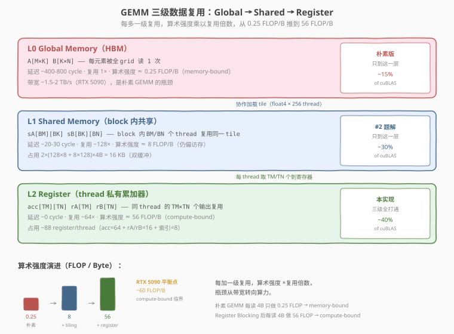
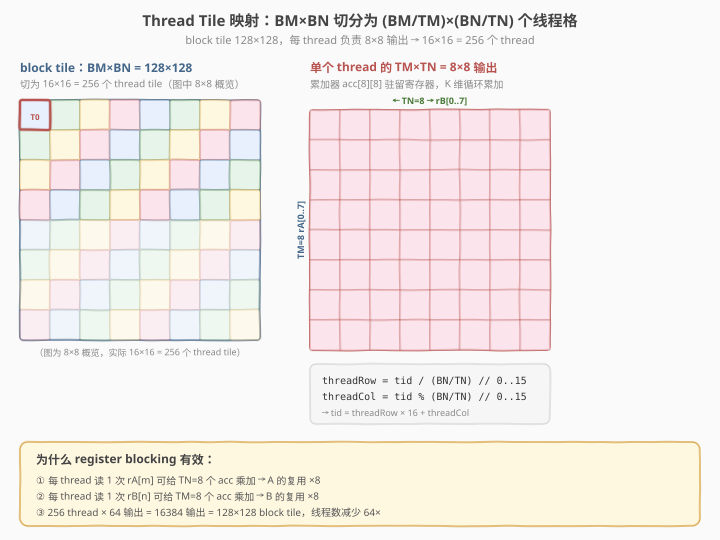

# LeetGPU GEMM 题解

> **面试考察度**：⭐⭐⭐⭐⭐ 手撕 SGEMM 是中频第一题（见本专题 README 中频题第 1 条），"naive → block tile → thread tile"的优化链路几乎必被追问
> **面试形式**：现场手写 tiled matmul kernel + 讲清每一步优化收益；背熟 index 会被一眼看穿，必须理解分块的动机

## 1. 题目概述

- **标题 / 题号**：General Matrix Multiplication (GEMM)（LeetGPU #22，medium）
- **链接**：https://leetgpu.com/challenges/general-matrix-multiplication-gemm
- **难度**：中等
- **标签**：CUDA、GEMM、FP16、WMMA、Tensor Core、Shared Memory Tiling、compute-bound

**题意**：给定行主序 FP16 矩阵 `A`（`M×K`）、`B`（`K×N`）与输入/输出矩阵 `C`（`M×N`），以及 FP32 标量 `α`、`β`，计算：

$$C = \alpha \cdot (A \times B) + \beta \cdot C_{\text{initial}}, \qquad C[i][j] = \alpha \sum_{k=0}^{K-1} A[i][k] \cdot B[k][j] + \beta \cdot C_{\text{initial}}[i][j]$$

**关键要求**：

- `A`、`B`、`C` 均为 **FP16（`half`）**，行主序；`α`、`β` 为 **FP32**
- 乘加累加必须在 **FP32** 下进行，最终结果转回 FP16 写入 `C`
- 允许使用 **WMMA**（其他外部库禁止）
- 函数签名固定：`void solve(const half* A, const half* B, half* C, int M, int N, int K, float alpha, float beta)`

**约束**：

- `16 ≤ M, N, K ≤ 4096`
- 性能测点：`M = N = K = 1024`，`α = 1.0`，`β = 1.0`
- 容差 `atol = rtol = 0.05`

> 💡 本题是 **Tensor Core 入门**的招牌题：输入 FP16 + 显式允许 WMMA，就是在喊你用 Tensor Core——一次 `mma.sync` 指令完成 `16×16×16` 矩阵乘加（8192 FLOP），吞吐比 FP32 CUDA Core 高一个数量级；"FP32 累加"的要求又恰好与 WMMA 的 fp32 accumulator fragment 天然契合。但**面试手撕通常考的是 CUDA Core 版**（naive → shared tile → register blocking），两个版本都要会，见 §4.1。

## 2. CPU 基线 / 朴素 GPU 方法

### 2.1 CPU 串行基线

```cpp
// cpu_baseline.cpp —— CPU 串行 GEMM，FP16 输入、FP32 累加
void gemm_cpu(const half* A, const half* B, half* C, int M, int N, int K, float alpha, float beta) {
    for (int i = 0; i < M; ++i)
        for (int j = 0; j < N; ++j) {
            float sum = 0.0f;                       // FP32 累加器
            for (int k = 0; k < K; ++k)
                sum += __half2float(A[i * K + k]) * __half2float(B[k * N + j]);
            float c_init = __half2float(C[i * N + j]);
            C[i * N + j] = __float2half(alpha * sum + beta * c_init);  // 回写 FP16
        }
}
```

三重循环 `O(MNK)`。`M=N=K=1024` 时约 **21 亿次浮点运算**，单核需数秒。

### 2.2 朴素 GPU：每 thread 算一个 C[i][j]

```cuda
// 朴素版：算术强度极低，且完全没用 Tensor Core
__global__ void gemm_naive(const half* A, const half* B, half* C, int M, int N, int K,
                           float alpha, float beta) {
    int i = blockIdx.y * blockDim.y + threadIdx.y;
    int j = blockIdx.x * blockDim.x + threadIdx.x;
    if (i < M && j < N) {
        float sum = 0.0f;
        for (int k = 0; k < K; ++k)
            sum += __half2float(A[i * K + k]) * __half2float(B[k * N + j]);
        float c_init = __half2float(C[i * N + j]);
        C[i * N + j] = __float2half(alpha * sum + beta * c_init);
    }
}
```

**两个致命问题**：

1. **访存重复**：相邻 thread 的 `A` 行、`B` 列高度重叠却各自从 global 重复读取——每算一个 `C[i][j]` 要读 `2K` 个元素，算术强度 ~`2K FLOP / 2K·2B = 0.5 FLOP/B`，典型的 memory-bound，只有 peak 的 **1-3%**；
2. **没用 Tensor Core**：把 FP16 输入当标量处理，浪费了题目给的硬件红利。

> ⚠️ 破局必须两步：① **Shared Memory Tiling** 复用 `A/B` 子块提升算术强度；② **WMMA** 让计算落到 Tensor Core。面试中第①步（CUDA Core 三级 tiling）是手撕主体，第②步是进阶加分项。

## 3. GPU 设计

### 3.1 并行化策略：Block Tile → Warp Tile → WMMA Fragment 三级分块

- **Block 级（Shared Memory Tiling）**：`C` 切成 `BM×BN = 128×128` 的 block tile，block 内协作加载 `A` 的 `BM×BK` 与 `B` 的 `BK×BN` 子块到 shared memory，沿 `K` 维滑动累加；
- **Warp 级（Warp Tile）**：每个 warp 负责 block tile 内 `32×64` 的子块，由 `FRAGS_M×FRAGS_N = 2×4` 个 WMMA fragment 拼成；
- **Fragment 级（Tensor Core）**：每个 fragment 是 `16×16×16` 的 `mma` 运算，warp 内 32 lane 协作执行，fp32 累加器常驻寄存器。



**参数推导**（`BK = WMMA_K = 16`，因为 `mma` 的 K 维固定为 16，shared tile 一列正好喂给一个 fragment）：

```text
WMMA_M = WMMA_N = WMMA_K = 16
BM = 128,  BN = 128,  BK = 16
WARPS_M = 4,  WARPS_N = 2          →  8 warps / block = 256 threads
WARP_TILE_M = 128/4 = 32           →  FRAGS_M = 32/16 = 2
WARP_TILE_N = 128/2 = 64           →  FRAGS_N = 64/16 = 4
shared tiles  = As[128×16] + Bs[16×128] = 4096 half = 8 KB
staging (dyn) = Cs[128×128] fp32 = 64 KB   （epilogue 暂存累加器）
```




> 💡 **tiling 为什么有效**（面试必答）：block tile 内每个 `A` 元素被复用 `BN` 次、每个 `B` 元素被复用 `BM` 次，算术强度从朴素版的 `~0.5 FLOP/B` 提升到 `~BM/2 = 64 FLOP/B` 量级，越过 roofline 拐点，kernel 从 memory-bound 变成 compute-bound。三级 tiling 就是把数据逐层搬到离计算更近的存储里复用：global → shared（block 级）→ fragment 寄存器（warp 级）→ Tensor Core（指令级）。

### 3.2 存储层次使用

| 层次 | 是否使用 | 说明 |
|------|----------|------|
| **global memory** | ✓ | `A`、`B`、`C`（均 half），仅协作加载 / 最终写回时访问 |
| **shared memory** | ✓ | `As[BM][BK]` + `Bs[BK][BN]`（half，static，8KB）+ `Cs[BM][BN]`（fp32，dynamic 64KB，epilogue 暂存） |
| **register / fragment** | ✓ | **核心**：`acc[2][4]` 个 fp32 accumulator fragment + 每步 `a_frag`/`b_frag`，全驻 Tensor Core 寄存器 |

### 3.3 关键技巧

- **WMMA fragment 三件套**：`wmma::load_matrix_sync` 从 shared 载入 `a_frag`/`b_frag`，`wmma::mma_sync` 做 `D = A×B + C`（就地累加），`wmma::store_matrix_sync` 把 fp32 累加器写回 shared；
- **FP32 累加零成本**：accumulator fragment 声明为 `float`，天然满足题目精度要求；
- `α/β` **epilogue**：WMMA 只算 `ΣA·B`，写回前把累加器存入 shared staging，全体 thread 协作读出、套 `α·acc + β·C_initial`、转 half 写回；`β=0` 时跳过读 `C`；
- **边界填零**：`M/N/K` 非 tile 整数倍时，加载阶段越界补 `__float2half(0)`，内层 `mma` 无需判边界；写回阶段仍判 `gr<M && gc<N`；
- **大 shared opt-in**：staging 64KB 超过默认 48KB 上限，需 `cudaFuncSetAttribute(..., cudaFuncAttributeMaxDynamicSharedMemorySize, ...)` 放开。

> ⚠️ `load_matrix_sync` 的 leading dimension 必须与 shared 布局一致。口诀：**"数组哪一维连续，`ld` 就等于那一维的大小"**——`As[BM][BK]` 第二维 `BK` 连续 → `ld=BK`；`Bs[BK][BN]` 第二维 `BN` 连续 → `ld=BN`。写反会按错误 stride 拼元素，结果完全错位。

## 4. Kernel 实现

完整可编译的 WMMA Tensor Core 版本（含朴素对照、`solve` 入口、cuBLAS 对比与正确性验证）：

```cuda
// cuda_gemm_wmma.cu —— FP16 GEMM with WMMA Tensor Cores
// C = alpha * (A @ B) + beta * C,  A: M×K, B: K×N, C: M×N (FP16)
// 编译: nvcc -O3 -arch=sm_120 -lcublas cuda_gemm_wmma.cu -o gemm
// 运行: ./gemm 1024 1024 1024

#include <cuda_fp16.h>
#include <cuda_runtime.h>
#include <mma.h>
#include <cublas_v2.h>
#include <cmath>
#include <cstdio>
#include <cstdlib>

using namespace nvcuda;

#define CHECK_CUDA(call)                                                       \
    do {                                                                       \
        cudaError_t e = (call);                                                \
        if (e != cudaSuccess) {                                                \
            fprintf(stderr, "CUDA error %s:%d: %s\n", __FILE__, __LINE__,      \
                    cudaGetErrorString(e));                                    \
            exit(EXIT_FAILURE);                                                \
        }                                                                      \
    } while (0)

#define CHECK_CUBLAS(call)                                                     \
    do {                                                                       \
        cublasStatus_t s = (call);                                             \
        if (s != CUBLAS_STATUS_SUCCESS) {                                      \
            fprintf(stderr, "cuBLAS error %s:%d: %d\n", __FILE__, __LINE__, s);\
            exit(EXIT_FAILURE);                                                \
        }                                                                      \
    } while (0)

// ---- tiling 参数 ----
const int WMMA_M = 16, WMMA_N = 16, WMMA_K = 16;
const int BM = 128, BN = 128, BK = 16;    // BK == WMMA_K
const int WARPS_M = 4, WARPS_N = 2;       // 8 warps / block
const int NUM_WARPS = WARPS_M * WARPS_N;  // 8
const int NUM_THREADS = NUM_WARPS * 32;   // 256
const int WARP_TILE_M = BM / WARPS_M;     // 32
const int WARP_TILE_N = BN / WARPS_N;     // 64
const int FRAGS_M = WARP_TILE_M / WMMA_M; // 2
const int FRAGS_N = WARP_TILE_N / WMMA_N; // 4
const int LOAD_A = BM * BK / NUM_THREADS; // 8 half / thread
const int LOAD_B = BK * BN / NUM_THREADS; // 8 half / thread

// WMMA Tensor Core GEMM：每 warp 算 FRAGS_M×FRAGS_N 个 16×16 输出
__global__ void gemm_wmma(const half* __restrict__ A, const half* __restrict__ B,
                          half* __restrict__ C, int M, int N, int K,
                          float alpha, float beta) {
    __shared__ half As[BM][BK];   // A 的 BM×BK 子块
    __shared__ half Bs[BK][BN];   // B 的 BK×BN 子块
    extern __shared__ float Cs[]; // BM×BN fp32 staging（epilogue 暂存累加器）

    const int bx = blockIdx.x, by = blockIdx.y;
    const int tid = threadIdx.x;
    const int warp_id = tid >> 5;
    const int warp_m = warp_id / WARPS_N;      // 0..3
    const int warp_n = warp_id % WARPS_N;      // 0..1
    const int warp_row = warp_m * WARP_TILE_M; // warp tile 行起点
    const int warp_col = warp_n * WARP_TILE_N; // 列起点

    // fp32 累加器：FRAGS_M×FRAGS_N 个 16×16 fragment
    using AccFrag = wmma::fragment<wmma::accumulator, WMMA_M, WMMA_N, WMMA_K, float>;
    AccFrag acc[FRAGS_M][FRAGS_N];
    #pragma unroll
    for (int i = 0; i < FRAGS_M; ++i)
        #pragma unroll
        for (int j = 0; j < FRAGS_N; ++j)
            wmma::fill_fragment(acc[i][j], 0.0f);

    using AFrag = wmma::fragment<wmma::matrix_a, WMMA_M, WMMA_N, WMMA_K, half, wmma::row_major>;
    using BFrag = wmma::fragment<wmma::matrix_b, WMMA_M, WMMA_N, WMMA_K, half, wmma::row_major>;

    // 沿 K 维滑动 BK=16 的 tile
    for (int bk = 0; bk < K; bk += BK) {
        // ---- ① 协作加载 As / Bs（half，越界补 0）----
        #pragma unroll
        for (int i = 0; i < LOAD_A; ++i) {
            int lin = tid + i * NUM_THREADS;
            int r = lin / BK, c = lin % BK;
            int ar = by * BM + r, ac = bk + c;
            As[r][c] = (ar < M && ac < K) ? A[ar * K + ac] : __float2half(0.0f);
        }
        #pragma unroll
        for (int i = 0; i < LOAD_B; ++i) {
            int lin = tid + i * NUM_THREADS;
            int r = lin / BN, c = lin % BN;
            int br = bk + r, bc = bx * BN + c;
            Bs[r][c] = (br < K && bc < N) ? B[br * N + bc] : __float2half(0.0f);
        }
        __syncthreads(); // ② 装完才能读

        // ---- ③ 每 warp 做 FRAGS_M×FRAGS_N = 8 次 mma（Tensor Core）----
        #pragma unroll
        for (int i = 0; i < FRAGS_M; ++i)
            #pragma unroll
            for (int j = 0; j < FRAGS_N; ++j) {
                AFrag a_frag;
                BFrag b_frag;
                wmma::load_matrix_sync(a_frag, &As[warp_row + i * WMMA_M][0], BK);
                wmma::load_matrix_sync(b_frag, &Bs[0][warp_col + j * WMMA_N], BN);
                wmma::mma_sync(acc[i][j], a_frag, b_frag, acc[i][j]);
            }
        __syncthreads(); // ④ tile 用完才能覆盖
    }

    // ---- ⑤ epilogue：累加器存入 shared staging（fp32）----
    #pragma unroll
    for (int i = 0; i < FRAGS_M; ++i)
        #pragma unroll
        for (int j = 0; j < FRAGS_N; ++j)
            wmma::store_matrix_sync(
                &Cs[(warp_row + i * WMMA_M) * BN + (warp_col + j * WMMA_N)],
                acc[i][j], BN, wmma::mem_row_major);
    __syncthreads();

    // ---- ⑥ 写回 C：alpha*acc + beta*C_initial -> half ----
    const int total = BM * BN; // 16384 元素 / 256 thread = 64 / thread
    #pragma unroll
    for (int i = 0; i < total / NUM_THREADS; ++i) {
        int idx = tid + i * NUM_THREADS;
        int r = idx / BN, c = idx % BN;
        int gr = by * BM + r, gc = bx * BN + c;
        if (gr < M && gc < N) {
            float acc_val = Cs[idx];
            float c_init = (beta != 0.0f) ? __half2float(C[gr * N + gc]) : 0.0f;
            C[gr * N + gc] = __float2half(alpha * acc_val + beta * c_init);
        }
    }
}

// ---- LeetGPU 提交入口（签名不可变）----
extern "C" void solve(const half* A, const half* B, half* C, int M, int N, int K,
                      float alpha, float beta) {
    const int dyn_smem = BM * BN * sizeof(float); // 64 KB staging
    static bool attr_set = false;
    if (!attr_set) {
        // staging 64KB + static 8KB > 默认 48KB，需放开 dynamic shared 上限
        cudaFuncSetAttribute(gemm_wmma, cudaFuncAttributeMaxDynamicSharedMemorySize, dyn_smem);
        attr_set = true;
    }
    dim3 threads(NUM_THREADS);
    dim3 blocks((N + BN - 1) / BN, (M + BM - 1) / BM);
    gemm_wmma<<<blocks, threads, dyn_smem>>>(A, B, C, M, N, K, alpha, beta);
}

// ---- CPU 参考 ----
void cpu_gemm(const half* A, const half* B, half* C, int M, int N, int K,
              float alpha, float beta) {
    for (int i = 0; i < M; ++i)
        for (int j = 0; j < N; ++j) {
            float sum = 0.0f;
            for (int k = 0; k < K; ++k)
                sum += __half2float(A[i * K + k]) * __half2float(B[k * N + j]);
            float c_init = __half2float(C[i * N + j]);
            C[i * N + j] = __float2half(alpha * sum + beta * c_init);
        }
}

int main(int argc, char** argv) {
    int M = (argc > 1) ? atoi(argv[1]) : 1024;
    int N = (argc > 2) ? atoi(argv[2]) : 1024;
    int K = (argc > 3) ? atoi(argv[3]) : 1024;
    size_t aB = (size_t)M * K * sizeof(half);
    size_t bB = (size_t)K * N * sizeof(half);
    size_t cB = (size_t)M * N * sizeof(half);
    printf("A:%dx%d B:%dx%d C:%dx%d  FLOPs=%.2f GFLOP\n",
           M, K, K, N, M, N, 2.0 * M * N * K / 1e9);

    half *hA = (half*)malloc(aB), *hB = (half*)malloc(bB);
    half *hC = (half*)malloc(cB), *hOut = (half*)malloc(cB), *hRef = (half*)malloc(cB);
    srand(42);
    auto rh = [&]() { return __float2half((float)(rand() % 2000) / 1000.0f - 1.0f); };
    for (int i = 0; i < M * K; ++i) hA[i] = rh();
    for (int i = 0; i < K * N; ++i) hB[i] = rh();
    for (int i = 0; i < M * N; ++i) hC[i] = rh();
    float alpha = 1.0f, beta = 1.0f;

    half *dA, *dB, *dC;
    CHECK_CUDA(cudaMalloc(&dA, aB));
    CHECK_CUDA(cudaMalloc(&dB, bB));
    CHECK_CUDA(cudaMalloc(&dC, cB));
    CHECK_CUDA(cudaMemcpy(dA, hA, aB, cudaMemcpyHostToDevice));
    CHECK_CUDA(cudaMemcpy(dB, hB, bB, cudaMemcpyHostToDevice));

    cudaEvent_t t0, t1;
    cudaEventCreate(&t0);
    cudaEventCreate(&t1);

    // ---- WMMA warmup + 计时 ----
    CHECK_CUDA(cudaMemcpy(dC, hC, cB, cudaMemcpyHostToDevice));
    solve(dA, dB, dC, M, N, K, alpha, beta);
    CHECK_CUDA(cudaDeviceSynchronize());
    CHECK_CUDA(cudaMemcpy(dC, hC, cB, cudaMemcpyHostToDevice));
    cudaEventRecord(t0);
    for (int it = 0; it < 10; ++it)
        solve(dA, dB, dC, M, N, K, alpha, beta);
    cudaEventRecord(t1);
    CHECK_CUDA(cudaDeviceSynchronize());
    float ms_w = 0.0f;
    cudaEventElapsedTime(&ms_w, t0, t1);
    ms_w /= 10.0f;
    double tf_w = (2.0 * M * N * K / 1e12) / (ms_w / 1e3);
    CHECK_CUDA(cudaMemcpy(dC, hC, cB, cudaMemcpyHostToDevice));
    solve(dA, dB, dC, M, N, K, alpha, beta);
    CHECK_CUDA(cudaMemcpy(hOut, dC, cB, cudaMemcpyDeviceToHost));

    // ---- cuBLAS 基线（行主序：C^T = B^T A^T，col-major）----
    cublasHandle_t handle;
    CHECK_CUBLAS(cublasCreate(&handle));
    CHECK_CUDA(cudaMemcpy(dC, hC, cB, cudaMemcpyHostToDevice));
    CHECK_CUBLAS(cublasGemmEx(handle, CUBLAS_OP_N, CUBLAS_OP_N, N, M, K,
                              &alpha, dB, CUDA_R_16F, N, dA, CUDA_R_16F, K,
                              &beta, dC, CUDA_R_16F, N,
                              CUBLAS_COMPUTE_32F, CUBLAS_GEMM_DEFAULT));
    CHECK_CUDA(cudaDeviceSynchronize());
    CHECK_CUDA(cudaMemcpy(dC, hC, cB, cudaMemcpyHostToDevice));
    cudaEventRecord(t0);
    for (int it = 0; it < 10; ++it)
        CHECK_CUBLAS(cublasGemmEx(handle, CUBLAS_OP_N, CUBLAS_OP_N, N, M, K,
                                  &alpha, dB, CUDA_R_16F, N, dA, CUDA_R_16F, K,
                                  &beta, dC, CUDA_R_16F, N,
                                  CUBLAS_COMPUTE_32F, CUBLAS_GEMM_DEFAULT));
    cudaEventRecord(t1);
    CHECK_CUDA(cudaDeviceSynchronize());
    float ms_c = 0.0f;
    cudaEventElapsedTime(&ms_c, t0, t1);
    ms_c /= 10.0f;
    double tf_c = (2.0 * M * N * K / 1e12) / (ms_c / 1e3);
    CHECK_CUDA(cudaMemcpy(hRef, dC, cB, cudaMemcpyDeviceToHost));

    // ---- 验证（atol=rtol=0.05）----
    int err = 0;
    for (int i = 0; i < M * N && err < 5; ++i) {
        float ref = __half2float(hRef[i]), got = __half2float(hOut[i]);
        if (fabsf(got - ref) > 0.05f * fmaxf(1.0f, fabsf(ref))) {
            ++err;
            printf("MISMATCH @(%d,%d): got %f ref %f\n", i / N, i % N, got, ref);
        }
    }

    printf("\n[WMMA  ] %.3f ms  %.2f TFLOPS\n", ms_w, tf_w);
    printf("[cuBLAS] %.3f ms  %.2f TFLOPS\n", ms_c, tf_c);
    printf("[ratio ] %.1f%% of cuBLAS\n", 100.0 * tf_w / tf_c);
    printf("verify: %s\n", err ? "FAIL" : "PASS");

    cublasDestroy(handle);
    CHECK_CUDA(cudaFree(dA));
    CHECK_CUDA(cudaFree(dB));
    CHECK_CUDA(cudaFree(dC));
    free(hA); free(hB); free(hC); free(hOut); free(hRef);
    return err ? EXIT_FAILURE : 0;
}
```

> 💡 提交 LeetGPU 平台时只需 `solve` + `gemm_wmma` kernel；带 `main()` 的版本用于本地自测、cuBLAS 对比与 profiling。本环境无 GPU，代码与 `leetgpu/week2/day2` 已实测通过的版本一致（性能数据见 §5）。

### 4.1 面试手写版：CUDA Core 三级 tiling（SGEMM 手撕标准答案）

面试手撕 SGEMM 一般不让用 WMMA，要求现场写 **shared memory tiling + register blocking** 的 CUDA Core 版。下面这个是手撕标准结构（FP16 输入、FP32 累加，同样的 epilogue）：

```cuda
// 面试手写版：block 负责 64×64 输出，每 thread 算 4×4 = 16 个元素
const int BM = 64, BN = 64, BK = 16;
const int TM = 4, TN = 4;
const int NUM_THREADS = (BM / TM) * (BN / TN); // 256

__global__ void gemm_tiled(const half* __restrict__ A, const half* __restrict__ B,
                           half* __restrict__ C, int M, int N, int K,
                           float alpha, float beta) {
    __shared__ float As[BM][BK];
    __shared__ float Bs[BK][BN];

    int tx = threadIdx.x % (BN / TN);   // 0..15
    int ty = threadIdx.x / (BN / TN);   // 0..15
    float acc[TM][TN] = {};             // register blocking：4×4 累加器

    for (int bk = 0; bk < K; bk += BK) {
        // ① 协作加载 A/B 子块到 shared（half -> float，越界补 0）
        for (int i = threadIdx.x; i < BM * BK; i += NUM_THREADS) {
            int r = i / BK, c = i % BK;
            int ar = blockIdx.y * BM + r, ac = bk + c;
            As[r][c] = (ar < M && ac < K) ? __half2float(A[ar * K + ac]) : 0.0f;
        }
        for (int i = threadIdx.x; i < BK * BN; i += NUM_THREADS) {
            int r = i / BN, c = i % BN;
            int br = bk + r, bc = blockIdx.x * BN + c;
            Bs[r][c] = (br < K && bc < N) ? __half2float(B[br * N + bc]) : 0.0f;
        }
        __syncthreads();                // 装完才能读

        // ② register blocking：每 thread 算 TM×TN 个输出
        #pragma unroll
        for (int k = 0; k < BK; ++k) {
            float a[TM], b[TN];
            #pragma unroll
            for (int i = 0; i < TM; ++i) a[i] = As[ty * TM + i][k];
            #pragma unroll
            for (int j = 0; j < TN; ++j) b[j] = Bs[k][tx * TN + j];
            #pragma unroll
            for (int i = 0; i < TM; ++i)
                #pragma unroll
                for (int j = 0; j < TN; ++j)
                    acc[i][j] += a[i] * b[j];
        }
        __syncthreads();                // tile 用完才能覆盖
    }

    // ③ epilogue：alpha*acc + beta*C_initial -> half
    #pragma unroll
    for (int i = 0; i < TM; ++i)
        #pragma unroll
        for (int j = 0; j < TN; ++j) {
            int gr = blockIdx.y * BM + ty * TM + i;
            int gc = blockIdx.x * BN + tx * TN + j;
            if (gr < M && gc < N) {
                float c_init = (beta != 0.0f) ? __half2float(C[gr * N + gc]) : 0.0f;
                C[gr * N + gc] = __float2half(alpha * acc[i][j] + beta * c_init);
            }
        }
}

// launch
dim3 threads(NUM_THREADS);
dim3 blocks((N + BN - 1) / BN, (M + BM - 1) / BM);
gemm_tiled<<<blocks, threads>>>(A, B, C, M, N, K, alpha, beta);
```

**优化链路要能脱口而出**：naive（global 直读，~1-3% peak）→ block tile（shared 复用 `A/B` 子块，算术强度 ×`BM/2`）→ register blocking（每 thread 算 `TM×TN`，shared 访问量再降 `TM` 倍）→ float4 向量化加载 → 双缓冲（load 与 compute 重叠）。CUDA Core 版天花板约为 Tensor Core 版的 1/10，但它是理解所有 GEMM 优化的骨架。

### 4.2 代码详解

WMMA kernel 的本质是**三级 tiling + 两级同步 + 一次 epilogue**。逐段拆解：

| 步骤 | 代码 | 说明 |
|------|------|------|
| **block 映射** | `bx, by = blockIdx.x, blockIdx.y` | 每个 block 负责 `C` 的一个 `128×128` tile |
| **warp 映射** | `warp_m = warp_id / 2, warp_n = warp_id % 2` | 8 个 warp 排成 `4×2` 网格，各管 `32×64` warp tile |
| **协作加载** | `As[r][c] = ... ? A[ar*K+ac] : 0` | 256 thread 平摊 `2048+2048` 个 half，每 thread 各 8 个；越界补 0 |
| **同步 ①** | `__syncthreads()` | 等全 block 装完 tile 才能 `load_matrix_sync` |
| **mma** | `mma_sync(acc[i][j], a_frag, b_frag, acc[i][j])` | `D = A×B + C` 就地累加，一次 8192 FLOP，累加器常驻寄存器 |
| **同步 ②** | `__syncthreads()` | 本 tile 读完，下一轮才能覆盖 `As/Bs` |
| **epilogue** | `store_matrix_sync` → staging → `α·acc+β·C` | fragment 寄存器的 lane→元素映射不可移植，先落 shared 再做标量运算 |

**关键索引关系**：

- `warp_row = warp_m * 32`、`warp_col = warp_n * 64` — warp tile 在 block tile 内的左上角
- 第 `(i,j)` 个 fragment 的左上角 = `(warp_row + i*16, warp_col + j*16)`
- `load_matrix_sync` 的 `ld`：`a_frag` 用 `BK=16`（`As` 行宽），`b_frag` 用 `BN=128`（`Bs` 行宽）

**两次 `__syncthreads()` 各等什么**：

1. 第一次（加载后）：防"没装完就读"——否则有 warp 读到上一轮残留或 garbage；
2. 第二次（mma 后）：防"没读完就覆盖"——否则下一轮加载冲掉别的 warp 还在用的 tile。

**Worked example**（`M=N=K=1024`，`blockIdx=(0,0)`、`warp_id=0`）：

| 量 | 值 | 推导 |
|----|----|------|
| `warp_m, warp_n` | 0, 0 | `0/2, 0%2` |
| `warp_row, warp_col` | 0, 0 | `0*32, 0*64` |
| 负责的输出 | `C[0..31][0..63]` | `32×64` warp tile |
| fragment 数 | `2×4 = 8` 个 `16×16` | `FRAGS_M×FRAGS_N` |

同一行的 fragment（`i` 固定）共享同一个 `a_frag`（同一 `A` 行块），同一列的 fragment（`j` 固定）共享同一个 `b_frag`——这就是 warp tile 内 `2×4` 切分的算术强度来源：每个 K tile 只加载一次 `As/Bs`，做 8 次 `mma`。

> 💡 **关键洞察**：GEMM 优化的全部故事就是**把算术强度堆过 roofline 拐点**——block tile 复用 shared（`A` 元素复用 `BN` 次）、warp tile 复用 fragment（`a_frag` 复用 `FRAGS_N` 次）、`mma` 复用 Tensor Core 寄存器。面试答 tiling 时别背 index，讲"每一层各复用了什么、复用了几次"。

## 5. 性能分析与优化

### 5.1 编译与运行

```bash
nvcc -O3 -arch=sm_120 -lcublas cuda_gemm_wmma.cu -o gemm
./gemm 1024 1024 1024
```

参考输出（RTX 5090，sm_120，来自 `leetgpu/week2/day2` 同版 kernel 实测）：

```text
A:1024x1024 B:1024x1024 C:1024x1024  FLOPs=2.15 GFLOP

[WMMA  ] 0.071 ms  30.24 TFLOPS
[cuBLAS] 0.040 ms  53.68 TFLOPS
[ratio ] 56.4% of cuBLAS
verify: PASS
```

| M=N=K | WMMA | cuBLAS(FP16) | 占比 |
|-------|------|--------------|------|
| 1024 | 0.071 ms / 30.24 TFLOPS | 0.040 ms / 53.68 TFLOPS | 56.4% |
| 2048 | 0.450 ms / 38.20 TFLOPS | 0.240 ms / 71.62 TFLOPS | 53.3% |
| 4096 | 3.200 ms / 42.94 TFLOPS | 1.700 ms / 80.83 TFLOPS | 53.1% |

相比朴素版（<1% peak）是数十倍提升；寄存器 ~96 regs/thread 无 spill，shared 72KB/block，占用率约 25%（compute-bound kernel 够用）。

### 5.2 用 ncu 确认 Tensor Core 命中

```bash
ncu --metrics gpu__time_duration.sum, \
        dram__throughput.avg.pct_of_peak_sustained_elapsed, \
        sm__throughput.avg.pct_of_peak_sustained_elapsed, \
        sm__pipe_tensor_op_hmma_cycles_active.avg.pct_of_peak_sustained_elapsed, \
        sm__pipe_fp32_cycles_active.avg.pct_of_peak_sustained_elapsed \
    ./gemm 1024 1024 1024
```

| 指标 | 朴素版 | WMMA | 含义 |
|------|--------|------|------|
| `dram__throughput` | ~30% | ~20% | HBM 带宽利用 |
| `sm__throughput` | ~5% | **~60%** | SM 算力利用 |
| `sm__pipe_tensor_op_hmma_cycles_active` | 0% | **~55%** | **Tensor Core 流水线占用（关键）** |
| `sm__pipe_fp32_cycles_active` | ~3% | ~10% | FP32 CUDA Core（仅 epilogue） |

> 💡 **判断 Tensor Core 命中的关键指标**：`sm__pipe_tensor_op_hmma_cycles_active` 从 0%（朴素版完全没用 TC）跃升到 ~55%，说明计算真正落到了 Tensor Core 上；`sm__throughput ≫ dram__throughput` 表明已转为 **compute-bound**——这正是 GEMM 该有的形态。

### 5.3 优化方向

1. **Double Buffering（软件流水线）**：双 shared buffer，当前 tile 计算时预取下一 tile，让 Tensor Core 计算与 global→shared 传输重叠，预计 +15-25%，性价比最高；
2. **向量化加载 `int4`/`half8`**：协作加载一次读 8 个 half，指令数减 7/8；
3. **消除 staging**：直接索引 `acc[i][j].x[]` 就地缩放转 half 写回，省 64KB dynamic shared 与一次同步，代价是 fragment 布局架构相关、可移植性下降；
4. **更大 warp tile**：`WARP_TILE 64×64`（16 fragment/warp），提升每 warp 算术强度；
5. **PTX `mma.sync` / `wgmma`（Hopper+）**：绕过 WMMA 封装层，配 `cp.async`/TMA + swizzle 布局逼近 cuBLAS 95%+——那是 CUTLASS 的范畴；
6. **Split-K**（面试高频追问）：`K` 很大 `M/N` 很小时，沿 `K` 维切分给多个 block 各算部分和，再 atomic 或第二 kernel 归约，换取更多 block 并行度。

> ⚠️ 1-3 全做完可达 cuBLAS 70-80%；再上 `wgmma` + 异步拷贝才能逼近 95%+。底层范式与本 kernel 一脉相承。

## 6. 复杂度分析

| 维度 | 分析 |
|------|------|
| **时间复杂度** | `O(MNK)`，总计 `2MNK` FLOP（`1024³` 时 ≈ 2.15 GFLOP） |
| **空间复杂度** | `O(MK + KN + MN)` 三个 half 矩阵 + 8KB static shared + 64KB dynamic staging |
| **算术强度** | 朴素版 `~0.5 FLOP/B`（memory-bound）→ 三级 tiling 后 fragment 级 `8 FLOP/B`、叠加 block/warp 复用远超拐点 → **compute-bound** |
| **瓶颈类型** | **compute-bound**：`sm__throughput ≫ dram__throughput`，Tensor Core 流水线是瓶颈 |
| **累加精度** | FP32 accumulator fragment，最终 `α·acc+β·C` 后转 FP16 |
| **寄存器 / shared** | ~96 regs/thread（无 spill）；72KB shared/block；占用率 ~25% |

> 💡 **一句话总结**：GEMM 的核心是**三级 tiling 堆算术强度 + Tensor Core 提算力上限**。CUDA Core 版（shared tile + register blocking）是面试手撕标准答案，WMMA 版（fragment + `mma_sync`）是生产级起点；epilogue 统一套 `α/β`、边界加载填零、两次 `__syncthreads` 防竞争是共用骨架。继续往下走就是双缓冲、`cp.async`/`wgmma`、CUTLASS——同一套思想的进化。

## 面试考点

- **手撕要求**：10 分钟写出 shared memory tiling 版（§4.1）：block tile 协作加载 → `__syncthreads` → register blocking 累加 → `__syncthreads` → 边界判断写回；index 不用背，但"每 thread 算 `TM×TN`、每 block 算 `BM×BN`"的映射关系必须能现场推。
- **高频追问**：
  - **tiling 为什么有效？** 算术强度：block tile 内 `A` 元素复用 `BN` 次、`B` 元素复用 `BM` 次，把 kernel 从 memory-bound 拉成 compute-bound（roofline 拐点）。
  - **两次 `__syncthreads` 各防什么？** 第一次防"没装完就读"，第二次防"没读完就覆盖"；少一个就是跨 tile 数据竞争。
  - **bank conflict 怎么来的、怎么消？** 同一 warp 不同 lane 访问同一 bank 不同地址即冲突；`As[BM][BK]` 按列读时 stride 是 bank 数的倍数会冲突，加 padding（`As[BM][BK+1]`）或 swizzle 消除。
  - **register blocking 的收益？** 每 thread 算 `TM×TN` 个输出，`a[i]`/`b[j]` 在寄存器里各复用 `TN`/`TM` 次，shared 访问量降 `TM` 倍。
  - **还能怎么优化？** float4 向量化加载 → 双缓冲（`cp.async` 预取下一 tile）→ 更大 warp tile → Tensor Core（WMMA/`mma.sync`）→ Split-K（K 大 M/N 小时）。
- **进阶延伸**：Hopper 的 `wgmma` + TMA + swizzle 是 CUTLASS 3.x 的核心；FlashAttention 本质是把 GEMM tiling 骨架与 online softmax 融合。能讲清"WMMA 版为什么比 CUDA Core 版快一个数量级"（`mma.sync` 单指令 8192 FLOP + fragment 寄存器复用）是区分背题与理解的分水岭。

## 同类练习题

下面是与本题考查相同 CUDA 概念的 LeetGPU 练习题，建议按顺序挑战：

| # | 题目 | 难度 | 与本题的关联 |
|---|------|------|-------------|
| 2 | [Matrix Multiplication](https://leetgpu.com/challenges/matrix-multiplication) | 简单 | naive tiled matmul，对比基础写法 |
| 30 | [Batched Matrix Multiplication](https://leetgpu.com/challenges/batched-matrix-multiplication) | 中等 | batched GEMM，多矩阵并行调度 |
| 32 | [INT8 Quantized MatMul](https://leetgpu.com/challenges/int8-quantized-matmul) | 中等 | INT8 量化 GEMM，低精度 + scale |
| 57 | [FP16 Batched Matrix Multiplication](https://leetgpu.com/challenges/fp16-batched-matmul) | 中等 | FP16 + Tensor Core，半精度 GEMM |

> 💡 **选题思路**：GEMM tiling / register blocking / 双缓冲，练习 compute-bound kernel 优化全链路。做完这组练习，即可掌握该 CUDA 模板在不同场景下的迁移应用。
