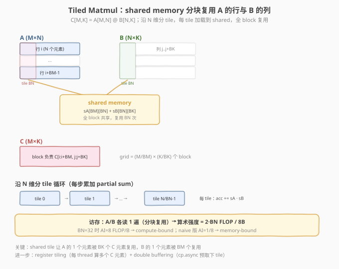

# LeetGPU Matrix Multiplication 题解

> **面试考察度**：⭐⭐⭐⭐⭐ 手撕 SGEMM 是中频第一题（见本专题 README 中频题第 1 条），"naive → block tile → thread tile"的优化链路几乎必被追问；本题是 #22 GEMM 的 FP32 简化入门版
> **面试形式**：现场手写 tiled matmul kernel + 讲清每一步优化收益；背熟 index 会被一眼看穿，必须理解分块的动机

## 1. 题目概述

- **标题 / 题号**：Matrix Multiplication（LeetGPU #2，easy）
- **链接**：https://leetgpu.com/challenges/matrix-multiplication
- **难度**：简单
- **标签**：CUDA、GEMM、shared memory tiling、compute-bound、FP32

**题意**：给定行主序 FP32 矩阵 `A`（`M×N`）、`B`（`N×K`），计算 `C = A @ B`：

$$C[i][j] = \sum_{k=0}^{N-1} A[i][k] \cdot B[k][j], \qquad C \in \mathbb{R}^{M \times K}$$

函数签名固定（与 `starter.cu` 一致）：

```cpp
extern "C" void solve(const float* A, const float* B, float* C, int M, int N, int K);
```

**关键约束**：

- `A`、`B`、`C` 均为 **FP32（`float`）**，行主序
- 容差 `atol=1e-4, rtol=1e-4`（FP32 累加，较松）
- 性能测例 `M=8192, N=6144, K=4096`（约 0.6 GFLOP × 2 = 1.2 GFLOP）
- 无 α/β、无 FP16、无 WMMA——纯 CUDA Core 的 tiled matmul

> 💡 **与 #22 GEMM 的区别**：#22 是 medium，带 α/β、FP16 输入、允许 WMMA（Tensor Core）；本题是 easy，纯 FP32 + 无 epilogue，是 tiled matmul 的最简入门。两者骨架同构，本题先打好 tiling 基础，#22 再加精度与 Tensor Core。

## 2. CPU 基线 / 朴素 GPU 方法

### 2.1 CPU 串行基线

```cpp
// cpu_baseline.cpp —— CPU 串行 matmul，三重循环
void matmul_cpu(const float* A, const float* B, float* C, int M, int N, int K) {
    for (int i = 0; i < M; ++i)
        for (int j = 0; j < K; ++j) {
            float acc = 0.0f;
            for (int k = 0; k < N; ++k)
                acc += A[i * N + k] * B[k * K + j];
            C[i * K + j] = acc;
        }
}
```

`O(M·N·K)`。每算一个 `C[i][j]` 要读 `A` 的 1 行 + `B` 的 1 列——朴素 GPU 版每线程独立算一个 `C` 元素，`A`/`B` 被重复读 `K`/`M` 次，**算术强度仅 `1/8 FLOP/Byte`**（2 FLOP / 16B），严重 memory-bound。

### 2.2 朴素 GPU 的瓶颈

```cuda
// 错误示范：每 thread 独立算一个 C 元素，A/B 重复读
__global__ void matmul_naive(const float* A, const float* B, float* C, int M, int N, int K) {
    int i = blockIdx.x * blockDim.x + threadIdx.x;
    int j = blockIdx.y * blockDim.y + threadIdx.y;
    if (i >= M || j >= K) return;
    float acc = 0.0f;
    for (int k = 0; k < N; ++k)
        acc += A[i * N + k] * B[k * K + j];   // ← A 行被 M 个 thread 重读，B 列被 K 个重读
    C[i * K + j] = acc;
}
```

问题：`A[i][k]` 被同一行 `K` 个 thread 重复读、`B[k][j]` 被同一列 `M` 个重复读 → 算术强度 `2/16 = 0.125 FLOP/Byte`，远低于 ridge point，**纯 memory-bound**。

## 3. GPU 设计

### 3.1 并行化策略：shared memory tiling

**核心映射**：把 `C` 分成 `BM×BK` 的 tile，一个 block 负责一个 tile。沿 `N` 维再分 `BN` 大小的 tile 循环累加——每步加载 `A` 的 `BM×BN` 块和 `B` 的 `BN×BK` 块到 shared memory，全 block 复用。



| 配置 | 值 | 说明 |
|------|----|------|
| `BM × BK` | 32×32 | 一个 block 负责的 C tile 大小 |
| `BN` | 32 | N 维 tile，shared memory 块宽 |
| block | `BM×BK`=256 thread | 每 thread 算 1 个 C 元素（入门版） |
| grid | `(M/BM) × (K/BK)` | 覆盖整个 C |

### 3.2 存储层次使用

| 层次 | 是否使用 | 说明 |
|------|----------|------|
| **global memory** | ✓ | `A`/`B` 各读 1 遍（分块复用），`C` 写 1 遍 |
| **shared memory** | ✓ | `sA[BM][BN]` + `sB[BN][BK]`，全 block 共享 |
| **register** | ✓ | 每 thread `acc` 累加器 |

### 3.3 关键技巧：tile 复用提升算术强度

每加载 1 个 `A` tile（`BM×BN`）和 1 个 `B` tile（`BN×BK`），做 `BM·BN·BK` 次 FMA。算术强度：

$$AI = \frac{2 \cdot BM \cdot BN \cdot BK}{4 \cdot (BM \cdot BN + BN \cdot BK)} = \frac{2 \cdot BN \cdot BM \cdot BK}{4 \cdot BN \cdot (BM + BK)}$$

`BM=BK=BN=32` 时 `AI = 2·32·32·32 / (4·32·64) = 8 FLOP/Byte`——比 naive 的 `0.125` 提升 **64 倍**，进入 compute-bound 区间。

> 💡 **为什么 tiling 有效？** shared memory 让 `A` 的 1 个元素被 `BK` 个 C 元素复用、`B` 的 1 个被 `BM` 个复用，把重复读从 global 搬到 shared（快 100 倍）。这是所有 compute-bound kernel 的通用套路。

## 4. Kernel 实现

```cuda
// cuda_matrix_multiplication.cu —— 手撕 Tiled Matmul：shared memory 分块
// 编译命令: nvcc -O3 -arch=sm_120 cuda_matrix_multiplication.cu -o matmul -lineinfo
// 运行:     ./matmul 8192 6144 4096

#include <cstdio>
#include <cstdlib>
#include <cmath>
#include <cuda_runtime.h>

#define CHECK_CUDA(call)                                                       \
    do {                                                                       \
        cudaError_t e = (call);                                                \
        if (e != cudaSuccess) {                                                \
            fprintf(stderr, "CUDA error %s:%d: %s\n", __FILE__, __LINE__,      \
                    cudaGetErrorString(e));                                    \
            exit(EXIT_FAILURE);                                                \
        }                                                                      \
    } while (0)

#define BM 32
#define BK 32
#define BN 32
#define BLOCK_SIZE (BM * BK)   // 256

// ---- Tiled Matmul kernel ----
__global__ void matmul_kernel(const float* __restrict__ A,
                              const float* __restrict__ B,
                              float* __restrict__ C,
                              int M, int N, int K) {
    __shared__ float sA[BM][BN];
    __shared__ float sB[BN][BK];

    int bx = blockIdx.x, by = blockIdx.y;
    int tx = threadIdx.x / BK, ty = threadIdx.x % BK;   // thread 在 tile 内坐标

    int row = bx * BM + tx;          // C 的行
    int col = by * BK + ty;          // C 的列
    float acc = 0.0f;

    int numTiles = (N + BN - 1) / BN;
    for (int t = 0; t < numTiles; ++t) {
        // ---- 加载 A tile (BM×BN) ----
        if (row < M && t * BN + ty < N)
            sA[tx][ty] = A[row * N + t * BN + ty];
        else
            sA[tx][ty] = 0.0f;
        // ---- 加载 B tile (BN×BK) ----
        if (t * BN + tx < N && col < K)
            sB[tx][ty] = B[(t * BN + tx) * K + col];
        else
            sB[tx][ty] = 0.0f;
        __syncthreads();

        // ---- 累加 ----
        #pragma unroll
        for (int k = 0; k < BN; ++k)
            acc += sA[tx][k] * sB[k][ty];
        __syncthreads();
    }

    if (row < M && col < K)
        C[row * K + col] = acc;
}

int main(int argc, char** argv) {
    int M = (argc > 1) ? atoi(argv[1]) : 8192;
    int N = (argc > 2) ? atoi(argv[2]) : 6144;
    int K = (argc > 3) ? atoi(argv[3]) : 4096;
    size_t bytesA = (size_t)M * N * sizeof(float);
    size_t bytesB = (size_t)N * K * sizeof(float);
    size_t bytesC = (size_t)M * K * sizeof(float);
    printf("M=%d, N=%d, K=%d  (%.1f MB total)\n", M, N, K, (bytesA+bytesB+bytesC)/1e6);

    float *hA = (float*)malloc(bytesA), *hB = (float*)malloc(bytesB), *hC = (float*)malloc(bytesC);
    srand(42);
    for (int i = 0; i < M*N; ++i) hA[i] = ((float)(rand()%200)-100.0f)/10.0f;
    for (int i = 0; i < N*K; ++i) hB[i] = ((float)(rand()%200)-100.0f)/10.0f;

    float *dA, *dB, *dC;
    CHECK_CUDA(cudaMalloc(&dA, bytesA)); CHECK_CUDA(cudaMalloc(&dB, bytesB)); CHECK_CUDA(cudaMalloc(&dC, bytesC));
    CHECK_CUDA(cudaMemcpy(dA, hA, bytesA, cudaMemcpyHostToDevice));
    CHECK_CUDA(cudaMemcpy(dB, hB, bytesB, cudaMemcpyHostToDevice));

    cudaEvent_t t0, t1; cudaEventCreate(&t0); cudaEventCreate(&t1);
    cudaEventRecord(t0);
    dim3 grid((M + BM - 1) / BM, (K + BK - 1) / BK);
    matmul_kernel<<<grid, BLOCK_SIZE>>>(dA, dB, dC, M, N, K);
    cudaEventRecord(t1);
    CHECK_CUDA(cudaDeviceSynchronize());
    float ms = 0; cudaEventElapsedTime(&ms, t0, t1);
    double gflops = 2.0 * M * N * K / 1e9 / (ms / 1e3);
    printf("kernel time: %.3f ms, %.1f GFLOP/s\n", ms, gflops);

    // 验证
    CHECK_CUDA(cudaMemcpy(hC, dC, bytesC, cudaMemcpyDeviceToHost));
    float maxDiff = 0.0f;
    for (int i = 0; i < M && i < 8; ++i)
        for (int j = 0; j < K && j < 8; ++j) {
            float ref = 0.0f;
            for (int k = 0; k < N; ++k) ref += hA[i*N+k] * hB[k*K+j];
            maxDiff = fmaxf(maxDiff, fabsf(hC[i*K+j] - ref));
        }
    printf("max diff (8x8 sample): %.2e (%s)\n", maxDiff, maxDiff < 1e-3f ? "PASS" : "FAIL");

    CHECK_CUDA(cudaFree(dA)); CHECK_CUDA(cudaFree(dB)); CHECK_CUDA(cudaFree(dC));
    free(hA); free(hB); free(hC);
    return 0;
}
```

### 4.1 LeetGPU 提交版本

```cuda
// matrix_multiplication_submit.cu —— LeetGPU 提交版
// 编译命令: nvcc -O3 -arch=sm_120 matrix_multiplication_submit.cu -c
#include <cuda_runtime.h>

#define BM 32
#define BK 32
#define BN 32
#define BLOCK_SIZE (BM * BK)

__global__ void matmul_kernel(const float* __restrict__ A,
                              const float* __restrict__ B,
                              float* __restrict__ C,
                              int M, int N, int K) {
    __shared__ float sA[BM][BN];
    __shared__ float sB[BN][BK];
    int bx = blockIdx.x, by = blockIdx.y;
    int tx = threadIdx.x / BK, ty = threadIdx.x % BK;
    int row = bx * BM + tx, col = by * BK + ty;
    float acc = 0.0f;

    for (int t = 0; t < (N + BN - 1) / BN; ++t) {
        sA[tx][ty] = (row < M && t * BN + ty < N) ? A[row * N + t * BN + ty] : 0.0f;
        sB[tx][ty] = (t * BN + tx < N && col < K) ? B[(t * BN + tx) * K + col] : 0.0f;
        __syncthreads();
        #pragma unroll
        for (int k = 0; k < BN; ++k) acc += sA[tx][k] * sB[k][ty];
        __syncthreads();
    }
    if (row < M && col < K) C[row * K + col] = acc;
}

extern "C" void solve(const float* A, const float* B, float* C, int M, int N, int K) {
    dim3 grid((M + BM - 1) / BM, (K + BK - 1) / BK);
    matmul_kernel<<<grid, BLOCK_SIZE>>>(A, B, C, M, N, K);
}
```

### 4.2 代码详解

| 步骤 | 代码 | 说明 |
|------|------|------|
| **block 映射** | `bx, by → C tile [bx*BM, by*BK]` | grid = `(M/BM) × (K/BK)` |
| **thread 映射** | `tx = tid/BK, ty = tid%BK` | 每 thread 算 `C[row][col]` 一个元素 |
| **加载 A tile** | `sA[tx][ty] = A[row*N + t*BN + ty]` | 协作加载 `BM×BN` 块到 shared |
| **加载 B tile** | `sB[tx][ty] = B[(t*BN+tx)*K + col]` | 协作加载 `BN×BK` 块 |
| **同步** | `__syncthreads()` | 等全 block 加载完才能算 |
| **累加** | `acc += sA[tx][k] * sB[k][ty]` | 在 shared 上做内积，复用 BN 次 |
| **同步** | `__syncthreads()` | 等全 block 算完才能覆盖 shared 加载下 tile |
| **写回** | `C[row*K + col] = acc` | 所有 tile 累加完写最终结果 |

**关键索引关系**：

- `row = bx*BM + tx`，`col = by*BK + ty` — C 的全局坐标
- `t` — N 维 tile 编号，`numTiles = ⌈N/BN⌉`
- `sA[tx][k]` 对应 `A[row][t*BN + k]`，`sB[k][ty]` 对应 `B[t*BN+k][col]`

**两次 `__syncthreads()` 各等什么**：

1. 加载后：等全 block 把 `sA`/`sB` 写完 → 否则读到未初始化值；
2. 累加后：等全 block 读完 `sA`/`sB` → 否则下一轮加载覆盖未读数据。

> 💡 **关键洞察**：tiled matmul 的本质是**用 shared memory 把 global 的重复读变成 shared 的复用**。每步加载 `2·BN·BM` 个 float 到 shared，做 `BM·BN·BK` 次 FMA——算术强度随 tile 增大而提升，把 memory-bound 推向 compute-bound。面试官想听的就是"为什么 tile 能提升 AI"——答案在复用。

## 5. 性能分析与优化

### 5.1 编译与运行

```bash
nvcc -O3 -arch=sm_120 cuda_matrix_multiplication.cu -o matmul -lineinfo
./matmul 8192 6144 4096
```

### 5.2 用 ncu 确认 compute-bound

```bash
ncu --kernel-name regex:matmul_kernel \
    --metrics gpu__time_duration.sum, dram__throughput.avg.pct_of_peak_sustained_elapsed, \
              sm__throughput.avg.pct_of_peak_sustained_elapsed \
    ./matmul 8192 6144 4096
```

tiled 版 `SM%` 应接近或高于 `DRAM%`（compute-bound），naive 版则 `DRAM% >> SM%`。

### 5.3 进阶优化方向

1. **register tiling**：每 thread 算 `TM×TK` 个 C 元素（如 4×4），减少 shared 访问；
2. **double buffering**：`cp.async` 预取下一 tile，掩盖加载延迟；
3. **更大的 tile**（64×64）+ 调整 block size 提升 occupancy；
4. **float4 向量化加载**：一次读 16B；
5. **Tensor Core（WMMA/`mma.sync`）**：FP16 输入 + FP32 累加，提速一个数量级（见 #22 GEMM）。

## 6. 复杂度分析

| 维度 | 分析 |
|------|------|
| **时间复杂度** | `O(M·N·K)` FMA |
| **空间复杂度** | `O(M·N + N·K + M·K)` global + `O(BM·BN + BN·BK)` shared |
| **算术强度（tiled）** | `~8 FLOP/Byte`（BN=32），compute-bound |
| **瓶颈类型** | **compute-bound**（tiled 后）；naive 是 memory-bound |
| **shared 用量** | `2·32·32·4 = 8KB` / block |

> 💡 **一句话总结**：Matrix Multiplication = "shared memory tiling 把重复读变复用"，算术强度从 `0.125` 提升到 `8 FLOP/Byte`，从 memory-bound 推向 compute-bound。本题是 #22 GEMM 的 FP32 入门版，掌握 tiling 骨架后，register blocking / double buffer / Tensor Core 都是"加优化层"的变体。

## 面试考点

- **手撕要求**：默写 `BM=BK=BN=32` 的 tiled matmul——block 映射 C tile、协作加载 `sA`/`sB`、两次 `__syncthreads`、tile 循环累加。讲清"为什么 tile 能提升算术强度"。
- **高频追问**：
  - **为什么 tiling 有效？** shared memory 让 A 的 1 元素被 BK 个 C 复用、B 的 1 被 BM 个复用，算术强度 `2·BM·BN·BK / (4·BN·(BM+BK))` 随 tile 增大提升，把 memory-bound 推向 compute-bound。
  - **`__syncthreads` 两次各等什么？** 加载后等写完 shared（否则读未初始化），累加后等读完 shared（否则下轮覆盖）。
  - **naive 和 tiled 的算术强度差多少？** naive `0.125 FLOP/Byte`（memory-bound），tiled `8 FLOP/Byte`（compute-bound），差 64 倍。
  - **还能怎么优化？** register tiling（每 thread 算多 C 元素）、double buffer（cp.async 预取）、float4 向量化、Tensor Core（见 #22）。
- **进阶延伸**：#22 GEMM 加 FP16+WMMA，#30 batched GEMM 加 batch 维，#57 FP16 batched matmul。生产级用 cuBLAS（已做 register tiling + Tensor Core + split-K）。

## 同类练习题

下面是与本题考查相同 CUDA 概念的 LeetGPU 练习题，建议按顺序挑战：

| # | 题目 | 难度 | 与本题的关联 |
|---|------|------|-------------|
| 22 | [GEMM](https://leetgpu.com/challenges/general-matrix-multiplication-gemm) | 中等 | 完整 GEMM，register blocking + 双缓冲进阶 |
| 30 | [Batched Matrix Multiplication](https://leetgpu.com/challenges/batched-matrix-multiplication) | 中等 | batched GEMM，多组矩阵并行 |
| 37 | [Matrix Power](https://leetgpu.com/challenges/matrix-power) | 中等 | 重复 matmul，练习 tiling 复用 |
| 32 | [INT8 Quantized MatMul](https://leetgpu.com/challenges/int8-quantized-matmul) | 中等 | INT8 量化 GEMM，低精度计算 |

> 💡 **选题思路**：tiled matmul + register tiling，练习 GEMM 这一 compute-bound 核心模板。做完这组练习，即可掌握该 CUDA 模板在不同场景下的迁移应用。
