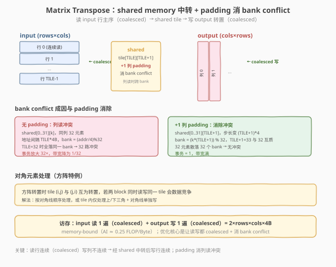

# LeetGPU Matrix Transpose 题解

> **面试考察度**：⭐⭐⭐⭐ 矩阵转置是 shared memory + bank conflict 的招牌题，面试常考"读写不能同时合并时怎么取舍、bank conflict 怎么消除"
> **面试形式**：手写 shared memory tiling 转置 + 讲清 padding 消 bank conflict 的原理

## 1. 题目概述

- **标题 / 题号**：Matrix Transpose（LeetGPU #3，easy）
- **链接**：https://leetgpu.com/challenges/matrix-transpose
- **难度**：简单
- **标签**：CUDA、Transpose、shared memory tiling、bank conflict、coalesced 访存、memory-bound

**题意**：给定行主序 FP32 矩阵 `input`（`rows×cols`），计算其转置 `output = input^T`（`cols×rows`）：

$$\text{output}[j][i] = \text{input}[i][j]$$

函数签名固定（与 `starter.cu` 一致）：

```cpp
extern "C" void solve(const float* input, float* output, int rows, int cols);
```

**关键约束**：

- `input`、`output` 均为 **FP32（`float`）**，行主序
- 容差 `atol=1e-5, rtol=1e-5`
- 性能测例 `rows=7000, cols=6000`（约 168 MB）
- 无计算，纯数据重排——**典型 memory-bound**

> ⚠️ **核心矛盾**：读 `input` 按行连续（coalesced）时，写 `output` 按列不连续（strided）；反之亦然。朴素转置无法让读写同时 coalesced。解法是**经 shared memory 中转**：读行 → 存 tile → 写行（转置后）。

## 2. CPU 基线 / 朴素 GPU 方法

### 2.1 CPU 串行基线

```cpp
// cpu_baseline.cpp —— CPU 串行转置
void transpose_cpu(const float* input, float* output, int rows, int cols) {
    for (int i = 0; i < rows; ++i)
        for (int j = 0; j < cols; ++j)
            output[j * rows + i] = input[i * cols + j];   // 行读列写
}
```

### 2.2 朴素 GPU 的矛盾

```cuda
// 错误示范：每 thread 转置一个元素，读写必有一个不合并
__global__ void transpose_naive(const float* input, float* output, int rows, int cols) {
    int i = blockIdx.x * blockDim.x + threadIdx.x;
    int j = blockIdx.y * blockDim.y + threadIdx.y;
    if (i >= rows || j >= cols) return;
    output[j * rows + i] = input[i * cols + j];   // 读 input 行连续(coalesced)，但写 output 列不连续(strided)
}
```

朴素版读 `input[i][j]`（行连续，coalesced）但写 `output[j][i]`（列步长 `rows`，strided）——写不合并导致事务放大 32×。反之若让写合并则读不合并。**朴素转置无法让读写同时 coalesced**。

## 3. GPU 设计

### 3.1 并行化策略：shared memory 中转

**核心映射**：把矩阵分成 `TILE×TILE` 的块，一个 block 负责一个块。读 `input` 的 tile 按行（coalesced）存入 shared，再从 shared 按转置后的行（即原列）读出写 `output`（coalesced）。



| 配置 | 值 | 说明 |
|------|----|------|
| `TILE` | 32 | tile 边长 |
| block | `TILE×TILE`=256... 实际用 32 thread | 每 thread 处理多个元素 |
| grid | `(cols/TILE) × (rows/TILE)` | 覆盖整个矩阵 |

### 3.2 存储层次使用

| 层次 | 是否使用 | 说明 |
|------|----------|------|
| **global memory** | ✓ | `input` 读 1 遍（行 coalesced）、`output` 写 1 遍（行 coalesced） |
| **shared memory** | ✓ | `tile[TILE][TILE+1]`，**+1 列 padding 消 bank conflict** |
| **register** | — | 无需 |

### 3.3 关键技巧：padding 消 bank conflict

从 shared 按列读（转置）时，若 `tile[TILE][TILE]` 且 `TILE=32`，则同列 32 个元素地址间隔 `32×4=128B`，bank = `(addr/4) % 32` 全相同 → **32 路 bank conflict**，事务放大 32×。加一列 padding（`tile[TILE][TILE+1]`）后步长变 `33×4`，`33` 与 `32` 互质 → 32 元素散落 32 bank，无冲突。

> 💡 **面试核心**：能讲清"bank conflict 成因（同列读步长是 bank 数的倍数）+ padding 消除（加 1 列让步长与 32 互质）"是本题区分点。这是 shared memory 优化的经典套路，在 matmul/convolution/attention 里反复出现。

## 4. Kernel 实现

```cuda
// cuda_matrix_transpose.cu —— 手撕 Tiled Transpose：shared memory 中转 + padding
// 编译命令: nvcc -O3 -arch=sm_120 cuda_matrix_transpose.cu -o transpose -lineinfo
// 运行:     ./transpose 7000 6000

#include <cstdio>
#include <cstdlib>
#include <cmath>
#include <cuda_runtime.h>

#define CHECK_CUDA(call)                                                       \
    do {                                                                       \
        cudaError_t e = (call);                                                \
        if (e != cudaSuccess) {                                                \
            fprintf(stderr, "CUDA error %s:%d: %s\n", __FILE__, __LINE__,      \
                    cudaGetErrorString(e));                                    \
            exit(EXIT_FAILURE);                                                \
        }                                                                      \
    } while (0)

#define TILE 32

// ---- Tiled Transpose kernel（+1 列 padding 消 bank conflict）----
__global__ void transpose_kernel(const float* __restrict__ input,
                                 float* __restrict__ output,
                                 int rows, int cols) {
    __shared__ float tile[TILE][TILE + 1];   // ← +1 padding 消 bank conflict

    int x = blockIdx.x * TILE + threadIdx.x;  // input 的列 / output 的行
    int y = blockIdx.y * TILE + threadIdx.y;  // input 的行 / output 的列

    // ---- 读 input tile（行连续，coalesced）----
    if (x < cols && y < rows)
        tile[threadIdx.y][threadIdx.x] = input[y * cols + x];
    __syncthreads();

    // ---- 转置 block 坐标 ----
    x = blockIdx.y * TILE + threadIdx.x;      // output 的行（原 input 的列）
    y = blockIdx.x * TILE + threadIdx.y;      // output 的列（原 input 的行）

    // ---- 写 output tile（行连续，coalesced）----
    if (x < rows && y < cols)
        output[y * rows + x] = tile[threadIdx.x][threadIdx.y];   // 转置读写
}

int main(int argc, char** argv) {
    int rows = (argc > 1) ? atoi(argv[1]) : 7000;
    int cols = (argc > 2) ? atoi(argv[2]) : 6000;
    size_t bytes = (size_t)rows * cols * sizeof(float);
    printf("rows=%d, cols=%d  (%.1f MB)\n", rows, cols, bytes / 1e6);

    float *hIn = (float*)malloc(bytes), *hOut = (float*)malloc(bytes);
    srand(42);
    for (int i = 0; i < rows * cols; ++i) hIn[i] = (float)(rand() % 1000) / 10.0f;

    float *dIn, *dOut;
    CHECK_CUDA(cudaMalloc(&dIn, bytes)); CHECK_CUDA(cudaMalloc(&dOut, bytes));
    CHECK_CUDA(cudaMemcpy(dIn, hIn, bytes, cudaMemcpyHostToDevice));

    cudaEvent_t t0, t1; cudaEventCreate(&t0); cudaEventCreate(&t1);
    cudaEventRecord(t0);
    dim3 block(TILE, TILE);
    dim3 grid((cols + TILE - 1) / TILE, (rows + TILE - 1) / TILE);
    transpose_kernel<<<grid, block>>>(dIn, dOut, rows, cols);
    cudaEventRecord(t1);
    CHECK_CUDA(cudaDeviceSynchronize());
    float ms = 0; cudaEventElapsedTime(&ms, t0, t1);
    printf("kernel time: %.3f ms, bandwidth: %.1f GB/s\n", ms, (2.0f * bytes) / 1e9 / (ms / 1e3));

    CHECK_CUDA(cudaMemcpy(hOut, dOut, bytes, cudaMemcpyDeviceToHost));
    float maxDiff = 0.0f;
    for (int i = 0; i < rows && i < 8; ++i)
        for (int j = 0; j < cols && j < 8; ++j)
            maxDiff = fmaxf(maxDiff, fabsf(hOut[j * rows + i] - hIn[i * cols + j]));
    printf("max diff (8x8): %.2e (%s)\n", maxDiff, maxDiff < 1e-5f ? "PASS" : "FAIL");

    CHECK_CUDA(cudaFree(dIn)); CHECK_CUDA(cudaFree(dOut));
    free(hIn); free(hOut);
    return 0;
}
```

### 4.1 LeetGPU 提交版本

```cuda
// matrix_transpose_submit.cu —— LeetGPU 提交版
#include <cuda_runtime.h>
#define TILE 32

__global__ void transpose_kernel(const float* __restrict__ input,
                                 float* __restrict__ output,
                                 int rows, int cols) {
    __shared__ float tile[TILE][TILE + 1];
    int x = blockIdx.x * TILE + threadIdx.x;
    int y = blockIdx.y * TILE + threadIdx.y;
    if (x < cols && y < rows) tile[threadIdx.y][threadIdx.x] = input[y * cols + x];
    __syncthreads();
    x = blockIdx.y * TILE + threadIdx.x;
    y = blockIdx.x * TILE + threadIdx.y;
    if (x < rows && y < cols) output[y * rows + x] = tile[threadIdx.x][threadIdx.y];
}

extern "C" void solve(const float* input, float* output, int rows, int cols) {
    dim3 block(TILE, TILE);
    dim3 grid((cols + TILE - 1) / TILE, (rows + TILE - 1) / TILE);
    transpose_kernel<<<grid, block>>>(input, output, rows, cols);
}
```

### 4.2 代码详解

| 步骤 | 代码 | 说明 |
|------|------|------|
| **读 input tile** | `tile[ty][tx] = input[y*cols + x]` | 行连续读，coalesced |
| **同步** | `__syncthreads()` | 等全 block 写完 shared |
| **转置坐标** | `x = by*TILE+tx; y = bx*TILE+ty` | 交换 block 坐标，写 output 的转置位置 |
| **写 output tile** | `output[y*rows + x] = tile[tx][ty]` | 从 shared 转置读出，行连续写，coalesced |

**关键索引关系**：

- 读阶段：`x = bx*TILE+tx`（input 列），`y = by*TILE+ty`（input 行）
- 写阶段：`x = by*TILE+tx`（output 行 = 原 input 列），`y = bx*TILE+ty`（output 列 = 原 input 行）
- `tile[tx][ty]` 读出即转置（行列互换）

**`__syncthreads()` 的作用**：等全 block 把 input tile 写入 shared → 否则读 shared 时部分元素未初始化。写完 output 不需同步（各 thread 独立写不同地址）。

> 💡 **关键洞察**：转置的本质矛盾是"读行连续则写列不连续"。shared memory 中转把"写列"变成"从 shared 读列 + 写行"——读列虽在 shared 内有 bank conflict（用 padding 消），但写行 coalesced。最终读写 global 都 coalesced，是 shared memory 解决访存矛盾的经典范式。

## 5. 性能分析与优化

### 5.1 编译与运行

```bash
nvcc -O3 -arch=sm_120 cuda_matrix_transpose.cu -o transpose -lineinfo
./transpose 7000 6000
```

### 5.2 用 ncu 对比 bank conflict

```bash
ncu --kernel-name regex:transpose_kernel \
    --metrics l1tex__data_bank_conflicts_pipe_lsu_mem_shared.sum, \
              dram__throughput.avg.pct_of_peak_sustained_elapsed \
    ./transpose 7000 6000
```

- 无 padding 版：`bank_conflicts` 高（32 路），带宽低；
- +1 padding 版：`bank_conflicts` ≈ 0，带宽接近峰值。

### 5.3 优化方向

1. **对角线处理**：方阵转置时 tile (i,j) 与 (j,i) 互为转置，需按对角顺序避免竞争；
2. **更大 tile + 向量化**：`TILE=64` + `float4` 加载；
3. **`cp.async` 双缓冲**：掩盖 shared 加载延迟。

## 6. 复杂度分析

| 维度 | 分析 |
|------|------|
| **时间复杂度** | `O(rows·cols)` 纯数据搬运 |
| **空间复杂度** | `O(rows·cols)` input + output + `O(TILE²)` shared |
| **算术强度** | `0 FLOP / 8B`（无计算），纯 memory-bound |
| **瓶颈类型** | **memory-bound**；优化目标是让读写都 coalesced + 消 bank conflict |
| **shared 用量** | `32×33×4 = 4.2KB` / block |

> 💡 **一句话总结**：Matrix Transpose = "shared memory 中转让读写都 coalesced + padding 消 bank conflict"。它是 shared memory 优化的教科书——读写矛盾经中转化解，bank conflict 经 padding 消除。这套套路在 matmul/conv/attention 的 shared tile 里反复出现。

## 面试考点

- **手撕要求**：默写 `TILE=32` 的 tiled transpose——读行存 shared、`__syncthreads`、转置坐标写行。讲清 padding 消 bank conflict。
- **高频追问**：
  - **为什么朴素转置慢？** 读行 coalesced 则写列 strided，反之亦然——无法同时 coalesced，必有一端事务放大 32×。
  - **bank conflict 怎么产生？怎么消除？** 列读 shared 时步长 `TILE×4B`，`TILE=32` 时 32 元素落同一 bank（32 路 conflict）；加 1 列 padding（`TILE+1`）让步长 `33×4`，33 与 32 互质，散落到 32 bank 无冲突。
  - **`__syncthreads` 什么时候需要？** 读 input 写 shared 后必须同步，否则写 output 时 shared 未填满。写 output 后无需同步（各写各的）。
  - **为什么不用 register 中转？** 转置需要 block 内全员交换数据，register 是 thread 私有的，shared 是 block 共享的——只有 shared 能做中转。
- **进阶延伸**：方阵对角线处理、NHWC↔NCHW 布局转换（CV 常用）、attention 里 Q/K/V 的 head 重排都是 transpose 的变体。

## 同类练习题

下面是与本题考查相同 CUDA 概念的 LeetGPU 练习题，建议按顺序挑战：

| # | 题目 | 难度 | 与本题的关联 |
|---|------|------|-------------|
| 31 | [Matrix Copy](https://leetgpu.com/challenges/matrix-copy) | 简单 | 纯拷贝带宽优化，对比转置的访存模式 |
| 10 | [2D Convolution](https://leetgpu.com/challenges/2d-convolution) | 中等 | 2D shared memory halo + tiling |
| 2 | [Matrix Multiplication](https://leetgpu.com/challenges/matrix-multiplication) | 简单 | tiled matmul，同样用 shared mem 分块 |
| 63 | [Interleave](https://leetgpu.com/challenges/interleave) | 简单 | 写索引重排，coalesced 练习 |

> 💡 **选题思路**：shared memory tiling + bank conflict padding，练习矩阵数据重排类 kernel。做完这组练习，即可掌握该 CUDA 模板在不同场景下的迁移应用。
