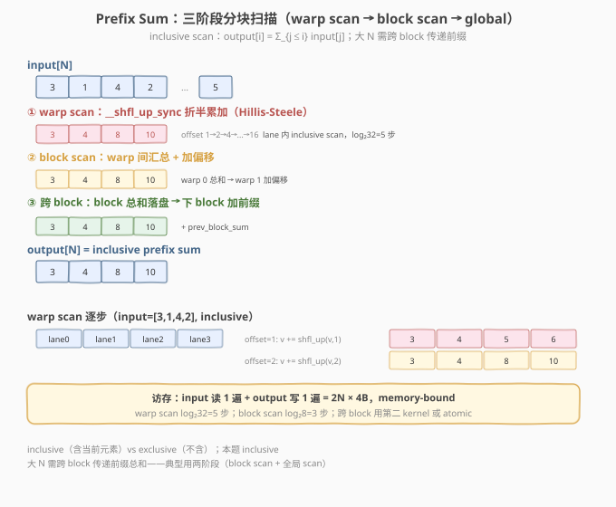

# LeetGPU Prefix Sum 题解

> **面试考察度**：⭐⭐⭐⭐ Prefix Sum（scan）是并行算法的核心模板，与 reduce 并列为基础组件；知乎面经中标注出现两次，soft attention / stream compaction / 累积采样都用它
> **面试形式**：手写 warp scan（`__shfl_up_sync`）+ 讲清"warp 内 scan 怎么做、block 间怎么传前缀"

## 1. 题目概述

- **标题 / 题号**：Prefix Sum（LeetGPU #16，medium）
- **链接**：https://leetgpu.com/challenges/prefix-sum
- **难度**：中等
- **标签**：CUDA、Prefix Sum、Scan、warp shuffle、`__shfl_up_sync`、Hillis-Steele、memory-bound

**题意**：给定长度 `N` 的 `float32` 一维数组 `input`，计算**inclusive** prefix sum（前缀和）：

$$\text{output}[i] = \sum_{j=0}^{i} \text{input}[j]$$

函数签名固定（与 `starter.cu` 一致）：

```cpp
extern "C" void solve(const float* input, float* output, int N);
```

**关键约束**：

- `input`、`output` 均为 **FP32（`float`）**，1D 连续
- 容差 `atol=0.01, rtol=0.01`（较松，因大 N 浮点累加误差累积）
- 性能测例 `N=250000`，`input` 在 `[-100, 100]` 均匀分布
- inclusive scan（含当前元素）；与 `torch.cumsum` 对齐

> ⚠️ **核心难点**：scan 有**数据依赖**（`output[i]` 依赖 `output[i-1]`），不像 reduce/elementwise 可全并行。解法是用 **Hillis-Steele** 或 **Blelloch** 扫描算法，把串行 `O(N)` 变成并行 `O(log N)` 步——每步用 `__shfl_up_sync` 在 warp 内折半累加。

> 💡 **为什么 scan 是面试高频？** 它是 reduce 的"带状态"变体——reduce 只要一个最终结果，scan 要所有中间前缀。soft attention 的 cumsum、stream compaction 的索引计算、top-p sampling 的累积概率都用 scan。会写 warp scan 就掌握了"有依赖的并行"这一范式。

**示例**（`N=4`，`input=[3,1,4,2]`）：

```text
output[0] = 3
output[1] = 3+1 = 4
output[2] = 3+1+4 = 8
output[3] = 3+1+4+2 = 10
output = [3, 4, 8, 10]
```

## 2. CPU 基线 / 朴素 GPU 方法

### 2.1 CPU 串行基线

```cpp
// cpu_baseline.cpp —— CPU 串行 prefix sum
void prefix_sum_cpu(const float* input, float* output, int N) {
    float acc = 0.0f;
    for (int i = 0; i < N; ++i) {
        acc += input[i];
        output[i] = acc;    // inclusive
    }
}
```

严格串行 `O(N)`，每步依赖前一步——无法直接并行化。

### 2.2 朴素 GPU 的困境

```cuda
// 错误示范：每 thread 串行累加（无并行）
__global__ void scan_naive(const float* input, float* output, int N) {
    int i = threadIdx.x;
    float acc = 0.0f;
    for (int j = 0; j <= i; ++j) acc += input[j];   // ← 每 thread 重扫前缀，O(N²) 访存
    output[i] = acc;
}
```

朴素版每 thread 独立累加 `0..i`，`O(N²)` 访存——完全没利用并行。正确做法是 **Hillis-Steele 并行扫描**：每步让每个位置加上"距离为 `offset` 的前驱"，`log N` 步完成。

## 3. GPU 设计

### 3.1 并行化策略：三阶段分块扫描



| 阶段 | 范围 | 手段 | 步数 |
|------|------|------|------|
| **① warp scan** | 32 lane 内 | `__shfl_up_sync` 折半累加（Hillis-Steele） | `log₂32 = 5` |
| **② block scan** | 256 thread（8 warp）内 | warp 0 汇总各 warp 总和 → 各 warp 加偏移 | `log₂8 = 3` |
| **③ 跨 block** | 全局 | block 总和落盘 → 下 block 加前缀（两阶段 kernel） | — |

### 3.2 存储层次使用

| 层次 | 是否使用 | 说明 |
|------|----------|------|
| **global memory** | ✓ | `input` 读 1 遍、`output` 写 1 遍；`block_sums[]` 中间结果 |
| **shared memory** | ✓ | warp 间汇总 `shared[NUM_WARPS]` + 偏移广播 |
| **register** | ✓ | 每 thread `val` + warp shuffle 寄存器交换 |

### 3.3 关键技巧：`__shfl_up_sync` 做 warp scan

warp 内 inclusive scan 用 **Hillis-Steele** 算法：`offset` 从 1→2→4→...→16，每步 `val += __shfl_up_sync(mask, val, offset)`（取前 `offset` 个 lane 的值相加）。5 步后每个 lane 持有 `0..lane` 的前缀和。

> 💡 **Hillis-Steele vs Blelloch**：Hillis-Steele 是 inclusive（每步都含当前），`log N` 步但每步全参与；Blelloch 是 exclusive（up-sweep 求 reduce + down-sweep 加偏移），work-efficient 但步数翻倍。面试手撕用 Hillis-Steele 更简洁，`__shfl_up_sync` 直接对应。

## 4. Kernel 实现

```cuda
// cuda_prefix_sum.cu —— 手撕 Prefix Sum：warp scan + block scan + 跨 block
// 编译命令: nvcc -O3 -arch=sm_120 cuda_prefix_sum.cu -o scan -lineinfo
// 运行:     ./scan 250000

#include <cstdio>
#include <cstdlib>
#include <cuda_runtime.h>

#define CHECK_CUDA(call)                                                       \
    do {                                                                       \
        cudaError_t e = (call);                                                \
        if (e != cudaSuccess) {                                                \
            fprintf(stderr, "CUDA error %s:%d: %s\n", __FILE__, __LINE__,      \
                    cudaGetErrorString(e));                                    \
            exit(EXIT_FAILURE);                                                \
        }                                                                      \
    } while (0)

#define BLOCK_SIZE 256
#define WARP_SIZE 32
#define NUM_WARPS (BLOCK_SIZE / WARP_SIZE)

// ---- warp inclusive scan（Hillis-Steele，__shfl_up_sync）----
__inline__ __device__ float warp_inclusive_scan(float val) {
    #pragma unroll
    for (int offset = 1; offset < WARP_SIZE; offset <<= 1)
        val += __shfl_up_sync(0xffffffff, val, offset);
    return val;
}

// ---- block inclusive scan（warp scan + warp 间汇总 + 加偏移）----
__inline__ __device__ float block_inclusive_scan(float val, float* shared) {
    int lane = threadIdx.x & (WARP_SIZE - 1);
    int warpId = threadIdx.x >> 5;
    val = warp_inclusive_scan(val);
    if (lane == WARP_SIZE - 1)
        shared[warpId] = val;             // 每 warp 总和（最后一个 lane 持有）
    __syncthreads();

    if (warpId == 0) {
        float v = (lane < NUM_WARPS) ? shared[lane] : 0.0f;
        v = warp_inclusive_scan(v);       // 对 warp 总和做 scan
        if (lane < NUM_WARPS) shared[lane] = v;
    }
    __syncthreads();

    float prefix = (warpId > 0) ? shared[warpId - 1] : 0.0f;  // 前 warp 的累计
    return val + prefix;                  // 加偏移得本 block inclusive
}

// ---- Kernel 1：每 block 做 inclusive scan，输出 block 总和 ----
__global__ void scan_block_kernel(const float* __restrict__ input,
                                  float* __restrict__ output,
                                  float* __restrict__ block_sums,
                                  int N) {
    __shared__ float shared[NUM_WARPS];
    int tid = threadIdx.x;
    int gid = blockIdx.x * BLOCK_SIZE + tid;

    float val = (gid < N) ? input[gid] : 0.0f;
    float scanned = block_inclusive_scan(val, shared);

    if (gid < N) output[gid] = scanned;
    if (tid == BLOCK_SIZE - 1) block_sums[blockIdx.x] = scanned;  // block 总和
}

// ---- Kernel 2：对 block_sums 做 inclusive scan ----
__global__ void scan_sums_kernel(float* __restrict__ block_sums, int M) {
    __shared__ float shared[NUM_WARPS];
    int tid = threadIdx.x;
    float val = (tid < M) ? block_sums[tid] : 0.0f;
    block_sums[tid] = block_inclusive_scan(val, shared);
}

// ---- Kernel 3：每 block 加前缀偏移 ----
__global__ void add_offset_kernel(float* __restrict__ output,
                                  const float* __restrict__ block_sums,
                                  int N) {
    int gid = blockIdx.x * BLOCK_SIZE + threadIdx.x;
    if (gid < N && blockIdx.x > 0)
        output[gid] += block_sums[blockIdx.x - 1];
}

int main(int argc, char** argv) {
    int N = (argc > 1) ? atoi(argv[1]) : 250000;
    size_t bytes = (size_t)N * sizeof(float);
    printf("N=%d\n", N);

    float *hIn = (float*)malloc(bytes), *hOut = (float*)malloc(bytes);
    srand(42);
    for (int i = 0; i < N; ++i) hIn[i] = ((float)(rand() % 20000) - 10000.0f) / 100.0f;

    float *dIn, *dOut, *dSums;
    CHECK_CUDA(cudaMalloc(&dIn, bytes)); CHECK_CUDA(cudaMalloc(&dOut, bytes));
    int numBlocks = (N + BLOCK_SIZE - 1) / BLOCK_SIZE;
    CHECK_CUDA(cudaMalloc(&dSums, numBlocks * sizeof(float)));
    CHECK_CUDA(cudaMemcpy(dIn, hIn, bytes, cudaMemcpyHostToDevice));

    cudaEvent_t t0, t1; cudaEventCreate(&t0); cudaEventCreate(&t1);
    cudaEventRecord(t0);
    scan_block_kernel<<<numBlocks, BLOCK_SIZE>>>(dIn, dOut, dSums, N);
    scan_sums_kernel<<<1, BLOCK_SIZE>>>(dSums, numBlocks);
    add_offset_kernel<<<numBlocks, BLOCK_SIZE>>>(dOut, dSums, N);
    cudaEventRecord(t1);
    CHECK_CUDA(cudaDeviceSynchronize());
    float ms = 0; cudaEventElapsedTime(&ms, t0, t1);
    printf("kernel time: %.3f ms\n", ms);

    CHECK_CUDA(cudaMemcpy(hOut, dOut, bytes, cudaMemcpyDeviceToHost));
    float acc = 0.0f, maxDiff = 0.0f;
    for (int i = 0; i < N; ++i) {
        acc += hIn[i];
        maxDiff = fmaxf(maxDiff, fabsf(hOut[i] - acc));
    }
    printf("max diff: %.2e (%s)\n", maxDiff, maxDiff < 0.01f * fmaxf(1.0f, fabsf(acc)) ? "PASS" : "FAIL");

    CHECK_CUDA(cudaFree(dIn)); CHECK_CUDA(cudaFree(dOut)); CHECK_CUDA(cudaFree(dSums));
    free(hIn); free(hOut);
    return 0;
}
```

### 4.1 LeetGPU 提交版本

```cuda
// prefix_sum_submit.cu —— LeetGPU 提交版
#include <cuda_runtime.h>
#define BLOCK_SIZE 256
#define WARP_SIZE 32
#define NUM_WARPS (BLOCK_SIZE / WARP_SIZE)

__inline__ __device__ float warp_inclusive_scan(float val) {
    #pragma unroll
    for (int offset = 1; offset < WARP_SIZE; offset <<= 1)
        val += __shfl_up_sync(0xffffffff, val, offset);
    return val;
}

__inline__ __device__ float block_inclusive_scan(float val, float* shared) {
    int lane = threadIdx.x & (WARP_SIZE - 1);
    int warpId = threadIdx.x >> 5;
    val = warp_inclusive_scan(val);
    if (lane == WARP_SIZE - 1) shared[warpId] = val;
    __syncthreads();
    if (warpId == 0) {
        float v = (lane < NUM_WARPS) ? shared[lane] : 0.0f;
        v = warp_inclusive_scan(v);
        if (lane < NUM_WARPS) shared[lane] = v;
    }
    __syncthreads();
    float prefix = (warpId > 0) ? shared[warpId - 1] : 0.0f;
    return val + prefix;
}

__global__ void scan_block_kernel(const float* input, float* output, float* block_sums, int N) {
    __shared__ float shared[NUM_WARPS];
    int tid = threadIdx.x, gid = blockIdx.x * BLOCK_SIZE + tid;
    float val = (gid < N) ? input[gid] : 0.0f;
    float scanned = block_inclusive_scan(val, shared);
    if (gid < N) output[gid] = scanned;
    if (tid == BLOCK_SIZE - 1) block_sums[blockIdx.x] = scanned;
}

__global__ void scan_sums_kernel(float* block_sums, int M) {
    __shared__ float shared[NUM_WARPS];
    int tid = threadIdx.x;
    float val = (tid < M) ? block_sums[tid] : 0.0f;
    block_sums[tid] = block_inclusive_scan(val, shared);
}

__global__ void add_offset_kernel(float* output, const float* block_sums, int N) {
    int gid = blockIdx.x * BLOCK_SIZE + threadIdx.x;
    if (gid < N && blockIdx.x > 0) output[gid] += block_sums[blockIdx.x - 1];
}

extern "C" void solve(const float* input, float* output, int N) {
    int numBlocks = (N + BLOCK_SIZE - 1) / BLOCK_SIZE;
    float* block_sums;
    cudaMalloc(&block_sums, numBlocks * sizeof(float));
    scan_block_kernel<<<numBlocks, BLOCK_SIZE>>>(input, output, block_sums, N);
    scan_sums_kernel<<<1, BLOCK_SIZE>>>(block_sums, numBlocks);
    add_offset_kernel<<<numBlocks, BLOCK_SIZE>>>(output, block_sums, N);
    cudaFree(block_sums);
}
```

### 4.2 代码详解

| 步骤 | 代码 | 说明 |
|------|------|------|
| **warp scan** | `val += __shfl_up_sync(mask, val, offset)` | offset 1→2→4→8→16，5 步后 lane i 持有 `Σ input[0..i]` |
| **warp 总和落盘** | `if (lane==31) shared[warpId] = val` | 每 warp 最后一个 lane 持有 warp 总和 |
| **warp 间 scan** | warp 0 对 `shared[0..7]` 再 scan | 得到各 warp 的前缀偏移 |
| **加偏移** | `val + shared[warpId-1]` | warp 0 不加，其余加前 warp 累计 |
| **block 总和落盘** | `block_sums[bx] = scanned` | 供跨 block 加偏移 |
| **跨 block** | scan_sums + add_offset | 对 block 总和 scan，每 block 加前 block 偏移 |

> 💡 **关键洞察**：scan 的本质是"用 `log N` 步并行打破串行依赖"。warp 内用 `__shfl_up_sync` 折半累加（Hillis-Steele），block 内用 warp 间汇总+加偏移，跨 block 用三阶段（block scan → sums scan → add offset）。这是"有数据依赖的并行"的通用范式——stream compaction / cumsum / 累积采样都是它的变体。

## 5. 性能分析与优化

### 5.1 编译与运行

```bash
nvcc -O3 -arch=sm_120 cuda_prefix_sum.cu -o scan -lineinfo
./scan 250000
```

### 5.2 优化方向

1. **Blelloch scan**：work-efficient（`2N` 操作 vs Hillis-Steele 的 `N log N`），大 N 更优；
2. **单 kernel + shared 大缓冲**：小 N 时省 launch 开销；
3. **`double` 累加**：本题容差 `0.01` 较松，FP32 够用；要求高精度时升 double；
4. **向量化加载**：`float4` 一次读 4 元素。

## 6. 复杂度分析

| 维度 | 分析 |
|------|------|
| **时间复杂度** | `O(N)`（Hillis-Steele `N log W`，W=32 常数） |
| **空间复杂度** | `O(N)` + `O(numBlocks)` block_sums + `O(NUM_WARPS)` shared |
| **算术强度** | `~1 FLOP / 8B`，memory-bound |
| **瓶颈类型** | **memory-bound** |
| **warp scan 步数** | `log₂32 = 5` |
| **kernel 数** | 3（block scan / sums scan / add offset） |

> 💡 **一句话总结**：Prefix Sum = "warp shuffle scan + block 间三阶段传前缀"，用 `log N` 步并行打破串行依赖。它是 reduce 的"带状态"变体，soft attention / stream compaction / 累积采样的基础组件。掌握 Hillis-Steele 的 `__shfl_up_sync` 折半累加是核心。

## 面试考点

- **手撕要求**：默写 warp inclusive scan（`__shfl_up_sync` offset 1→16）+ block scan（warp 间汇总加偏移）。
- **高频追问**：
  - **scan 怎么并行化？** Hillis-Steele：每步每个位置加前 `offset` 个 lane 的值，`log N` 步完成；用 `__shfl_up_sync` 在寄存器间直传。
  - **inclusive 和 exclusive 区别？** inclusive 含当前元素（`output[i]=Σ_{j≤i}`），exclusive 不含（`output[i]=Σ_{j<i}`）。exclusive 可由 inclusive 减自身得到。
  - **block 间怎么传前缀？** 三阶段：block scan 输出每 block 总和 → 对总和 scan → 每 block 加前 block 偏移。kernel 边界做全局同步。
  - **Hillis-Steele vs Blelloch？** Hillis-Steele `N log N` 操作、`log N` 步；Blelloch `2N` 操作（work-efficient）、`2 log N` 步。手撕用前者更简洁。
- **进阶延伸**：segmented scan（#70，带段边界重置）、stream compaction（predicate + scan）、FlashAttention 的 cumsum 都是 scan 变体。

## 同类练习题

下面是与本题考查相同 CUDA 概念的 LeetGPU 练习题，建议按顺序挑战：

| # | 题目 | 难度 | 与本题的关联 |
|---|------|------|-------------|
| 70 | [Segmented Prefix Sum](https://leetgpu.com/challenges/segmented-prefix-sum) | 中等 | 分段 scan，段边界处理进阶 |
| 72 | [Stream Compaction](https://leetgpu.com/challenges/stream-compaction) | 中等 | predicate + scan 得到输出位置 |
| 47 | [Subarray Sum](https://leetgpu.com/challenges/subarray-sum) | 中等 | prefix sum 直接应用求子和 |
| 82 | [Linear Recurrence](https://leetgpu.com/challenges/linear-recurrence) | 中等 | 线性递推，scan 的数学扩展 |

> 💡 **选题思路**：warp scan + 三阶段分块 scan，练习并行前缀扫描这一核心模板。做完这组练习，即可掌握该 CUDA 模板在不同场景下的迁移应用。
