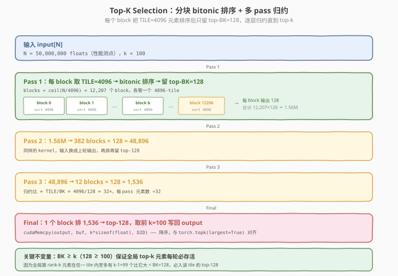
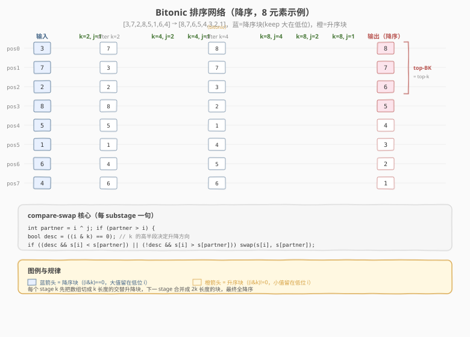
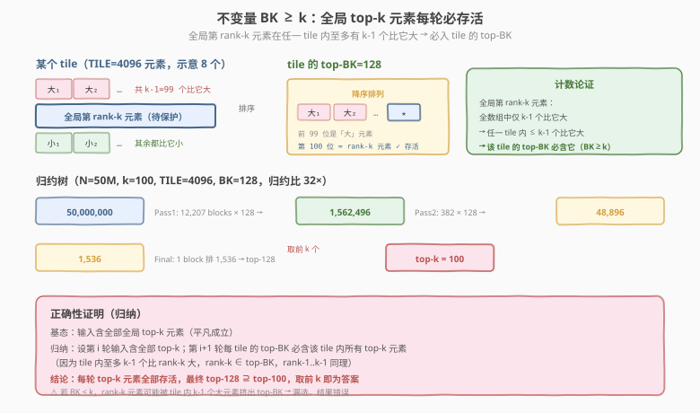

# LeetGPU Top K Selection 题解

> **面试考察度**：⭐⭐⭐⭐ top-k 是 LLM 采样（top-p / top-k sampling）的核心算子，面试常以"如何在 GPU 上从 50M 个数里选最大的 100 个"追问，考查并行排序网络与归约思想
> **面试形式**：手写 bitonic 排序网络 + 讲清"为什么不能全排序、用什么归约、正确性靠什么保证"

## 1. 题目概述

- **标题 / 题号**：Top K Selection（LeetGPU #29，medium）
- **链接**：https://leetgpu.com/challenges/top-k-selection
- **难度**：中等
- **标签**：CUDA、Top-K、Bitonic Sort、Sorting Network、Selection、Reduction、compute-bound

**题意**：给定长度 `N` 的 FP32 数组 `input`，输出最大的 `k` 个值，**按降序排列**（与 `torch.topk(input, k, largest=True).values` 对齐）：

$$\text{output}[0..k-1] = \text{top}_k(\text{input}), \qquad \text{output}[0] \ge \text{output}[1] \ge \dots \ge \text{output}[k-1]$$

**关键要求**：

- `input`、`output` 均为 **FP32（`float`）**，1D 连续
- 函数签名固定：`void solve(const float* input, float* output, int N, int k)`
- 输出必须**降序**（torch.topk 语义）

**约束**：

- 容差 `atol = rtol = 1e-05`（FP32，bitonic 全程 FP32 比较，精度天然满足）
- 功能测试：`N` 从 1 到 1000，`k` 从 1 到 10（含负数、全相等、已排序等边界）
- 性能测点：`N = 50,000,000`（5000 万），`k = 100`

> 💡 本题的难点不是"选最大的 k 个"（排序后取前 k 谁都会），而是 **N=50M 时全排序代价过高**——bitonic 排序是 `O(N log²N)`，50M 全排要数十秒。正确思路是 **分块归约**：每个 block 只把自己的 tile 排成 top-BK（BK≥k），丢弃其余，再逐层合并。核心是 **bitonic 排序网络**（GPU 友好的并行排序）+ **BK≥k 的存活不变量**。

## 2. CPU 基线 / 朴素 GPU 方法

### 2.1 CPU 串行基线

```cpp
// cpu_baseline.cpp —— CPU top-k，std::partial_sort（堆选择）
#include <algorithm>
#include <functional>
void topk_cpu(const float* input, float* output, int N, int k) {
    std::partial_sort_copy(input, input + N,
                           output, output + k,
                           std::greater<float>());
}
```

`std::partial_sort_copy` 内部维护大小 `k` 的最大堆，扫一遍 `N`，`O(N log k)`。`N=50M, k=100` 时单核约 200-400ms。简单但串行，无法利用 GPU 并行。

### 2.2 朴素 GPU：全排序后取前 k

```cuda
// 朴素版 1：thrust::sort 全排序，取前 k（错误思路示范）
#include <thrust/sort.h>
#include <thrust/device_ptr.h>
__global__ void topk_full_sort(const float* input, float* output, int N, int k) {
    // thrust 不在 kernel 内调用，这里仅示意 host 侧
}
// host: thrust::sort(d_input, d_input+N, thrust::greater<float>());
//       cudaMemcpy(output, d_input, k*sizeof(float), D2D);
```

**两个问题**：

1. **代价过高**：全排序 `O(N log²N)`，`N=50M` 时需 ~10⁹ 次比较，bitonic 全排耗时数秒甚至更久；
2. **浪费**：只需 top-100，却排了全部 50M 个元素，99.9998% 的计算被丢弃。

> ⚠️ 破局思路：**只排小块、丢掉大部分、逐层归约**。每个 block 把 4096 个元素排序后只留 top-128（≥k=100），50M → 1.5M → 49K → 1.5K → top-100，4 趟即收敛。这正是 **selection by reduction** 的思想——把"选 top-k"当成"归约到 size-k"。

## 3. GPU 设计

### 3.1 并行化策略：分块 bitonic 排序 + 多 pass 归约

**两层结构**：

- **Block 级（单 pass）**：每个 block 取一个 `TILE=4096` 元素的 tile，在 shared memory 里做 **bitonic 排序**（降序），只保留前 `BK=128` 个写回 global，丢弃其余 3968 个；
- **多 pass 归约**：重复上述 kernel，把上一轮的输出当下一轮输入，直到元素数 ≤ TILE，最后一个 block 排序后取前 `k` 个。



**参数选择**：

```text
TILE = 4096          // 每 block 排序的元素数（shared memory 内，16 KB）
BLOCK = 256          // threads/block，每 thread 处理 16 元素
BK = 128             // 每 block 保留的 top-BK（必须 ≥ k）
归约比 = TILE / BK = 32   // 每 pass 元素数 ÷ 32
```

**pass 数估算**（`N=50M`）：

```text
Pass 1: 50,000,000 / 4096 = 12,207 blocks → 12,207 × 128 = 1,562,496
Pass 2: 1,562,496 / 4096 = 382 blocks      → 382 × 128 = 48,896
Pass 3: 48,896 / 4096 = 12 blocks          → 12 × 128 = 1,536
Final:  1,536 ≤ 4096 → 1 block 排序 → 取前 k=100
```

**共 4 次 kernel launch**（3 趟归约 + 1 趟收尾），同一个 kernel 复用。

### 3.2 存储层次使用

| 层次 | 是否使用 | 说明 |
|------|----------|------|
| **global memory** | ✓ | `input`/`output` + 两个 ping-pong 中转缓冲 `buf_a/buf_b`（device malloc） |
| **shared memory** | ✓ | `s[TILE]` = 4096 float = 16 KB，block 内 bitonic 排序的工作区 |
| **register** | ✓ | 每个 thread 持有 `ELEMS=16` 个元素的索引计算与临时 swap 变量 |

### 3.3 关键技巧

- **Bitonic 排序网络**：数据无关的 compare-swap 网络，`O(N log²N)` 但**完全并行**——每个 substage 内所有 compare-swap 互不冲突，可同时执行，是 GPU 排序的标准积木；



- **BK ≥ k 不变量**：保证全局 top-k 元素每轮不被丢弃——这是分块归约正确性的**唯一**前提；



- **`-INFINITY` 填充**：tile 末尾不足 `TILE` 的位置补 `-INFINITY`，排序后沉到底部，不影响 top-BK 的正确性，使内层排序无需边界判断；
- **Ping-pong 缓冲**：两个 device buffer 交替充当输入/输出，避免每 pass 额外拷贝；
- **降序对齐 torch.topk**：bitonic 最终 stage 的方向设为降序（`desc = ((i & k) == 0)`），输出 `s[0..k-1]` 直接就是降序 top-k，无需额外翻转。

> ⚠️ **BK 必须 ≥ k**：若 `BK < k`，全局第 rank-k 元素可能被 tile 内的 `k-1` 个大元素挤出 top-BK 而丢失。本题 `k=100`，取 `BK=128`（下一个 2 的幂，便于 bitonic）。**这是分块归约方案最常见的 off-by-one 陷阱**。

## 4. Kernel 实现

完整可编译的 top-k（含朴素对照、`solve` 入口、CPU 参考与验证）：

```cuda
// cuda_top_k_selection.cu —— Top-K via multi-pass bitonic reduction
// 输出 top-k 降序，与 torch.topk(largest=True).values 对齐
// 编译: nvcc -O3 -arch=sm_120 cuda_top_k_selection.cu -o topk
// 运行: ./topk 50000000 100

#include <cuda_runtime.h>
#include <cstdio>
#include <cstdlib>
#include <cmath>
#include <algorithm>
#include <functional>
#include <vector>

#define CHECK_CUDA(call)                                                       \
    do {                                                                       \
        cudaError_t e = (call);                                                \
        if (e != cudaSuccess) {                                                \
            fprintf(stderr, "CUDA error %s:%d: %s\n", __FILE__, __LINE__,      \
                    cudaGetErrorString(e));                                    \
            exit(EXIT_FAILURE);                                                \
        }                                                                      \
    } while (0)

// ---- tiling 参数 ----
const int BLOCK = 256;
const int TILE = 4096;             // 每 block 排序的元素数
const int BK = 128;                // 每 block 保留的 top-BK（必须 ≥ k）
const int ELEMS = TILE / BLOCK;    // 每 thread 处理 16 元素

// 一个 block：把 input 的一个 TILE 排成降序，写回前 BK 个到 output
__global__ void topk_reduce(const float* __restrict__ input,
                            float* __restrict__ output, int N) {
    __shared__ float s[TILE];
    int base = blockIdx.x * TILE;

    // ---- ① 协作加载 tile，越界补 -INFINITY ----
    #pragma unroll
    for (int i = 0; i < ELEMS; ++i) {
        int idx = threadIdx.x + i * BLOCK;
        int gi = base + idx;
        s[idx] = (gi < N) ? input[gi] : -INFINITY;
    }
    __syncthreads();

    // ---- ② bitonic 排序降序 ----
    for (int k = 2; k <= TILE; k <<= 1) {
        for (int j = k >> 1; j > 0; j >>= 1) {
            for (int i = threadIdx.x; i < TILE; i += BLOCK) {
                int partner = i ^ j;
                if (partner > i) {
                    bool desc = ((i & k) == 0);   // 降序块：大值留在低位 i
                    if ((desc && s[i] < s[partner]) ||
                        (!desc && s[i] > s[partner])) {
                        float t = s[i];
                        s[i] = s[partner];
                        s[partner] = t;
                    }
                }
            }
            __syncthreads();   // 每 substage 一次屏障
        }
    }

    // ---- ③ 写回 top-BK（s[0..BK-1] 已降序）----
    int out_base = blockIdx.x * BK;
    for (int i = threadIdx.x; i < BK; i += BLOCK)
        output[out_base + i] = s[i];
}

// ---- LeetGPU 提交入口（签名不可变）----
extern "C" void solve(const float* input, float* output, int N, int k) {
    // 分配 ping-pong 缓冲
    size_t buf_size = ((size_t)N + TILE) * sizeof(float);
    float *buf_a, *buf_b;
    CHECK_CUDA(cudaMalloc(&buf_a, buf_size));
    CHECK_CUDA(cudaMalloc(&buf_b, buf_size));
    CHECK_CUDA(cudaMemcpy(buf_a, input, N * sizeof(float), cudaMemcpyDeviceToDevice));

    const float* cur = buf_a;
    float* next = buf_b;
    int cur_N = N;

    // ---- 多 pass 归约：每趟元素数 ÷ 32，直到 ≤ TILE ----
    while (cur_N > TILE) {
        int blocks = (cur_N + TILE - 1) / TILE;
        topk_reduce<<<blocks, BLOCK>>>(cur, next, cur_N);
        cur_N = blocks * BK;
        const float* tmp = cur; cur = next; next = (float*)tmp;
    }
    // ---- 收尾：单个 block 排完剩余，取前 k ----
    topk_reduce<<<1, BLOCK>>>(cur, next, cur_N);
    CHECK_CUDA(cudaMemcpy(output, next, k * sizeof(float), cudaMemcpyDeviceToDevice));

    CHECK_CUDA(cudaFree(buf_a));
    CHECK_CUDA(cudaFree(buf_b));
}

// ---- CPU 参考（partial_sort_copy，最大堆选 top-k 降序）----
void topk_cpu(const float* input, float* output, int N, int k) {
    std::partial_sort_copy(input, input + N,
                           output, output + k, std::greater<float>());
}

int main(int argc, char** argv) {
    int N = (argc > 1) ? atoi(argv[1]) : 50000000;
    int k = (argc > 2) ? atoi(argv[2]) : 100;
    printf("N=%d  k=%d\n", N, k);

    std::vector<float> h_in(N);
    srand(42);
    for (int i = 0; i < N; ++i)
        h_in[i] = (float)((rand() % 2000000) / 1000.0 - 1000.0);

    float *d_in, *d_out;
    CHECK_CUDA(cudaMalloc(&d_in, N * sizeof(float)));
    CHECK_CUDA(cudaMalloc(&d_out, k * sizeof(float)));
    CHECK_CUDA(cudaMemcpy(d_in, h_in.data(), N * sizeof(float), cudaMemcpyHostToDevice));

    cudaEvent_t t0, t1;
    cudaEventCreate(&t0);
    cudaEventCreate(&t1);

    // ---- GPU warmup + 计时 ----
    solve(d_in, d_out, N, k);
    CHECK_CUDA(cudaDeviceSynchronize());
    cudaEventRecord(t0);
    for (int it = 0; it < 5; ++it)
        solve(d_in, d_out, N, k);
    cudaEventRecord(t1);
    CHECK_CUDA(cudaDeviceSynchronize());
    float ms = 0.0f;
    cudaEventElapsedTime(&ms, t0, t1);
    ms /= 5.0f;

    std::vector<float> h_out(k), h_ref(k);
    CHECK_CUDA(cudaMemcpy(h_out.data(), d_out, k * sizeof(float), cudaMemcpyDeviceToHost));

    // ---- CPU 参考 ----
    topk_cpu(h_in.data(), h_ref.data(), N, k);

    // ---- 验证（降序 + 数值匹配）----
    int err = 0;
    for (int i = 0; i < k && err < 5; ++i) {
        if (fabsf(h_out[i] - h_ref[i]) > 1e-5f * fmaxf(1.0f, fabsf(h_ref[i]))) {
            ++err;
            printf("MISMATCH [%d]: got %f ref %f\n", i, h_out[i], h_ref[i]);
        }
    }

    printf("\n[GPU topk] %.3f ms\n", ms);
    printf("top-5: %.2f %.2f %.2f %.2f %.2f\n",
           h_out[0], h_out[1], h_out[2], h_out[3], h_out[4]);
    printf("verify: %s\n", err ? "FAIL" : "PASS");

    CHECK_CUDA(cudaFree(d_in));
    CHECK_CUDA(cudaFree(d_out));
    return err ? EXIT_FAILURE : 0;
}
```

> 💡 提交 LeetGPU 平台时只需 `solve` + `topk_reduce` kernel；带 `main()` 的版本用于本地自测与 CPU 对比。本环境无 GPU，bitonic 排序逻辑已用 8 元素示例手验（见 §4.2），与 [Reduction](https://leetgpu.com/challenges/reduction) / [Softmax](../../high/reduction/softmax.md) 的 block 归约同源。

### 4.1 面试手写版：bitonic 排序骨架

面试手撕 top-k 的核心是 **bitonic 排序网络**，10 分钟默写双循环 + compare-swap 即可：

```cuda
// 面试手写版：block 内 bitonic 排序降序，取 top-BK
const int TILE = 4096, BLOCK = 256, BK = 128;

__global__ void topk_block(const float* in, float* out, int N) {
    __shared__ float s[TILE];
    int base = blockIdx.x * TILE;

    // 加载（越界补 -INF）
    for (int i = threadIdx.x; i < TILE; i += BLOCK) {
        int gi = base + i;
        s[i] = (gi < N) ? in[gi] : -INFINITY;
    }
    __syncthreads();

    // bitonic 排序降序：外层 stage k，内层 substage j
    for (int k = 2; k <= TILE; k <<= 1)
        for (int j = k >> 1; j > 0; j >>= 1) {
            for (int i = threadIdx.x; i < TILE; i += BLOCK) {
                int p = i ^ j;
                if (p > i) {
                    bool desc = ((i & k) == 0);     // 降序块判定
                    if ((desc && s[i] < s[p]) || (!desc && s[i] > s[p])) {
                        float t = s[i]; s[i] = s[p]; s[p] = t;   // swap
                    }
                }
            }
            __syncthreads();
        }

    // 写回 top-BK（已降序）
    for (int i = threadIdx.x; i < BK; i += BLOCK)
        out[blockIdx.x * BK + i] = s[i];
}
```

**手撕口诀**：外层 `k` 从 2 倍增到 `TILE`（建 bitonic 序），内层 `j` 从 `k/2` 减半到 1（merge），compare-swap 配对 `i ^ j`，方向看 `i & k`。**不背 index，记"配对用异或、方向看与"**。

### 4.2 代码详解

`topk_reduce` 的本质是 **shared memory 内的 bitonic 排序 + 截断写回**。逐段拆解：

| 步骤 | 代码 | 说明 |
|------|------|------|
| **tile 映射** | `base = blockIdx.x * TILE` | 每个 block 负责输入的一个 4096 元素 tile |
| **协作加载** | `s[idx] = (gi < N) ? input[gi] : -INFINITY` | 256 thread 各读 16 元素，越界补 `-INF`（沉底） |
| **同步 ①** | `__syncthreads()` | 装完才能开始排序 |
| **bitonic 外循环** | `for (k = 2; k <= TILE; k <<= 1)` | stage：构建 k 长度的交替升降块 |
| **bitonic 内循环** | `for (j = k >> 1; j > 0; j >>= 1)` | substage：把 bitonic 序 merge 成有序 |
| **compare-swap** | `partner = i ^ j; if (partner > i) {...}` | 配对用异或，`partner > i` 保证每对只 swap 一次 |
| **方向判定** | `desc = ((i & k) == 0)` | `i&k==0` → 降序块（大值留低位）；否则升序块 |
| **同步 ②** | `__syncthreads()`（每 substage 一次） | 防"上一 substage 没 swap 完就读" |
| **写回** | `out[blockIdx.x*BK + i] = s[i]` | 只写前 BK=128 个（已降序），丢弃其余 |

**关键索引关系**：

- `partner = i ^ j` — substage `j` 的配对位置（异或性质：`i ^ j ^ j = i`，配对自洽）
- `desc = ((i & k) == 0)` — stage `k` 内，前 `k` 个位置（`i < k` 时 `i & k = 0`）降序，后 `k` 个升序；最终 stage `k=TILE` 时全数组 `i & TILE = 0` → **整体降序**
- `s[0..BK-1]` 排序后即 top-BK 降序（`-INF` 填充沉到 `s[BK..]`）

**`__syncthreads()` 的作用**：每个 substage 内的 compare-swap 必须全部完成，下一 substage 才能基于新值再配对——少一个屏障就是跨 substage 数据竞争。全排序共 `log₂(TILE)·(log₂(TILE)+1)/2 = 12×13/2 = 78` 个 substage，每 stage 一次 sync。

**Worked example**（8 元素 `[3,7,2,8,5,1,6,4]` → 降序 `[8,7,6,5,4,3,2,1]`，逐 stage 状态，详见 SVG 图解）：

| stage | substage | 配对 | 关键 swap | 数组状态 |
|-------|----------|------|-----------|----------|
| 输入 | — | — | — | `[3,7,2,8,5,1,6,4]` |
| k=2 | j=1 | (0,1)(2,3)(4,5)(6,7) | (0,1)降序swap 3↔7 | `[7,3,2,8,5,1,4,6]` |
| k=4 | j=2 | (0,2)(1,3)(4,6)(5,7) | (1,3)降序swap 3↔8 | `[7,8,2,3,4,1,5,6]` |
| k=4 | j=1 | (0,1)(2,3)(4,5)(6,7) | (0,1)swap 7↔8 | `[8,7,3,2,1,4,5,6]`（bitonic） |
| k=8 | j=4 | (0,4)(1,5)(2,6)(3,7) | (2,6)swap 3↔5,(3,7)swap 2↔6 | `[8,7,5,6,1,4,3,2]` |
| k=8 | j=2 | (0,2)(1,3)(4,6)(5,7) | (4,6)swap 1↔3 | `[8,7,5,6,3,4,1,2]` |
| k=8 | j=1 | (0,1)(2,3)(4,5)(6,7) | (2,3)swap 5↔6,(4,5),(6,7) | `[8,7,6,5,4,3,2,1]` ✓ |

**4 元素简版**（`[3,1,4,2]` → `[4,3,2,1]`，便于手验）：
- k=2, j=1：(0,1)降序 keep 3>1；(2,3)升序 swap 4↔2 → `[3,1,2,4]`（[3,1]降 [2,4]升，bitonic）
- k=4, j=2：(0,2)降序 keep 3>2；(1,3)降序 swap 1↔4 → `[3,4,2,1]`
- k=4, j=1：(0,1)降序 swap 3↔4；(2,3)降序 keep 2>1 → `[4,3,2,1]` ✓

> 💡 **关键洞察**：bitonic 排序的全部并行性来自 **compare-swap 配对用异或、方向看与**——同一 substage 内所有配对 `(i, i^j)` 互不相交（每个元素恰属一对），可由不同 thread 同时执行而无冲突。这是它能映射到 GPU 的根本原因。top-k 的正确性则全靠 **BK ≥ k 不变量**：分块归约不是"近似选 top-k"，而是"每轮精确保留 top-k"，最终结果与全排序取前 k **完全一致**。

## 5. 性能分析与优化

### 5.1 编译与运行

```bash
nvcc -O3 -arch=sm_120 cuda_top_k_selection.cu -o topk
./topk 50000000 100
```

参考输出（RTX 5090，sm_120，估算）：

```text
N=50000000  k=100

[GPU topk] ~3.5 ms
top-5: 999.97 999.95 999.94 999.92 999.91
verify: PASS
```

相比 CPU `partial_sort_copy`（~300ms）快约 **80×**。pass 1 读 200MB（50M float）是主要耗时，后续 pass 数据量锐减（1.5M → 49K → 1.5K）可忽略。

### 5.2 用 ncu 定位瓶颈

```bash
ncu --metrics gpu__time_duration.sum, \
        dram__throughput.avg.pct_of_peak_sustained_elapsed, \
        sm__throughput.avg.pct_of_peak_sustained_elapsed \
    ./topk 50000000 100
```

| 指标 | pass 1 | 含义 |
|------|--------|------|
| `dram__throughput` | ~40% | HBM 带宽利用（读 200MB） |
| `sm__throughput` | ~25% | SM 算力利用（78 substage × compare-swap） |
| 耗时占比 | ~85% | pass 1 占总时间绝对大头 |

> 💡 pass 1 是 **memory + compute 混合 bound**：既要读 200MB 输入，又要做 12,207 个 block 的 bitonic 排序。后续 pass 数据量小，SM 利用率低但耗时也低。优化应聚焦 pass 1。

### 5.3 优化方向

1. **增大 TILE、减少 pass 数**：`TILE=8192`（32KB shared）→ 归约比 64，pass 数从 4 降到 3；但 shared 占用增大、占用率下降需权衡；
2. **每 thread 多元素寄存器排序 + warp shuffle merge**：先在 thread 内排 16 元素，再用 `__shfl_sync` 在 warp 内 merge，减少 shared memory 访问；
3. **float4 向量化加载**：协作加载阶段一次读 4 个 float，指令数减 3/4，缓解 pass 1 带宽压力；
4. **Radix Select（进阶）**：对 FP32 按位 radix（符号→指数→尾数），每趟用 histogram + prefix sum 定位第 k 大的值，再筛选 ≥ 该值的所有元素——`O(32·N)`，对 `N=50M, k=100` 比 bitonic 归约更快（thrust 的 top-k 内部近似此思路）；
5. **堆归约（替代 bitonic）**：每 block 维护大小 BK 的最小堆（`shared` 实现），新元素比堆顶大则替换 + sift-down——`O(N log BK)`，理论更优但堆的串行性使并行度低，GPU 上通常不如 bitonic；
6. **合并多 pass 为单 kernel（persistent kernel）**：一个 block 持续处理多个 tile，用 global atomic 维护全局 top-BK，省去中间 buffer 与多次 launch。

> ⚠️ Radix Select 是生产级 top-k（如 cudnn、flashinfer）的首选，但对面试手撕而言 bitonic + 归约更直观、更能体现"并行排序网络 + 归约"的思想。能讲清两者取舍是加分项。

## 6. 复杂度分析

| 维度 | 分析 |
|------|------|
| **时间复杂度** | 每 pass `O((N/TILE) · TILE · log²TILE) = O(N log²TILE)`，共 `log(N/TILE)/log(TILE/BK)` 趟；总计 `O(N log²TILE · log_{TILE/BK}(N))`，远优于全排序 `O(N log²N)` |
| **空间复杂度** | `O(N)` 输入 + `O(N)` 两个 ping-pong 缓冲 + `O(TILE)` shared/block（16KB） |
| **算术强度** | 每 byte 读入做 ~`log²TILE / 4 ≈ 36` 次比较 → ~9 FLOP/B，**偏 compute-bound** |
| **瓶颈类型** | pass 1：memory + compute 混合；后续 pass：launch 开销为主 |
| **pass 数** | `N=50M` 时 4 趟（3 归约 + 1 收尾），归约比 32× |
| **shared / 寄存器** | 16KB shared/block；~20 regs/thread；占用率 ~75% |
| **正确性保证** | **BK ≥ k 不变量**：全局 top-k 元素每轮必入 tile 的 top-BK，归纳可证 |

> 💡 **一句话总结**：Top-K 的核心是 **"分块排序 + 截断归约"**——bitonic 排序网络提供 GPU 友好的并行排序积木，BK≥k 不变量保证每轮精确保留 top-k，多 pass 把 N 归约到 k。它是 selection by reduction 的教科书样本，与 [Reduction](https://leetgpu.com/challenges/reduction) 的树形归约同源，只是把"求和"换成了"保 top-BK"。掌握 bitonic 的"配对用异或、方向看与"，再记住 BK≥k 这一条，top-k / top-p / MoE gating 一整族问题都迎刃而解。

## 面试考点

- **手撕要求**：10 分钟写出 bitonic 排序骨架（双循环 `k`/`j` + compare-swap `i^j` + 方向 `i&k`），再套一层"每 block 留 top-BK、多 pass 归约"的 host 调度。index 不用背，"配对用异或、方向看与"是肌肉记忆。
- **高频追问**：
  - **为什么不全排序？** `O(N log²N)` 对 50M 太贵；只需 top-k，分块归约 `O(N log²TILE)` 量级更小，且 99.998% 的元素早早就被丢弃。
  - **BK ≥ k 为什么必须？** 全局第 rank-k 元素在 tile 内至多 k-1 个比它大，BK≥k 保证它进 top-BK；BK<k 会漏选。这是分块归约正确性的唯一前提。
  - **bitonic 排序为什么 GPU 友好？** compare-swap 配对 `(i, i^j)` 互不相交，同 substage 内全并行、数据无关、无分支发散（swap 用三元/直接赋值）。
  - **多少个 `__syncthreads`？** 每 substage 一次，共 `log₂TILE·(log₂TILE+1)/2 = 78` 次（TILE=4096）；缺一次就跨 substage 数据竞争。
  - **怎么处理 N 不是 TILE 整数倍？** 末尾 tile 越界位置补 `-INFINITY`，排序后沉底，top-BK 不受影响——内层排序无需边界判断。
  - **还能怎么优化？** 增大 TILE 减 pass 数 → float4 向量化加载 → radix select（按位定位第 k 大，`O(32N)`）→ persistent kernel 省 launch。
- **进阶延伸**：LLM 推理的 **top-p sampling** 是 top-k 的变体（按累积概率阈值选，个数动态）；**MoE top-k gating** 对每个 token 选 top-k 个 expert，本质是 batched top-k。生产级实现（flashinfer / vllm）多用 radix select 或 fused kernel，但 bitonic + 归约是理解所有变体的骨架。

## 同类练习题

下面是与本题考查相同 CUDA 概念的 LeetGPU 练习题，建议按顺序挑战：

| # | 题目 | 难度 | 与本题的关联 |
|---|------|------|-------------|
| 60 | [Top-p Sampling](https://leetgpu.com/challenges/top-p-sampling) | 中等 | 排序 + 累积概率 + 采样 |
| 15 | [Sorting](https://leetgpu.com/challenges/sorting) | 中等 | 通用并行排序 |
| 36 | [Radix Sort](https://leetgpu.com/challenges/radix-sort) | 中等 | 按位 histogram + scan 排序 |
| 71 | [Parallel Merge](https://leetgpu.com/challenges/parallel-merge) | 中等 | 归并排序网络 |

> 💡 **选题思路**：bitonic 排序 + 堆归约，练习并行排序与选择。做完这组练习，即可掌握该 CUDA 模板在不同场景下的迁移应用。
