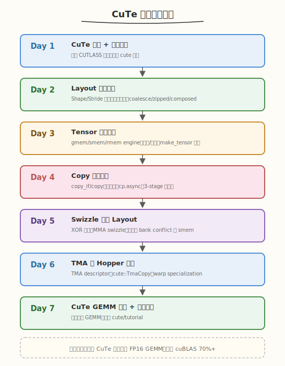

# CuTe 一周学习计划

> **适用对象**：已完成 [CUTLASS 专题](../cutlass/README.md) Day 2（CuTe 编程模型入门），掌握 Layout/Tensor/copy 基本用法；或已完成 week2 GEMM 手写实战、对 CUTLASS 3.x 有基本认知
> **本周目标**：从"会调用 CuTe API"升级到"能读懂 CuTe 源码并用 CuTe 原语组装高性能 kernel"，深入 Layout 代数、Tensor 引擎、Copy 原语、Swizzle 与 TMA，最终用 CuTe 原语写出一个达到 cuBLAS 70%+ 的 GEMM
> **时间投入**：工作日每天 2.5h（早间 1.5h + 晚间 1h），周末每天 5h，周计 22.5h
> **周日里程碑**：用 CuTe 原语（Layout + Tensor + copy + MMA）实现一个 FP16 GEMM，达到 cuBLAS 70%+，产出源码精读笔记与性能报告

---

## 本周总览

| 维度 | 内容 |
|------|------|
| **整体目标** | 掌握 CuTe 的 Layout 代数、Tensor 引擎分层、Copy 原语体系、Swizzle 作为 Layout、TMA descriptor 与 warp-specialized 流水线 |
| **核心产出** | ① CuTe Layout 代数实验集 ② 自定义 Swizzle 的 shared memory 加载 ③ TMA-based GEMM ④ CuTe 源码精读笔记（`cute/tensor.hpp`、`cute/swizzle_layout.hpp`、`cute/copy.hpp`）⑤ 性能对比报告 |
| **验收标准** | ① 能手算嵌套 Layout 的偏移并写出 `coalesce`/`zipped` 后的等价 Layout ② 能解释 Swizzle 作为 Layout 的数学含义并画出 XOR 映射图 ③ 能用 `cute::copy` + `cp.async`/TMA 写出 3-stage 流水线 ④ CuTe GEMM 达到 cuBLAS 70%+（4096×4096 FP16）⑤ 能用 `ncu` 分析 CuTe kernel 的 stall reasons 并定位瓶颈 |
| **面试准备** | 积累 10-12 道 CuTe 面试题，覆盖 Layout 代数、Tensor 抽象、Copy 选择策略、Swizzle 原理、TMA 与 cp.async 对比、CuTe 与 CUTLASS 2.x 索引方式对比 |

### 本专题与 [CUTLASS 专题](../cutlass/README.md) 的边界

| 维度 | CUTLASS 专题（Day 2） | 本 CuTe 专题 |
|------|----------------------|--------------|
| **深度** | API 使用层——会调 `make_layout`/`make_tensor`/`copy` | 源码层——理解 Layout 代数、Tensor engine 分层、Swizzle 作为 Layout |
| **范围** | CuTe 作为 CUTLASS 3.x 的子模块简介 | CuTe 作为独立的 kernel 组装框架，脱离 GEMM 模板也能用 |
| **TMA** | 提一句"CuTe 自动用 TMA" | 深入 TMA descriptor 构建、`cute::TmaCopy`、warp specialization |
| **Swizzle** | "copy 自动加 swizzle" | 手写 Swizzle、XOR 映射推演、MMA swizzle pattern |
| **产出** | 调 `CollectiveBuilder` 跑通 GEMM | 用 CuTe 原语**手写** GEMM（不调 CollectiveBuilder） |

> 💡 **一句话总结**：CUTLASS 专题教你"用" CuTe，本专题教你"懂" CuTe——前者调 `CollectiveBuilder` 自动出 kernel，后者拆开 `CollectiveBuilder` 看里面是怎么用 CuTe 原语拼出来的。掌握本专题后，再读 CUTLASS 3.x 的 `collective/mainloop.hpp` 会如读散文。

### 本周知识图谱



### 前置准备清单

#### 硬件/软件验证
- [ ] GPU Compute Capability >= 8.0（Ampere 及以上；Day 5/6 的 TMA 内容需 >= 9.0a 即 Hopper）
- [ ] CUDA Toolkit >= 12.0（CuTe 独立头文件需 12.x 的 `cuda/barrier`）
- [ ] CUTLASS >= 3.5（含稳定 CuTe，`git clone https://github.com/NVIDIA/cutlass.git`）
- [ ] CMake >= 3.18，Nsight Compute 可用

#### 验证命令
```bash
# 验证 GPU 架构（Day 5/6 需要 9.0+ 才能跑 TMA）
nvidia-smi --query-gpu=compute_cap,name --format=csv
# 预期输出：8.0 / 8.6 / 8.9 / 9.0 / 10.0 / 12.0

# 验证 CuTe 头文件可独立 include（不依赖 cutlass/gemm）
nvcc -I${CUTLASS_ROOT}/include -arch=sm_90a -std=c++17 -x cu -E - < /dev/null \
  -include cute/tensor.hpp 2>&1 | tail -5
# 预期：无报错，说明 CuTe 头文件可独立编译
```

#### 克隆 CUTLASS（含 CuTe）
```bash
git clone https://github.com/NVIDIA/cutlass.git
cd cutlass && git describe --tags
# 确认版本 >= v3.5.0
```

#### 必读 CuTe 资源（本周会反复用到）
- ⭐ [CuTe 源码目录](https://github.com/NVIDIA/cutlass/tree/main/include/cute) — `include/cute/`
- ⭐ [CuTe Tutorial 示例](https://github.com/NVIDIA/cutlass/tree/main/examples/cute) — `examples/cute/`（本周 Day 7 的对标目标）
- 📌 [CuTe GTC 2023 演讲](https://developer.nvidia.com/gtc/2023/video/s40095) — CuTe 设计哲学官方讲解

---

## Day 1（周一）：CuTe 总览与独立编译环境

> **今日目标**：理解 CuTe 作为独立 kernel 组装框架的定位，脱离 CUTLASS GEMM 模板编译第一个纯 CuTe 程序，建立 `include/cute/` 源码地图
> **面试考察度**：⭐⭐⭐ 了解级，能说清 CuTe 与 CUTLASS 的关系、为什么 CuTe 能脱离 GEMM 独立使用

---

### 学习任务 1：CuTe 是什么——从" CUTLASS 的子模块"到"独立 kernel 框架"（45 分钟）

#### 阅读内容
- **官方定位**：[CUTLASS 3.0 发布博客](https://developer.nvidia.com/blog/cutlass-3-0/) 中 "CuTe: A New Programming Model" 一节
- **源码入口**：`include/cute/README.md`（CuTe 自带的简短说明）
- **对比阅读**：回顾 [CUTLASS 专题 Day 2](../cutlass/day2.md) 的 CuTe 入门内容

#### 核心要点

CuTe（CUTLASS Tensor Engine）在 CUTLASS 3.0 中引入，但它**不是 GEMM 专用**的——它是一套通用的 GPU kernel 组装原语，核心是三个解耦的抽象：

| 抽象 | 本质 | 解决的问题 |
|------|------|-----------|
| **Layout** | `Coord → offset` 的整数函数 | 索引计算（"第 i 行第 j 列在内存哪里"） |
| **Tensor** | `指针 + Layout` 的绑定 | 数据访问（"用逻辑坐标读写数据"） |
| **Copy** | 根据源/目标 Layout 自动选择最优搬运策略 | 数据搬运（gmem↔smem↔rmem 的向量化与异步） |

> 💡 **关键洞察**：这三个抽象与 GEMM 完全无关——你可以用 CuTe 写 softmax、reduction、attention、conv，任何需要"分块 + 搬运 + 计算"的 kernel。CUTLASS 3.x 的 GEMM 只是用 CuTe 原语拼出来的一个特例。这就是为什么本专题能脱离 CUTLASS GEMM 模板独立学习。

#### CuTe 与 CUTLASS 2.x 索引方式对比

```cpp
// CUTLASS 2.x 风格：手写索引，每种布局都要特化
template <typename LayoutA>
struct PredicatedTileAccessIterator;
// RowMajor / ColumnMajor / AffineRankN 各写一个，模板参数爆炸

// CuTe 风格：Layout 是一等公民，索引统一为 layout(coord)
auto A = make_tensor(ptr_A, make_layout(shape, stride));
float v = A(i, k);  // 不管什么布局，访问代码完全一样
```

| 维度 | CUTLASS 2.x 索引 | CuTe 索引 |
|------|------------------|-----------|
| 抽象层级 | 布局特化迭代器 | Layout 函数 + Tensor 重载 |
| 代码量 | 每种布局一个迭代器类（数百行） | 一套 `tensor(i,j)` 通用 |
| 可组合性 | 差（嵌套要重写） | 强（Layout 可任意嵌套/合成） |
| Swizzle | 散落在各迭代器 | Swizzle **就是** Layout 的一部分 |

### 学习任务 2：独立编译环境（45 分钟）

CuTe 是 header-only，只需 include `cute/tensor.hpp` 即可，**不依赖** `cutlass/gemm/`。

```bash
# 验证 CuTe 可独立编译（不引入 cutlass/gemm）
cd ${CUTLASS_ROOT}

cat > /tmp/cute_standalone.cu << 'EOF'
#include <cute/tensor.hpp>
using namespace cute;

int main() {
    auto layout = make_layout(make_shape(4, 4), make_stride(1, 4));
    printf("layout(2,3) = %d\n", (int)layout(2, 3));  // 14
    return 0;
}
EOF

nvcc -o /tmp/cute_standalone /tmp/cute_standalone.cu \
     -I${CUTLASS_ROOT}/include -arch=sm_90a -std=c++17
/tmp/cute_standalone
# 预期输出：layout(2,3) = 14
```

> ⚠️ **架构参数**：Day 5/6 的 TMA 与 WGMMA 内容必须用 `-arch=sm_90a`（Hopper）或更高。Ampere（`sm_80`）可跑 Day 1-4，但 TMA 相关编译会报错。建议全程用 `sm_90a`。

### 学习任务 3：建立 `include/cute/` 源码地图（30 分钟）

```
include/cute/
├── tensor.hpp              # ★ Tensor 抽象：make_tensor、operator()、切片
├── layout.hpp              # ★ Layout 抽象：make_layout、Shape、Stride
├── swizzle_layout.hpp      # ★ Swizzle 作为 Layout（Day 5 核心）
├── copy.hpp                # ★ copy/copy_if 原语（Day 4 核心）
├── copy_sms.hpp            #   smem→smem copy（register 转置等）
├── tensor_pipeline.hpp     #   流水线封装（double/triple buffer）
├── arch/                   #   硬件指令抽象
│   ├── copy_sm80.hpp       #     cp.async（Ampere）
│   ├── copy_sm90_tma.hpp   #     TMA（Hopper，Day 6 核心）
│   ├── mma_sm80.hpp        #     Ampere MMA
│   └── mma_sm90_gmma.hpp   #     WGMMA（Hopper）
├── atom/                   #   MMA atom：最小可复用计算单元
└── pointer.hpp             #   指针抽象（int4/float4 vectorized）
```

#### 本周精读文件优先级

| 文件 | Day | 优先级 | 内容 |
|------|-----|--------|------|
| `layout.hpp` | 2 | ⭐ 必读 | Layout 代数：coalesce、zipped、composed |
| `tensor.hpp` | 3 | ⭐ 必读 | Tensor engine 分层、切片 |
| `copy.hpp` | 4 | ⭐ 必读 | copy 原语与向量化选择 |
| `swizzle_layout.hpp` | 5 | ⭐ 必读 | Swizzle 作为 Layout |
| `arch/copy_sm90_tma.hpp` | 6 | 📌 推荐 | TMA descriptor |

### 今日检查清单
- [ ] 能说出 CuTe 三大抽象（Layout/Tensor/Copy）各自解决的问题
- [ ] 能解释 CuTe 为何能脱离 CUTLASS GEMM 模板独立使用
- [ ] `/tmp/cute_standalone.cu` 不依赖 `cutlass/gemm/` 编译运行通过
- [ ] 浏览了 `include/cute/` 目录，标记了本周精读文件
- [ ] 把 `examples/cute/` 目录的 00-05 示例名抄到笔记里（Day 7 对标用）

---

## Day 2（周二）：Layout 代数深入

> **今日目标**：从"会调 `make_layout`"升级到"能手算嵌套 Layout 偏移、理解 Layout 的代数运算（coalesce/zipped/composed/partition）"
> **面试考察度**：⭐⭐⭐⭐⭐ 核心考点，CuTe 面试必问"Layout 的代数性质"

---

### 学习任务 1：Layout 作为整数函数（45 分钟）

#### Layout 的数学定义

Layout $L$ 是一个从逻辑坐标 $\mathbf{c}$ 到物理偏移 $o$ 的函数：

$$o = L(\mathbf{c}) = \sum_i c_i \cdot \mathrm{stride}_i, \qquad \mathbf{c} \in [0, \mathrm{shape}_i)$$

由 **Shape**（每维元素数）和 **Stride**（每维步长）共同定义。关键是：Shape 和 Stride **都可以是嵌套的**（`Shape<Shape<_4,_2>, _8>`）。

```cpp
// 基础 Layout：4×4 列主序
auto L = make_layout(make_shape(4, 4), make_stride(1, 4));
// L(2, 3) = 2*1 + 3*4 = 14

// 嵌套 Layout：把 4×4 看成 (2,2) × 4 的分块
auto Ln = make_layout(
    make_shape(make_shape(_2{}, _2{}), _4{}),           // ((2,2), 4)
    make_stride(make_stride(_1{}, _2{}), _4{})          // ((1,2), 4)
);
// Ln(make_coord(make_coord(0, 1), 3)) = 0*1 + 1*2 + 3*4 = 14（同上）
```

> 💡 **关键洞察**：嵌套 Layout **不改变物理偏移**，只改变逻辑视图。同一个内存，你可以用平铺 Layout 看成 4×4，也可以用嵌套 Layout 看成 2×2×4——后者天然表达"分块"语义，是 CuTe 适配 GEMM tiling 的根本机制。

### 学习任务 2：Layout 的代数运算（60 分钟）

这是 CuTe Layout 区别于普通 shape/stride 对的核心。源码在 `layout.hpp`，关键函数：

| 运算 | 函数 | 含义 | 用途 |
|------|------|------|------|
| **coalesce** | `coalesce(L)` | 把多维 Layout 化简为等价的一维 | 判断能否向量化加载 |
| **zipped** | `zipped(L)` | 把嵌套结构压平为 (inner, outer) | smem 访问优化 |
| **tiled** | `tiled(L, tile)` | 在 L 上重复 tile | threadblock tiling |
| **flatten** | `flatten(L)` | 完全压平为 1D | 调试输出 |
| **slice** | `slice(L, coord)` | 取固定坐标的子 Layout | 取某行/某列 |
| **compose** | `compose(L1, L2)` | 函数复合 $L_1 \circ L_2$ | 自定义坐标映射 |

#### coalesce 的手算示例

```cpp
auto L = make_layout(make_shape(4, 8), make_stride(8, 1));
// 行主序，行内连续 → coalesce 后变成 (32,) 一维
auto Lc = coalesce(L);
// Lc == make_layout(make_shape(32), make_stride(1))
// → 说明可以一次性 copy 32 个连续元素（向量化）

auto L2 = make_layout(make_shape(4, 8), make_stride(1, 4));
// 列主序，行内 stride=1 也连续 → coalesce 后也是 (32,)
auto L2c = coalesce(L2);

auto L3 = make_layout(make_shape(4, 8), make_stride(2, 8));
// stride=2 不连续 → coalesce 不动，保持 (4, 8)
// → 不能直接向量化，需逐元素访问
```

> ⚠️ **面试高频坑**：`coalesce` 只在"相邻逻辑坐标对应相邻物理偏移"时才化简。判断条件是 stride 沿某维为 1 且该维连续。手算时画出 (coord → offset) 表，看 offset 是否连续。

### 学习任务 3：composed Layout——函数复合（45 分钟）

`compose(L1, L2)` 把两个 Layout 复合为 $L_1 \circ L_2$，即 $L_1(L_2(\mathbf{c}))$。这是 CuTe 表达"自定义坐标映射"的核心机制：

```cpp
// L1: 8×8 行主序矩阵
auto L1 = make_layout(make_shape(8, 8), make_stride(8, 1));
// L2: 把 64 个线程映射到 (thread_id // 8, thread_id % 8)
auto L2 = make_layout(make_shape(8, 8), make_stride(8, 1));

auto Lc = compose(L1, L2);
// Lc(thread_id) = L1(L2(thread_id)) = 直接得到 thread_id 对应的物理偏移
// → 这就是 CuTe 把"线程映射到数据"做成 Layout 复合的方式
```

#### 实践：用 composed Layout 表达 GEMM 的 warp 划分

GEMM 中一个 threadblock 处理 `128×128` 的 tile，内部 4 个 warp 各处理 `64×64`。用 CuTe：

```cpp
// tile 布局：128×128 行主序
auto tile_layout = make_layout(make_shape(_128{}, _128{}), make_stride(_128{}, _1{}));
// warp 划分：(4, 4) 个 warp，每个 32×32
auto warp_partition = make_layout(
    make_shape(make_shape (_4{}, _32{}), make_shape(_4{}, _32{})),
    make_stride(make_stride(_32{}, _128{}), make_stride(_8{}, _1{}))  // 每个 warp 跳 32×32
);
auto warp_tile = compose(tile_layout, warp_partition);
// → warp_tile(warp_id_m, warp_id_n, thread_m, thread_n) 直接给物理偏移
```

> 💡 **一句话总结**：CuTe 的 Layout 复合让你把"全局 tile → warp tile → thread tile"层层映射表达为函数复合，不用手算任何 `offset = warp_id * 32 * 128 + ...`。CUTLASS 3.x 的 `collective/mainloop.hpp` 里全是这种 `compose`。

### 学习任务 4：动手实验（30 分钟）

在 `kernels/` 下创建 `cute_layout_algebra.cu`：

```cpp
// cute_layout_algebra.cu —— Layout 代数实验
// 编译: nvcc -o cute_layout_algebra cute_layout_algebra.cu \
//        -I${CUTLASS_ROOT}/include -arch=sm_90a -std=c++17
#include <cute/tensor.hpp>
#include <iostream>
using namespace cute;

int main() {
    // 1. 基础 Layout 与 coalesce
    auto L = make_layout(make_shape(4, 8), make_stride(8, 1));
    std::cout << "L         = " << L << "\n";
    std::cout << "coalesce  = " << coalesce(L) << "\n";   // 应为 (32,):(1,)

    // 2. 嵌套 Layout：手算 (1,1) 的偏移
    auto Ln = make_layout(
        make_shape(make_shape(_2{}, _2{}), _4{}),
        make_stride(make_stride(_1{}, _2{}), _4{})
    );
    std::cout << "Ln        = " << Ln << "\n";
    std::cout << "Ln((1,1),2) = " << Ln(make_coord(make_coord(1,1), 2)) << "\n";  // 1+2+8=11

    // 3. composed Layout
    auto L1 = make_layout(make_shape(8, 8), make_stride(8, 1));
    auto L2 = make_layout(make_shape(4, 4), make_stride(2, 2));  // 取每隔一个
    auto Lc = compose(L1, L2);
    std::cout << "compose(L1,L2)(0,0) = " << Lc(0, 0) << "\n";   // L1(0,0)=0
    std::cout << "compose(L1,L2)(1,1) = " << Lc(1, 1) << "\n";   // L1(2,2)=18

    return 0;
}
```

### 今日检查清单
- [ ] 能写出 Layout 的数学定义（Coord → offset 的整数函数）
- [ ] 能手算嵌套 Layout `((2,2),4)` 在坐标 `((1,1),2)` 的偏移
- [ ] 能解释 `coalesce` 何时化简、何时不化简（连续 stride 条件）
- [ ] 能用 `compose` 表达"warp → thread tile"的坐标映射
- [ ] `cute_layout_algebra.cu` 编译运行，输出与手算一致

---

## Day 3（周三）：Tensor 引擎分层

> **今日目标**：理解 Tensor = Engine + Layout 的双模板设计，掌握 gmem/smem/rmem 三种 engine 的区别与创建方式，能用切片/分区操作 Tensor
> **面试考察度**：⭐⭐⭐⭐⭐ 核心考点，Tensor engine 是 CuTe 性能优化的基础

---

### 学习任务 1：Tensor 的双模板结构（45 分钟）

#### Tensor = Engine + Layout

CuTe 的 `Tensor` 是一个双参数模板：

```cpp
template <typename Engine, typename Layout>
class Tensor;
```

- **Engine**：负责"数据在哪"——指针、smem 句柄、register 数组
- **Layout**：负责"怎么访问"——Shape + Stride

这种分离让同一个 Layout 能用于不同存储层级：

| Engine 类型 | 创建方式 | 数据位置 | 典型用途 |
|------------|----------|----------|----------|
| **gmem** | `make_tensor(ptr, layout)` | Global Memory | 输入输出 |
| **smem** | `make_tensor(make_smem_ptr(ptr), layout)` | Shared Memory | tile 缓存 |
| **rmem** | `make_tensor(reg_array, layout)` | Register | MMA 输入输出 |
| **view** | `make_tensor(tensor, sub_layout)` | 同源 | 切片/分区 |


> **图：** Tensor 的 Engine 决定数据驻留在哪一层存储。gmem→smem→rmem 是数据搬运的标准路径，每一层都用相同 Layout 接口访问，copy 原语自动处理层间差异。

#### 源码精读：`tensor.hpp` 中的 make_tensor 重载

```cpp
// 重载 1：裸指针（gmem 或 host）
template <typename T, typename Layout>
auto make_tensor(T* ptr, Layout layout);

// 重载 2：smem 指针（带 cuda::aligned 静态断言）
template <typename T, typename Layout>
auto make_tensor(cute::smem_ptr<T> ptr, Layout layout);

// 重载 3：register 数组（用于 MMA fragment）
template <typename RegArray, typename Layout>
auto make_tensor(RegArray&& reg_arr, Layout layout);  // RegArray 通常是 float[4] 等

// 重载 4：从已有 Tensor 切片（view，不拷贝）
template <typename Engine, typename Layout, typename... Coords>
auto make_tensor(Tensor<Engine, Layout> const& t, Coords... coords);
```

> 💡 **关键洞察**：所有 `make_tensor` 重载返回的 `Tensor<Engine, Layout>` 类型不同（Engine 不同），但访问语法 `tensor(i, j)` 完全相同。这就是 CuTe 让"gmem/smem/rmem 用同一套代码"的根本——类型不同，接口统一。

### 学习任务 2：Tensor 切片与分区（60 分钟）

#### 切片（slice）：取子 Tensor

```cpp
auto A = make_tensor(ptr, make_layout(make_shape(128, 64), make_stride(64, 1)));

// 取第 5 行（保留第 1 维，第 0 维固定为 5）
auto row5 = A(make_coord(5, _));
// row5 是 Tensor<Engine, Layout<Shape<64>, Stride<1>>>，指向同一内存

// 取第 3 列
auto col3 = A(make_coord(_, 3));

// 取一个 16×16 的子块（range 切片）
auto block = A(make_range(0, 16), make_range(0, 16));
```

#### 分区（partition）：把 tile 切给 warp/thread

这是 GEMM 中最常用的操作——把一个 threadblock tile 切成每个 warp 各自处理的子 tile：

```cpp
// threadblock 处理 128×64 的 A tile
auto A_tb = make_tensor(smem_ptr_A, make_layout(make_shape(_128{}, _64{}), ...));

// 4 个 warp，每个处理 32×64
auto warp_layout = make_layout(make_shape(_4{}, _1{}), make_stride(_32{}, _1{}));  // 4 warps 沿 M
// 用 local_partition 把 A_tb 按 warp_layout 切给当前 warp
auto A_w = local_partition(A_tb, warp_layout, warp_id);
// A_w 的 shape 变成 (32, 64)，访问 A_w(m, n) 自动定位到当前 warp 的子 tile

// 再切给 thread
auto thread_layout = make_layout(make_shape(_32{}, _1{}), make_stride(_1{}, _1{}));  // 32 threads 沿 M
auto A_t = local_partition(A_w, thread_layout, thread_id_in_warp);
```

> ⚠️ **注意**：`local_partition` 与 `slice` 的区别——`slice` 取固定坐标的子集，`local_partition` 按"线程/warp 的逻辑布局"切分，返回的是"当前线程/warp 拿到的那一份"。它是 CuTe 把硬件层级映射到数据切片的核心 API。

### 学习任务 3：registered Tensor 与 MMA fragment（45 分钟）

MMA 指令要求输入在 register 中，且布局必须匹配指令的 fragment 形状（如 `m16n8k16` 要求 A fragment 是 16×16）。CuTe 用 `make_tensor(reg_array, layout)` 直接表达：

```cpp
// Ampere mma.m16n8k16 的 A fragment
// 每 warp 32 个 thread，每个 thread 持有 8 个 FP16 元素（2×4 排布）
float A_frag[8];  // 实际是 cutlass::half_t[8]
auto rA = make_tensor(A_frag, make_layout(make_shape(_2{}, _4{}), make_stride(_4{}, _1{})));
// 现在 rA(i, j) 直接访问 fragment 的第 (i,j) 元素
// CuTe 的 MMA wrapper 会把这个 Tensor 直接喂给 mma.sync 指令
```

#### 与 CUTLASS 2.x 的 fragment 对比

```cpp
// CUTLASS 2.x：用 wmma::fragment，布局不透明
wmma::fragment<wmma::matrix_a, 16, 16, 16, half_t, row_major> a_frag;
// 你不知道哪个 thread 持有哪个元素，只能整体 load/store/compute

// CuTe：fragment 就是 Tensor<Engine=rmem, Layout>
// 每个 element 的位置透明，可以任意 slice/partition
```

> 💡 **一句话总结**：CuTe 把 MMA fragment 也统一为 `Tensor<rmem, Layout>`，让"warp 级 MMA"与"threadblock 级 tile"用同一套 slice/partition 接口。这是 CUTLASS 3.x 能用 CuTe 拼出 WGMMA 流水线的关键。

### 学习任务 4：动手实验（30 分钟）

创建 `kernels/cute_tensor_engines.cu`，验证 gmem/smem/rmem 三种 Tensor 的创建与切片：

```cpp
// cute_tensor_engines.cu —— Tensor engine 分层实验
// 编译: nvcc -o cute_tensor_engines cute_tensor_engines.cu \
//        -I${CUTLASS_ROOT}/include -arch=sm_90a -std=c++17
#include <cute/tensor.hpp>
#include <cuda_runtime.h>
using namespace cute;

__global__ void test_engines(float* gmem_ptr) {
    // 1. gmem Tensor
    auto G = make_tensor(gmem_ptr, make_layout(make_shape(8, 8), make_stride(8, 1)));

    // 2. smem Tensor
    __shared__ float smem[64];
    auto S = make_tensor(make_smem_ptr(smem), make_layout(make_shape(8, 8), make_stride(8, 1)));

    // 3. rmem Tensor（register 数组）
    float reg[4];
    auto R = make_tensor(reg, make_layout(make_shape(2, 2), make_stride(2, 1)));

    // 4. 切片：取 G 的第 0 行
    auto G_row0 = G(make_coord(0, _));
    printf("G_row0 shape: ");
    print(G_row0.layout());
    printf("\n");

    // 5. 把 G 的数据 copy 到 S（同 Layout，自动向量化）
    copy(G, S);
}

int main() {
    float* d;
    cudaMalloc(&d, 64 * sizeof(float));
    test_engines<<<1, 1>>>(d);
    cudaDeviceSynchronize();
    return 0;
}
```

### 今日检查清单
- [ ] 能说出 `Tensor<Engine, Layout>` 的双模板结构与 Engine 的四种类型
- [ ] 能解释 `make_tensor` 的四个重载分别对应什么场景
- [ ] 能用 `local_partition` 把 threadblock tile 切给 warp/thread
- [ ] 理解 CuTe 把 MMA fragment 统一为 `Tensor<rmem, Layout>` 的意义
- [ ] `cute_tensor_engines.cu` 编译运行通过

---

## Day 4（周四）：Copy 原语体系

> **今日目标**：掌握 `cute::copy` 的调度机制——它如何根据源/目标 Layout 自动选择向量化宽度、`cp.async`、TMA；能手动构建 3-stage 流水线
> **面试考察度**：⭐⭐⭐⭐ 实践级，能解释 copy 原语的自动调优策略

---

### 学习任务 1：copy 的调度机制（45 分钟）

#### copy 不是 memcpy

`cute::copy(src_tensor, dst_tensor)` 表面像 memcpy，实际是一个**编译期 auto-tuning** 的搬运调度器：

```cpp
// 源码：copy.hpp
template <typename SrcEngine, typename SrcLayout,
          typename DstEngine, typename DstLayout>
void copy(Tensor<SrcEngine, SrcLayout> const& src,
          Tensor<DstEngine, DstLayout> const& dst);
```

它会检查源/目标的 Layout 与 Engine，按以下优先级选择搬运策略：

| 源 Engine | 目标 Engine | 自动选择的策略 | 触发条件 |
|-----------|-------------|----------------|----------|
| gmem | smem | `cp.async`（Ampere+） | arch >= sm_80 |
| gmem | smem | TMA（Hopper+） | arch >= sm_90 且 Layout 匹配 TMA 要求 |
| smem | rmem | 向量化 `lds`（float4 等） | coalesce 后连续 |
| rmem | smem | 向量化 `sts` | 同上 |
| smem | smem | register 中转转置 | 源/目标布局不同 |

#### 向量化宽度的自动选择

`copy` 会根据 `coalesce` 后的连续长度选择最大向量化宽度：

```cpp
auto L = make_layout(make_shape(128), make_stride(1));       // 连续 128
auto L8 = make_layout(make_shape(8), make_stride(1));        // 连续 8
auto Ls = make_layout(make_shape(128), make_stride(2));      // stride=2，不连续

// copy 自动选择：
// L  → 一次 128-byte 向量化（4 个 float4）
// L8 → 一次 8-element（2 个 float4）
// Ls → 逐元素（无法向量化）
```

> 💡 **关键洞察**：`copy` 的性能完全取决于你给的 Layout——你不用写 `float4`/`cp.async`，只要 Layout 连续，它自动用最优指令。这也是为什么 Day 2 的 `coalesce` 这么重要：它是 `copy` 选择策略的依据。

### 学习任务 2：cp.async 与多阶段流水线（60 分钟）

#### 手动构建 3-stage 流水线

Ampere 的 `cp.async` 让 gmem→smem 搬运与计算重叠。CuTe 用 `copy` + barrier 封装：

```cpp
// 3-stage 流水线：3 个 smem buffer，2 个在做计算，1 个在加载
__shared__ float smem_A[3][128 * 64];   // 3 个 buffer
__shared__ cuda::barrier<cuda::thread_scope_block> bar[3];

// 初始化 barrier（每个 buffer 一个）
if (threadIdx.x == 0) {
    for (int i = 0; i < 3; ++i)
        init(&bar[i], blockDim.x);
}
__syncthreads();

// Prologue：先发起 2 次 cp.async
auto gA0 = make_tensor(gmem_ptr_A + 0 * 128 * 64, A_tile_layout);
auto sA0 = make_tensor(make_smem_ptr(smem_A[0]), A_smem_layout);
copy(gA0, sA0);
arrive(bar[0]);

auto gA1 = make_tensor(gmem_ptr_A + 1 * 128 * 64, A_tile_layout);
auto sA1 = make_tensor(make_smem_ptr(smem_A[1]), A_smem_layout);
copy(gA1, sA1);
arrive(bar[1]);

// 主循环：计算 buffer i，加载 buffer i+2
for (int k = 0; k < K_tiles; ++k) {
    int stage = k % 3;
    int load_stage = (k + 2) % 3;

    wait(bar[stage]);  // 等加载完成
    // ... 用 sA[stage] 做 MMA ...
    arrive(bar[stage]);  // 释放 buffer

    if (k + 2 < K_tiles) {
        auto gA_next = make_tensor(gmem_ptr_A + (k + 2) * 128 * 64, A_tile_layout);
        auto sA_next = make_tensor(make_smem_ptr(smem_A[load_stage]), A_smem_layout);
        copy(gA_next, sA_next);
        arrive(bar[load_stage]);
    }
}
```

> ⚠️ **注意**：上面是手写的 3-stage 流水线，只为理解原理。实际工程中用 `cute::TensorPipeline`（`tensor_pipeline.hpp`）或 CUTLASS 的 `MainloopPipeline` 封装，避免手写 barrier 管理出错。

### 学习任务 3：copy_if 与边界处理（30 分钟）

```cpp
// 带谓词的 copy：处理 K 不整除 tile 的尾段
copy_if(gA_tile, sA_tile, [&](auto coord) {
    return k_idx < K_total;  // 只拷有效元素
});

// 等价的朴素的 boundary check
for (int i = threadIdx.x; i < tile_size; i += blockDim.x) {
    if (i < remaining) smem[i] = gmem[i];
}
```

| 维度 | 朴素边界 | copy_if |
|------|----------|---------|
| 代码量 | 手写循环 + 分支 | 一行 |
| 性能 | 分支预测失败 | 向量化谓词 |
| 可读性 | 差 | 好 |

### 学习任务 4：动手实验（30 分钟）

创建 `kernels/cute_copy_pipeline.cu`，用 `copy` + barrier 实现 3-stage 流水线搬运，对比朴素逐元素搬运的带宽：

```cpp
// cute_copy_pipeline.cu —— copy 原语与 3-stage 流水线
// 编译: nvcc -o cute_copy_pipeline cute_copy_pipeline.cu \
//        -I${CUTLASS_ROOT}/include -arch=sm_90a -std=c++17 -lcuda
#include <cute/tensor.hpp>
#include <cuda/barrier>
#include <cuda_runtime.h>
using namespace cute;

// TODO: 实现 3-stage 流水线搬运 128×4096 矩阵 tile
//       对比 copy() vs 朴素 for 循环的带宽
//       用 cudaEvent 计时，输出 GB/s

int main() {
    // 1. 分配 gmem 矩阵
    // 2. 跑朴素搬运，计时
    // 3. 跑 3-stage 流水线，计时
    // 4. 对比带宽
    return 0;
}
```

### 今日检查清单
- [ ] 能说出 `copy` 根据源/目标 Engine 自动选择的 5 种策略
- [ ] 能解释 `coalesce` 如何决定向量化宽度
- [ ] 能手写 3-stage 流水线（cp.async + barrier）
- [ ] 理解 `copy_if` 相比朴素边界处理的优势
- [ ] `cute_copy_pipeline.cu` 跑通，流水线版带宽显著高于朴素版

---

## Day 5（周五）：Swizzle 作为 Layout

> **今日目标**：从"swizzle 是个黑盒优化"升级到"swizzle 就是 Layout 的一部分"，能手推 XOR swizzle 映射，理解 MMA swizzle pattern
> **面试考察度**：⭐⭐⭐⭐⭐ 核心考点，Swizzle 是 CuTe 区别于其他框架的标志性设计

---

### 学习任务 1：Swizzle 的本质——它就是 Layout（45 分钟）

#### 传统理解 vs CuTe 理解

| 传统理解 | CuTe 理解 |
|----------|-----------|
| Swizzle 是 smem 地址变换函数 | Swizzle **就是** Layout 的一部分 |
| 与 Layout 分离，独立应用 | `Layout<Shape, Stride, Swizzle>` 三元组 |
| 改 swizzle 要改搬运代码 | 改 swizzle 只改 Layout，搬运代码不变 |

```cpp
// CuTe 的 Swizzle 作为 Layout 第三参数
using Swizzle = Swizzle<3, 4, 3>;  // <M, S, B> 三参数
// 含义：把 (coord >> B) XOR (coord >> (B+S)) 的低 M 位混入地址

auto layout = make_layout(
    make_shape(_128{}, _8{}),
    make_stride(_8{}, _1{}),
    Swizzle{}                           // ← Swizzle 作为 Layout 的一部分
);
```

#### Swizzle 的数学定义

CuTe 的 `Swizzle<M, S, B>` 定义为：

$$\mathrm{swizzle}(\mathrm{offset}) = \mathrm{offset} \oplus ((\mathrm{offset} \gg B) \& ((1 \ll M) - 1) \ll (B+S-M))$$

直观理解：取 offset 的 `[B, B+S)` 位（共 S 位），取其低 M 位，XOR 回 offset 的 `[B+S-M, B+S)` 位。

```cpp
// Swizzle<3, 4, 3>: M=3, S=4, B=3
// 取 offset 的 [3, 7) 位（4 位），取低 3 位，XOR 到 [4, 7) 位
// 例：offset = 0b10101 (21)
//   [3,7) 位 = 0b10 (2)
//   低 3 位 = 0b010
//   XOR 到 [4,7): 21 ^ (0b010 << 4) = 21 ^ 32 = ... 
//   （具体手算留给实验）
```

> 💡 **关键洞察**：Swizzle 是**确定性**的——给定 offset，swizzle 后的 offset 唯一。它不是随机化，而是精心设计的 XOR 映射，目标是让相邻 thread 访问的 smem 元素落在不同 bank，消除 bank conflict。

### 学习任务 2：Swizzle 消除 bank conflict 的原理（60 分钟）

#### 问题：MMA 对 smem 的访问模式

Ampere `mma.m16n8k16` 指令要求 warp 从 smem 读取 16×16 的 A fragment。32 个 thread 的访问模式是固定的（由 PTX 规定），如果 smem 用朴素行主序布局，某些 thread 会访问同一 bank → bank conflict。


> **图：** 左侧朴素布局下，多个 thread 访问同一列（同 bank）→ 串行化。右侧 Swizzle 把 thread→地址的映射"打乱"，使相邻 thread 落在不同 bank。关键：Swizzle 是 Layout 的一部分，搬运代码（`copy`）自动应用，无需手改。

#### 实践：手算一个 8×8 矩阵的 swizzle

```cpp
// 8×8 smem 矩阵，每元素 4B，共 32 bank（每 bank 4B）
// 朴素布局：row i, col j → offset = i*8 + j
//   thread (i, j) 和 thread (i, j+8) 访问同一 bank（如果有的话）

// Swizzle<3, 3, 3>: M=3, S=3, B=3
//   swizzle(i*8 + j) = (i*8 + j) ^ (((i*8 + j) >> 3) & 0b111 << 3)
//   简化：因为 i*8 是 8 的倍数，(i*8+j)>>3 = i + (j>>3) = i (j<8)
//   所以 swizzle(i*8 + j) = (i*8 + j) ^ (i << 3) = (i ^ i)*8 + j = j
//   → 把行主序变成列主序！
```

这就是 Swizzle 的魔力——一个 XOR 操作把行主序变成列主序（或更复杂的混合布局），让 MMA 的固定访问模式不再冲突。

### 学习任务 3：MMA Swizzle Pattern（45 分钟）

不同 MMA 指令对 fragment 布局要求不同，CuTe 预定义了对应 Swizzle：

| MMA 指令 | 推荐 Swizzle | 说明 |
|----------|--------------|------|
| `mma.m16n8k16` (Ampere) | `Swizzle<3, 4, 3>` | 8×8 子块内 XOR |
| `mma.m16n8k32` (INT8) | `Swizzle<3, 4, 3>` | 同上 |
| `wgmma.m64n16k16` (Hopper) | `Swizzle<3, 4, 3>` 或 `Swizzle<3, 3, 3>` | 依赖 N 维度 |
| TMA 加载 | `Swizzle<3, 4, 3>` 配合 `cp.async` | TMA descriptor 内嵌 swizzle |

```cpp
// 实际用法：在 smem Layout 中嵌入 Swizzle
auto smem_layout = make_layout(
    make_shape(_128{}, _8{}),
    make_stride(_8{}, _1{}),
    Swizzle<3, 4, 3>{}                   // ← MMA 友好的 swizzle
);

// copy 自动应用 swizzle
auto gA = make_tensor(gmem_ptr, gmem_layout);
auto sA = make_tensor(make_smem_ptr(smem), smem_layout);
copy(gA, sA);   // ← 写入时自动 swizzle，读取时自动反 swizzle

// MMA wrapper 期望的 smem Layout 就是带 swizzle 的
// 所以 copy + MMA 无缝衔接，无需手动转换
```

> ⚠️ **注意**：Swizzle 是**幂等**的——`swizzle(swizzle(x)) = x`。所以"写入时 swizzle"和"读取时反 swizzle"是同一个操作，这就是为什么 `copy` 双向都能自动处理。

### 学习任务 4：动手实验（30 分钟）

创建 `kernels/cute_swizzle_demo.cu`，验证 Swizzle 消除 bank conflict：

```cpp
// cute_swizzle_demo.cu —— Swizzle 作为 Layout 实验
// 编译: nvcc -o cute_swizzle_demo cute_swizzle_demo.cu \
//        -I${CUTLASS_ROOT}/include -arch=sm_90a -std=c++17
#include <cute/tensor.hpp>
using namespace cute;

int main() {
    // 1. 朴素 Layout vs Swizzle Layout
    auto plain  = make_layout(make_shape(_8{}, _8{}), make_stride(_8{}, _1{}));
    auto swizzled = make_layout(make_shape(_8{}, _8{}), make_stride(_8{}, _1{}),
                                Swizzle<3, 3, 3>{});

    // 2. 打印每个 (i,j) 的物理 offset
    for (int i = 0; i < 8; ++i) {
        for (int j = 0; j < 8; ++j) {
            printf("(%d,%d)->plain=%2d swizzled=%2d  ",
                   i, j, (int)plain(i, j), (int)swizzled(i, j));
        }
        printf("\n");
    }

    // 3. 验证：swizzled 的 bank（offset % 32）分布更均匀
    return 0;
}
```

### 今日检查清单
- [ ] 能说出 CuTe 中 Swizzle 是 Layout 的第三参数（`Layout<Shape, Stride, Swizzle>`）
- [ ] 能手算 `Swizzle<M, S, B>` 对某个 offset 的变换结果
- [ ] 能解释 Swizzle 消除 bank conflict 的原理（XOR 打散同 bank 访问）
- [ ] 知道 Swizzle 是幂等的（`swizzle(swizzle(x)) = x`），所以 copy 双向自动处理
- [ ] `cute_swizzle_demo.cu` 编译运行，验证 bank 分布

---

## Day 6（周六）：TMA 与 Hopper 异步流水线

> **今日目标**：理解 TMA（Tensor Memory Accelerator）的硬件原理，能用 CuTe 构建 TMA descriptor 并用 `cute::TmaCopy` 搬运数据，了解 warp specialization 模式
> **面试考察度**：⭐⭐⭐⭐ 实践级，TMA 是 Hopper+ 的核心特性
> ⚠️ **本日需要 Hopper（sm_90a）及以上硬件**，Ampere 可读但无法运行 TMA 代码

---

### 学习任务 1：TMA 是什么——从 cp.async 到硬件搬运（45 分钟）

#### cp.async 的局限

Ampere 的 `cp.async` 让 gmem→smem 异步，但它仍是**线程级**指令——每个 thread 发一个 load，地址由 thread 计算。当 tile 变大（如 128×128），需要大量 thread 算地址、发指令，地址计算本身成为瓶颈。

| 维度 | cp.async（Ampere） | TMA（Hopper） |
|------|--------------------|---------------|
| 粒度 | 线程级（每 thread 一条指令） | 块级（一条指令搬整个 tile） |
| 地址计算 | thread 软件计算 | 硬件 descriptor 内嵌 |
| 多播 | 无 | 支持（一次广播到多个 SM） |
| 异步 | `cp.async.commit_group` | `cp.async.bulk.tensor` + barrier |
| 占用 SM | 是 | 否（TMA 单元独立） |

#### TMA descriptor 的构建

TMA 需要预先构建一个 **descriptor**（描述符），把源 tensor 的形状/步长/swizzle 编码成一个 128 字节的硬件结构：

```cpp
// CuTe 封装：make_tma_copy
#include <cute/arch/copy_sm90_tma.hpp>

// 1. 源 gmem Tensor
auto gmem_layout = make_layout(make_shape(M, K), make_stride(K, 1));
auto gA = make_tensor(gmem_ptr, gmem_layout);

// 2. 目标 smem Layout（含 swizzle）
auto smem_layout = make_layout(
    make_shape(_128{}, _64{}),
    make_stride(_64{}, _1{}),
    Swizzle<3, 4, 3>{}
);

// 3. 构建 TMA descriptor（编译期 + 运行期混合）
auto tma_load = make_tma_copy(SM90_TMA_LOAD{}, gA, smem_layout);
// tma_load 内部调用 cuTensorMapEncodeTiled 把 layout 编码成硬件 descriptor

// 4. 用 TMA 搬运（一条指令搬整个 128×64 tile）
auto sA = make_tensor(make_smem_ptr(smem), smem_layout);
copy(tma_load, gA_tile, sA);
// → 硬件自动算地址、应用 swizzle、发起异步搬运
```

> 💡 **关键洞察**：TMA 把"地址计算 + 搬运"从 thread 卸载到硬件。一个 threadblock 只需一条 TMA 指令就能搬整个 tile，腾出 thread 做计算。这是 Hopper 能跑 WGMMA（warp group 级矩阵乘）的前提——WGMMA 直接从 smem 读，TMA 负责 gmem→smem，计算与搬运完全解耦。

### 学习任务 2：TMA 流水线与 barrier（60 分钟）

TMA 搬运是异步的，需要 `mbarrier` 同步。CuTe 封装了完整的流水线：

```cpp
#include <cute/arch/copy_sm90_desc.hpp>
#include <cuda/barrier>

// 1. 创建 mbarrier（每 stage 一个）
__shared__ uint64_t mbar[3];   // 3-stage
if (threadIdx.x == 0) {
    for (int i = 0; i < 3; ++i)
        cute::initialize_barrier(mbar[i], 1);   // arrival count = 1（TMA 单线程发起）
}
__syncthreads();

// 2. 发起 TMA load + 设置 barrier
auto tma_load = make_tma_copy(SM90_TMA_LOAD{}, gA, smem_layout);
if (threadIdx.x == 0) {   // 只需 1 个 thread 发起 TMA
    auto sA = make_tensor(make_smem_ptr(smem_buf[0]), smem_layout);
    cute::copy(tma_load, gA_tile_k0, sA);
    cute::set_barrier_transaction_bytes(mbar[0], expected_bytes);  // 告知 barrier 字节数
    cute::arrive_and_wait(mbar[0]);   // TMA 完成后 barrier 释放
}

// 3. 主循环：计算 stage i，发起 stage i+2
for (int k = 0; k < K_tiles; ++k) {
    int stage = k % 3;
    cute::wait_barrier(mbar[stage]);   // 等 TMA 完成
    // ... WGMMA(sA[stage], sB[stage]) ...
    cute::arrive_barrier(mbar[stage]); // 释放 buffer

    if (k + 2 < K_tiles) {
        if (threadIdx.x == 0) {
            auto sA_next = make_tensor(make_smem_ptr(smem_buf[(k+2)%3]), smem_layout);
            cute::copy(tma_load, gA_tile_kplus2, sA_next);
            cute::arrive_barrier(mbar[(k+2)%3]);
        }
    }
}
```

### 学习任务 3：Warp Specialization 简介（30 分钟）

Hopper 引入 **warp specialization**——不同 warp 干不同事：

| Warp | 角色 | 代码 |
|------|------|------|
| **Producer warp** | 发起 TMA load | `copy(tma_load, ...); arrive(bar)` |
| **Consumer warpgroup** | 做 WGMMA 计算 | `wait(bar); wgmma(...)` |
| **DMA warp** | 专门搬数据 | 与计算 warp 完全分离 |

```cpp
// 伪代码：warp specialization 结构
if (warp_id == 0) {
    // Producer: 专职发起 TMA
    for (int k = 0; k < K_tiles; ++k) {
        cute::copy(tma_load, gA_k, sA[k%3]);
        cute::arrive(mbar[k%3]);
    }
} else {
    // Consumer: 专职计算
    for (int k = 0; k < K_tiles; ++k) {
        cute::wait(mbar[k%3]);
        wgmma(sA[k%3], sB[k%3], accum);
    }
}
```

> 💡 **一句话总结**：Warp specialization 把"搬数据"和"算数据"彻底分离到不同 warp，每个 warp 只干一件事，流水线深度可做到 4-8 stage。这是 Hopper GEMM 能达到峰值带宽的核心调度模式，CuTe 的 `TensorPipeline` + `collective/mainloop.hpp` 是其标准实现。

### 今日检查清单
- [ ] 能说出 TMA 与 cp.async 的 4 点核心区别
- [ ] 能用 `make_tma_copy` 构建 TMA descriptor
- [ ] 能用 mbarrier 实现 TMA 3-stage 流水线
- [ ] 理解 warp specialization 的 producer/consumer 分工
- [ ] （Hopper 硬件）跑通一个 TMA 搬运示例

---

## Day 7（周日）：CuTe GEMM 实战与面试复盘

> **今日目标**：用本周学的 CuTe 原语（Layout + Tensor + copy + Swizzle + MMA）从零组装一个 GEMM，对标 `examples/cute/tutorial`，完成面试复盘
> **面试考察度**：⭐⭐⭐⭐⭐ 综合应用，能独立用 CuTe 原语写 kernel

---

### 学习任务 1：阅读官方 CuTe Tutorial GEMM（60 分钟）

CUTLASS 仓库的 `examples/cute/` 目录有一组递进式 GEMM 教程，是本周的对标目标：

| 示例 | 内容 | 本周对应 |
|------|------|----------|
| `00_hello_gemm` | 最朴素 CuTe GEMM | Day 1-3 综合 |
| `01_gemm_tiled` | 引入 tiling 与 partition | Day 3 |
| `02_gemm_swizzle` | 加 Swizzle 消除 bank conflict | Day 5 |
| `03_gemm_pipeline` | 加 cp.async 流水线 | Day 4 |
| `04_gemm_mma` | 用 MMA atom 替换朴素计算 | Day 3 rmem |
| `05_hopper_gemm` | TMA + WGMMA + warp specialization | Day 6 |

精读 `00_hello_gemm.cu`，对照本周学的原语：
- `make_layout` 构造 gmem/smem Layout
- `make_tensor` 绑定数据
- `local_partition` 切给 thread
- `copy` 搬运 gmem→smem
- `tensor(i,j)` 访问元素累加

### 学习任务 2：手写 CuTe GEMM（90 分钟）

参照 `00_hello_gemm`，用本周原语实现一个 FP16 GEMM，目标达到 cuBLAS 70%+：

```cpp
// cute_gemm.cu —— 用 CuTe 原语组装 GEMM（不用 CollectiveBuilder）
// 编译: nvcc -o cute_gemm cute_gemm.cu \
//        -I${CUTLASS_ROOT}/include -arch=sm_90a -std=c++17 -lcublas
#include <cute/tensor.hpp>
#include <cute/atom/mma_atom.hpp>
using namespace cute;

template <int TileM, int TileN, int TileK>
__global__ void cute_gemm_kernel(
    half_t const* A, half_t const* B, half_t* C,
    int M, int N, int K)
{
    // 1. 定义 Layout
    auto gmem_layout = make_layout(make_shape(M, N), make_stride(N, 1));
    auto smem_layout_A = make_layout(make_shape(TileM, TileK), make_stride(TileK, 1),
                                     Swizzle<3, 4, 3>{});
    // ... B, C 类似 ...

    // 2. 创建 Tensor
    auto gA = make_tensor(A + blockIdx.y * TileM * K, /* A tile layout */);
    auto sA = make_tensor(make_smem_ptr(smem_A), smem_layout_A);

    // 3. 用 copy 搬运 gmem → smem（自动 cp.async + swizzle）
    copy(gA, sA);

    // 4. 用 local_partition 切给 warp/thread
    auto tA = local_partition(sA, thread_layout, threadIdx.x);

    // 5. 用 MMA atom 计算
    //    auto mma = make_mma_atom<SM80_16x8x16F16F16F16F16_TN>();
    //    mma(tC_accum, tA, tB, tC_accum);

    // 6. 写回 gmem
    copy(gC, sC);
}
```

> ⚠️ **提示**：完整实现较长（~200 行），重点是体会"原语组装"的过程，不必追求极致性能。Day 6 的 TMA + WGMMA 是进阶，本周做到 cp.async + Ampere MMA 即可。

### 学习任务 3：性能对比与 ncu 分析（60 分钟）

```bash
# 对比：朴素 GEMM vs CuTe GEMM vs CUTLASS vs cuBLAS
ncu --set full --kernel-name "cute_gemm" \
    --metrics sm__throughput.avg.pct_of_peak_sustained_elapsed,\
              dram__throughput.avg.pct_of_peak_sustained_elapsed,\
              smsp__inst_executed_pipe_tensor_op_hmma.avg.pct_of_peak_sustained_active,\
              l1tex__data_bank_conflicts_pipe_lsu_mem_shared.sum \
    ./cute_gemm
```

| 指标 | 目标 | 含义 |
|------|------|------|
| `sm__throughput` | > 60% | SM 利用率 |
| `dram__throughput` | < 40% | GEMM 应计算 bound |
| `...tensor_op_hmma` | > 50% | Tensor Core 利用率 |
| `l1tex__data_bank_conflicts` | 接近 0 | Swizzle 是否生效 |

### 学习任务 4：面试题复盘（60 分钟）

#### CuTe 高频面试题

1. **CuTe 的 Layout 是什么？它和普通的 shape/stride 对有什么区别？**
   - Layout 是 `Coord → offset` 的整数函数，由 Shape + Stride（+ 可选 Swizzle）定义
   - 区别：CuTe Layout 支持嵌套、代数运算（coalesce/compose/tiled），swizzle 是 Layout 的一部分

2. **什么是** `coalesce`**？它有什么用？**
   - 把多维 Layout 化简为等价 1D，条件是相邻逻辑坐标对应相邻物理偏移
   - 用途：判断能否向量化加载，是 `copy` 选择搬运策略的依据

3. **CuTe 的 Tensor 为什么是双模板** `Tensor<Engine, Layout>`**？**
   - Engine 决定数据在哪（gmem/smem/rmem），Layout 决定怎么访问
   - 分离让同一 Layout 复用于不同存储层级，访问语法 `tensor(i,j)` 统一

4. `local_partition` **和** `slice` **的区别？**
   - `slice` 取固定坐标的子 Tensor（如某行某列）
   - `local_partition` 按线程/warp 的逻辑布局切分，返回"当前线程/warp 拿到的那一份"

5. **CuTe 的** `copy` **如何自动选择搬运策略？**
   - 根据源/目标 Engine（gmem/smem/rmem）和 Layout 的 coalesce 结果
   - gmem→smem 自动用 cp.async（sm_80+）或 TMA（sm_90+），向量化宽度由连续长度决定

6. **Swizzle 在 CuTe 中是什么？为什么说"Swizzle 就是 Layout"？**
   - Swizzle 是 smem 地址的 XOR 变换，消除 bank conflict
   - CuTe 把它作为 Layout 的第三参数 `Layout<Shape, Stride, Swizzle>`，搬运代码自动应用，无需手改

7. **Swizzle 是幂等的吗？这意味着什么？**
   - 是，`swizzle(swizzle(x)) = x`
   - 意味着写入时 swizzle 与读取时反 swizzle 是同一操作，`copy` 双向都能自动处理

8. **TMA 相比 cp.async 有什么优势？**
   - 块级粒度（一条指令搬整个 tile）、硬件地址计算、支持多播、不占 SM
   - 是 Hopper WGMMA 的前提——TMA 负责 gmem→smem，WGMMA 直接从 smem 读

9. **什么是 warp specialization？**
   - 不同 warp 干不同事：producer warp 发 TMA，consumer warpgroup 做 WGMMA
   - 把搬数据与算数据彻底分离，流水线深度可达 4-8 stage

10. **CuTe 如何表达 MMA fragment？**
    - 用 `Tensor<Engine=rmem, Layout>` 表示 register 数组上的 fragment
    - 与 gmem/smem Tensor 接口统一，可 slice/partition，CUTLASS 2.x 的 `wmma::fragment` 布局不透明

11. **CuTe 与 CUTLASS 2.x 的索引方式对比？**
    - 2.x：每种布局特化一个迭代器类，模板参数爆炸
    - CuTe：Layout 是一等公民，`tensor(i,j)` 通用，可任意嵌套/合成

12. **为什么 CuTe 能脱离 CUTLASS GEMM 模板独立使用？**
    - Layout/Tensor/Copy 三个抽象与 GEMM 无关，任何"分块+搬运+计算"的 kernel 都能用
    - CUTLASS 3.x GEMM 只是用 CuTe 原语拼出的一个特例

### 学习任务 5：总结与知识图谱（30 分钟）

#### 本周知识图谱

```
                  CuTe（CUTLASS Tensor Engine）
                       /          \
              Layout 代数        Tensor 引擎
              /  |  \             /    \
        coalesce compose   gmem/smem/rmem
              \  |  /             \    /
            嵌套 Shape          local_partition
                 |                   |
              Swizzle              copy 原语
              (Layout 第三参数)    /  |  \
                 |             cp.async TMA  向量化
              bank conflict       \  |  /
                 |              流水线
              MMA 友好              |
                 \            warp specialization
                  \              /
                   CuTe GEMM 实战
                        |
              对标 examples/cute/tutorial
```

#### 推荐资源

| 资源 | 类型 | 优先级 |
|------|------|--------|
| [CuTe 源码](https://github.com/NVIDIA/cutlass/tree/main/include/cute) `include/cute/` | 源码 | ⭐ 必读 |
| [CuTe Tutorial 示例](https://github.com/NVIDIA/cutlass/tree/main/examples/cute) `examples/cute/` | 示例 | ⭐ 必读 |
| [CUTLASS 3.0 发布博客](https://developer.nvidia.com/blog/cutlass-3-0/) CuTe 一节 | 博客 | ⭐ 必读 |
| [GTC 2023 CuTe 演讲](https://developer.nvidia.com/gtc/2023/video/s40095) | 视频 | 📌 推荐 |
| [CuTe Slack #cutlass 频道](https://nvidia-ai-infra.slack.com/) | 社区 | 📌 推荐 |
| [CUTLASS 专题 Day 2](../cutlass/day2.md) CuTe 入门 | 教程 | 📎 复习前置 |

---

## 目录结构

```
aiinfra/topics/cute/
├── README.md                  # 本文件（一周学习计划）
├── kernels/                   # 可编译代码示例
│   ├── cute_layout_algebra.cu    # Day 2: Layout 代数实验
│   ├── cute_tensor_engines.cu    # Day 3: Tensor 引擎分层
│   ├── cute_copy_pipeline.cu     # Day 4: copy 原语 + 3-stage 流水线
│   ├── cute_swizzle_demo.cu      # Day 5: Swizzle 作为 Layout
│   └── cute_gemm.cu              # Day 7: CuTe 原语组装 GEMM
├── notes/                     # 源码精读笔记
│   ├── layout_algebra.md         # Day 2: layout.hpp 代数运算
│   ├── tensor_engine.md          # Day 3: tensor.hpp engine 分层
│   ├── copy_dispatch.md          # Day 4: copy.hpp 调度机制
│   └── swizzle_layout.md         # Day 5: swizzle_layout.hpp 原理
└── benchmark/                 # 性能对比
    ├── compare_copy.py           # Day 4: copy 策略对比
    └── gemm_report.md            # Day 7: CuTe GEMM 性能报告
```

> 💡 **后续延伸**：完成本专题后，建议回到 [CUTLASS 专题](../cutlass/README.md) 重读 Day 3-4 的 `collective/mainloop.hpp` 源码——你会发现自己能看懂里面每个 `compose`/`local_partition`/`copy(tma_load, ...)` 的含义。CuTe 是 CUTLASS 3.x 的"底层语言"，掌握它后再读 CUTLASS 会有"豁然开朗"的感觉。
