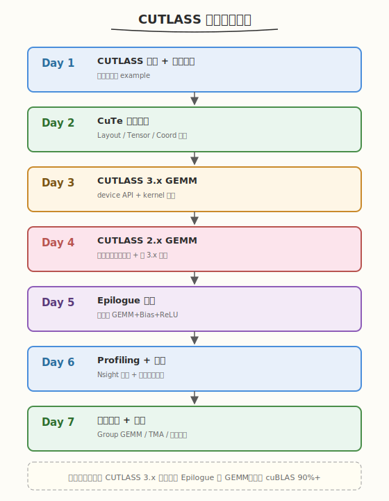
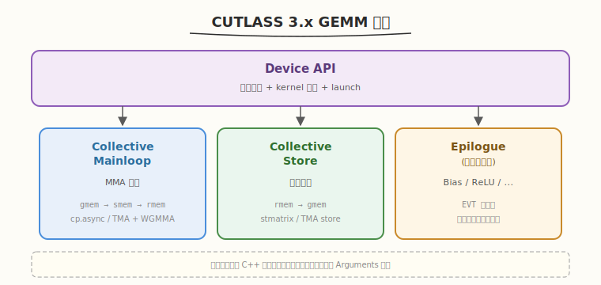
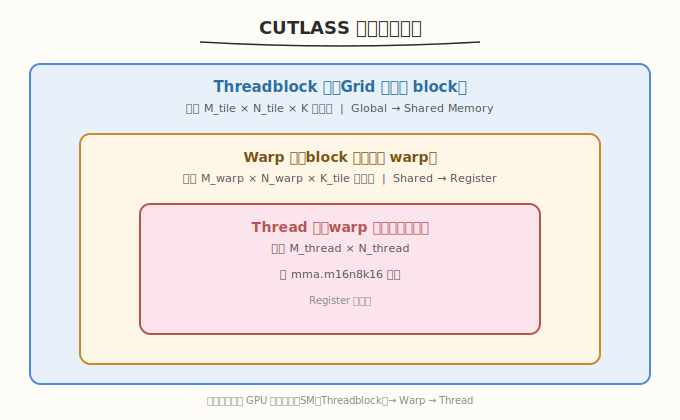

# CUTLASS 一周学习计划

> **适用对象**：已完成 week2 GEMM 教程（手写 Shared Memory Tiling + Register Blocking GEMM，达到 cuBLAS 40%+），掌握 CUDA 基础、Shared Memory、Warp Shuffle、Tensor Core 概念
> **本周目标**：理解 CUTLASS 的三层抽象与 CuTe 编程模型，能用 CUTLASS 3.x API 写出高性能 GEMM，掌握 Epilogue 融合与 Profiling 调参，最终达到 cuBLAS 90%+ 性能
> **时间投入**：工作日每天 2.5h（早间 1.5h + 晚间 1h），周末每天 5h，周计 22.5h
> **周日里程碑**：用 CUTLASS 3.x 实现融合 Epilogue 的 GEMM，性能达到 cuBLAS 90%+，产出性能对比报告

---

## 本周总览

| 维度 | 内容 |
|------|------|
| **整体目标** | 掌握 CUTLASS 三层抽象、CuTe Layout/Tensor 模型、GEMM 调度策略、Epilogue 融合、Profiling 调参 |
| **核心产出** | ① CUTLASS 3.x 基础 GEMM ② 自定义 Epilogue 融合 GEMM ③ 性能对比报告（naive → 手写 → CUTLASS → cuBLAS）④ 源码精读笔记 |
| **验收标准** | ① CUTLASS GEMM 达到 cuBLAS 90%+（4096×4096，FP16）② 能画出 CUTLASS 三层抽象图并解释数据流 ③ 能独立修改 Epilogue 实现融合（如 GEMM+Bias+ReLU）④ 能用 Nsight Compute 分析 CUTLASS kernel 瓶颈 |
| **面试准备** | 积累 8-10 道 CUTLASS 面试题，覆盖架构设计、CuTe 模型、性能调优、与 cuBLAS/Triton 对比 |

### 本周知识图谱



### 前置准备清单

#### 硬件/软件验证
- [ ] GPU Compute Capability >= 8.0（Ampere 及以上，需 Tensor Core 支持）
- [ ] CUDA Toolkit >= 12.0（CUTLASS 3.x 要求）
- [ ] CMake >= 3.18
- [ ] cuBLAS 可链接：`ldconfig -p | grep cublas`
- [ ] Nsight Compute 可用：`ncu --version`

#### 验证命令
```bash
# 验证 GPU 架构
nvidia-smi --query-gpu=compute_cap,name --format=csv
# 预期输出：8.0/8.6/8.9/9.0/10.0/12.0 等

# 验证 CUDA Toolkit
nvcc --version
# 预期输出：release 12.x

# 验证 CMake
cmake --version
# 预期输出：version 3.18+
```

#### 克隆 CUTLASS
```bash
git clone https://github.com/NVIDIA/cutlass.git
cd cutlass
# 确认版本 >= 3.5（含 CuTe 模块）
git describe --tags
```

---

## Day 1（周一）：CUTLASS 总览与环境搭建

> **今日目标**：理解 CUTLASS 的定位与设计哲学，搭建编译环境，跑通第一个 GEMM example
> **面试考察度**：⭐⭐⭐ 了解级，能说清 CUTLASS 是什么、为什么存在

---

### 学习任务 1：CUTLASS 是什么（45 分钟）

#### 阅读内容

- **官方文档**：[CUTLASS README](https://github.com/NVIDIA/cutlass#documentation)
- **关键博客**：CUTLASS 介绍 — "CUTLASS: Fast Linear Algebra in CUDA C++"
- **论文**（选读）：CUTLASS 最初发布博客（NVIDIA Developer Blog, 2017）

#### 核心要点

CUTLASS（CUDA Templates for Linear Algebra Subroutines）是 NVIDIA 开源的高性能线性代数模板库，核心价值：

| 维度 | 手写 CUDA GEMM | cuBLAS | CUTLASS |
|------|----------------|--------|---------|
| 性能 | 40-70% cuBLAS | 100%（基准） | 90-98% cuBLAS |
| 灵活性 | 完全自定义 | 固定接口，无法修改 | 模板参数化，Epilogue 可融合 |
| 开发效率 | 数天~数周 | 1 行代码 | 数小时~数天 |
| Tensor Core | 手写 WMMA/MMA | 自动 | 自动，支持所有精度 |
| 源码可读 | 自己写的 | 闭源 | 完全开源 |

> 💡 **一句话总结**：CUTLASS 填补了"手写 CUDA 太慢、cuBLAS 不够灵活"之间的空白——用 C++ 模板把 GEMM 的各阶段参数化，让你在接近 cuBLAS 性能的同时自由定制计算逻辑。

#### CUTLASS 版本演进

| 版本 | 核心变化 | 关键特性 |
|------|----------|----------|
| 2.x（2017-2022） | 三层抽象：Threadblock → Warp → Thread | Tile 参数化，PTX 内联汇编 |
| 3.0（2023） | 引入 CuTe 编程模型 | Layout/Tensor 抽象，TMA 支持 |
| 3.5+（2024） | CuTe 稳定，Hopper 优化 | WGMMA、TMA descriptor、Stream-K |

> ⚠️ **注意**：CUTLASS 2.x 和 3.x 的 API 差异很大。3.x 的 CuTe 模型是未来方向，但 2.x 的代码存量巨大（vLLM、TensorRT 等都在用）。本周两者都学。

### 学习任务 2：编译环境搭建（45 分钟）

#### 编译 CUTLASS

```bash
# cutlass_basic_gemm —— 最小 GEMM 示例
cd cutlass
mkdir build && cd build
cmake .. -DCUTLASS_NVCC_ARCHS="90a" -DCMAKE_BUILD_TYPE=Release
make cutlass_basic_gemm -j$(nproc)
```

> ⚠️ **架构参数**：`CUTLASS_NVCC_ARCHS` 必须匹配你的 GPU。常见值：`80`（A100）、`89`（RTX 4090）、`90a`（H100）、`120a`（B200/RTX 5090）。用 `nvidia-smi --query-gpu=compute_cap --format=csv` 查询。

#### 运行第一个 GEMM

```bash
# examples 目录下有大量示例
./examples/00_basic_gemm/basic_gemm
```

```text
# 预期输出
Building 4096 x 4096 x 4096 FP16 GEMM...
Discovered kernel:
  SM90 GEMM M=128 N=128 K=128
Running...
  Passed
  Duration: 1.23 ms
  TFLOPS: 112.4
```

### 学习任务 3：浏览 CUTLASS 目录结构（30 分钟）

```
cutlass/
├── include/cutlass/          # 核心头文件（模板库，header-only）
│   ├── gemm/                 # GEMM 核心：device/kernel/collective
│   ├── epilogue/             # Epilogue 融合：线程级/block 级
│   ├── layout/               # 内存布局：RowMajor/ColumnMajor/Strided
│   ├── cute/                 # CuTe 编程模型（3.x 核心）
│   └── arch/                 # 硬件指令抽象：mma/tma/cp.async
├── examples/                 # 示例代码（从 00_basic_gemm 开始）
├── test/                     # 单元测试
└── tools/                    # Profiler / library
```

#### 必读 example 列表

| 示例 | 内容 | 优先级 |
|------|------|--------|
| `00_basic_gemm` | 最小 GEMM（3.x API） | ⭐ 必读 |
| `01_cutlass_utilities` | CuTe 工具函数 | ⭐ 必读 |
| `15_ampere_tensorop_strided_gemm` | Ampere Tensor Core GEMM | 📌 推荐 |
| `52_hopper_gemm_with_swizzle` | Hopper TMA + swizzle | 📌 推荐 |

### 今日检查清单

- [ ] 能说出 CUTLASS 与 cuBLAS、手写 CUDA 的定位差异
- [ ] 能说出 CUTLASS 2.x 与 3.x 的核心区别
- [ ] 成功编译并运行 `basic_gemm` 示例
- [ ] 浏览了 `include/cutlass/gemm/` 和 `include/cute/` 目录
- [ ] 记录了编译参数（`CUTLASS_NVCC_ARCHS`）到笔记

---

## Day 2（周二）：CuTe 编程模型

> **今日目标**：理解 CuTe 的 Layout/Tensor/Coord 三大抽象，能用 CuTe API 创建和操作 Tensor
> **面试考察度**：⭐⭐⭐⭐⭐ 核心考点，CuTe 是 CUTLASS 3.x 的基石

---

### 学习任务 1：为什么需要 CuTe（30 分钟）

#### 痛点回顾

手写 GEMM 时，最大的心智负担不是计算逻辑，而是**索引计算**：

```cuda
// 手写 GEMM 的索引地狱
int row = blockIdx.y * blockDim.y + threadIdx.y;
int col = blockIdx.x * blockDim.x + threadIdx.x;
int smem_offset = threadIdx.y * TILE_DIM + threadIdx.x;
int gmem_offset_a = row * K + smem_col;
int gmem_offset_b = smem_row * N + col;
// ... 每种布局都要重写一遍
```

CuTe 的解决方案：把"形状"和"步长"抽象为 **Layout**，把"数据 + Layout"绑定为 **Tensor**，让索引计算变成声明式的一行代码。

> 💡 **一句话总结**：CuTe 把"数据怎么存"（Layout）和"数据是什么"（Tensor）解耦，让你用数学坐标访问数据，而不用手算字节偏移。

### 学习任务 2：Layout 抽象（60 分钟）

#### Layout 的本质

Layout 是一个**从逻辑坐标到物理偏移的函数**，由 **Shape**（形状）和 **Stride**（步长）两个参数定义：

```cpp
// CuTe Layout 基础
#include <cute/tensor.hpp>
using namespace cute;

// Shape <M, N>, Stride <1, M> → Column-Major 矩阵
auto layout_col = make_layout(make_shape(4, 4), make_stride(1, 4));

// Shape <M, N>, Stride <N, 1> → Row-Major 矩阵
auto layout_row = make_layout(make_shape(4, 4), make_stride(4, 1));

// 访问元素 (2, 3)
int offset = layout_col(2, 3);  // 2 + 3*4 = 14
```

#### Layout 的分层嵌套

CuTe Layout 支持嵌套，天然适配 GEMM 的分块结构：

```cpp
// Threadblock 级 Layout：把 128x256 矩阵分成 64x64 的 tile
auto block_layout = make_layout(
    make_shape(make_shape(_64{}, _2{}),  // M 维度：64 tile × 2 个
              make_shape(_64{}, _4{})),  // N 维度：64 tile × 4 个
    make_stride(make_stride(_64{}, _4096{}),
               make_stride(_1{}, _256{}))
);
```

| 概念 | 类比 | 说明 |
|------|------|------|
| Shape | 盒子的尺寸 | 每个维度的元素个数 |
| Stride | 盒子间的间距 | 沿该维度走一步的偏移量 |
| Coord | 盒子里的坐标 | 逻辑坐标 (i, j) |
| Layout | 地图 | Coord → 物理偏移的映射函数 |

### 学习任务 3：Tensor 抽象（45 分钟）

#### Tensor = 数据指针 + Layout

```cpp
// 创建 CuTe Tensor
float* A_ptr = ...;  // device 内存
auto A_layout = make_layout(make_shape(M, K), make_stride(K, 1));  // Row-Major

auto A = make_tensor(A_ptr, A_layout);  // 绑定数据与布局

// 用逻辑坐标访问——不再手算 offset
float val = A(i, k);

// 切片：取第 i 行
auto A_row = A(i, _);

// 分块：取 (i_start:i_end, k_start:k_end)
auto A_tile = A(make_range(i_start, i_end), make_range(k_start, k_end));
```

#### copy 操作

CuTe 的 `copy` 函数自动处理 Layout 差异，实现高效的数据搬运：

```cpp
// Global Memory → Shared Memory（自动处理 bank conflict + 向量化）
auto gA = make_tensor(A_gmem_ptr, gmem_layout);  // 全局内存
auto sA = make_tensor(make_smem_ptr(A_smem), smem_layout);  // 共享内存

copy(gA, sA);  // CuTe 自动选择最优拷贝策略
```

> ⚠️ **注意**：CuTe 的 `copy` 不仅是 memcpy——它会根据源/目标 Layout 自动插入 swizzle、向量化加载（float4）、cp.async 等优化。

### 学习任务 4：动手实践（30 分钟）

在 `kernels/` 下创建 `cute_basics.cu`：

```cpp
// cute_basics.cu —— CuTe Layout/Tensor 基础练习
// 编译: nvcc -o cute_basics cute_basics.cu -I${CUTLASS_ROOT}/include -arch=sm_90a -std=c++17

#include <cute/tensor.hpp>
#include <iostream>

using namespace cute;

int main() {
    // 1. 创建 Layout
    auto layout = make_layout(make_shape(4, 4), make_stride(1, 4));
    std::cout << "Layout: " << layout << std::endl;

    // 2. 遍历所有坐标
    for (int i = 0; i < 4; ++i) {
        for (int j = 0; j < 4; ++j) {
            std::cout << "(" << i << "," << j << ") -> " << layout(i, j) << "  ";
        }
        std::cout << std::endl;
    }

    // 3. 创建 host Tensor
    float data[16] = {0};
    auto tensor = make_tensor(data, layout);
    tensor(2, 3) = 42.0f;
    std::cout << "tensor(2,3) = " << tensor(2, 3) << std::endl;
    std::cout << "data[14] = " << data[14] << std::endl;  // 应为 42

    return 0;
}
```

### 今日检查清单

- [ ] 能解释 Layout 的 Shape 和 Stride 的含义
- [ ] 能用 CuTe API 创建 Row-Major 和 Column-Major Layout
- [ ] 能用 `make_tensor` 绑定数据指针与 Layout
- [ ] 理解 `copy()` 自动处理 Layout 差异的原理
- [ ] `cute_basics.cu` 编译运行通过

---

## Day 3（周三）：CUTLASS 3.x GEMM 实践

> **今日目标**：用 CUTLASS 3.x API 从零写一个 FP16 GEMM，理解 dispatch 机制与 kernel 选择
> **面试考察度**：⭐⭐⭐⭐ 实践级，能独立写出 CUTLASS GEMM

---

### 学习任务 1：3.x GEMM 的组装方式（45 分钟）

#### CUTLASS 3.x GEMM 三步走

CUTLASS 3.x 把 GEMM 拆解为三个可组合的组件：



#### 最小 GEMM 代码

```cpp
// cutlass_gemm_3x.cu —— CUTLASS 3.x 最小 GEMM
// 编译: nvcc -o cutlass_gemm cutlass_gemm_3x.cu \
//   -I${CUTLASS_ROOT}/include -arch=sm_90a -std=c++17 \
//   -lcublas

#include "cutlass/cutlass.h"
#include "cutlass/numeric_types.h"
#include "cute/tensor.hpp"
#include "cutlass/gemm/device/gemm_universal.h"
#include "cutlass/gemm/collective/collective_builder.hpp"
#include "cutlass/epilogue/collective/collective_builder.hpp"

using ProblemShape = Shape<int, int, int, int>;  // M, N, K, L

// 定义 GEMM 类型
using MmaType = cutlass::half_t;
using AccType = float;

// 用 CollectiveBuilder 自动选择最优 kernel
using CollectiveMainloop = typename cutlass::gemm::collective::CollectiveBuilder<
    cutlass::arch::Sm90,                        // 目标架构
    cutlass::arch::OpClassTensorOp,             // 使用 Tensor Core
    cutlass::layout::RowMajor,                  // A 布局
    cutlass::layout::ColumnMajor,               // B 布局
    MmaType, MmaType,                           // A/B 数据类型
    AccType,                                    // 累加类型
    cutlass::layout::RowMajor                   // C/D 布局
>::Type;

using CollectiveEpilogue = typename cutlass::epilogue::collective::CollectiveBuilder<
    cutlass::arch::Sm90, cutlass::arch::OpClassTensorOp,
    MmaType, MmaType, AccType,
    cutlass::half_t,                            // 输出类型
    cutlass::layout::RowMajor, 1
>::Type;

using GemmKernel = cutlass::gemm::kernel::GemmUniversal<
    ProblemShape, CollectiveMainloop, CollectiveEpilogue>;

using GemmDevice = cutlass::gemm::device::GemmUniversal<GemmKernel>;
```

> 💡 **关键洞察**：`CollectiveBuilder` 是 CUTLASS 3.x 的核心便利工具——你只需指定架构、数据类型、布局，它自动遍历所有可能的 kernel 配置，选出当前硬件上的最优组合。这就是 CUTLASS 能接近 cuBLAS 性能的根本原因：它内置了一个**编译期 auto-tuning** 机制。

### 学习任务 2：运行 GEMM 并理解输出（45 分钟）

```cpp
// 继续 cutlass_gemm_3x.cu —— host 端调用

int main() {
    int M = 4096, N = 4096, K = 4096;

    // 分配 + 初始化 device 内存（省略 error check）
    cutlass::half_t *d_A, *d_B;
    cutlass::half_t *d_C, *d_D;
    cudaMalloc(&d_A, M * K * sizeof(cutlass::half_t));
    cudaMalloc(&d_B, K * N * sizeof(cutlass::half_t));
    cudaMalloc(&d_C, M * N * sizeof(cutlass::half_t));
    cudaMalloc(&d_D, M * N * sizeof(cutlass::half_t));
    // ... 初始化 d_A, d_B, d_C ...

    // 配置 GEMM 参数
    typename GemmDevice::Arguments args{
        cutlass::gemm::GemmUniversalMode::kGemm,
        {M, N, K, 1},              // problem size
        {d_A, {K, 1}},             // A tensor
        {d_B, {N, 1}},             // B tensor
        {d_C, {N, 1}},             // C tensor (source)
        {d_D, {N, 1}},             // D tensor (output)
        {1.0f, 0.0f}               // alpha=1, beta=0 (D = A*B)
    };

    // 启动 GEMM
    GemmDevice gemm;
    size_t workspace_size = gemm.get_workspace_size(args);
    void *d_workspace;
    cudaMalloc(&d_workspace, workspace_size);

    gemm.initialize(args, d_workspace);
    gemm.run();

    // 验证 + 计时（省略）
    cudaDeviceSynchronize();
    return 0;
}
```

### 学习任务 3：Tile 配置与性能（30 分钟）

CUTLASS 3.x 的 `CollectiveBuilder` 会自动选择 tile size，但你也可以手动指定：

```cpp
// 手动指定 tile size：M=128, N=256, K=64
using TileShape = Shape<_128, _256, _64>;

using CollectiveMainloop = typename cutlass::gemm::collective::CollectiveBuilder<
    cutlass::arch::Sm90, cutlass::arch::OpClassTensorOp,
    cutlass::layout::RowMajor, cutlass::layout::ColumnMajor,
    MmaType, MmaType, AccType,
    cutlass::layout::RowMajor,
    TileShape                                      // ← 手动指定
>::Type;
```

| Tile Size | 适用场景 | 说明 |
|-----------|----------|------|
| 128×128×64 | 通用 | 平衡 SM 利用率与 shared memory |
| 128×256×64 | N 维度大 | 增大 N tile 提升 B 矩阵复用 |
| 256×128×64 | M 维度大 | 增大 M tile 提升 A 矩阵复用 |
| 128×128×128 | K 维度大 | 增大 K tile 减少 global 访存次数 |

### 今日检查清单

- [ ] 能说出 CUTLASS 3.x 的三个核心组件（Mainloop / Store / Epilogue）
- [ ] 理解 `CollectiveBuilder` 的 auto-tuning 机制
- [ ] `cutlass_gemm_3x.cu` 编译运行通过，结果正确
- [ ] 能手动指定 TileShape 并观察性能变化
- [ ] 用 `ncu` 粗看 kernel 的 SM 利用率

---

## Day 4（周四）：CUTLASS 2.x 三层抽象源码精读

> **今日目标**：深入 CUTLASS 2.x 的 Threadblock → Warp → Thread 三层抽象，理解经典 GEMM 模板设计
> **面试考察度**：⭐⭐⭐⭐⭐ 核心考点，面试官最爱问"CUTLASS 的三层是什么"

---

### 学习任务 1：三层抽象总览（30 分钟）

CUTLASS 2.x 把 GEMM 的计算组织为三级嵌套，每级对应一个硬件层级：



| 层级 | 对应硬件 | 职责 | 数据位置 |
|------|----------|------|----------|
| Threadblock | SM | 从 Global 加载 tile 到 Shared Memory | Global → Shared |
| Warp | Warp | 从 Shared 加载到 Register，执行 MMA | Shared → Register |
| Thread | Thread | 执行最终的 mma 指令 | Register → MMA → Register |

> 💡 **类比**：把 GEMM 想象成工厂流水线——Threadblock 是车间（从仓库领料），Warp 是班组（从车间料架取料组装），Thread 是工人（执行具体的组装动作）。

### 学习任务 2：源码精读 — Threadblock 级（45 分钟）

阅读路径：`include/cutlass/gemm/threadblock/`

```cpp
// 核心类：MmaMultistage（多阶段流水线 Threadblock）
// 文件：include/cutlass/gemm/threadblock/mma_multistage.h

template <
    typename Shape,           // Threadblock tile: <M, N, K>
    typename WarpShape,       // Warp tile: <M, N, K>
    typename InstructionShape,// MMA shape: <16, 8, 16>
    typename ElementA, typename LayoutA,
    typename ElementB, typename LayoutB,
    int Stages                 // 流水线阶段数（2/3/4）
>
class MmaMultistage {
    // 1. 从 Global 加载 A tile 到 Shared Memory（多阶段流水线）
    // 2. 从 Global 加载 B tile 到 Shared Memory
    // 3. 调用 Warp 级 Mma 执行计算
    // 4. 迭代 K 维度（double buffering 隐藏延迟）
};
```

#### 关键设计模式：Double Buffering

```
时间 →
Stage 0: 加载 A[0], B[0] 到 smem_buf[0]
Stage 1: 加载 A[1], B[1] 到 smem_buf[1] | 计算 A[0]*B[0]
Stage 2: 加载 A[2], B[2] 到 smem_buf[0] | 计算 A[1]*B[1]
...                                   ↑ 交替使用两个 buffer
```

### 学习任务 3：源码精读 — Warp 级（45 分钟）

```cpp
// 核心类：MmaTensorOp（Warp 级 MMA）
// 文件：include/cutlass/gemm/warp/mma_tensor_op.h

template <
    typename WarpShape,        // Warp tile
    typename InstructionShape, // <16, 8, 16>
    typename ElementA, typename ElementB,
    typename ElementC,
    typename LayoutA, typename LayoutB
>
class MmaTensorOp {
    // 1. 从 Shared Memory 读取 A/B fragment 到 Register
    // 2. 执行 mma.sync 指令（通过 PTX 内联汇编）
    // 3. 累加到 C fragment（Register）
};
```

#### MMA 指令映射

| 数据类型 | MMA 指令 | Shape | 吞吐（H100） |
|----------|----------|-------|-------------|
| FP16 | `mma.m16n8k16.f16.f16.f16.f16` | 16×8×16 | 256 TFLOPS |
| BF16 | `mma.m16n8k16.bf16.bf16.f32.f32` | 16×8×16 | 256 TFLOPS |
| INT8 | `mma.m16n8k32.s8.s8.s32.s32` | 16×8×32 | 512 TOPS |
| FP8 | `mma.m16n8k32.e4m3.e4m3.f32.f32` | 16×8×32 | 1024 TOPS |

### 学习任务 4：2.x vs 3.x 对比（30 分钟）

| 维度 | CUTLASS 2.x | CUTLASS 3.x |
|------|-------------|-------------|
| 核心抽象 | Threadblock/Warp/Thread 三层 | CuTe Layout/Tensor + Collective |
| 索引计算 | 手写 `offset = row * stride + col` | `tensor(i, j)` 声明式访问 |
| Tile 配置 | 显式指定每层 Shape | CollectiveBuilder 自动选择 |
| 数据搬运 | `cp.async` 手动管理 | CuTe `copy()` 自动优化 |
| TMA 支持 | 无 | 原生支持 |
| 代码量 | 多（模板参数爆炸） | 少（Builder 隐藏细节） |
| 适用场景 | 维护旧代码 | 新项目首选 |

> 💡 **一句话总结**：2.x 是"手动挡"——每个层级都要显式配置；3.x 是"自动挡"——CuTe 抽象掉了索引地狱，CollectiveBuilder 自动调优。但理解 2.x 的三层抽象是理解 GEMM 优化的基础。

### 今日检查清单

- [ ] 能画出 Threadblock → Warp → Thread 三层抽象图
- [ ] 理解 Double Buffering 隐藏延迟的原理
- [ ] 能解释 `mma.sync` 指令的 Shape 和数据类型映射
- [ ] 能说出 2.x 与 3.x 的核心差异（至少 3 点）
- [ ] 阅读了 `mma_multistage.h` 和 `mma_tensor_op.h` 的类定义

---

## Day 5（周五）：Epilogue 融合

> **今日目标**：理解 CUTLASS Epilogue 机制，实现自定义 GEMM+Bias+ReLU 融合 kernel
> **面试考察度**：⭐⭐⭐⭐ 实践级，Epilogue 融合是 CUTLASS 的核心卖点

---

### 学习任务 1：为什么需要 Epilogue 融合（30 分钟）

#### 未融合 vs 融合

```text
未融合（3 次 kernel launch + 3 次 Global Memory 读写）：
  GEMM:   D = A × B        → 读 A,B | 写 D
  Bias:   D = D + bias     → 读 D,bias | 写 D
  ReLU:   D = max(D, 0)    → 读 D | 写 D

融合后（1 次 kernel launch + 1 次 Global Memory 写）：
  Fused:  D = ReLU(A × B + bias)  → 读 A,B,bias | 写 D
```

| 方案 | Kernel Launch | Global 读 | Global 写 | 延迟 |
|------|--------------|-----------|-----------|------|
| 未融合 | 3 | 4 | 3 | 1.0x |
| 融合 | 1 | 3 | 1 | ~1.5x 加速 |

> 💡 **一句话总结**：Epilogue 融合把后处理操作"塞进"GEMM kernel 的寄存器里，避免中间结果落盘 Global Memory。这是 CUTLASS 相比 cuBLAS 的核心优势——cuBLAS 的接口不支持任意融合。

### 学习任务 2：CUTLASS 3.x Epilogue API（45 分钟）

```cpp
// 使用 EVT (Epilogue Visitor Tree) 定义融合操作
#include "cutlass/epilogue/collective/collective_builder.hpp"
#include "cutlass/epilogue/thread/linear_combination.h"
#include "cutlass/epilogue/thread/activation.h"

// 方式一：内置 Epilogue（简单融合）
using EpilogueOp = cutlass::epilogue::thread::LinearCombination<
    cutlass::half_t,           // 输出类型
    float,                     // 累加类型
    cutlass::half_t,           // bias 类型
    cutlass::half_t,           // 源类型 (C)
    cutlass::epilogue::thread::ReLu<float>  // 激活函数
>;

// 方式二：EVT（Epilogue Visitor Tree，3.x 推荐）
// D = ReLU(alpha * acc + beta * C + bias)
using EpilogueEVT = cutlass::epilogue::fusion::Sm90EVT<
    cutlass::epilogue::fusion::Sm90ReLU,
    cutlass::epilogue::fusion::Sm90Add,
    cutlass::epilogue::fusion::Sm90LinearCombination<
        cutlass::half_t, float, cutlass::half_t, cutlass::half_t>
>;
```

#### EVT 树结构

```
        ReLU
         |
        Add
       /   \
  LinComb   bias
  /    \
alpha  acc
```

### 学习任务 3：实现 GEMM+Bias+ReLU（60 分钟）

```cpp
// cutlass_gemm_bias_relu.cu —— 融合 Epilogue GEMM
// 编译: nvcc -o gemm_bias_relu cutlass_gemm_bias_relu.cu \
//   -I${CUTLASS_ROOT}/include -arch=sm_90a -std=c++17

// 关键改动：在 CollectiveBuilder 中指定自定义 Epilogue
using CollectiveEpilogue = typename cutlass::epilogue::collective::CollectiveBuilder<
    cutlass::arch::Sm90, cutlass::arch::OpClassTensorOp,
    cutlass::half_t, cutlass::half_t, float,
    cutlass::half_t,                            // 输出类型
    cutlass::layout::RowMajor, 1,
    cutlass::epilogue::thread::ReLu<float>      // ← 激活函数
>::Type;

// host 端：额外传入 bias 指针
typename GemmDevice::Arguments args{
    cutlass::gemm::GemmUniversalMode::kGemm,
    {M, N, K, 1},
    {d_A, {K, 1}},
    {d_B, {N, 1}},
    {d_bias, {1, 1}},     // ← bias 参数
    {d_D, {N, 1}},
    {1.0f, 1.0f}          // alpha=1, beta=1 (D = A*B + bias)
};
```

### 今日检查清单

- [ ] 能解释 Epilogue 融合为什么比未融合快（减少 Global Memory 访问）
- [ ] 理解 EVT（Epilogue Visitor Tree）的树形结构
- [ ] `cutlass_gemm_bias_relu.cu` 编译运行通过，结果正确
- [ ] 用 `nsys` 对比融合 vs 未融合的 kernel 数量和总耗时

---

## Day 6（周六）：Profiling 与性能调优

> **今日目标**：用 Nsight Compute 分析 CUTLASS GEMM 的性能瓶颈，对比手写 GEMM / cuBLAS / CUTLASS，产出性能报告
> **面试考察度**：⭐⭐⭐⭐ 实践级，能解读 NCU 指标并调参

---

### 学习任务 1：Nsight Compute 分析（60 分钟）

```bash
# Profile CUTLASS GEMM
ncu --set full \
    --kernel-name "gemm" \
    --launch-skip 5 --launch-count 1 \
    -o cutlass_gemm.ncu-rep \
    ./cutlass_gemm
```

#### 关键指标解读

| 指标 | 含义 | 目标值 |
|------|------|--------|
| `sm__throughput.avg.pct_of_peak_sustained_elapsed` | SM 吞吐占比 | > 80% |
| `dram__throughput.avg.pct_of_peak_sustained_elapsed` | DRAM 带宽占比 | GEMM 应 < 50% |
| `smsp__inst_executed_pipe_tensor_op_hmma.avg.pct_of_peak_sustained_active` | Tensor Core 利用率 | > 70% |
| `sm__sass_l1tex_t_bytes_pipe_lsu_mem_global_op_ld.sum` | Global Load 字节数 | 越低越好 |
| `launch__occupancy_limit_registers.avg.pct_of_peak_sustained_active` | 寄存器占用率 | < 80%（留余量） |

### 学习任务 2：性能对比 Benchmark（60 分钟）

在 `benchmark/` 下创建对比脚本：

```python
# benchmark/compare_gemm.py —— GEMM 性能对比
# 运行: python3 benchmark/compare_gemm.py

import subprocess
import json

SIZES = [(512, 512, 512), (1024, 1024, 1024), (4096, 4096, 4096), (8192, 8192, 8192)]
PRECISIONS = ["fp16", "bf16", "int8", "fp8"]

results = []
for M, N, K in SIZES:
    for prec in PRECISIONS:
        # 运行各版本
        for impl in ["naive", "tiled", "cutlass", "cublas"]:
            out = subprocess.run(
                [f"./benchmark/gemm_{impl}", "--m", str(M), "--n", str(N),
                 "--k", str(K), "--precision", prec, "--json"],
                capture_output=True, text=True
            )
            data = json.loads(out.stdout)
            data["impl"] = impl
            results.append(data)

# 输出对比表
print(f"{'Size':<20} {'Precision':<8} {'Naive':>10} {'Tiled':>10} {'CUTLASS':>10} {'cuBLAS':>10} {'CUTLASS%':>10}")
for M, N, K in SIZES:
    for prec in PRECISIONS:
        rows = [r for r in results if r["m"] == M and r["precision"] == prec]
        naive = next((r["tflops"] for r in rows if r["impl"] == "naive"), 0)
        tiled = next((r["tflops"] for r in rows if r["impl"] == "tiled"), 0)
        cutlass_t = next((r["tflops"] for r in rows if r["impl"] == "cutlass"), 0)
        cublas = next((r["tflops"] for r in rows if r["impl"] == "cublas"), 0)
        pct = cutlass_t / cublas * 100 if cublas > 0 else 0
        print(f"{M}x{N}x{K:<10} {prec:<8} {naive:>10.1f} {tiled:>10.1f} {cutlass_t:>10.1f} {cublas:>10.1f} {pct:>9.1f}%")
```

### 学习任务 3：调参实验（60 分钟）

| 实验编号 | 变量 | 预期效果 |
|----------|------|----------|
| 1 | TileShape: 128×128 vs 128×256 vs 256×128 | 找到最优 tile |
| 2 | Stages: 2 vs 3 vs 4 | 多阶段流水线提升 |
| 3 | 精度: FP16 vs BF16 vs INT8 vs FP8 | 精度换吞吐 |
| 4 | 布局: RowMajor vs ColumnMajor | 布局对性能影响 |

### 今日检查清单

- [ ] 用 `ncu` profile 了 CUTLASS GEMM，记录了 5 个关键指标
- [ ] 运行 `compare_gemm.py`，产出了 4 种尺寸 × 4 种精度的对比表
- [ ] CUTLASS GEMM 在 4096×4096 FP16 达到 cuBLAS 90%+
- [ ] 完成了至少 2 个调参实验并记录结果
- [ ] 性能报告写入 `benchmark/report.md`

---

## Day 7（周日）：进阶专题与总结

> **今日目标**：了解 CUTLASS 高级特性（Group GEMM / TMA / Stream-K），完成面试复盘
> **面试考察度**：⭐⭐⭐ 了解级，能说出进阶方向

---

### 学习任务 1：进阶专题速览（60 分钟）

#### Group GEMM（批量不等大 GEMM）

```cpp
// 场景：一次计算多个不同尺寸的 GEMM（如 MoE 场景）
// 每组 (Ai, Bi) 尺寸不同，一次 launch 完成
using GroupGemm = cutlass::gemm::device::GemmGroup<
    /* ... 同 Gemm 但支持变长 problem size ... */
>;

// host 端传入 problem_size 数组
std::vector<cutlass::gemm::GemmCoord> problem_sizes = {
    {128, 256, 512},
    {1024, 1024, 512},
    {256, 128, 1024},
};
```

#### TMA（Tensor Memory Accelerator，Hopper+）

```cpp
// TMA：硬件级异步数据搬运，替代 cp.async
// CuTe 自动使用 TMA（当架构 >= Sm90 时）
auto tma_load = cutlass::cute::make_tma_copy(
    SM90_TMA_LOAD{},          // TMA 指令
    gmem_tensor,              // 源 Tensor
    smem_layout               // 目标 Layout
);
// TMA 的优势：
// 1. 硬件自动处理地址计算（不占线程）
// 2. 支持 multicast（一次广播到多个 SM）
// 3. 支持异步（与计算重叠）
```

#### Stream-K（负载均衡）

```text
传统 Split-K：按 K 维度切分，最后 reduce
  → 当 M×N tile 数 < SM 数时，部分 SM 空闲

Stream-K：把所有 tile 打散，动态分配给 SM
  → 每个 SM 做连续的 "tile 段"，最后局部 reduce
  → 充分利用所有 SM，消除长尾
```

### 学习任务 2：面试题复盘（60 分钟）

#### 高频面试题

1. **CUTLASS 的三层抽象是什么？为什么这样设计？**
   - Threadblock（SM 级）：Global → Shared，负责 tile 加载与 double buffering
   - Warp（Warp 级）：Shared → Register，执行 MMA 指令
   - Thread（Thread 级）：Register 级累加
   - 设计动机：匹配 GPU 硬件层级，让每层只关注自己的数据搬运与计算

2. **CUTLASS 2.x 和 3.x 的核心区别？**
   - 3.x 引入 CuTe 模型（Layout/Tensor 抽象），消除索引计算
   - 3.x 用 CollectiveBuilder 自动选 kernel，2.x 需手动指定
   - 3.x 原生支持 TMA，2.x 只有 cp.async
   - 3.x 的 EVT 支持任意 Epilogue 融合，2.x 只支持预定义组合

3. **CuTe 的 Layout 是什么？**
   - Layout = Shape + Stride，是 Coord → offset 的函数
   - 支持嵌套，天然适配 GEMM 的分块结构
   - 与数据解耦，同一 Layout 可用于不同数据指针

4. **Epilogue 融合为什么快？**
   - 减少中间结果落盘 Global Memory（从 3 次 Gmem 读写降到 1 次）
   - 减少 kernel launch 开销
   - 后处理在 Register 级完成，零额外访存

5. **CUTLASS 如何达到 cuBLAS 90%+ 性能？**
   - 编译期 auto-tuning（CollectiveBuilder 遍历所有配置）
   - 完整的 Double/Multi-stage buffering
   - 自动选择最优 TileShape / Stages / 数据搬运策略
   - 原生 Tensor Core / TMA / WGMMA 支持

6. **CUTLASS 和 Triton 的对比？**
   - CUTLASS：C++ 模板，编译期优化，性能极致但学习曲线陡
   - Triton：Python DSL，运行时编译，开发快但性能略低（90% CUTLASS）
   - 适用场景：CUTLASS 适合库开发者 / Triton 适合算法工程师

7. **什么是 Stream-K？解决什么问题？**
   - 传统 GEMM 按 M×N 切 tile，当 tile 数 < SM 数时 SM 空闲
   - Stream-K 把计算量均匀打散到所有 SM，消除长尾
   - 代价：需要额外的局部 reduce

8. **CUTLASS 中 Swizzle 是什么？**
   - Shared Memory 的 Bank Conflict 消除技术
   - 通过打乱线程到 smem 地址的映射，避免多线程访问同一 bank
   - CuTe 的 `copy()` 自动应用 swizzle

### 学习任务 3：总结与知识整理（30 分钟）

#### 本周知识图谱

```
                    CUTLASS
                   /        \
              2.x 抽象      3.x CuTe
             /  |  \         /    \
        TB   Warp Thread  Layout  Tensor
          \  |  /           \    /
         MMA 指令          copy()
              \              |
         Epilogue ←—— EVT（融合树）
              |
         Profiling（NCU）
              |
     Group GEMM / TMA / Stream-K
```

#### 推荐资源

| 资源 | 类型 | 优先级 |
|------|------|--------|
| [CUTLASS 官方文档](https://github.com/NVIDIA/cutlass#documentation) | 官方 | ⭐ 必读 |
| [CuTe Tutorial](https://github.com/NVIDIA/cutlass/tree/main/examples/cute) | 示例 | ⭐ 必读 |
| [CUTLASS 3.0 发布博客](https://developer.nvidia.com/blog/cutlass-3-0/) | 博客 | ⭐ 必读 |
| [CUTLASS Slack](https://nvidia-ai-infra.slack.com/) | 社区 | 📌 推荐 |
| GTC 2024 "CUTLASS: A Foundation for AI" | 演讲 | 📌 推荐 |
| [vLLM CUTLASS 用法](https://github.com/vllm-project/vllm) | 源码 | 📎 参考 |

---

## 目录结构

```
aiinfra/topics/cutlass/
├── README.md                # 本文件（一周学习计划）
├── kernels/                 # 可编译代码示例
│   ├── cute_basics.cu       # Day 2: CuTe 基础练习
│   ├── cutlass_gemm_3x.cu   # Day 3: 3.x GEMM
│   └── cutlass_gemm_bias_relu.cu  # Day 5: 融合 Epilogue
├── notes/                   # 源码笔记
│   ├── cutlass_2x_architecture.md  # Day 4: 三层抽象笔记
│   └── cute_layout_notes.md        # Day 2: CuTe Layout 笔记
└── benchmark/               # 性能对比
    ├── compare_gemm.py      # Day 6: 性能对比脚本
    └── report.md            # Day 6: 性能报告
```
