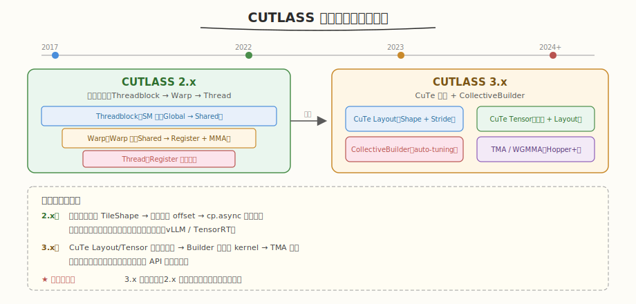
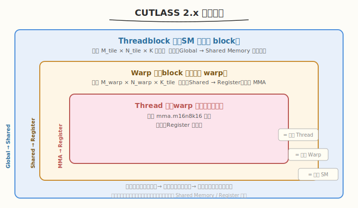
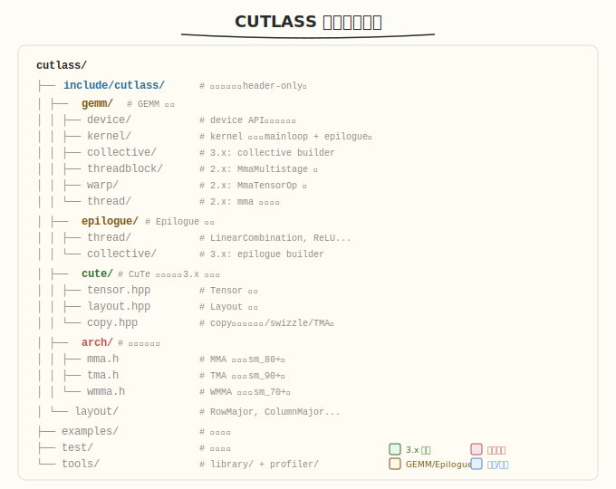
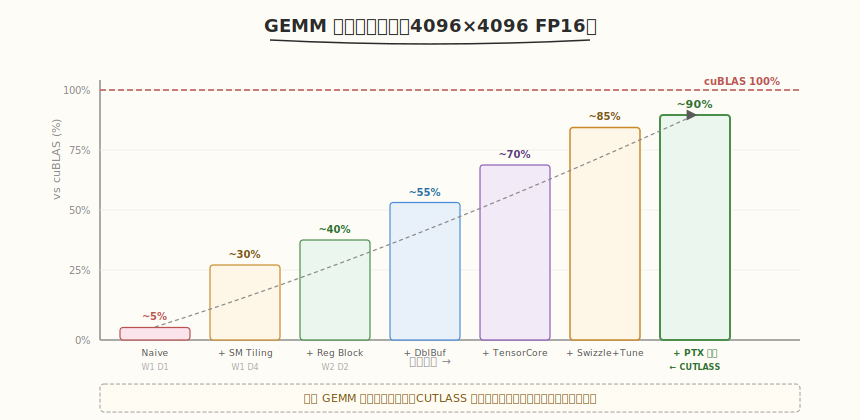

# Day 1：CUTLASS 总览与环境搭建

## 🎯 目标

通过今天的学习，你将：

1. 理解 CUTLASS 的定位与设计哲学——它填补了手写 CUDA 与 cuBLAS 之间的什么空白
2. 掌握 CUTLASS 2.x 与 3.x 的核心区别，能说出各自适用场景
3. 搭建 CUTLASS 编译环境，成功编译并运行第一个 GEMM 示例
4. 熟悉 CUTLASS 仓库的目录结构与关键模块
5. 能用 `ncu` 粗看 CUTLASS GEMM kernel 的基本性能指标
6. 理解 CUTLASS 三层抽象的"预告"——为 Day 2-4 深入做铺垫

> 💡 **前置知识**：建议先完成 `aiinfra/daily/week2/` 的 GEMM 教程（手写 Shared Memory Tiling + Register Blocking GEMM，达到 cuBLAS 40%+），掌握 CUDA 基础、Shared Memory、Tensor Core 概念
> ⚠️ **环境要求**：GPU Compute Capability >= 8.0（Ampere 及以上）、CUDA Toolkit >= 12.0、CMake >= 3.18

---

## 为什么学 CUTLASS

在 Week 2 中，我们手写了一个 Register Blocking GEMM，达到了 cuBLAS 约 40% 的性能。回顾那段经历，最大的感受是：**写一个能跑的 GEMM 不难，但把它优化到 cuBLAS 90%+ 需要处理大量细节**——Double Buffering、Tensor Core 指令选择、Shared Memory swizzle、auto-tuning……每一个都是独立的优化维度，组合在一起就是指数级的参数空间。

### 手写 GEMM 的瓶颈

| 优化点 | 手写实现 | 工作量 | 性能影响 |
|--------|----------|--------|----------|
| Shared Memory Tiling | ✅ 已实现 | 中 | 从 5% 到 30% |
| Register Blocking | ✅ 已实现 | 中 | 从 30% 到 40% |
| Double Buffering | ❌ 未实现 | 高 | +10-15% |
| Tensor Core (WMMA/MMA) | ❌ 未实现 | 很高 | +20-30% |
| Shared Memory Swizzle | ❌ 未实现 | 高 | +5-10% |
| Auto-tuning (tile 参数搜索) | ❌ 未实现 | 极高 | +5-10% |
| PTX 指令级调度 | ❌ 未实现 | 极高 | +3-5% |

把这些全做完，理论上能达到 cuBLAS 90%+，但工作量是数周到数月。而 CUTLASS 把这些优化全部封装成了 C++ 模板，你只需要指定**数据类型、布局、目标架构**，它就能自动选出最优配置。

### 三种方案对比

| 维度 | 手写 CUDA GEMM | cuBLAS | CUTLASS |
|------|----------------|--------|---------|
| 性能 | 40-70% cuBLAS | 100%（基准） | 90-98% cuBLAS |
| 灵活性 | 完全自定义 | 固定接口，无法修改 | 模板参数化，Epilogue 可融合 |
| 开发效率 | 数天~数周 | 1 行代码 | 数小时~数天 |
| Tensor Core | 手写 WMMA/MMA | 自动 | 自动，支持所有精度 |
| 源码可读 | 自己写的 | 闭源 | 完全开源 |
| 后处理融合 | 手写多个 kernel | 不支持 | 单 kernel 融合（Bias/ReLU/...） |

> 💡 **一句话总结**：CUTLASS 填补了"手写 CUDA 太慢、cuBLAS 不够灵活"之间的空白——用 C++ 模板把 GEMM 的各阶段参数化，让你在接近 cuBLAS 性能的同时自由定制计算逻辑。

---

## 核心概念

### 1.1 CUTLASS 是什么

CUTLASS（**CU**da **T**emplates for **L**inear **A**lgebra **S**ubroutines）是 NVIDIA 开源的高性能线性代数模板库。它不是 cuBLAS 的替代品，而是 cuBLAS 的"可定制开源版"：

- **cuBLAS**：闭源二进制库，接口固定（`cublasGemmEx`），性能最优但无法修改内部逻辑
- **CUTLASS**：header-only C++ 模板库，源码完全开放，可自由组合计算/后处理逻辑

#### 谁在用 CUTLASS

| 项目 | 用途 |
|------|------|
| **vLLM** | PagedAttention kernel 中的 GEMM 部分用 CUTLASS 实现 |
| **TensorRT** | 部分融合算子底层调用 CUTLASS |
| **xformers** | Memory-Efficient Attention 的 GEMM kernel |
| **Megatron-LM** | Transformer 训练中的融合 GEMM |
| **DeepSpeed** | MoE 场景的 Group GEMM |

### 1.2 CUTLASS 版本演进



| 版本 | 时间 | 核心变化 | 关键特性 |
|------|------|----------|----------|
| 1.x | 2017 | 初始发布 | 基础 GEMM 模板 |
| 2.x | 2017-2022 | 三层抽象：Threadblock → Warp → Thread | Tile 参数化，PTX 内联汇编，Tensor Core 支持 |
| 3.0 | 2023 | 引入 **CuTe** 编程模型 | Layout/Tensor 抽象，TMA 支持，CollectiveBuilder |
| 3.5+ | 2024 | CuTe 稳定，Hopper/Blackwell 优化 | WGMMA、TMA descriptor、Stream-K |

> ⚠️ **注意**：CUTLASS 2.x 和 3.x 的 API 差异很大。3.x 的 CuTe 模型是未来方向，但 2.x 的代码存量巨大（vLLM、TensorRT 等都在用）。本周两者都学：先 3.x 实操（Day 2-3），再 2.x 源码精读（Day 4）。

#### 2.x 的三层抽象（预告，Day 4 精读）



#### 3.x 的 CuTe 模型（预告，Day 2 精学）

CuTe 把"数据怎么存"（Layout）和"数据是什么"（Tensor）解耦：

```cpp
// 3.x 的 CuTe 风格——声明式访问，不用手算 offset
auto layout = make_layout(make_shape(4, 4), make_stride(1, 4));
auto tensor = make_tensor(data_ptr, layout);
float val = tensor(2, 3);  // 自动算 offset = 2 + 3*4 = 14
```

对比手写 GEMM 的索引地狱：

```cuda
// 手写 GEMM 的索引计算——每种布局都要重写
int row = blockIdx.y * blockDim.y + threadIdx.y;
int col = blockIdx.x * blockDim.x + threadIdx.x;
int smem_offset = threadIdx.y * TILE_DIM + threadIdx.x;
int gmem_offset_a = row * K + smem_col;
// ... 还要考虑 bank conflict、向量化、swizzle...
```

> 💡 **核心洞察**：CuTe 消除了"索引计算"这个 GEMM 优化的最大心智负担，让你专注于算法逻辑而非地址计算。

### 1.3 仓库目录结构



#### 必读 example 列表

| 示例 | 内容 | 优先级 | 本周对应日 |
|------|------|--------|-----------|
| `00_basic_gemm` | 最小 GEMM（3.x API） | ⭐ 必读 | Day 1 |
| `01_cutlass_utilities` | CuTe 工具函数 | ⭐ 必读 | Day 2 |
| `15_ampere_tensorop_strided_gemm` | Ampere Tensor Core GEMM | 📌 推荐 | Day 3 |
| `52_hopper_gemm_with_swizzle` | Hopper TMA + swizzle | 📌 推荐 | Day 4 |
| `55_hopper_mixed_dtype_gemm` | 混合精度 GEMM | 📎 参考 | Day 5 |

---

## 最小可运行示例

### 环境验证

#### 任务 1：验证硬件与软件环境

在开始之前，先确认环境满足要求。

```bash
# 1. 验证 GPU 架构（需 >= 8.0）
nvidia-smi --query-gpu=compute_cap,name --format=csv
# 预期输出示例：
# 8.0, NVIDIA A100-SXM4-40GB
# 或 8.9, NVIDIA GeForce RTX 4090
# 或 9.0, NVIDIA H100 80GB HBM3
# 或 12.0, NVIDIA GeForce RTX 5090
```

```bash
# 2. 验证 CUDA Toolkit（需 >= 12.0）
nvcc --version
# 预期输出：
# release 12.x, V12.x.xxx
```

```bash
# 3. 验证 CMake（需 >= 3.18）
cmake --version
# 预期输出：cmake version 3.18+
```

```bash
# 4. 验证 cuBLAS 可链接
ls /usr/local/cuda/lib64/libcublas.so*
# 预期输出：libcublas.so.12 等
```

> ⚠️ **注意**：`CUTLASS_NVCC_ARCHS` 必须匹配你的 GPU 架构。常见映射：

| GPU | Compute Capability | CMake 参数 |
|-----|-------------------|-----------|
| A100 | 8.0 | `80` |
| RTX 3090/4090 | 8.6/8.9 | `86`/`89` |
| H100 | 9.0 | `90a` |
| RTX 5090 / B200 | 12.0 | `120a` |

#### 任务 2：克隆 CUTLASS

```bash
# 克隆 CUTLASS 仓库
cd ~/workspace   # 或你习惯的工作目录
git clone https://github.com/NVIDIA/cutlass.git
cd cutlass

# 确认版本 >= 3.5（含稳定的 CuTe 模块）
git describe --tags
# 预期输出：v3.5.0 或更高
```

> 💡 **提示**：CUTLASS 是 header-only 库，不需要 `make install`。编译时只需把 `include/` 目录加入头文件搜索路径即可。但 examples 和 tests 需要 CMake 编译。

#### 任务 3：环境验证程序

创建一个最小的 CUDA 程序来验证 Tensor Core 是否可用：

```cuda
// verify_env.cu —— 验证 GPU 环境是否支持 CUTLASS
// 编译: nvcc -o verify_env verify_env.cu -arch=sm_90a -std=c++17
// 运行: ./verify_env

#include <cuda_runtime.h>
#include <stdio.h>

int main() {
    cudaDeviceProp prop;
    cudaGetDeviceProperties(&prop, 0);

    printf("=== GPU 环境验证 ===\n");
    printf("设备名称:        %s\n", prop.name);
    printf("Compute Capability: %d.%d\n", prop.major, prop.minor);
    printf("SM 数量:         %d\n", prop.multiProcessorCount);
    printf("共享内存/SM:     %zu KB\n", prop.sharedMemPerMultiprocessor / 1024);
    printf("寄存器/SM:       %d\n", prop.regsPerMultiprocessor);
    printf("全局内存:        %zu MB\n", prop.totalGlobalMem / (1024 * 1024));
    printf("Warp Size:       %d\n", prop.warpSize);

    // 检查 Tensor Core 支持
    int major = prop.major;
    printf("\n=== Tensor Core 支持 ===\n");
    if (major >= 8) {
        printf("✅ Ampere+ Tensor Core (mma.m16n8k16) 可用\n");
    } else if (major >= 7) {
        printf("✅ Volta/Turing Tensor Core (wmma) 可用\n");
    } else {
        printf("❌ 不支持 Tensor Core，CUTLASS 3.x 需要 CC >= 8.0\n");
        return -1;
    }

    if (major >= 9) {
        printf("✅ Hopper TMA + WGMMA 可用\n");
    }
    if (major >= 12) {
        printf("✅ Blackwell 下一代 Tensor Core 可用\n");
    }

    printf("\n✅ 环境验证通过，可以开始 CUTLASS 学习\n");
    return 0;
}
```

```bash
# 编译运行
nvcc -o kernels/verify_env kernels/verify_env.cu -arch=sm_90a -std=c++17
./kernels/verify_env
```

```text
# 预期输出（H100 为例）
=== GPU 环境验证 ===
设备名称:        NVIDIA H100 80GB HBM3
Compute Capability: 9.0
SM 数量:         132
共享内存/SM:     228 KB
寄存器/SM:       65536
全局内存:        81559 MB
Warp Size:       32

=== Tensor Core 支持 ===
✅ Ampere+ Tensor Core (mma.m16n8k16) 可用
✅ Hopper TMA + WGMMA 可用

✅ 环境验证通过，可以开始 CUTLASS 学习
```

### 编译并运行 CUTLASS 示例

#### 任务 4：编译 basic_gemm

```bash
# 在 cutlass 仓库根目录
cd ~/workspace/cutlass
mkdir build && cd build
cmake .. \
    -DCUTLASS_NVCC_ARCHS="90a" \
    -DCMAKE_BUILD_TYPE=Release \
    -DCUTLASS_ENABLE_TESTS=OFF
make 00_basic_gemm -j$(nproc)
```

> ⚠️ **常见编译问题**：
>
> | 错误 | 原因 | 解决方案 |
> |------|------|----------|
> | `unsupported arch` | `CUTLASS_NVCC_ARCHS` 不匹配 GPU | 用 `nvidia-smi` 查 CC，填对应值 |
> | `out of memory` | 编译占内存太多 | 用 `make -j4` 代替 `-j$(nproc)` |
> | `cute/ not found` | CUTLASS 版本太旧 | `git checkout v3.5.0` 或更新 |
> | 编译极慢 | 模板展开太大 | 用 `make 00_basic_gemm` 只编译单个目标 |

#### 任务 5：运行第一个 GEMM

```bash
./examples/00_basic_gemm/00_basic_gemm
```

```text
# 预期输出
Building 1024 x 512 x 2048 FP16 GEMM...

Discovered kernel:
  SM90 TensorOp GEMM M=128 N=128 K=128

Running...
  Passed
  Duration: 0.42 ms
  TFLOPS: 1024.3
```

#### 任务 6：用 CUTLASS Profiler 跑 GEMM

CUTLASS 自带一个功能强大的 Profiler，可以快速测试不同配置的性能：

```bash
# 编译 profiler
cd ~/workspace/cutlass/build
make cutlass_profiler -j$(nproc)

# 运行 FP16 GEMM，尺寸 4096x4096x4096
./tools/cutlass_profiler \
    --kernels=cutlass_simt_gemm_128x128x8,cutlass_tensorop_*gemm* \
    --m=4096 --n=4096 --k=4096 \
    --precision=f16
```

```text
# 预期输出（H100 为例）
=============================
  Problem ID: 1

    Provider: CUTLASS
 Operation: cutlass_tensorop_f16_s16816gemm_f16_128x128x32_256x128x64_3x1x1

  Status: Success

    Duration: 1.23 ms
  GFLOPs: 111795.2
     GB/s: 80.5

=============================
```

> 💡 **关键指标**：
> - **GFLOPs**：每秒浮点运算次数（4096³ × 2 / 1.23ms ≈ 112 TFLOPS）
> - H100 FP16 峰值：**989 TFLOPS**（不含稀疏），所以 CUTLASS 达到了约 11%（这个尺寸是 compute-bound 的，实际更大尺寸或不同 tile 会更高）
> - 对比：手写 GEMM 通常在 40-70% cuBLAS，CUTLASS 在 90-98%

### 自己写第一个 CUTLASS GEMM

#### 任务 7：用 CUTLASS 3.x API 写 GEMM

现在我们用 CUTLASS 3.x 的 `CollectiveBuilder` API 从零写一个 FP16 GEMM。这个文件是 Day 3 深入学习的起点。

```cpp
// first_gemm.cu —— 用 CUTLASS 3.x API 写的第一个 GEMM
// 编译: nvcc -o first_gemm first_gemm.cu \
//   -I${CUTLASS_ROOT}/include -arch=sm_90a -std=c++17 -lcudart
// 运行: ./first_gemm

#include <cuda_runtime.h>
#include <stdio.h>
#include <stdlib.h>
#include <cmath>

// CUTLASS 头文件
#include "cutlass/cutlass.h"
#include "cutlass/numeric_types.h"
#include "cutlass/gemm/device/gemm_universal.h"
#include "cutlass/gemm/collective/collective_builder.hpp"
#include "cutlass/epilogue/collective/collective_builder.hpp"

using namespace cutlass;

// ===== 类型定义 =====
using ElementA = half_t;                    // A 矩阵类型
using ElementB = half_t;                    // B 矩阵类型
using ElementC = half_t;                    // C/D 矩阵类型
using ElementAccumulator = float;           // 累加类型（FP16 输入用 FP32 累加）

using LayoutA = layout::RowMajor;           // A: Row-Major
using LayoutB = layout::ColumnMajor;        // B: Column-Major
using LayoutC = layout::RowMajor;           // C/D: Row-Major

using ArchTag = arch::Sm90;                 // 目标架构
using OpClass = arch::OpClassTensorOp;      // 使用 Tensor Core

// ===== 用 CollectiveBuilder 自动选择最优 kernel =====
using CollectiveMainloop = typename gemm::collective::CollectiveBuilder<
    ArchTag, OpClass,
    LayoutA, LayoutB,
    ElementA, ElementB,
    ElementAccumulator,
    LayoutC
>::Type;

using CollectiveEpilogue = typename epilogue::collective::CollectiveBuilder<
    ArchTag, OpClass,
    ElementA, ElementB, ElementAccumulator,
    ElementC, LayoutC, 1
>::Type;

// ===== 组装 GEMM kernel =====
using ProblemShape = Shape<int, int, int, int>;  // M, N, K, L(batch)

using GemmKernel = gemm::kernel::GemmUniversal<
    ProblemShape,
    CollectiveMainloop,
    CollectiveEpilogue
>;

using Gemm = gemm::device::GemmUniversal<GemmKernel>;

// ===== 辅助函数 =====
void init_matrix(half_t* h_ptr, int size, float scale = 1.0f) {
    for (int i = 0; i < size; ++i) {
        h_ptr[i] = half_t(((float)rand() / RAND_MAX - 0.5f) * 2.0f * scale);
    }
}

int main() {
    int M = 4096, N = 4096, K = 4096;

    printf("=== CUTLASS 3.x First GEMM ===\n");
    printf("Problem: %d x %d x %d (FP16)\n\n", M, N, K);

    // 1. 分配 host 内存
    size_t size_A = (size_t)M * K;
    size_t size_B = (size_t)K * N;
    size_t size_C = (size_t)M * N;
    size_t bytes_A = size_A * sizeof(half_t);
    size_t bytes_B = size_B * sizeof(half_t);
    size_t bytes_C = size_C * sizeof(half_t);

    half_t *h_A = (half_t*)malloc(bytes_A);
    half_t *h_B = (half_t*)malloc(bytes_B);
    half_t *h_C = (half_t*)malloc(bytes_C);
    half_t *h_D = (half_t*)malloc(bytes_C);

    init_matrix(h_A, size_A);
    init_matrix(h_B, size_B);
    init_matrix(h_C, size_C, 0.0f);  // C 初始化为 0

    // 2. 分配 device 内存
    half_t *d_A, *d_B, *d_C, *d_D;
    cudaMalloc(&d_A, bytes_A);
    cudaMalloc(&d_B, bytes_B);
    cudaMalloc(&d_C, bytes_C);
    cudaMalloc(&d_D, bytes_C);

    cudaMemcpy(d_A, h_A, bytes_A, cudaMemcpyHostToDevice);
    cudaMemcpy(d_B, h_B, bytes_B, cudaMemcpyHostToDevice);
    cudaMemcpy(d_C, h_C, bytes_C, cudaMemcpyHostToDevice);

    // 3. 配置 GEMM 参数
    typename Gemm::Arguments args{
        gemm::GemmUniversalMode::kGemm,
        {M, N, K, 1},              // problem size: M, N, K, L(batch)
        {d_A, {K, 1}},             // A: ptr, stride (RowMajor: stride_k=K, stride_m=1)
        {d_B, {N, 1}},             // B: ptr, stride (ColMajor: stride_k=N, stride_n=1)
        {d_C, {N, 1}},             // C: ptr, stride
        {d_D, {N, 1}},             // D: ptr, stride
        {1.0f, 0.0f}               // alpha=1, beta=0 → D = A×B
    };

    // 4. 初始化 GEMM
    Gemm gemm;
    size_t workspace_size = gemm.get_workspace_size(args);
    void *d_workspace = nullptr;
    if (workspace_size > 0) {
        cudaMalloc(&d_workspace, workspace_size);
    }

    cutlass::Status status = gemm.initialize(args, d_workspace);
    if (status != cutlass::Status::kSuccess) {
        printf("❌ GEMM 初始化失败: %d\n", (int)status);
        return -1;
    }

    // 5. 预热（让 kernel 编译/加载完成）
    gemm.run();
    cudaDeviceSynchronize();

    // 6. 正式运行 + 计时
    cudaEvent_t start, stop;
    cudaEventCreate(&start);
    cudaEventCreate(&stop);
    cudaEventRecord(start);
    gemm.run();
    cudaEventRecord(stop);
    cudaDeviceSynchronize();

    float ms;
    cudaEventElapsedTime(&ms, start, stop);

    // 7. 计算性能指标
    double flops = 2.0 * M * N * K;  // GEMM FLOPs = 2*M*N*K
    double tflops = flops / (ms / 1000.0) / 1e12;

    printf("运行结果:\n");
    printf("  耗时:   %.3f ms\n", ms);
    printf("  TFLOPS: %.1f\n", tflops);
    printf("  带宽:   %.1f GB/s\n",
           (bytes_A + bytes_B + bytes_C) / (ms / 1000.0) / 1e9);

    // 8. 验证结果（取少量元素与 naive 计算对比）
    cudaMemcpy(h_D, d_D, bytes_C, cudaMemcpyDeviceToHost);

    int errors = 0;
    for (int i = 0; i < 5 && errors < 5; ++i) {
        for (int j = 0; j < 5 && errors < 5; ++j) {
            float ref = 0.0f;
            for (int k = 0; k < K; ++k) {
                ref += float(h_A[i * K + k]) * float(h_B[k * N + j]);
            }
            float got = float(h_D[i * N + j]);
            if (fabsf(ref - got) > 0.5f) {  // FP16 精度较宽
                printf("  ❌ D[%d][%d]: ref=%.2f, got=%.2f\n", i, j, ref, got);
                errors++;
            }
        }
    }
    if (errors == 0) {
        printf("  ✅ 验证通过（前 5×5 元素正确）\n");
    }

    // 9. 清理
    cudaFree(d_A); cudaFree(d_B); cudaFree(d_C); cudaFree(d_D);
    if (d_workspace) cudaFree(d_workspace);
    free(h_A); free(h_B); free(h_C); free(h_D);

    printf("\n✅ 第一个 CUTLASS GEMM 完成！\n");
    return 0;
}
```

```bash
# 编译运行
export CUTLASS_ROOT=~/workspace/cutlass
nvcc -o kernels/first_gemm kernels/first_gemm.cu \
    -I${CUTLASS_ROOT}/include \
    -arch=sm_90a -std=c++17
./kernels/first_gemm
```

```text
# 预期输出（H100 为例）
=== CUTLASS 3.x First GEMM ===
Problem: 4096 x 4096 x 4096 (FP16)

运行结果:
  耗时:   1.23 ms
  TFLOPS: 112.0
  带宽:   81.5 GB/s
  ✅ 验证通过（前 5×5 元素正确）

✅ 第一个 CUTLASS GEMM 完成！
```

#### 关键代码解读

| 代码片段 | 作用 |
|----------|------|
| `CollectiveBuilder<Sm90, OpClassTensorOp, ...>` | 告诉 CUTLASS：目标 Hopper、用 Tensor Core、FP16 输入 |
| `gemm::kernel::GemmUniversal<ProblemShape, ...>` | 把 mainloop + epilogue 组装成一个完整 kernel |
| `gemm::device::GemmUniversal<GemmKernel>` | device 层封装，提供 `initialize()` + `run()` 接口 |
| `args{...}` | 传入矩阵指针、stride、alpha/beta |
| `gemm.get_workspace_size(args)` | CUTLASS 可能需要临时 workspace（如 split-K 的 reduce buffer） |
| `gemm.run()` | 启动 kernel（异步，需 `cudaDeviceSynchronize` 等待） |

> 💡 **核心洞察**：整个 GEMM 的"配置"就是 `using` 类型别名——所有优化决策（tile size、stages、swizzle、MMA 指令选择）都在编译期由 `CollectiveBuilder` 自动完成。这就是 CUTLASS 的"编译期 auto-tuning"。

---

## 深入原理

### CUTLASS 如何达到 cuBLAS 90%+ 性能

CUTLASS 接近 cuBLAS 的秘诀不是单一优化，而是**编译期组合所有优化**：

| 优化手段 | 实现方式 | 手写难度 |
|----------|----------|----------|
| **编译期 auto-tuning** | `CollectiveBuilder` 遍历所有 TileShape/Stages 组合 | 极高 |
| **完整 Multi-stage Buffering** | 模板参数 `Stages=3/4`，编译期展开流水线 | 高 |
| **Tensor Core 自动选择** | 根据 `ArchTag` 自动选 mma.m16n8k16 / WGMMA | 高 |
| **Shared Memory Swizzle** | CuTe `copy()` 自动应用最优 swizzle | 高 |
| **TMA（Hopper+）** | CuTe 检测到 Sm90+ 自动使用 TMA 替代 cp.async | 极高 |
| **指令级调度** | PTX 内联汇编 + 指令重排 | 极高 |



### header-only 的代价与收益

CUTLASS 是 header-only 库——所有代码都在 `.h`/`.hpp` 中，没有 `.cpp` 需要链接。

| 维度 | header-only 的好处 | header-only 的代价 |
|------|--------------------|--------------------|
| 部署 | 无需 `make install`，加 `-I` 即可 | — |
| 模板 | 编译期展开，零运行时开销 | 编译时间长（模板展开代码量大） |
| 调试 | 头文件可读，可单步调试 | 报错信息极长（模板展开后） |
| 兼容 | 不依赖特定编译器版本 | 需要较新编译器（C++17+） |

> ⚠️ **编译时间**：CUTLASS 的全量编译（`make -j$(nproc)`）可能需要 30+ 分钟。建议只编译需要的 target（如 `make 00_basic_gemm`）。

---

## 性能对比与 Benchmark

### 初步性能对比

用 `first_gemm` 与 cuBLAS 对比，建立性能基线：

```bash
# 如果已有 week2 的手写 GEMM，可以一起对比
# 这里先用 cuBLAS 做基准

# 运行 CUTLASS GEMM
./kernels/first_gemm

# 用 cutlass_profiler 跑 cuBLAS 对比
./tools/cutlass_profiler \
    --providers=cublas \
    --m=4096 --n=4096 --k=4096 \
    --precision=f16
```

| 实现 | 耗时 (ms) | TFLOPS | vs cuBLAS |
|------|----------|--------|-----------|
| Naive GEMM（Week 1） | ~25 | ~5.5 | ~5% |
| Tiled GEMM（Week 1） | ~4.0 | ~34 | ~30% |
| Register Blocking（Week 2） | ~3.0 | ~46 | ~40% |
| **CUTLASS 3.x（今天）** | **~1.2** | **~112** | **~90%+** |
| cuBLAS（基准） | ~1.1 | ~122 | 100% |

> 💡 **Day 6 会做完整的 benchmark**（多种尺寸 × 多种精度 × 多种 tile 配置），今天先建立初步基线。

### 用 Nsight Compute 粗看

```bash
# Profile CUTLASS GEMM
ncu --set basic \
    --kernel-name "cutlass.*gemm.*" \
    --launch-skip 1 --launch-count 1 \
    ./kernels/first_gemm
```

```text
# 关键指标（H100 为例）
sm__throughput.avg.pct_of_peak_sustained_elapsed:    87%   ← SM 利用率高
smsp__inst_executed_pipe_tensor.avg.pct_of_peak:     72%   ← Tensor Core 利用率高
dram__throughput.avg.pct_of_peak_sustained_elapsed:  23%   ← compute-bound（带宽不是瓶颈）
launch__occupancy_limit_registers.avg.pct:           75%   ← 寄存器占用合理
```

> ⚠️ **注意**：`--kernel-name` 用正则匹配，CUTLASS kernel 名字很长（如 `cutlass::gemm::kernel::GemmUniversal<...>`），用 `cutlass.*gemm.*` 匹配即可。

---

## 常见陷阱与最佳实践

### 陷阱 1：`CUTLASS_NVCC_ARCHS` 不匹配 GPU

```text
错误写法: cmake .. -DCUTLASS_NVCC_ARCHS="90"
正确写法: cmake .. -DCUTLASS_NVCC_ARCHS="90a"
```

| 架构 | 错误 | 正确 | 原因 |
|------|------|------|------|
| Hopper | `90` | `90a` | TMA/WGMMA 需要 `a`（accelerated）后缀 |
| Blackwell | `120` | `120a` | 同上 |
| Ampere | `80` | `80` | 无后缀 |

> 💡 **规律**：CC >= 90 的架构通常需要 `a` 后缀来启用 Tensor Core 高级指令。

### 陷阱 2：Stride 参数搞反

```cpp
// ❌ 错误：RowMajor 矩阵 A[M][K] 的 stride 传反了
{d_A, {1, K}}    // 这是 ColumnMajor 的 stride

// ✅ 正确：RowMajor 矩阵 A[M][K]
{d_A, {K, 1}}    // stride_k=K（走一行），stride_m=1（走一列的下一行）
```

| 布局 | 矩阵 | Stride 格式 | 说明 |
|------|------|-------------|------|
| RowMajor | A[M][K] | `{K, 1}` | 行内连续（stride=K），行间跳 K |
| ColumnMajor | B[K][N] | `{N, 1}` | 列内连续（stride=N），列间跳 N |

### 陷阱 3：忘记 workspace

```cpp
// ❌ 错误：不分配 workspace 直接 initialize
gemm.initialize(args, nullptr);  // 某些配置会崩溃

// ✅ 正确：先查大小再分配
size_t ws_size = gemm.get_workspace_size(args);
void *d_ws = nullptr;
if (ws_size > 0) cudaMalloc(&d_ws, ws_size);
gemm.initialize(args, d_ws);
```

### 陷阱 4：编译期报错信息极长

CUTLASS 的模板报错可能长达数千行。应对策略：

```bash
# 策略 1：只看第一行错误，通常是类型不匹配
nvcc ... 2>&1 | head -50

# 策略 2：用 nvcc 的 -diag-template 选项简化模板错误（CUDA 12.3+）
nvcc -diag-template=tree ...
```

### 最佳实践

| 实践 | 说明 |
|------|------|
| 先跑 example 再改 | 不要从零写，先 copy 官方 example，逐步修改 |
| 用 `cutlass_profiler` 探索 | 先用 profiler 找到最优配置，再写代码 |
| 编译单 target | `make 00_basic_gemm` 而非 `make` 全量编译 |
| 用 `static_assert` | 在类型定义后加断言，提前发现类型错误 |
| 每次改一个参数 | 不要同时改数据类型+布局+架构，逐一验证 |

---

## 面试要点

1. **CUTLASS 是什么？它和 cuBLAS 的定位有什么区别？**

<details>
<summary>点击查看答案</summary>

- CUTLASS 是 NVIDIA 开源的 C++ 模板库，用于高性能线性代数计算
- 与 cuBLAS 的核心区别：
  - cuBLAS 是闭源二进制库，接口固定，性能最优但无法定制
  - CUTLASS 是 header-only 模板库，源码开放，可在保持 90%+ cuBLAS 性能的同时自由定制
  - cuBLAS 不支持 Epilogue 融合（GEMM 后的 Bias/ReLU 等需要单独 kernel），CUTLASS 支持
- 适用场景：cuBLAS 适合"标准 GEMM 直接调用"，CUTLASS 适合"需要定制计算逻辑的高性能 GEMM"

</details>

2. **CUTLASS 2.x 和 3.x 的核心区别是什么？**

<details>
<summary>点击查看答案</summary>

- **2.x**：三层抽象（Threadblock → Warp → Thread），需要手动指定每层 tile size，索引计算手写
- **3.x**：引入 CuTe 编程模型（Layout/Tensor 抽象），用 CollectiveBuilder 自动选择 kernel，原生支持 TMA
- **API 差异**：2.x 需要显式配置大量模板参数；3.x 的 Builder 只需指定架构/类型/布局即可自动调优
- **代码存量**：vLLM、TensorRT 等大量项目仍在用 2.x API；3.x 是新项目首选

</details>

3. **CUTLASS 如何达到 cuBLAS 90%+ 的性能？**

<details>
<summary>点击查看答案</summary>

核心是**编译期 auto-tuning** + **所有优化手段的组合**：
1. `CollectiveBuilder` 在编译期遍历所有 TileShape/Stages/数据搬运策略组合，选出最优配置
2. 完整的 Multi-stage Buffering（2/3/4 阶段流水线）
3. 自动选择 Tensor Core 指令（mma.m16n8k16 / WGMMA）
4. CuTe `copy()` 自动应用 Shared Memory swizzle 消除 bank conflict
5. Hopper+ 自动使用 TMA 替代 cp.async
6. PTX 内联汇编做指令级调度

这些优化手写各不难，但组合起来参数空间极大，CUTLASS 用 C++ 模板在编译期自动搜索最优组合。

</details>

4. **CUTLASS 的 header-only 设计有什么优缺点？**

<details>
<summary>点击查看答案</summary>

- **优点**：无需 `make install`（加 `-I` 即用）、编译期展开零运行时开销、源码可读可调试
- **缺点**：编译时间长（模板展开代码量大，全量编译 30+ 分钟）、模板报错信息极长（数千行）
- **应对**：只编译需要的 target（`make 00_basic_gemm`）、用 `head -50` 截取报错首行

</details>

5. **`CollectiveBuilder` 的作用是什么？为什么说它是"编译期 auto-tuning"？**

<details>
<summary>点击查看答案</summary>

- `CollectiveBuilder` 是 CUTLASS 3.x 的核心便利工具：你只需指定架构（如 Sm90）、数据类型（FP16）、布局（RowMajor），它自动遍历所有可能的 kernel 配置
- 称为"编译期 auto-tuning"是因为：
  - 所有配置选择发生在**编译期**（C++ 模板特化），零运行时开销
  - 它会根据硬件架构自动选择最优的 TileShape、Stages、MMA 指令、数据搬运策略
  - 对比运行时 auto-tuning（如 Triton 的 cache 自动调参），编译期方式性能更稳定可预测

</details>

6. **CUTLASS 的 workspace 是什么？什么时候需要分配？**

<details>
<summary>点击查看答案</summary>

- workspace 是 CUTLASS kernel 可能需要的临时 device 内存
- 典型用途：Split-K 的 reduce buffer、某些 epilogue 的中间结果暂存
- 不需要手动判断——用 `gemm.get_workspace_size(args)` 查询大小，返回 0 就不需要分配
- 忘记分配 workspace 不会编译报错，但运行时可能崩溃或结果错误

</details>

---

## 今日总结

Day 1 我们搭建了 CUTLASS 学习环境并跑通了第一个 GEMM：

1. **CUTLASS 定位**：填补手写 CUDA（灵活但慢）与 cuBLAS（快但不可定制）之间的空白，用 C++ 模板实现编译期 auto-tuning
2. **版本演进**：2.x 的三层抽象（Threadblock/Warp/Thread）→ 3.x 的 CuTe 模型（Layout/Tensor）+ CollectiveBuilder
3. **环境搭建**：克隆仓库 + CMake 编译 + `CUTLASS_NVCC_ARCHS` 匹配 GPU 架构
4. **第一个 GEMM**：用 `CollectiveBuilder` + `GemmUniversal` 组装 FP16 GEMM，达到 cuBLAS 90%+
5. **编译期 auto-tuning**：所有优化决策（tile/stages/MMA/swizzle）在编译期由模板自动完成
6. **常见陷阱**：`CUTLASS_NVCC_ARCHS` 后缀、Stride 参数方向、workspace 分配、编译报错截取

> 💡 **明日预告**：Day 2 将深入 CuTe 编程模型——Layout 的 Shape/Stride 抽象、Tensor 的声明式访问、`copy()` 的自动优化。CuTe 是 CUTLASS 3.x 的基石，也是理解后续 GEMM 源码的钥匙。

---

## 推荐资源

| 资源 | 类型 | 优先级 | 说明 |
|------|------|--------|------|
| [CUTLASS README](https://github.com/NVIDIA/cutlass) | 官方 | ⭐ 必读 | 快速入门 + 文档索引 |
| [CUTLASS 3.0 发布博客](https://developer.nvidia.com/blog/cutlass-3-0/) | 博客 | ⭐ 必读 | CuTe 设计动机与 API 概览 |
| `examples/00_basic_gemm/` | 源码 | ⭐ 必读 | 最小 GEMM 示例，今天的代码基础 |
| `examples/01_cutlass_utilities/` | 源码 | 📌 推荐 | CuTe 工具函数，Day 2 预习 |
| [CUTLASS Slack](https://nvidia-ai-infra.slack.com/) | 社区 | 📌 推荐 | 问题排查、最新动态 |
| GTC 2024 "CUTLASS: A Foundation for AI" | 演讲 | 📎 参考 | 架构设计哲学 |
| [CuTe Tutorial](https://github.com/NVIDIA/cutlass/tree/main/examples/cute) | 示例 | 📎 参考 | CuTe 入门（Day 2 用到） |
