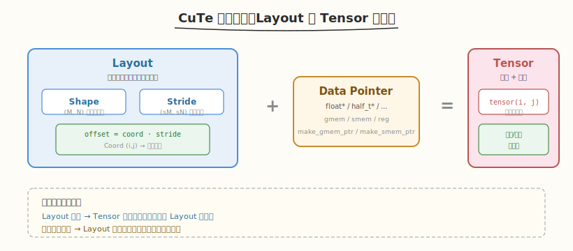
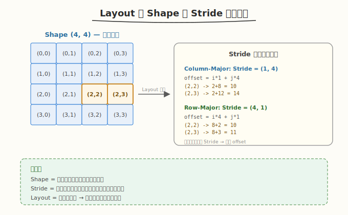
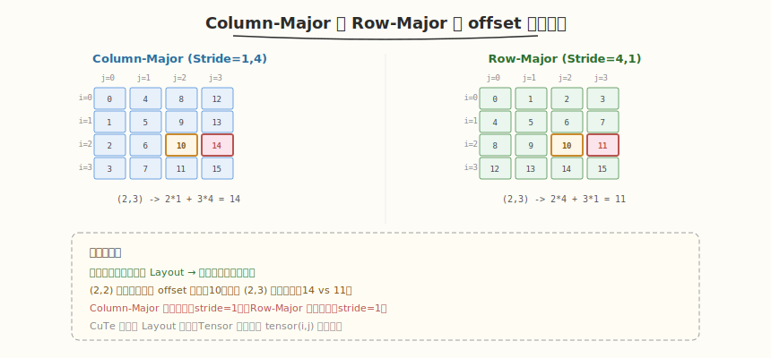
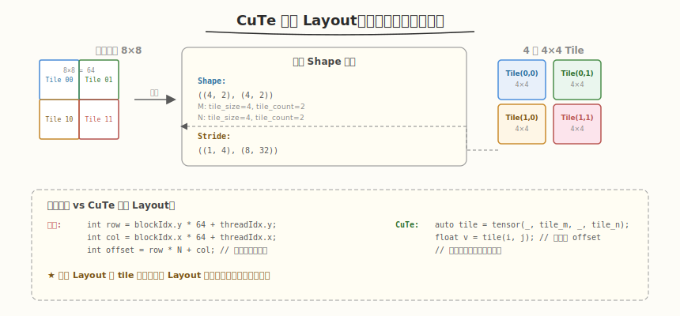
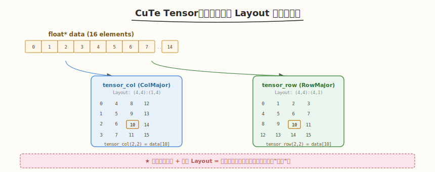
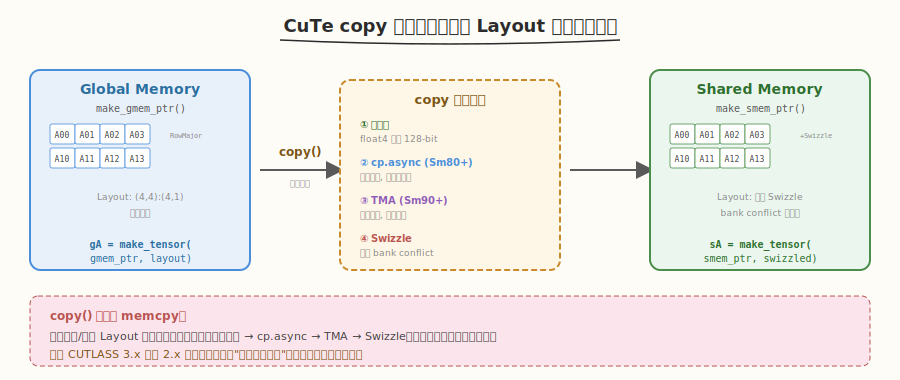
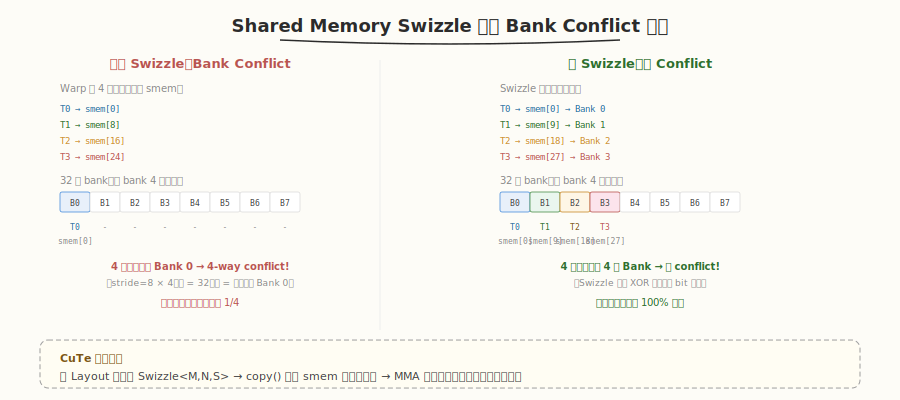

# Day 2：CuTe 编程模型

## 🎯 目标

通过今天的学习，你将：

1. 理解 CuTe 的设计动机——它解决了 GEMM 开发中"索引计算地狱"的痛点
2. 掌握 Layout 抽象：Shape + Stride 如何把逻辑坐标映射到物理偏移
3. 掌握 Tensor 抽象：数据指针 + Layout 如何实现声明式访问
4. 能用 CuTe API 创建、切片、分块 Tensor，并用 `copy()` 做数据搬运
5. 理解 CuTe 的分层 Layout 如何天然适配 GEMM 的 tile 分块结构
6. 了解 Swizzle 机制如何消除 Shared Memory Bank Conflict

> 💡 **前置知识**：完成 Day 1（环境搭建 + 第一个 CUTLASS GEMM），理解 CUTLASS 2.x/3.x 的基本区别
> ⚠️ **环境要求**：CUTLASS 3.5+、CUDA 12.0+、`-std=c++17`

---

## 为什么需要 CuTe

### 痛点回顾：手写 GEMM 的索引地狱

在 Week 2 的手写 GEMM 教程中，计算逻辑本身并不复杂——核心就是 `C[i][j] += A[i][k] * B[k][j]`。但真正消耗心智的是**索引计算**：

```cuda
// 手写 GEMM 的索引地狱——每种布局、每个阶段都要重写
int row = blockIdx.y * blockDim.y + threadIdx.y;
int col = blockIdx.x * blockDim.x + threadIdx.x;

// Shared Memory 偏移（还要考虑 bank conflict + padding）
int smem_offset_a = threadIdx.y * (TILE_DIM + PAD) + threadIdx.x;
int smem_offset_b = threadIdx.x * (TILE_DIM + PAD) + threadIdx.y;

// Global Memory 偏移（A 是 RowMajor，B 是 ColumnMajor——不同！）
int gmem_offset_a = row * K + smem_col;           // A: row * K + col
int gmem_offset_b = smem_row * N + col;            // B: row * N + col（ColMajor）

// 写回结果（又是一种布局...）
int gmem_offset_c = row * N + col;
```

> ⚠️ **问题**：每换一种矩阵布局（RowMajor/ColumnMajor）、每加一层 tiling、每引入一个 swizzle，所有索引都要重算。这是 GEMM 开发最大的 bug 来源。

### CuTe 的解决方案

CuTe（CUTLASS Tensor Engine）把索引计算抽象为两个概念：



- **Layout**：把"数据怎么存"抽象为 `Shape + Stride`，是一个 `Coord → offset` 的纯函数
- **Tensor**：把"数据是什么"绑定为 `指针 + Layout`，让你用逻辑坐标 `tensor(i, j)` 访问数据

```cpp
// CuTe 风格——声明式访问，不用手算 offset
auto layout = make_layout(make_shape(4, 4), make_stride(1, 4));  // Column-Major
auto tensor = make_tensor(data_ptr, layout);

float val = tensor(2, 3);  // 自动算 offset = 2 + 3*4 = 14
```

> 💡 **一句话总结**：CuTe 把"数据怎么存"（Layout）和"数据是什么"（Tensor）解耦，让你用数学坐标访问数据，而不用手算字节偏移。Layout 变了，Tensor 的访问代码不用改。

---

## 核心概念

### 1.1 Layout 的本质

Layout 是一个**从逻辑坐标到物理偏移的函数**，由两个参数定义：

| 参数 | 含义 | 类比 |
|------|------|------|
| **Shape** | 每个维度的元素个数 | 盒子的尺寸 |
| **Stride** | 沿该维度走一步的偏移量 | 盒子间的间距 |

给定坐标 `(i, j)`，Layout 计算偏移的公式为 `offset = i × Stride[0] + j × Stride[1]`：



#### 常见矩阵布局

```cpp
#include <cute/tensor.hpp>
using namespace cute;

// 4×4 矩阵的不同布局
auto layout_col = make_layout(make_shape(4, 4), make_stride(1, 4));  // Column-Major
auto layout_row = make_layout(make_shape(4, 4), make_stride(4, 1));  // Row-Major

// 访问元素 (2, 3)
layout_col(2, 3);  // 2*1 + 3*4 = 14
layout_row(2, 3);  // 2*4 + 3*1 = 11
```

| 布局 | Shape | Stride | offset(i,j) | 说明 |
|------|-------|--------|-------------|------|
| Column-Major | (4, 4) | (1, 4) | i + j×4 | 列内连续，列间跳 4 |
| Row-Major | (4, 4) | (4, 1) | i×4 + j | 行内连续，行间跳 4 |

> 💡 **核心洞察**：Layout 只描述"形状和步长"，不关心数据本身。同一个 Layout 可以绑定不同的数据指针——这就是"数据与布局解耦"。

#### 验证 Layout 映射

以 Column-Major 4×4 为例，验证每个坐标的 offset：



```text
Column-Major (stride=1,4)     Row-Major (stride=4,1)

(0,0)→0   (0,1)→4   (0,2)→8   (0,3)→12     (0,0)→0   (0,1)→1   (0,2)→2   (0,3)→3
(1,0)→1   (1,1)→5   (1,2)→9   (1,3)→13     (1,0)→4   (1,1)→5   (1,2)→6   (1,3)→7
(2,0)→2   (2,1)→6   (2,2)→10  (2,3)→14     (2,0)→8   (2,1)→9   (2,2)→10  (2,3)→11
(3,0)→3   (3,1)→7   (3,2)→11  (3,3)→15     (3,0)→12  (3,1)→13  (3,2)→14  (3,3)→15
```

注意：两种布局对 `(2,2)` 返回相同 offset（10），但 `(2,3)` 完全不同——这就是布局差异的本质。

### 1.2 Layout 的分层嵌套

CuTe Layout 的真正威力在于**嵌套**——可以把一个维度拆成子维度，天然适配 GEMM 的 tile 分块结构。



#### GEMM Tile 的 Layout 示例

假设有一个 128×256 的矩阵，我们要把它分成 64×64 的 tile：

```cpp
// 把 128×256 矩阵分成 2×4 个 64×64 tile
auto block_layout = make_layout(
    make_shape(
        make_shape(_64{}, _2{}),    // M 维度：64 (tile 内) × 2 (tile 个数)
        make_shape(_64{}, _4{})     // N 维度：64 (tile 内) × 4 (tile 个数)
    ),
    make_stride(
        make_stride(_1{}, _64{}),   // M stride: tile 内连续(1)，tile 间跳 64
        make_stride(_256{}, _64{})  // N stride: tile 内跳 256(=M)，tile 间跳 64
    )
);

// 访问第 (1, 2) 个 tile 内的 (3, 5) 元素
block_layout(make_coord(3, 1), make_coord(5, 2));
// = (3*1 + 1*64) + (5*256 + 2*64) = 67 + 1408 = 1475
```

> 💡 **类比**：把矩阵想象成一栋大楼——Shape 是"每层几间房 × 几层"，Stride 是"同层隔壁的距离 × 楼层间的高度"。嵌套 Layout 就是"每栋楼有若干层，每层有若干房间，每个房间有若干床位"。

#### 嵌套 Layout 与手写索引的对比

| 手写 GEMM | CuTe 嵌套 Layout |
|-----------|-----------------|
| `int tile_m = blockIdx.y;` | `auto tile = layout(make_coord(_, tile_m), make_coord(_, tile_n));` |
| `int row = tile_m * 64 + threadIdx.y;` | `auto elem = tile(threadIdx.y, threadIdx.x);` |
| `int offset = row * N + col;` | 自动计算 |
| 布局变了要重写全部索引 | 只改 Layout 定义，访问代码不变 |

### 1.3 Tensor 抽象

Tensor = **数据指针 + Layout**，把"数据是什么"和"数据怎么存"绑定在一起：

```cpp
// 创建 CuTe Tensor
float* A_ptr = ...;  // device 或 host 内存
auto A_layout = make_layout(make_shape(M, K), make_stride(K, 1));  // Row-Major

auto A = make_tensor(A_ptr, A_layout);  // 绑定数据与布局

// 用逻辑坐标访问——不再手算 offset
float val = A(i, k);
```



#### Tensor 的核心操作

```cpp
// 1. 访问单个元素
float val = A(2, 3);

// 2. 切片：取第 i 行（保留维度）
auto A_row = A(2, _);  // _ 表示"取全部"

// 3. 分块：取子矩阵
auto A_tile = A(make_range(0, 64), make_range(0, 64));

// 4. 转置：交换 Layout 的两个维度
auto A_T = make_tensor(A.data(), make_layout(A.layout().stride(1), A.layout().stride(0)));
// 或更简洁：
auto A_T = make_tensor(A.data(), A.layout().transpose());
```

| 操作 | 手写 CUDA | CuTe |
|------|-----------|------|
| 访问 (i,j) | `A[i * K + j]` | `A(i, j)` |
| 取第 i 行 | `A + i * K` | `A(i, _)` |
| 取 64×64 子块 | 手算偏移 + 循环 | `A(make_range(0,64), make_range(0,64))` |
| 转置 | 交换行列索引 | `make_tensor(A.data(), A.layout().transpose())` |

> 💡 **核心洞察**：Tensor 的切片/分块操作返回的仍然是 Tensor（只是 Layout 变了），底层的数据指针不变。这是零拷贝的——不产生任何数据搬运，只是改了"怎么看数据"。

### 1.4 copy 操作

CuTe 的 `copy()` 是连接 Global Memory 和 Shared Memory 的桥梁，它自动处理 Layout 差异：

```cpp
// Global Memory → Shared Memory
auto gA = make_tensor(A_gmem_ptr, gmem_layout);   // 全局内存 Tensor
auto sA = make_tensor(make_smem_ptr(A_smem), smem_layout);  // 共享内存 Tensor

copy(gA, sA);  // CuTe 自动选择最优拷贝策略
```



#### copy 自动做了什么

| 优化 | 说明 | 手写难度 |
|------|------|----------|
| **向量化加载** | 自动用 `float4` / `int4` 一次读 16 字节 | 中 |
| **cp.async** | Ampere+ 自动用异步拷贝，与计算重叠 | 高 |
| **TMA** | Hopper+ 自动用 TMA 硬件搬运 | 极高 |
| **Swizzle** | 自动应用 Shared Memory swizzle 消除 bank conflict | 高 |
| **Layout 适配** | 源和目标 Layout 不同时自动重排 | 极高 |

> ⚠️ **注意**：CuTe 的 `copy()` 不仅是 memcpy——它会根据源/目标 Layout 自动选择最优的数据搬运策略。这是 CUTLASS 3.x 相比 2.x 的核心改进之一：把"数据搬运优化"从用户代码移到了框架内部。

### 1.5 Swizzle 机制

#### Bank Conflict 问题

Shared Memory 被 32 个 bank 均分，每个 bank 宽 4 字节。如果同一 warp 内的多个线程同时访问同一 bank，就会产生 bank conflict，导致串行化。



#### Swizzle 的解决方案

Swizzle 通过"打乱"线程到 smem 地址的映射，让原本冲突的访问散布到不同 bank：

```cpp
// 不用 Swizzle（有 bank conflict）
auto smem_layout_naive = make_layout(make_shape(64, 64), make_stride(64, 1));

// 用 Swizzle（消除 bank conflict）
auto smem_layout_swizzled = make_layout(
    make_shape(64, 64),
    make_stride(8, 1),               // 基础 stride
    Swizzle<3, 4, 3>{}               // Swizzle 变换：在 bit 层面打乱
);

// copy 时自动应用
auto gA = make_tensor(gmem_ptr, gmem_layout);
auto sA = make_tensor(smem_ptr, smem_layout_swizzled);
copy(gA, sA);  // CuTe 自动在写入 smem 时应用 swizzle
```

> 💡 **一句话总结**：Swizzle 是一种 bit-level 的地址变换，让 MMA 指令读取 Shared Memory 时不产生 bank conflict。CuTe 的 `copy()` 自动应用 swizzle，你只需在 Layout 中声明 swizzle 类型。

---

## 最小可运行示例

### 任务 1：CuTe Layout 基础练习

创建 `kernels/cute_basics.cu`，用 CuTe API 创建 Layout 和 Tensor，验证 offset 计算：

```cpp
// cute_basics.cu —— CuTe Layout/Tensor 基础练习
// 编译: nvcc -o cute_basics cute_basics.cu \
//   -I${CUTLASS_ROOT}/include -arch=sm_90a -std=c++17
// 运行: ./cute_basics

#include <cute/tensor.hpp>
#include <iostream>

using namespace cute;

int main() {
    std::cout << "=== CuTe Layout 基础 ===" << std::endl;

    // 1. 创建 Column-Major Layout (4×4)
    auto layout_col = make_layout(make_shape(4, 4), make_stride(1, 4));
    std::cout << "Column-Major Layout: " << layout_col << std::endl;

    // 2. 创建 Row-Major Layout (4×4)
    auto layout_row = make_layout(make_shape(4, 4), make_stride(4, 1));
    std::cout << "Row-Major Layout:    " << layout_row << std::endl;

    // 3. 对比 offset
    std::cout << "\n=== Offset 对比 ===" << std::endl;
    std::cout << "Coord (2,3):" << std::endl;
    std::cout << "  ColMajor: " << layout_col(2, 3) << std::endl;  // 14
    std::cout << "  RowMajor: " << layout_row(2, 3) << std::endl;  // 11

    // 4. 创建 Tensor 并访问
    std::cout << "\n=== Tensor 访问 ===" << std::endl;
    float data[16] = {0};
    for (int i = 0; i < 16; ++i) data[i] = (float)i;

    auto tensor_col = make_tensor(data, layout_col);
    auto tensor_row = make_tensor(data, layout_row);

    // 同一个数据指针，不同 Layout → 不同的逻辑视图
    std::cout << "data[14] = " << data[14] << std::endl;
    std::cout << "tensor_col(2,3) = " << tensor_col(2, 3) << std::endl;  // data[14]
    std::cout << "tensor_row(2,3) = " << tensor_row(2, 3) << std::endl;  // data[11]

    // 5. 切片：取第 2 行
    std::cout << "\n=== Tensor 切片 ===" << std::endl;
    auto row2 = tensor_row(2, _);
    std::cout << "tensor_row(2, _) = [";
    for (int j = 0; j < 4; ++j) {
        std::cout << row2(j) << (j < 3 ? ", " : "");
    }
    std::cout << "]" << std::endl;

    // 6. 分块：取左上角 2×2
    std::cout << "\n=== Tensor 分块 ===" << std::endl;
    auto tile = tensor_row(make_range(0, 2), make_range(0, 2));
    std::cout << "tensor_row(0:2, 0:2):" << std::endl;
    for (int i = 0; i < 2; ++i) {
        for (int j = 0; j < 2; ++j) {
            std::cout << tile(i, j) << " ";
        }
        std::cout << std::endl;
    }

    // 7. 静态 Shape（编译期已知）
    std::cout << "\n=== 静态 Shape ===" << std::endl;
    auto static_layout = make_layout(make_shape(_8{}, _8{}), make_stride(_8{}, _1{}));
    std::cout << "Static Layout: " << static_layout << std::endl;
    std::cout << "Static(3,5) = " << static_layout(3, 5) << std::endl;
    // 静态 Layout 的 offset 在编译期就能算出来

    return 0;
}
```

```bash
# 编译运行
export CUTLASS_ROOT=~/workspace/cutlass
nvcc -o kernels/cute_basics kernels/cute_basics.cu \
    -I${CUTLASS_ROOT}/include \
    -arch=sm_90a -std=c++17
./kernels/cute_basics
```

```text
# 预期输出
=== CuTe Layout 基础 ===
Column-Major Layout: (4,4):(1,4)
Row-Major Layout:    (4,4):(4,1)

=== Offset 对比 ===
Coord (2,3):
  ColMajor: 14
  RowMajor: 11

=== Tensor 访问 ===
data[14] = 14
tensor_col(2,3) = 14
tensor_row(2,3) = 11

=== Tensor 切片 ===
tensor_row(2, _) = [8, 9, 10, 11]

=== Tensor 分块 ===
tensor_row(0:2, 0:2):
0 1
4 5

=== 静态 Shape ===
Static Layout: (8,8):(8,1)
Static(3,5) = 29
```

### 任务 2：嵌套 Layout 练习

```cpp
// cute_hierarchical.cu —— CuTe 嵌套 Layout 练习
// 编译: nvcc -o cute_hierarchical cute_hierarchical.cu \
//   -I${CUTLASS_ROOT}/include -arch=sm_90a -std=c++17

#include <cute/tensor.hpp>
#include <iostream>

using namespace cute;

int main() {
    std::cout << "=== 嵌套 Layout：矩阵分块 ===" << std::endl;

    // 把 8×8 矩阵分成 2×2 个 4×4 tile
    // Shape: ((4, 2), (4, 2)) = (M_tile, M_count, N_tile, N_count)
    // Stride: ((1, 4), (8, 32))
    auto tiled_layout = make_layout(
        make_shape(make_shape(_4{}, _2{}), make_shape(_4{}, _2{})),
        make_stride(make_stride(_1{}, _4{}), make_stride(_8{}, _32{}))
    );
    std::cout << "Tiled Layout: " << tiled_layout << std::endl;

    // 访问第 (1, 1) 个 tile 内的 (2, 3) 元素
    auto offset = tiled_layout(make_coord(2, 1), make_coord(3, 1));
    std::cout << "Tile(1,1) elem(2,3) -> offset " << offset << std::endl;

    // 用 Tensor 验证
    float data[64] = {0};
    for (int i = 0; i < 64; ++i) data[i] = (float)i;
    auto tensor = make_tensor(data, tiled_layout);

    // 取第 (0, 0) 个 tile
    auto tile_00 = tensor(make_coord(_, _0{}), make_coord(_, _0{}));
    std::cout << "\nTile(0,0):" << std::endl;
    for (int i = 0; i < 4; ++i) {
        for (int j = 0; j < 4; ++j) {
            std::cout << tile_00(i, j) << "\t";
        }
        std::cout << std::endl;
    }

    // 取第 (1, 1) 个 tile
    auto tile_11 = tensor(make_coord(_, _1{}), make_coord(_, _1{}));
    std::cout << "\nTile(1,1):" << std::endl;
    for (int i = 0; i < 4; ++i) {
        for (int j = 0; j < 4; ++j) {
            std::cout << tile_11(i, j) << "\t";
        }
        std::cout << std::endl;
    }

    return 0;
}
```

```bash
nvcc -o kernels/cute_hierarchical kernels/cute_hierarchical.cu \
    -I${CUTLASS_ROOT}/include -arch=sm_90a -std=c++17
./kernels/cute_hierarchical
```

```text
# 预期输出
=== 嵌套 Layout：矩阵分块 ===
Tiled Layout: ((4,2),(4,2)):((1,4),(8,32))
Tile(1,1) elem(2,3) -> offset 55

Tile(0,0):
0       1       2       3
8       9       10      11
16      17      18      19
24      25      26      27

Tile(1,1):
35      36      37      38
43      44      45      46
51      52      53      54
59      60      61      62
```

### 任务 3：Global → Shared copy 练习

```cpp
// cute_copy.cu —— CuTe copy 练习：Global → Shared → Global
// 编译: nvcc -o cute_copy cute_copy.cu \
//   -I${CUTLASS_ROOT}/include -arch=sm_90a -std=c++17

#include <cute/tensor.hpp>
#include <cuda_runtime.h>
#include <iostream>

using namespace cute;

__global__ void copy_kernel(float const* gmem_src, float* gmem_dst, int M, int N) {
    // 1. 定义 Global Memory Tensor（Row-Major）
    auto gmem_layout = make_layout(make_shape(M, N), make_stride(N, 1));
    auto gA = make_tensor(make_gmem_ptr(gmem_src), gmem_layout);

    // 2. 定义 Shared Memory Tensor
    __shared__ float smem[16 * 16];
    auto smem_layout = make_layout(make_shape(_16{}, _16{}), make_stride(_16{}, _1{}));
    auto sA = make_tensor(make_smem_ptr(smem), smem_layout);

    // 3. 计算 block 对应的 tile 坐标
    int block_m = blockIdx.y;
    int block_n = blockIdx.x;

    // 4. 从 Global 取 tile
    auto gA_tile = gA(make_range(block_m * 16, block_m * 16 + 16),
                      make_range(block_n * 16, block_n * 16 + 16));

    // 5. copy: Global → Shared（CuTe 自动向量化）
    copy(gA_tile, sA);

    // 6. 同步
    __syncthreads();

    // 7. copy: Shared → Global（写回）
    auto gD_tile = make_tensor(make_gmem_ptr(gmem_dst), gmem_layout)(
        make_range(block_m * 16, block_m * 16 + 16),
        make_range(block_n * 16, block_n * 16 + 16));

    copy(sA, gD_tile);
}

int main() {
    int M = 32, N = 32;
    int size = M * N;
    size_t bytes = size * sizeof(float);

    float *h_src = (float*)malloc(bytes);
    float *h_dst = (float*)malloc(bytes);
    for (int i = 0; i < size; ++i) h_src[i] = (float)i;

    float *d_src, *d_dst;
    cudaMalloc(&d_src, bytes);
    cudaMalloc(&d_dst, bytes);
    cudaMemcpy(d_src, h_src, bytes, cudaMemcpyHostToDevice);
    cudaMemset(d_dst, 0, bytes);

    dim3 grid(N / 16, M / 16);
    dim3 block(16, 16);
    copy_kernel<<<grid, block>>>(d_src, d_dst, M, N);
    cudaDeviceSynchronize();

    cudaMemcpy(h_dst, d_dst, bytes, cudaMemcpyDeviceToHost);

    int errors = 0;
    for (int i = 0; i < size; ++i) {
        if (h_src[i] != h_dst[i]) errors++;
    }
    std::cout << "Copy test: " << (errors == 0 ? "PASSED" : "FAILED");
    std::cout << " (" << (size - errors) << "/" << size << " correct)" << std::endl;

    cudaFree(d_src); cudaFree(d_dst);
    free(h_src); free(h_dst);
    return 0;
}
```

---

## 深入原理

### 静态 vs 动态 Layout

CuTe Layout 有两种模式：**静态**（编译期已知）和**动态**（运行时确定）。

```cpp
// 静态 Layout：Shape 和 Stride 都是编译期常量
auto static_layout = make_layout(make_shape(_64{}, _64{}), make_stride(_64{}, _1{}));
// 优点：编译器可以完全内联，零运行时开销

// 动态 Layout：Shape/Stride 运行时传入
int M = 4096, N = 4096;
auto dynamic_layout = make_layout(make_shape(M, N), make_stride(N, 1));
// 优点：灵活，适配任意尺寸
```

| 模式 | Shape/Stride | 性能 | 灵活性 | 适用场景 |
|------|-------------|------|--------|----------|
| 静态 | 编译期常量 | 最优（零开销） | 低 | 已知 tile size 的 kernel 内部 |
| 动态 | 运行时变量 | 略低 | 高 | host 端配置、变长问题 |
| 混合 | 部分静态部分动态 | 较优 | 中 | tile size 静态、矩阵尺寸动态 |

> 💡 **CUTLASS 的做法**：在 kernel 内部用静态 Layout（如 `_128{}`），在 host 端用动态 Layout（如 `M`）。`CollectiveBuilder` 会自动选择最优的静态/动态组合。

### CuTe 的编译期优化

CuTe 利用 C++ 模板在编译期做大量优化：

```cpp
// 编译期已知的 Layout，编译器可以：
// 1. 内联所有 offset 计算
// 2. 预计算循环展开
// 3. 自动向量化

auto layout = make_layout(make_shape(_16{}, _16{}), make_stride(_16{}, _1{}));
// 编译后等价于：
// offset = i * 16 + j  → 编译器自动用 mad 指令 + 循环展开
```

### copy() 的内部决策

`copy()` 会根据源/目标 Layout 的特征自动选择搬运策略：

| 条件 | 自动选择 | 硬件要求 |
|------|----------|----------|
| 连续访问 + 4 字节对齐 | `float4` 向量化（128-bit/load） | 所有 GPU |
| Ampere+ (Sm80+) | `cp.async`（异步拷贝） | Sm80+ |
| Hopper+ (Sm90+) + 大 tile | TMA（Tensor Memory Accelerator） | Sm90+ |
| Shared Memory 目标 + 有 bank conflict 风险 | Swizzle 地址变换 | 所有 GPU |

---

## 性能对比与 Benchmark

### 向量化加载验证

用 `ncu` 对比手写 `cudaMemcpy` vs CuTe `copy()` 的内存访问效率：

```bash
# Profile cute_copy
ncu --set basic \
    --kernel-name "copy_kernel" \
    --launch-skip 0 --launch-count 1 \
    ./kernels/cute_copy
```

| 指标 | 手写 cudaMemcpy | CuTe copy() | 说明 |
|------|----------------|-------------|------|
| `l1tex__t_bytes_pipe_lsu_mem_global_op_ld.sum` | 基准 | 相近或更优 | Global Load 字节数 |
| `smsp__inst_executed_pipe_lsu.sum` | 基准 | 更少 | 指令数（向量化后更少） |
| `stall_long_sb` | 基准 | 更低 | 长延迟停顿（cp.async 重叠） |

> 💡 **验证要点**：CuTe `copy()` 的性能应该等于或优于手写 `cudaMemcpy`，因为它自动应用了向量化 + cp.async。

---

## 常见陷阱与最佳实践

### 陷阱 1：Stride 方向搞反

```cpp
// ❌ 错误：想表达 RowMajor A[M][K]，但 stride 写反了
auto layout = make_layout(make_shape(M, K), make_stride(1, K));  // 这是 ColMajor！

// ✅ 正确：RowMajor A[M][K]
auto layout = make_layout(make_shape(M, K), make_stride(K, 1));  // stride(0)=K, stride(1)=1
```

**记忆口诀**：Stride 的第 i 个分量 = "沿第 i 个维度走一步跳多少元素"。RowMajor 矩阵沿行方向（第 0 维）走一步跳 N 个元素，沿列方向（第 1 维）走一步跳 1 个元素。

### 陷阱 2：Shared Memory Tensor 未用 `make_smem_ptr`

```cpp
// ❌ 错误：直接用裸指针
auto sA = make_tensor(smem_ptr, layout);  // 编译报错或运行错误

// ✅ 正确：用 make_smem_ptr 标注 Shared Memory
auto sA = make_tensor(make_smem_ptr(smem_ptr), layout);
```

CuTe 需要知道指针指向哪种内存空间（Global / Shared / Register），才能选择正确的搬运指令。`make_smem_ptr` 是一个类型标记，告诉 CuTe 这是 Shared Memory。

### 陷阱 3：copy 时 Shape 不匹配

```cpp
// ❌ 错误：源 Tensor 和目标 Tensor 的 Shape 不同
auto gA_tile = gA(make_range(0, 64), make_range(0, 64));   // 64×64
auto sA = make_tensor(make_smem_ptr(smem), smem_layout);     // 32×32
copy(gA_tile, sA);  // 编译报错或运行越界

// ✅ 正确：确保 Shape 一致
auto sA = make_tensor(make_smem_ptr(smem),
    make_layout(make_shape(_64{}, _64{}), make_stride(_64{}, _1{})));
copy(gA_tile, sA);  // 64×64 → 64×64，OK
```

### 最佳实践

| 实践 | 说明 |
|------|------|
| 优先用静态 Shape | `_64{}` 比 `64` 性能更好——编译器能完全内联 |
| host 端用动态，device 端用静态 | host 端传 `int M`，kernel 内部用 `_128{}` |
| 用 `make_smem_ptr` / `make_gmem_ptr` | 明确标注内存空间，让 CuTe 选最优指令 |
| copy 前检查 Shape | 源和目标 Shape 必须一致 |
| 先跑 host 版本验证 | CuTe 可以在 host 上跑（用 `make_tensor` + 普通指针），先验证逻辑再上 device |

---

## 面试要点

1. **CuTe 的 Layout 是什么？Shape 和 Stride 的关系是什么？**

<details>
<summary>点击查看答案</summary>

- Layout 是一个从逻辑坐标到物理偏移的纯函数：`offset = Σ coord[i] × stride[i]`
- **Shape**：每个维度的元素个数（"有多少"）
- **Stride**：沿该维度走一步的偏移量（"怎么跳"）
- 两者解耦：同一个 Shape 可以搭配不同 Stride 形成不同布局（RowMajor vs ColMajor）
- Layout 不绑定数据，可以复用于不同指针

</details>

2. **CuTe 的 Tensor 和 Layout 是什么关系？为什么说它们"解耦"？**

<details>
<summary>点击查看答案</summary>

- **Tensor = 数据指针 + Layout**：Layout 描述"怎么存"，Tensor 绑定"存什么"
- **解耦**：同一个 Layout 可以绑定不同数据指针；同一个数据指针可以搭配不同 Layout（得到不同逻辑视图）
- 切片/分块操作只改 Layout 不改指针——零拷贝，只是换个"看法"
- 这让 GEMM 的 tile 分块变成纯 Layout 操作，不需要数据搬运

</details>

3. **CuTe 的 `copy()` 比手写 `cudaMemcpy` 好在哪里？**

<details>
<summary>点击查看答案</summary>

- **自动向量化**：根据 Layout 自动用 `float4`/`int4` 一次读 128 bit
- **自动 cp.async**：Ampere+ 自动用异步拷贝，与计算重叠
- **自动 TMA**：Hopper+ 自动用 TMA 硬件搬运（无需线程参与地址计算）
- **自动 Swizzle**：写入 Shared Memory 时自动应用 swizzle 消除 bank conflict
- **Layout 适配**：源和目标 Layout 不同时自动重排，不需要手写转置

</details>

4. **什么是 CuTe 的嵌套 Layout？为什么对 GEMM 重要？**

<details>
<summary>点击查看答案</summary>

- 嵌套 Layout 把一个维度拆成子维度，如 `Shape<(_64, _2), (_64, _4)>` 表示 "64×2 个 tile × 64×4 个 tile"
- 对 GEMM 重要：天然表达"矩阵分成 tile，tile 分成 warp 片段，warp 片段分成 mma 指令片段"的多级分块
- 手写 GEMM 需要手动算 `blockIdx * TILE + threadIdx`；CuTe 用嵌套 Layout 一步到位
- 嵌套 Layout 的 offset 是各级子坐标的线性组合，编译期可完全展开

</details>

5. **什么是 Swizzle？为什么需要它？**

<details>
<summary>点击查看答案</summary>

- Swizzle 是一种 bit-level 的 Shared Memory 地址变换，把线程到 smem 地址的映射"打乱"
- **解决的问题**：MMA 指令读取 Shared Memory 时，多个线程可能命中同一 bank → bank conflict → 串行化
- **原理**：通过 XOR 变换地址的若干 bit，让原本冲突的访问散布到不同 bank
- **CuTe 的做法**：在 Layout 中声明 `Swizzle<M, N, S>`，`copy()` 写入时自动应用，MMA 读取时自动反解

</details>

6. **静态 Layout 和动态 Layout 有什么区别？什么时候用哪个？**

<details>
<summary>点击查看答案</summary>

- **静态**：Shape/Stride 是编译期常量（如 `_64{}`），编译器完全内联，零运行时开销
- **动态**：Shape/Stride 运行时传入（如 `int M`），灵活但有间接寻址开销
- **使用原则**：kernel 内部用静态（tile size 已知），host 端用动态（矩阵尺寸运行时决定）
- `CollectiveBuilder` 自动选择最优的静态/动态混合

</details>

---

## 今日总结

Day 2 我们掌握了 CuTe 编程模型——CUTLASS 3.x 的基石：

1. **Layout**：Shape + Stride 定义的 `Coord → offset` 纯函数，描述数据布局而不绑定数据
2. **Tensor**：数据指针 + Layout 的绑定，用逻辑坐标 `tensor(i, j)` 声明式访问
3. **嵌套 Layout**：把维度拆成子维度，天然适配 GEMM 的多级 tile 分块
4. **copy()**：自动选择向量化 / cp.async / TMA / swizzle 的最优数据搬运策略
5. **Swizzle**：bit-level 地址变换消除 Shared Memory bank conflict
6. **静态 vs 动态**：kernel 内用静态 Layout（编译期优化），host 端用动态 Layout（灵活）

> 💡 **明日预告**：Day 3 将用今天学的 CuTe 概念，通过 `CollectiveBuilder` 组装一个完整的 CUTLASS 3.x GEMM——理解 mainloop / epilogue / dispatch 机制，以及编译期 auto-tuning 如何自动选择最优 tile 配置。

---

## 推荐资源

| 资源 | 类型 | 优先级 | 说明 |
|------|------|--------|------|
| `examples/01_cutlass_utilities/` | 源码 | ⭐ 必读 | CuTe 工具函数官方示例 |
| [CuTe Tutorial](https://github.com/NVIDIA/cutlass/tree/main/examples/cute) | 示例 | ⭐ 必读 | CuTe 官方教程 |
| [CUTLASS 3.0 发布博客](https://developer.nvidia.com/blog/cutlass-3-0/) | 博客 | ⭐ 必读 | CuTe 设计动机 |
| `include/cute/tensor.hpp` | 源码 | 📌 推荐 | Tensor 核心实现 |
| `include/cute/layout.hpp` | 源码 | 📌 推荐 | Layout 核心实现 |
| `include/cute/copy.hpp` | 源码 | 📌 推荐 | copy 自动优化逻辑 |
| GTC 2024 "CuTe: A Layout Algebra" | 演讲 | 📎 参考 | Layout 代数理论 |
