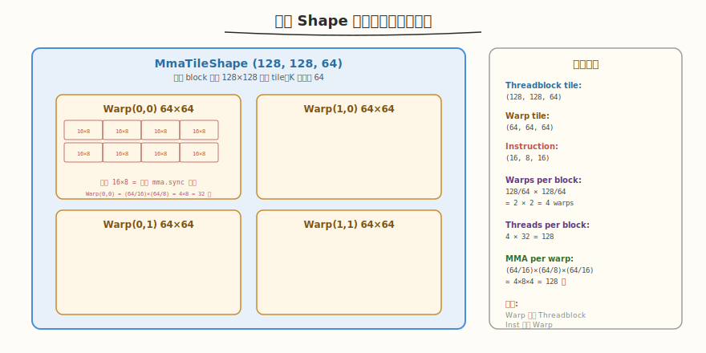
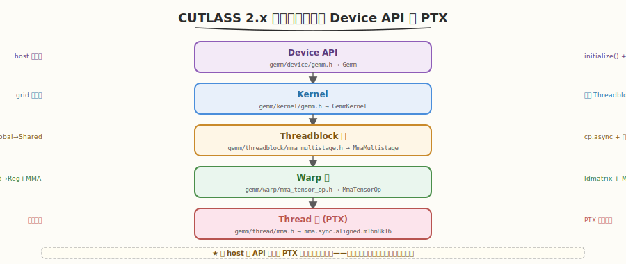
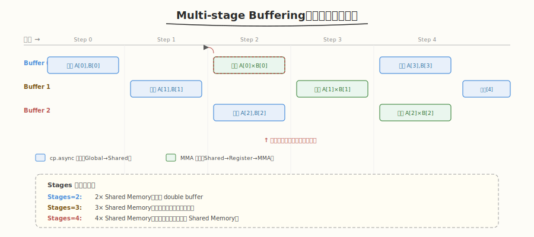
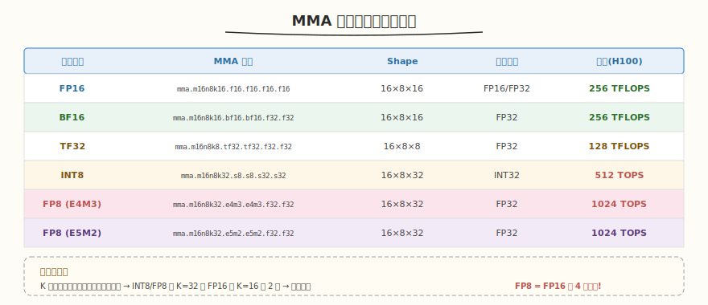
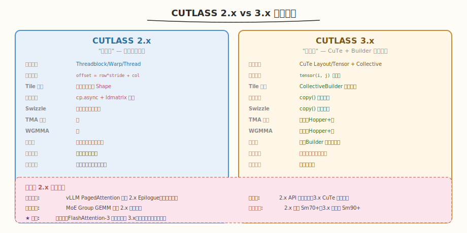

# Day 4：CUTLASS 2.x 三层抽象源码精读

## 🎯 目标

通过今天的学习，你将：

1. 深入理解 CUTLASS 2.x 的 Threadblock → Warp → Thread 三层抽象，能画出完整嵌套图并解释数据流
2. 精读 `MmaMultistage`（Threadblock 级）源码，理解 Multi-stage Buffering 如何隐藏 Global Memory 延迟
3. 精读 `MmaTensorOp`（Warp 级）源码，理解 `mma.sync` PTX 指令的调用方式与 fragment 布局
4. 掌握 MMA 指令与数据类型的映射关系（FP16/BF16/INT8/FP8）
5. 能对比 2.x 与 3.x 的架构差异，说出各自适用场景
6. 理解为什么 vLLM、TensorRT 等项目仍在用 2.x API

> 💡 **前置知识**：完成 Day 1-3（环境搭建 + CuTe 模型 + 3.x GEMM 实践），理解 CollectiveBuilder 的 auto-tuning 机制
> ⚠️ **环境要求**：CUTLASS 源码（`include/cutlass/gemm/` 目录）

---

## 为什么学 CUTLASS 2.x

Day 3 我们用 CUTLASS 3.x 的 `CollectiveBuilder` 写出了 cuBLAS 90%+ 的 GEMM——只需 7 个参数，Builder 自动选最优配置。那为什么还要学 2.x？

### 2.x 仍有大量存量代码

| 项目 | 使用的 CUTLASS API | 原因 |
|------|-------------------|------|
| **vLLM** | 2.x | PagedAttention kernel 在 2.x 时代开发，迁移成本高 |
| **TensorRT** | 2.x | 部分融合算子仍用 2.x 接口 |
| **xformers** | 2.x | memory_efficient_attention 的 GEMM kernel |
| **DeepSpeed** | 2.x | MoE 场景的 Group GEMM |
| **Megatron-LM** | 2.x | Transformer 训练中的融合 GEMM |

> 💡 **一句话总结**：3.x 是新项目的首选，但读懂 2.x 源码是维护 vLLM/TensorRT 等项目的必要技能。更重要的是，2.x 的三层抽象是理解 GEMM 优化原理的最佳教材——3.x 的 CuTe 把这些细节隐藏了，但它们仍然存在。

### 2.x 是"手动挡"——理解优化的本质

3.x 的 `CollectiveBuilder` 像自动挡——你不需要知道换挡逻辑。但如果你要**定制一个 Builder 不支持的算子**（如非标准 Epilogue 融合），就必须回到 2.x 的"手动挡"模式，手动配置每一层。

---

## 核心概念

### 1.1 三层抽象总览

CUTLASS 2.x 把 GEMM 的计算组织为三级嵌套，每级对应一个 GPU 硬件层级：


| 层级 | 对应硬件 | 职责 | 数据流 | 核心类 |
|------|----------|------|--------|--------|
| Threadblock | SM | 从 Global 加载 tile 到 Shared Memory | Global → Shared | `MmaMultistage` |
| Warp | Warp（32 线程） | 从 Shared 加载 fragment 到 Register，执行 MMA | Shared → Register → MMA | `MmaTensorOp` |
| Thread | Thread | 执行最终的 `mma.sync` 指令 | Register → MMA → Register | `MmaTensorOp` 内部 |

> 💡 **类比**：把 GEMM 想象成工厂流水线——Threadblock 是车间（从仓库领料到车间料架），Warp 是班组（从料架取料到工位），Thread 是工人（执行具体的组装动作）。每一层只关注自己负责的数据搬运和计算。

### 1.2 各层的 Shape 参数

三层抽象通过 Shape 参数逐级嵌套：



```cpp
// 2.x GEMM 的类型定义（典型配置）
using MmaTileShape = Shape<128, 128, 64>;      // Threadblock tile: M=128, N=128, K=64
using WarpTileShape = Shape<64, 64, 64>;        // Warp tile: M=64, N=64, K=64
using InstructionShape = Shape<16, 8, 16>;      // MMA 指令: m16n8k16

// Threadblock 内的 Warp 数量
// num_warps_m = MmaTileShape::M / WarpTileShape::M = 128/64 = 2
// num_warps_n = MmaTileShape::N / WarpTileShape::N = 128/64 = 2
// total_warps = 2 × 2 = 4 个 Warp = 128 个线程
```

| 参数 | 值 | 含义 |
|------|-----|------|
| `MmaTileShape` | (128, 128, 64) | 一个 block 处理 128×128 的输出 tile，K 维每次迭代 64 |
| `WarpTileShape` | (64, 64, 64) | 一个 warp 处理 64×64 的子 tile |
| `InstructionShape` | (16, 8, 16) | 一条 `mma.sync` 指令计算 16×8×16 |
| `num_warps` | 4 | block 内 4 个 warp（2×2 排列） |
| `threads_per_block` | 128 | 4 warp × 32 thread/warp |

> ⚠️ **注意**：`WarpTileShape` 必须整除 `MmaTileShape`，`InstructionShape` 必须整除 `WarpTileShape`。这些约束在编译期由 `static_assert` 检查。

### 1.3 源码调用链

从 device API 到 PTX 指令的完整调用链：



| 层级 | 文件 | 核心类 | 职责 |
|------|------|--------|------|
| Device | `gemm/device/gemm.h` | `Gemm` | host 端入口，launch kernel |
| Kernel | `gemm/kernel/gemm.h` | `GemmKernel` | grid 级调度，调用 Threadblock 级 |
| Threadblock | `gemm/threadblock/mma_multistage.h` | `MmaMultistage` | Global→Shared，多阶段流水线 |
| Warp | `gemm/warp/mma_tensor_op.h` | `MmaTensorOp` | Shared→Register，执行 MMA |
| Thread | `gemm/thread/mma.h` | `Mma` | 封装 `mma.sync` PTX 内联汇编 |
| PTX | — | `mma.sync.aligned.m16n8k16` | 硬件指令 |

---

## 深入原理

### 2.1 Threadblock 级：MmaMultistage

阅读路径：`include/cutlass/gemm/threadblock/mma_multistage.h`

```cpp
// 简化的 MmaMultistage 核心结构
template <
    typename Shape,            // Threadblock tile: <M, N, K>，如 <128, 128, 64>
    typename WarpShape,        // Warp tile: <M, N, K>，如 <64, 64, 64>
    typename InstructionShape, // MMA shape: <16, 8, 16>
    typename ElementA, typename LayoutA,
    typename ElementB, typename LayoutB,
    int Stages                  // 流水线阶段数：2/3/4
>
class MmaMultistage {
    // ===== 数据成员 =====
    // Shared Memory buffer（Stages 个）
    struct SharedStorage {
        ATile smem_A[Stages];  // A 的多阶段 buffer
        BTile smem_B[Stages];  // B 的多阶段 buffer
    };

    // ===== 核心方法 =====
    // 1. 从 Global 加载 A/B tile 到 Shared Memory（当前 stage 的 buffer）
    void copy_tiles_and_advance(int K_block) {
        // 用 cp.async 异步加载（Ampere+）
        // 写入 smem_A[stage_index] 和 smem_B[stage_index]
    }

    // 2. 主循环：迭代 K 维度
    void operator()() {
        // prologue：预加载前 Stages-1 个 tile
        for (int i = 0; i < Stages - 1; ++i) {
            copy_tiles_and_advance(i);  // cp.async 加载
            advance_stage();             // 轮转 stage 指针
        }

        // 主循环：加载与计算重叠
        for (int K_block = 0; K_block < K; K_block += Shape::K) {
            // ① 启动下一 tile 的异步加载（写到下一个 buffer）
            copy_tiles_and_advance(K_block);

            // ② 等待当前 buffer 就绪
            cp_async_wait_group<Stages - 1>();

            // ③ 对当前 buffer 执行计算（调用 Warp 级 Mma）
            warp_mma(smem_A[read_stage], smem_B[read_stage], accum);

            // ④ 轮转 stage 指针
            advance_stage();
        }
    }
};
```

#### Multi-stage Buffering 机制



| 阶段数 | Shared Memory | 延迟隐藏 | 适用场景 |
|--------|--------------|----------|----------|
| Stages=2 | 2× tile | 基础 double buffer | Shared Memory 紧张 |
| Stages=3 | 3× tile | 更好的重叠 | 通用（默认） |
| Stages=4 | 4× tile | 最大化重叠 | Shared Memory 充裕（H100） |

> 💡 **核心洞察**：Multi-stage 的本质是"让 Global Memory 加载和 MMA 计算同时进行"。当 `cp.async` 在加载 tile[i+2] 时，MMA 正在计算 tile[i]，而 tile[i+1] 已在 buffer 中等待。Global Memory 的 ~400 cycles 延迟被 MMA 计算时间完全掩盖。

### 2.2 Warp 级：MmaTensorOp

阅读路径：`include/cutlass/warp/mma_tensor_op.h`

```cpp
// 简化的 MmaTensorOp 核心结构
template <
    typename WarpShape,         // Warp tile: <64, 64, 64>
    typename InstructionShape,  // <16, 8, 16>
    typename ElementA, typename ElementB,
    typename ElementC,
    typename LayoutA, typename LayoutB
>
class MmaTensorOp {
    // ===== 数据成员 =====
    FragmentA frag_A;  // Register 中的 A 数据
    FragmentB frag_B;  // Register 中的 B 数据
    FragmentC frag_C;  // Register 中的累加结果

    // ===== 核心方法 =====
    // 1. 从 Shared Memory 加载 fragment 到 Register
    void load(ARef const& A_smem, BRef const& B_smem) {
        // 使用 ldmatrix 指令高效加载
        // ldmatrix 把 Shared Memory 数据按 MMA 需要的布局装入 Register
    }

    // 2. 执行 MMA 计算
    void operator()() {
        // 迭代 WarpTile 内的所有 InstructionShape
        for (int m = 0; m < WarpM; m += InstM) {      // InstM=16
            for (int n = 0; n < WarpN; n += InstN) {   // InstN=8
                for (int k = 0; k < WarpK; k += InstK) { // InstK=16
                    // 调用 Thread 级 Mma（PTX 内联汇编）
                    ThreadMma(frag_C[m][n], frag_A[m][k], frag_B[k][n]);
                }
            }
        }
    }
};
```

#### ldmatrix 指令

`ldmatrix` 是 Ampere+ 引入的专用指令，用于高效地从 Shared Memory 加载数据到 Register，**按 MMA 指令需要的 fragment 布局排列**：

| 操作 | 没有 ldmatrix | 有 ldmatrix |
|------|--------------|-------------|
| 加载方式 | 每线程单独 `lds` | 一条指令加载 8×8 矩阵 |
| 布局匹配 | 手动重排 Register | 自动按 MMA fragment 布局排列 |
| 指令数 | 32 条（每线程 1 条） | 1 条（warp 协作） |
| 转置支持 | 手动转置 | `ldmatrix.trans` 原生支持 |

> ⚠️ **注意**：MMA 指令对 A/B fragment 在 Register 中的布局有严格要求——不是简单的"每个线程存连续元素"。`ldmatrix` 自动处理这个映射，是 2.x 能高效执行 MMA 的关键。

### 2.3 Thread 级：Mma（PTX 内联汇编）

阅读路径：`include/cutlass/gemm/thread/mma.h`

```cpp
// 最底层的 MMA 指令封装
template <>
struct Mma<16, 8, 16, half_t, half_t, float> {
    // PTX 内联汇编调用 mma.sync
    CUTLASS_DEVICE
    void operator()(
        float& D0, float& D1, float& D2, float& D3,  // C/D fragment (4 个 FP32)
        uint32_t const& A0, uint32_t const& A1,      // A fragment (2 个 FP16×2)
        uint32_t const& B0,                            // B fragment (1 个 FP16×2)
        float const& C0, float const& C1,
        float const& C2, float const& C3
    ) {
        asm volatile(
            "mma.sync.aligned.m16n8k16.row.col.f32.f16.f16.f32 "
            "{%0, %1, %2, %3}, "  // D
            "{%4, %5}, "          // A
            "{%6}, "              // B
            "{%7, %8, %9, %10};\n" // C
            : "=f"(D0), "=f"(D1), "=f"(D2), "=f"(D3)
            : "r"(A0), "r"(A1), "r"(B0),
              "f"(C0), "f"(C1), "f"(C2), "f"(C3)
        );
    }
};
```

#### MMA 指令映射表



| 数据类型 | MMA 指令 | Shape | 累加类型 | 吞吐（H100） |
|----------|----------|-------|----------|-------------|
| FP16 | `mma.m16n8k16.f16.f16.f16.f16` | 16×8×16 | FP16/FP32 | 256 TFLOPS |
| BF16 | `mma.m16n8k16.bf16.bf16.f32.f32` | 16×8×16 | FP32 | 256 TFLOPS |
| TF32 | `mma.m16n8k8.tf32.tf32.f32.f32` | 16×8×8 | FP32 | 128 TFLOPS |
| INT8 | `mma.m16n8k32.s8.s8.s32.s32` | 16×8×32 | INT32 | 512 TOPS |
| FP8 (E4M3) | `mma.m16n8k32.e4m3.e4m3.f32.f32` | 16×8×32 | FP32 | 1024 TOPS |
| FP8 (E5M2) | `mma.m16n8k32.e5m2.e5m2.f32.f32` | 16×8×32 | FP32 | 1024 TOPS |

> 💡 **关键洞察**：MMA 指令的 Shape（如 16×8×16）是硬件固定的——一条指令计算一个 16×8 的输出 tile，使用 16 个 A 元素和 8 个 B 元素。CUTLASS 的三层抽象就是把大矩阵的 GEMM 拆解为无数条这样的 MMA 指令，通过 tile 复用最大化减少 Global Memory 访问。

#### Fragment 布局

MMA 指令的 A/B/C fragment 在 Register 中的分布不是"连续存储"，而是按特定的线程映射规则：

| Fragment | Shape | 每线程持有 | Warp 内分布 |
|----------|-------|-----------|-------------|
| A | 16×16 | 8 个 FP16（4 个 uint32） | 每个 lane 持有 A 的一部分行 |
| B | 16×8 | 4 个 FP16（2 个 uint32） | 每个 lane 持有 B 的一部分列 |
| C/D | 16×8 | 4 个 FP32 | 每个 lane 持有 C 的 4 个元素 |

> ⚠️ **注意**：Fragment 布局是 MMA 指令的硬件要求，不是 CUTLASS 的设计选择。`ldmatrix` 指令的存在就是为了自动完成"Shared Memory → 按 fragment 布局装入 Register"这个映射。

### 2.4 2.x vs 3.x 架构对比



| 维度 | CUTLASS 2.x | CUTLASS 3.x |
|------|-------------|-------------|
| 核心抽象 | Threadblock/Warp/Thread 三层 | CuTe Layout/Tensor + Collective |
| 索引计算 | 手写 `offset = row * stride + col` | `tensor(i, j)` 声明式访问 |
| Tile 配置 | 显式指定每层 Shape | CollectiveBuilder 自动选择 |
| 数据搬运 | `cp.async` + `ldmatrix` 手动管理 | CuTe `copy()` 自动优化 |
| Swizzle | 手动配置 `Swizzle` 模板参数 | CuTe `copy()` 自动应用 |
| TMA 支持 | 无 | 原生支持（Hopper+） |
| WGMMA 支持 | 无 | 原生支持（Hopper+） |
| 代码量 | 多（模板参数爆炸） | 少（Builder 隐藏细节） |
| 编译时间 | 快（模板展开较少） | 慢（Builder 遍历组合空间） |
| 适用场景 | 维护旧代码、定制算子 | 新项目首选 |

> 💡 **一句话总结**：2.x 是"手动挡"——每个层级都要显式配置，但你能看到每一个优化细节；3.x 是"自动挡"——CuTe 抽象掉了索引地狱，CollectiveBuilder 自动调优，但细节被隐藏。理解 2.x 的三层抽象是理解 GEMM 优化本质的基础。

#### 为什么 2.x 仍在用

| 原因 | 说明 |
|------|------|
| 迁移成本 | vLLM 的 PagedAttention 用了 2.x 的 Epilogue 自定义，迁移到 3.x 需要重写 |
| 定制需求 | 某些非标准算子（如 MoE 的 Group GEMM）在 2.x 中更容易定制 |
| 稳定性 | 2.x API 已稳定多年，3.x 的 CuTe 仍在演进 |
| 硬件兼容 | 2.x 支持到 Sm80（Ampere），3.x 优化的 Sm90+（Hopper） |

---

## 常见陷阱与最佳实践

### 陷阱 1：Shape 不整除导致编译错误

```cpp
// ❌ 错误：WarpShape 不整除 MmaTileShape
using MmaTileShape = Shape<128, 128, 64>;
using WarpTileShape = Shape<48, 64, 64>;   // 128 / 48 ≠ 整数！
// 编译报错：static_assert failed "WarpShape must divide MmaTileShape"
```

```cpp
// ✅ 正确：确保整除关系
using MmaTileShape = Shape<128, 128, 64>;
using WarpTileShape = Shape<64, 64, 64>;   // 128 / 64 = 2 ✓
```

### 陷阱 2：Stages 过大导致 Shared Memory 不足

```cpp
// ❌ 错误：Stages=4 + 大 tile 导致超出 Shared Memory
using Mma = MmaMultistage<Shape<256, 256, 128>, ..., 4>;
// Shared Memory = 4 × (256×128 + 256×128) × 2 bytes ≈ 512KB → 超出！
```

| Stages | Tile (128×128×64) | Shared Memory | 可用 SM |
|--------|-------------------|---------------|---------|
| 2 | ~32KB | 64KB | 2 block/SM |
| 3 | ~32KB | 96KB | 1-2 block/SM |
| 4 | ~32KB | 128KB | 1 block/SM |

### 陷阱 3：Fragment 布局搞混

2.x 的 Fragment 布局由 `LayoutA` / `LayoutB` 决定，A 和 B 可以有不同的布局。如果 Epilogue 写回时把 D 的布局搞反了，结果会完全错误但不会报错。

### 最佳实践

| 实践 | 说明 |
|------|------|
| 从 example 开始 | 不要从零拼模板，copy 一个最接近的 example 再改 |
| 先跑通再优化 | 先用默认 Stages=2，确认正确再增大 |
| 用 `cutlass_profiler` 验证 | profiler 可以快速验证 2.x 配置是否可行 |
| 注意 Shared Memory 上限 | 不同架构上限不同（Ampere 164KB，Hopper 228KB） |
| 阅读注释 | 2.x 源码注释非常详细，是最佳文档 |

---

## 面试要点

1. **CUTLASS 2.x 的三层抽象是什么？为什么这样设计？**

<details>
<summary>点击查看答案</summary>

- **Threadblock 级**（对应 SM）：从 Global Memory 加载 tile 到 Shared Memory，使用 Multi-stage buffering 隐藏延迟
- **Warp 级**（对应 Warp）：从 Shared Memory 加载 fragment 到 Register，使用 `ldmatrix` 指令，然后执行 MMA
- **Thread 级**（对应 Thread）：执行最终的 `mma.sync` PTX 指令，在 Register 级累加
- **设计动机**：匹配 GPU 硬件层级——SM 有 Shared Memory，Warp 有 Warp Shuffle，Thread 有 Register。每层只关注自己负责的数据搬运和计算，职责清晰
- 类比：车间（领料）→ 班组（取料到工位）→ 工人（执行组装）

</details>

2. **Multi-stage Buffering 是什么？为什么需要它？**

<details>
<summary>点击查看答案</summary>

- **机制**：在 Shared Memory 中维护多个 buffer（通常 2-4 个），让 Global Memory 加载和 MMA 计算同时进行
- **为什么需要**：Global Memory 延迟约 400-800 cycles，如果等加载完再计算，SM 大部分时间在空闲
- **工作方式**：当 `cp.async` 在加载 tile[i+2] 时，MMA 正在计算 tile[i]，tile[i+1] 已在 buffer 中等待
- **效果**：Global Memory 延迟被 MMA 计算时间完全掩盖，SM 利用率从 ~30% 提升到 ~80%+
- **tradeoff**：Stages 越多延迟隐藏越好，但 Shared Memory 占用越大，可能降低 SM 并行度

</details>

3. **`mma.sync` 指令的 Shape 和数据类型如何映射？**

<details>
<summary>点击查看答案</summary>

- MMA 指令的 Shape 是硬件固定的，如 `m16n8k16` 表示计算 16×8 的输出，K 维度 16
- FP16 → `mma.m16n8k16.f16.f16.f16.f16`，一条指令算 16×8×16，吞吐 256 TFLOPS（H100）
- INT8 → `mma.m16n8k32.s8.s8.s32.s32`，K 维度翻倍（32），吞吐 512 TOPS
- FP8 → `mma.m16n8k32.e4m3.e4m3.f32.f32`，吞吐 1024 TOPS（H100）
- 累加通常用 FP32（即使输入是 FP16/INT8），避免精度损失

</details>

4. **`ldmatrix` 指令的作用是什么？为什么不用普通 `lds`？**

<details>
<summary>点击查看答案</summary>

- `ldmatrix` 是 Ampere+ 引入的专用指令，从 Shared Memory 高效加载到 Register
- **为什么不用普通 lds**：
  - MMA 指令对 A/B fragment 在 Register 中的布局有严格要求（不是连续存储）
  - 普通 `lds` 每线程单独加载，需要手动重排 Register 数据——32 条指令 + 复杂的寄存器间数据交换
  - `ldmatrix` 一条指令加载整个 8×8（或 16×8）矩阵，自动按 MMA fragment 布局排列
- **额外能力**：`ldmatrix.trans` 原生支持转置加载（B 矩阵常需要转置）

</details>

5. **CUTLASS 2.x 和 3.x 的核心区别是什么？为什么 3.x 引入 CuTe？**

<details>
<summary>点击查看答案</summary>

- **2.x**：三层抽象 + 手写索引，每个层级需显式配置 Shape/Stride，`cp.async` 和 `ldmatrix` 手动管理
- **3.x**：引入 CuTe（Layout/Tensor 抽象），`CollectiveBuilder` 自动选配置，`copy()` 自动优化数据搬运
- **为什么引入 CuTe**：
  - 2.x 的索引计算是最大的 bug 来源和心智负担
  - CuTe 把"数据怎么存"（Layout）和"数据是什么"（Tensor）解耦，用 `tensor(i,j)` 声明式访问
  - `copy()` 自动应用 swizzle、向量化、cp.async/TMA，不需要用户手写
- **为什么 2.x 仍在用**：vLLM/TensorRT 等有大量存量代码，迁移成本高；某些定制算子在 2.x 中更容易实现

</details>

6. **为什么 vLLM 等项目仍在用 CUTLASS 2.x 而不迁移到 3.x？**

<details>
<summary>点击查看答案</summary>

- **迁移成本**：vLLM 的 PagedAttention kernel 深度依赖 2.x 的 Epilogue 自定义接口，迁移到 3.x 的 EVT 需要重写
- **稳定性**：2.x API 已稳定多年，3.x 的 CuTe 仍在演进（API 可能变动）
- **定制需求**：某些非标准算子（如 MoE 的 Group GEMM）在 2.x 中更容易定制
- **硬件兼容**：2.x 支持 Sm70+（Volta），3.x 的最优特性需要 Sm90+（Hopper）
- **趋势**：新项目（如 FlashAttention-3）已在用 3.x，存量项目逐步迁移中

</details>

---

## 今日总结

Day 4 我们深入 CUTLASS 2.x 源码，理解了经典 GEMM 模板设计：

1. **三层抽象**：Threadblock（Global→Shared）→ Warp（Shared→Register + MMA）→ Thread（PTX mma.sync），每层匹配一个 GPU 硬件层级
2. **Multi-stage Buffering**：多个 Shared Memory buffer 让加载与计算重叠，掩盖 Global Memory 延迟
3. **MmaTensorOp**：用 `ldmatrix` 从 Shared 加载 fragment 到 Register，按 `InstructionShape` 迭代执行 MMA
4. **MMA 指令映射**：FP16→m16n8k16、INT8→m16n8k32、FP8→m16n8k32，累加用 FP32
5. **2.x vs 3.x**：2.x 手动挡（显式配置每层），3.x 自动挡（CuTe + CollectiveBuilder）；理解 2.x 是理解 GEMM 优化本质的基础
6. **存量价值**：vLLM、TensorRT 等仍在用 2.x，读懂 2.x 源码是维护这些项目的必要技能

> 💡 **明日预告**：Day 5 将回到 3.x，学习 CUTLASS 的核心卖点——Epilogue 融合。用 EVT（Epilogue Visitor Tree）实现 GEMM+Bias+ReLU 的单 kernel 融合，避免中间结果落盘 Global Memory。

---

## 推荐资源

| 资源 | 类型 | 优先级 | 说明 |
|------|------|--------|------|
| `include/cutlass/gemm/threadblock/mma_multistage.h` | 源码 | ⭐ 必读 | Threadblock 级核心实现 |
| `include/cutlass/gemm/warp/mma_tensor_op.h` | 源码 | ⭐ 必读 | Warp 级 MMA 实现 |
| `include/cutlass/gemm/thread/mma.h` | 源码 | ⭐ 必读 | Thread 级 PTX 内联汇编 |
| `examples/15_ampere_tensorop_strided_gemm/` | 源码 | ⭐ 必读 | Ampere 2.x GEMM 完整示例 |
| [CUTLASS GEMM API 2.x 文档](https://github.com/NVIDIA/cutlass/blob/main/media/docs/gemm_api.md) | 文档 | 📌 推荐 | 2.x API 设计文档 |
| `include/cutlass/arch/mma.h` | 源码 | 📌 推荐 | MMA 指令硬件抽象层 |
| `examples/52_hopper_gemm_with_swizzle/` | 源码 | 📎 参考 | Hopper swizzle 示例 |
