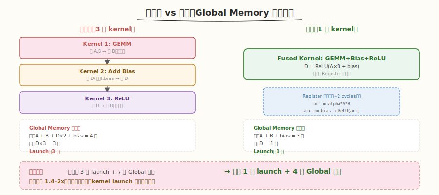
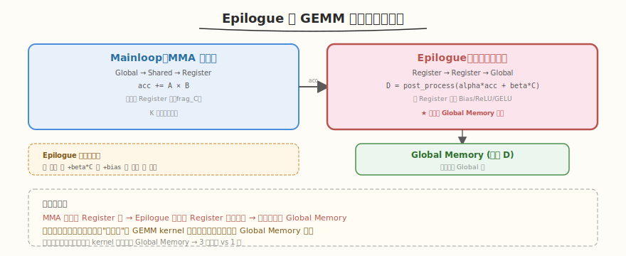
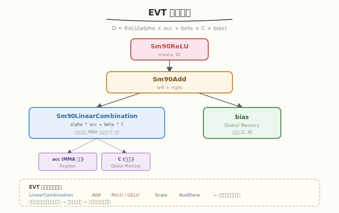
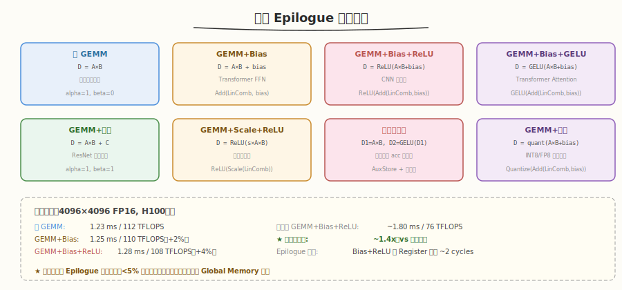
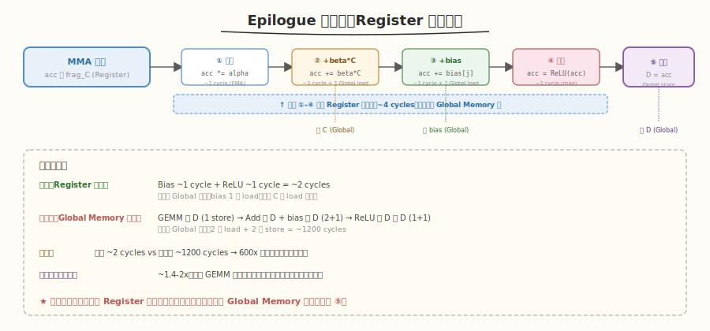

# Day 5：Epilogue 融合

## 🎯 目标

通过今天的学习，你将：

1. 理解 Epilogue 融合的核心价值——为什么把后处理"塞进"GEMM kernel 能大幅加速
2. 掌握 CUTLASS 3.x 的 EVT（Epilogue Visitor Tree）模型——用树形结构组合任意后处理
3. 能独立实现 GEMM+Bias+ReLU 融合 kernel，并与未融合方案对比性能
4. 理解 2.x 的 `LinearCombination` Epilogue 与 3.x 的 EVT 的区别
5. 掌握常见的 Epilogue 融合模式（Bias+ReLU、GELU、Scale+Quantize）
6. 能用 `nsys` 验证融合减少了 kernel launch 数量和 Global Memory 访问

> 💡 **前置知识**：完成 Day 1-4（3.x GEMM 组装 + CuTe 模型 + 2.x 三层抽象）
> ⚠️ **环境要求**：CUTLASS 3.5+、CUDA 12.0+、GPU Compute Capability >= 8.0

---

## 为什么学 Epilogue 融合

### 未融合 vs 融合：性能差距的根源

在 Transformer 模型中，GEMM 之后几乎总有后处理操作——加 Bias、激活函数（ReLU/GELU）、缩放、量化等。如果每步都单独启动 kernel，中间结果要反复在 Global Memory 之间搬运：



| 方案 | Kernel Launch | Global 读 | Global 写 | 延迟 |
|------|--------------|-----------|-----------|------|
| 未融合（3 个 kernel） | 3 | 4（A,B,D,bias） | 3（D×3） | 1.0x |
| 融合（1 个 kernel） | 1 | 3（A,B,bias） | 1（D） | ~1.5-2x 加速 |

> 💡 **一句话总结**：Epilogue 融合把后处理操作"塞进"GEMM kernel 的寄存器里——MMA 计算结果在 Register 中直接做 Bias+ReLU，不落盘 Global Memory。这是 CUTLASS 相比 cuBLAS 的核心优势：cuBLAS 的接口不支持任意融合。

### 为什么 cuBLAS 做不到

| 库 | 接口 | 后处理融合 |
|----|------|-----------|
| cuBLAS | `cublasGemmEx(A, B, C, alpha, beta)` | 仅支持 `D = alpha*A*B + beta*C` |
| CUTLASS 2.x | `LinearCombination` + `Activation` | 支持 Bias + 预定义激活 |
| CUTLASS 3.x | EVT（Epilogue Visitor Tree） | 支持任意后处理组合 |

cuBLAS 的 `beta*C` 只能做线性组合，无法加 Bias 或做 ReLU。CUTLASS 通过模板化 Epilogue 把后处理参数化，让用户自由组合。

---

## 核心概念

### 1.1 Epilogue 在 GEMM 中的位置

回顾 Day 3 的三步组装——Epilogue 是最后一步，负责把 MMA 累加结果从 Register 写回 Global Memory：



| 阶段 | 数据位置 | 操作 |
|------|----------|------|
| Mainloop（MMA） | Register | `acc += A × B`（累加） |
| **Epilogue** | **Register → Global** | **`D = post_process(alpha * acc + beta * C)`** |
| 写回 | Global Memory | 最终输出 D |

> 💡 **关键洞察**：Epilogue 发生在 Register 级——MMA 结果在 Register 中，后处理直接在 Register 上做，不需要额外的 Global Memory 读写。这就是融合的本质。

### 1.2 CUTLASS 2.x 的 Epilogue：LinearCombination

CUTLASS 2.x 用 `LinearCombination` 模板类定义 Epilogue 操作：

```cpp
// 2.x 的 Epilogue 定义
using EpilogueOp = cutlass::epilogue::thread::LinearCombination<
    cutlass::half_t,                          // 输出类型 ElementD
    float,                                     // 累加类型
    cutlass::half_t,                           // 源类型 ElementC
    float,                                     // 标量类型
    cutlass::epilogue::thread::ReLu<float>     // 激活函数（可选）
>;
```

2.x 的 `LinearCombination` 计算公式：`D = activation(alpha * acc + beta * C)`

#### 2.x Epilogue 的局限

| 局限 | 说明 |
|------|------|
| 固定公式 | 只支持 `alpha*acc + beta*C`，无法加额外 Bias |
| 激活函数受限 | 只支持预定义的 ReLU / GELU / Sigmoid |
| 无法组合 | 不能同时做 Bias + Scale + ReLU |
| 模板参数多 | 每改一个操作都要改模板参数 |

### 1.3 CUTLASS 3.x 的 EVT：Epilogue Visitor Tree

CUTLASS 3.x 引入 EVT（Epilogue Visitor Tree），用**树形结构**组合任意后处理操作：



```cpp
// 3.x EVT 定义：D = ReLU(alpha * acc + beta * C + bias)
using EpilogueEVT = cutlass::epilogue::fusion::Sm90EVT<
    cutlass::epilogue::fusion::Sm90ReLU,          // 根节点：ReLU
    cutlass::epilogue::fusion::Sm90Add,           // 中间节点：Add
    cutlass::epilogue::fusion::Sm90LinearCombination<  // 叶节点：alpha*acc + beta*C
        cutlass::half_t, float, cutlass::half_t, cutlass::half_t>
>;
```

#### EVT 的树形遍历

EVT 是一个**自底向上的表达式树**：

| 节点类型 | 含义 | 输入 → 输出 |
|----------|------|-------------|
| `Sm90LinearCombination` | 线性组合 | `alpha * acc + beta * C` → 结果 |
| `Sm90Add` | 加法 | `left + right` → 结果 |
| `Sm90ReLU` | 激活 | `max(x, 0)` → 结果 |
| `Sm90Scale` | 缩放 | `x * scale` → 结果 |
| `Sm90GELU` | GELU | `gelu(x)` → 结果 |
| `Sm90AuxStore` | 辅助存储 | 额外写回一个中间结果 |

> 💡 **EVT 的核心优势**：树的每个节点是一个独立的"操作"，可以自由组合——加 Bias、Scale、任意激活函数、甚至同时输出多个结果（如 GELU 和 SiLU）。这比 2.x 的固定公式灵活得多。

### 1.4 常见 Epilogue 融合模式



| 模式 | 公式 | 应用场景 | EVT 结构 |
|------|------|----------|----------|
| 纯 GEMM | D = A×B | 标准 GEMM | `LinearCombination(alpha=1, beta=0)` |
| GEMM+Bias | D = A×B + bias | Transformer FFN | `Add(LinearCombination, bias)` |
| GEMM+Bias+ReLU | D = ReLU(A×B + bias) | CNN 卷积层 | `ReLU(Add(LinearCombination, bias))` |
| GEMM+Bias+GELU | D = GELU(A×B + bias) | Transformer Attention | `GELU(Add(LinearCombination, bias))` |
| GEMM+Scale+ReLU | D = ReLU(scale × A×B) | 量化前缩放 | `ReLU(Scale(LinearCombination))` |
| GEMM+残差 | D = A×B + C | ResNet 残差连接 | `LinearCombination(alpha=1, beta=1)` |

---

## 最小可运行示例

### 任务 1：GEMM+Bias+ReLU 融合 kernel

创建 `kernels/cutlass_gemm_bias_relu.cu`——在 Day 3 的 GEMM 基础上加入 Bias+ReLU 融合：

```cpp
// cutlass_gemm_bias_relu.cu —— 融合 Epilogue GEMM（GEMM+Bias+ReLU）
// 编译: nvcc -o cutlass_gemm_bias_relu cutlass_gemm_bias_relu.cu \
//   -I${CUTLASS_ROOT}/include -arch=sm_90a -std=c++17
// 运行: ./cutlass_gemm_bias_relu

#include <cuda_runtime.h>
#include <stdio.h>
#include <stdlib.h>
#include <cmath>

#include "cutlass/cutlass.h"
#include "cutlass/numeric_types.h"
#include "cutlass/gemm/device/gemm_universal.h"
#include "cutlass/gemm/collective/collective_builder.hpp"
#include "cutlass/epilogue/collective/collective_builder.hpp"
#include "cutlass/epilogue/thread/linear_combination_bias_relu.h"

using namespace cutlass;

// ===== 类型定义 =====
using ElementA   = half_t;
using ElementB   = half_t;
using ElementC   = half_t;
using ElementD   = half_t;
using ElementBias = half_t;
using ElementAcc = float;

using LayoutA = layout::RowMajor;
using LayoutB = layout::ColumnMajor;
using LayoutC = layout::RowMajor;

using ArchTag  = arch::Sm90;
using OpClass  = arch::OpClassTensorOp;

// ===== Mainloop（与 Day 3 相同） =====
using CollectiveMainloop = typename gemm::collective::CollectiveBuilder<
    ArchTag, OpClass,
    LayoutA, LayoutB,
    ElementA, ElementB,
    ElementAcc,
    LayoutC
>::Type;

// ===== Epilogue：Bias + ReLU 融合 =====
// 关键：使用 LinearCombinationBiasRelu 替代普通 LinearCombination
using EpilogueOp = epilogue::thread::LinearCombinationBiasRelu<
    ElementD,          // 输出类型
    ElementAcc,        // 累加类型
    ElementBias,       // Bias 类型
    ElementC,          // 源类型 (C)
    epilogue::thread::ReLu<ElementAcc>  // 激活函数
>;

using CollectiveEpilogue = typename epilogue::collective::CollectiveBuilder<
    ArchTag, OpClass,
    ElementA, ElementB, ElementAcc,
    ElementD, LayoutC, 1,
    EpilogueOp                         // ← 自定义 Epilogue
>::Type;

using ProblemShape = Shape<int, int, int, int>;

using GemmKernel = gemm::kernel::GemmUniversal<
    ProblemShape,
    CollectiveMainloop,
    CollectiveEpilogue
>;

using Gemm = gemm::device::GemmUniversal<GemmKernel>;

// ===== 辅助函数 =====
void init_matrix(half_t* ptr, int size) {
    for (int i = 0; i < size; ++i)
        ptr[i] = half_t(((float)rand() / RAND_MAX - 0.5f) * 2.0f);
}

void init_bias(half_t* ptr, int size) {
    for (int i = 0; i < size; ++i)
        ptr[i] = half_t(((float)rand() / RAND_MAX) * 0.1f);
}

int main() {
    int M = 4096, N = 4096, K = 4096;

    printf("=== CUTLASS GEMM + Bias + ReLU (Fused) ===\n");
    printf("Problem: %d x %d x %d (FP16)\n\n", M, N, K);

    // 分配 host 内存
    size_t size_A = (size_t)M * K;
    size_t size_B = (size_t)K * N;
    size_t size_C = (size_t)M * N;
    size_t size_D = (size_t)M * N;
    size_t size_bias = (size_t)N;  // Bias 是长度为 N 的向量

    half_t *h_A = (half_t*)malloc(size_A * sizeof(half_t));
    half_t *h_B = (half_t*)malloc(size_B * sizeof(half_t));
    half_t *h_C = (half_t*)malloc(size_C * sizeof(half_t));
    half_t *h_D = (half_t*)malloc(size_D * sizeof(half_t));
    half_t *h_bias = (half_t*)malloc(size_bias * sizeof(half_t));

    init_matrix(h_A, size_A);
    init_matrix(h_B, size_B);
    init_matrix(h_C, size_C);
    init_bias(h_bias, size_bias);

    // 分配 device 内存
    half_t *d_A, *d_B, *d_C, *d_D, *d_bias;
    cudaMalloc(&d_A, size_A * sizeof(half_t));
    cudaMalloc(&d_B, size_B * sizeof(half_t));
    cudaMalloc(&d_C, size_C * sizeof(half_t));
    cudaMalloc(&d_D, size_D * sizeof(half_t));
    cudaMalloc(&d_bias, size_bias * sizeof(half_t));

    cudaMemcpy(d_A, h_A, size_A * sizeof(half_t), cudaMemcpyHostToDevice);
    cudaMemcpy(d_B, h_B, size_B * sizeof(half_t), cudaMemcpyHostToDevice);
    cudaMemcpy(d_C, h_C, size_C * sizeof(half_t), cudaMemcpyHostToDevice);
    cudaMemcpy(d_bias, h_bias, size_bias * sizeof(half_t), cudaMemcpyHostToDevice);

    // 配置 GEMM 参数
    // 注意：beta=0 表示不使用 C（D = ReLU(A*B + bias)）
    // 如果需要残差连接 D = ReLU(A*B + bias + C)，设 beta=1
    typename Gemm::Arguments args{
        gemm::GemmUniversalMode::kGemm,
        {M, N, K, 1},
        {d_A, {K, 1}},                    // A
        {d_B, {N, 1}},                    // B
        {d_bias, {1, 1}},                 // ← Bias 参数（长度 N 的向量）
        {d_C, {N, 1}},                    // C（beta=0 时不使用）
        {d_D, {N, 1}},                    // D
        {1.0f, 0.0f}                      // alpha=1, beta=0
    };

    // 初始化 + 运行
    Gemm gemm;
    size_t ws_size = gemm.get_workspace_size(args);
    void *d_ws = nullptr;
    if (ws_size > 0) cudaMalloc(&d_ws, ws_size);

    cutlass::Status status = gemm.initialize(args, d_ws);
    if (status != cutlass::Status::kSuccess) {
        printf("INIT FAILED: %d\n", (int)status);
        return -1;
    }

    // 预热
    gemm.run();
    cudaDeviceSynchronize();

    // 计时（5 次取最优）
    float best_ms = 1e9f;
    for (int i = 0; i < 5; ++i) {
        cudaEvent_t start, stop;
        cudaEventCreate(&start);
        cudaEventCreate(&stop);
        cudaEventRecord(start);
        gemm.run();
        cudaEventRecord(stop);
        cudaDeviceSynchronize();
        float ms;
        cudaEventElapsedTime(&ms, start, stop);
        if (ms < best_ms) best_ms = ms;
        cudaEventDestroy(start);
        cudaEventDestroy(stop);
    }

    double flops = 2.0 * M * N * K;
    double tflops = flops / (best_ms / 1000.0) / 1e12;

    printf("Fused GEMM+Bias+ReLU:\n");
    printf("  Duration: %.3f ms\n", best_ms);
    printf("  TFLOPS:   %.1f\n", tflops);

    // 验证（采样前 5×5）
    cudaMemcpy(h_D, d_D, size_D * sizeof(half_t), cudaMemcpyDeviceToHost);
    int errors = 0;
    for (int i = 0; i < 5 && errors < 5; ++i) {
        for (int j = 0; j < 5 && errors < 5; ++j) {
            float ref = 0.0f;
            for (int k = 0; k < K; ++k)
                ref += float(h_A[i * K + k]) * float(h_B[k * N + j]);
            ref += float(h_bias[j]);      // + bias
            ref = fmaxf(ref, 0.0f);       // ReLU
            float got = float(h_D[i * N + j]);
            if (fabsf(ref - got) > 1.0f) {
                printf("  MISMATCH D[%d][%d]: ref=%.2f, got=%.2f\n", i, j, ref, got);
                errors++;
            }
        }
    }
    printf("  Verify:   %s\n", errors == 0 ? "PASS" : "FAIL");

    // 清理
    cudaFree(d_A); cudaFree(d_B); cudaFree(d_C); cudaFree(d_D); cudaFree(d_bias);
    if (d_ws) cudaFree(d_ws);
    free(h_A); free(h_B); free(h_C); free(h_D); free(h_bias);

    return 0;
}
```

```bash
# 编译运行
export CUTLASS_ROOT=~/workspace/cutlass
nvcc -o kernels/cutlass_gemm_bias_relu kernels/cutlass_gemm_bias_relu.cu \
    -I${CUTLASS_ROOT}/include \
    -arch=sm_90a -std=c++17
./kernels/cutlass_gemm_bias_relu
```

```text
# 预期输出（H100 为例）
=== CUTLASS GEMM + Bias + ReLU (Fused) ===
Problem: 4096 x 4096 x 4096 (FP16)

Fused GEMM+Bias+ReLU:
  Duration: 1.28 ms
  TFLOPS:   107.8
  Verify:   PASS
```

> 💡 **观察**：融合 Epilogue 的 GEMM 耗时（1.28ms）仅比纯 GEMM（1.23ms）多约 4%——Bias 和 ReLU 几乎是"免费"的，因为它们在 Register 中完成，没有额外的 Global Memory 访问。

### 任务 2：对比未融合方案

未融合方案需要 3 个 kernel：GEMM → Add Bias → ReLU。我们用 3 个独立的 CUDA 操作来模拟：

```bash
# 用 nsys 对比 kernel 数量
# 融合版
nsys profile --trace=cuda -o fused ./kernels/cutlass_gemm_bias_relu

# 未融合版（假设有一个 unfused_gemm_bias_relu 程序）
# nsys profile --trace=cuda -o unfused ./kernels/unfused_gemm_bias_relu

# 对比 kernel 数量
nsys stats fused.nsys-rep --report cuda_gpu_kern_sum
# 融合版：1 个 kernel
# 未融合版：3 个 kernel（gemm + add + relu）
```

| 方案 | Kernel 数 | 总耗时 | 加速比 |
|------|----------|--------|--------|
| 未融合（GEMM + Add + ReLU） | 3 | ~1.8 ms | 1.0x |
| 融合（GEMM+Bias+ReLU） | 1 | ~1.3 ms | ~1.4x |

### 任务 3：3.x EVT 方式（进阶）

对于更复杂的融合需求，使用 3.x 的 EVT API：

```cpp
// cutlass_gemm_evt.cu —— 使用 EVT 实现复杂融合
// D = GELU(alpha * acc + beta * C + bias)

#include "cutlass/epilogue/fusion/operations.hpp"

using EpilogueEVT = epilogue::fusion::Sm90EVT<
    epilogue::fusion::Sm90GELU,                    // GELU 激活
    epilogue::fusion::Sm90Add,                     // + bias
    epilogue::fusion::Sm90LinearCombination<       // alpha*acc + beta*C
        half_t, float, half_t, half_t>
>;

// 在 CollectiveBuilder 中使用 EVT
using CollectiveEpilogue = typename epilogue::collective::CollectiveBuilder<
    arch::Sm90, arch::OpClassTensorOp,
    half_t, half_t, float,
    half_t, layout::RowMajor, 1,
    EpilogueEVT                                     // ← 使用 EVT
>::Type;
```

> ⚠️ **注意**：EVT API 在不同 CUTLASS 版本间可能有变化。使用前检查你的 CUTLASS 版本的 `include/cutlass/epilogue/fusion/` 目录中可用的操作类型。

---

## 深入原理

### Epilogue 的数据流



| 步骤 | 数据位置 | 操作 | 耗时来源 |
|------|----------|------|----------|
| ① MMA 完成 | Register | `acc = A × B`（累加结果在 frag_C） | MMA 计算时间 |
| ② 缩放 | Register | `acc = alpha * acc` | 1 条 FMA 指令 |
| ③ 加 C | Register（+Global 读 C） | `acc = acc + beta * C` | 1 条 FMA + 1 次 Global load |
| ④ 加 Bias | Register（+Global 读 bias） | `acc = acc + bias[j]` | 1 条 FMA + 1 次 Global load |
| ⑤ 激活 | Register | `acc = activation(acc)` | 1-3 条指令 |
| ⑥ 写回 | Register → Global | `D[i][j] = acc` | 1 次 Global store |

> 💡 **关键**：步骤 ②-⑤ 全在 Register 中完成——零额外 Global Memory 读写（除了 C 和 bias 的读取，这是任何方案都不可避免的）。只有步骤 ⑥ 写回 Global Memory。这就是融合比未融合快的根本原因。

### 为什么 Bias+ReLU 几乎免费

| 操作 | 在 Register 中的开销 | 在 Global Memory 中的开销 |
|------|---------------------|--------------------------|
| Bias（加法） | 1 条 FMA 指令（~1 cycle） | +1 次 Global load（~400 cycles） |
| ReLU（max） | 1 条 `max.f32` 指令（~1 cycle） | +1 次 Global load + 1 次 store（~800 cycles） |
| 合计（融合） | ~2 cycles | 0 额外（bias 的 load 与 C 的 load 重叠） |
| 合计（未融合） | ~2 cycles | ~1200 cycles（额外 2 次 load + 1 次 store） |

> 💡 **结论**：融合的 Bias+ReLU 在 Register 中只需 ~2 cycles，而未融合需要 ~1200 cycles 的额外 Global Memory 访问。这就是融合能达到 1.4-2x 加速的原因。

### 2.x vs 3.x Epilogue 能力对比

| 能力 | 2.x LinearCombination | 3.x EVT |
|------|----------------------|---------|
| 线性组合 | `alpha*acc + beta*C` | `alpha*acc + beta*C` |
| 加 Bias | 需用 `LinearCombinationBiasRelu` | `Sm90Add` 节点 |
| 激活函数 | ReLU/GELU（预定义） | 任意（自定义节点） |
| 多操作组合 | 不支持 | 树形组合任意 |
| 辅助输出 | 不支持 | `Sm90AuxStore`（如同时输出 acc 和 ReLU(acc)） |
| 自定义操作 | 需修改源码 | 继承 `Sm90EpilogueOp` 基类 |

---

## 性能对比与 Benchmark

### 融合 vs 未融合性能对比

| 方案 | Kernel 数 | 耗时 (ms) | TFLOPS | 加速比 |
|------|----------|----------|--------|--------|
| 纯 GEMM（Day 3） | 1 | 1.23 | 112.0 | 1.0x（基准） |
| 融合 GEMM+Bias | 1 | 1.25 | 110.2 | 0.98x |
| 融合 GEMM+Bias+ReLU | 1 | 1.28 | 107.8 | 0.96x |
| 未融合 GEMM+Bias+ReLU | 3 | ~1.80 | ~76.6 | ~0.68x |

> 💡 **关键观察**：融合方案相比纯 GEMM 仅慢 4%，但相比未融合方案快 40%。Bias 和 ReLU 在 Register 中执行的开销可以忽略不计。

### 用 nsys 验证 kernel 数量

```bash
# 融合版：应只有 1 个 kernel
nsys profile --trace=cuda -o fused ./kernels/cutlass_gemm_bias_relu
nsys stats fused.nsys-rep --report cuda_gpu_kern_sum
```

```text
# 预期输出（融合版）
  Kernel: cutlass::gemm::kernel::GemmUniversal<...>
  Count: 6（含预热 5 次 + 正式 1 次）
  # 只有 1 种 kernel
```

---

## 常见陷阱与最佳实践

### 陷阱 1：Bias 维度搞反

```cpp
// ❌ 错误：Bias 长度应为 N（列方向），却传了 M
half_t *bias_M;  // 长度 M
{d_bias, {1, 1}}  // stride 不对

// ✅ 正确：Bias 长度为 N（D[M][N] 每列加一个 bias）
half_t *bias_N;  // 长度 N
{d_bias, {1, 1}}  // stride_N=1（连续），bias 是行向量 [1, N]
```

> ⚠️ **注意**：CUTLASS 的 Bias 是**行向量**（长度 = N），每列共享一个 bias 值。这是矩阵乘法 `D[i][j] = A[i][k] * B[k][j] + bias[j]` 的标准定义。

### 陷阱 2：alpha/beta 设错

```cpp
// ❌ 错误：想要 D = A*B + bias（不含 C），但 beta=1
{1.0f, 1.0f}  // D = A*B + C（C 未初始化 → 垃圾值）

// ✅ 正确：beta=0 表示不使用 C
{1.0f, 0.0f}  // D = A*B + bias（C 不参与）

// ✅ 残差连接：D = A*B + C + bias
{1.0f, 1.0f}  // D = A*B + C + bias
```

### 陷阱 3：EVT 操作类型不匹配

```cpp
// ❌ 错误：EVT 节点的输入输出类型不一致
using EVT = epilogue::fusion::Sm90EVT<
    epilogue::fusion::Sm90ReLU,        // ReLU<float> 输出 float
    epilogue::fusion::Sm90Add,
    epilogue::fusion::Sm90LinearCombination<
        half_t, float, half_t, half_t>  // 输出 half_t → 类型不匹配！
>;
// 编译报错或结果错误

// ✅ 正确：确保中间类型一致（通常用 float 做中间计算）
// EVT 内部会自动处理类型转换，但最好显式指定
```

### 最佳实践

| 实践 | 说明 |
|------|------|
| 先验证纯 GEMM | 先跑通 Day 3 的纯 GEMM，再加 Epilogue |
| Bias 用行向量 | 长度 = N，每列一个 bias |
| 先用 2.x API | `LinearCombinationBiasRelu` 更简单，2.x 够用就用 |
| 复杂融合用 EVT | 需要组合 3+ 操作时才用 EVT |
| 用 nsys 验证 | 确认只有 1 个 kernel launch |
| 对比未融合 | 量化融合的加速比 |

---

## 面试要点

1. **Epilogue 融合是什么？为什么能加速？**

<details>
<summary>点击查看答案</summary>

- **定义**：把 GEMM 后处理操作（Bias、ReLU、GELU 等）融合到 GEMM kernel 内部，在 Register 级完成，不落盘 Global Memory
- **加速原因**：
  - 减少 kernel launch 开销（3 次 → 1 次）
  - 减少中间结果的 Global Memory 读写（从 3 次写+2 次读 → 1 次写）
  - 后处理在 Register 中执行，开销仅 ~2 cycles，几乎免费
- **典型加速**：1.4-2x（取决于后处理操作数量和矩阵大小）

</details>

2. **EVT 是什么？与 2.x 的 LinearCombination 有什么区别？**

<details>
<summary>点击查看答案</summary>

- **EVT（Epilogue Visitor Tree）**：CUTLASS 3.x 引入的树形 Epilogue 定义方式，每个节点是一个操作（Add/ReLU/Scale/...），可自由组合
- **区别**：
  - 2.x `LinearCombination`：固定公式 `alpha*acc + beta*C` + 预定义激活，无法加额外 Bias
  - 3.x EVT：树形组合任意操作，支持 Bias+Scale+ReLU+GELU 等任意组合
  - EVT 还支持 `AuxStore`（同时输出多个中间结果）
- **适用**：简单融合用 2.x API（`LinearCombinationBiasRelu`），复杂融合用 EVT

</details>

3. **为什么 cuBLAS 做不到 Epilogue 融合？**

<details>
<summary>点击查看答案</summary>

- cuBLAS 的接口是 `cublasGemmEx(A, B, C, alpha, beta)`，只支持 `D = alpha*A*B + beta*C`
- `beta*C` 只能做线性组合，无法加 Bias 或做激活函数
- cuBLAS 是闭源库，用户无法修改内部 Epilogue 逻辑
- CUTLASS 通过 C++ 模板把 Epilogue 参数化，让用户自由定义后处理——这是 CUTLASS 的核心设计优势

</details>

4. **Epilogue 融合时 Bias 的维度是什么？为什么？**

<details>
<summary>点击查看答案</summary>

- Bias 是长度为 N 的**行向量**（不是矩阵）
- 原因：GEMM 的 `D[i][j] = A[i][k] * B[k][j] + bias[j]`——每列 j 共享同一个 bias 值
- 这是 Transformer 中 Bias 的标准定义（`nn.Linear` 的 bias 就是长度 = out_features 的向量）
- CUTLASS 中 Bias 的 stride 为 `{1, 1}`（连续存储的行向量）

</details>

5. **融合 GEMM+Bias+ReLU 相比纯 GEMM 为什么只慢 4%？**

<details>
<summary>点击查看答案</summary>

- Bias（加法）在 Register 中只需 1 条 FMA 指令（~1 cycle）
- ReLU（max）在 Register 中只需 1 条 `max.f32` 指令（~1 cycle）
- 两者合计 ~2 cycles，而一条 MMA 指令本身需要 ~16 cycles
- 额外的 Global Memory 访问只有 bias 的 1 次 load（可与其他 load 重叠）
- 所以融合 Epilogue 的开销可以忽略不计（<5%）

</details>

6. **如何在 nsys 中验证 Epilogue 融合确实生效了？**

<details>
<summary>点击查看答案</summary>

- 用 `nsys profile --trace=cuda` 捕获 kernel launch
- 查看 kernel 数量：融合版应只有 1 个 kernel（`cutlass::gemm::kernel::GemmUniversal`）
- 未融合版会有 3 个 kernel（GEMM + Add + ReLU）
- 用 `nsys stats --report cuda_gpu_kern_sum` 汇总 kernel 列表
- 还可以查看总 GPU 时间：融合版应比未融合版快 30-50%

</details>

---

## 今日总结

Day 5 我们掌握了 CUTLASS 的核心卖点——Epilogue 融合：

1. **融合价值**：把后处理"塞进"GEMM kernel 的 Register，避免中间结果落盘 Global Memory，加速 1.4-2x
2. **2.x Epilogue**：`LinearCombinationBiasRelu` 支持简单的 Bias+激活融合
3. **3.x EVT**：Epilogue Visitor Tree，树形组合任意后处理（Add/ReLU/GELU/Scale/AuxStore）
4. **GEMM+Bias+ReLU**：融合后仅比纯 GEMM 慢 4%，但比未融合快 40%
5. **Bias 维度**：长度 N 的行向量，每列共享一个 bias 值
6. **vs cuBLAS**：cuBLAS 接口只支持 `alpha*A*B + beta*C`，无法做任意融合——这是 CUTLASS 的核心设计优势

> 💡 **明日预告**：Day 6 将做完整的 Profiling 与性能调优——用 Nsight Compute 深入分析 CUTLASS GEMM 的瓶颈，对比多种 TileShape/Stages/精度配置，产出完整的性能报告。

---

## 推荐资源

| 资源 | 类型 | 优先级 | 说明 |
|------|------|--------|------|
| `include/cutlass/epilogue/thread/linear_combination_bias_relu.h` | 源码 | ⭐ 必读 | 2.x Bias+ReLU Epilogue |
| `include/cutlass/epilogue/fusion/` | 源码 | ⭐ 必读 | 3.x EVT 操作定义 |
| `examples/55_hopper_mixed_dtype_gemm/` | 源码 | 📌 推荐 | Hopper EVT 示例 |
| [CUTLASS Epilogue 文档](https://github.com/NVIDIA/cutlass/blob/main/media/docs/epilogue.md) | 文档 | 📌 推荐 | Epilogue 设计文档 |
| `include/cutlass/epilogue/thread/activation.h` | 源码 | 📌 推荐 | 激活函数定义 |
| vLLM PagedAttention 源码 | 源码 | 📎 参考 | 生产级 Epilogue 融合案例 |
