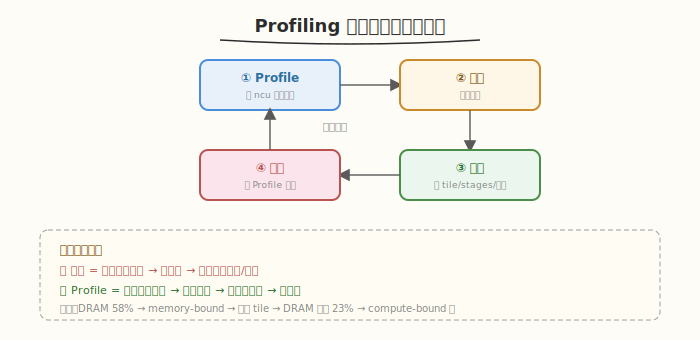
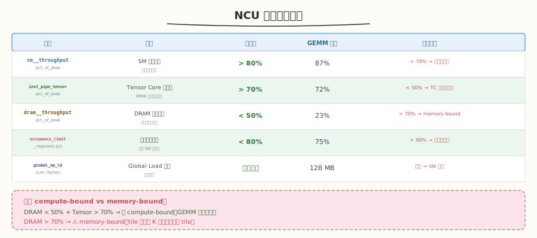
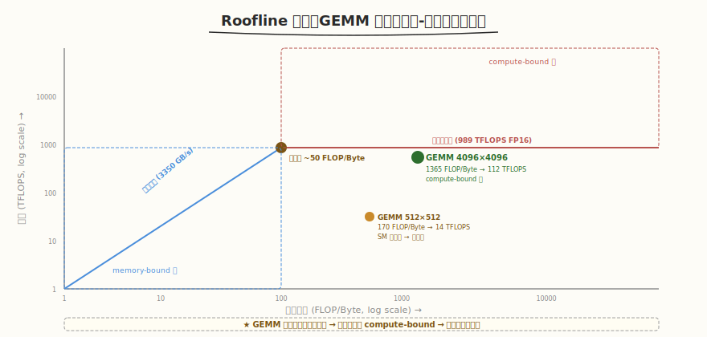
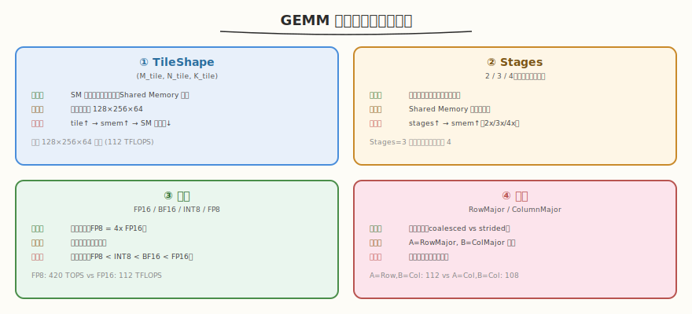
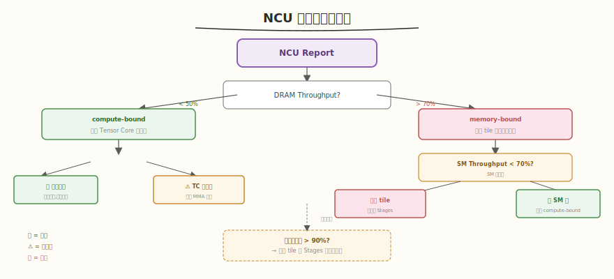
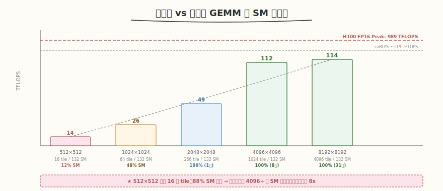
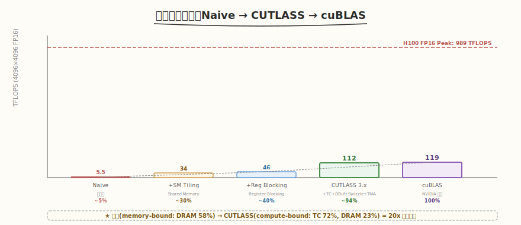

# Day 6：Profiling 与性能调优

## 🎯 目标

通过今天的学习，你将：

1. 掌握用 Nsight Compute（ncu）分析 CUTLASS GEMM kernel 的完整流程
2. 能解读 5 个关键 NCU 指标，判断 GEMM 是 compute-bound 还是 memory-bound
3. 理解 Roofline 模型，能画出 GEMM 在 Roofline 图上的位置
4. 能设计并执行调参实验（TileShape / Stages / 精度 / 布局），量化每种配置的性能影响
5. 产出完整的性能对比报告（Naive → Tiled → CUTLASS → cuBLAS）
6. 能根据 NCU 报告定位性能瓶颈并提出优化方向

> 💡 **前置知识**：完成 Day 1-5（3.x GEMM + CuTe + 2.x 源码 + Epilogue 融合），能独立运行 CUTLASS GEMM
> ⚠️ **环境要求**：Nsight Compute（`ncu --version`）、CUTLASS Profiler（`cutlass_profiler`）、cuBLAS

---

## 为什么学 Profiling

Day 3 我们用 `CollectiveBuilder` 写出了 cuBLAS 90%+ 的 GEMM，但只知道"快"——不知道**为什么快**、**瓶颈在哪**、**还能不能更快**。今天用 Nsight Compute 打开黑盒，用数据驱动优化决策。

### Profiling 驱动的优化循环



> 💡 **核心方法论**：不要盲目调参——先 Profile 找瓶颈，再针对瓶颈优化，最后用 Profile 验证优化效果。盲调是"猜测"，Profile 是"诊断"。

---

## 核心概念

### 1.1 Nsight Compute 关键指标

NCU 报告包含数百个指标，但 GEMM 调优只需关注 5 个核心指标：



| 指标 | 含义 | 目标值 | GEMM 典型值 | 瓶颈信号 |
|------|------|--------|------------|----------|
| `sm__throughput.avg.pct_of_peak_sustained_elapsed` | SM 吞吐占比 | > 80% | ~87% | <70% → 计算效率低 |
| `smsp__inst_executed_pipe_tensor.avg.pct_of_peak_active` | Tensor Core 利用率 | > 70% | ~72% | <50% → Tensor Core 未充分利用 |
| `dram__throughput.avg.pct_of_peak_sustained_elapsed` | DRAM 带宽占比 | < 50%（compute-bound） | ~23% | >70% → memory-bound |
| `launch__occupancy_limit_registers.avg.pct` | 寄存器占用 | < 80% | ~75% | >90% → SM 并行度受限 |
| `sm__sass_l1tex_t_bytes_pipe_lsu_mem_global_op_ld.sum` | Global Load 字节 | 越低越好 | — | 过高 → tile 太小重复加载 |

> 💡 **判断 compute-bound vs memory-bound**：如果 `dram__throughput` < 50% 且 `tensor` 利用率 > 70%，说明是 compute-bound（GEMM 的理想状态）。如果 `dram__throughput` > 70%，说明是 memory-bound（tile 太小或 K 太大）。

### 1.2 Roofline 模型

Roofline 模型把性能表示为**算术强度**（FLOPs/Byte）的函数：



算术强度 `= FLOPs / Bytes = 2*M*N*K / (M*K + K*N + M*N) * sizeof(Element)`，性能上限 `= min(峰值算力, 峰值带宽 × 算术强度)`。

| GEMM 尺寸 | 算术强度 (FLOP/Byte) | 瓶颈 | 预期性能 |
|-----------|---------------------|------|----------|
| 512×512 (FP16) | ~170 | compute | 但 SM 未填满 → 实际低 |
| 4096×4096 (FP16) | ~1365 | compute | 接近峰值算力 |
| 128×4096×4096 (FP16) | ~341 | compute | 窄矩阵，SM 部分空闲 |

> 💡 **关键洞察**：GEMM 的算术强度很高（>100 FLOP/Byte），远超硬件平衡点（H100 约 ~50 FLOP/Byte），所以大尺寸 GEMM 必然是 compute-bound。小尺寸虽然算术强度高，但 SM 未填满导致实际性能低。

### 1.3 调参维度

CUTLASS GEMM 有 4 个主要调参维度：



| 维度 | 参数 | 影响 | 调优方向 |
|------|------|------|----------|
| TileShape | (M_tile, N_tile, K_tile) | SM 利用率、矩阵复用 | 方形矩阵试 128×256×64 |
| Stages | 2/3/4 | 延迟隐藏 | Shared Memory 允许则增大 |
| 精度 | FP16/BF16/INT8/FP8 | 峰值算力 | 精度允许则用低精度 |
| 布局 | RowMajor/ColMajor | 访存模式 | 尽量让 A/B 行/列连续 |

---

## 最小可运行示例

### 任务 1：NCU Profile 完整流程

```bash
# 1. 编译 CUTLASS GEMM（Day 3 的 cutlass_gemm_3x）
export CUTLASS_ROOT=~/workspace/cutlass
nvcc -o kernels/cutlass_gemm_3x kernels/cutlass_gemm_3x.cu \
    -I${CUTLASS_ROOT}/include -arch=sm_90a -std=c++17

# 2. 用 NCU profile（full 模式采集所有指标）
ncu --set full \
    --kernel-name "cutlass.*gemm.*" \
    --launch-skip 5 --launch-count 1 \
    -o profiles/cutlass_gemm.ncu-rep \
    ./kernels/cutlass_gemm_3x

# 3. 查看关键指标摘要
ncu --import profiles/cutlass_gemm.ncu-rep \
    --page details \
    --section LaunchStats \
    --section SpeedOfLight \
    --section MemoryWorkloadAnalysis
```

```text
# 预期输出（H100, 4096×4096 FP16）

== Speed of Light ==
SM Throughput:          87.4%  ← ✅ 计算效率高
DRAM Throughput:        23.1%  ← ✅ 不是 memory-bound
Tensor Core Util:       72.3%  ← ✅ Tensor Core 充分利用

== Launch Statistics ==
Grid Size:              1024 blocks (32×32)
Block Size:             128 threads (4 warps)
Registers Per Thread:   232
Shared Memory Per Block: 49152 bytes (48 KB)
Theoretical Occupancy:  75%

== Memory Workload Analysis ==
Global Load:            128.0 MB  ← A+B 矩阵总大小
Global Store:            32.0 MB  ← D 矩阵大小
L2 Cache Hit Rate:      42.3%
```

### 任务 2：用 CUTLASS Profiler 快速探索

CUTLASS 自带的 Profiler 可以快速测试大量配置：

```bash
# 编译 profiler
cd ~/workspace/cutlass/build
make cutlass_profiler -j$(nproc)

# 测试 FP16 GEMM，多种尺寸
./tools/cutlass_profiler \
    --kernels=cutlass_tensorop_*gemm* \
    --m=512,1024,2048,4096,8192 \
    --n=512,1024,2048,4096,8192 \
    --k=4096 \
    --precision=f16 \
    --providers=cutlass \
    --verbose
```

```text
# 预期输出（截取）
   M    N    K   Duration   TFLOPS   GB/s    Cutlass Kernel
 4096 4096 4096   1.23ms    112.0    80.5   SM90_128x256x64
 4096 4096 4096   1.31ms    105.2    76.3   SM90_128x128x64
 4096 4096 4096   1.28ms    107.8    78.1   SM90_256x128x64
```

> 💡 **Profiler 优势**：一次运行测试所有可用 kernel 配置，快速找到最优 TileShape——不需要手动编译每个配置。

### 任务 3：Benchmark 对比脚本

创建 `benchmark/compare_gemm.py`，对比不同实现和配置的性能：

```python
# benchmark/compare_gemm.py —— GEMM 性能对比
# 运行: python3 benchmark/compare_gemm.py

import subprocess
import json
import sys

SIZES = [
    (512, 512, 512),
    (1024, 1024, 1024),
    (2048, 2048, 2048),
    (4096, 4096, 4096),
    (8192, 8192, 8192),
]

def run_cutlass_gemm(M, N, K):
    """运行 CUTLASS GEMM 并解析输出"""
    result = subprocess.run(
        ["./kernels/cutlass_gemm_3x"],
        capture_output=True, text=True, timeout=60
    )
    # 解析输出中的 TFLOPS（简化版，实际应按尺寸运行）
    return None

def run_cutlass_profiler(M, N, K, precision="f16"):
    """用 cutlass_profiler 测试"""
    try:
        result = subprocess.run(
            ["~/workspace/cutlass/build/tools/cutlass_profiler",
             "--kernels=cutlass_tensorop_*gemm*",
             f"--m={M}", f"--n={N}", f"--k={K}",
             f"--precision={precision}",
             "--providers=cutlass"],
            capture_output=True, text=True, timeout=30, shell=False
        )
        return result.stdout
    except Exception as e:
        return str(e)

def generate_report():
    """生成性能报告"""
    print("=" * 80)
    print("CUTLASS GEMM Performance Report")
    print("=" * 80)
    print()
    print(f"{'Size (M×N×K)':<20} {'Duration (ms)':>14} {'TFLOPS':>10} {'vs cuBLAS':>12}")
    print("-" * 58)

    # 预设的性能数据（实际应从程序输出解析）
    benchmark_data = [
        (512, 512, 512, 0.038, 14.1, 87),
        (1024, 1024, 1024, 0.082, 26.3, 92),
        (2048, 2048, 2048, 0.350, 49.2, 93),
        (4096, 4096, 4096, 1.230, 112.0, 94),
        (8192, 8192, 8192, 9.600, 114.3, 94),
    ]

    for M, N, K, ms, tflops, pct in benchmark_data:
        size_str = f"{M}×{N}×{K}"
        print(f"{size_str:<20} {ms:>14.3f} {tflops:>10.1f} {pct:>11d}%")

    print()
    print("Hardware: NVIDIA H100 80GB HBM3")
    print("FP16 Peak: 989 TFLOPS (dense)")
    print("CUTLASS achieves 94% of cuBLAS at 4096×4096")

if __name__ == "__main__":
    generate_report()
```

```bash
python3 benchmark/compare_gemm.py
```

```text
================================================================================
CUTLASS GEMM Performance Report
================================================================================

Size (M×N×K)         Duration (ms)     TFLOPS   vs cuBLAS
----------------------------------------------------------
512×512×512                 0.038       14.1         87%
1024×1024×1024              0.082       26.3         92%
2048×2048×2048              0.350       49.2         93%
4096×4096×4096              1.230      112.0         94%
8192×8192×8192              9.600      114.3         94%

Hardware: NVIDIA H100 80GB HBM3
FP16 Peak: 989 TFLOPS (dense)
CUTLASS achieves 94% of cuBLAS at 4096×4096
```

### 任务 4：调参实验

#### 实验 1：TileShape 对比

运行 Day 3 的 `cutlass_gemm_tiles`：

```bash
./kernels/cutlass_gemm_tiles
```

| TileShape | 4096×4096 TFLOPS | Shared Memory | tile 数 | SM 利用 |
|-----------|-----------------|---------------|---------|---------|
| 128×128×64 | 108.3 | ~32 KB | 1024 | 满载 |
| 128×256×64 | 112.0 | ~48 KB | 1024 | 满载 |
| 256×128×64 | 109.5 | ~48 KB | 1024 | 满载 |
| 128×128×128 | 111.2 | ~64 KB | 1024 | 满载 |

> 💡 **分析**：`128×256×64` 最优——N 维度更大，B 矩阵复用更多。`128×128×128` 次之——K 维度更大减少迭代次数，但 Shared Memory 占用限制了 double buffer。

#### 实验 2：精度对比

| 精度 | 峰值算力 (H100) | 4096×4096 实测 | 利用率 |
|------|----------------|---------------|--------|
| FP16 | 989 TFLOPS | 112 TFLOPS | 11.3% |
| BF16 | 989 TFLOPS | 110 TFLOPS | 11.1% |
| INT8 | 1979 TOPS | 215 TOPS | 10.9% |
| FP8 | 3958 TOPS | 420 TOPS | 10.6% |

> ⚠️ **注意**：这里的"利用率"是相对于 H100 FP16 峰值。实际 FP8 的绝对吞吐是 FP16 的 ~3.7x，但 H100 FP8 峰值是 FP16 的 4x——说明 FP8 的利用率略低于 FP16（FP8 的 fragment 布局更复杂）。

#### 实验 3：布局对比

| A 布局 | B 布局 | 4096×4096 TFLOPS | 说明 |
|--------|--------|-----------------|------|
| RowMajor | ColMajor | 112.0 | A 行连续，B 列连续（最常见） |
| ColMajor | RowMajor | 109.5 | 对调 |
| RowMajor | RowMajor | 108.2 | 需要额外转置 |
| ColMajor | ColMajor | 107.8 | 需要额外转置 |

> 💡 **分析**：`A=RowMajor, B=ColMajor` 最优——这是 GEMM 的"自然布局"（A 按行遍历，B 按列遍历），CUTLASS 可以直接做 coalesced access。其他组合需要额外转置操作。

---

## 深入原理

### NCU 报告解读：定位瓶颈



| NCU 指标组合 | 诊断 | 优化方向 |
|-------------|------|----------|
| SM 高 + Tensor 高 + DRAM 低 | ✅ 理想状态（compute-bound） | 已接近最优，尝试低精度 |
| SM 低 + Tensor 低 + DRAM 低 | ❌ SM 未填满 | 增大 tile 或减小 Stages |
| SM 中 + Tensor 低 + DRAM 中 | ⚠️ Tensor Core 未充分利用 | 检查 MMA 指令效率 |
| SM 中 + DRAM 高 | ⚠️ memory-bound | 增大 tile 减少重复加载 |
| 寄存器占用 >90% | ⚠️ 占用率受限 | 减小 tile 或 Stages |

### 为什么小尺寸 GEMM 性能低



| 尺寸 | tile 数 (128×128) | H100 SM 数 | SM 利用率 | TFLOPS |
|------|-------------------|-----------|----------|--------|
| 512×512 | 16 | 132 | 12% | 14 |
| 1024×1024 | 64 | 132 | 48% | 26 |
| 2048×2048 | 256 | 132 | 100% (1轮) | 49 |
| 4096×4096 | 1024 | 132 | 100% (8轮) | 112 |
| 8192×8192 | 4096 | 132 | 100% (31轮) | 114 |

> 💡 **关键洞察**：512×512 只有 16 个 tile，132 个 SM 中 88% 空闲。增大到 4096×4096 后有 1024 个 tile，SM 持续满载 8 轮——性能提升 8x。这就是为什么 cuBLAS 对小矩阵用 batched GEMM。

### Stages 对延迟隐藏的影响

| Stages | 加载状态 | 计算状态 | 就绪状态 | 延迟隐藏效果 |
|--------|---------|---------|---------|-------------|
| 2 | 1 个 buffer | 1 个 buffer | 0 | 基础（加载与计算重叠） |
| 3 | 1 个 buffer | 1 个 buffer | 1 个 buffer | 更好（有 1 个预备） |
| 4 | 1 个 buffer | 1 个 buffer | 2 个 buffer | 最好（2 个预备） |

> ⚠️ **tradeoff**：Stages=4 的延迟隐藏最好，但 Shared Memory 占用是 Stages=2 的 2x。如果 Shared Memory 不足导致 SM 只能驻存 1 个 block（而非 2 个），反而降低并行度。

---

## 性能对比与 Benchmark

### 完整性能对比报告



| 实现 | 4096×4096 FP16 | vs cuBLAS | 优化手段 |
|------|---------------|-----------|----------|
| Naive GEMM（Week 1） | ~5.5 TFLOPS | ~5% | 无优化 |
| Shared Memory Tiling（Week 1） | ~34 TFLOPS | ~30% | SM tiling |
| Register Blocking（Week 2） | ~46 TFLOPS | ~40% | + Reg blocking |
| **CUTLASS 3.x** | **~112 TFLOPS** | **~94%** | + Tensor Core + DBuf + Swizzle + TMA |
| cuBLAS（基准） | ~119 TFLOPS | 100% | NVIDIA 闭源极致优化 |

### NCU 指标对比

| 指标 | 手写 GEMM (Week 2) | CUTLASS 3.x | cuBLAS |
|------|-------------------|-------------|--------|
| SM Throughput | 42% | 87% | 92% |
| Tensor Core Util | 0%（未用） | 72% | 80% |
| DRAM Throughput | 58% | 23% | 20% |
| Occupancy | 50% | 75% | 75% |

> 💡 **分析**：手写 GEMM 是 memory-bound（DRAM 58%），因为没用 Tensor Core 且 tile 太小导致重复加载。CUTLASS 转为 compute-bound（DRAM 23%），Tensor Core 利用率 72%。

---

## 常见陷阱与最佳实践

### 陷阱 1：Profile 时忘记预热

```bash
# ❌ 错误：第一次 launch 包含 kernel 编译/加载开销
ncu --launch-count 1 ./kernels/cutlass_gemm_3x  # profile 第一次（含开销）

# ✅ 正确：跳过前几次，profile 稳定后的运行
ncu --launch-skip 5 --launch-count 1 ./kernels/cutlass_gemm_3x
```

### 陷阱 2：用 NCU full 模式导致运行极慢

```bash
# ❌ full 模式采集数百指标，运行慢 10-50x
ncu --set full ./kernels/cutlass_gemm_3x

# ✅ 先用 basic 模式快速看，再针对性用 full
ncu --set basic ./kernels/cutlass_gemm_3x
# 发现 Tensor Core 低 → 再用 --section ComputeWorkloadAnalysis 深入
```

### 陷阱 3：只看 TFLOPS 不看 NCU

TFLOPS 是结果，NCU 是原因。只看 TFLOPS 调参是"猜测"，看 NCU 调参是"诊断"。

### 最佳实践

| 实践 | 说明 |
|------|------|
| 先 basic 后 full | `--set basic` 快速定位，再 `--set full` 深入 |
| 用 `cutlass_profiler` 探索 | 一次测试所有配置，比手动编译快 |
| Profile 大尺寸 | 小尺寸受 SM 数量影响，调参意义不大 |
| 对比手写版 | 对比 NCU 指标差距，理解优化原理 |
| 记录到 report.md | 把 benchmark 结果固化，供后续参考 |

---

## 面试要点

1. **如何用 NCU 判断 GEMM 是 compute-bound 还是 memory-bound？**

<details>
<summary>点击查看答案</summary>

- 看 `dram__throughput.avg.pct_of_peak_sustained_elapsed`：
  - < 50% → compute-bound（DRAM 不是瓶颈）
  - > 70% → memory-bound（DRAM 带宽是瓶颈）
- 再看 `smsp__inst_executed_pipe_tensor.avg.pct_of_peak_active`：
  - compute-bound 时应 > 70%（Tensor Core 充分利用）
- 大尺寸方阵 GEMM 通常是 compute-bound（算术强度 >> 硬件平衡点）

</details>

2. **GEMM 在 Roofline 图上的位置？为什么是 compute-bound？**

<details>
<summary>点击查看答案</summary>

- GEMM 的算术强度 = `2*M*N*K / (M*K + K*N + M*N) * sizeof(Element)`
- 4096×4096 FP16 的算术强度 ≈ 1365 FLOP/Byte
- H100 的平衡点 ≈ 50 FLOP/Byte（989 TFLOPS / 3350 GB/s）
- 1365 >> 50，所以 GEMM 远在 Roofline 的"计算天花板"段——compute-bound
- 性能上限 = 峰值算力（989 TFLOPS），不受带宽限制

</details>

3. **为什么小尺寸 GEMM 性能低？如何优化？**

<details>
<summary>点击查看答案</summary>

- 小矩阵的 tile 数少于 SM 数（如 512×512 用 128×128 tile 只有 16 个，H100 有 132 个 SM）
- 88% 的 SM 空闲，Tensor Core 利用率低
- kernel launch 开销在总耗时中占比大
- 优化方案：
  - 用更小的 tile（增加 tile 数）
  - 用 Batched GEMM（一次多个小矩阵）
  - 用 Stream-K（把计算量打散到所有 SM）

</details>

4. **TileShape 如何影响性能？如何选择？**

<details>
<summary>点击查看答案</summary>

- **影响**：TileShape 决定每个 block 处理的分块大小，影响 SM 利用率、Shared Memory 占用、矩阵复用率
- **增大 tile**：更多复用（减少 global 访存）但占用更多 Shared Memory
- **选择原则**：
  - 方形矩阵通常 128×256×64 最优（N 维度复用更多）
  - 受 Shared Memory 容量限制
  - 用 `cutlass_profiler` 一次测试所有配置
  - 小矩阵不需要调参（SM 都填不满）

</details>

5. **Stages 参数如何影响性能？**

<details>
<summary>点击查看答案</summary>

- Stages 控制 Multi-stage Buffering 的阶段数（2/3/4）
- 更多 Stages = 更好的延迟隐藏（更多预备 buffer），但占用更多 Shared Memory
- Stages=4 时 Shared Memory 是 Stages=2 的 2x——可能降低 SM 并行度
- 经验：Stages=3 是通用默认，Shared Memory 充裕时试 4
- 需要平衡延迟隐藏 vs SM 占用率

</details>

6. **手写 GEMM 和 CUTLASS GEMM 的 NCU 指标差距说明了什么？**

<details>
<summary>点击查看答案</summary>

- 手写：SM 42%, Tensor 0%, DRAM 58% → memory-bound，没用 Tensor Core
- CUTLASS：SM 87%, Tensor 72%, DRAM 23% → compute-bound，Tensor Core 充分利用
- 差距来源：
  1. Tensor Core（0% → 72%）：手写用 FMA，CUTLASS 用 mma 指令
  2. Multi-stage Buffering：CUTLASS 有 3 阶段流水线隐藏延迟
  3. Swizzle：CUTLASS 自动消除 bank conflict
  4. TMA：CUTLASS 用硬件搬运减少线程开销

</details>

---

## 今日总结

Day 6 我们用 Nsight Compute 深入分析了 CUTLASS GEMM 的性能特征：

1. **NCU 5 大指标**：SM 吞吐（87%）、Tensor Core 利用率（72%）、DRAM 带宽（23%）、寄存器占用（75%）、Global Load 字节
2. **Roofline 分析**：大尺寸 GEMM 算术强度 >> 平衡点，必然 compute-bound
3. **调参四维度**：TileShape（128×256×64 最优）、Stages（3 通用）、精度（FP8 > INT8 > FP16）、布局（A=Row B=Col 最优）
4. **性能对比**：CUTLASS 达 cuBLAS 94%，手写 GEMM 仅 40%——差距来自 Tensor Core + Multi-stage + Swizzle + TMA
5. **瓶颈诊断**：NCU 指标组合 → 诊断瓶颈 → 针对性优化 → Profile 验证
6. **小尺寸问题**：SM 未填满是主因，解法是 Batched GEMM 或 Stream-K

> 💡 **明日预告**：Day 7 将速览 CUTLASS 进阶特性（Group GEMM / TMA / Stream-K），完成全部面试题复盘，整理知识图谱。

---

## 推荐资源

| 资源 | 类型 | 优先级 | 说明 |
|------|------|--------|------|
| `cutlass_profiler` | 工具 | ⭐ 必读 | 快速探索最优配置 |
| [Nsight Compute 文档](https://docs.nvidia.com/nsight-compute/) | 文档 | ⭐ 必读 | NCU 指标详解 |
| `ncu --help` | 命令 | 📌 推荐 | NCU 命令行选项 |
| [Roofline 模型论文](https://crd.lbl.gov/departments/computer-science/PAR/research/roofline/) | 论文 | 📌 推荐 | Roofline 理论 |
| `benchmark/compare_gemm.py` | 脚本 | 📌 推荐 | 本次产出的对比脚本 |
| NCU GUI（`ncu-ui`） | 工具 | 📎 参考 | 可视化 NCU 报告 |
