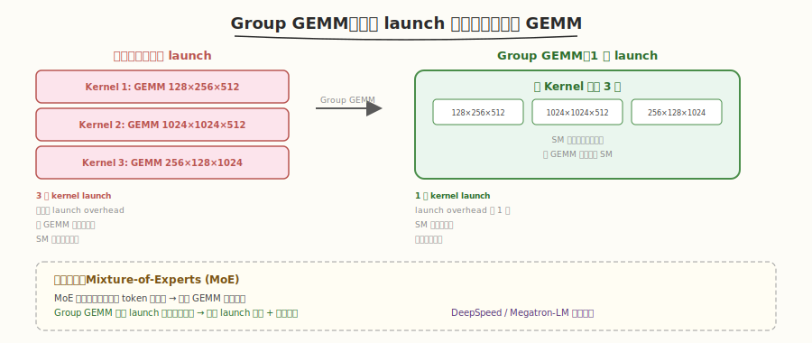
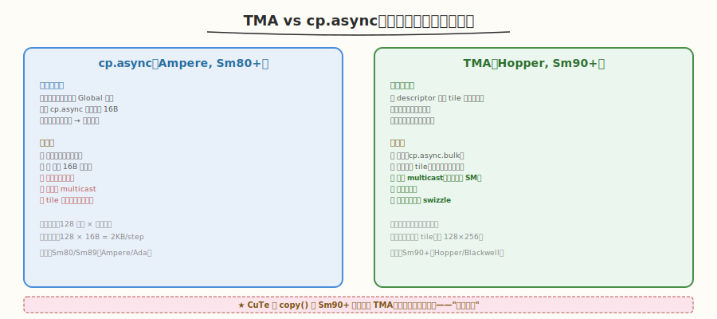
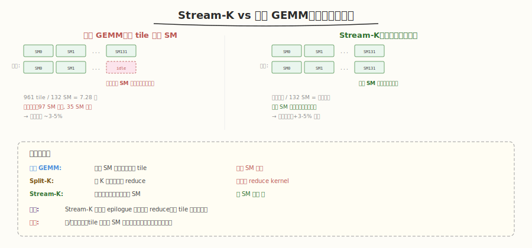
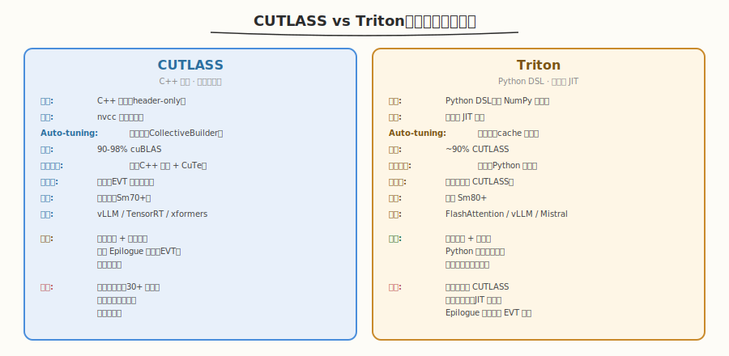
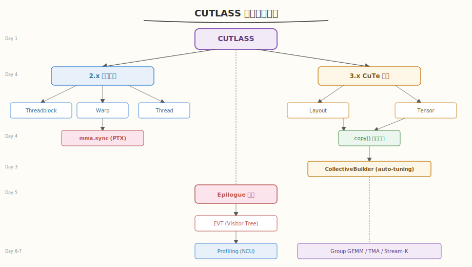

# Day 7：进阶专题与总结

## 🎯 目标

通过今天的学习，你将：

1. 了解 CUTLASS 的三大进阶特性：Group GEMM、TMA、Stream-K
2. 理解 Group GEMM 如何解决 MoE 场景的不等大批量矩阵乘法
3. 理解 TMA（Tensor Memory Accelerator）相比 cp.async 的硬件级优势
4. 理解 Stream-K 如何消除小尺寸 GEMM 的 SM 空闲问题
5. 能对比 CUTLASS 与 Triton 的定位差异，知道各自适用场景
6. 完成全部 10 道面试题复盘，形成完整的 CUTLASS 知识图谱

> 💡 **前置知识**：完成 Day 1-6（环境 + CuTe + 3.x GEMM + 2.x 源码 + Epilogue 融合 + Profiling）
> ⚠️ **环境要求**：无（今天是概念理解 + 总结，无需编译运行）

---

## 为什么学进阶专题

Day 1-6 覆盖了 CUTLASS 的核心知识——从 CuTe 到 GEMM 组装到 Epilogue 融合到 Profiling。但实际工程中还会遇到三个场景：不等大批量 GEMM（MoE）、Hopper 级硬件优化（TMA）、小矩阵负载均衡（Stream-K）。今天速览这三个方向，为后续深入打下认知基础。

> 💡 **定位**：今天的内容是"知道有什么、解决什么问题"，不需要深入源码。后续如果工作中遇到，再按需深入。

---

## 核心概念

### 1.1 Group GEMM

#### 解决什么问题

在 Mixture-of-Experts（MoE）模型中，每个专家处理的 token 数量不同，导致多个 GEMM 的尺寸各不相同。传统做法是为每个 GEMM 单独 launch kernel，但 kernel launch 开销在小 GEMM 上占比很大。



#### 传统方案 vs Group GEMM

| 方案 | Kernel Launch | 开销 | 适用场景 |
|------|--------------|------|----------|
| 逐个 launch | N 次 | 每次含 launch overhead | N 小或矩阵大 |
| Batched GEMM | 1 次 | 要求所有矩阵同尺寸 | 标准批量场景 |
| **Group GEMM** | **1 次** | **支持不同尺寸** | **MoE / 不等大批量** |

#### API 用法

```cpp
// Group GEMM：一次 launch 计算多个不同尺寸的 GEMM
using GroupGemm = cutlass::gemm::device::GemmGroup<
    /* 同 Gemm 但支持变长 problem size */
>;

// host 端传入 problem_size 数组
std::vector<cutlass::gemm::GemmCoord> problem_sizes = {
    {128, 256, 512},    // 专家 0: 小 GEMM
    {1024, 1024, 512},  // 专家 1: 大 GEMM
    {256, 128, 1024},   // 专家 2: 中等 GEMM
};

// 传入各组的指针和 stride
std::vector<cutlass::half_t*> ptr_A = {d_A0, d_A1, d_A2};
std::vector<cutlass::half_t*> ptr_B = {d_B0, d_B1, d_B2};
std::vector<cutlass::half_t*> ptr_D = {d_D0, d_D1, d_D2};

typename GroupGemm::Arguments args{
    problem_sizes.size(),   // group 数量
    problem_sizes,          // 各组尺寸
    ptr_A, lda,            // A 指针和 stride
    ptr_B, ldb,            // B 指针和 stride
    ptr_D, ldd,            // D 指针和 stride
    {1.0f, 0.0f}           // alpha, beta
};
```

> 💡 **应用场景**：DeepSpeed 的 MoE 实现、Megatron-LM 的 Expert FFN 都在用 Group GEMM 优化多专家计算。

### 1.2 TMA（Tensor Memory Accelerator）

#### 解决什么问题

在 Ampere 及之前，Global → Shared Memory 的数据搬运用 `cp.async`——需要线程参与地址计算，消耗线程资源。Hopper 引入 TMA 硬件单元，让数据搬运完全由硬件完成。



| 特性 | cp.async（Ampere） | TMA（Hopper） |
|------|-------------------|---------------|
| 地址计算 | 线程软件计算 | 硬件自动 |
| 线程开销 | 占用线程 | 零线程开销 |
| 最大搬运 | 16B/线程 | 任意大小 tile |
| Multicast | 不支持 | 支持（一次广播多 SM） |
| 异步 | 支持 | 支持（cp.async.bulk） |
| CuTe 支持 | 自动 | 自动（Sm90+） |

#### CuTe 中的 TMA

CuTe 在检测到 Sm90+ 时自动使用 TMA，用户代码不需要改：

```cpp
// CuTe 自动用 TMA（当 ArchTag >= Sm90 时）
auto gA = make_tensor(make_gmem_ptr(A_ptr), gmem_layout);
auto sA = make_tensor(make_smem_ptr(smem_ptr), smem_layout);

copy(gA, sA);
// Sm80: 底层用 cp.async
// Sm90: 底层用 TMA（自动选择，用户无感）
```

> 💡 **关键**：TMA 的优势在于"硬件做地址计算"——传统 cp.async 需要每个线程计算自己负责的 Global Memory 地址，而 TMA 用一个 descriptor 描述整个 tile 的形状和位置，硬件自动完成所有地址计算和搬运。这让线程可以专注于 MMA 计算。

#### TMA Descriptor

```cpp
// TMA 使用 descriptor 描述数据搬运的源和目标
auto tma_descriptor = cutlass::cute::make_tma_copy(
    SM90_TMA_LOAD{},           // TMA 加载指令
    gmem_tensor,               // 源 Tensor（Global）
    smem_layout                // 目标 Layout（Shared）
);
// descriptor 包含：基址、形状、步长、swizzle 模式
// 硬件根据 descriptor 自动完成搬运
```

### 1.3 Stream-K

#### 解决什么问题

Day 6 我们看到小尺寸 GEMM 性能低——tile 数少于 SM 数，部分 SM 空闲。Stream-K 通过重新分配计算量来消除这个长尾效应。



#### 传统 GEMM 的问题

传统 GEMM 按 M×N 维度切 tile，每个 tile 由一个 SM 处理。当 tile 数不能被 SM 数整除时，最后一轮部分 SM 空闲。

| 尺寸 | tile 数 (128×128) | SM 数 | 最后一轮空闲 |
|------|-------------------|-------|-------------|
| 4000×4000 | 961 | 132 | 132-97=35 SM 空闲 |
| 4096×4096 | 1024 | 132 | 132-128=4 SM 空闲 |

#### Stream-K 的解决方案

Stream-K 不按 tile 分配，而是把**所有计算量均匀打散**到所有 SM：

| 方案 | 分配方式 | 优势 | 代价 |
|------|----------|------|------|
| 传统 GEMM | 每个 SM 处理若干完整 tile | 简单 | 尾部 SM 空闲 |
| Split-K | 按 K 切分，最后 reduce | 减少尾部空闲 | 额外 reduce kernel |
| **Stream-K** | **计算量均匀打散到所有 SM** | **零 SM 空闲** | **局部 reduce（在 epilogue 中完成）** |

> 💡 **核心思想**：Stream-K 把 GEMM 看作一个"计算量池"——总计算量 = M×N×K×2 FLOPs。把这个池子均匀分给所有 SM，每个 SM 做一段连续的"tile 序列"，跨 tile 边界时做局部 reduce。这样所有 SM 都满载到最后一刻。

#### API 用法

```cpp
// CUTLASS 3.x 中通过 dispatch policy 启用 Stream-K
using KernelSchedule = cutlass::gemm::KernelTmaWarpSpecializedStreamK;
//                              ^^^^^^^^^^^^^^^^^^^^^^^^^^^^^^^^^^^^

using CollectiveMainloop = typename gemm::collective::CollectiveBuilder<
    arch::Sm90, arch::OpClassTensorOp,
    layout::RowMajor, layout::ColumnMajor,
    half_t, half_t, float,
    layout::RowMajor,
    Shape<_128, _256, _64>,
    KernelSchedule                    // ← 指定 Stream-K 调度
>::Type;
```

### 1.4 CUTLASS vs Triton

CUTLASS 不是唯一的高性能 GPU 编程方案。Triton（OpenAI 开源的 Python DSL）是另一个主流选择：



| 维度 | CUTLASS | Triton |
|------|---------|--------|
| 语言 | C++ 模板 | Python DSL |
| 编译 | nvcc 编译期展开 | 运行时 JIT 编译 |
| Auto-tuning | 编译期（CollectiveBuilder） | 运行时（cache 搜索） |
| 性能 | 90-98% cuBLAS | ~90% CUTLASS |
| 学习曲线 | 陡（C++ 模板 + CuTe） | 平缓（Python 语法） |
| 灵活性 | 极高（任意 Epilogue 融合） | 高（但不如 CUTLASS） |
| 硬件支持 | 全架构（Sm70+） | 主要 Sm80+ |
| 生态 | vLLM/TensorRT/xformers | FlashAttention/vLLM/Mistral |
| 适用人群 | 库开发者 / 性能极客 | 算法工程师 / 研究员 |

> 💡 **选择建议**：
> - 需要极致性能 + 完全控制 → CUTLASS
> - 需要快速实现 + 易维护 → Triton
> - 需要 Epilogue 复杂融合 → CUTLASS（EVT 更灵活）
> - 需要 Python 生态集成 → Triton（原生 Python）

---

## 深入原理

### 本周知识图谱



### 一周学习回顾

| Day | 主题 | 核心概念 | 关键产出 |
|-----|------|----------|----------|
| 1 | 环境搭建 | CUTLASS 定位、2.x vs 3.x、编译运行 | `verify_env.cu` + `first_gemm.cu` |
| 2 | CuTe 模型 | Layout (Shape+Stride)、Tensor、copy()、Swizzle | `cute_basics.cu` + `cute_copy.cu` |
| 3 | 3.x GEMM | CollectiveBuilder、TileShape、Arguments | `cutlass_gemm_3x.cu` + `cutlass_gemm_tiles.cu` |
| 4 | 2.x 源码 | 三层抽象、MmaMultistage、MmaTensorOp、MMA 指令 | 源码精读笔记 |
| 5 | Epilogue 融合 | EVT、LinearCombinationBiasRelu、融合 vs 未融合 | `cutlass_gemm_bias_relu.cu` |
| 6 | Profiling | NCU 指标、Roofline、调参四维度、瓶颈诊断 | `compare_gemm.py` + `report.md` |
| 7 | 进阶 + 总结 | Group GEMM、TMA、Stream-K、vs Triton | 知识图谱 + 面试复盘 |

---

## 面试要点

### 完整面试题复盘（10 题）

1. **CUTLASS 是什么？它和 cuBLAS 的定位有什么区别？**

<details>
<summary>点击查看答案</summary>

- CUTLASS 是 NVIDIA 开源的 C++ 模板库，用于高性能线性代数计算
- 与 cuBLAS 的核心区别：
  - cuBLAS 是闭源二进制库，接口固定，性能最优但无法定制
  - CUTLASS 是 header-only 模板库，源码开放，可在保持 90%+ cuBLAS 性能的同时自由定制
  - cuBLAS 不支持 Epilogue 融合，CUTLASS 支持
- 适用场景：cuBLAS 适合标准 GEMM 直接调用，CUTLASS 适合需要定制计算逻辑的高性能 GEMM

</details>

2. **CUTLASS 2.x 和 3.x 的核心区别是什么？**

<details>
<summary>点击查看答案</summary>

- **2.x**：三层抽象（Threadblock → Warp → Thread），手动指定每层 Shape，手写索引
- **3.x**：引入 CuTe（Layout/Tensor 抽象），CollectiveBuilder 自动选 kernel，`copy()` 自动优化数据搬运
- **API 差异**：2.x 显式配置大量模板参数；3.x Builder 只需指定架构/类型/布局
- **代码存量**：vLLM、TensorRT 等仍用 2.x；3.x 是新项目首选

</details>

3. **CUTLASS 的三层抽象是什么？为什么这样设计？**

<details>
<summary>点击查看答案</summary>

- **Threadblock 级**（SM）：Global → Shared Memory，Multi-stage buffering 隐藏延迟
- **Warp 级**（Warp）：Shared → Register，ldmatrix 加载，执行 MMA
- **Thread 级**（Thread）：执行 `mma.sync` PTX 指令，Register 级累加
- **设计动机**：匹配 GPU 硬件层级（SM → Warp → Thread），每层只关注自己的数据搬运和计算

</details>

4. **CuTe 的 Layout 是什么？Shape 和 Stride 的关系？**

<details>
<summary>点击查看答案</summary>

- Layout 是 `Coord → offset` 的纯函数：`offset = Σ coord[i] × stride[i]`
- **Shape**：每维元素个数（"有多少"）
- **Stride**：沿该维走一步的偏移量（"怎么跳"）
- 两者解耦：同一 Shape + 不同 Stride = 不同布局（RowMajor vs ColMajor）
- 支持嵌套，天然适配 GEMM 的多级 tile 分块

</details>

5. **CollectiveBuilder 的 auto-tuning 机制是什么？**

<details>
<summary>点击查看答案</summary>

- 用户指定架构/数据类型/布局，Builder 在编译期遍历 TileShape × Stages × Swizzle × MMA 指令的组合
- 选出最优配置，编译器完全内联，零运行时开销
- 对比 Triton 的运行时 auto-tuning：CUTLASS 编译慢但运行快且可预测

</details>

6. **Epilogue 融合为什么快？**

<details>
<summary>点击查看答案</summary>

- 后处理在 Register 中完成（Bias ~1 cycle, ReLU ~1 cycle），几乎免费
- 减少中间结果落盘 Global Memory（从 3 次读写降到 1 次）
- 减少 kernel launch 开销（3 次 → 1 次）
- 典型加速 1.4-2x

</details>

7. **CUTLASS 如何达到 cuBLAS 90%+ 性能？**

<details>
<summary>点击查看答案</summary>

- 编译期 auto-tuning（CollectiveBuilder 遍历所有配置）
- 完整的 Multi-stage Buffering（2/3/4 阶段流水线）
- 自动选择 Tensor Core 指令（mma.m16n8k16 / WGMMA）
- CuTe `copy()` 自动应用 Swizzle 消除 bank conflict
- Hopper+ 自动使用 TMA 替代 cp.async
- PTX 内联汇编做指令级调度

</details>

8. **什么是 Stream-K？解决什么问题？**

<details>
<summary>点击查看答案</summary>

- **问题**：传统 GEMM 按 M×N 切 tile，当 tile 数不能被 SM 数整除时尾部 SM 空闲
- **方案**：Stream-K 把所有计算量均匀打散到所有 SM，每个 SM 做连续的 tile 序列，跨 tile 边界做局部 reduce
- **效果**：消除长尾效应，所有 SM 满载到最后一刻
- **代价**：需要额外的局部 reduce（在 epilogue 中完成）

</details>

9. **CUTLASS 和 Triton 的对比？如何选择？**

<details>
<summary>点击查看答案</summary>

- **CUTLASS**：C++ 模板，编译期优化，性能极致（90-98% cuBLAS），学习曲线陡
- **Triton**：Python DSL，运行时 JIT，开发快，性能略低（~90% CUTLASS）
- **选择**：
  - 需要极致性能 + 完全控制 → CUTLASS
  - 需要快速实现 + Python 生态 → Triton
  - 需要复杂 Epilogue 融合 → CUTLASS（EVT 更灵活）

</details>

10. **如何用 NCU 诊断 GEMM 性能瓶颈？**

<details>
<summary>点击查看答案</summary>

- 看 `dram__throughput`：< 50% → compute-bound；> 70% → memory-bound
- 看 `tensor` 利用率：compute-bound 时应 > 70%
- 看 `sm__throughput`：< 70% → SM 未填满（增大 tile 或用 Stream-K）
- 看寄存器占用：> 90% → SM 并行度受限（减小 tile 或 Stages）
- 大尺寸方阵 GEMM 应是 compute-bound（DRAM ~23%, Tensor ~72%, SM ~87%）

</details>

---

## 今日总结

Day 7 我们完成了进阶专题速览和全周知识复盘：

1. **Group GEMM**：一次 launch 计算多个不等大 GEMM，解决 MoE 场景的 kernel launch 开销
2. **TMA**：Hopper 硬件级数据搬运，零线程开销 + multicast + 异步，CuTe 自动使用
3. **Stream-K**：把计算量均匀打散到所有 SM，消除小尺寸 GEMM 的尾部空闲
4. **CUTLASS vs Triton**：CUTLASS 极致性能 + C++ 控制；Triton 快速开发 + Python 生态
5. **知识图谱**：环境 → CuTe → 3.x GEMM → 2.x 源码 → Epilogue → Profiling → 进阶
6. **10 道面试题**：覆盖定位、版本差异、三层抽象、CuTe、Builder、融合、性能、Stream-K、vs Triton、NCU 诊断

> 💡 **下一步建议**：
> - **实践方向**：用 CUTLASS 实现一个完整的 Transformer FFN（GEMM+Bias+GELU 融合）
> - **源码方向**：阅读 vLLM 的 PagedAttention 源码，理解生产级 CUTLASS 用法
> - **进阶方向**：学习 Triton，对比两种方案在同一算子上的实现差异
> - **专题方向**：开始 `topics/triton` 专题学习，与 CUTLASS 形成互补

---

## 推荐资源

### CUTLASS 进阶

| 资源 | 类型 | 优先级 | 说明 |
|------|------|--------|------|
| [CUTLASS 官方文档](https://github.com/NVIDIA/cutlass#documentation) | 官方 | ⭐ 必读 | 完整文档索引 |
| [CuTe Tutorial](https://github.com/NVIDIA/cutlass/tree/main/examples/cute) | 示例 | ⭐ 必读 | CuTe 官方教程 |
| [CUTLASS 3.0 发布博客](https://developer.nvidia.com/blog/cutlass-3-0/) | 博客 | ⭐ 必读 | CuTe 设计动机 |
| [CUTLASS Slack](https://nvidia-ai-infra.slack.com/) | 社区 | 📌 推荐 | 问题排查 |
| GTC 2024 "CUTLASS: A Foundation for AI" | 演讲 | 📌 推荐 | 架构设计哲学 |
| [vLLM CUTLASS 用法](https://github.com/vllm-project/vllm) | 源码 | 📎 参考 | 生产级案例 |

### 本周全部产出

| 文件 | Day | 说明 |
|------|-----|------|
| `kernels/verify_env.cu` | 1 | GPU 环境验证 |
| `kernels/first_gemm.cu` | 1 | 第一个 CUTLASS GEMM |
| `kernels/cute_basics.cu` | 2 | CuTe Layout/Tensor 基础 |
| `kernels/cute_hierarchical.cu` | 2 | 嵌套 Layout 练习 |
| `kernels/cute_copy.cu` | 2 | Global→Shared copy 练习 |
| `kernels/cutlass_gemm_3x.cu` | 3 | 多尺寸 GEMM benchmark |
| `kernels/cutlass_gemm_tiles.cu` | 3 | TileShape 对比 |
| `kernels/cutlass_gemm_bias_relu.cu` | 5 | 融合 Epilogue GEMM |
| `benchmark/compare_gemm.py` | 6 | 性能对比脚本 |
| `benchmark/report.md` | 6 | 性能报告模板 |
| `day1.md` ~ `day7.md` | 1-7 | 完整教程 |
