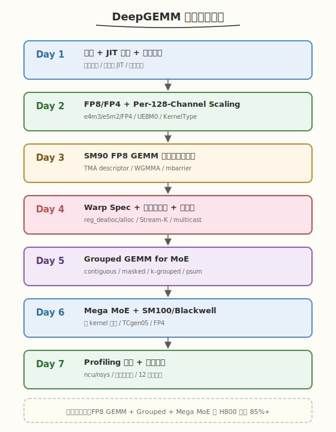

# DeepGEMM 一周学习计划

> **适用对象**：已完成 [CUTLASS 专题](../cutlass/README.md) Day 4（三层抽象）与 [CuTe 专题](../cute/README.md) Day 6（TMA + WGMMA），掌握 Hopper 异步执行模型；建议读过 [FlashAttention-3 论文精读](../../paper/flashattention3/README.md) 理解 warp specialization 与 FP8 布局工程
> **本周目标**：理解 DeepSeek 开源的 DeepGEMM 库（v2.6.1，SM90 + SM100）的设计哲学与核心实现，能读懂其 warp-specialized FP8 GEMM kernel 源码（TMA + WGMMA + 持久化调度 + per-128-channel scaling），掌握 Grouped GEMM for MoE 与 Mega MoE 融合 kernel，最终用 DeepGEMM 跑出接近 H100/H800 FP8 峰值（~1550 TFLOPS）并完成 ncu 调优报告
> **时间投入**：工作日每天 2.5h（早间 1.5h + 晚间 1h），周末每天 5h，周计 22.5h
> **周日里程碑**：用 DeepGEMM 跑通 FP8 GEMM + Grouped GEMM + Mega MoE 三类核心 kernel，在 Hopper 上达到 85%+ FP8 峰值利用率，产出源码精读笔记与性能对比报告（DeepGEMM vs cuBLASLt vs CUTLASS 3.x）

---

## 本周总览

| 维度 | 内容 |
|------|------|
| **整体目标** | 掌握 DeepGEMM 的设计哲学（轻量 JIT + 借鉴 CuTe 但不依赖模板代数）、FP8/FP4 数据类型与 per-128-channel scaling、SM90 TMA + WGMMA + 持久化调度、warp specialization 与寄存器重配、Grouped GEMM（contiguous/masked/k-grouped）、Mega MoE 融合 kernel、SM100 TCgen05 |
| **核心产出** | ① DeepGEMM JIT 编译运行环境 ② FP8 GEMM 性能数据（vs cuBLASLt/CUTLASS）③ Grouped GEMM for MoE benchmark ④ `sm90_fp8_gemm_1d1d.cuh` 源码精读笔记 ⑤ Mega MoE 时序图 ⑥ ncu 瓶颈分析报告 |
| **验收标准** | ① 能画出 DeepGEMM 的 TMA warpgroup + Math warpgroup 时序图并标注 barrier 握手点 ② 能解释 per-128-channel scaling 的数学形式与 SM100 UE8M0 的差异 ③ FP8 GEMM 在 8192×8192 达到 H800 FP8 峰值 85%+ ④ 能说出 DeepGEMM 的 Grouped GEMM 只分组 M 轴的设计原因 ⑤ 能用 ncu 定位 stall reasons 并解读 Tensor Core 利用率 |
| **面试准备** | 积累 10-12 道面试题，覆盖 FP8 精度、warp specialization、TMA/WGMMA 异步、持久化调度、per-128-channel scaling、Mega MoE、与 CUTLASS/CuTe 对比 |

### 本专题与 [CUTLASS 专题](../cutlass/README.md) / [CuTe 专题](../cute/README.md) 的边界

| 维度 | CUTLASS 专题 | CuTe 专题 | 本 DeepGEMM 专题 |
|------|--------------|-----------|-------------------|
| **视角** | 库——用模板拼 GEMM | 原语——Layout/Tensor/Copy | 单点——FP8/FP4 GEMM 与 MoE 融合 kernel |
| **范围** | 全精度 GEMM/Conv/Epilogue | 通用 kernel 组装框架 | FP8/FP4/BF16 GEMM + Grouped + MoE + MQA + HC |
| **抽象层** | CollectiveBuilder + CuTe | Layout 代数 + Tensor engine | 裸 PTX + 轻量 CuTe（仅用 TMA desc / WGMMA wrapper） |
| **架构** | 全架构通用 | 全架构通用 | SM90（Hopper）+ SM100（Blackwell） |
| **JIT** | 编译期模板 | 编译期模板 | **运行时 JIT**（NVCC / NVRTC），安装时不编译 |
| **独有** | Epilogue 融合树 EVT | Layout 代数 | Mega MoE（单 kernel 融合 EP + 2×GEMM + SwiGLU） |

> 💡 **一句话总结**：DeepGEMM 的设计哲学是"借鉴 CuTe 的 TMA/WGMMA wrapper，但不用它的模板代数；用裸 PTX 写到极致可读，靠 JIT 在运行时针对具体 shape 生成最优 kernel"。CUTLASS/CuTe 专题教你"组装" GEMM 的通用框架，本专题教你"拆开"一个生产级 FP8 kernel 看里面每一行 PTX 怎么写——前者是广度，后者是深度。

### 本周知识图谱



### 前置准备清单

#### 硬件/软件验证
- [ ] GPU Compute Capability == 9.0a（Hopper H100/H800）或 10.0a（Blackwell B200）
- [ ] CUDA Toolkit >= 12.3（SM90，**推荐 12.9+**）；>= 12.9（SM100）
- [ ] Python >= 3.8，PyTorch >= 2.1（Mega MoE 需 >= 2.9 的对称内存 API）
- [ ] C++20 编译器（NVCC 12.3+ 支持）
- [ ] CUTLASS 4.0+（Git submodule，DeepGEMM include 它的 `cute/` 与 `cutlass/arch/` 头文件）
- [ ] `{fmt}` 库（Git submodule）
- [ ] Nsight Compute >= 2024.1（能解读 sm_90a 的 WGMMA 指标）

#### 验证命令
```bash
# 验证 GPU 架构（需 9.0 或 10.0+）
nvidia-smi --query-gpu=compute_cap,name --format=csv
# 预期输出：9.0 / H100 / H800  或  10.0 / B200

# 验证 CUDA Toolkit（SM90 需 12.3+，SM100 需 12.9+）
nvcc --version

# 验证 PyTorch
python3 -c "import torch; print(torch.__version__)"
```

#### 克隆 DeepGEMM
```bash
# 必须带 --recursive（CUTLASS 与 fmt 是 submodule）
git clone --recursive https://github.com/deepseek-ai/DeepGEMM.git
cd DeepGEMM && git describe --tags
# 确认版本 >= v2.6.0

# 开发模式：链接 include + 构建 CPP JIT 模块
cat develop.sh
./develop.sh

# 或安装模式
cat install.sh
./install.sh
```

#### 必读资源（本周会反复用到）
- ⭐ [DeepGEMM README](https://github.com/deepseek-ai/DeepGEMM) — 官方接口文档与 News（含 Mega MoE、MQA、FP4）
- ⭐ [DeepSeek-V3 技术报告](https://arxiv.org/abs/2412.19437) — FP8 训练动机与精度策略
- ⭐ [FlashAttention-3 论文精读](../../paper/flashattention3/README.md) §3-4 — warp specialization + FP8 布局工程（与本专题共享底层机制）
- 📌 [Hopper WGMMA PTX 文档](https://docs.nvidia.com/cuda/parallel-thread-execution/#warp-group-matrix-multiply-instructions) — 指令格式与布局约束
- 📌 [DeepEP](https://github.com/deepseek-ai/DeepEP) — DeepGEMM Mega MoE 的对称内存与 EP 通信搭档
- 📌 [CUTLASS 专题 Day 7](../cutlass/day7.md) Group GEMM — 对照 DeepGEMM 的 M-grouped 设计

---

## Day 1（周一）：DeepGEMM 总览与 JIT 环境

> **今日目标**：理解 DeepGEMM 的定位、设计哲学（"借鉴 CuTe 但不依赖模板代数 + 运行时 JIT"），搭建环境跑通第一个 FP8 GEMM，建立源码地图
> **面试考察度**：⭐⭐⭐ 了解级，能说清 DeepGEMM 是什么、为什么 DeepSeek 要自研

---

### 学习任务 1：DeepGEMM 是什么（45 分钟）

#### 阅读内容
- **官方 README**：[DeepGEMM GitHub](https://github.com/deepseek-ai/DeepGEMM)（注意 News 区，从 2025.02 到 2026.04 的演进）
- **背景**：[DeepSeek-V3 技术报告](https://arxiv.org/abs/2412.19437) §4.1 FP8 训练
- **对比阅读**：回顾 [CUTLASS 专题 Day 7](../cutlass/day7.md) 的 Group GEMM

#### 核心要点

DeepGEMM 是 DeepSeek 开源的高性能 tensor core kernel 库，**所有 kernel 在运行时通过轻量 JIT 编译**，安装时无需 CUDA 编译。它把现代 LLM 的核心计算原语——FP8/FP4/BF16 GEMM、融合 MoE（Mega MoE）、MQA scoring、HyperConnection——统一到一个精简 CUDA 代码库里。

| 维度 | cuBLASLt FP8 | CUTLASS 4.x | Triton | DeepGEMM |
|------|--------------|-------------|--------|----------|
| FP8 性能（H800） | 基准 | ~95% cuBLAS | ~80% | ~1550 TFLOPS（~1.0x cuBLAS） |
| 代码可读 | 闭源 | 数十万行模板 | 中等 | 核心 ~3-5 千行，"clean and accessible" |
| JIT | 无 | 编译期模板 | 运行时 | 运行时（NVCC / NVRTC，10x 加速可选） |
| Block scaling | 不支持 | 支持 | 需手写 | 原生 per-128-channel |
| Grouped GEMM | 无 | GemmGroup | 需手写 | M-grouped（contiguous/masked/k-grouped） |
| MoE 融合 | 无 | 无 | 无 | **Mega MoE**（单 kernel 融合 EP+2×GEMM+SwiGLU） |
| 架构支持 | 全架构 | 全架构 | 全架构 | SM90 + SM100 |

> 💡 **一句话总结**：DeepGEMM 的设计哲学——借鉴 CuTe 的 TMA descriptor 与 WGMMA wrapper，但**不用** CuTe 的 Layout 代数与 CUTLASS 的 CollectiveBuilder；用裸 PTX + 轻量封装写到极致可读，靠 JIT 在运行时针对具体 shape 生成最优 kernel。README 原话："avoids heavy reliance on their templates or algebras... clean and accessible resource for learning NVIDIA GPU kernel optimization techniques."

#### 为什么 DeepSeek 要自己写

1. **236B/671B MoE 训练算力成本高**，FP8 是关键省算力手段（Hopper FP8 = 2× FP16 算力）
2. **标准 per-tensor FP8 在 MoE 上精度不够**，需要 per-128-channel scaling，cuBLASLt 不支持
3. **CUTLASS 模板太重**，迭代慢；Triton 在 Hopper 上达不到峰值（无法精细控制 warp specialization / 寄存器重配 / TMA multicast）
4. **MoE 场景需要 Grouped GEMM + EP 通信融合**，通用库无法做到单 kernel 融合（Mega MoE）
5. 于是自研一个"刚好够用、可读、可改、JIT"的库

#### 版本演进（News 时间线）

| 时间 | 里程碑 | 关键 PR |
|------|--------|---------|
| 2025.02 | 初始发布，FP8 GEMM + per-tensor scaling | — |
| 2025.04 | H800 达 **1550 TFLOPS** | [#74](https://github.com/deepseek-ai/DeepGEMM/pull/74)/[#78](https://github.com/deepseek-ai/DeepGEMM/pull/78)/[#81](https://github.com/deepseek-ai/DeepGEMM/pull/81)/[#86](https://github.com/deepseek-ai/DeepGEMM/pull/86) |
| 2025.05 | NVRTC JIT（10x 编译加速）+ 权重梯度 kernel | [#94](https://github.com/deepseek-ai/DeepGEMM/pull/94)/[#95](https://github.com/deepseek-ai/DeepGEMM/pull/95) |
| 2025.07 | **SM90 + SM100 双架构重构**，低 CPU 开销 JIT CPP 模块 | [#112](https://github.com/deepseek-ai/DeepGEMM/pull/112) |
| 2025.09 | V3.2 MQA scoring kernel（lightning indexer） | [#200](https://github.com/deepseek-ai/DeepGEMM/pull/200) |
| 2026.04 | **Mega MoE** + FP8xFP4 GEMM + FP4 indexer + PDL + 更快 JIT | [#304](https://github.com/deepseek-ai/DeepGEMM/pull/304) |

> ⚠️ **注意**：本专题以 v2.6.1（2026.04+）为基准，覆盖 SM90 + SM100、FP8/FP4、Grouped GEMM、Mega MoE 全部特性。早期版本的 per-tensor scaling 已被 per-128-channel scaling 取代，请以最新代码为准。

### 学习任务 2：JIT 编译机制（45 分钟）

DeepGEMM 最独特的设计是**运行时 JIT**——安装时不编译任何 CUDA，首次调用时按需编译并缓存。

#### JIT 流程

```
Python 调用 deep_gemm.fp8_gemm_nt(...)
    ↓
csrc/apis/gemm.hpp：根据 shape/dtype 选择模板参数
    ↓
csrc/jit_kernels/：渲染 .cu 源码（填入 BLOCK_M/N/K、stages 等编译期常量）
    ↓
调用 NVCC 或 NVRTC 编译（DG_JIT_USE_NVRTC=1 切换）
    ↓
缓存到 ~/.deep_gemm/（DG_JIT_CACHE_DIR 可配）
    ↓
后续调用直接加载缓存，零编译开销
```

#### 关键环境变量

| 变量 | 作用 | 默认 |
|------|------|------|
| `DG_JIT_USE_NVRTC` | 用 NVRTC 代替 NVCC（10x 快，个别 case 性能略低） | 0 |
| `DG_JIT_CACHE_DIR` | 编译缓存目录 | `~/.deep_gemm` |
| `DG_JIT_DEBUG` | 打印 JIT 调试信息 | 0 |
| `DG_PRINT_CONFIGS` | 打印每个 shape 选中的 config | 0 |
| `DG_JIT_DUMP_PTX` / `DG_JIT_DUMP_SASS` | dump PTX/SASS（调试用） | 0 |
| `DG_JIT_WITH_LINEINFO` | 嵌入源码行号（ncu profiling 用） | 0 |
| `DG_JIT_PTXAS_CHECK` | 断言无 local memory 使用 | 0 |

> 💡 **关键洞察**：JIT 让 DeepGEMM 能针对**每个具体 shape** 生成最优 kernel——`BLOCK_M/N/K`、`kNumStages`、`kNumTMAMulticast` 等都作为编译期常量嵌入，编译器可充分优化。这是它用"小代码量"达到"大库性能"的核心手段。代价是首次调用有编译延迟（NVRTC 可缓解）。

#### 运行时调参 API

```python
import deep_gemm

# 限制使用的 SM 数（留 SM 给其他 workload）
deep_gemm.set_num_sms(80)

# 设置近似 Tensor Core 利用率（影响 tile 调度策略）
deep_gemm.set_tc_util(0.9)

# 启用 PDL（Programmatic Dependent Launch，Hopper+ 的 kernel 间重叠）
deep_gemm.set_pdl(True)

# Grouped GEMM 的 M/K 对齐
deep_gemm.set_mk_alignment_for_contiguous_layout(128)
```

### 学习任务 3：环境搭建与第一个 GEMM（30 分钟）

```bash
cd DeepGEMM
./develop.sh    # 链接 include + 构建 CPP JIT 模块

# 跑 FP8 GEMM 正确性 + 性能测试
python3 tests/test_fp8_fp4.py
```

```text
# 预期输出（H800，截取）
Testing GEMM:
 > Perf (m=  8192, n=  8192, k=  8192, 1D1D, layout=NT, BF16, acc=0): 820.0 us | 1550 TFLOPS | ... GB/s | 1.02x cuBLAS
 > Perf (m= 16384, n= 16384, k= 16384, 1D1D, layout=NT, BF16, acc=0): 6.50 ms | 1568 TFLOPS | ... GB/s | 1.01x cuBLAS
Average FP8xFP8 GEMM speedup over cuBLASLt: 1.012x
```

### 学习任务 4：建立源码地图（30 分钟）

```
DeepGEMM/
├── deep_gemm/
│   ├── __init__.py             # Python 入口，导出所有 API
│   ├── include/deep_gemm/      # ★ 核心 C++/CUDA 头文件（header-only）
│   │   ├── impls/              #   ★ 各 kernel 实现
│   │   │   ├── sm90_fp8_gemm_1d1d.cuh       # Day 3-4 精读：SM90 FP8 GEMM
│   │   │   ├── sm90_fp8_gemm_1d2d.cuh       #   SM90 FP8 GEMM（2D scaling）
│   │   │   ├── sm90_bf16_gemm.cuh           #   SM90 BF16 GEMM
│   │   │   ├── sm90_fp8_mqa_logits.cuh      #   SM90 MQA logits（indexer）
│   │   │   ├── sm90_fp8_paged_mqa_logits.cuh
│   │   │   ├── sm90_tf32_hc_prenorm_gemm.cuh #   HyperConnection
│   │   │   ├── sm100_fp8_fp4_gemm_1d1d.cuh  # Day 6：Blackwell FP8/FP4
│   │   │   ├── sm100_bf16_gemm.cuh
│   │   │   ├── sm100_fp8_fp4_mega_moe.cuh   # Day 6：Mega MoE
│   │   │   ├── sm100_bf16_mega_moe.cuh
│   │   │   └── smxx_layout.cuh              #   布局转换
│   │   ├── mma/                #   ★ MMA 指令封装
│   │   │   ├── sm90.cuh        #     WGMMA（FP8MMA / BF16MMA / TF32MMA）
│   │   │   └── sm100.cuh       #     TCgen05（Blackwell）
│   │   ├── ptx/                #   ★ PTX 内联汇编
│   │   │   ├── wgmma.cuh       #     wgmma.fence / commit_group / wait_group
│   │   │   ├── tcgen05.cuh     #     Blackwell TCgen05 指令
│   │   │   ├── tma.cuh         #     TMA + tensormap.replace PTX
│   │   │   └── ld_st.cuh       #     ld_shared / st_shared
│   │   ├── scheduler/          #   ★ Block 调度器
│   │   │   ├── gemm.cuh        #     持久化调度 + Stream-K
│   │   │   ├── mega_moe.cuh    #     Mega MoE 调度
│   │   │   └── sm90/sm100_mqa_logits.cuh
│   │   ├── comm/barrier.cuh    #   mbarrier / grid_sync / nvlink_barrier
│   │   ├── common/             #   utils / math / types / tma_copy / compile
│   │   ├── epilogue/           #   store_cd / transform
│   │   └── layout/             #   sym_buffer / mega_moe / mqa_logits
│   ├── legacy/                 # A100 Triton kernel（SM80 回退）
│   ├── mega/                   # Mega MoE Python API（SymmBuffer 等）
│   ├── testing/                # bench_kineto / calc_diff
│   └── utils/                  # dist / layout / math
├── csrc/
│   ├── apis/                   # C++ API 层（gemm.hpp / attention.hpp / mega.hpp）
│   ├── jit_kernels/            # JIT 编译基础设施（heuristics + impls）
│   └── python_api.cpp          # pybind11 绑定
└── tests/                      # 测试与 benchmark
    ├── test_fp8_fp4.py         #   FP8/FP4 GEMM + Grouped
    ├── test_bf16.py            #   BF16 GEMM
    ├── test_mega_moe.py        #   Mega MoE
    ├── test_attention.py       #   MQA logits
    └── generators.py           #   测试数据生成器
```

#### 必读源码列表

| 文件 | 内容 | 优先级 | 对应 Day |
|------|------|--------|----------|
| `impls/sm90_fp8_gemm_1d1d.cuh` | SM90 FP8 GEMM 主 kernel | ⭐ 必读 | Day 3-4 |
| `mma/sm90.cuh` | WGMMA 指令封装 + smem desc 构造 | ⭐ 必读 | Day 3 |
| `scheduler/gemm.cuh` | 持久化 + Stream-K 调度器 | ⭐ 必读 | Day 4 |
| `ptx/wgmma.cuh` + `ptx/tma.cuh` | PTX 内联汇编 | ⭐ 必读 | Day 3 |
| `common/types.cuh` | GemmType / KernelType 枚举 | 📌 推荐 | Day 1 |
| `impls/sm100_fp8_fp4_mega_moe.cuh` | Mega MoE | 📌 推荐 | Day 6 |
| `comm/barrier.cuh` | mbarrier / grid_sync / nvlink_barrier | 📌 推荐 | Day 4 |

### 今日检查清单

- [ ] 能说出 DeepGEMM 与 cuBLASLt/CUTLASS/Triton 的定位差异
- [ ] 能解释 DeepSeek 自研的 5 个原因（精度/MoE/JIT/可读/峰值）
- [ ] 能说出 JIT 编译流程与 `DG_JIT_USE_NVRTC` 的作用
- [ ] 成功跑通 `test_fp8_fp4.py`，记录 H800/H100 上的 TFLOPS
- [ ] 浏览了 `include/deep_gemm/` 目录，标记了 Day 3-4 精读文件

---

## Day 2（周二）：FP8/FP4 数据类型与 Per-128-Channel Scaling

> **今日目标**：理解 FP8（e4m3/e5m2）与 FP4 的数值分布，掌握 DeepGEMM 的 per-128-channel scaling（SM90 FP32 scale / SM100 UE8M0 packed scale），搞清 KernelType 1D1D vs 1D2D 的区别
> **面试考察度**：⭐⭐⭐⭐⭐ 核心考点，FP8 精度策略是 DeepGEMM 的立身之本

---

### 学习任务 1：FP8 与 FP4 格式（45 分钟）

#### e4m3 vs e5m2 vs FP4

| 格式 | 指数位 | 尾数位 | 最大值 | 用途 |
|------|--------|--------|--------|------|
| **e4m3** | 4 | 3 | ±448 | 前向权重/激活 |
| **e5m2** | 5 | 2 | ±57344 | 反向梯度（大动态范围） |
| **FP4 (E2M1)** | 2 | 1 | ±6.0 | 极致压缩（Blackwell Mega MoE 权重） |

#### Hopper vs Blackwell 算力

| 精度 | H100/H800 峰值 | B200 峰值 | 相对 FP16 |
|------|----------------|-----------|-----------|
| FP16/BF16 | 989 TFLOPS | ~2.2 PFLOPS | 1x |
| **FP8** | **1979 TFLOPS** | ~4.5 PFLOPS | **2x** |
| **FP4** | —（SM90 不支持） | ~9 PFLOPS | **4x**（SM100 独有） |

> 💡 **一句话总结**：DeepGEMM 在 SM90 主打 FP8（2x FP16），在 SM100 引入 FP4（4x FP16）用于 Mega MoE 的权重。FP4 的精度更脆弱，靠 UE8M0 共享指数 scaling 与 MX（Microscaling）格式补救。

### 学习任务 2：Per-128-Channel Scaling 的数学形式（45 分钟）

#### 从 per-tensor 到 per-128-channel

DeepGEMM 当前版本（v2.6+）的 FP8 GEMM 使用 **per-128-channel scaling**：K 维度按 128 长度分块，每块独立 scale。源码硬编码 `BLOCK_K == 128`（见 `sm90_fp8_gemm_1d1d.cuh:52`）：

```cpp
DG_STATIC_ASSERT(BLOCK_K == 128, "Only support per-128-channel FP8 scaling");
```

数学形式：

$$D_{m,n} = \sum_{b=0}^{K/128} \left( \mathrm{FP8}(A_{m,\, b\cdot128:(b+1)\cdot128}) \cdot \mathrm{FP8}(B_{b\cdot128:(b+1)\cdot128,\, n}) \cdot s_a^{(b)} \cdot s_b^{(b)} \right)$$

- $s_a \in \mathbb{R}^{M \times K/128}$：A 的 scale，每 128 列一个（per-channel）
- $s_b \in \mathbb{R}^{N \times K/128}$：B 的 scale，每 128 行一个
- WGMMA 累加在 FP32，每 128 步乘一次 $s_a^{(b)} \cdot s_b^{(b)}$

> ⚠️ **关键点**：scale 不是每 tensor 一个，也不是每 128×128 块一个，而是**沿 K 维每 128 通道一个**——这正好对齐 WGMMA 的 K=32（FP8）tile，4 次 WGMMA 累加后乘一次 scale，scale 乘法可融入 epilogue 不额外占 cycle。

#### KernelType：1D1D vs 1D2D vs NoSF

读 `common/types.cuh`，DeepGEMM 把 scaling 分为三种 kernel 类型：

| KernelType | scale 布局 | 适用 | 特点 |
|------------|-----------|------|------|
| `Kernel1D1D` | A/B 的 scale 都是 1D（沿 K/128） | 标准 FP8 GEMM | 最快，scale 与数据同方向 |
| `Kernel1D2D` | A 的 scale 1D，B 的 scale 2D | 某些 MoE 权重 | 兼容非标准 scale 布局 |
| `KernelNoSF` | 无 scale | BF16 GEMM | 不做 scaling |

### 学习任务 3：SM90 FP32 scale vs SM100 UE8M0（45 分钟）

读 README 的 "Notices" 一节，SM90 与 SM100 的 scaling factor 格式不同：

| 架构 | scale 格式 | 大小 | 含义 |
|------|-----------|------|------|
| **SM90** | FP32 | 4 字节/scale | 直接存浮点 scale 值 |
| **SM100** | **UE8M0 packed** | 1 字节/scale（4 个 pack 成 1 个 `torch.int`） | 仅 8 位指数，无尾数（MX 格式） |

#### UE8M0 是什么

UE8M0（Unsigned Exponent 8-bit, Mantissa 0-bit）是 Blackwell 的 MX（Microscaling）格式——scale 只存 8 位指数，尾数隐含为 1.0。4 个 UE8M0 pack 成一个 `torch.int`（32 位）。

```python
# SM100 的 scale 准备（伪代码）
# FP32 scale -> UE8M0 packed
scales_fp32 = ...  # [M, K/128]
scales_ue8m0_packed = deep_gemm.get_mn_major_tma_aligned_packed_ue8m0_tensor(scales_fp32)
# 内部：取 log2，量化到 8 位指数，4 个 pack 成一个 int
```

> 💡 **关键洞察**：UE8M0 把 scale 从 4 字节压到 1 字节——当 K 很大时，scale 数组本身会成为带宽瓶颈。SM100 的 MX 格式是 FP4 能 work 的前提：FP4 精度太低，必须配合细粒度 scale，而细粒度 scale 又不能太大，UE8M0 是两者的折衷。

### 学习任务 4：Scale 的 TMA 布局要求（30 分钟）

README 明确："The LHS scaling factor is required to have a TMA-aligned and transposed layout."

DeepGEMM 把 scale 也用 TMA 搬运（见 `sm90_fp8_gemm_1d1d.cuh:229-230`），因此 scale tensor 必须满足 TMA 对齐要求。用户提供工具函数：

```python
# 把用户 scale 转成 TMA 友好布局
sfa_aligned = deep_gemm.get_mn_major_tma_aligned_tensor(sfa)  # SM90 FP32
sfb_aligned = deep_gemm.get_mn_major_tma_aligned_tensor(sfb)

# SM100 的 UE8M0 packed 版本
sfa_packed = deep_gemm.get_mn_major_tma_aligned_packed_ue8m0_tensor(sfa)
```

> ⚠️ **注意**：输入转置、FP8 cast、scale 布局转换等**不在 GEMM kernel 内做**——DeepGEMM 专注 GEMM 本身，这些预处理由用户自行融合到前一层的 epilogue。README 提供了简单的 PyTorch 工具函数但性能不是最优。

### 今日检查清单

- [ ] 能说出 e4m3 / e5m2 / FP4 的最大值与典型用途
- [ ] 能写出 per-128-channel scaling 的数学形式
- [ ] 理解为什么 `BLOCK_K == 128` 是硬编码（对齐 WGMMA K=32）
- [ ] 能说出 SM90 FP32 scale 与 SM100 UE8M0 packed 的差异
- [ ] 读完 `common/types.cuh`，能解释 `GemmType` 枚举的 7 个值

---

## Day 3（周三）：SM90 FP8 GEMM Kernel 源码精读（上）

> **今日目标**：精读 `sm90_fp8_gemm_1d1d.cuh` 的数据搬运与计算流水——TMA descriptor、WGMMA async 发射、mbarrier 同步、持久化调度
> **面试考察度**：⭐⭐⭐⭐⭐ 核心考点，"DeepGEMM 的 TMA 和 WGMMA 怎么 overlap"必问

---

### 学习任务 1：Hopper 异步三件套回顾（30 分钟）

复习 [CuTe 专题 Day 6](../cute/README.md) 与 [FlashAttention-3 论文精读](../../paper/flashattention3/README.md) §3，Hopper 的三个独立执行单元：

| 单元 | 指令 | 异步性 | 占 SM？ |
|------|------|--------|---------|
| **TMA** | `cp.async.bulk.tensor` | 硬件异步，1 thread 发射 | 否 |
| **WGMMA** | `wgmma.mma_async.sync.aligned.m64nNk32` | 异步，warpgroup 发射后立即返回 | 是（Tensor Core） |
| **CUDA core / SFU** | `add`/`mul`/`exp` | 同步 | 是 |

> 💡 **关键洞察**：三者可同时工作——TMA 搬数时 Tensor Core 在算上一个 tile，CUDA core 在做 scale 乘法。DeepGEMM 的 kernel 设计目标就是让三者不互相等待。

### 学习任务 2：Kernel 模板参数与 SMEM 布局（45 分钟）

读 `sm90_fp8_gemm_1d1d.cuh:30-126`，kernel 是一个大模板：

```cpp
template <uint32_t SHAPE_M, uint32_t SHAPE_N, uint32_t SHAPE_K,
          uint32_t kNumGroups,
          uint32_t BLOCK_M, uint32_t BLOCK_N, uint32_t BLOCK_K,
          uint32_t kSwizzleAMode, uint32_t kSwizzleBMode,
          uint32_t kNumStages,
          uint32_t kNumTMAThreads, uint32_t kNumMathThreads,
          uint32_t kNumTMAMulticast, bool kIsTMAMulticastOnA,
          uint32_t kNumSMs,
          GemmType kGemmType, typename cd_dtype_t>
CUTLASS_GLOBAL __launch_bounds__(kNumTMAThreads + kNumMathThreads, 1) void
sm90_fp8_gemm_1d1d_impl(...)
```

#### 关键断言

```cpp
DG_STATIC_ASSERT(kNumTMAThreads == 128 and kNumMathThreads % 128 == 0, "Invalid Threads");
DG_STATIC_ASSERT(BLOCK_K == 128, "Only support per-128-channel FP8 scaling");
// C/D type: only FP32 with accumulation
DG_STATIC_ASSERT(cute::is_same_v<cd_dtype_t, float>, "Invalid C/D data dtype");
```

- TMA warpgroup 固定 128 线程（1 warpgroup）
- Math warpgroup 是 128 的倍数（1-2 warpgroups）
- BLOCK_K 固定 128（per-128-channel scaling）
- 累加只在 FP32

#### SMEM 分配

```
SMEM 布局（kNumStages = 3 为例）：
┌─────────────────────────────────────────────────┐
│ Tensor Maps (KGrouped 模式才用)                  │
├─────────────────────────────────────────────────┤
│ D: BLOCK_M × BLOCK_N × FP32                     │ ← 输出 tile
├─────────────────────────────────────────────────┤
│ A: [stage 0][stage 1][stage 2] × BLOCK_M×128×FP8│ ← 3-stage A buffer
├─────────────────────────────────────────────────┤
│ B: [stage 0][stage 1][stage 2] × BLOCK_N×128×FP8│ ← 3-stage B buffer
├─────────────────────────────────────────────────┤
│ SFA: [stage 0][stage 1][stage 2] × BLOCK_M×FP32 │ ← A 的 scale
├─────────────────────────────────────────────────┤
│ SFB: [stage 0][stage 1][stage 2] × BLOCK_N×FP32 │ ← B 的 scale
├─────────────────────────────────────────────────┤
│ full_barriers[3]  +  empty_barriers[3]          │ ← mbarrier 对
└─────────────────────────────────────────────────┘
```

> 💡 **关键洞察**：DeepGEMM 把 **scale factor 也放进 SMEM 流水线**——每个 stage 不仅有 A/B 数据，还有对应的 SFA/SFB。这样 scale 读取与 WGMMA 计算完全 overlap，不会因为 scale 加载引入额外延迟。

### 学习任务 3：TMA 加载与 mbarrier 握手（45 分钟）

读 `sm90_fp8_gemm_1d1d.cuh:170-245`（TMA warpgroup 分支）：

```cpp
// TMA warpgroup：1 个 thread 发起所有 TMA
if (warp_idx == kNumMathThreads / 32 and cute::elect_one_sync()) {
    while (scheduler.get_next_block(m_block_idx, n_block_idx)) {
        // 持久化调度：一个 threadblock 串行处理多个 tile
        for (uint32_t k_block_idx = 0; k_block_idx < num_k_blocks; ++k_block_idx) {
            // 1. 等 consumer 释放 buffer
            empty_barriers[stage_idx]->wait(phase ^ 1);

            // 2. 发起 4 个 TMA：SFA, SFB, A, B
            tma::copy<BLOCK_M, BLOCK_K, 0>(&tensor_map_sfa, &full_barrier, smem_sfa[stage], m_idx, sf_k_idx, num_multicast);
            tma::copy<BLOCK_N, BLOCK_K, 0>(&tensor_map_sfb, &full_barrier, smem_sfb[stage], n_idx, sf_k_idx, num_multicast);
            tma::copy<BLOCK_K, BLOCK_M, kSwizzleAMode>(tensor_map_a, &full_barrier, smem_a[stage], k_idx, m_idx, num_multicast);
            tma::copy<BLOCK_K, BLOCK_N, kSwizzleBMode>(tensor_map_b, &full_barrier, smem_b[stage], k_idx, n_idx, num_multicast);

            // 3. 告知 barrier 期望的字节数，TMA 完成后自动 release
            full_barrier.arrive_and_expect_tx(SMEM_A + SMEM_B + SMEM_SFA + SMEM_SFB);
        }
    }
}
```

#### mbarrier 的双 barrier 设计

DeepGEMM 用**成对 barrier**——`full_barriers` 和 `empty_barriers` 各 `kNumStages` 个：

| Barrier | 生产者 | 消费者 | 含义 |
|---------|--------|--------|------|
| `full_barriers[stage]` | TMA `arrive_and_expect_tx` | Math `wait` | "数据已满，可算" |
| `empty_barriers[stage]` | Math `arrive` | TMA `wait` | "数据用完，可覆盖" |

```
时间 →
TMA:   load stage0 → arrive(full[0]) → load stage1 → arrive(full[1]) → wait(empty[0]) → load stage0' → ...
Math:                              wait(full[0]) → WGMMA → arrive(empty[0]) → wait(full[1]) → ...
                                                       ↑ 两者在不同 stage 上并行
```

> 💡 **关键洞察**：双 barrier 是无锁流水线的标准模式——TMA 不需要知道 Math 何时算完，只需等 `empty` 信号；Math 不需要知道 TMA 何时搬完，只需等 `full` 信号。两者完全解耦，流水线深度由 `kNumStages` 决定（典型 3-4 stage）。

### 学习任务 4：WGMMA 发射与 scale 乘法（30 分钟）

读 `sm90_fp8_gemm_1d1d.cuh:246-321`（Math warpgroup 分支）：

```cpp
// Math warpgroup
cutlass::arch::warpgroup_reg_alloc<kNumMathRegisters>();

while (scheduler.get_next_block(m_block_idx, n_block_idx)) {
    float accum[WGMMA::kNumAccum], final_accum[WGMMA::kNumAccum] = {0};
    float2 scales_b[WGMMA::kNumAccum / 4];

    for (uint32_t k_block_idx = 0; k_block_idx < num_k_blocks; ++k_block_idx) {
        // 1. 等 TMA 搬完
        full_barriers[stage_idx]->wait(phase);

        // 2. 读 scale（必须在 warpgroup_arrive 前读完，避免下一 tile 污染）
        auto scale_a_0 = ptx::ld_shared(smem_sfa[stage] + r_0);
        auto scale_a_1 = ptx::ld_shared(smem_sfa[stage] + r_1);
        for (int i = 0; i < WGMMA::kNumAccum / 4; ++i)
            scales_b[i] = ptx::ld_shared(...smem_sfb[stage]...);

        // 3. 发射 WGMMA（BLOCK_K / WGMMA::K = 128/32 = 4 次）
        ptx::warpgroup_arrive();                         // wgmma.fence
        for (uint32_t k = 0; k < BLOCK_K / WGMMA::K; ++k) {
            auto desc_a = mma::sm90::make_smem_desc(smem_a[stage] + ..., 1);
            auto desc_b = mma::sm90::make_smem_desc(smem_b[stage] + ..., 1);
            WGMMA::wgmma(desc_a, desc_b, accum, k);      // wgmma.mma_async
        }
        ptx::warpgroup_commit_batch();                    // wgmma.commit_group
        ptx::warpgroup_wait<0>();                         // wgmma.wait_group 0

        // 4. 释放 buffer
        empty_barrier_arrive(stage_idx);

        // 5. Scale 乘法（在下一轮 TMA 搬运的影子里）
        for (int i = 0; i < WGMMA::kNumAccum / 4; ++i) {
            final_accum[i*4+0] += scale_a_0 * scale_b_0 * accum[i*4+0];
            final_accum[i*4+1] += scale_a_0 * scale_b_1 * accum[i*4+1];
            final_accum[i*4+2] += scale_a_1 * scale_b_0 * accum[i*4+2];
            final_accum[i*4+3] += scale_a_1 * scale_b_1 * accum[i*4+3];
        }
    }
    // ... epilogue: 写回 SMEM → TMA store ...
}
```

#### WGMMA 指令选择

读 `mma/sm90.cuh`，FP8 的 WGMMA 是 `m64nNk32`（M=64 固定，N 从 8 到 256，K=32）：

```cpp
template <int N>
struct FP8MMASelector {
    static constexpr auto select_mma() {
        using namespace cute::SM90::GMMA;
        if constexpr (N == 8)   return MMA_64x8x32_F32E4M3E4M3_SS_TN();
        if constexpr (N == 128) return MMA_64x128x32_F32E4M3E4M3_SS_TN();
        if constexpr (N == 256) return MMA_64x256x32_F32E4M3E4M3_SS_TN();
        // ... N 从 8 到 256，步长 8 ...
    }
};
```

> ⚠️ **注意**：FP8 WGMMA 的 K=32（4 个 FP8 pack 成 32 字节），BF16 WGMMA 的 K=16。`BLOCK_K=128` 对应 FP8 的 4 次 WGMMA、BF16 的 8 次。

### 今日检查清单

- [ ] 能说出 kernel 的关键模板参数（BLOCK_K=128、kNumTMAThreads=128）
- [ ] 能画出 SMEM 布局（D / A×stage / B×stage / SFA×stage / SFB×stage / barriers）
- [ ] 能解释 `full_barriers` / `empty_barriers` 双 barrier 的握手时序
- [ ] 能说出 FP8 WGMMA 是 `m64nNk32`，BLOCK_K=128 对应 4 次 WGMMA
- [ ] 读懂 TMA 分支与 Math 分支的代码结构

---

## Day 4（周四）：Warp Specialization、寄存器重配与持久化调度

> **今日目标**：理解 DeepGEMM 的 warp specialization 分工（TMA warpgroup vs Math warpgroup）、`warpgroup_reg_dealloc/alloc` 寄存器重配、持久化调度器与 TMA multicast
> **面试考察度**：⭐⭐⭐⭐⭐ 核心考点，warp specialization + 持久化调度是 Hopper kernel 的标志性设计

---

### 学习任务 1：Warp Specialization 角色划分（30 分钟）

DeepGEMM 的 threadblock 分为两个角色（见 `sm90_fp8_gemm_1d1d.cuh:170,246`）：

| 角色 | 线程数 | Warp ID | 职责 | 关键指令 |
|------|--------|---------|------|----------|
| **TMA warpgroup** | 128 | `>= kNumMathThreads/32` | 发起 TMA load + 管理屏障 | `tma::copy`, `arrive_and_expect_tx` |
| **Math warpgroup(s)** | 128-256 | `< kNumMathThreads/32` | 发射 WGMMA + scale 乘法 | `wgmma`, `ld_shared` |

```cpp
// 判断角色
const uint32_t warp_idx = threadIdx.x / 32;

if (warp_idx >= kNumMathThreads / 32) {
    // TMA warpgroup：让出寄存器
    cutlass::arch::warpgroup_reg_dealloc<kNumTMARegisters>();
    // ... TMA load 循环 ...
} else {
    // Math warpgroup：申请更多寄存器
    cutlass::arch::warpgroup_reg_alloc<kNumMathRegisters>();
    // ... WGMMA 循环 ...
}
```

> 💡 **一句话总结**：Warp specialization 的本质是"专职化"——TMA warpgroup 只搬数据不碰 Tensor Core，Math warpgroup 只算不碰 TMA。两者通过 mbarrier 异步握手，谁不等谁。这与 CUTLASS 2.x 的"所有 warp 干一样的事"是根本转变。

### 学习任务 2：寄存器重配（warpgroup_reg_dealloc/alloc）（30 分钟）

读 `sm90_fp8_gemm_1d1d.cuh:153-155`：

```cpp
// 寄存器重配（更多 math 寄存器在有 unroll 时才需要）
constexpr uint32_t kNumTMARegisters = (kNumPipelineUnrolls == 0 ? 40 : 24);
constexpr uint32_t kNumMathRegisters = (kNumPipelineUnrolls == 0 ? 232 : 240);
```

| Warp | 寄存器上限 | 理由 |
|------|-----------|------|
| TMA | 24-40 | TMA 只需地址寄存器，几乎不占通用寄存器 |
| Math | 232-240 | WGMMA 累加器（64×N/128 个 FP32）+ scale buffer |

Hopper 用 `cutlass::arch::warpgroup_reg_dealloc<N>` / `warpgroup_reg_alloc<N>` 在运行时切换寄存器上限（底层是 `setmaxnreg` PTX 指令）。Ampere 的寄存器上限是编译期固定的，做不到这种动态重配。

> ⚠️ **注意**：寄存器重配必须在所有 warp 同步执行（`.sync.aligned`），且在 threadblock 入口处尽早做。DeepGEMM 在 TMA/Math 分支入口的第一件事就是重配寄存器。

### 学习任务 3：持久化调度器（45 分钟）

读 `scheduler/gemm.cuh`。DeepGEMM 用**持久化 kernel**——一个 threadblock 串行处理多个 tile，而不是一个 tile 一个 block。

```cpp
// 持久化调度核心循环
while (scheduler.get_next_block(m_block_idx, n_block_idx)) {
    // 处理一个 (m_block, n_block) tile
    // ... TMA load + WGMMA + epilogue ...
}
```

#### 调度器支持的 GemmType

读 `common/types.cuh`：

| GemmType | 含义 | 典型场景 |
|----------|------|----------|
| `Normal` | 标准 GEMM | 密集计算 |
| `MGroupedContiguous` | M 轴分组，token 连续 | MoE 前向/prefill |
| `MGroupedMasked` | M 轴分组，mask 标记 | MoE decode（CUDA graph） |
| `KGroupedContiguous` | K 轴分组 | MoE 权重梯度 |
| `MGroupedContiguousWithPsumLayout` | M 分组 + psum 布局 | MoE 反向 |
| `KGroupedContiguousWithPsumLayout` | K 分组 + psum 布局 | MoE 反向 |
| `Batched` | 批量 GEMM | — |

#### Stream-K 风格

调度器还支持 Stream-K——把 K 维也切分，让多个 threadblock 协作算同一个 (M, N) tile，最后用 `SM90_TMA_REDUCE_ADD_2D` 归约（见 `sm90_fp8_gemm_1d1d.cuh:341`）。这在小 M×N tile 数 < SM 数时消除长尾。

### 学习任务 4：TMA Multicast 与 Cluster（30 分钟）

DeepGEMM 支持 TMA multicast——一条 TMA 指令把数据广播到 cluster 内的多个 CTA：

```cpp
template <... uint32_t kNumTMAMulticast, bool kIsTMAMulticastOnA, ...>
// kNumTMAMulticast: multicast 到几个 CTA（1 或 2）
// kIsTMAMulticastOnA: A 还是 B 做 multicast
```

```cpp
const uint32_t num_tma_multicast_a = (kIsTMAMulticastOnA and is_tma_multicast_valid) ? kNumTMAMulticast : 1;
tma::copy<BLOCK_K, BLOCK_M, kSwizzleAMode>(tensor_map_a, &full_barrier, smem_a[stage], k_idx, m_idx, num_tma_multicast_a);
```

> 💡 **关键洞察**：TMA multicast 让相邻 CTA 共享同一份 A（或 B）数据——例如两个 CTA 算同一 M 行不同 N 列，A tile 只需从 gmem 搬一次。这是 Hopper cluster 级优化的核心，CUTLASS 3.x 也用同样机制。

### 学习任务 5：SMEM Swizzle 与 WGMMA desc（30 分钟）

读 `mma/sm90.cuh:194-279`，WGMMA 的操作数用 `GmmaDescriptor` 描述 SMEM 布局：

```cpp
// 构造 SMEM descriptor（WGMMA 操作数）
template <cute::UMMA::Major kMajorMode, uint32_t BLOCK_MN, uint32_t BLOCK_K, uint32_t kSwizzleMode, typename dtype_t>
cute::GmmaDescriptor make_gmma_desc(dtype_t* base_smem_ptr, uint32_t mn_idx, uint32_t k_idx);
```

Swizzle 模式（`kSwizzleMode`）对应 GMMA LayoutType：

| kSwizzleMode | LayoutType | 适用 |
|--------------|------------|------|
| 0 / 16 | INTERLEAVE | 无 swizzle / 交织 |
| 32 | B32 | 32B 粒度 |
| 64 | B64 | 64B 粒度 |
| 128 | B128 | 128B 粒度（FP8 常用） |

> ⚠️ **注意**：DeepGEMM 的 swizzle 在 TMA descriptor 里指定（`kSwizzleAMode`），TMA 搬入 SMEM 时硬件自动应用，WGMMA 读取时硬件自动反 swizzle。K-major 布局要求 `kSwizzleMode == BLOCK_K * sizeof(dtype)`——FP8 即 128B。

### 今日检查清单

- [ ] 能列出 TMA warpgroup / Math warpgroup 的指令分工与寄存器需求差异
- [ ] 能解释 `warpgroup_reg_dealloc/alloc` 为什么是 Hopper 才有的
- [ ] 能说出持久化调度与 Stream-K 的关系
- [ ] 能解释 TMA multicast 如何让相邻 CTA 共享数据
- [ ] 理解 `make_gmma_desc` 如何编码 SMEM 地址 + swizzle 模式

---

## Day 5（周五）：Grouped GEMM for MoE

> **今日目标**：掌握 DeepGEMM 的 Grouped GEMM 三种变体（contiguous / masked / k-grouped），理解它为什么只分组 M 轴，对比 [CUTLASS 专题 Day 7](../cutlass/day7.md) 与 [MoE 专题](../moe/README.md) 的路径
> **面试考察度**：⭐⭐⭐⭐⭐ 核心考点，"DeepGEMM 的 Grouped GEMM 怎么为 MoE 设计"是 DeepSeek 系面试高频题

---

### 学习任务 1：DeepGEMM Grouped GEMM 的设计取舍（45 分钟）

读 README 的 "Grouped GEMMs (contiguous layout)" 一节：

> "Unlike traditional grouped GEMMs in CUTLASS, DeepGEMM groups only the M-axis, while N and K must remain fixed. This design is tailored for scenarios where experts in an MoE model share the same shape."

| 维度 | CUTLASS GemmGroup | DeepGEMM M-grouped |
|------|-------------------|---------------------|
| 分组轴 | 任意（每 group 的 M/N/K 都可变） | **仅 M 轴**（N/K 固定） |
| 问题尺寸 | 每 group 任意 | M 变长，N/K 所有 group 相同 |
| 调度复杂度 | 高（每 group 独立 tile） | 低（N/K 固定，tile 统一） |
| 适用场景 | 通用不等大 GEMM | MoE（专家共享 shape） |

> 💡 **关键洞察**：MoE 的所有专家有相同的 `[d_model, d_ff]` 权重 shape，只有每专家收到的 token 数不同——这正是"M 轴变长、N/K 固定"。DeepGEMM 砍掉 CUTLASS 的通用性，换来更简单的调度与更高的 SM 利用率。

### 学习任务 2：三种 Grouped GEMM 变体（45 分钟）

#### M-grouped contiguous（前向 / prefill）

```python
# 所有 token 按 expert 连续排列，grouped_layout 是前缀和
# grouped_layout: [num_experts]，grouped_layout[i] = 前 i+1 个 expert 的 token 总数
deep_gemm.m_grouped_fp8_gemm_nt_contiguous(
    a,               # (A_fp8, SFA): [total_tokens, K]
    b,               # (B_fp8, SFB): [num_experts, N, K]
    d,               # [total_tokens, N]
    grouped_layout,  # [num_experts]，前缀和
)
```

- `total_tokens = sum(tokens_per_expert)`
- 每 expert 的 token 数在 `grouped_layout` 里
- 每 expert 段必须对齐到 `get_mk_alignment_for_contiguous_layout()`

#### M-grouped masked（decode / CUDA graph）

```python
# decode 阶段：CUDA graph 开启时 CPU 不知道每 expert 收多少 token
# 用 mask tensor 标记有效部分
deep_gemm.m_grouped_fp8_gemm_nt_masked(
    a,      # [max_tokens, K]
    b,      # [num_experts, N, K]
    d,      # [max_tokens, N]
    mask,   # [num_experts, max_tokens]，bool
)
```

- 配合 [DeepEP](https://github.com/deepseek-ai/DeepEP) 的低延迟 EP kernel 使用
- mask 标记每个 token 去哪个 expert，kernel 只算有效部分

#### K-grouped contiguous（MoE 权重梯度）

```python
# MoE 反向：M/N 固定，K 轴按 group 切分（对应前向的多个 expert）
deep_gemm.k_grouped_fp8_gemm_tn_contiguous(
    a,              # [M, total_K]
    b,              # [num_experts, total_K, N]
    d,              # [M, N]
    grouped_layout, # [num_experts]，K 维前缀和
)
```

- 用于 MoE 的 weight gradient（反向传播）
- M/N 固定，K 轴变长

### 学习任务 3：Psum Layout（MoE 反向优化）（30 分钟）

`GemmType` 里有 `MGroupedContiguousWithPsumLayout` 和 `KGroupedContiguousWithPsumLayout`——这是 DeepGEMM 为 MoE 反向做的特殊布局：

```python
# use_psum_layout=True 时，grouped_layout 存的是前缀和而非每 group 长度
# 允许 group 间有 padding（对齐到 kKAlignment=128）
deep_gemm.m_grouped_fp8_gemm_nt_contiguous(
    a, b, d, grouped_layout,
    use_psum_layout=True,
    ensure_zero_padding=True,  # 断言 padding 区为零
)
```

> ⚠️ **注意**：psum layout 是 2025.05 的权重梯度 kernel（[#95](https://github.com/deepseek-ai/DeepGEMM/pull/95)）引入的，让 MoE 反向的 K 分组可以有 128 对齐的 padding 而不影响正确性。读 `scheduler/gemm.cuh` 的 `get_next_psum_k_group` 可看实现。

### 学习任务 4：动手实践（30 分钟）

```python
# benchmark/grouped_gemm_demo.py
import torch, deep_gemm
from deep_gemm.testing import bench_kineto

# 模拟 DeepSeek-V3 的 MoE FFN（256 专家）
num_experts = 256
tokens_per_expert = torch.randint(4, 32, (num_experts,))
total_tokens = tokens_per_expert.sum().item()
K, N = 7168, 4096

# 生成 FP8 数据 + scale
a_fp8 = torch.randn(total_tokens, K, device='cuda').to(torch.float8_e4m3fn)
b_fp8 = torch.randn(num_experts, N, K, device='cuda').to(torch.float8_e4m3fn)
# ... 准备 SFA/SFB（需 TMA 对齐）...
grouped_layout = torch.cumsum(tokens_per_expert, dim=0).to(torch.int32).cuda()

d = torch.empty(total_tokens, N, device='cuda', dtype=torch.bfloat16)

# DeepGEMM grouped
t = bench_kineto(
    lambda: deep_gemm.m_grouped_fp8_gemm_nt_contiguous((a_fp8, sfa), (b_fp8, sfb), d, grouped_layout),
    'gemm_'
)
print(f'Grouped: {t*1e6:.0f} us | {2*total_tokens*N*K/t/1e12:.0f} TFLOPS')
```

### 今日检查清单

- [ ] 能说出 DeepGEMM 只分 M 轴的设计原因（MoE 专家共享 shape）
- [ ] 能区分 contiguous / masked / k-grouped 三种变体的适用场景
- [ ] 理解 psum layout 为什么用于 MoE 反向
- [ ] `grouped_gemm_demo.py` 跑通，记录 TFLOPS
- [ ] 用 `DG_PRINT_CONFIGS=1` 观察 JIT 选中的 tile 配置

---

## Day 6（周六）：Mega MoE 与 SM100/Blackwell

> **今日目标**：理解 DeepGEMM 的杀手级特性——Mega MoE（单 kernel 融合 EP dispatch + 2×GEMM + SwiGLU + EP combine），了解 SM100 的 TCgen05 指令与 FP4 支持
> **面试考察度**：⭐⭐⭐⭐ 实践级，Mega MoE 是 2026.04 新增的核心特性

---

### 学习任务 1：Mega MoE 是什么（45 分钟）

读 README 的 "Mega MoE" 一节与 [PR #304](https://github.com/deepseek-ai/DeepGEMM/pull/304)：

> "Mega MoE fuses and overlaps EP dispatch, linear 1 (FP8xFP4), SwiGLU, linear 2 (FP8xFP4), and EP combine into a single mega-kernel, overlapping NVLink communication and tensor core computation."

#### 融合了什么

传统 MoE FFN 的 5 步：
```
1. EP dispatch（all-to-all 发送 token 到专家所在卡）
2. Linear 1:  x @ W1.T   （FP8 GEMM）
3. SwiGLU:    silu(gate) * up
4. Linear 2:  h @ W2.T   （FP8 GEMM）
5. EP combine（all-to-all 发回）
```

Mega MoE 把这 5 步融合成 **1 个 kernel**：

```
┌──────────────────────────────────────────────────────────┐
│                   Mega MoE Kernel                         │
│                                                           │
│  TMA load  ──→  WGMMA (L1)  ──→  SwiGLU  ──→  WGMMA (L2) │
│       ↑              ↓           ↓            ↓           │
│   NVLink recv    (compute)    (compute)    NVLink send    │
│       ↑                                     ↓             │
│      EP dispatch (overlapped with compute)  EP combine    │
└──────────────────────────────────────────────────────────┘
```

#### 关键约束

- 需要**多进程 launch** + **对称内存**（symmetric memory）
- PyTorch >= 2.9（对称内存 API）
- 权重需预处理为 FP4 + UE8M0 scale 布局

```python
# Mega MoE 使用（简化）
buffer = deep_gemm.get_symm_buffer_for_mega_moe(
    group, num_experts, num_max_tokens_per_rank, num_topk, hidden, intermediate_hidden)

transformed_l1, transformed_l2 = deep_gemm.transform_weights_for_mega_moe(l1_weights, l2_weights)

# 每次调用前 copy 输入到 symmetric buffer
buffer.x[:num_tokens].copy_(x_fp8)
buffer.x_sf[:num_tokens].copy_(x_sf)
buffer.topk_idx[:num_tokens].copy_(topk_idx)
buffer.topk_weights[:num_tokens].copy_(topk_weights)

# 单 kernel 完成全部 MoE FFN
y = torch.empty((num_tokens, hidden), dtype=torch.bfloat16, device='cuda')
deep_gemm.fp8_fp4_mega_moe(y, transformed_l1, transformed_l2, buffer)
```

> 💡 **关键洞察**：Mega MoE 的核心价值是**把 NVLink 通信藏在 Tensor Core 计算里**——传统 MoE 的 EP dispatch/combine 是纯通信时间（SM 空闲），Mega MoE 让 SM 在等 NVLink 时持续做 WGMMA。这是 DeepSeek-V3.2 推理能做低延迟的关键。与 [FlashAttention-3 论文精读](../../paper/flashattention3/README.md) 的"让 Tensor Core 不空转"是同一个哲学，只是把对象从 softmax 换成了通信。

### 学习任务 2：对称内存与 NVLink 同步（30 分钟）

读 `comm/barrier.cuh` 与 `layout/sym_buffer.cuh`：

```cpp
// NVLink 跨 rank barrier（Mega MoE 用）
template <uint32_t kNumRanks, ...>
CUTLASS_DEVICE void nvlink_barrier(
    const layout::Workspace& workspace,
    const layout::SymBuffer<kNumRanks>& sym_buffer,
    const uint32_t& sm_idx, const uint32_t& thread_idx, ...);
```

- 对称内存：所有 rank 的 GPU 地址映射到同一物理地址，NVLink 可直接读写
- `nvlink_barrier`：基于 atomic + acquire/release 的跨 rank 同步
- `grid_sync`：单 GPU 内所有 SM 同步（cooperative_groups 风格）

### 学习任务 3：SM100 / Blackwell 的 TCgen05（45 分钟）

读 `mma/sm100.cuh` 与 `ptx/tcgen05.cuh`。Blackwell 用 **TCgen05** 指令替代 Hopper 的 WGMMA：

| 维度 | SM90 WGMMA | SM100 TCgen05 |
|------|------------|---------------|
| 指令 | `wgmma.mma_async.sync.aligned.m64nNk32` | `tcgen05.mma` |
| 形状 | m64nN（N≤256） | 更大（m128nN） |
| 操作数 | SMEM desc | SMEM desc（改进的 swizzle） |
| 精度 | FP8/FP16/BF16 | FP8/FP4/FP16/BF16 |
| 异步 | `wgmma.wait_group` | 类似但独立队列 |

#### FP4 支持

SM100 支持 FP4（E2M1）——4 bit 浮点，算力是 FP8 的 2x、FP16 的 4x。DeepGEMM 的 `fp8_fp4_gemm_*` 是 FP8×FP4 混合精度（一个操作数 FP8，另一个 FP4）：

```python
# FP8×FP4 GEMM（SM100 独有）
deep_gemm.fp8_fp4_gemm_nt(a_fp8, b_fp4, d, c=c)
```

> ⚠️ **注意**：FP4 精度极脆弱（只有 2 位指数 + 1 位尾数），必须配合 UE8M0 的细粒度 scale。DeepGEMM 在 SM100 上把 scale 从 FP32 压到 UE8M0（1 字节），让 scale 数组不成为带宽瓶颈。

### 学习任务 4：布局转换工具（30 分钟）

读 `impls/smxx_layout.cuh` 与 `utils/layout.py`。DeepGEMM 提供布局转换工具：

```python
# scale 转成 TMA 对齐的 MN-major 布局
sfa_aligned = deep_gemm.get_mn_major_tma_aligned_tensor(sfa)           # SM90 FP32
sfa_packed = deep_gemm.get_mn_major_tma_aligned_packed_ue8m0_tensor(sfa)  # SM100 UE8M0

# K-grouped 的 scale packing
deep_gemm.get_k_grouped_mn_major_tma_aligned_packed_ue8m0_tensor(...)

# 通用 scale 布局转换
deep_gemm.transform_sf_into_required_layout(...)
```

> 💡 **关键洞察**：这些布局转换是 DeepGEMM 的"必要之恶"——kernel 内部不做人布局转换（专注 GEMM），但 TMA 要求特定对齐与 swizzle，所以提供工具让用户在 kernel 外做。最佳实践是把这些转换融合到前一层的 epilogue。

### 今日检查清单

- [ ] 能说出 Mega MoE 融合了哪 5 步，以及为什么能 overlap 通信与计算
- [ ] 理解对称内存为什么是 Mega MoE 的前提
- [ ] 能说出 SM90 WGMMA 与 SM100 TCgen05 的核心差异
- [ ] 理解 FP4 为什么需要 UE8M0 scale
- [ ] 能列出 DeepGEMM 提供的布局转换工具函数

---

## Day 7（周日）：Profiling 调优与面试复盘

> **今日目标**：用 ncu/nsys 分析 DeepGEMM kernel 的性能瓶颈，对比 DeepGEMM / cuBLASLt / CUTLASS 三版本，完成面试复盘
> **面试考察度**：⭐⭐⭐⭐ 实践级，能解读 ncu 指标并定位瓶颈

---

### 学习任务 1：ncu 性能分析（45 分钟）

```bash
# 启用 lineinfo 便于 ncu 对应源码
DG_JIT_WITH_LINEINFO=1 python3 tests/test_fp8_fp4.py

# profile DeepGEMM kernel
ncu --set full \
    --kernel-name "sm90_fp8_gemm" \
    --launch-skip 5 --launch-count 1 \
    --metrics sm__throughput.avg.pct_of_peak_sustained_elapsed,\
dram__throughput.avg.pct_of_peak_sustained_elapsed,\
smsp__inst_executed_pipe_tensor_op_hmma.avg.pct_of_peak_sustained_active,\
smsp__warp_issue_stalled_long_scoreboard_per_warp_active.pct,\
l1tex__data_bank_conflicts_pipe_lsu_mem_shared_op_ld.sum \
    python3 tests/test_fp8_fp4.py
```

#### 关键指标

| 指标 | 含义 | H800 FP8 目标 |
|------|------|---------------|
| `sm__throughput` | SM 吞吐占比 | > 85% |
| `dram__throughput` | DRAM 带宽占比 | < 30%（应计算 bound） |
| `...tensor_op_hmma` | Tensor Core 利用率 | > 85% |
| `...stalled_long_scoreboard` | 长延迟 stall（等 SMEM/TMA） | < 10% |
| `...bank_conflicts...shared` | SMEM bank conflict | 接近 0（swizzle 生效） |

### 学习任务 2：性能对比 Benchmark（45 分钟）

在 `benchmark/` 下创建对比脚本：

```python
# benchmark/compare_fp8_gemm.py
import torch, deep_gemm
from deep_gemm.testing import bench_kineto

SIZES = [(4096, 4096, 4096), (8192, 8192, 8192), (16384, 16384, 16384)]

for M, N, K in SIZES:
    a = torch.randn(M, K, device='cuda').to(torch.float8_e4m3fn)
    b = torch.randn(N, K, device='cuda').to(torch.float8_e4m3fn)
    # ... 准备 SFA/SFB ...

    d = torch.empty(M, N, device='cuda', dtype=torch.bfloat16)

    # DeepGEMM
    t_dg = bench_kineto(lambda: deep_gemm.fp8_gemm_nt((a, sfa), (b, sfb), d), 'gemm_')
    # cuBLASLt（DeepGEMM 自带 wrapper）
    t_cb = bench_kineto(lambda: deep_gemm.cublaslt_gemm_nt(a, b, d), 'nvjet')

    tflops_dg = 2*M*N*K/t_dg/1e12
    tflops_cb = 2*M*N*K/t_cb/1e12
    print(f"{M}x{N}x{K}: DeepGEMM={tflops_dg:.0f} TFLOPS ({t_dg*1e6:.0f}us) | "
          f"cuBLAS={tflops_cb:.0f} TFLOPS ({t_cb*1e6:.0f}us) | "
          f"speedup={t_cb/t_dg:.2f}x")
```

### 学习任务 3：nsys 抓 Mega MoE 时序（30 分钟）

```bash
# Mega MoE 的通信/计算 overlap 时序
nsys profile -o mega_moe_profile \
    --trace=cuda,nvtx \
    python3 tests/test_mega_moe.py
nsys stats mega_moe_profile.nsys-rep
```

观察点：
- NVLink 通信与 WGMMA 是否 overlap
- 单个 mega kernel 是否覆盖了传统 5 步的全部时间
- 对比传统分步 MoE 的 kernel 数量与总耗时

### 学习任务 4：面试题复盘（60 分钟）

#### 高频面试题

1. **DeepGEMM 为什么不直接用 CUTLASS？**
   - CUTLASS 模板太重，迭代慢；DeepGEMM 目标是"小而可读"
   - DeepGEMM 借鉴 CuTe 的 TMA/WGMMA wrapper，但不用 Layout 代数与 CollectiveBuilder
   - MoE 的 M-grouped + Mega MoE 融合在通用框架里难做精

2. **DeepGEMM 的 JIT 有什么优势？**
   - 针对每个具体 shape 生成最优 kernel（BLOCK_M/N/K 等编译期常量）
   - 安装时不编译，首次调用按需编译并缓存
   - NVRTC 模式比 NVCC 快 10x

3. **per-128-channel scaling 为什么比 per-tensor 精度高？**
   - per-tensor：1 个 scale 压全矩阵，outlier 拉大整体 scale
   - per-128-channel：每 128 列独立 scale，outlier 只影响局部
   - BLOCK_K=128 对齐 WGMMA K=32，4 次 WGMMA 后乘一次 scale，开销最小

4. **SM90 的 scale 是 FP32，SM100 为什么用 UE8M0？**
   - SM100 的 FP4 精度低，需要更细粒度 scale，scale 数组变大
   - UE8M0 把 scale 从 4 字节压到 1 字节，避免 scale 成为带宽瓶颈
   - UE8M0 只存指数（MX 格式），4 个 pack 成一个 int

5. **WGMMA 为什么比 Ampere mma.sync 强？**
   - 形状大（m64nNk32 vs m16n8k16）
   - 操作数直接从 SMEM 读（用 GmmaDescriptor），省 register load
   - 异步，可连续发射填满 pipeline

6. **warp specialization 的 TMA/Math warpgroup 怎么同步？**
   - 双 barrier：`full_barriers`（TMA→Math）+ `empty_barriers`（Math→TMA）
   - TMA `arrive_and_expect_tx` 通知字节数，Math `wait` 等数据满
   - Math `arrive` 通知 buffer 可覆盖，TMA `wait` 等释放
   - 多 stage 流水让 TMA 与 WGMMA 在不同 buffer 上同时进行

7. **`warpgroup_reg_dealloc/alloc` 解决什么问题？**
   - TMA warpgroup 几乎不用寄存器（24-40），Math warpgroup 需要大量累加器（232-240）
   - Hopper 允许运行时切寄存器上限，TMA 让出配额给 Math
   - Ampere 寄存器上限是编译期固定的，做不到

8. **DeepGEMM 的 Grouped GEMM 为什么只分 M 轴？**
   - MoE 的所有专家共享相同 [d_model, d_ff] shape，只有 token 数不同
   - 只分 M 轴让 N/K 固定，tile 调度统一，SM 利用率更高
   - CUTLASS 的通用 GemmGroup 允许每 group 任意 shape，但调度复杂

9. **Mega MoE 融合了什么，为什么能省时间？**
   - 融合 EP dispatch + Linear1 + SwiGLU + Linear2 + EP combine 成单 kernel
   - 把 NVLink 通信藏在 Tensor Core 计算里——传统 MoE 的 dispatch/combine SM 空闲
   - 需要多进程 + 对称内存 + PyTorch >= 2.9

10. **SM90 WGMMA 与 SM100 TCgen05 的区别？**
    - TCgen05 形状更大（m128 vs m64），支持 FP4
    - 都从 SMEM 读操作数，都异步
    - TCgen05 是 Blackwell 专属，WGMMA 是 Hopper 专属

11. **DeepGEMM 的持久化调度器解决什么问题？**
    - 一个 threadblock 串行处理多个 tile，减少 kernel launch 开销
    - 配合 Stream-K（K 维切分 + TMA_REDUCE_ADD）均衡小 M×N 的负载
    - 调度器支持 Normal / MGrouped / KGrouped / Masked 等多种 GemmType

12. **scale 乘法放在 WGMMA wait 之后、下一轮 TMA 之前，为什么？**
    - 这个位置把 scale 乘法藏进 TMA 搬运的影子（overlap）
    - scale 必须在 `warpgroup_arrive` 前从 SMEM 读完（避免下一 tile 污染）
    - 是 DeepGEMM 性能调优的关键细节

### 学习任务 5：总结与知识图谱（30 分钟）

#### 本周知识图谱

```
                    DeepGEMM（SM90+SM100 FP8/FP4/MoE）
                   /          |             \
              精度层          算子层          硬件层
              /  |  \         /  |  \        /  |  \
        FP8 e4m3 FP4 UE8M0  GEMM Grouped Mega TMA WGMMA TCgen05
        per-128  E2M1 MX    1D1D 1D2D  MoE  desc async  SM100
        channel  scale      cont mask k-grp      ↑        ↑
           |       |         |    |     |     mbarrier   FP4
           +-------+---------+----+-----+----+ reg_reconfig
                                |                |     |
                    warp specialization    persistent  swizzle
                    (TMA wg / Math wg)    + Stream-K  128B
                                |                |
                    ncu 调优（TC利用率/bank conflict/stall）
                                |
                DeepSeek-V3 MoE 训练/推理 / Mega MoE / SM100 FP4
```

#### 推荐资源

| 资源 | 类型 | 优先级 |
|------|------|--------|
| [DeepGEMM GitHub](https://github.com/deepseek-ai/DeepGEMM)（v2.6.1） | 源码 | ⭐ 必读 |
| [DeepSeek-V3 技术报告](https://arxiv.org/abs/2412.19437) | 论文 | ⭐ 必读 |
| [FlashAttention-3 论文精读](../../paper/flashattention3/README.md)（本仓库） | 论文 | ⭐ 必读 |
| [Hopper WGMMA PTX 文档](https://docs.nvidia.com/cuda/parallel-thread-execution/#warp-group-matrix-multiply-instructions) | 文档 | ⭐ 必读 |
| [DeepEP](https://github.com/deepseek-ai/DeepEP) | 源码 | 📌 推荐 |
| [CUTLASS 专题 Day 4](../cutlass/day4.md) 三层抽象 | 教程 | 📎 复习前置 |
| [CuTe 专题 Day 6](../cute/README.md) TMA + WGMMA | 教程 | 📎 复习前置 |
| [MoE 专题](../moe/README.md) Grouped GEMM | 教程 | 📎 关联 |
| [FP8 Formats for Deep Learning](https://arxiv.org/abs/2209.05433) | 论文 | 📌 推荐 |

---

## 目录结构

```
aiinfra/topics/deepgemm/
├── README.md                    # 本文件（一周学习计划）
├── kernels/                     # 可编译代码示例
│   ├── fp8_scaling_demo.py      # Day 2: per-128-channel scaling 精度对比
│   ├── grouped_gemm_demo.py     # Day 5: MoE Grouped GEMM demo
│   └── mega_moe_demo.py         # Day 6: Mega MoE 简化 demo
├── notes/                       # 源码精读笔记
│   ├── sm90_fp8_gemm_1d1d.md    # Day 3-4: 主 kernel 精读
│   ├── scheduler_gemm.md        # Day 4: 持久化调度器
│   ├── grouped_gemm.md          # Day 5: Grouped GEMM 三变体
│   └── mega_moe.md              # Day 6: Mega MoE 时序
└── benchmark/                   # 性能对比
    ├── compare_fp8_gemm.py      # Day 7: 三版本对比脚本
    └── report.md                # Day 7: 性能报告
```

> 💡 **后续延伸**：完成本专题后，建议回到 [CUTLASS 专题](../cutlass/README.md) Day 3-4 重读 `collective/sm90_mainloop.hpp`——你会发现 DeepGEMM 的手写 PTX 与 CUTLASS 的 CuTe 封装在做同一件事，只是抽象层不同。再读 [MoE 专题](../moe/README.md) Day 5 的 vLLM `fused_moe` 时，也能看清"DeepGEMM 的 Grouped GEMM / Mega MoE 是如何被 MoE 框架调用的"。配合 [DeepEP](https://github.com/deepseek-ai/DeepEP) 的低延迟 EP kernel，你能拼出 DeepSeek-V3.2 推理的完整算子栈。DeepGEMM 是连接硬件特性与上层框架的关键一环，掌握它后再读任何 Hopper/Blackwell kernel 都会有"豁然开朗"的感觉。
