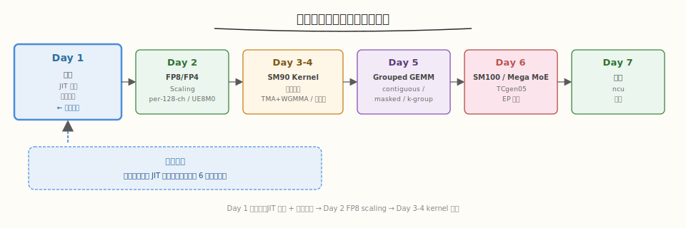
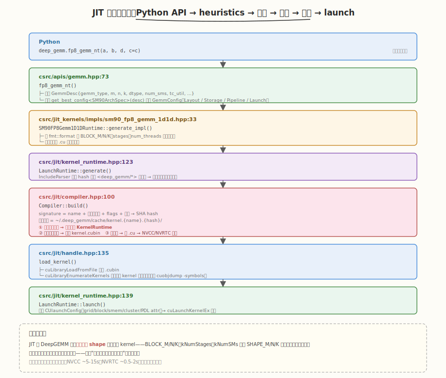
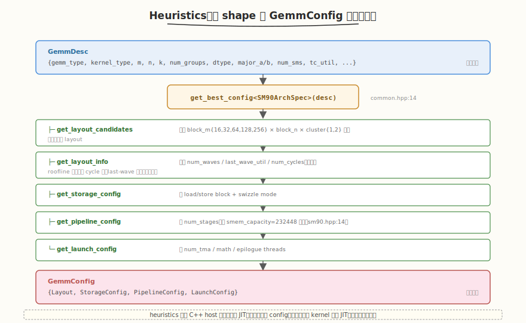

# Day 1（周一）：DeepGEMM 总览与 JIT 环境

> **本周定位**：本专题是 [CUTLASS 专题](../cutlass/README.md)（库视角）与 [CuTe 专题](../cute/README.md)（原语视角）之后的**单点深钻**——拆开一个生产级 FP8/FP4 GEMM kernel 看每一行 PTX 怎么写。本周目标是读懂 DeepGEMM（v2.6.1）的 warp-specialized kernel 源码，跑出 H800 ~1550 TFLOPS，产出源码精读笔记与 ncu 调优报告。
> **前置要求**：已完成 CUTLASS Day 4（三层抽象）、CuTe Day 6（TMA + WGMMA），建议读过 [FlashAttention-3 论文精读](../../paper/flashattention3/README.md) §3-4（warp specialization + FP8 布局工程）
> **今日目标**：理解 DeepGEMM 的定位、设计哲学（"借鉴 CuTe 但不依赖模板代数 + 运行时 JIT"），搭建环境跑通第一个 FP8 GEMM，建立源码地图
> **时间投入**：2.5h（早间 1.5h 精读 + 晚间 1h 跑环境）
> **面试考察度**：⭐⭐⭐ 了解级，能说清 DeepGEMM 是什么、为什么 DeepSeek 要自研

---

## 本日在本周知识图谱中的位置



| 本日产出 | 对应本周验收标准 |
|----------|-----------------|
| JIT 编译运行环境搭好 | ③ FP8 GEMM 达到 85%+ 峰值（前置条件） |
| 源码地图 + 两层架构理解 | ① 能画出 TMA + Math 时序图（Day 3-4 的前提） |
| `test_fp8_fp4.py` 跑通 | ③ 性能数据采集（Day 7 报告的基础） |

---

### 学习任务 1：DeepGEMM 是什么（45 分钟）

#### 阅读内容
- **官方 README**：[DeepGEMM GitHub](https://github.com/deepseek-ai/DeepGEMM)（注意 News 区，从 2025.02 到 2026.04 的演进）
- **背景**：[DeepSeek-V3 技术报告](https://arxiv.org/abs/2412.19437) §4.1 FP8 训练
- **对比阅读**：回顾 [CUTLASS 专题 Day 7](../cutlass/day7.md) 的 Group GEMM

#### 核心要点

DeepGEMM 是 DeepSeek 开源的高性能 tensor core kernel 库，**所有 kernel 在运行时通过轻量 JIT 编译**，安装时无需 CUDA 编译。它把现代 LLM 的核心计算原语——FP8/FP4/BF16 GEMM、融合 MoE（Mega MoE）、MQA scoring、HyperConnection——统一到一个精简 CUDA 代码库里。

| 维度 | cuBLASLt FP8 | CUTLASS 4.x | Triton | DeepGEMM |
|------|--------------|-------------|--------|----------|
| FP8 性能（H800） | 基准 | ~95% cuBLAS | ~80% | ~1550 TFLOPS（~1.0x cuBLAS） |
| 代码可读 | 闭源 | 数十万行模板 | 中等 | 核心 ~3-5 千行，"clean and accessible" |
| JIT | 无 | 编译期模板 | 运行时 | 运行时（NVCC / NVRTC，10x 加速可选） |
| Block scaling | 不支持 | 支持 | 需手写 | 原生 per-128-channel |
| Grouped GEMM | 无 | GemmGroup | 需手写 | M-grouped（contiguous/masked/k-grouped） |
| MoE 融合 | 无 | 无 | 无 | **Mega MoE**（单 kernel 融合 EP+2×GEMM+SwiGLU） |
| 架构支持 | 全架构 | 全架构 | 全架构 | SM90 + SM100 |

> 💡 **一句话总结**：DeepGEMM 的设计哲学——借鉴 CuTe 的 TMA descriptor 与 WGMMA wrapper，但**不用** CuTe 的 Layout 代数与 CUTLASS 的 CollectiveBuilder；用裸 PTX + 轻量封装写到极致可读，靠 JIT 在运行时针对具体 shape 生成最优 kernel。README 原话："avoids heavy reliance on their templates or algebras... clean and accessible resource for learning NVIDIA GPU kernel optimization techniques."

#### 两层实现架构（关键洞察）

DeepGEMM 的 kernel 代码分成**两层**，这是理解整个仓库的钥匙：

| 层 | 路径 | 职责 | 是否编译 |
|----|------|------|----------|
| **Kernel 模板层** | `deep_gemm/include/deep_gemm/impls/*.cuh` | 真正的 CUDA kernel，header-only 模板（`BLOCK_M/N/K` 等都是模板参数） | 安装时**不**编译，被 JIT 生成的代码 `#include` |
| **JIT 胶水层** | `csrc/jit_kernels/impls/*.hpp` | 渲染一段 `.cu` 源码字符串，把模板参数填成编译期常量后实例化 | 运行时首次调用时编译 |

以 SM90 FP8 GEMM 为例，JIT 胶水层 `csrc/jit_kernels/impls/sm90_fp8_gemm_1d1d.hpp:33-64` 的 `generate_impl` 方法用 `fmt::format` 拼出如下字符串：

```cpp
#include <deep_gemm/impls/sm90_fp8_gemm_1d1d.cuh>
using namespace deep_gemm;
static void __instantiate_kernel() {
    auto ptr = reinterpret_cast<void*>(&sm90_fp8_gemm_1d1d_impl<
        8192, 8192, 8192,    // SHAPE_M/N/K（编译期常量，可被编译器折叠）
        1,                    // kNumGroups
        128, 128, 128,        // BLOCK_M/N/K
        128, 128,             // kSwizzleAMode/BMode
        3,                    // kNumStages
        128, 256,             // kNumTMAThreads/MathThreads
        1, false,             // kNumTMAMulticast, kIsTMAMulticastOnA
        80,                   // kNumSMs
        GemmType::Normal, torch::kFloat
    >);
};
```

> ⚠️ **核心设计**：所有调优参数（tile size、stages、线程数、cluster、SM 数）都变成 `uint32_t` 模板参数，编译器能做完全的常量传播与寄存器分配——这是"小代码量达到大库性能"的根本原因。Shape（M/N/K）也被编译进去（`SHAPE_M` 等），让循环边界可被编译器展开优化。

#### Python API 全貌

读 `deep_gemm/__init__.py:17-92`，对外暴露的 API 按功能分组（`__version__ == '2.6.1'`）：

| 分组 | API | 说明 |
|------|-----|------|
| 运行时配置 | `set_num_sms` / `set_tc_util` / `set_pdl` / `set_mk_alignment_for_contiguous_layout` / `set_ignore_compile_dims` / `set_block_size_multiple_of` | 全局调参 |
| cuBLASLt 对照 | `cublaslt_gemm_{nt,nn,tn,tt}` | 性能基准线（非 DeepGEMM kernel） |
| FP8/FP4 GEMM | `fp8_fp4_gemm_{nt,nn,tn,tt}`、`fp8_gemm_{nt,nn,tn,tt}`、`fp8_gemm_nt_skip_head_mid` | Normal GEMM |
| M-Grouped | `m_grouped_fp8_{fp4_,}_gemm_{nt,nn}_contiguous`、`m_grouped_fp8_gemm_nt_masked` | MoE 前向 |
| K-Grouped | `k_grouped_fp8_gemm_{nt,tn}_contiguous` | MoE 权重梯度反向 |
| BF16 GEMM | `bf16_gemm_{nt,nn,tn,tt}` + grouped 变体 | 非 FP8 场景 |
| Einsum | `einsum` / `fp8_einsum` | 融合 Einsum |
| MQA Indexer | `fp8_fp4_mqa_logits` / `fp8_paged_mqa_logits` + `get_paged_mqa_logits_metadata` | V3.2 lightning indexer |
| HyperConnection | `tf32_hc_prenorm_gemm` | DeepSeek-V3 HC 前置 norm |
| Mega MoE | `fp8_fp4_mega_moe` / `bf16_mega_moe` + `SymmBuffer` / `get_symm_buffer_for_mega_moe` / `transform_weights_for_mega_moe` | 单 kernel 融合 EP+2×GEMM+SwiGLU |
| Layout 工具 | `transform_sf_into_required_layout` / `get_tma_aligned_size` / `get_mn_major_tma_aligned_*` | scaling factor 布局转换 |

> 💡 **注意命名**：`fp8_gemm_nt` 走的是 SM90（FP32 scale），`fp8_fp4_gemm_nt` 是统一入口（SM90 走 FP8、SM100 走 FP8 或 FP4）。SM100 支持全部 4 种 layout（NT/TN/NN/TT），SM90 仅 NT。

#### 为什么 DeepSeek 要自己写

1. **236B/671B MoE 训练算力成本高**，FP8 是关键省算力手段（Hopper FP8 = 2× FP16 算力）
2. **标准 per-tensor FP8 在 MoE 上精度不够**，需要 per-128-channel scaling，cuBLASLt 不支持
3. **CUTLASS 模板太重**，迭代慢；Triton 在 Hopper 上达不到峰值（无法精细控制 warp specialization / 寄存器重配 / TMA multicast）
4. **MoE 场景需要 Grouped GEMM + EP 通信融合**，通用库无法做到单 kernel 融合（Mega MoE）
5. 于是自研一个"刚好够用、可读、可改、JIT"的库

#### 版本演进（News 时间线）

| 时间 | 里程碑 | 关键 PR |
|------|--------|---------|
| 2025.02 | 初始发布，FP8 GEMM + per-tensor scaling | — |
| 2025.04 | H800 达 **1550 TFLOPS** | [#74](https://github.com/deepseek-ai/DeepGEMM/pull/74)/[#78](https://github.com/deepseek-ai/DeepGEMM/pull/78)/[#81](https://github.com/deepseek-ai/DeepGEMM/pull/81)/[#86](https://github.com/deepseek-ai/DeepGEMM/pull/86) |
| 2025.05 | NVRTC JIT（10x 编译加速）+ 权重梯度 kernel | [#94](https://github.com/deepseek-ai/DeepGEMM/pull/94)/[#95](https://github.com/deepseek-ai/DeepGEMM/pull/95) |
| 2025.07 | **SM90 + SM100 双架构重构**，低 CPU 开销 JIT CPP 模块 | [#112](https://github.com/deepseek-ai/DeepGEMM/pull/112) |
| 2025.09 | V3.2 MQA scoring kernel（lightning indexer） | [#200](https://github.com/deepseek-ai/DeepGEMM/pull/200) |
| 2026.04 | **Mega MoE** + FP8xFP4 GEMM + FP4 indexer + PDL + 更快 JIT | [#304](https://github.com/deepseek-ai/DeepGEMM/pull/304) |

> ⚠️ **注意**：本专题以 v2.6.1（2026.04+）为基准，覆盖 SM90 + SM100、FP8/FP4、Grouped GEMM、Mega MoE 全部特性。早期版本的 per-tensor scaling 已被 per-128-channel scaling 取代，请以最新代码为准。

### 学习任务 2：JIT 编译机制（45 分钟）

DeepGEMM 最独特的设计是**运行时 JIT**——安装时不编译任何 CUDA，首次调用时按需编译并缓存。核心代码在 `csrc/jit/`。

#### JIT 全流程（含两层架构）



> 💡 **关键洞察**：JIT 让 DeepGEMM 能针对**每个具体 shape** 生成最优 kernel——`BLOCK_M/N/K`、`kNumStages`、`kNumTMAMulticast`、`kNumSMs` 甚至 `SHAPE_M/N/K` 都作为编译期常量嵌入，编译器可充分常量传播与寄存器分配。这是它用"小代码量"达到"大库性能"的核心手段。代价是首次调用有编译延迟（NVRTC 可缓解）。

#### 双编译器：NVCC vs NVRTC

`csrc/jit/compiler.hpp` 定义了两个 `Compiler` 子类，由 `DG_JIT_USE_NVRTC` 环境变量切换（`compiler.hpp:354-360`）：

| 维度 | `NVCCCompiler` | `NVRTCCompiler` |
|------|----------------|-----------------|
| 实现 | 调外部 `nvcc` 命令行（`compiler.hpp:221`） | 调 NVRTC C API（`nvrtcCreateProgram`，`compiler.hpp:313`） |
| 编译速度 | 基准 | **~10x 快**（进程内，无 fork；12.8+ 启用 PCH 进一步加速，`compiler.hpp:271`） |
| 性能 | 最优 | 个别 case 略低（默认不启用） |
| 产物 | `.cubin`（可选 `.ptx`） | `.cubin`（可选 `.ptx`） |
| 架构检测 | `--gpu-architecture=sm_90a` / `sm_100a` | 同（12.9+ 用 `100f` arch family） |
| 共同 flags | `-std=c++20 --ptxas-options=--register-usage-level=10 -O3 --expt-relaxed-constexpr --expt-extended-lambda` | 同 |

> ⚠️ **注意**：2025.07 的 #112 重构中 NVRTC 曾被禁用（README："NVRTC and post-compilation SASS optimization are all disabled"），后来重新支持。当前 v2.6.1 两种都可用。

#### 缓存机制：签名哈希 + 原子重命名

`Compiler::build()`（`compiler.hpp:100-149`）的缓存设计针对**多进程分布式训练**做了精细处理：

1. **签名**：`signature = name + "$$" + compiler_signature + "$$" + flags + "$$" + code`，整体 SHA hash 作为缓存目录名
2. **两层缓存**：内存 `KernelRuntimeCache`（`cache.hpp`，`unordered_map`）+ 磁盘 `~/.deep_gemm/cache/`
3. **原子提交**：先编译到 `tmp/{uuid}/`，`fsync` 目录树后 `rename` 到最终路径——rename 在本地与分布式 FS 上都是原子操作，避免多 rank 竞争
4. **竞争处理**：若 rename 失败（别的 rank 抢先），清理自己的 tmp 目录用已有的（`compiler.hpp:137-143`，注释指出 `remove_all` 在分布式 FS 上并发会 segfault）
5. **头文件失效**：`IncludeParser`（`include_parser.hpp`）递归解析 `#include <deep_gemm/*>`，对每个头文件算 hash 拼成总 hash——改任何 `.cuh` 自动让缓存失效

#### Kernel 加载与发射

`KernelRuntime`（`kernel_runtime.hpp:28-115`）负责把 `.cubin` 加载成可发射的 `CUfunction`：

- **新驱动（≥12.4）**：`cuLibraryLoadFromFile` + `cuLibraryEnumerateKernels`，断言 cubin 里只有 1 个 kernel（`handle.hpp:144-150`）
- **旧驱动**：`cuobjdump -symbols` 解析 ELF 符号表，过滤 `vprintf`/`__assertfail` 等内置符号，找出唯一的 `STT_FUNC + STO_ENTRY` 符号（`kernel_runtime.hpp:56-82`）
- **Driver API 懒加载**：`handle.hpp:14-46` 用 `dlopen("libcuda.so.1")` + `dlsym` 包装所有 `cu*` API，避免与 PyTorch 的 CUDA 初始化冲突
- **发射配置**：`construct_launch_config`（`handle.hpp:174`）设置 grid/block/smem，按需加 `CU_LAUNCH_ATTRIBUTE_CLUSTER_DIMENSION`（cluster）和 `CU_LAUNCH_ATTRIBUTE_PROGRAMMATIC_STREAM_SERIALIZATION`（PDL）两个 attr

> 💡 **可选 Runtime API**：设 `DG_JIT_USE_RUNTIME_API=1`（需 CUDA runtime ≥12.8）可改用 `cudaLibraryLoadFromFile` / `cudaLaunchKernelExC`，绕过 driver API（`handle.hpp:48-114`）。

#### 关键环境变量

| 变量 | 作用 | 默认 |
|------|------|------|
| `DG_JIT_USE_NVRTC` | 用 NVRTC 代替 NVCC（10x 快，个别 case 性能略低） | 0 |
| `DG_JIT_CACHE_DIR` | 编译缓存目录 | `~/.deep_gemm` |
| `DG_JIT_DEBUG` | 打印 JIT 调试信息（生成的源码、编译命令、launch 参数） | 0 |
| `DG_PRINT_CONFIGS` | 打印每个 shape 选中的 config（Layout/Storage/Pipeline/Launch） | 0 |
| `DG_JIT_DUMP_PTX` / `DG_JIT_DUMP_SASS` / `DG_JIT_DUMP_ASM` | dump PTX/SASS（调试用，`ASM` 同时 dump 两者） | 0 |
| `DG_JIT_WITH_LINEINFO` | 嵌入源码行号（ncu profiling 用） | 0 |
| `DG_JIT_PTXAS_CHECK` | 断言无 local memory 使用（寄存器溢出检查） | 0 |
| `DG_JIT_NVCC_COMPILER` | 自定义 NVCC 路径 | `CUDA_HOME/bin/nvcc` |
| `DG_JIT_CPP_STANDARD` | C++ 标准 | 20 |
| `DG_JIT_PRINT_COMPILER_COMMAND` / `DG_JIT_PTXAS_VERBOSE` / `DG_JIT_PRINT_LOAD_TIME` | 打印编译命令 / PTXAS 详细日志 / cubin 加载耗时 | 0 |
| `DG_JIT_USE_RUNTIME_API` | 用 CUDA Runtime API 加载 kernel（需 runtime ≥12.8） | 0 |
| `DG_COMM_KERNEL_DEBUG` | 每次 Mega MoE 调用前清零 symmetric buffer | 0 |
| `DG_USE_NVIDIA_TOOLS` | 在外部 NVIDIA 工具下跳过内部 profiling | 0 |
| `DG_SKIP_CUDA_BUILD` / `DG_FORCE_BUILD` | 安装时跳过 CUDA 编译 / 强制本地编译不下载 wheel | 0 |

#### 运行时调参 API

```python
import deep_gemm

# 限制使用的 SM 数（留 SM 给其他 workload，如通信 kernel）
deep_gemm.set_num_sms(80)

# 设置近似 Tensor Core 利用率（影响 tile 调度策略，0-100）
deep_gemm.set_tc_util(90)

# 启用 PDL（Programmatic Dependent Launch，Hopper+ 的 kernel 间重叠）
deep_gemm.set_pdl(True)

# Grouped GEMM 的 M/K 对齐（必须 ≥ get_theoretical_mk_alignment_for_contiguous_layout）
deep_gemm.set_mk_alignment_for_contiguous_layout(128)

# 让某些维度不编进 kernel（减少 JIT 变体数，但可能损失特化优化）
deep_gemm.set_ignore_compile_dims(True)

# 约束 block_m / block_n 必须是某值的倍数（对齐外部约束）
deep_gemm.set_block_size_multiple_of(block_m_multiple_of=128, block_n_multiple_of=1)
```

除配置外，还有一组 layout 工具（README "Utilities" 一节）：

| 工具 | 作用 |
|------|------|
| `get_theoretical_mk_alignment_for_contiguous_layout(expected_m)` | 计算最小对齐（SM100 下随 m 动态调整 block_m，`runtime.hpp:47`） |
| `transform_sf_into_required_layout` | 把 scaling factor 转成 kernel 要求的 TMA 对齐布局 |
| `get_tma_aligned_size` | 返回 TMA 对齐所需的 size |
| `get_mn_major_tma_aligned_tensor` / `get_mn_major_tma_aligned_packed_ue8m0_tensor` | 生成 MN-major + TMA 对齐的 tensor（后者把 FP32 pack 成 UE8M0） |
| `get_k_grouped_mn_major_tma_aligned_packed_ue8m0_tensor` | K-grouped 场景的 packing kernel |

#### Heuristics：从 shape 到 config

调参背后是 `csrc/jit_kernels/heuristics/` 的启发式选择器。`GemmDesc`（`config.hpp:12`）描述问题，`GemmConfig`（`config.hpp:143`）描述方案：



> 💡 **设计要点**：heuristics 是**纯 C++ host 代码**，不进 JIT 编译，可以快速枚举上百个候选 layout 并用 roofline 模型估算 cycle 数选出最优——而真正执行的 kernel 才走 JIT。这让"选 config"（微秒级）和"编译 kernel"（秒级，有缓存）解耦。

### 学习任务 3：环境搭建与第一个 GEMM（30 分钟）

#### 硬件/软件验证

```bash
# 验证 GPU 架构（需 9.0 或 10.0+）
nvidia-smi --query-gpu=compute_cap,name --format=csv
# 预期输出：9.0, H100 / H800  或  10.0, B200

# 验证 CUDA Toolkit（SM90 需 12.3+，SM100 需 12.9+）
nvcc --version

# 验证 PyTorch（Mega MoE 需 >= 2.9）
python3 -c "import torch; print(torch.__version__)"
```

#### 依赖要求（README "Requirements"）

| 依赖 | 版本 | 说明 |
|------|------|------|
| GPU 架构 | SM90（H100/H800）或 SM100（B200） | 不支持 SM80（A100 走 `legacy/` Triton 回退） |
| CUDA Toolkit | SM90 ≥ 12.3（**推荐 12.9+**）；SM100 ≥ 12.9 | NVCC 12.9+ 会自动做 FFMA interleaving，性能更好 |
| Python | ≥ 3.8 | |
| PyTorch | ≥ 2.1（Mega MoE 需 ≥ 2.9 的对称内存 API） | |
| CUTLASS | ≥ 4.0（Git submodule） | 仅借用 CuTe 头文件，不链接 |
| `{fmt}` | Git submodule | 日志格式化 |
| 编译器 | C++20 支持 | |
| Nsight Compute | ≥ 2024.1 | 能解读 sm_90a 的 WGMMA 指标（Day 7 用） |

#### 三个脚本的区别

| 脚本 | 作用 | 适用 |
|------|------|------|
| `develop.sh` | 链接 cutlass/cute include + `python setup.py build` + 软链 `.so` 到 `deep_gemm/` | 开发调试（改完 C++ 立即生效） |
| `install.sh` | `python setup.py bdist_wheel` + `pip install dist/*.whl --force-reinstall` | 正式安装到 site-packages |
| `build.sh` | 仅 `python setup.py bdist_wheel`（不安装） | CI 打包 |

> ⚠️ **必须 `git clone --recursive`**：CUTLASS 和 fmt 是 submodule，`develop.sh` 会在 `deep_gemm/include` 下软链 `cutlass` / `cute` 目录（`develop.sh:7-8`）。`CMakeLists.txt` 仅供 CLion 索引，真实编译走 `setup.py` + JIT。

#### 跑通第一个 GEMM

```bash
cd DeepGEMM
git submodule update --init --recursive   # 必须
./develop.sh                                # 链接 include + 构建 CPP JIT 模块

# 跑 FP8/FP4 GEMM 正确性 + 性能测试
DG_PRINT_CONFIGS=1 python3 tests/test_fp8_fp4.py   # 加 DG_PRINT_CONFIGS 看 heuristics 选了什么
```

```text
# 预期输出（H800，截取）
Testing GEMM:
 > Perf (m=  8192, n=  8192, k=  8192, 1D1D, layout=NT, BF16, acc=0): 820.0 us | 1550 TFLOPS | ... GB/s | 1.02x cuBLAS
 > Perf (m= 16384, n= 16384, k= 16384, 1D1D, layout=NT, BF16, acc=0): 6.50 ms | 1568 TFLOPS | ... GB/s | 1.01x cuBLAS
Average FP8xFP8 GEMM speedup over cuBLASLt: 1.012x
```

> 💡 **首次运行会有编译延迟**：每个新 shape 第一次调用时触发 JIT 编译（NVCC 约 5-15s，NVRTC 约 0.5-2s），之后命中缓存。`DG_PRINT_CONFIGS=1` 会打印 heuristics 选中的 Layout/Storage/Pipeline/Launch config，帮你理解调参。

### 学习任务 4：建立源码地图（30 分钟）

```
DeepGEMM/
├── deep_gemm/
│   ├── __init__.py             # Python 入口，导出所有 API（__version__='2.6.1'）
│   │                           #   注意末尾 _C.init(library_root, cuda_home) 触发 JIT 模块初始化
│   ├── include/deep_gemm/      # ★ 核心 C++/CUDA 头文件（header-only，被 JIT #include）
│   │   ├── impls/              #   ★ Kernel 模板层（真正的 CUDA kernel）
│   │   │   ├── sm90_fp8_gemm_1d1d.cuh       # Day 3-4 精读：SM90 FP8 GEMM（357 行）
│   │   │   ├── sm90_fp8_gemm_1d2d.cuh       #   SM90 FP8 GEMM 2D scaling（454 行）
│   │   │   ├── sm90_bf16_gemm.cuh           #   SM90 BF16 GEMM（394 行）
│   │   │   ├── sm90_fp8_mqa_logits.cuh      #   SM90 MQA logits（330 行）
│   │   │   ├── sm90_fp8_paged_mqa_logits.cuh#   paged 版（334 行）
│   │   │   ├── sm90_tf32_hc_prenorm_gemm.cuh#   HyperConnection（294 行）
│   │   │   ├── sm100_fp8_fp4_gemm_1d1d.cuh  # Day 6：Blackwell FP8/FP4（538 行）
│   │   │   ├── sm100_bf16_gemm.cuh          #   SM100 BF16（466 行）
│   │   │   ├── sm100_fp8_fp4_mega_moe.cuh   # Day 6：Mega MoE（1460 行，全库最大）
│   │   │   ├── sm100_bf16_mega_moe.cuh      #   BF16 Mega MoE（1282 行）
│   │   │   ├── sm100_mqa_logits.cuh         #   SM100 indexer（593 行）
│   │   │   └── smxx_layout.cuh              #   布局转换（248 行）
│   │   ├── mma/                #   ★ MMA 指令封装
│   │   │   ├── sm90.cuh        #     WGMMA（FP8MMA / BF16MMA / TF32MMA selector）
│   │   │   └── sm100.cuh       #     TCgen05（Blackwell）
│   │   ├── ptx/                #   ★ PTX 内联汇编
│   │   │   ├── wgmma.cuh       #     wgmma.fence / commit_group / wait_group
│   │   │   ├── tcgen05.cuh     #     Blackwell TCgen05 指令
│   │   │   ├── tma.cuh         #     TMA + tensormap.replace PTX
│   │   │   ├── ld_st.cuh       #     ld_shared / st_shared
│   │   │   └── utils.cuh       #     barrier 等
│   │   ├── scheduler/          #   ★ Block 调度器
│   │   │   ├── gemm.cuh        #     持久化调度 + Stream-K
│   │   │   ├── mega_moe.cuh    #     Mega MoE 调度
│   │   │   └── sm90/sm100_{paged_}mqa_logits.cuh
│   │   ├── comm/barrier.cuh    #   mbarrier / grid_sync / nvlink_barrier
│   │   ├── common/             #   utils / math / types / tma_copy / compile / cute_tie / exception
│   │   ├── epilogue/           #   store_cd（sm100 / sm100_swap_ab）/ transform
│   │   └── layout/             #   sym_buffer / mega_moe / mqa_logits
│   ├── legacy/                 # A100 Triton kernel（SM80 回退，m_grouped/k_grouped）
│   ├── mega/                   # Mega MoE Python API（SymmBuffer 等）
│   ├── testing/                # bench_kineto / calc_diff / count_bytes
│   └── utils/                  # dist / layout / math
├── csrc/                       # ★ JIT 基础设施 + API 绑定（编译进 _C.so）
│   ├── python_api.cpp          #   pybind11 入口（28 行，注册 6 个 api 模块）
│   ├── apis/                   #   C++ API 层（Python 调用的第一站）
│   │   ├── gemm.hpp            #     fp8_gemm_nt 等，构造 GemmDesc 并分发（771 行）
│   │   ├── attention.hpp       #     MQA logits
│   │   ├── mega.hpp            #     Mega MoE
│   │   ├── einsum.hpp / hyperconnection.hpp / layout.hpp / runtime.hpp
│   ├── jit/                    #   ★ JIT 编译核心
│   │   ├── compiler.hpp        #     NVCCCompiler + NVRTCCompiler + 缓存逻辑（362 行）
│   │   ├── kernel_runtime.hpp  #     KernelRuntime：加载 cubin + launch（165 行）
│   │   ├── handle.hpp          #     driver API 懒加载 + launch_config（222 行）
│   │   ├── cache.hpp           #     内存级 KernelRuntimeCache（31 行）
│   │   ├── device_runtime.hpp  #     DeviceRuntime：SM 数 / tc_util / PDL / cuBLASLt handle
│   │   └── include_parser.hpp  #     递归 hash <deep_gemm/*> 头文件
│   ├── jit_kernels/            #   ★ JIT 胶水层（渲染 .cu 字符串）
│   │   ├── heuristics/         #     纯 host 代码，选 GemmConfig
│   │   │   ├── config.hpp      #       GemmDesc / GemmConfig / Layout / LayoutInfo 定义
│   │   │   ├── common.hpp      #       get_best_config 模板
│   │   │   ├── sm90.hpp        #       SM90ArchSpec（block_m/n/cluster 候选 + cycle 估算）
│   │   │   ├── sm100.hpp       #       SM100ArchSpec
│   │   │   ├── mega_moe.hpp / runtime.hpp
│   │   └── impls/              #     每个 kernel 的 generate_impl + launch_impl
│   │       ├── sm90_fp8_gemm_1d1d.hpp     #       渲染 sm90_fp8_gemm_1d1d.cuh 实例化（229 行）
│   │       ├── sm90_fp8_gemm_1d2d.hpp / sm90_bf16_gemm.hpp / sm90_fp8_mqa_logits.hpp
│   │       ├── sm100_fp8_fp4_gemm_1d1d.hpp / sm100_fp8_fp4_mega_moe.hpp / ...
│   │       ├── runtime_utils.hpp          #       make_tma_*_desc / get_compiled_dim 工具
│   │       └── smxx_cublaslt.hpp / smxx_layout.hpp
│   ├── utils/                  #   compatibility / exception / format / hash / layout / lazy_init / math / system
│   └── indexing/main.cu        #   仅供 IDE 索引的 dummy 编译目标
├── tests/                      # 测试与 benchmark
│   ├── test_fp8_fp4.py         #   FP8/FP4 GEMM + Grouped（含 cuBLASLt 对照）
│   ├── test_bf16.py            #   BF16 GEMM
│   ├── test_mega_moe.py        #   Mega MoE（多进程 + SymmBuffer）
│   ├── test_attention.py       #   MQA logits（paged/non-paged）
│   ├── test_einsum.py / test_hyperconnection.py / test_layout.py / test_legacy.py
│   └── generators.py           #   测试数据生成器（KernelType / quant_config / enumerate_*）
├── develop.sh / install.sh / build.sh   # 三种构建入口
├── setup.py                     # 打包（含 pyi 生成、wheel 下载逻辑）
└── CMakeLists.txt               # 仅 IDE 索引用，非真实编译
```

> 💡 **再次强调两层结构**：`deep_gemm/include/deep_gemm/impls/*.cuh` 是 kernel 模板（header-only，不编译），`csrc/jit_kernels/impls/*.hpp` 是 JIT 胶水（运行时渲染字符串实例化模板）。读源码时两边的文件名一一对应，先看 `.hpp` 的 `generate_impl` 理解模板参数怎么定，再看 `.cuh` 理解 kernel 本体。

#### 代码规模："clean and accessible" 的实证

| 模块 | 行数 | 说明 |
|------|------|------|
| SM90 FP8 GEMM kernel（`sm90_fp8_gemm_1d1d.cuh`） | 357 | 对比 CUTLASS 同等 kernel 数千行 |
| SM90 JIT 胶水（`sm90_fp8_gemm_1d1d.hpp`） | 229 | 含 TMA descriptor 构造 + launch |
| SM90 heuristics（`sm90.hpp`） | 246 | layout 候选枚举 + cycle 估算 |
| JIT compiler（`compiler.hpp`） | 362 | NVCC + NVRTC + 缓存 |
| 全部 `impls/*.cuh` kernel 模板 | ~6700 | 含 SM90 + SM100 全部 kernel |
| 全部 `csrc/jit_kernels/impls/*.hpp` 胶水 | ~5700 | |

#### 必读源码列表

| 文件 | 内容 | 优先级 | 对应 Day |
|------|------|--------|----------|
| `csrc/jit/compiler.hpp` | JIT 双编译器 + 缓存机制 | ⭐ 必读 | Day 1 |
| `csrc/jit_kernels/heuristics/config.hpp` | GemmDesc / GemmConfig 定义 | ⭐ 必读 | Day 1 |
| `csrc/jit_kernels/impls/sm90_fp8_gemm_1d1d.hpp` | JIT 胶水层范例（generate_impl） | ⭐ 必读 | Day 1 |
| `impls/sm90_fp8_gemm_1d1d.cuh` | SM90 FP8 GEMM 主 kernel | ⭐ 必读 | Day 3-4 |
| `mma/sm90.cuh` | WGMMA 指令封装 + smem desc 构造 | ⭐ 必读 | Day 3 |
| `scheduler/gemm.cuh` | 持久化 + Stream-K 调度器 | ⭐ 必读 | Day 4 |
| `ptx/wgmma.cuh` + `ptx/tma.cuh` | PTX 内联汇编 | ⭐ 必读 | Day 3 |
| `common/types.cuh` | GemmType / KernelType / MmaKind 枚举 | 📌 推荐 | Day 1 |
| `csrc/jit/handle.hpp` | driver API 懒加载 + launch config | 📌 推荐 | Day 1 |
| `impls/sm100_fp8_fp4_mega_moe.cuh` | Mega MoE | 📌 推荐 | Day 6 |
| `comm/barrier.cuh` | mbarrier / grid_sync / nvlink_barrier | 📌 推荐 | Day 4 |

### 面试题积累（本周目标 10-12 道，今日 3 道）

本周逐步积累面试题，今日从"了解级"开始：

**Q1：DeepGEMM 为什么不直接用 CUTLASS 或 Triton？**
> 答：三个原因——① CUTLASS 模板太重、迭代慢，DeepGEMM 靠 JIT 针对每个 shape 生成最优 kernel；② 需要原生 per-128-channel scaling 保 FP8 精度，cuBLASLt 不支持；③ MoE 场景需要 Grouped GEMM + EP 通信融合（Mega MoE），通用库做不到单 kernel 融合。DeepGEMM 借鉴 CuTe 的 TMA/WGMMA wrapper 但不用其 Layout 代数，用裸 PTX 写到极致可读。

**Q2：DeepGEMM 的 JIT 编译流程是什么？为什么用 JIT 而不是预编译？**
> 答：流程：Python API → 构造 GemmDesc → heuristics 选 GemmConfig → `generate_impl` 用 `fmt::format` 渲染 .cu 字符串（把 BLOCK_M/N/K、stages 等填成模板参数）→ NVCC/NVRTC 编译 → 缓存到 `~/.deep_gemm/` → 加载 cubin → `cuLaunchKernelEx` 发射。用 JIT 是因为把 shape 和 tile 参数都编成编译期常量后，编译器能做完全的常量传播与寄存器分配——这是"小代码量达到大库性能"的根本原因。NVRTC 比 NVCC 快 10x（进程内无 fork），但个别 case 性能略低。

**Q3：DeepGEMM 的两层架构是什么？**
> 答：Kernel 模板层（`deep_gemm/include/deep_gemm/impls/*.cuh`，header-only，不编译）+ JIT 胶水层（`csrc/jit_kernels/impls/*.hpp`，运行时渲染字符串实例化模板）。前者是真正的 CUDA kernel 模板，后者用 `fmt::format` 把 heuristics 选出的 BLOCK_M/N/K、stages 等参数填进模板参数列表，生成一段 `#include` kernel 模板的 .cu 源码，交给 NVCC/NVRTC 编译。读源码时两边文件名一一对应。

### 今日检查清单

- [ ] 能说出 DeepGEMM 与 cuBLASLt/CUTLASS/Triton 的定位差异
- [ ] 能解释 DeepSeek 自研的 5 个原因（精度/MoE/JIT/可读/峰值）
- [ ] 能说出**两层架构**：`include/deep_gemm/impls/*.cuh`（kernel 模板） vs `csrc/jit_kernels/impls/*.hpp`（JIT 胶水）
- [ ] 能画出 JIT 全流程：Python API → GemmDesc → heuristics 选 config → generate_impl 渲染 .cu → NVCC/NVRTC 编译 → 缓存 → cubin 加载 → launch
- [ ] 能说出 NVCC vs NVRTC 的取舍（10x 编译速度 vs 个别 case 性能略低）
- [ ] 能解释缓存签名的组成（name + compiler + flags + code + include hash）和原子重命名机制
- [ ] 能说出 `DG_JIT_USE_NVRTC` / `DG_JIT_CACHE_DIR` / `DG_PRINT_CONFIGS` / `DG_JIT_PTXAS_CHECK` 的作用
- [ ] 成功跑通 `test_fp8_fp4.py`，记录 H800/H100 上的 TFLOPS
- [ ] 浏览了 `csrc/jit/` 与 `csrc/jit_kernels/` 目录，标记了 Day 3-4 精读文件

#### 明日预告

Day 2 将深入 FP8/FP4 数据类型与 per-128-channel scaling——DeepGEMM 的"立身之本"。会精读 `sm90_fp8_gemm_1d1d.cuh` 里 scale 从 TMA 加载到 WGMMA promote 的完整数据流，对比 SM90 FP32 软件 scale 与 SM100 UE8M0 硬件 block_scale 的差异。今天跑通环境后，建议先扫一眼 `common/types.cuh` 的 `GemmType` / `KernelType` / `MmaKind` 枚举，为明天做准备。

---
