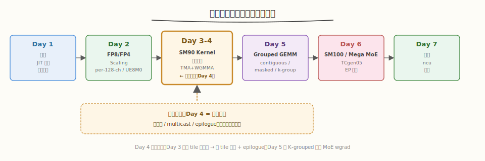
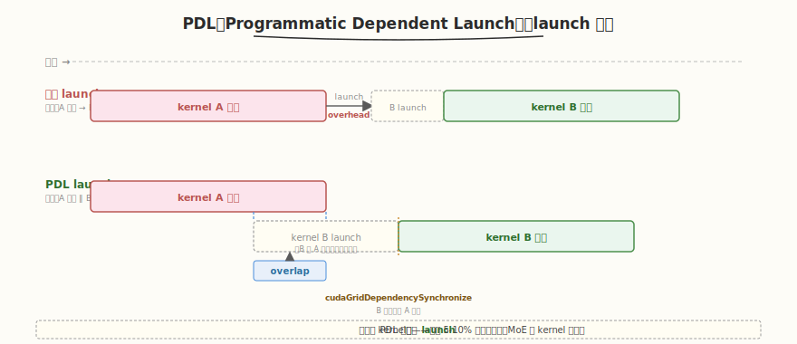
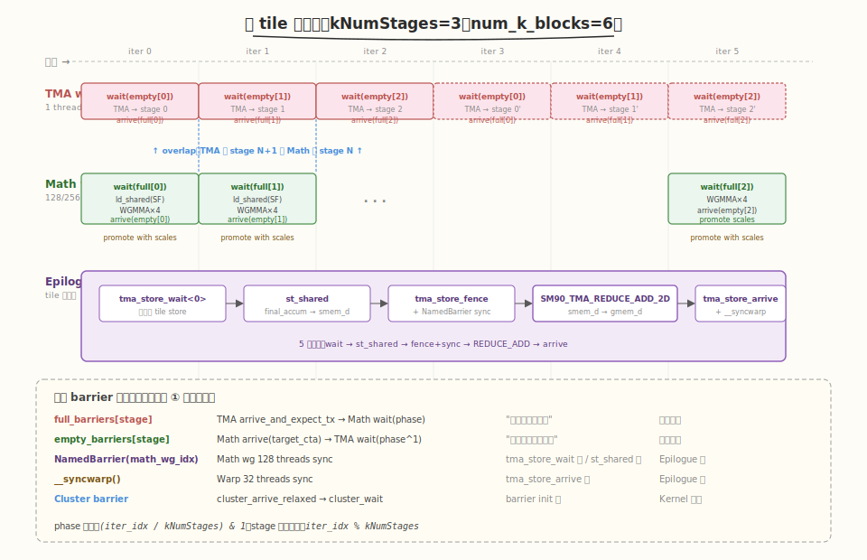
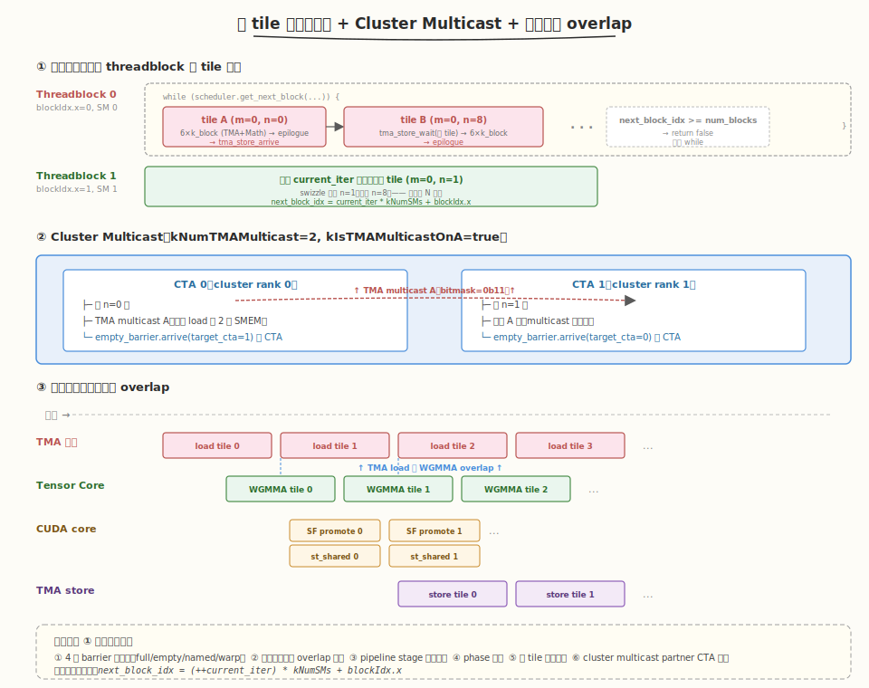

# Day 4（周四）：SM90 FP8 GEMM Kernel 源码精读（下）

> **本周定位**：本专题是 [CUTLASS 专题](../cutlass/README.md)（库视角）与 [CuTe 专题](../cute/README.md)（原语视角）之后的**单点深钻**——拆开一个生产级 FP8/FP4 GEMM kernel 看每一行 PTX 怎么写。
> **前置要求**：已完成 Day 3（TMA warpgroup + Math warpgroup 单 tile 流水线），理解 mbarrier 双 barrier、WGMMA 三件套、寄存器重配
> **今日目标**：精读 `sm90_fp8_gemm_1d1d.cuh` 的**跨 tile 调度与输出回写**——持久化调度器（`scheduler/gemm.cuh`）、L2 友好的 block swizzle、SM90 cluster + TMA multicast、K-grouped 的 `tensormap.replace` 动态替换、epilogue 的 `SM90_TMA_REDUCE_ADD_2D` 回写、PDL（Programmatic Dependent Launch），最后把 Day 3+4 串成完整时序图
> **时间投入**：2.5h（早间 1.5h 精读调度器 + multicast + 晚间 1h 读 epilogue + 画时序图）
> **面试考察度**：⭐⭐⭐⭐⭐ 核心考点，"持久化调度 + cluster multicast + epilogue 三件套"必问

---

## 本日在本周知识图谱中的位置



| 本日产出 | 对应本周验收标准 |
|----------|-----------------|
| 持久化调度器源码精读 + tile 分配公式 | ① 能画出 TMA + Math 时序图并标注 barrier 握手点（跨 tile 维度） |
| Cluster multicast 机制 + `is_tma_multicast_valid` 判定 | ① 同上（multicast 是时序图中的关键分支） |
| Epilogue `SM90_TMA_REDUCE_ADD_2D` 回写流程 | ③ 性能数据采集的前置（理解 store 才能读 ncu 的 store 指标） |
| 完整 TMA + Math 时序图（Day 3+4 串起来） | ① 完成验收标准 ① |
| K-grouped `tensormap.replace` PTX 机制 | ④ Day 5 K-grouped 反向调度的前置 |

> ⚠️ **Day 3 与 Day 4 的分工回顾**：Day 3 读 kernel 主体（TMA 分支 `:170-245` + Math 分支 `:246-348`），重点在**单 tile 内的流水线**。Day 4 读**跨 tile 的调度**（`while (scheduler.get_next_block(...))` 内部的 `get_next_block`）、**cluster multicast 判定**、**K-grouped tensormap 替换**、**epilogue 回写**，最后把这两天的内容串成一张完整的时序图。

---

### 学习任务 1：持久化调度器 `get_next_block`（45 分钟）

这是 Day 4 的**核心精读**内容。读 `scheduler/gemm.cuh:197-287`，理解一个 threadblock 怎么串行吃掉多个 tile。

#### 持久化调度 vs 一次性 launch

DeepGEMM 的 SM90 GEMM kernel 是**持久化 kernel**（persistent kernel）——不是给每个 tile 启动一个 threadblock，而是启动 `kNumSMs` 个 threadblock（H100=132, H800=80），每个 threadblock 在 `while` 循环里不停抓取下一个 tile，直到所有 tile 算完。

读 `sm90_fp8_gemm_1d1d.cuh:179` 和 `:256`，TMA 与 Math 两个分支都套着同一个 `while`：

```cpp
while (scheduler.get_next_block(m_block_idx, n_block_idx)) {
    // ... 处理一个 (m_block_idx, n_block_idx) tile
}
```

#### `get_next_block` 的核心公式

读 `scheduler/gemm.cuh:197-198`：

```cpp
CUTLASS_DEVICE bool get_next_block(uint32_t& m_block_idx, uint32_t& n_block_idx) {
    const auto next_block_idx = (++ current_iter) * kNumSMs + blockIdx.x;
```

- `current_iter`：每个 threadblock 自己维护的迭代计数器（初始 -1，第一次 `++` 后变 0）
- `next_block_idx = current_iter * kNumSMs + blockIdx.x`：**全局 tile 编号**
- `blockIdx.x` ∈ `[0, kNumSMs)`：threadblock 自己的 ID

> 💡 **关键洞察**：这个公式让所有 threadblock 在同一轮 `current_iter` 内并行处理 `kNumSMs` 个不同的 tile（每个 threadblock 拿 `blockIdx.x` 那个），下一轮再各前进一格。**等价于把 tile 列表按 `kNumSMs` 切片轮转分配**——这就是持久化调度的本质。

#### Normal GEMM 的返回逻辑

读 `:275-285`（Normal 分支，最常见）：

```cpp
} else {
    if (next_block_idx >= num_blocks)
        return false;

    // For SM90 only
    is_peer_cta_alive = num_n_blocks % kNumMulticast == 0 or                  // Always aligned on N (constant bypass)
                        num_m_blocks % kNumMulticast == 0 or                  // Always aligned on M (constant bypass)
                        (next_block_idx ^ 1) < num_blocks;                    // Peer CTA in bound
    get_swizzled_block_idx(next_block_idx, m_block_idx, n_block_idx);
}
```

- `num_blocks = num_m_blocks * num_n_blocks`（构造函数 `:94` 计算）
- 超出范围 → 返回 `false`，退出 while 循环
- `is_peer_cta_alive`：cluster multicast 模式下，判断 partner CTA 是否还有 tile 要算（学习任务 3 详解）
- `get_swizzled_block_idx`：把线性 `next_block_idx` 重映射为 `(m_block_idx, n_block_idx)`，做 L2 友好的 swizzle（学习任务 2 详解）

#### 多种 GemmType 的分支

`scheduler/gemm.cuh` 通过 `if constexpr (kGemmType == ...)` 给 6 种 GEMM 类型写不同的 `get_next_block` 分支：

| GemmType | 分支位置 | tile 来源 | 典型场景 |
|----------|---------|----------|---------|
| `Normal` | `:275-285` | `num_m_blocks * num_n_blocks` | 普通 FP8 GEMM |
| `Batched` | `:262-274` | `num_blocks * kNumGroups` | 批量 GEMM |
| `MGroupedContiguous` | 同 Normal | 同 Normal，但 `grouped_layout` 标记每行属于哪个 group | MoE 前向（Day 5） |
| `MGroupedMasked` | `:200-216` | 跨 group 累积的 `current_m_block_cumsum * num_n_blocks` | MoE decode + CUDA graph |
| `MGroupedContiguousWithPsumLayout` | `:217-237` | 动态 `num_m_blocks`（每 group 不同） | MoE 前向 + psum layout |
| `KGroupedContiguous*` | `:238-261` | `(current_num_valid_groups + 1) * num_blocks` | MoE 反向 wgrad（Day 5） |

> ⚠️ **注意**：DeepGEMM 的 SM90 GEMM kernel **只有持久化调度，没有 Stream-K**。`get_next_block` 永远按完整 tile 分配——一个 tile 由一个 threadblock 独立算完。Day 1 README 里提到"持久化调度 + Stream-K"是泛指主题，实际代码用纯持久化。Stream-K（把 K 维切给多个 threadblock 再 reduce）在 Hopper 上不一定有收益，因为 TMA + WGMMA 流水线深度足够掩盖 HBM 延迟，且持久化的 last-wave 利用率问题靠 heuristics 选 `BLOCK_M/N` 让 `num_blocks` 接近 `kNumSMs` 倍数来缓解。

#### Heuristics 如何缓解 last-wave 尾声

读 `csrc/jit_kernels/heuristics/sm90.hpp:201-238`，`get_layout_info` 估算每个 layout 候选的 cycle 数，把 last-wave 利用率纳入代价模型：

```cpp
const auto num_waves = ceil_div(num_blocks, desc.num_sms);
const auto num_last_blocks = num_blocks % desc.num_sms;
const auto last_wave_util = num_last_blocks == 0 ? desc.num_sms : num_last_blocks;
// ...
float wave_efficiency = static_cast<float>(num_blocks) / (num_waves * desc.num_sms);
int64_t num_cycles = std::max(num_l1_cycles, num_l2_cycles) / wave_efficiency;

// Disable multicasting if only one wave exists
if (layout.cluster_n * layout.cluster_m > 1 and num_waves <= 1)
    num_cycles = std::numeric_limits<int64_t>::max();
```

- `wave_efficiency` 反映 last-wave 的"空转比例"——如 `num_blocks=132, num_sms=80` → waves=2, last_wave_util=52, efficiency=132/(2*80)=82.5%
- 把 `num_cycles` 除以 `wave_efficiency` 等价于把 last-wave 的浪费折算回 cycle 数
- 单 wave（`num_blocks <= num_sms`）时禁用 multicast——避免 cluster 内 partner CTA 无活可干

> 💡 **设计要点**：DeepGEMM 不用 Stream-K 而靠 heuristics 选 tile 让 `num_blocks` 接近 `kNumSMs` 倍数。代价模型在数十个 `block_m × block_n × cluster` 候选里挑出 `num_cycles` 最小的，自然把 last-wave 浪费考虑进去。这是"轻量调度 + 准确代价模型"的设计选择，比写 Stream-K 的复杂逻辑简单得多。

### 学习任务 2：L2 友好的 Block Swizzle（30 分钟）

读 `scheduler/gemm.cuh:117-153`，`get_swizzled_block_idx` 把线性 `block_idx` 重映射为 `(m_block_idx, n_block_idx)`，目标是**让相邻 threadblock 在同一时段访问的 gmem 区域相邻**，提升 L2 命中率。

#### 为何需要 swizzle

朴素分配（`m_block_idx = block_idx / num_n_blocks; n_block_idx = block_idx % num_n_blocks`）下，同一轮 `current_iter` 的 `kNumSMs` 个 threadblock 沿 N 轴排开——它们都加载 A 的同一块、B 的不同块。如果 N 跨度大，A 的复用只发生在"同一轮内"，下一轮换 A 块时 L2 已经被 B 挤出去了。

DeepGEMM 用 **group-based swizzle**：把连续若干个 block 编为一组，组内沿次要维度排开，组间沿主要维度推进。这样下一轮的 threadblock 还能命中上一轮组内留在 L2 的 A（或 B）。

#### `kNum1DBlocksPerGroup` 的选择

读 `:14-26`：

```cpp
template <GemmType kGemmType, uint32_t BLOCK_M, uint32_t BLOCK_N, uint32_t kNumSMs, bool kIsMulticastOnA>
static constexpr uint32_t get_num_1d_blocks_per_group() {
    uint32_t num_best_blocks = 0, min_usage = cute::numeric_limits<uint32_t>::max();
    for (const auto candidate: {8u, 16u}) {
        const auto usage = kIsMulticastOnA ?
            candidate * BLOCK_N + math::constexpr_ceil_div(kNumSMs, candidate) * BLOCK_M:  // Grouping on N
            candidate * BLOCK_M + math::constexpr_ceil_div(kNumSMs, candidate) * BLOCK_N;  // Grouping on M
        if (usage < min_usage)
            min_usage = usage, num_best_blocks = candidate;
    }
    return num_best_blocks;
}
```

- 候选值只有 `{8, 16}`——经验值，平衡 L2 复用与组内并行度
- `usage` = 组内"次要维"总字节 + 跨组的"主要维"总字节，越小越好
- `kIsMulticastOnA == true`：组沿 N 排开（复用 A），`usage = candidate * BLOCK_N + ceil(numSMs/candidate) * BLOCK_M`
- `kIsMulticastOnA == false`：组沿 M 排开（复用 B），`usage = candidate * BLOCK_M + ceil(numSMs/candidate) * BLOCK_N`

> 💡 **直觉解释**：candidate 越大，组内越多 threadblock 共享同一个 A 块（节省 A 的 HBM 带宽），但跨组的 B 块数变多（增加 B 的 L2 footprint）。选 8 或 16 让两者乘积最小——本质是 roofline 模型的简化版。

#### Swizzle 公式

读 `:120-152`：

```cpp
const auto primary_num_blocks = kIsMulticastOnA ? num_n_blocks : num_m_blocks;
const auto secondary_num_blocks = kIsMulticastOnA ? num_m_blocks : num_n_blocks;
const auto num_blocks_per_group = secondary_num_blocks * kNum1DBlocksPerGroup;
const auto group_idx = block_idx / num_blocks_per_group;
auto first_block_idx = group_idx * kNum1DBlocksPerGroup;
auto in_group_idx = block_idx % num_blocks_per_group;
num_blocks_in_group = min(kNum1DBlocksPerGroup, primary_num_blocks - first_block_idx);

// Fix unaligned TMA multicast (SM90 only)
#if __CUDA_ARCH__ < 1000
if (kNumMulticast > 1 and num_blocks_in_group % 2 != 0) { ... }
#endif

if constexpr (kIsMulticastOnA) {
    m_block_idx = in_group_idx / num_blocks_in_group;
    n_block_idx = first_block_idx + in_group_idx % num_blocks_in_group;
} else {
    m_block_idx = first_block_idx + in_group_idx % num_blocks_in_group;
    n_block_idx = in_group_idx / num_blocks_in_group;
}
```

- `group_idx`：当前 block 属于第几组
- `first_block_idx`：该组在 primary 维的起始 block 编号
- `num_blocks_in_group`：该组实际 block 数（最后一组可能不足 `kNum1DBlocksPerGroup`）
- `in_group_idx`：组内线性偏移

`kIsMulticastOnA == false`（multicast 在 B，组沿 M 排开）时：
- `m_block_idx = first_block_idx + in_group_idx % num_blocks_in_group`：组内沿 M 推进（复用 B）
- `n_block_idx = in_group_idx / num_blocks_in_group`：跨组沿 N 推进

> ⚠️ **奇数对齐修正**（`:132-142`，SM90 专属）：multicast 需要 cluster 内 2 个 CTA 配对，但 `num_blocks_in_group` 可能是奇数。代码在 SM90 上动态调整：把奇数组的最后一个 block 拆出去单算（multicast=1），保证前 `num_blocks_in_group ^ 1` 个 block 都是成对的。SM100 用 2-CTA 硬件机制，无法动态禁用 multicast，所以这段代码用 `__CUDA_ARCH__ < 1000` 包住。

#### `get_global_idx`：把 block_idx 翻译成 gmem 偏移

读 `:155-186`，给定 `(m_block_idx, n_block_idx)` 后，还要算出实际的 gmem 地址偏移。这里 `GemmType` 再次分支：

| GemmType | M 偏移 | N 偏移 | K 偏移 | SF_K 偏移 |
|----------|--------|--------|--------|-----------|
| `Normal` | `m_block_idx * BLOCK_M` | `n_block_idx * BLOCK_N` | 0 | 0 |
| `MGroupedContiguous` | `group_offset * shape_n + m_block_idx * BLOCK_M` | 同 Normal | 0 | 0 |
| `MGroupedMasked` | `current_group_idx * shape_n + m_block_idx * BLOCK_M` | 同 Normal | 0 | 0 |
| `KGroupedContiguous*` | 同 Normal | 同 Normal | `current_k_cumsum` 或 `current_k_start` | `current_sf_k_cumsum` |

`IndexType` 模板参数（`:11`）区分 MN / K / SF_K 三种索引维度，因为 K-grouped 的 K 偏移与 MN 偏移来源不同。

### 学习任务 3：SM90 Cluster + TMA Multicast（45 分钟）

Hopper 的 cluster（线程块集群）允许 2 个 CTA 共享 SMEM 并通过 TMA multicast 一次性把数据搬到两个 CTA 的 SMEM。DeepGEMM 在 SM90 上用 cluster=2 做数据复用。

#### Cluster 是什么

cluster 是 Hopper 引入的层级——介于 grid 和 block 之间：
- 一个 cluster 含 1-8 个 CTA（DeepGEMM 只用 2）
- 同 cluster 的 CTA 共享 **distributed shared memory**（DSMEM）：可以互相访问对方的 SMEM
- TMA 支持 **multicast**：一次 `cp.async.bulk.tensor` 把数据同时写到 cluster 内多个 CTA 的 SMEM

读 `csrc/jit_kernels/heuristics/sm90.hpp:71-75`，cluster 候选只有 `{1×1, 1×2, 2×1}`，且 `cluster_m * cluster_n <= 2`：

```cpp
for (int cluster_m = 1; cluster_m <= (disable_multicast ? 1 : 2); ++ cluster_m) {
    for (int cluster_n = 1; cluster_n <= (disable_multicast ? 1 : 2); ++ cluster_n) {
        if (cluster_m * cluster_n > 2) continue;     // We only support cluster 2
        if (desc.num_sms % (cluster_m * cluster_n) != 0) continue;
```

- `cluster_m=2, cluster_n=1`：2 CTA 沿 M 排开 → multicast B（两个 CTA 共享同一 B 块，各算不同 M 行）→ `kIsTMAMulticastOnA = false`
- `cluster_m=1, cluster_n=2`：2 CTA 沿 N 排开 → multicast A（两个 CTA 共享同一 A 块，各算不同 N 列）→ `kIsTMAMulticastOnA = true`

#### Multicast 的判定

读 `scheduler/gemm.cuh:289-307`：

```cpp
CUTLASS_DEVICE bool is_tma_multicast_valid(const uint32_t& m_block_idx) const {
    if (num_blocks_in_group == 1)
        return false;                    // 组里只剩自己，没法配对
    if constexpr (kGemmType == GemmType::Normal or kGemmType == GemmType::MGroupedMasked or
                  is_k_grouped_contiguous(kGemmType) or kGemmType == GemmType::Batched or
                  kGemmType == GemmType::MGroupedContiguousWithPsumLayout) {
        return true;
    } else {
        DG_STATIC_ASSERT(kGemmType == GemmType::MGroupedContiguous, "Invalid Gemm type");
        if constexpr (kIsMulticastOnA) {
            return true;
        } else {
            // multicast 在 B，要求两个 CTA 的 M 行属于同一 group
            const auto group_idx = grouped_layout[m_block_idx * BLOCK_M];
            const auto peer_group_idx = grouped_layout[(m_block_idx ^ 1) * BLOCK_M];
            return group_idx == peer_group_idx;
        }
    }
}
```

- `num_blocks_in_group == 1`：组里就一个 block，没法配对，禁用 multicast
- 大部分 GemmType 默认 multicast 有效（因为 A 或 B 是按 block 独立的）
- **`MGroupedContiguous` + multicast on B 是例外**：两个 CTA 共享 B 块时，要求它们算的 M 行属于同一个 expert group——否则不同 group 的 B 完全不同，multicast 没意义。代码用 `m_block_idx ^ 1` 找到 partner CTA 的 m_block_idx（异或 1 翻转最低位），对比 `grouped_layout` 里两行所属的 group

#### Multicast 的发射

读 `sm90_fp8_gemm_1d1d.cuh:182-184`（TMA warpgroup 分支内）：

```cpp
const bool is_tma_multicast_valid = scheduler.is_tma_multicast_valid(m_block_idx);
const uint32_t num_tma_multicast_a = (kIsTMAMulticastOnA and is_tma_multicast_valid) ? kNumTMAMulticast : 1;
const uint32_t num_tma_multicast_b = (not kIsTMAMulticastOnA and is_tma_multicast_valid) ? kNumTMAMulticast : 1;
DG_STATIC_ASSERT(kNumTMAMulticast <= 2, "Scheduler does not support > 2 TMA multicast");
```

- 只有一个 operand 走 multicast：A multicast 时 B 单播，反之亦然
- `kNumTMAMulticast` 是编译期常量（1 或 2），决定 `num_tma_multicast_*` 是 1 还是 2

读 `common/tma_copy.cuh:36-56`，multicast 的 TMA 发射分架构处理：

```cpp
} else {
    #if (defined(__CUDA_ARCH__) and (__CUDA_ARCH__ >= 1000))
        // SM100: 2-CTA 硬件机制，发信号给 leader CTA
        #pragma unroll
        for (uint32_t i = 0; i < BLOCK_INNER / BLOCK_INNER_ATOM; ++ i) {
            cute::SM100_TMA_2SM_LOAD_2D::copy(desc_ptr, ...);
        }
    #elif (defined(__CUDA_ARCH__) and (__CUDA_ARCH__ >= 900))
        if (cute::block_rank_in_cluster() == 0) {
            #pragma unroll
            for (uint32_t i = 0; i < BLOCK_INNER / BLOCK_INNER_ATOM; ++ i) {
                cute::SM90_TMA_LOAD_MULTICAST_2D::copy(desc_ptr, ...,
                    (1 << num_tma_multicast) - 1, ...);   // bitmask = (1<<2)-1 = 0b11
            }
        }
    #endif
}
```

| 架构 | Multicast 指令 | 谁发射 | Bitmask |
|------|----------------|--------|---------|
| SM90 | `SM90_TMA_LOAD_MULTICAST_2D` | 只 cluster 内 rank 0 的 CTA | `(1 << num_tma_multicast) - 1` = 0b11 |
| SM100 | `SM100_TMA_2SM_LOAD_2D` | leader CTA（硬件 2-CTA 协议） | 硬件隐式 |

> 💡 **SM90 vs SM100 multicast 的差异**：SM90 是"软" multicast——leader CTA 发射时带个 bitmask，TMA 硬件按 bitmask 把数据复制到指定 CTA 的 SMEM；可以动态禁用（`num_tma_multicast=1` 退化为单播）。SM100 是"硬" 2-CTA 协议，一旦启用 cluster=2 就**必须** 2-CTA 一起发射，不能动态降级——这就是为什么 swizzle 里那段奇数修正用 `__CUDA_ARCH__ < 1000` 包起来。

#### Empty barrier 的 cluster arrive

读 `sm90_fp8_gemm_1d1d.cuh:266-273`（Math warpgroup 内的 empty barrier arrive）：

```cpp
auto empty_barrier_arrive = [&](uint32_t s) {
    if constexpr (kNumTMAMulticast == 1) {
        lane_idx == 0 ? empty_barriers[s]->arrive() : void();
    } else {
        auto target_cta = scheduler.is_peer_cta_alive ? lane_idx : cute::block_rank_in_cluster();
        lane_idx < kNumTMAMulticast ? empty_barriers[s]->arrive(target_cta) : void();
    }
};
```

- 单播模式：每 warp 一个 lane（`lane_idx == 0`）arrive 自己的 empty barrier
- Multicast 模式：用 `arrive(target_cta)` 跨 CTA arrive——`lane_idx` 0/1 分别 arrive 到 CTA 0/1 的 empty barrier
- `is_peer_cta_alive`：partner CTA 已经没活可干（last wave 不齐整时），arrive 到自己的 cluster rank（`block_rank_in_cluster()`）避免死锁

> ⚠️ **跨 CTA barrier 的关键陷阱**：multicast 模式下 `empty_barriers` 是 **distributed barrier**——`init(kNumTMAMulticast * kNumMathThreads / 32)`（`:140`）的 arrive count 包含 partner CTA 的 warps。如果 partner CTA 提前退出（`is_peer_cta_alive=false`），就必须改 arrive 到自己，否则 barrier 永远翻不转——死锁。

### 学习任务 4：K-grouped 的 `tensormap.replace` PTX（30 分钟）

K-grouped GEMM（MoE 权重梯度反向，Day 5 详解）的每个 group 有不同的 K 维度和不同的 gmem 起始地址。DeepGEMM 不重新构造 TMA descriptor，而是用 PTX `tensormap.replace` 指令在 SMEM 里**原地修改** descriptor。

读 `sm90_fp8_gemm_1d1d.cuh:191-215`：

```cpp
if (kGemmType == GemmType::KGroupedContiguous and last_group_idx != scheduler.current_group_idx) {
    last_group_idx = scheduler.current_group_idx;

    // Directly update current tensor map
    const uint64_t current_k_offset = scheduler.current_k_cumsum;
    ptx::tensor_map_replace_global_addr_in_smem(smem_tensor_map_a, gmem_a_ptr + current_k_offset * shape_m);
    ptx::tensor_map_replace_global_addr_in_smem(smem_tensor_map_b, gmem_b_ptr + current_k_offset * shape_n);
    ptx::tensor_map_replace_global_inner_dim_stride_in_smem(smem_tensor_map_a, scheduler.current_shape_k, scheduler.current_shape_k);
    ptx::tensor_map_replace_global_inner_dim_stride_in_smem(smem_tensor_map_b, scheduler.current_shape_k, scheduler.current_shape_k);

    // Make sure the tensor maps are not used by in-flight TMA loads before updating GMEM
    cute::tma_desc_commit_group();
    cute::tma_desc_wait_group();
    __syncwarp(1u << lane_idx);

    *(gmem_tensor_map_a) = *(smem_tensor_map_a);
    *(gmem_tensor_map_b) = *(smem_tensor_map_b);
    ptx::tensor_map_release_gpu();
    ptx::tensor_map_acquire_gpu(gmem_tensor_map_a);
    ptx::tensor_map_acquire_gpu(gmem_tensor_map_b);
}
```

读 `ptx/tma.cuh:18-32` 看对应 PTX：

```cpp
CUTLASS_DEVICE void tensor_map_replace_global_addr_in_smem(cute::TmaDescriptor* smem_desc, const void* new_addr) {
    auto smem_int_desc = static_cast<uint32_t>(__cvta_generic_to_shared(smem_desc));
    const auto new_int64_addr = reinterpret_cast<uint64_t>(new_addr);
    asm volatile ("tensormap.replace.tile.global_address.shared::cta.b1024.b64 [%0], %1;" :: "r"(smem_int_desc), "l"(new_int64_addr));
}

CUTLASS_DEVICE void tensor_map_replace_global_inner_dim_stride_in_smem(cute::TmaDescriptor* smem_desc, const uint32_t& new_dim, const uint64_t& new_stride) {
    auto smem_int_desc = __cvta_generic_to_shared(smem_desc);
    asm volatile ("tensormap.replace.tile.global_dim.shared::cta.b1024.b32 [%0], 0, %1;" :: "l"(smem_int_desc), "r"(new_dim));
    asm volatile("tensormap.replace.tile.global_stride.shared::cta.b1024.b64 [%0], 0, %1;" :: "l"(smem_int_desc), "l"(new_stride));
}
```

#### 替换流程（7 步）

1. **检测 group 切换**：`last_group_idx != scheduler.current_group_idx`——每个 group 第一次进入时执行一次
2. **替换 gmem 地址**：A/B 的 base pointer 加上 `current_k_cumsum * shape_m` / `* shape_n` 偏移
3. **替换 inner dim 与 stride**：`current_shape_k` 是该 group 的实际 K，要写进 dim 和 stride
4. **commit + wait**：`tma_desc_commit_group` + `tma_desc_wait_group` 确保之前在飞的 TMA load 不再用旧 descriptor
5. **`__syncwarp(1u << lane_idx)`**：防止 ptxas 把后续 gmem store 重排到 wait 前
6. **拷贝 SMEM desc → GMEM desc**：把改好的 descriptor 写回 GMEM（每个 CTA 一份，`gmem_tensor_map_a = tensor_map_buffer + blockIdx.x * 2`，`:99`）
7. **fence proxy**：`tensor_map_release_gpu`（`fence.proxy.tensormap::generic.release.gpu`）+ `tensor_map_acquire_gpu`（`fence.proxy.tensormap::generic.acquire.gpu`）——让 tensormap 修改对 TMA 引擎可见

> 💡 **关键设计**：descriptor 改在 SMEM（PTX 只支持 SMEM 内的 `tensormap.replace`），但 TMA 引擎读的是 GMEM 的 descriptor（`gmem_tensor_map_a`）。所以要先在 SMEM 改，再拷回 GMEM，最后用 fence proxy 让 TMA 引擎看到新版本。
>
> 为什么不直接构造新 descriptor？因为 `cuTensorMapEncodeTiled` 是 host API，device 上不能用；`tensormap.replace` 是 device 上唯一能修改 descriptor 的方式，且只支持替换地址/维度/stride 三个字段，其他字段（swizzle、elem type 等）保持不变。
>
> 代价：每个 group 切换有 ~10-20 cycle 的 fence 开销。但 K-grouped 的 K 通常很大（一次算完一个 expert 的 wgrad），切换频率低，开销可忽略。

#### Tensor map buffer 的分配

读 `csrc/apis/gemm.hpp:387-390`（K-grouped NT 路径，调用方分配 buffer）：

```cpp
const auto num_sms = device_runtime->get_num_sms();
const auto tensor_map_buffer = torch::empty({num_sms * 4 * static_cast<int>(sizeof(CUtensorMap))},
                                            a.first.options().dtype(torch::kByte));
```

- 每个 SM 一个 CTA，每个 CTA 2 个 descriptor（A 和 B），每个 `CUtensorMap` 128 字节
- 总大小 = `num_sms * 2 * 128` 字节（H100=132×256=33KB，H800=80×256=20KB）
- `*4` 是预留双缓冲（虽然实际只用单缓冲）

### 学习任务 5：Epilogue —— SMEM 暂存 + TMA_REDUCE_ADD 回写（45 分钟）

读 `sm90_fp8_gemm_1d1d.cuh:322-346`，理解 WGMMA 输出的 FP32 accumulator 如何写回 gmem。这是 Day 4 的**第二处核心精读**。

#### Epilogue 的 5 步流程

```cpp
// Step 1: 等上一个 tile 的 TMA store 完成
if (warp_idx % 4 == 0 and cute::elect_one_sync())
    cute::tma_store_wait<0>();
cutlass::arch::NamedBarrier::sync(128, math_wg_idx);

// Step 2: 把 final_accum 写到 smem_d
const auto smem_d_0 = reinterpret_cast<float2*>(smem_d + r_0 * BLOCK_N + col_idx * 2);
const auto smem_d_1 = reinterpret_cast<float2*>(smem_d + r_1 * BLOCK_N + col_idx * 2);
#pragma unroll
for (auto i = 0; i < WGMMA::kNumAccum / 4; ++ i) {
    ptx::st_shared(smem_d_0 + i * 4, {final_accum[i * 4 + 0], final_accum[i * 4 + 1]});
    ptx::st_shared(smem_d_1 + i * 4, {final_accum[i * 4 + 2], final_accum[i * 4 + 3]});
}

// Step 3: fence + sync 确保 smem_d 全部写完
cute::tma_store_fence();
cutlass::arch::NamedBarrier::sync(128, math_wg_idx);

// Step 4: 用 TMA_REDUCE_ADD 把 smem_d 写回 gmem_d
if (warp_idx % 4 == 0 and cute::elect_one_sync()) {
    cute::SM90_TMA_REDUCE_ADD_2D::copy(
        &tensor_map_cd, smem_d_0, n_block_idx * BLOCK_N,
        current_group_idx * shape_m + m_block_idx * BLOCK_M + r_0);
    cute::tma_store_arrive();
}
__syncwarp();
```

#### Step 1：等前一个 tile 的 store

`cute::tma_store_wait<0>()`（`ptx/tma.cuh:92`）等所有在飞的 TMA store 完成。**为什么需要等？** 因为 `smem_d` 是**单一 buffer**（不是 pipeline）——上一个 tile 的 TMA store 还在从 `smem_d` 读数据时，不能覆盖。

- `warp_idx % 4 == 0`：每个 math warpgroup 的第 0 个 warp（即 warp 0、warp 4）执行
- `elect_one_sync()`：warp 内 32 lane 只 1 个执行
- `NamedBarrier::sync(128, math_wg_idx)`：等整个 math warpgroup（128 线程）都到齐，用 `math_wg_idx`（0 或 1）作 barrier id 区分两个 warpgroup

> 💡 **NamedBarrier**：Hopper 的 named barrier 是 SMEM 内的同步原语，最多支持 32 个具名 barrier。`sync(128, math_wg_idx)` 让 128 个线程在 `math_wg_idx` 号 barrier 上集合——比 `__syncthreads()`（同步整个 block）更细粒度，避免 TMA warpgroup 被牵连进来。

#### Step 2：写 smem_d

每个 lane 把自己的 `final_accum`（Day 3 学习任务 5 讲过 lane 到 accum 的映射）写到 `smem_d` 对应位置：

- `smem_d_0 = smem_d + r_0 * BLOCK_N + col_idx * 2`：lane 负责的第 0 行
- `smem_d_1 = smem_d + r_1 * BLOCK_N + col_idx * 2`：lane 负责的第 1 行（`r_1 = r_0 + 8`）
- `final_accum[i*4+0/1/2/3]` 对应 `(r_0, col*2), (r_0, col*2+1), (r_1, col*2), (r_1, col*2+1)` 四个元素

`st_shared` 是裸 PTX `st.shared.v2.f32`（`ptx/ld_st.cuh:136`），写 8 字节（两个 float）。

#### Step 3：fence + sync

- `tma_store_fence()`：SMEM 写→TMA store 之间必须 fence，否则 TMA 引擎可能读到旧数据
- 第二次 `NamedBarrier::sync(128, math_wg_idx)`：等所有 lane 都写完 smem_d，TMA store 才能开始读

#### Step 4：TMA_REDUCE_ADD 回写

`SM90_TMA_REDUCE_ADD_2D::copy` 是带原子加的 TMA store——把 `smem_d` 的 FP32 数据**加到** gmem_d 对应位置。

为什么用 REDUCE_ADD 而不是普通 store？三个原因：

1. **`with_accumulation` 场景**：用户传 `c`（C += A @ B），host 端 `early_return`（`apis/gemm.hpp:42-44`）把 c 拷到 d 后，kernel 还需要做 `d += A@B`——REDUCE_ADD 完成这个加法
2. **多 math warpgroup 安全**：BLOCK_M=128 时有 2 个 math warpgroup，每个写自己负责的 64 行——不重叠，理论上不需要 atomic。但 REDUCE_ADD 是统一接口，覆盖所有场景
3. **Cluster multicast 模式下的潜在重叠**：极端情况下两个 CTA 可能计算同一输出 tile（虽然 swizzle 通常避免），REDUCE_ADD 保证语义正确

#### Step 5：arrive 与 syncwarp

- `tma_store_arrive()`：通知 TMA store 已发射（非阻塞，TMA 自己异步完成）
- `__syncwarp()`：让 warp 内所有 lane 同步，确保 `tma_store_arrive` 的副作用对全 warp 可见

#### `store_block_m = 64` 的设计

读 `csrc/jit_kernels/heuristics/sm90.hpp:128-130`：

```cpp
const auto store_block_m = desc.kernel_type == KernelType::Kernel1D1D ? wgmma_m : layout.block_m;
```

1D1D kernel 的 store_block_m 固定为 `wgmma_m = 64`，而不是 `BLOCK_M`。原因：TMA store 的 smem 数据布局必须是 WGMMA accumulator 的"自然布局"——每个 math warpgroup 独立 store 自己的 64 行，不需要跨 warpgroup 拼接。这让 `st_shared` 的地址计算简单（每个 lane 直接写自己寄存器对应的元素），代价是要发射 2 次 TMA store（BLOCK_M=128 时）。

### 学习任务 6：PDL（Programmatic Dependent Launch）（30 分钟）

PDL 是 Hopper+ 的 kernel 间重叠机制——让下一个 kernel 在当前 kernel 还没结束时就开始 launch 与初始化。DeepGEMM 在 `set_pdl(True)` 时启用。

#### `cudaGridDependencySynchronize`

读 `sm90_fp8_gemm_1d1d.cuh:158`，kernel 主体最开头（barrier init 之后、调度器之前）：

```cpp
cudaGridDependencySynchronize();
```

这是 PDL 的核心 API——kernel 在此处 signal 上游"我已经初始化好了，你可以提前退出了"，然后等下游依赖。**PDL 不是流水线 kernel，而是流水线 launch**：



`cudaGridDependencySynchronize` 在 kernel B 内部，表示"B 在此处等 A 完成"。在这条指令之前，B 可以做初始化（如 DeepGEMM 的 barrier init、SMEM 分配、scheduler 构造）。

#### Launch config 里的 PDL attr

读 `csrc/jit/handle.hpp:174-213`，`construct_launch_config` 根据 `enable_pdl` 加 launch attr：

```cpp
if (cluster_dim > 1) {
    auto& attr = attrs[config.numAttrs ++];
    attr.id = CU_LAUNCH_ATTRIBUTE_CLUSTER_DIMENSION;
    attr.value.clusterDim.x = static_cast<unsigned>(cluster_dim);
    // ...
}

if (enable_pdl) {
    auto& attr = attrs[config.numAttrs ++];
    attr.id = CU_LAUNCH_ATTRIBUTE_PROGRAMMATIC_STREAM_SERIALIZATION;
    attr.value.programmaticStreamSerializationAllowed = 1;
}
```

- `CU_LAUNCH_ATTRIBUTE_CLUSTER_DIMENSION`：声明 cluster 大小（必须 launch 时声明，不能 kernel 内改）
- `CU_LAUNCH_ATTRIBUTE_PROGRAMMATIC_STREAM_SERIALIZATION`：启用 PDL，告诉 driver 这个 kernel 内会调 `cudaGridDependencySynchronize`，允许重叠 launch

> 💡 **PDL 的实战价值**：MoE 推理时一个 batch 里要跑几十个 GEMM + 通信 kernel，传统串行 launch 的 overhead 会累积。PDL 让相邻 kernel 的 launch 重叠，可节省 5-10% 端到端延迟。代价是 kernel 内必须有显式的 `cudaGridDependencySynchronize` 调用——DeepGEMM 在所有 kernel 主体最开头都加了一行，所以 `set_pdl(True)` 是全局开关。

#### SMEM 与 cluster 的 launch 参数

`construct_launch_config` 还设置：
- `cuFuncSetAttribute(kernel, CU_FUNC_ATTRIBUTE_MAX_DYNAMIC_SHARED_SIZE_BYTES, smem_size)`：声明最大动态 SMEM（H100 上限 228KB，超过会降级 occupancy）
- grid/block dim、stream

DeepGEMM 的 SMEM 用法接近上限——以 `BLOCK_M=128, BLOCK_N=128, kNumStages=3` 为例，SMEM 占用 ≈ 64KB(D) + 48KB(A) + 48KB(B) + 1.5KB(SFA) + 1.5KB(SFB) + barrier ≈ 163KB（`sm90_fp8_gemm_1d1d.cuh:189`），所以每个 SM 只能跑 1 个 threadblock（occupancy=1）。`__launch_bounds__(kNumTMAThreads + kNumMathThreads, 1)`（`:39`）显式声明 occupancy=1。

### 学习任务 7：完整 TMA + Math 时序图（45 分钟）

把 Day 3 + Day 4 串起来，画一张覆盖**两个 tile 的完整时序图**——这是本周验收标准 ① 的产出。

#### 单 tile 内的时序（Day 3 回顾）



#### 跨 tile 的持久化时序（Day 4 新增）



#### 完整 barrier 握手点（验收标准 ① 的核心）

| Barrier | 谁 arrive | 谁 wait | 触发条件 | 阶段 |
|---------|----------|---------|----------|------|
| `full_barriers[stage]` | TMA `arrive_and_expect_tx(bytes)` | Math `wait(phase)` | 4 个 TMA（A/B/SFA/SFB）都完成 | 流水线内 |
| `empty_barriers[stage]` | Math `arrive(target_cta)` | TMA `wait(phase^1)` | Math 用完 smem 数据 | 流水线内 |
| `NamedBarrier(math_wg_idx)` | Math warpgroup 128 线程 | Math warpgroup 128 线程 | tma_store_wait 后 / st_shared 后 | Epilogue 内 |
| `__syncwarp()` | Warp 32 线程 | Warp 32 线程 | tma_store_arrive 后 | Epilogue 内 |
| Cluster barrier | `cluster_arrive_relaxed` | `cluster_wait` | barrier init 后 | Kernel 启动 |

#### 三类异步单元的并发（Day 3 学习任务 1 的延伸）

> 💡 **本周验收 ① 的画图要点**：
> 1. 标出 4 个 barrier 握手点（full/empty/named/warp）
> 2. 标出三类异步单元的 overlap 区间
> 3. 标出 pipeline stage 的循环复用（`iter_idx % kNumStages`）
> 4. 标出 phase 的翻转（`(iter_idx / kNumStages) & 1`）
> 5. 标出持久化调度跨 tile 的串行衔接（epilogue → 下一个 tile 的 TMA）
> 6. 标出 cluster multicast 的 partner CTA 协作（empty barrier 的 `arrive(target_cta)`）

### 面试题积累（本周目标 10-12 道，今日 4 道）

**Q11：DeepGEMM 的持久化调度是怎么做的？为什么不用 Stream-K？**
> 答：`get_next_block` 公式 `next_block_idx = (++current_iter) * kNumSMs + blockIdx.x`——启动 `kNumSMs` 个 threadblock，每个在 while 循环里按 round-robin 抓 tile。不用 Stream-K 的原因：① TMA + WGMMA 流水线深度足够掩盖 HBM 延迟，K 维再切分收益有限；② Stream-K 需要跨 threadblock reduce，增加 SMEM 与同步开销；③ heuristics 用 `wave_efficiency` 代价模型挑 `BLOCK_M/N` 让 `num_blocks` 接近 `kNumSMs` 倍数，缓解 last-wave 尾声。这是"轻量调度 + 准确代价模型"的设计选择。

**Q12：SM90 的 TMA multicast 怎么工作？什么时候启用？**
> 答：cluster=2（2 个 CTA 沿 M 或 N 排开）时启用。`kIsTMAMulticastOnA=true` 沿 N 排开 multicast A（2 CTA 共享 A，各算不同 N），`=false` 沿 M 排开 multicast B。发射：SM90 由 cluster rank 0 的 CTA 调 `SM90_TMA_LOAD_MULTICAST_2D` 带 bitmask=0b11；SM100 改用硬件 2-CTA 协议（`SM100_TMA_2SM_LOAD_2D`），不能动态降级。判定 `is_tma_multicast_valid`：组里至少 2 个 block，且 `MGroupedContiguous + multicast on B` 时要求 partner CTA 的 M 行属于同一 expert group。empty barrier 用 `arrive(target_cta)` 跨 CTA arrive，partner 提前退出时改 arrive 到自己防死锁。

**Q13：Epilogue 为什么用 `SM90_TMA_REDUCE_ADD_2D` 而不是普通 TMA store？**
> 答：三个原因：① 支持 `with_accumulation`（用户传 C，做 D = C + A@B），host 端 `early_return` 把 C 拷到 D 后 kernel 还得加；② 多 math warpgroup 共写 smem_d 时统一接口（虽然实际不重叠）；③ cluster multicast 极端情况下两 CTA 可能算同一 tile，REDUCE_ADD 保证语义正确。流程：`tma_store_wait<0>` 等上一 tile → `st_shared(final_accum → smem_d)` → `tma_store_fence` + NamedBarrier sync → `SM90_TMA_REDUCE_ADD_2D` + `tma_store_arrive`。`store_block_m=64`（一个 WGMMA M）让每个 math warpgroup 独立 store 自己的 64 行。

**Q14：K-grouped GEMM 怎么在不重新构造 TMA descriptor 的情况下切换 group？**
> 答：用 PTX `tensormap.replace.tile` 在 SMEM 内原地改 descriptor。流程 7 步：① 检测 `last_group_idx != current_group_idx`；② `replace.global_address` 改 gmem 基址（加上 `current_k_cumsum * shape_m/n`）；③ `replace.global_dim` + `replace.global_stride` 改 K 维度与 stride；④ `tma_desc_commit_group` + `tma_desc_wait_group` 等在飞 TMA 用完旧 descriptor；⑤ `__syncwarp` 防 ptxas 重排；⑥ SMEM desc → GMEM desc 拷贝（每个 CTA 一份，`tensor_map_buffer + blockIdx.x * 2`）；⑦ `fence.proxy.tensormap::generic.release/acquire.gpu` 让 TMA 引擎看到新版本。代价 ~10-20 cycle/group，但 K-grouped 切换频率低，可忽略。

### 今日检查清单

- [ ] 能写出 `get_next_block` 的核心公式 `next_block_idx = (++current_iter) * kNumSMs + blockIdx.x` 并解释持久化调度
- [ ] 能说出 DeepGEMM 不用 Stream-K 的 3 个原因，以及 heuristics 怎么缓解 last-wave 尾声
- [ ] 能解释 `kNum1DBlocksPerGroup` 候选 `{8, 16}` 的取舍（L2 复用 vs footprint）
- [ ] 能写出 swizzle 公式（`group_idx = block_idx / num_blocks_per_group`，组内沿次要维排开）
- [ ] 能说出 SM90 vs SM100 multicast 的差异（软 multicast + bitmask vs 硬 2-CTA 协议）
- [ ] 能解释 `is_tma_multicast_valid` 在 `MGroupedContiguous + multicast on B` 时的特殊判定（partner CTA 同 group）
- [ ] 能说出 `empty_barrier_arrive` 在 multicast 模式下用 `arrive(target_cta)` 的原因，以及 `is_peer_cta_alive=false` 时的死锁规避
- [ ] 能列出 K-grouped tensormap 替换的 7 步流程，解释为什么必须 SMEM 改 → GMEM 拷 → fence proxy
- [ ] 能画出 Epilogue 的 5 步流程（wait → st_shared → fence+sync → REDUCE_ADD → arrive）
- [ ] 能解释为什么用 `SM90_TMA_REDUCE_ADD_2D` 而不是普通 store（3 个原因）
- [ ] 理解 `store_block_m = wgmma_m = 64` 的设计（每个 math warpgroup 独立 store 自己的 64 行）
- [ ] 能说出 PDL 的作用（launch 重叠，不是 kernel 重叠），`cudaGridDependencySynchronize` 在 kernel 内的位置
- [ ] 能画出完整 TMA + Math 时序图，标出 4 类 barrier 握手点、3 类异步单元的 overlap、跨 tile 衔接
- [ ] 读完 `scheduler/gemm.cuh`（329 行）、`sm90_fp8_gemm_1d1d.cuh:179-215 + 322-346`、`common/tma_copy.cuh`、`ptx/tma.cuh:9-32`、`csrc/jit/handle.hpp:174-213`

#### 明日预告

Day 5 将转向 **Grouped GEMM for MoE**——精读 `scheduler/gemm.cuh` 里 `MGroupedContiguous` / `MGroupedMasked` / `KGroupedContiguous` 三个分支的完整逻辑，对应 `csrc/apis/gemm.hpp` 的 `m_grouped_fp8_gemm_nt_contiguous` / `m_grouped_fp8_gemm_nt_masked` / `k_grouped_fp8_gemm_nt_contiguous` 三个 API。今天理解了 K-grouped 的 `tensormap.replace` 机制，明天要把它放进 MoE 权重梯度的完整数据流里。建议今晚先扫一眼 `csrc/apis/gemm.hpp:166-297`（三个 grouped API 的 dispatch），理解 `grouped_layout` tensor 在三种 layout 下的不同含义（contiguous 是 per-row group id、masked 是 per-group m、k-grouped 是 per-group k-offset）。

---
