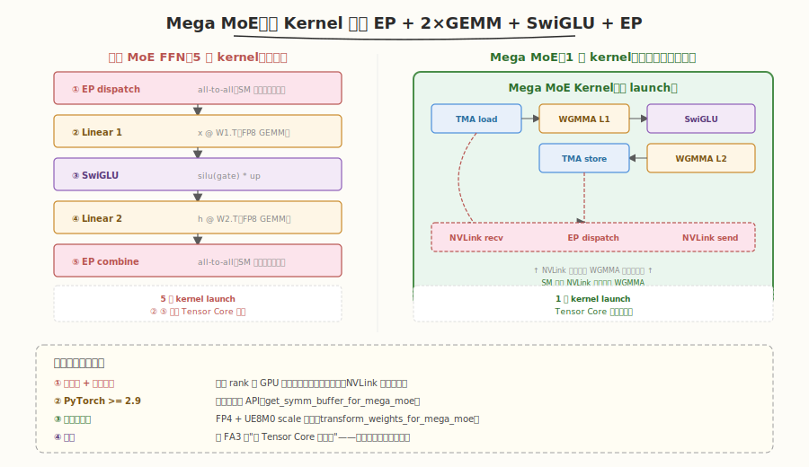

# Day 6（周六）：Mega MoE 与 SM100/Blackwell

> **今日目标**：理解 DeepGEMM 的杀手级特性——Mega MoE（单 kernel 融合 EP dispatch + 2×GEMM + SwiGLU + EP combine），了解 SM100 的 TCgen05 指令与 FP4 支持
> **面试考察度**：⭐⭐⭐⭐ 实践级，Mega MoE 是 2026.04 新增的核心特性

---

### 学习任务 1：Mega MoE 是什么（45 分钟）

读 README 的 "Mega MoE" 一节与 [PR #304](https://github.com/deepseek-ai/DeepGEMM/pull/304)：

> "Mega MoE fuses and overlaps EP dispatch, linear 1 (FP8xFP4), SwiGLU, linear 2 (FP8xFP4), and EP combine into a single mega-kernel, overlapping NVLink communication and tensor core computation."

#### 融合了什么



传统 MoE FFN 的 5 步：
```
1. EP dispatch（all-to-all 发送 token 到专家所在卡）
2. Linear 1:  x @ W1.T   （FP8 GEMM）
3. SwiGLU:    silu(gate) * up
4. Linear 2:  h @ W2.T   （FP8 GEMM）
5. EP combine（all-to-all 发回）
```

Mega MoE 把这 5 步融合成 **1 个 kernel**：

```
┌──────────────────────────────────────────────────────────┐
│                   Mega MoE Kernel                         │
│                                                           │
│  TMA load  ──→  WGMMA (L1)  ──→  SwiGLU  ──→  WGMMA (L2) │
│       ↑              ↓           ↓            ↓           │
│   NVLink recv    (compute)    (compute)    NVLink send    │
│       ↑                                     ↓             │
│      EP dispatch (overlapped with compute)  EP combine    │
└──────────────────────────────────────────────────────────┘
```

#### 关键约束

- 需要**多进程 launch** + **对称内存**（symmetric memory）
- PyTorch >= 2.9（对称内存 API）
- 权重需预处理为 FP4 + UE8M0 scale 布局

```python
# Mega MoE 使用（简化）
buffer = deep_gemm.get_symm_buffer_for_mega_moe(
    group, num_experts, num_max_tokens_per_rank, num_topk, hidden, intermediate_hidden)

transformed_l1, transformed_l2 = deep_gemm.transform_weights_for_mega_moe(l1_weights, l2_weights)

# 每次调用前 copy 输入到 symmetric buffer
buffer.x[:num_tokens].copy_(x_fp8)
buffer.x_sf[:num_tokens].copy_(x_sf)
buffer.topk_idx[:num_tokens].copy_(topk_idx)
buffer.topk_weights[:num_tokens].copy_(topk_weights)

# 单 kernel 完成全部 MoE FFN
y = torch.empty((num_tokens, hidden), dtype=torch.bfloat16, device='cuda')
deep_gemm.fp8_fp4_mega_moe(y, transformed_l1, transformed_l2, buffer)
```

> 💡 **关键洞察**：Mega MoE 的核心价值是**把 NVLink 通信藏在 Tensor Core 计算里**——传统 MoE 的 EP dispatch/combine 是纯通信时间（SM 空闲），Mega MoE 让 SM 在等 NVLink 时持续做 WGMMA。这是 DeepSeek-V3.2 推理能做低延迟的关键。与 [FlashAttention-3 论文精读](../../paper/flashattention3/README.md) 的"让 Tensor Core 不空转"是同一个哲学，只是把对象从 softmax 换成了通信。

### 学习任务 2：对称内存与 NVLink 同步（30 分钟）

读 `comm/barrier.cuh` 与 `layout/sym_buffer.cuh`：

```cpp
// NVLink 跨 rank barrier（Mega MoE 用）
template <uint32_t kNumRanks, ...>
CUTLASS_DEVICE void nvlink_barrier(
    const layout::Workspace& workspace,
    const layout::SymBuffer<kNumRanks>& sym_buffer,
    const uint32_t& sm_idx, const uint32_t& thread_idx, ...);
```

- 对称内存：所有 rank 的 GPU 地址映射到同一物理地址，NVLink 可直接读写
- `nvlink_barrier`：基于 atomic + acquire/release 的跨 rank 同步
- `grid_sync`：单 GPU 内所有 SM 同步（cooperative_groups 风格）

### 学习任务 3：SM100 / Blackwell 的 TCgen05（45 分钟）

读 `mma/sm100.cuh` 与 `ptx/tcgen05.cuh`。Blackwell 用 **TCgen05** 指令替代 Hopper 的 WGMMA：

| 维度 | SM90 WGMMA | SM100 TCgen05 |
|------|------------|---------------|
| 指令 | `wgmma.mma_async.sync.aligned.m64nNk32` | `tcgen05.mma` |
| 形状 | m64nN（N≤256） | 更大（m128nN） |
| 操作数 | SMEM desc | SMEM desc（改进的 swizzle） |
| 精度 | FP8/FP16/BF16 | FP8/FP4/FP16/BF16 |
| 异步 | `wgmma.wait_group` | 类似但独立队列 |

#### FP4 支持

SM100 支持 FP4（E2M1）——4 bit 浮点，算力是 FP8 的 2x、FP16 的 4x。DeepGEMM 的 `fp8_fp4_gemm_*` 是 FP8×FP4 混合精度（一个操作数 FP8，另一个 FP4）：

```python
# FP8×FP4 GEMM（SM100 独有）
deep_gemm.fp8_fp4_gemm_nt(a_fp8, b_fp4, d, c=c)
```

> ⚠️ **注意**：FP4 精度极脆弱（只有 2 位指数 + 1 位尾数），必须配合 UE8M0 的细粒度 scale。DeepGEMM 在 SM100 上把 scale 从 FP32 压到 UE8M0（1 字节），让 scale 数组不成为带宽瓶颈。

### 学习任务 4：布局转换工具（30 分钟）

读 `impls/smxx_layout.cuh` 与 `utils/layout.py`。DeepGEMM 提供布局转换工具：

```python
# scale 转成 TMA 对齐的 MN-major 布局
sfa_aligned = deep_gemm.get_mn_major_tma_aligned_tensor(sfa)           # SM90 FP32
sfa_packed = deep_gemm.get_mn_major_tma_aligned_packed_ue8m0_tensor(sfa)  # SM100 UE8M0

# K-grouped 的 scale packing
deep_gemm.get_k_grouped_mn_major_tma_aligned_packed_ue8m0_tensor(...)

# 通用 scale 布局转换
deep_gemm.transform_sf_into_required_layout(...)
```

> 💡 **关键洞察**：这些布局转换是 DeepGEMM 的"必要之恶"——kernel 内部不做人布局转换（专注 GEMM），但 TMA 要求特定对齐与 swizzle，所以提供工具让用户在 kernel 外做。最佳实践是把这些转换融合到前一层的 epilogue。

### 今日检查清单

- [ ] 能说出 Mega MoE 融合了哪 5 步，以及为什么能 overlap 通信与计算
- [ ] 理解对称内存为什么是 Mega MoE 的前提
- [ ] 能说出 SM90 WGMMA 与 SM100 TCgen05 的核心差异
- [ ] 理解 FP4 为什么需要 UE8M0 scale
- [ ] 能列出 DeepGEMM 提供的布局转换工具函数

---

