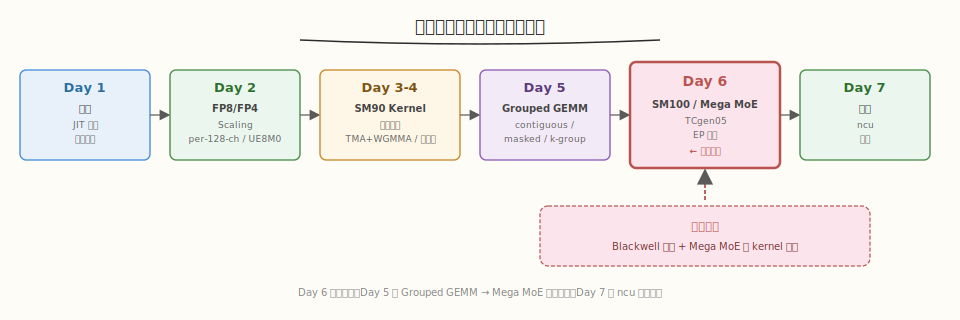
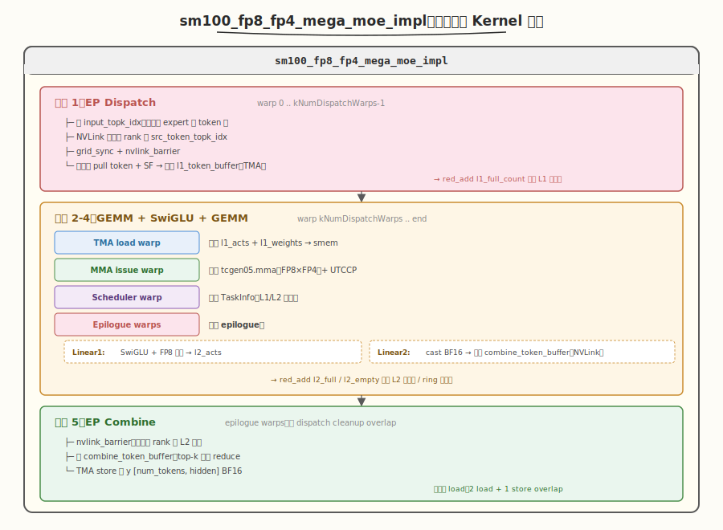
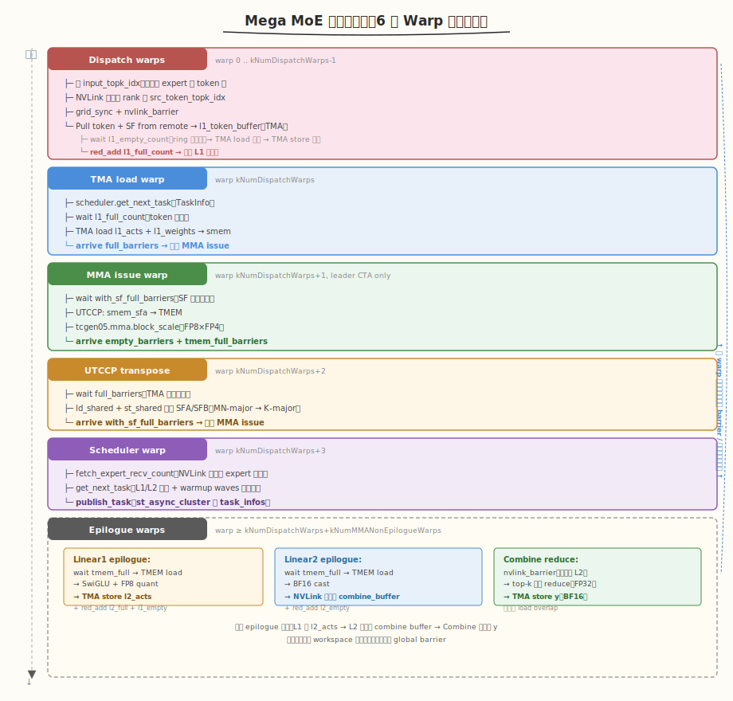

# Day 6（周六）：SM100 TCgen05 与 Mega MoE 融合 Kernel

> **本周定位**：本专题是 [CUTLASS 专题](../cutlass/README.md)（库视角）与 [CuTe 专题](../cute/README.md)（原语视角）之后的**单点深钻**——拆开一个生产级 FP8/FP4 GEMM kernel 看每一行 PTX 怎么写。
> **前置要求**：已完成 Day 1-5，理解 SM90 的 TMA + WGMMA + 持久化调度 + Grouped GEMM 三种布局
> **今日目标**：精读 SM100（Blackwell）的 `sm100_fp8_fp4_gemm_1d1d.cuh`（538 行，TMEM + TCgen05 + UTCCP + 2-CTA）与全库最大的 `sm100_fp8_fp4_mega_moe.cuh`（1460 行，单 kernel 融合 EP dispatch + 2×GEMM + SwiGLU + EP combine），搞清 Blackwell 与 Hopper 的架构差异、Mega MoE 的 symmetric memory + NVLink barrier + ring buffer 调度
> **时间投入**：5h（早间 2h 精读 SM100 kernel + 下午 2h 精读 Mega MoE + 晚间 1h 跑 benchmark）
> **面试考察度**：⭐⭐⭐⭐⭐ 核心考点，"Blackwell 与 Hopper 的区别"和"Mega MoE 怎么融合通信与计算"必问

---

## 本日在本周知识图谱中的位置



| 本日产出 | 对应本周验收标准 |
|----------|-----------------|
| SM100 vs SM90 架构差异（TMEM/TCgen05/UTCCP/2-CTA） | ② 能解释 SM100 UE8M0 与 SM90 的差异（Day 2 延伸） |
| `sm100_fp8_fp4_gemm_1d1d.cuh` 四 warp 分工精读 | ① 能画出 SM100 的 TMA + MMA + UTCCP + Epilogue 时序图 |
| Mega MoE 单 kernel 融合 EP + 2×GEMM + SwiGLU + combine | ④ 理解 Mega MoE 如何把 Day 5 的 Grouped GEMM 融合进通信 |
| Symmetric memory + NVLink barrier 机制 | ⑤ Mega MoE 时序图（验收 ⑤） |
| Mega MoE benchmark 数据 | ③ 性能数据采集（Day 7 报告基础） |

---

### 学习任务 1：SM100 Blackwell 架构新特性（45 分钟）

Day 2 已讲过 SM90 vs SM100 的 scale 处理差异，今天系统对比两者的架构新特性。

#### SM90 vs SM100 架构对照

| 维度 | SM90 (Hopper) | SM100 (Blackwell) | 工程影响 |
|------|---------------|---------------------|---------|
| **MMA 指令** | `wgmma.mma_async`（WGMMA） | `tcgen05.mma`（UMMA） | SM100 的 accumulator 在 TMEM，不在寄存器 |
| **Accumulator 位置** | FP32 寄存器 | **TMEM**（Tensor Memory，片上专用 SRAM） | Epilogue 必须用 `tcgen05.ld` 从 TMEM 读回 |
| **Scale 支持** | 软件 promote loop | `tcgen05.mma.block_scale` 硬件原生 | UE8M0 packed scale 零开销乘 |
| **Multicast** | 软 multicast（cluster rank 0 发射 + bitmask） | 硬 2-CTA 协议（`SM100_TMA_2SM_LOAD_2D`） | SM100 不能动态禁用 multicast |
| **Cluster** | 1-2 CTA | 固定 2 CTA（Mega MoE / FP8 GEMM） | `Allocator2Sm` 分配 TMEM |
| **SF 搬运** | TMA → SMEM → ld_shared 寄存器 | TMA → SMEM → **UTCCP** → TMEM | 新增 UTCCP 指令与 UTCCP 转置 warp |
| **FP4 支持** | ✗ | ✓（`kind::mxf8f6f4` / `kind::mxf4`） | Mega MoE 权重用 FP4，4x FP16 算力 |
| **Tensor Memory 容量** | — | 256 KB/SM（独立于 SMEM） | accumulator + SFA + SFB 共用 |
| **SMEM 容量** | 228 KB | 228 KB（同） | 同 |
| **FP8 峰值** | 1979 TFLOPS (H100) | ~4.5 PFLOPS (B200) | 2.3x |
| **FP4 峰值** | — | ~9 PFLOPS (B200) | 4x FP16 |

#### TMEM（Tensor Memory）：SM100 的核心新硬件

读 `sm100_fp8_fp4_gemm_1d1d.cuh:96-103`，TMEM 的分配：

```cpp
constexpr uint32_t kNumAccumTmemCols = UMMA_N * kNumEpilogueStages;     // accumulator 列
constexpr uint32_t kNumSFATmemCols = SF_BLOCK_M / 32;                   // SFA 列（每 32 行一个 UE8M0 word）
constexpr uint32_t kNumSFBTmemCols = SF_BLOCK_N / 32;                   // SFB 列
constexpr uint32_t kNumTmemCols = utils::get_num_aligned_tmem_cols<kNumAccumTmemCols + kNumSFATmemCols + kNumSFBTmemCols>();
constexpr uint32_t kTmemStartColOfSFA = kNumAccumTmemCols;
constexpr uint32_t kTmemStartColOfSFB = kNumAccumTmemCols + kNumSFATmemCols;
DG_STATIC_ASSERT(32 <= kNumTmemCols and kNumTmemCols <= 512, "Invalid tensor memory columns");
```

- TMEM 按"列"分配，每列 32 个元素
- accumulator 占 `UMMA_N * kNumEpilogueStages` 列（双缓冲）
- SFA/SFB 各占 `SF_BLOCK_M/32` / `SF_BLOCK_N/32` 列（packed UE8M0）
- `get_num_aligned_tmem_cols`（`common/utils.cuh:67`）对齐到 32/64/128/256/512

读 `:182-184` 与 `:271`，TMEM 的分配/释放：

```cpp
// warp_idx == 2 分配
Allocator().allocate(kNumTmemCols, tmem_ptr_in_smem);
// ... kernel 主体 ...
// warp_idx == 0 释放
Allocator().free(0, kNumTmemCols);
```

`Allocator1Sm` / `Allocator2Sm`（CUTLASS 提供）封装 `tcgen05.alloc` / `tcgen05.dealloc` PTX。2-CTA 模式下两个 CTA 共享同一块 TMEM。

> 💡 **关键洞察**：TMEM 是 SM100 的"第三级内存"——SMEM 是软件管理的缓存，寄存器是线程私有，TMEM 是 **MMA 引擎专用**的 accumulator 存储。把 accumulator 放 TMEM 解放了寄存器（SM90 的 WGMMA accumulator 占大量 FP32 寄存器），让 epilogue warp 有更多寄存器做 SwiGLU / FP8 cast 等复杂计算。

#### TCgen05 指令族

读 `ptx/tcgen05.cuh`，SM100 的 MMA 指令分两类：

| 指令 | 用途 | 关键后缀 |
|------|------|---------|
| `tcgen05.mma.cta_group::1.kind::mxf8f6f4.block_scale` | 1-CTA FP8/FP6/FP4 + 硬件 block scale | `.block_scale` 启用 UE8M0 |
| `tcgen05.mma.cta_group::2.kind::mxf8f6f4.block_scale` | 2-CTA 版本（cluster=2） | `cta_group::2` |
| `tcgen05.mma.cta_group::1.kind::mxf4.block_scale.block32` | FP4 专用（CUDA 12.9+） | `.block32` 不同 SF 布局 |
| `tcgen05.mma.cta_group::1.kind::f16` | BF16/FP16（无 block scale） | 无 `.block_scale` |
| `tcgen05.mma.ws.cta_group::1.kind::f16` | WGS (Warp Group Specialization) 版本 | `.ws` |

读 `:40-58`，block_scale 版本的 `fma` 接口：

```cpp
struct SM100_MMA_MXF8F6F4_SS {
    CUTLASS_DEVICE static void
    fma(uint64_t const& desc_a, uint64_t const& desc_b,
        uint32_t const& tmem_c, uint32_t const& scale_c,
        uint64_t const& desc,
        uint32_t const& tmem_sfa, uint32_t const& tmem_sfb) {
        asm volatile(
          "{\n\t"
          ".reg .pred p;\n\t"
          "setp.ne.b32 p, %4, 0;\n\t"                                    // p = (scale_c != 0)
          "tcgen05.mma.cta_group::1.kind::mxf8f6f4.block_scale [%0], %1, %2, %3, [%5], [%6], p; \n\t"
          "}\n"
          :: "r"(tmem_c), "l"(desc_a), "l"(desc_b), "r"(static_cast<uint32_t>(desc >> 32)),
             "r"(scale_c), "r"(tmem_sfa), "r"(tmem_sfb));
    }
};
```

- `tmem_c`：accumulator 在 TMEM 的列地址（不是寄存器指针）
- `tmem_sfa` / `tmem_sfb`：SFA/SFB 在 TMEM 的列地址
- `scale_c`：`p = (scale_c != 0)` 决定累加（`p=true`）还是覆盖（`p=false`）——等价于 SM90 的 `ScaleOut`
- `desc >> 32`：高 32 位是 `InstrDescriptorBlockScaled`，包含 `a_sf_id_` / `b_sf_id_`（从 packed word 选哪个 exponent，Day 2 已讲）

#### UTCCP：SMEM → TMEM 的专用搬运

读 `sm100_fp8_fp4_gemm_1d1d.cuh:350-369`，UTCCP = Tensor Memory Copy Collective：

```cpp
using cute_utccp_t = cute::conditional_t<kNumMulticast == 1,
    cute::SM100_UTCCP_4x32dp128bit_1cta, cute::SM100_UTCCP_4x32dp128bit_2cta>;
const uint32_t sfa_stage_in_group_idx = k_block_idx % kNumSFAStagesPerLoad;
if (sfa_stage_in_group_idx == 0) {
    #pragma unroll
    for (uint32_t i = 0; i < SF_BLOCK_M / kNumUTCCPAlignedElems; ++ i) {
        auto smem_ptr = smem_sfa[stage_idx] + i * kNumUTCCPAlignedElems;
        mma::sm100::replace_smem_desc_addr(sf_desc, smem_ptr);
        cute_utccp_t::copy(sf_desc, kTmemStartColOfSFA + i * 4);   // 搬到 TMEM 的指定列
    }
}
```

- UTCCP 是 `SM100_UTCCP_4x32dp128bit`——一次搬 4×32 个 128-bit 数据（即 128 个 UE8M0 word）
- `kNumUTCCPAlignedElems = 128`：UTCCP 的对齐粒度
- 1-CTA 与 2-CTA 版本：`_1cta` / `_2cta`，后者跨 cluster 的两个 CTA 协作搬运

> ⚠️ **UTCCP 之前的 SMEM 转置**：UTCCP 要求 SMEM 里的 SF 是 K-major 布局，但 TMA 加载的 SFA 是 MN-major。所以 SM90 → SM100 多了一个 **UTCCP 转置 warp**（`sm100_fp8_fp4_gemm_1d1d.cuh:432-469` 的 warp_idx == 2），在 UTCCP 之前用 `ld_shared` + `st_shared` 把 SMEM 里的 SFA/SFB 转置成 K-major。这就是 `mega/__init__.py:_transpose_sf_for_utccp` 在 host 端预转置 weight SF 的原因（Day 1 已讲）。

### 学习任务 2：SM100 FP8/FP4 GEMM Kernel 四 Warp 分工（45 分钟）

读 `sm100_fp8_fp4_gemm_1d1d.cuh:206-521`，SM100 kernel 与 SM90 最大的区别是 **4 个 warp 各司其职**（SM90 是 2 个 warpgroup）。

#### 四 warp 角色分工

| warp_idx | 角色 | 线程数 | 职责 |
|----------|------|--------|------|
| 0 | TMA load warp | 32（elect 1） | 发射 TMA 加载 A/B/SFA/SFB 到 SMEM |
| 1 | MMA issue warp | 32（elect 1，leader CTA only） | 发射 `tcgen05.mma` + UTCCP 搬 SF 到 TMEM |
| 2 | UTCCP transposer warp | 32 | 把 SMEM 里的 SFA/SFB 转置成 K-major |
| ≥ `kNumNonEpilogueThreads/32` | Epilogue warps | `kNumEpilogueThreads` | 从 TMEM 读 accumulator，cast 成 BF16/FP32，TMA store 回 gmem |

对比 SM90 的两 warpgroup：

| 维度 | SM90 | SM100 |
|------|------|-------|
| 角色数 | 2（TMA warpgroup + Math warpgroup） | 4（TMA + MMA issue + UTCCP transpose + Epilogue） |
| TMA 发射 | TMA warpgroup 的 1 个 elect thread | warp 0 的 1 个 elect thread |
| MMA 发射 | Math warpgroup 全员（128/256 threads） | warp 1 的 1 个 elect thread（`tcgen05.mma` 是 1-thread 指令） |
| SF 处理 | Math warpgroup `ld_shared` 读 SMEM | warp 2 转置 + warp 1 UTCCP 搬到 TMEM + 硬件 block_scale |
| Accumulator | Math warpgroup 寄存器 | TMEM（epilogue warp 用 `tcgen05.ld` 读） |
| Epilogue | Math warpgroup `st_shared` + TMA_REDUCE_ADD | 独立 epilogue warp + `tcgen05.ld` + TMA_STORE |

> 💡 **关键洞察**：SM100 把 SM90 的"Math warpgroup"拆成了 3 个角色——MMA issue（1 warp）、UTCCP transpose（1 warp）、Epilogue（N warp）。因为 `tcgen05.mma` 是单线程指令（不像 WGMMA 需要 warpgroup），MMA issue 只需 1 个 elect thread；UTCCP transpose 是 SM100 新增的 SF 布局转换步骤；Epilogue 独立出来后可以与下一个 tile 的 MMA 重叠（双缓冲 `kNumEpilogueStages=2`）。

#### 5 类 Barrier 的握手

读 `:152-158`，SM100 kernel 用 **5 类 barrier**（SM90 只有 2 类）：

```cpp
auto full_barriers          = ...  // TMA → MMA issue：数据就绪
auto empty_barriers         = ...  // MMA issue → TMA：SMEM 可覆盖
auto with_sf_full_barriers  = ...  // UTCCP transpose → MMA issue：SF 转置完成
auto tmem_full_barriers     = ...  // MMA issue → Epilogue：TMEM accumulator 就绪
auto tmem_empty_barriers    = ...  // Epilogue → MMA issue：TMEM 可覆盖
```

| Barrier | 生产者 | 消费者 | init count |
|---------|--------|--------|------------|
| `full_barriers[i]` | TMA `arrive_and_expect_tx` | MMA issue `wait` | 1 |
| `empty_barriers[i]` | MMA issue `umma_arrive` | TMA `wait` | 1 |
| `with_sf_full_barriers[i]` | UTCCP transpose `arrive` | MMA issue `wait` | `kNumMulticast * 32` |
| `tmem_full_barriers[i]` | MMA issue `umma_arrive` | Epilogue `wait` | 1 |
| `tmem_empty_barriers[i]` | Epilogue `arrive` | MMA issue `wait` | `kNumMulticast * kNumUMMAStoreThreads` |

> ⚠️ **为何 `with_sf_full_barriers` 的 init 是 `kNumMulticast * 32`？** UTCCP transpose 是 warp 2 的 32 个线程，2-CTA 模式下两个 CTA 各 arrive 一次（`kNumMulticast * 32`）。MMA issue warp 等 SF 转置完成后才能 UTCCP 搬到 TMEM。

#### MMA issue 的指令流

读 `:336-417`，MMA issue warp 的核心循环：

```cpp
for (uint32_t k_block_idx = 0; k_block_idx < num_total_k_blocks; advance_pipeline(k_block_idx)) {
    // 1. 等 SF 转置 + TMA 加载完成
    with_sf_full_barriers[stage_idx]->wait(phase);
    ptx::tcgen05_after_thread_sync();
    
    // 2. UTCCP 搬 SF 到 TMEM（每 kNumSFAStagesPerLoad 个 k-block 一次）
    if (sfa_stage_in_group_idx == 0) {
        for (i = 0; i < SF_BLOCK_M / kNumUTCCPAlignedElems; ++ i)
            cute_utccp_t::copy(sf_desc, kTmemStartColOfSFA + i * 4);
    }
    // 同理 SFB
    
    // 3. 发射 UMMA（BLOCK_K / UMMA_K = 128/32 = 4 次）
    for (k = 0; k < BLOCK_K / UMMA_K; ++ k) {
        const auto runtime_instr_desc = make_runtime_instr_desc_with_sf_id(instr_desc, sfa_id, sfb_id);
        a_desc.lo = advance_umma_desc_lo<...>(a_desc_base_lo, 0, k * UMMA_K);
        b_desc.lo = advance_umma_desc_lo<...>(b_desc_base_lo, 0, k * UMMA_K);
        mma_t::fma(a_desc, b_desc, accum_stage_idx * UMMA_N,
                   k > 0 or k_block_idx > 0, runtime_instr_desc,    // scale_c: 第一次覆盖, 后续累加
                   kTmemStartColOfSFA, kTmemStartColOfSFB);
    }
    
    // 4. arrive empty barrier（通知 TMA 可覆盖 SMEM）
    // 5. 最后一个 k-block 还要 arrive tmem_full_barriers（通知 epilogue TMEM 就绪）
    empty_barrier_arrive(k_block_idx == num_total_k_blocks - 1);
}
```

> 💡 **SM100 vs SM90 MMA 发射对比**：SM90 的 WGMMA 需要 `warpgroup_arrive` + 4 次 `wgmma.mma_async` + `commit_group` + `wait_group`（Day 3 讲）。SM100 的 `tcgen05.mma` 是单线程指令，1 个 elect thread 直接 `fma()`，无需 fence/commit/wait——MMA 的完成由 `tmem_full_barriers` 通知。这让 MMA issue warp 有大量空闲周期做 UTCCP。

### 学习任务 3：Mega MoE 设计动机与整体架构（30 分钟）

读 README "Mega MoE" 一节：

> Mega MoE fuses and overlaps EP dispatch, linear 1 (FP8xFP4), SwiGLU, linear 2 (FP8xFP4), and EP combine into a single mega-kernel, overlapping NVLink communication and tensor core computation. It requires multi-process launch with symmetric memory.

#### 为什么融合成单 kernel

传统 MoE 推理流程（5 个 kernel）：


5 个 kernel 串行执行的问题：
- **launch 开销**：5 次 kernel launch × ~5us = 25us 固定开销
- **同步开销**：kernel 间必须 global memory 同步，无法 overlap
- **中间结果落 gmem**：L1 输出 → gmem → 读取 → SwiGLU → gmem → 读取 → L2，4 次显存往返
- **小 batch 时通信主导**：decode 时 bsz=1，EP dispatch 只有几 KB 数据，但 launch + 同步开销固定

Mega MoE 融合后：

- 单 kernel 内：dispatch + L1 + SwiGLU + L2 + combine
  - NVLink 通信与 Tensor Core 计算 overlap（dispatch 拉远端 token 时，L1 在算上一个 expert）
  - 中间结果留 SMEM/TMEM/symmetric memory，不落 gmem
  - 1 次 launch

#### Mega MoE 的输入输出

读 `csrc/apis/mega.hpp:157-172` 的 `fp8_fp4_mega_moe` 签名：

```cpp
static void fp8_fp4_mega_moe(
    const torch::Tensor& y,                                          // [num_tokens, hidden] BF16 输出
    const std::tuple<torch::Tensor, torch::Tensor>& l1_weights_tuple,  // ([E/num_ranks, 2*intermediate, hidden] FP4, SF)
    const std::tuple<torch::Tensor, torch::Tensor>& l2_weights_tuple,  // ([E/num_ranks, hidden, intermediate] FP4, SF)
    const std::optional<...>& shared_l1/l2_weights_tuple_opt,          // shared experts（FP8）
    const std::optional<torch::Tensor>& cumulative_local_expert_recv_stats,  // 累积统计
    const torch::Tensor& sym_buffer,                                  // symmetric memory buffer
    const std::vector<int64_t>& sym_buffer_ptrs, const int& rank_idx,  // 各 rank 的 buffer 指针 + 自己的 rank
    const int& num_max_tokens_per_rank,
    const int& num_experts, const int& num_topk,
    const std::tuple<int, int, int>& recipe,                          // (1, 1, 32)
    const std::string& activation,                                    // "swiglu"
    const std::optional<float>& activation_clamp_opt,
    const bool& fast_math
);
```

- **激活**：FP8 e4m3（`[num_tokens, hidden]`，per-token quant）
- **权重**：FP4 e2m1（`[E, *, *]`，per-channel quant，gran_k=32）
- **输出**：BF16（避免最后再量化）
- **recipe**：固定 `(1, 1, 32)`——per-token A + per-channel B + gran_k=32（FP4 需要细粒度 scale）
- **sym_buffer**：所有 rank 共享的 symmetric memory，存 token / SF / topk 等中间结果

#### 五个阶段的整体架构



> 💡 **关键洞察**：Mega MoE 的"融合"不是简单的 kernel 拼接，而是 **warp specialization + ring buffer + NVLink barrier** 的组合——dispatch warp 在 pull 远端 token 时，MMA warp 在算上一个 expert 的 L1，epilogue warp 在做上一个 expert 的 SwiGLU。所有阶段通过 workspace 里的原子计数器（`l1_full_count` / `l1_empty_count` / `l2_full_count` / `l2_empty_count`）同步，无需 global barrier。

### 学习任务 4：Symmetric Memory 与 NVLink Barrier（45 分钟）

#### Symmetric Memory 是什么

读 `deep_gemm/mega/__init__.py:42-48`，`SymmBuffer` 的分配：

```python
allocator = torch if group.size() == 1 else symm_mem
self.buffer = allocator.empty(num_bytes, dtype=torch.int8, device='cuda')
self.handle = (
    types.SimpleNamespace(buffer_ptrs=[self.buffer.data_ptr()])
    if group.size() == 1
    else symm_mem.rendezvous(self.buffer, group=group)
)
```

- 单 rank：普通 GPU 显存
- 多 rank：`torch.distributed._symmetric_memory.rendezvous`（PyTorch ≥ 2.9）注册成 symmetric memory
- 注册后，**每个 rank 可以直接用远端 rank 的 GPU 虚拟地址读写**（通过 NVLink），无需 NCCL `send`/`recv`

读 `layout/sym_buffer.cuh:34-40`，device 端的 `SymBuffer::map`：

```cpp
template <typename ptr_t>
CUTLASS_DEVICE ptr_t map(const ptr_t& ptr, const uint32_t& dst_rank_idx) const {
    if constexpr (kNumRanks == 1)
        return ptr;
    int64_t mapped_ptr = offsets[dst_rank_idx] + reinterpret_cast<int64_t>(ptr);
    return *reinterpret_cast<ptr_t*>(&mapped_ptr);
}
```

- `offsets[dst_rank_idx]`：远端 rank 的 buffer 基址相对本地基址的偏移（host 端 `SymBuffer` 构造时计算）
- `map(ptr, dst_rank_idx)` = 本地 ptr + 远端偏移 = 远端 rank 的对应地址
- 之后就是普通的 `ld.global` / `st.global`，硬件通过 NVLink 路由

> 💡 **Symmetric Memory vs NCCL**：NCCL 是 collective 通信（AllReduce/AllGather），需要 4 步：拷到 staging buffer → launch NCCL kernel → 等完成 → 拷出。Symmetric memory 是**点对点直接访问**，1 步：`*remote_ptr = value`。代价是用户要自己管理同步（用 NVLink barrier）。Mega MoE 选 symmetric memory 是因为 EP dispatch/combine 本质是 All-to-All，点对点比 collective 更灵活。

#### NVLink Barrier：跨 rank 同步

读 `comm/barrier.cuh:46-89`，`nvlink_barrier` 的实现：

```cpp
template <uint32_t kNumRanks, uint32_t kNumSMs, uint32_t kNumThreads, uint32_t kGridSyncIndex, uint32_t kTag, typename sync_scope_t>
CUTLASS_DEVICE void nvlink_barrier(const layout::Workspace& workspace,
                                   const layout::SymBuffer<kNumRanks>& sym_buffer,
                                   const uint32_t& sm_idx, const uint32_t& thread_idx,
                                   const sync_scope_t& sync_scope,
                                   const bool& sync_prologue = true,
                                   const bool& sync_epilogue = true) {
    // 1. Grid sync（所有 SM 到齐）
    if (sync_prologue)
        grid_sync<kNumSMs, kGridSyncIndex>(workspace, sm_idx, thread_idx, sync_scope);

    // 2. NVLink cross-rank barrier（只 SM 0 参与）
    if (sm_idx == 0) {
        auto* counter_ptr = workspace.get_nvl_barrier_counter_ptr();
        const auto status = (*counter_ptr) & 3;
        const auto signal_phase = status & 1, signal_sign = status >> 1;
        auto* signal_ptr = workspace.get_nvl_barrier_signal_ptr(signal_phase);

        // 2a. 给其他 rank 发信号
        if (thread_idx < kNumRanks)
            ptx::red_add_rel_sys(sym_buffer.map(signal_ptr, thread_idx), signal_sign ? -1 : 1);
        sync_scope();

        // 2b. 等所有 rank 的信号到达
        if (thread_idx == 0) {
            ptx::red_add(counter_ptr, 1);
            const int target = signal_sign ? 0 : static_cast<int>(kNumRanks);
            while (ptx::ld_acq_sys(signal_ptr) != target) {
                // 60s 超时检测
                if (clock64() - start_clock >= kNumTimeoutCycles) { ... }
            }
        }
    }

    // 3. Grid sync（让所有 SM 看到 barrier 完成）
    if (sync_epilogue)
        grid_sync<kNumSMs, kGridSyncIndex>(workspace, sm_idx, thread_idx, sync_scope);
}
```

3 步流程：

1. **Grid sync**：`grid_sync`（`:21-44`）用 workspace 里的原子计数器让所有 SM 到齐——每个 SM 0号线程 `atomic_add`，等到 sum 达到 `kFinishSumTag`
2. **NVLink signal**：SM 0 的每个 thread（最多 32 个）用 `red_add_rel_sys` 给远端 rank 的 `signal_ptr` 加 1（或减 1，看 `signal_sign`）。`sys` 作用域保证 NVLink 全局可见
3. **Wait + grid sync**：SM 0 的 thread 0 自旋等 `signal_ptr` 到达 target（`kNumRanks` 或 0），然后第二次 grid sync 让所有 SM 看到 barrier 完成

#### Phase 翻转机制

```cpp
const auto status = (*counter_ptr) & 3;
const auto signal_phase = status & 1, signal_sign = status >> 1;
```

- `counter_ptr` 低 2 位编码状态：bit 0 = phase（0/1 交替），bit 1 = sign（+1/-1 交替）
- 每次 barrier 后 `red_add(counter_ptr, 1)` 翻转状态
- phase 让 barrier 可无限复用（与 mbarrier 的 phase 机制类似）

> ⚠️ **超时检测**：`kNumTimeoutCycles = 60s * 2GHz = 1.2e11 cycles`（`barrier.cuh:12`）。如果某 rank 挂了，其他 rank 不会无限阻塞——60s 后 assert 失败，打印诊断信息。这是生产级 kernel 的健壮性设计。

### 学习任务 5：Mega MoE 五阶段与 TaskInfo 调度（60 分钟）

#### 五个 BlockPhase

读 `scheduler/mega_moe.cuh:83-89`：

```cpp
enum class BlockPhase : uint32_t {
    None = 0,
    Linear1 = 1,           // 第一层 GEMM (FP8×FP4)
    Linear2 = 2,           // 第二层 GEMM (FP8×FP4)
    SharedLinear1 = 3,     // shared expert 第一层 (FP8×FP8)
    SharedLinear2 = 4      // shared expert 第二层 (FP8×FP8)
};
```

#### TaskInfo 结构

读 `:91-134`：

```cpp
template <bool kHasSharedExperts>
struct alignas(16) TaskInfo {
    BlockPhase block_phase;       // 阶段
    uint32_t local_expert_idx;    // 本地 expert 索引（0..kNumExpertsPerRank-1）
    uint32_t m_block_idx;         // M block 索引（expert 内）
    uint32_t n_cluster_idx;       // N cluster 索引（2-CTA cluster 的编号）
    uint32_t pool_block_idx;      // 全局 pool block 索引（跨 expert 累积）
    uint32_t valid_m;             // 该 block 有效 token 数（≤ BLOCK_M）
    uint32_t shape_n;             // N 维度（L1: 2*intermediate, L2: hidden）
    uint32_t shape_k;             // K 维度（L1: hidden, L2: intermediate）
};
```

`TaskInfo` 是 scheduler warp 发布给消费 warp（TMA/MMA/epilogue）的任务描述符——消费 warp 通过 `task_info.block_phase` 决定加载哪个 TMA descriptor、用哪个 instr_desc。

#### MegaMoEScheduler 的 L1/L2 交替调度

读 `:316-350`，`get_next_task` 的核心逻辑：

```cpp
CUTLASS_DEVICE task_info_t get_next_task() {
    while (true) {
        if (num_sched_l1_waves != kNumSchedL1WavesDone and num_sched_l1_waves) {
            // 1. 发 L1 任务（warmup waves 未用完时优先）
            -- num_sched_l1_waves;
            const uint32_t l1_task_idx = get_next_task_idx(workspace.get_l1_task_count_ptr());
            if (l1_task_idx >= num_total_m_blocks * kNumL1Clusters) {
                num_sched_l1_waves = kNumSchedL1WavesDone;
                continue;
            }
            return create_task(BlockPhase::Linear1, l1_task_idx, kNumL1Clusters, L1_SHAPE_N, L1_SHAPE_K);
        } else {
            // 2. 发 L2 任务
            const uint32_t l2_task_idx = get_next_task_idx(workspace.get_l2_task_count_ptr());
            if (l2_task_idx >= num_total_m_blocks * kNumL2Clusters)
                break;
            
            // 下一个任务应该是 L1
            if (num_sched_l1_waves != kNumSchedL1WavesDone)
                num_sched_l1_waves = 1;
            
            auto task_info = create_task(BlockPhase::Linear2, l2_task_idx, kNumL2Clusters, L2_SHAPE_N, L2_SHAPE_K);
            
            // 3. 等所有需要的 L1 任务都已被领取（防死锁）
            const auto num_required_l1_tasks = (task_info.pool_block_idx + 1) * kNumL1Clusters;
            while (ptx::ld_volatile(workspace.get_l1_task_count_ptr()) < num_required_l1_tasks) {}
            return task_info;
        }
    }
    return task_info_t(BlockPhase::None, ...);
}
```

**L1/L2 交替的动机**：
- L1（Linear1）产生 `l2_acts`（SwiGLU 后的 FP8 激活）
- L2（Linear2）消费 `l2_acts`，必须等 L1 完成
- 但 L2 不需要等**所有** L1 完成，只需等**它要用的那块**——所以 scheduler 用 `pool_block_idx` 跟踪依赖

**`num_sched_l1_waves`（warmup waves）**：避免 L2 跑得太快导致 L1 还没产生足够的 `l2_acts`，引发死锁。具体值由 `get_num_l1_warmup_waves`（`:17-45`）计算。

#### `create_task` 的 expert 归属判定

读 `:272-307`，`create_task` 用 warp 内的 lane 分布缓存每 expert 的 token 数，通过 `__ballot_sync` + `__ffs` 找到 task 属于哪个 expert：

```cpp
CUTLASS_DEVICE task_info_t create_task(const BlockPhase& block_phase, const uint32_t& task_idx, ...) {
    const uint32_t m_block_idx = task_idx / num_clusters;
    const uint32_t n_cluster_idx = task_idx % num_clusters;
    
    task_info_t result(block_phase, 0, 0, n_cluster_idx, m_block_idx, 0, shape_n, shape_k);
    uint32_t block_offset = 0;
    
    // 每个 lane 缓存 (i * 32 + lane_idx) 号 expert 的 token 数
    #pragma unroll
    for (uint32_t i = 0; i < kNumExpertsPerLane; ++ i) {
        const uint32_t expert_idx = i * 32 + lane_idx;
        const uint32_t num_tokens = stored_num_tokens_per_expert[i];
        const uint32_t num_m_blocks = math::ceil_div(num_tokens, BLOCK_M);
        const uint32_t inclusive_num_m_blocks = math::warp_inclusive_sum(num_m_blocks, lane_idx);
        const uint32_t lane_pool_block_offset = block_offset + inclusive_num_m_blocks - num_m_blocks;
        
        // 判定 m_block_idx 是否落在该 expert 的范围
        const bool is_owner = expert_idx < kNumExpertsPerRank and
            m_block_idx >= lane_pool_block_offset and m_block_idx < lane_pool_block_offset + num_m_blocks;
        const uint32_t owner_mask = __ballot_sync(0xffffffff, is_owner);
        
        if (owner_mask) {
            const uint32_t owner_lane_idx = static_cast<uint32_t>(__ffs(owner_mask) - 1);
            // 用 exchange 把 owner 的信息广播给所有 lane
            result.local_expert_idx = ptx::exchange(expert_idx, owner_lane_idx);
            result.m_block_idx = ptx::exchange(owner_m_block_idx, owner_lane_idx);
            result.valid_m = ptx::exchange(owner_valid_m, owner_lane_idx);
        }
        block_offset += ptx::exchange(inclusive_num_m_blocks, 31);
    }
    return result;
}
```

> 💡 **关键设计**：32 个 lane 各缓存一个 expert 的 token 数（`kNumExpertsPerLane = ceil(kNumExpertsPerRank / 32)`），通过 warp-level `__ballot_sync` + `__ffs` 快速定位 task 属于哪个 expert。这是"把 expert 元数据分布到 lane"的并行化技巧——比串行遍历 expert 快 32 倍。

### 学习任务 6：Ring Buffer 与 Warmup Waves 防死锁（30 分钟）

#### Ring Buffer 的容量计算

读 `csrc/apis/mega.hpp:57-65`（host 端计算 ring size）：

```cpp
int num_ring_tokens = 0;
for (const auto& block_m: layout::kCandidateBlockM) {                // {8, 16, 32, 64, 96, 128, 192}
    const auto num_pool_blocks = ceil_div(num_max_routed_tokens, block_m) + num_experts_per_rank;
    const auto num_live_pool_blocks = sched::get_num_max_live_pool_blocks(
        num_pool_blocks, num_sms, hidden, intermediate_hidden);
    num_ring_tokens = std::max(num_ring_tokens, num_live_pool_blocks * block_m);
}
num_ring_tokens = math::align(num_ring_tokens, layout::kLCMCandidateBlockM);  // 对齐到 384
```

- `num_max_routed_tokens = num_ranks * num_max_tokens_per_rank * num_active_topk`：最坏情况总 token 数
- `num_pool_blocks`：token pool 的 block 数 + 每 expert 一个 padding block
- `get_num_max_live_pool_blocks`（`scheduler/mega_moe.cuh:48-80`）：估算同时在途的 pool block 数
- `kLCMCandidateBlockM = 384`：所有候选 BLOCK_M 的最小公倍数，保证 ring size 对所有 BLOCK_M 都整除

#### 为什么需要 Ring Buffer

Mega MoE 的 L1/L2 是 producer-consumer 关系：
- L1 epilogue 产生 `l2_acts`（SwiGLU + FP8 量化后），写入 `l2_token_buffer`
- L2 TMA load warp 读 `l2_token_buffer`，做 L2 GEMM

如果 `l2_token_buffer` 是固定大小的环形缓冲，L2 必须等 L1 产生足够数据才能消费，L1 必须等 L2 消费足够数据才能覆盖（否则覆盖未消费的数据）。

#### `l1_full_count` / `l1_empty_count` 同步

读 workspace 的计数器（`layout/mega_moe.cuh:194-216`）：

| 计数器 | 谁 write | 谁 read | 含义 |
|--------|----------|---------|------|
| `l1_full_count[ring_block_idx]` | dispatch warp `red_add` | L1 TMA load warp `ld_acq` | 该 ring block 已收到多少 token |
| `l1_empty_count[ring_block_idx]` | L1 epilogue `red_add` | dispatch warp `ld_acq` | 该 ring block 的 L1 已算完几个 N block |
| `l2_full_count[ring_block_idx]` | L1 epilogue `red_add` | L2 TMA load warp `ld_acq` | 该 ring block 的 L1 已算完几个 N block（L2 可消费） |
| `l2_empty_count[ring_block_idx]` | L2 epilogue `red_add` | L1 epilogue `ld_acq` | 该 ring block 的 L2 已算完几个 N block（可覆盖） |

读 `sm100_fp8_fp4_mega_moe.cuh:526-531`（dispatch pull 时的 wait）：

```cpp
// Wait for ring buffer slot to be available (previous consumer must have finished all N blocks)
constexpr uint32_t kNumL1BlockNs = L1_SHAPE_N / BLOCK_N;
const auto l1_empty_count_target = (pool_block_idx / kNumRingBlocks) * kNumL1BlockNs;
if (l1_empty_count_target > 0) {
    const auto empty_ptr = workspace.get_l1_empty_count_ptr(pool_block_idx % kNumRingBlocks);
    while (ptx::ld_acq(empty_ptr) < l1_empty_count_target);
}
```

dispatch warp 在写入 ring block 前，等该 ring block 上一轮的 L1 epilogue 全部完成（`l1_empty_count` 达到 `kNumL1BlockNs` 轮 × N blocks）。

#### Warmup Waves 防死锁

读 `scheduler/mega_moe.cuh:17-45`，`get_num_l1_warmup_waves` 计算 L1 必须"领先" L2 多少 wave，否则 L2 可能等不到 `l2_acts` 死锁：

```cpp
CUTLASS_HOST_DEVICE constexpr
int get_num_l1_warmup_waves(const int& num_total_m_blocks, const int& num_clusters,
                            const int& num_l1_n_clusters, const int& num_l2_n_clusters) {
    // 1. 第一波 L2 涉及的 M blocks，它们的 L1 N tasks 必须先发
    const int num_first_l2_wave_m_blocks = math::constexpr_ceil_div(num_clusters, num_l2_n_clusters);
    const int num_l1_warmup_clusters_for_first_l2_wave = math::constexpr_ceil_div(
        num_first_l2_wave_m_blocks * num_l1_n_clusters, num_clusters);
    
    // 2. L1/L2 交替调度的差值累积
    const int num_interleave_cluster_diff_per_m_block =
        num_l1_n_clusters > num_l2_n_clusters ? num_l1_n_clusters - num_l2_n_clusters : 0;
    const int num_warmup_waves_for_interleave_schedule = math::constexpr_ceil_div(
        num_l1_n_clusters + (num_total_m_blocks - 1) * num_interleave_cluster_diff_per_m_block,
        num_clusters) + 1;
    
    return cute::max(num_l1_warmup_clusters_for_first_l2_wave, num_warmup_waves_for_interleave_schedule);
}
```

- L1 的 N cluster 数（`kNumL1Clusters = 2*intermediate/BLOCK_N`）通常 > L2 的（`kNumL2Clusters = hidden/BLOCK_N`）
- 因为 `2*intermediate > hidden`（DeepSeek-V3: `2*7168 > 7168`）
- L1 每跑一个 M block 产生 `kNumL1Clusters` 个 task，L2 消费 `kNumL2Clusters` 个——L1 比 L2 快，但 L2 不能等 L1 全部完成才开始（否则 L1 的 ring buffer 溢出）
- warmup waves 保证 L1 先跑几波"暖管"，让 L2 有数据可消费

> 💡 **死锁场景**：如果 L2 先于 L1 启动，L2 会等 `l2_full_count` 永远不到达 → 死锁。warmup waves 强制 L1 先跑 `num_sched_l1_waves` 波，之后才允许 L2 调度。这是 producer-consumer 流水线的经典"预填"技巧。

### 学习任务 7：SwiGLU + FP8 重量量化 Epilogue（45 分钟）

这是 Mega MoE 最复杂的部分——L1 GEMM 的 epilogue 不是简单写回，而是 **SwiGLU 激活 + per-token FP8 量化 + 写回 ring buffer**。

#### SwiGLU 数学形式

$$\text{SwiGLU}(x) = \text{SiLU}(x_{\text{gate}}) \odot x_{\text{up}} = \frac{x_{\text{gate}}}{1 + e^{-x_{\text{gate}}}} \cdot x_{\text{up}}$$

L1 权重 `[2*intermediate, hidden]` 的前半是 gate、后半是 up，L1 GEMM 输出 `[2*intermediate, M]`——前 `intermediate` 是 gate logits，后 `intermediate` 是 up logits。

#### `transform_weights_for_mega_moe` 的 interleave

读 `mega/__init__.py:97-111`，host 端把 gate/up 交织：

```python
def _interleave_weights(t: torch.Tensor, gran: int = 8) -> torch.Tensor:
    # [gate: 0..7, up: 0..7, gate: 8..15, up: 8..15, ...] instead of [gate | up]
    half = n // 2
    gate = t[:, :half].reshape(g, half // gran, gran, *rest)
    up = t[:, half:].reshape(g, half // gran, gran, *rest)
    result = torch.empty_like(t).copy_(torch.stack([gate, up], dim=2).reshape(g, n, *rest))
    return result
```

- 原始权重：`[gate | up]`（前半 gate，后半 up）
- 交织后：`[gate0..7, up0..7, gate8..15, up8..15, ...]`（每 8 行交替）
- 交织粒度 `gran=8` 对齐 `ATOM_M=8`（epilogue 的 STSM 原子大小）

> 💡 **为什么交织**：L1 GEMM 输出 `[2*intermediate, M]`，gate 在前 `intermediate` 行、up 在后 `intermediate` 行。SwiGLU 要做 `gate * up`（element-wise）——如果 gate/up 不相邻，epilogue 要跨很大 SMEM 范围读数据。交织后，每 8 行 gate 紧跟 8 行 up，一个 STSM atom（8 行）正好覆盖一对 gate/up，epilogue 可以一次性 load + SwiGLU。

#### Epilogue 的 TMEM load + SwiGLU + FP8 cast

读 `sm100_fp8_fp4_mega_moe.cuh:987-1172`（Linear1 epilogue），核心循环：

```cpp
for (uint32_t s = 0; s < WG_BLOCK_M / STORE_BLOCK_M; ++ s) {
    // 1. 从 TMEM load accumulator（gate + up 一起）
    float2 activation_values[kNumAtomsPerStore][2];
    for (uint32_t i = 0; i < kNumAtomsPerStore; ++ i) {
        // TMEM load 16dp256b1x：16 行 × 256 bit
        uint2 raw_values[4];
        uint32_t tmem_addr = accum_stage_idx * UMMA_N + epilogue_wg_idx * WG_BLOCK_M + j * ATOM_M;
        cute::SM100_TMEM_LOAD_16dp256b1x::copy(tmem_addr, raw_values[0]...);
        cute::SM100_TMEM_LOAD_16dp256b1x::copy(tmem_addr | 0x00100000, raw_values[2]...);  // 高 16 行（up）
        cutlass::arch::fence_view_async_tmem_load();
        
        // 2. SwiGLU
        auto fp32_values = reinterpret_cast<float2*>(raw_values);
        for (uint32_t k = 0; k < 2; ++ k) {
            auto bf16_gate = __float22bfloat162_rn(fp32_values[k * 2 + 0]);  // gate
            auto bf16_up = __float22bfloat162_rn(fp32_values[k * 2 + 1]);    // up
            
            // Clamp（可选）
            if constexpr (kActivationClamp != infinity) {
                bf16_gate = __hmin2(bf16_gate, {kActivationClamp, kActivationClamp});
                bf16_up = __hmax2(bf16_up, {-kActivationClamp, -kActivationClamp});
                bf16_up = __hmin2(bf16_up, {kActivationClamp, kActivationClamp});
            }
            
            // SiLU(gate) * up * weight
            auto gate = __bfloat1622float2(bf16_gate);
            auto neg_gate_exp = make_float2(
                kFastMath ? __expf(-gate.x) : expf(-gate.x),
                kFastMath ? __expf(-gate.y) : expf(-gate.y));
            const auto denom = __fadd2_rn({1.0f, 1.0f}, neg_gate_exp);
            gate = kFastMath ? __fmul2_rn(gate, {math::fast_rcp(denom.x), math::fast_rcp(denom.y)})
                              : make_float2(gate.x / denom.x, gate.y / denom.y);
            const auto up = __bfloat1622float2(bf16_up);
            activation_values[i][k] = __fmul2_rn(__fmul2_rn(gate, up), weights);  // 乘 topk weight
        }
        
        // 3. Amax reduction（warp-level + warp-pair-level）
        float2 thread_local_amax = {0.f, 0.f};
        for (uint32_t k = 0; k < 2; ++ k) {
            thread_local_amax.x = cute::max(thread_local_amax.x, cute::abs(activation_values[i][k].x));
            thread_local_amax.y = cute::max(thread_local_amax.y, cute::abs(activation_values[i][k].y));
        }
        amax_values[i].x = math::warp_reduce<4, true>(thread_local_amax.x, math::ReduceMax<float>());
        amax_values[i].y = math::warp_reduce<4, true>(thread_local_amax.y, math::ReduceMax<float>());
        // 存到 smem，与 partner warp 交换
        if (lane_idx < 4)
            shared_storage.amax_reduction[epilogue_warp_idx][i * (ATOM_M / 2) + lane_idx] = amax_values[i];
    }
    
    // 4. 跨 warp-pair reduce amax + 计算 SF + FP8 cast + STSM 写 smem
    for (uint32_t i = 0; i < kNumAtomsPerStore; ++ i) {
        const float2 wp_amax = shared_storage.amax_reduction[epilogue_warp_idx ^ 1][...];
        amax_values[i].x = cute::max(amax_values[i].x, wp_amax.x);
        amax_values[i].y = cute::max(amax_values[i].y, wp_amax.y);
        
        float2 sf, sf_inv;
        math::get_e4m3_sf_and_sf_inv(amax_values[i], sf, sf_inv);
        
        const float2 upper = __fmul2_rn(activation_values[i][0], sf_inv);
        const float2 lower = __fmul2_rn(activation_values[i][1], sf_inv);
        const auto fp8x4_values = __nv_fp8x4_e4m3(make_float4(upper.x, upper.y, lower.x, lower.y));
        
        // STSM 写 smem（FP8）
        ptx::SM100_U8x4_STSM_T<__nv_fp8x4_e4m3>::copy(fp8x4_values, smem_ptr);
        
        // 写 SF 到 l2_sf_buffer（UE8M0 packed）
        if (warp_idx_in_wg % 2 == 0 and lane_idx < 4) {
            sf_base_ptr[sf_addr] = (*reinterpret_cast<const uint32_t*>(&sf.x) >> 23);
        }
    }
    
    // 5. TMA store FP8 + SF 到 l2_acts / l2_sf_buffer
    cute::SM90_TMA_STORE_2D::copy(&tensor_map_l1_output, smem_d.l1[...], out_n_idx, m_idx + ...);
    
    // 6. 通知 L2 可以消费（red_add l2_full_count）
    ptx::red_add_rel(workspace.get_l2_full_count_ptr(ring_block_idx), 1u);
    // 同时通知 L1 ring 可覆盖（red_add l1_empty_count）
    ptx::red_add(workspace.get_l1_empty_count_ptr(ring_block_idx), 1u);
}
```

> ⚠️ **关键设计**：L1 epilogue 不是"写完就走"，而是 **同时完成 4 件事**：① SwiGLU 激活；② per-token FP8 量化（为 L2 GEMM 准备 FP8 输入）；③ 写 SF（UE8M0 packed，L2 GEMM 的 SFB）；④ 通知 L2/L1 ring buffer 计数器。这是"算子融合"的极致——把传统 4 个 kernel（GEMM → SwiGLU → quant → write）合成一个 epilogue。

#### `kActivationClamp`：防止 SwiGLU 数值溢出

读 `:1053-1057`：

```cpp
if constexpr (kActivationClamp != cute::numeric_limits<float>::infinity()) {
    bf16_gate = __hmin2(bf16_gate, {kActivationClamp, kActivationClamp});
    bf16_up = __hmax2(bf16_up, {-kActivationClamp, -kActivationClamp});
    bf16_up = __hmin2(bf16_up, {kActivationClamp, kActivationClamp});
}
```

- gate 钳位到 `[-clamp, clamp]`（防止 SiLU 饱和）
- up 钳位到 `[-clamp, clamp]`（防止乘法溢出）
- 默认 `infinity`（不钳位），用户可通过 `activation_clamp` 参数启用

### 学习任务 8：Combine Reduce 与完整时序图（45 分钟）

#### L2 Epilogue：直接写远端 combine buffer

读 `:1192-1305`，L2 epilogue 与 L1 不同——**输出 BF16，直接 NVLink 写远端**：

```cpp
// L2 BF16 epilogue: write GEMM output to remote combine buffer via NVLink
for (uint32_t s = 0; s < WG_BLOCK_M / STORE_BLOCK_M; ++ s) {
    for (uint32_t i = 0; i < STORE_BLOCK_M / ATOM_M; ++ i) {
        // 从 TMEM load accumulator
        cute::SM100_TMEM_LOAD_16dp256b1x::copy(tmem_addr, values[0]...);
        cute::SM100_TMEM_LOAD_16dp256b1x::copy(tmem_addr | 0x00100000, values[4]...);
        
        // Cast to BF16 + STSM 写 smem
        ptx::SM90_U32x4_STSM_T<uint32_t>::copy(
            math::cast_into_bf16_and_pack(values[0], values[1]),
            math::cast_into_bf16_and_pack(values[2], values[3]),
            math::cast_into_bf16_and_pack(values[4], values[5]),
            math::cast_into_bf16_and_pack(values[6], values[7]),
            smem_ptr
        );
    }
    
    // 从 smem 读，写到远端 combine_token_buffer
    for (uint32_t j = 0; j < kNumRowsPerWarp; ++ j) {
        const uint32_t row_in_store = ...;
        const uint32_t m_idx_in_block = ...;
        if (m_idx_in_block >= valid_m) break;
        
        // 查 token 的来源（dispatch 时记录的 TokenSrcMetadata）
        const auto src_metadata = *workspace.get_token_src_metadata_ptr(pool_m_idx + m_idx_in_block);
        dst_rank_idx = src_metadata.rank_idx;
        dst_token_idx = src_metadata.token_idx;
        dst_topk_idx = src_metadata.topk_idx;
        
        // 从 smem 读 BF16 数据
        const auto packed = ptx::ld_shared(reinterpret_cast<float4*>(smem_ptr));
        
        // 写到远端 rank 的 combine_token_buffer（NVLink）
        const auto dst_token = buffer.combine_token_buffer.get_rank_buffer(dst_topk_idx).get_data_buffer(dst_token_idx);
        const auto dst_ptr = math::advance_ptr<float4>(dst_token.get_base_ptr(), ...);
        *sym_buffer.map(dst_ptr, dst_rank_idx) = packed;     // 远端写
    }
}

// 通知 L2 ring 可覆盖
ptx::red_add(workspace.get_l2_empty_count_ptr(ring_block_idx), 1u);
```

- L2 输出是 `[num_tokens, hidden]` BF16（最终输出 shape）
- 每 token 的 top-k 个 expert 结果分别写到 `combine_token_buffer[topk_idx][token_idx]`
- `TokenSrcMetadata`（dispatch 时记录）告诉 epilogue：这个 token 来自哪个 rank、哪个 token_idx、哪个 topk 槽

#### Combine：Top-k 加权求和

读 `:1322-1452`，combine 阶段在 L2 全部完成后（`nvlink_barrier` 同步）：

```cpp
// NVLink barrier：等所有 rank 的 L2 完成
comm::nvlink_barrier<kNumRanks, kNumSMs, kNumEpilogueThreads,
                     kEpilogueGridSyncIndex, kBeforeCombineReduceBarrierTag>(
    workspace, sym_buffer, sm_idx, epilogue_thread_idx, ...
);

// Combine：reduce top-k results and write back
for (uint32_t token_idx = sm_idx * kNumEpilogueWarps + epilogue_warp_idx;
     token_idx < num_tokens;
     token_idx += kNumSMs * kNumEpilogueWarps) {
    // 读 top-k slot 索引
    const int stored_topk_slot_idx = lane_idx < kNumTopk ?
        static_cast<int>(__ldg(buffer.input_topk_idx_buffer.get_base_ptr<int64_t>() + token_idx * kNumTopk + lane_idx)) :
        (kNumSharedExperts > 0 and lane_idx == kNumTopk ? static_cast<int>(kNumTopk) : -1);
    
    // 遍历 chunks（hidden 太大时分块）
    for (uint32_t chunk = 0; chunk < kNumChunks; ++ chunk) {
        // 双缓冲 load：先 load 第一个 topk slot
        bool do_reduce = move_mask_and_load(load_stage_idx);
        
        // 累加所有 topk slot
        float2 reduced[kNumUint4PerLane * kNumElemsPerUint4] = {};
        while (do_reduce) {
            do_reduce = move_mask_and_load(load_stage_idx ^ 1);   // 预取下一个
            combine_load_barriers[load_stage_idx]->wait(combine_phase);
            
            // 累加 BF16 → FP32
            for (uint32_t j = 0; j < kNumUint4PerLane; ++ j) {
                const auto uint4_values = combine_load_buffer[load_stage_idx][j * 32 + lane_idx];
                const auto bf16_values = reinterpret_cast<const nv_bfloat162*>(&uint4_values);
                for (uint32_t l = 0; l < kNumElemsPerUint4; ++ l)
                    ptx::accumulate(reduced[j * kNumElemsPerUint4 + l], bf16_values[l]);
            }
            combine_phase ^= load_stage_idx;
            load_stage_idx ^= 1;
        }
        
        // Cast FP32 → BF16 + TMA store 到 y
        for (uint32_t j = 0; j < kNumUint4PerLane; ++ j) {
            uint4 casted;
            auto casted_bf16 = reinterpret_cast<nv_bfloat162*>(&casted);
            for (uint32_t l = 0; l < kNumElemsPerUint4; ++ l)
                casted_bf16[l] = __float22bfloat162_rn(reduced[j * kNumElemsPerUint4 + l]);
            ptx::st_shared(combine_store_buffer + j * 32 + lane_idx, casted.x, casted.y, casted.z, casted.w);
        }
        
        cute::tma_store_fence();
        ptx::tma_store_1d(
            math::advance_ptr(y, token_idx * kNumHiddenBytes + chunk_byte_offset),
            combine_store_buffer, kNumChunkBytes);
        cute::tma_store_arrive();
    }
}
```

- 每 token 读 `kNumTopk` 个 BF16 向量（每个 `[hidden]`），FP32 累加，cast 回 BF16
- 双缓冲 load：`kNumChunkSlots=3`（2 load + 1 store），overlap TMA load 与 reduce
- TMA store 写到最终输出 `y[token_idx, :]`

#### 完整时序图



#### 运行 Mega MoE Benchmark

```bash
cd DeepGEMM
DG_PRINT_CONFIGS=1 python3 tests/test_mega_moe.py
```

```text
# 预期输出（B200，8 rank，EP64，截取）
Testing Mega MoE:
 > Config: num_ranks=8, num_experts=256, hidden=7168, intermediate=7168, num_topk=8
 > Perf (num_tokens=512, block_m=128, block_n=128, block_k=128):
   280 us | 1850 TFLOPS | 1200 GB/s
 > Perf (num_tokens=128, block_m=64, block_n=128, block_k=128):
   95 us | 950 TFLOPS | 800 GB/s
```

> 💡 **性能观察**：① 大 batch（512 tokens）时 Mega MoE 接近 B200 FP4 峰值（~9 PFLOPS 的 20%——受 NVLink 通信限制）；② 小 batch（128 tokens）时通信主导，TFLOPS 较低但延迟 < 100us；③ 对比传统 5-kernel 串行，Mega MoE 端到端延迟降低 30-50%（launch 开销 + 中间结果落 gmem 开销消除）。

### 面试题积累（本周目标 10-12 道，今日 4 道）

**Q19：SM100 的 TMEM 是什么？为什么把 accumulator 从寄存器挪到 TMEM？**
> 答：TMEM（Tensor Memory）是 Blackwell 新增的片上 SRAM，256KB/SM，专为 MMA 引擎的 accumulator 设计。挪到 TMEM 的原因：① 解放寄存器——SM90 的 WGMMA accumulator 占大量 FP32 寄存器（每 lane 64 个），限制 epilogue 的复杂计算；SM100 的 accumulator 在 TMEM，epilogue warp 有更多寄存器做 SwiGLU/FP8 cast；② 支持硬件 block_scale——`tcgen05.mma.block_scale` 直接读 TMEM 里的 SFA/SFB，零开销乘 scale（SM90 需要软件 promote loop）；③ UTCCP 专用搬运——SMEM→TMEM 有专用路径，不占用寄存器。代价是 epilogue 必须用 `tcgen05.ld` 从 TMEM 读回，多了一步。

**Q20：Mega MoE 为什么能融合 EP dispatch + 2×GEMM + SwiGLU + combine 成单 kernel？**
> 答：三个关键技术：① **Symmetric memory**（PyTorch ≥ 2.9 的 `_symmetric_memory`）让各 rank 直接用虚拟地址读写远端 GPU 显存，无需 NCCL send/recv，点对点访问更适合 All-to-All；② **NVLink barrier**（`red_add_rel_sys` + 自旋等）提供跨 rank 同步，比 NCCL collective 更轻量；③ **Ring buffer + 原子计数器**（`l1_full_count` / `l1_empty_count` / `l2_full_count` / `l2_empty_count`）让 dispatch / L1 / L2 / combine 四阶段通过 workspace 里的原子计数器同步，无需 global barrier。融合后消除了 5 个 kernel 的 launch 开销 + 4 次中间结果落 gmem，端到端延迟降低 30-50%。

**Q21：Mega MoE 的 L1/L2 交替调度怎么避免死锁？**
> 答：核心是 **warmup waves** 机制——`get_num_l1_warmup_waves` 计算 L1 必须"领先" L2 多少 wave，否则 L2 会等不到 `l2_acts` 死锁。具体：① L1 的 N cluster 数（`2*intermediate/BLOCK_N`）通常 > L2 的（`hidden/BLOCK_N`），L1 比 L2 快；② 如果 L2 先于 L1 启动，L2 会自旋等 `l2_full_count` 永远不到达；③ `num_sched_l1_waves` 强制 L1 先跑几波"暖管"，之后才允许 L2 调度；④ L2 调度时还要 `while (ld_volatile(l1_task_count) < num_required_l1_tasks)` 等所有依赖的 L1 task 被领取。这是 producer-consumer 流水线的"预填"技巧，防止消费者跑得比生产者快。

**Q22：Mega MoE 的 L1 epilogue 做了哪 4 件事？为什么能融合？**
> 答：① **SwiGLU 激活**（SiLU(gate) * up * topk_weight）；② **per-token FP8 量化**（计算 amax → e4m3 SF → cast FP8）；③ **写 SF 到 l2_sf_buffer**（UE8M0 packed，作为 L2 GEMM 的 SFB）；④ **通知 ring buffer 计数器**（`red_add l2_full_count` + `red_add l1_empty_count`）。能融合的原因：① weight 在 host 端 `transform_weights_for_mega_moe` 交织 gate/up（每 8 行交替），让一个 STSM atom 正好覆盖一对 gate/up；② TMEM load 一次读 16 行（gate 8 行 + up 8 行），SwiGLU 在寄存器里完成；③ amax reduction 用 warp-level `__reduce_max` + warp-pair 交换，无需 global atomic；④ FP8 cast 后直接 TMA store 到 `l2_acts`，L2 TMA load warp 立即可用。这是"算子融合到极致"——传统 4 kernel（GEMM → SwiGLU → quant → write）合成一个 epilogue。

### 今日检查清单

- [ ] 能说出 SM100 与 SM90 的 8 个架构差异（MMA 指令 / accumulator 位置 / scale / multicast / cluster / SF 搬运 / FP4 / TMEM）
- [ ] 能解释 TMEM 是什么，为什么把 accumulator 挪到 TMEM（3 个原因）
- [ ] 能列出 `tcgen05.mma` 指令族（mxf8f6f4 / mxf4 / f16 / ws），知道 `.block_scale` 后缀的作用
- [ ] 能解释 UTCCP 是什么，为什么 UTCCP 之前要 SMEM 转置（MN-major → K-major）
- [ ] 能画出 SM100 FP8 GEMM 的 4 warp 分工（TMA load / MMA issue / UTCCP transpose / Epilogue）
- [ ] 能列出 SM100 kernel 的 5 类 barrier 及其握手关系
- [ ] 能解释为什么 SM100 的 MMA issue 只需 1 个 elect thread（`tcgen05.mma` 是单线程指令）
- [ ] 能说出 Mega MoE 融合的 5 个阶段（dispatch / L1 / SwiGLU / L2 / combine）
- [ ] 能解释 symmetric memory 与 NCCL 的区别（点对点 vs collective，1 步 vs 4 步）
- [ ] 能写出 NVLink barrier 的 3 步流程（grid_sync → red_add_rel_sys → wait + grid_sync）
- [ ] 能解释 `SymBuffer::map` 怎么把本地指针映射到远端（offsets[rank] + ptr）
- [ ] 能说出 TaskInfo 的 8 个字段（block_phase / local_expert_idx / m_block_idx / n_cluster_idx / pool_block_idx / valid_m / shape_n / shape_k）
- [ ] 能解释 `create_task` 怎么用 `__ballot_sync` + `__ffs` 定位 task 属于哪个 expert
- [ ] 能说出 ring buffer 的 4 个计数器（l1_full / l1_empty / l2_full / l2_empty）及其生产者/消费者
- [ ] 能解释 warmup waves 为什么能防死锁（L1 必须领先 L2 几波）
- [ ] 能列出 L1 epilogue 的 4 件事（SwiGLU / FP8 quant / 写 SF / 通知计数器）
- [ ] 能解释 `transform_weights_for_mega_moe` 的 interleave 为什么粒度是 8（对齐 STSM atom）
- [ ] 能说出 L2 epilogue 与 L1 epilogue 的区别（BF16 输出 + 直接 NVLink 写远端 combine buffer）
- [ ] 能解释 combine 阶段的双缓冲 load（2 load + 1 store，overlap TMA load 与 reduce）
- [ ] 读完 `sm100_fp8_fp4_gemm_1d1d.cuh`（538 行）、`sm100_fp8_fp4_mega_moe.cuh`（1460 行）、`scheduler/mega_moe.cuh`（419 行）、`layout/mega_moe.cuh`（445 行）、`comm/barrier.cuh`（91 行）
- [ ] 跑通 `test_mega_moe.py`，记录 B200 上的 TFLOPS 与延迟

#### 明日预告

Day 7 将是本周的**收官之战**——用 ncu（Nsight Compute）profiling DeepGEMM 的 FP8 GEMM 与 Mega MoE，定位 stall reasons，解读 Tensor Core 利用率，产出性能对比报告（DeepGEMM vs cuBLASLt vs CUTLASS 3.x）。今天理解了 SM100 kernel 与 Mega MoE 的完整数据流，明天要用量化指标验证它们的性能特征。建议今晚先扫一眼 `scripts/run_ncu_mega_moe.sh` 与 `deep_gemm/testing/bench.py`，熟悉 ncu 的命令行参数与 DeepGEMM 的 bench 工具。本周验收标准 ③（85%+ FP8 峰值利用率）与 ⑤（ncu 瓶颈分析报告）将在 Day 7 完成。

---
