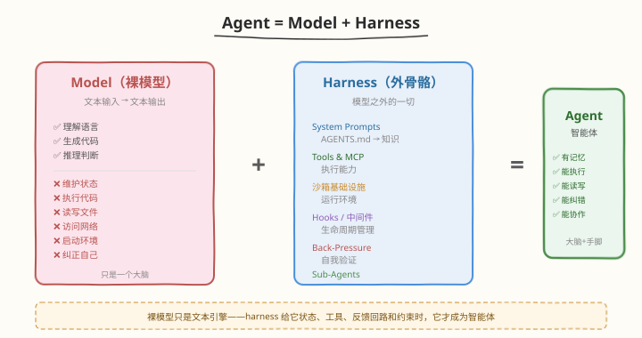
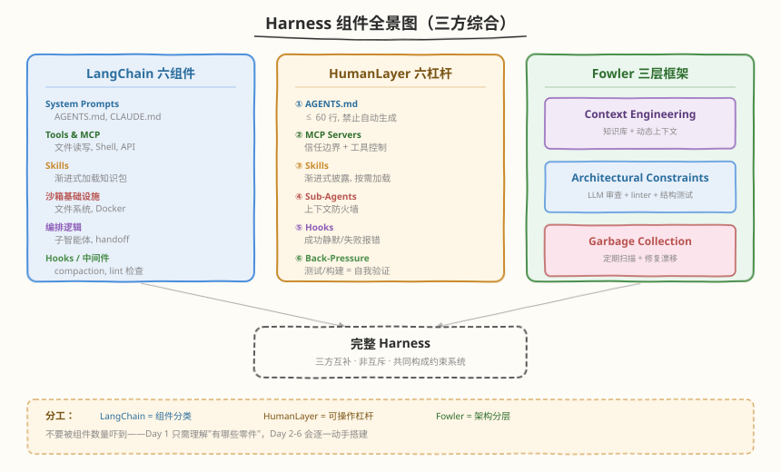
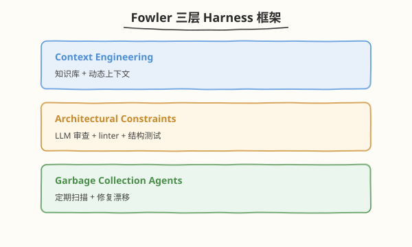
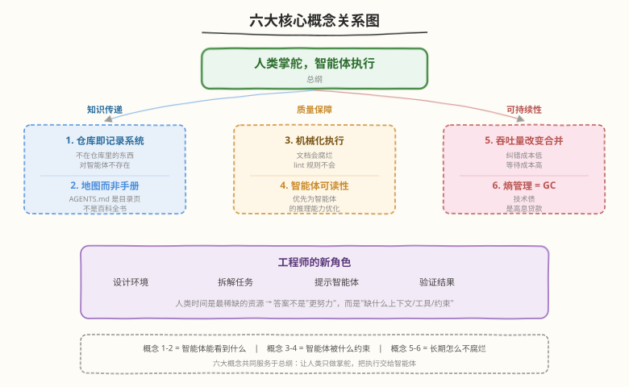

# Day 1：Harness 总览与核心范式

## 🎯 目标

通过今天的学习，你将：

1. 理解 Harness Engineering 的起源与核心范式——"人类掌舵，智能体执行"如何颠覆传统工程角色
2. 掌握 Agent = Model + Harness 公式，能解释裸模型与智能体的本质区别
3. 列出 harness 的完整组件清单（LangChain / HumanLayer / Fowler 三方综合），知道每个零件的作用
4. 说出六大核心概念的名称与一句话定义，理解它们之间的逻辑关系
5. 亲手完成一次"有 harness vs 无 harness"的对比实验，直观感受约束系统的价值
6. 理解模型与 harness 的耦合关系——为什么换 harness 后模型表现可能暴跌

> 💡 **前置知识**：会用任意编程语言写基本程序（Python / TypeScript / Go 均可），用过 AI 编程助手（Cursor / Claude Code / GitHub Copilot 等），会用 git 基本操作
> ⚠️ **环境要求**：本机装有一个 AI 编程助手（推荐 Claude Code 或 Cursor）、git、Python 3.10+

---

## 为什么学 Harness Engineering

### 从"辅助写代码"到"完全不写代码"

你大概率已经用过 AI 编程助手：在编辑器里按 Tab 补全代码、让 AI 生成一个函数、或者让它帮你修 bug。这是"AI 辅助人类写代码"——人类仍然是主力，AI 是工具。

2026 年 2 月，OpenAI 发布了一篇文章，描述了一种截然不同的模式：工程师**完全不写代码**，只设计约束系统，让 AI 智能体在约束内自主完成所有编码工作。

| 维度 | AI 辅助编码 | Harness Engineering |
|------|-----------|---------------------|
| 谁写代码 | 人类（AI 补全） | 智能体（人类不写） |
| 人类角色 | 执行者 + 决策者 | 决策者（掌舵） |
| AI 角色 | 辅助工具 | 执行者 |
| 工程师产出 | 代码 + 架构 | 约束系统（AGENTS.md / linter / 反馈回路） |
| 质量保障 | 人工 Code Review | 机械化护栏（lint + 结构测试 + 背压门控） |

### OpenAI 的实战数据

OpenAI 的 Ryan Lopopolo 用这种模式交出了一份惊人的成绩单：

| 指标 | 数据 |
|------|------|
| 团队规模 | 3 人 → 7 人 |
| 时间跨度 | 5 个月 |
| 代码量 | ~100 万行 |
| PR 数量 | ~1,500 个 |
| 人均日 PR | 3.5 个（扩展后仍在增长） |
| 单次运行时长 | 6+ 小时（通常在人类睡眠时间） |
| 效率估算 | 手工编写的 ~1/10 时间 |

3 个人，5 个月，100 万行代码，零手写。这不是理论设想，而是已经发生的事实。

> 💡 **一句话总结**：这不是"用 AI 辅助写代码"的升级版，而是工程角色的根本性转变——从"写代码的人"变成"设计约束系统让 AI 写代码的人"。

---

## 核心概念

### 1.1 Agent = Model + Harness

这是整个 Harness Engineering 的 foundational formula：



```
Agent = Model + Harness
Harness = 模型之外的一切代码、配置和执行逻辑
```

#### 裸模型能做什么

裸模型（bare model）只是一个文本输入/输出引擎：你给它文本（可能还有图片/音频），它返回文本。它**不能**：

| 能力 | 裸模型 | 原因 |
|------|--------|------|
| 维护状态 | ❌ | 每次调用是无状态的，没有记忆 |
| 执行代码 | ❌ | 没有运行时，不能跑 Python / Shell |
| 读写文件 | ❌ | 没有文件系统访问 |
| 访问网络 | ❌ | 没有网络请求能力 |
| 启动环境 | ❌ | 没有沙箱 / 容器 |
| 纠正自己 | ❌ | 没有反馈回路，不知道自己做得对不对 |

#### Harness 给模型加了什么

Harness 就是给裸模型补上这些能力的"外骨骼"：

| Harness 组件 | 补上的能力 | 效果 |
|-------------|-----------|------|
| System Prompts（AGENTS.md） | 知识与规则 | 模型知道项目规范、架构约束 |
| Tools & MCP | 执行能力 | 模型能跑代码、读写文件、调 API |
| 沙箱基础设施 | 运行环境 | 模型在隔离环境中安全操作 |
| Hooks / 中间件 | 生命周期管理 | 自动 compaction、续接、lint 检查 |
| Back-Pressure | 自我验证 | 做完任务后自动检查，不过就自我纠正 |
| Sub-Agents | 上下文防火墙 | 隔离复杂任务，防 context rot |

> 💡 **类比**：裸模型就像一个全能但没有手脚的大脑——它知道怎么写代码，但不能动手。Harness 就是手脚 + 眼睛 + 记忆 + 工具箱，让大脑变成一个能干活的工人。

### 1.2 Harness 完整组件清单

这个清单由 LangChain、HumanLayer、Martin Fowler 三方综合而成，是目前最完整的 harness 组件分类：



#### 来自 LangChain 的六大组件

| 组件 | 说明 | 具体例子 |
|------|------|----------|
| System Prompts | 智能体的"操作手册" | AGENTS.md、CLAUDE.md |
| Tools & MCP | 扩展智能体能力的工具和协议 | 文件读写、Shell 执行、Web 搜索 |
| Skills | 渐进式加载的知识包 | "如何写 pytest 测试"的技能包 |
| 沙箱基础设施 | 隔离执行环境 | 文件系统、浏览器、Docker 容器 |
| 编排逻辑 | 多智能体协调 | 子智能体生成、handoff、模型路由 |
| Hooks / 中间件 | 生命周期钩子 | compaction（压缩上下文）、续接、lint 检查 |

#### 来自 HumanLayer 的六个配置杠杆

HumanLayer 把 harness 浓缩为六个可操作的"杠杆"：

| # | 杠杆 | 要点 | 为什么重要 |
|---|------|------|-----------|
| 1 | AGENTS.md | ≤ 60 行，禁止自动生成 | 智能体的入口文件，太长会挤占上下文 |
| 2 | MCP Servers | 信任边界 + 工具数量控制 | 工具太多会让智能体选择困难 |
| 3 | Skills | 渐进式披露，按需加载 | 不是一次性塞给智能体，而是用到时才加载 |
| 4 | Sub-Agents | 上下文防火墙 | 隔离复杂子任务，防止主上下文被污染 |
| 5 | Hooks | 生命周期脚本 | 成功时静默、失败时报错——不打扰智能体 |
| 6 | Back-Pressure | 自我验证回路 | 测试/构建/类型检查 = 智能体的"自我纠错" |

#### 来自 Martin Fowler 的三层框架

Fowler 把 harness 从架构角度分为三层：



| 层级 | 职责 | 对应概念 |
|------|------|----------|
| Context Engineering | 给智能体提供正确的知识和上下文 | 仓库即记录系统、地图而非手册 |
| Architectural Constraints | 用机械化手段约束代码结构 | 机械化执行、智能体可读性 |
| Garbage Collection Agents | 定期清理技术债 | 熵管理 = 垃圾回收 |

> ⚠️ **注意**：不要被组件数量吓到。Day 1 只需要理解"有哪些零件"，Day 2-6 会逐一动手搭建。你不需要一天内全部掌握——本周的学习路径就是从理解到实践逐步展开的。

### 1.3 六大核心概念速览

OpenAI 在原文中提出了六大核心概念，它们之间的关系构成了 Harness Engineering 的完整框架：



| # | 概念 | 一句话 | 解决什么问题 |
|---|------|--------|-------------|
| 1 | 仓库即记录系统 | 不在仓库里的东西，对智能体不存在 | 知识传递：人脑/Slack/Docs → 仓库 |
| 2 | 地图而非手册 | AGENTS.md 是目录页，不是百科全书 | 上下文管理：渐进式披露 |
| 3 | 机械化执行 | 文档会腐烂，lint 规则不会 | 质量保障：从"靠人读"到"自动执行" |
| 4 | 智能体可读性 | 优先为智能体的推理能力优化 | 技术选型：选"无聊"技术 |
| 5 | 吞吐量改变合并理念 | 纠错成本低，等待成本高 | 工作流：快速合并 + 快速纠错 |
| 6 | 熵管理 = 垃圾回收 | 技术债是高息贷款 | 长期维护：防止坏模式扩散 |

总纲：**人类掌舵，智能体执行**。

- 人类时间是最稀缺的资源
- 出问题时，答案不是"更努力"，而是"缺什么上下文/工具/约束"
- 工程师的新角色：设计环境 → 拆解任务 → 提示智能体 → 验证结果

> 💡 **概念间的逻辑链**：概念 1-2 解决"智能体能看到什么"（知识传递），概念 3-4 解决"智能体被什么约束"（质量保障），概念 5-6 解决"长期运行怎么不腐烂"（可持续性）。六大概念共同服务于总纲——让人类只做掌舵，把执行交给智能体。

### 1.4 模型与 Harness 的耦合

LangChain 的一个关键发现：模型和 harness 不是独立的两层，它们**共同训练、相互耦合**。

| 发现 | 数据 | 启示 |
|------|------|------|
| 模型 overfit 到特定 harness | 换 harness 后表现暴跌 | 换模型时要验证 harness 是否还合适 |
| 纯 harness 优化收益巨大 | Terminal Bench 2.0：Top 30 → Top 5 | 投入 harness 优化的 ROI 可能高于换模型 |
| 最优 harness 因任务而异 | 不一定等于 post-training 时用的那个 | 不要盲目复制别人的 harness |

> 💡 **关键洞察**：模型在 post-training 阶段与特定 harness 共同训练，形成了"模型-harness"的耦合体。这意味着两个推论：①投入 harness 优化的回报可能比换更贵的模型更大；②换模型时不能假设现有 harness 仍然最优。

---

## 最小可运行示例

今天的实践目标：亲手感受"有 harness"和"无 harness"的差异。

### 任务 1：准备实验项目

```bash
# 创建实验目录
mkdir -p ~/harness-day1 && cd ~/harness-day1
git init

# 创建一个极简的 Python 项目结构
mkdir -p src tests

# 写一个简单的模块
cat > src/calculator.py << 'EOF'
def add(a, b):
    return a + b

def subtract(a, b):
    return a - b

def multiply(a, b):
    return a * b

def divide(a, b):
    if b == 0:
        raise ValueError("Cannot divide by zero")
    return a / b
EOF

git add -A && git commit -m "init: simple calculator project"
```

### 任务 2：无 Harness 实验

在没有 AGENTS.md、没有约束的情况下，让 AI 助手给项目添加一个"幂运算"功能：

```bash
# 确保当前目录没有 AGENTS.md
ls AGENTS.md 2>/dev/null && rm AGENTS.md

# 打开你的 AI 编程助手（以 Claude Code 为例）
# 给它这个指令：
# "给 src/calculator.py 添加一个 power(base, exponent) 函数，并写对应的测试"
```

记录观察结果：

| 观察维度 | 记录 |
|----------|------|
| AI 是否知道项目用 pytest？ | |
| AI 是否知道测试放哪个目录？ | |
| AI 是否知道函数命名规范？ | |
| AI 写的测试是否可运行？ | |
| AI 是否加了类型注解？ | |
| 你需要手动纠正几次？ | |

### 任务 3：有 Harness 实验

现在创建一个最小的 AGENTS.md（明天 Day 2 会深入学怎么写好的 AGENTS.md，今天先用简化版）：

```bash
cat > AGENTS.md << 'EOF'
# Calculator 项目

> 简单的数学运算库

## 仓库结构

| 目录 | 内容 |
|------|------|
| `src/` | 源码，每个模块对应一个数学功能 |
| `tests/` | 测试，用 pytest，每个 src 模块对应一个 test 文件 |

## 开发约定

- 语言：Python 3.10+
- 所有 public 函数必须有类型注解和 docstring
- 测试框架：pytest，测试文件命名 test_<module>.py
- 函数命名：snake_case，动词开头

## 机械化检查

完成任务后运行：
    pytest tests/ -v
确保所有测试通过。
EOF

git add AGENTS.md && git commit -m "add: AGENTS.md"
```

现在给 AI 助手**同样的指令**："给 src/calculator.py 添加一个 power(base, exponent) 函数，并写对应的测试"

记录观察结果，与无 harness 版本对比：

| 观察维度 | 无 Harness | 有 Harness |
|----------|-----------|-----------|
| 知道用 pytest？ | | |
| 知道测试目录？ | | |
| 函数命名规范？ | | |
| 有类型注解？ | | |
| 有 docstring？ | | |
| 测试可运行？ | | |
| 需要手动纠正次数？ | | |

```bash
# 验证 AI 生成的测试是否能跑通
pytest tests/ -v
```

```text
# 预期输出（有 harness 时，AI 应该能一次写对）
============================= test session starts =============================
collected 4 items

tests/test_calculator.py::test_add PASSED
tests/test_calculator.py::test_subtract PASSED
tests/test_calculator.py::test_multiply PASSED
tests/test_calculator.py::test_divide PASSED
tests/test_calculator.py::test_power PASSED

============================== 5 passed ==============================
```

> 💡 **实验结论**：仅凭一个 ~20 行的 AGENTS.md，AI 助手的行为就会有显著改善。它知道用什么测试框架、测试放哪里、函数怎么命名。这就是 harness 的力量——用最小的约束换取最大的可靠性提升。Day 2-6 会逐步把这些约束机械化、自动化。

---

## 深入原理

### 从控制论理解 Harness

Martin Fowler 在正式版文章中用控制论框架对 harness 做了升维。核心是 Guides × Sensors 2×2 矩阵：

| | 计算性（确定性，CPU） | 推理性（语义，LLM） |
|--|---------|---------|
| **引导器/前馈** | bootstrap 脚本、LSP、类型检查 | AGENTS.md、Skills、architecture.md |
| **传感器/反馈** | linter、结构测试、覆盖率 | AI code review、LLM-as-judge |

- **引导器（Guides / 前馈）**：在智能体行动**之前**引导它，增加首次成功概率
- **传感器（Sensors / 反馈）**：在智能体行动**之后**观察，启用自我纠正
- **计算性**：确定性、快速、便宜，每次提交都跑
- **推理性**：概率性、慢、贵，选择性运行

> ⚠️ **关键洞察**：单独使用任一维度都不行——只有反馈 = 反复犯同样错误（不知道该怎么做）；只有前馈 = 不知道规则是否生效（没有验证）。**前馈 + 反馈 = 闭环**，这是 harness 能让智能体可靠工作的控制论根基。

### Ashby 必要多样性定律

> 调节器必须至少拥有与被调节系统同等的多样性。

这条控制论定律在 harness 中的含义：

1. LLM 能生成几乎任何代码（高多样性输出）
2. 如果不加约束，你无法预测它会生成什么（多样性太高，调节器——人类——跟不上）
3. 通过选定拓扑结构（架构规则、lint 约束、类型系统），你**削减了输出的多样性**
4. 多样性降低后，harness 的调节能力就能覆盖输出空间 → 全面 harness 变得可行

这就是"**约束越严，自主性越强**"的控制论根基——听起来矛盾，但逻辑严密：约束削减了需要考虑的可能性，让智能体在更小的搜索空间内自主决策，反而更可靠。

### "人类掌舵，智能体执行"的分工

| 层级 | 谁做 | 做什么 |
|------|------|--------|
| 意图层 | 人类 | 确定要解决什么问题、验收标准是什么 |
| 约束层 | 人类 | 设计 AGENTS.md、linter、架构规则、反馈回路 |
| 执行层 | 智能体 | 在约束内写代码、跑测试、自我纠正 |
| 验证层 | 机械化 | lint / 类型检查 / 结构测试 / 背压门控自动执行 |
| 例外处理 | 人类 | 智能体反复失败时介入诊断、调整约束 |

关键：人类**不参与执行层**。人类的注意力是最稀缺的资源，应该花在设计约束和处理例外上，而不是审查每一行代码。

### Harness.io（CI/CD 平台）的关系

你可能搜过"harness"并发现了一个同名 CI/CD 平台 Harness.io。两者不是同一个东西，但共享同一个工程哲学：

```
AI Harness Engineering          Harness.io (CI/CD)
约束 AI 智能体的行为              约束代码交付的过程
AGENTS.md + linter + 背压       Pipeline + Policy-as-Code + 门控
目标：可靠的代码生成              目标：可靠的代码部署

共同本质：用确定性约束驾驭不确定性系统
         Backpressure over Prescription
```

---

## 常见陷阱与最佳实践

### 陷阱 1：把 AGENTS.md 当百科全书写

```markdown
# ❌ 错误：AGENTS.md 写了 500 行，什么细节都塞进去
# 包括：完整的编码规范、所有 API 文档、每个模块的详细说明...
# 结果：挤占智能体上下文、没人维护、无法机械验证

# ✅ 正确：AGENTS.md ≤ 60 行，只放目录和导航
# 详细规范拆到子文档，用链接指向
```

| AGENTS.md 行数 | 效果 |
|---------------|------|
| < 60 行 | 智能体快速理解项目全貌，按需深入 |
| 60-200 行 | 开始挤占上下文，智能体可能忽略后半部分 |
| > 200 行 | 几乎无效：挤占上下文 + 无人维护 + 无法验证 |

### 陷阱 2：用自然语言描述本该机械化的规则

```markdown
# ❌ 错误：在 AGENTS.md 里写"函数不要超过 50 行"
# 靠智能体自觉遵守 → 它会忘记、会忽略

# ✅ 正确：写一个 lint 规则或结构测试
# tests/test_structure.py:
#   def test_function_under_50_lines():
#       ...  # 自动检查，违反就 FAIL
```

> 文档会腐烂，lint 规则不会。

### 陷阱 3：以为换更强的模型就能解决可靠性问题

```
❌ 思路：AI 生成的代码老出问题 → 换 GPT-5 / Claude 4
✅ 思路：AI 生成的代码老出问题 → 检查 harness 缺了什么约束
```

Terminal Bench 2.0 数据表明：纯 harness 优化可以把排名从 Top 30 拉到 Top 5。在投入更贵的模型之前，先检查你的 harness 是否到位。

### 陷阱 4：人类深入到循环内部

```
❌ 做法：人类盯着智能体每一步，逐行审查它写的代码
✅ 做法：人类设计好约束和背压门控，坐在循环上监控，只在例外时介入
```

Ralph 信条："坐在循环上，不坐在循环里"（Let Ralph Ralph）。如果你发现自己每天花大量时间审查 AI 的代码，说明你的 harness 不够强——缺的不是人力，而是约束。

### 最佳实践

| 实践 | 说明 |
|------|------|
| 先写 AGENTS.md 再写代码 | 约束先行，让智能体从一开始就在 harness 内工作 |
| 每条规范都要有机械化检查 | 无法 lint 的规则 = 无效规则 |
| 错误信息内嵌修复指令 | 智能体看到 lint 报错应该知道怎么修，而不是只看到一个 "Error" |
| 选"无聊"技术 | API 稳定、训练集覆盖好的技术，智能体成功率更高 |
| 快速合并 + 快速纠错 | 纠错成本低于等待成本时，不要追求完美再合并 |
| 定期扫描漂移 | 智能体会复现仓库里的坏模式，定期扫描防止熵增 |

---

## 面试要点

1. **什么是 Harness Engineering？它和传统工程有什么区别？**

<details>
<summary>点击查看答案</summary>

- Harness Engineering 是 OpenAI 在 2026 年 2 月提出的工程范式：工程师不再写代码，而是设计环境、明确意图、构建反馈回路，让 AI 智能体可靠地完成工作
- 核心转变：产出从代码变成约束系统（AGENTS.md / linter / 反馈回路）
- 与传统工程的区别：
  - 传统：人类写代码 → 机器执行代码
  - Harness：人类设计约束 → 智能体写代码 → 机器执行代码
- 总纲：人类掌舵，智能体执行

</details>

2. **Agent = Model + Harness 是什么意思？**

<details>
<summary>点击查看答案</summary>

- 裸模型只是文本输入/输出引擎，不能维护状态、执行代码、访问实时知识、搭建环境
- Harness = 模型之外的一切代码、配置和执行逻辑
- Harness 给模型补上：System Prompts（知识）、Tools & MCP（执行能力）、沙箱（环境）、Hooks（生命周期）、Back-Pressure（自我验证）、Sub-Agents（上下文防火墙）
- 当 harness 给模型状态、工具、反馈回路和可执行约束时，它才成为智能体

</details>

3. **Harness 的完整组件清单有哪些？**

<details>
<summary>点击查看答案</summary>

三方综合：
- **LangChain 六组件**：System Prompts、Tools & MCP、Skills、沙箱基础设施、编排逻辑、Hooks/中间件
- **HumanLayer 六杠杆**：AGENTS.md（≤60行）、MCP Servers、Skills、Sub-Agents、Hooks、Back-Pressure
- **Fowler 三层框架**：Context Engineering（知识库+动态上下文）、Architectural Constraints（LLM审查+linter+结构测试）、Garbage Collection Agents（定期扫描+修复漂移）

</details>

4. **六大核心概念分别是什么？它们之间有什么逻辑关系？**

<details>
<summary>点击查看答案</summary>

六大概念：
1. 仓库即记录系统：不在仓库里的东西，对智能体不存在
2. 地图而非手册：AGENTS.md 是目录页，不是百科全书
3. 机械化执行：文档会腐烂，lint 规则不会
4. 智能体可读性：优先为智能体的推理能力优化
5. 吞吐量改变合并理念：纠错成本低，等待成本高
6. 熵管理 = 垃圾回收：技术债是高息贷款

逻辑链：
- 概念 1-2 解决"智能体能看到什么"（知识传递）
- 概念 3-4 解决"智能体被什么约束"（质量保障）
- 概念 5-6 解决"长期运行怎么不腐烂"（可持续性）

</details>

5. **模型和 harness 的耦合关系是什么？对实践有什么启示？**

<details>
<summary>点击查看答案</summary>

- 模型在 post-training 阶段与特定 harness 共同训练，形成"模型-harness"耦合体
- 模型可能 overfit 到特定 harness，换 harness 后表现暴跌
- Terminal Bench 2.0 数据：纯 harness 优化可以把排名从 Top 30 拉到 Top 5
- 启示：①投入 harness 优化的 ROI 可能高于换模型；②换模型时要验证 harness 是否还合适；③最优 harness 因任务而异，不要盲目复制

</details>

6. **Guides × Sensors 2×2 矩阵是什么？为什么需要前馈和反馈？**

<details>
<summary>点击查看答案</summary>

- 引导器（前馈）：在智能体行动之前引导它，增加首次成功概率
  - 计算性：bootstrap 脚本、LSP、类型检查
  - 推理性：AGENTS.md、Skills、architecture.md
- 传感器（反馈）：在智能体行动之后观察，启用自我纠正
  - 计算性：linter、结构测试、覆盖率
  - 推理性：AI code review、LLM-as-judge
- 为什么需要两者：只有反馈 = 反复犯同样错误（不知道该怎么做）；只有前馈 = 不知道规则是否生效（没有验证）。前馈 + 反馈 = 闭环

</details>

7. **Ashby 必要多样性定律如何解释"约束越严，自主性越强"？**

<details>
<summary>点击查看答案</summary>

- Ashby 定律：调节器必须至少拥有与被调节系统同等的多样性
- LLM 能生成几乎任何代码（高多样性），如果不加约束，人类无法预测和调节
- 通过架构规则、lint 约束、类型系统选定拓扑结构，削减了输出的多样性
- 多样性降低后，harness 的调节能力就能覆盖输出空间
- 所以"约束越严"→ 输出空间越小 → 调节器（harness）能覆盖 → 智能体可以更自主地在这个空间内决策 → "自主性越强"

</details>

8. **"坐在循环上，不坐在循环里"是什么意思？**

<details>
<summary>点击查看答案</summary>

- 这是 Ralph 循环的一条核心信条
- "坐在循环里"：人类深入到智能体的每一步执行中，逐行审查代码、逐步指导——这违背了"人类掌舵，智能体执行"的分工
- "坐在循环上"：人类设计好约束和背压门控后，在循环外部监控运行状态，只在例外（智能体反复失败、需要调整约束）时介入
- 如果发现自己每天花大量时间审查 AI 的代码，说明 harness 不够强——缺的不是人力，而是约束

</details>

---

## 今日总结

Day 1 我们建立了对 Harness Engineering 的整体认知：

1. **范式转变**：从"人类写代码"到"人类设计约束系统让 AI 写代码"——产出从代码变成约束
2. **核心公式**：Agent = Model + Harness，裸模型加上 harness 组件才成为智能体
3. **组件清单**：LangChain 六组件 + HumanLayer 六杠杆 + Fowler 三层框架，共同构成完整 harness
4. **六大概念**：仓库即记录系统 / 地图而非手册 / 机械化执行 / 智能体可读性 / 吞吐量改变合并理念 / 熵管理 = 垃圾回收
5. **控制论根基**：Guides × Sensors 矩阵 + Ashby 必要多样性定律解释了"约束越严，自主性越强"
6. **模型耦合**：模型与 harness 共同训练，纯 harness 优化可把排名从 Top 30 拉到 Top 5
7. **实践感受**：仅凭一个 ~20 行的 AGENTS.md，AI 助手的行为就有显著改善

> 💡 **明日预告**：Day 2 将深入前两个核心概念——"仓库即记录系统"和"地图而非手册"。你将为自己的项目亲手写出第一版合格的 AGENTS.md（≤60 行），并理解渐进式披露为什么比巨型指令文件更有效。

---

## 推荐资源

| 资源 | 类型 | 优先级 | 说明 |
|------|------|--------|------|
| [OpenAI — Harness Engineering 原文](https://openai.com/zh-Hans-CN/index/harness-engineering/) | 官方 | ⭐ 必读 | 范式的完整阐述，六大概念的原始来源 |
| [Mitchell Hashimoto: Engineer the Harness](https://mitchellh.com/writing/my-ai-adoption-journey#step-5-engineer-the-harness) | 博客 | ⭐ 必读 | "harness engineering" 命名出处 |
| [Martin Fowler — Harness Engineering 正式版](https://martinfowler.com/articles/harness-engineering.html) | 博客 | ⭐ 必读 | 控制论框架 + Guides × Sensors 矩阵 |
| [LangChain — Scaling Managed Agents](https://blog.langchain.dev/scaling-managed-agents/) | 博客 | 📌 推荐 | 模型与 harness 耦合的详细分析 |
| [Anthropic — How We Contain Claude](https://www.anthropic.com/research/containment) | 官方 | 📌 推荐 | harness 的安全约束实践 |
| [snarktank/ralph](https://github.com/snarktank/ralph) | 开源项目 | 📌 推荐 | Ralph 循环的原始实现，六条信条 |
| [harness-engineering 学习档案](https://github.com/deusyu/harness-engineering) | 社区 | 📎 参考 | 74 篇文章深度摘要 + 34 篇翻译 |
| [HumanLayer — 6 Levers of Agent Config](https://humanlayer.com/) | 博客 | 📎 参考 | 六个配置杠杆的原始阐述 |
