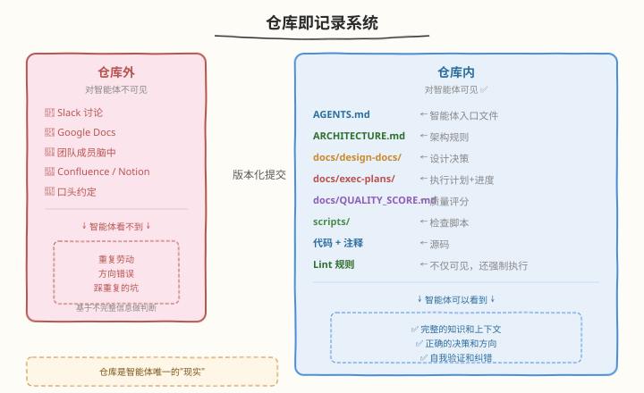
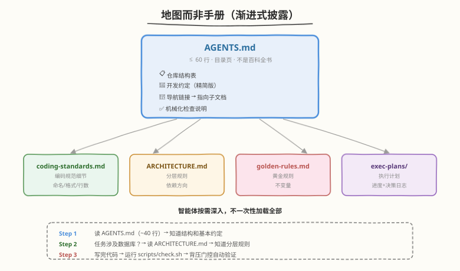

# Day 2：仓库即记录系统 + 地图而非手册

## 🎯 目标

通过今天的学习，你将：

1. 理解"仓库即记录系统"——为什么 Slack 讨论、Google Docs、脑子里的知识对智能体不存在，以及如何把隐性知识版本化进仓库
2. 掌握"地图而非手册"的设计哲学——为什么 AGENTS.md 是目录页而非百科全书，渐进式披露如何工作
3. 能说出巨型指令文件的三个死因，并理解为什么 ≤ 60 行是最佳实践
4. 亲手为练手项目写出第一版合格的 AGENTS.md，包含仓库结构、开发约定、导航、机械化检查说明
5. 理解 OpenAI Symphony 如何把"记录系统"从仓库扩展到任务跟踪器，以及 SPEC.md / WORKFLOW.md 的"约束即产品"思想
6. 完成一次项目知识审计，找出隐藏在仓库之外的关键信息并补齐

> 💡 **前置知识**：已完成 Day 1 学习，理解 Agent = Model + Harness 公式和六大核心概念概览
> ⚠️ **环境要求**：Day 1 的练手项目（`~/harness-day1` 或你自己的项目）、git、AI 编程助手

---

## 为什么学这两个概念

Day 1 我们建立了 harness 的整体认知：Agent = Model + Harness，六大概念共同服务于"人类掌舵，智能体执行"。但有一个前提问题没有回答：**智能体怎么知道它该做什么、怎么做？**

答案看似简单——"告诉它"——但"告诉"的方式决定了智能体能否可靠工作：

| 告诉方式 | 智能体能否接收 | 问题 |
|----------|---------------|------|
| Slack 讨论里说了 | ❌ | 智能体看不到 Slack |
| Google Docs 里写了 | ❌ | 智能体看不到 Google Docs |
| 口头跟同事说了 | ❌ | 智能体听不到 |
| README 里写了 | ✅ | 但 README 通常是给人看的，不是给智能体优化的 |
| AGENTS.md 里写了 | ✅✅ | 专门为智能体设计的入口文件 |
| lint 规则里编码了 | ✅✅✅ | 不仅能看到，还能自动执行 |

今天的前两个概念解决的就是这个"知识传递"问题：

- **概念 1：仓库即记录系统** — 确保智能体能看到所有该看到的东西
- **概念 2：地图而非手册** — 确保智能体不会被信息淹没，按需获取

> 💡 **一句话总结**：概念 1 解决"有没有"（知识在不在仓库里），概念 2 解决"好不好"（智能体能不能高效获取）。两者合在一起，构成了 harness 的知识传递层。

---

## 核心概念

### 1.1 仓库即记录系统（Repo as System of Record）

#### 核心原则

> 智能体在运行时无法访问的任何内容，对它来说都**不存在**。

这句话是整个概念的全部精髓。智能体的"现实"只有一个：**仓库**。仓库之外的东西，无论对人类多么重要，对智能体来说都是不存在的。



#### 知识存放位置对比

| 位置 | 对人类 | 对智能体 | 问题 |
|------|--------|----------|------|
| Google Docs | ✅ | ❌ | 智能体无法访问外部文档平台 |
| Slack 讨论 | ✅ | ❌ | 智能体无法读取聊天记录 |
| 团队成员脑中 | ✅ | ❌ | 隐性知识，完全不可见 |
| Confluence / Notion | ✅ | ❌ | 需要浏览器访问，通常不在智能体工具链中 |
| 仓库内 Markdown | ✅ | ✅ | 智能体可以读取 |
| 代码 + 注释 | ✅ | ✅ | 智能体可以读取 |
| Lint 规则 | 间接 ✅ | ✅（强制执行） | 不仅可见，还不可违反 |
| AGENTS.md | ✅ | ✅✅ | 专为智能体设计的入口 |

> ⚠️ **关键区分**：人类可以同时看 Slack、Google Docs、仓库代码，在多个信息源之间自由切换。智能体在运行时只能访问它被赋予的工具——通常是文件系统和 Shell。如果某个决策只在 Slack 里讨论过、没有落进仓库，智能体就永远不知道这个决策的存在，它会基于不完整的信息做判断。

#### 什么应该进仓库

OpenAI 的原文给出了一个完整的仓库文档结构：

```
项目仓库/
├── AGENTS.md              ← 入口目录（~100 行，给智能体看的）
├── ARCHITECTURE.md        ← 域和包分层的顶层地图
├── README.md              ← 给人类看的项目说明
├── docs/
│   ├── design-docs/       ← 设计决策，带验证状态
│   ├── exec-plans/        ← 执行计划，带进度和决策日志
│   │   ├── active/        ←   进行中的计划
│   │   └── completed/     ←   已完成的计划
│   ├── product-specs/     ← 产品规格
│   ├── references/        ← 外部参考（llms.txt）
│   ├── generated/         ← 自动生成（DB schema 等）
│   ├── QUALITY_SCORE.md   ← 每个领域的质量评分
│   ├── RELIABILITY.md     ← 可靠性要求
│   └── SECURITY.md        ← 安全规范
├── src/                   ← 源码
├── tests/                 ← 测试
└── scripts/               ← 检查脚本
```

注意几个关键设计：

| 文件/目录 | 为什么必须在仓库里 |
|-----------|-------------------|
| `AGENTS.md` | 智能体的入口文件，告诉它项目是什么、怎么工作 |
| `ARCHITECTURE.md` | 架构规则，智能体需要知道分层和依赖方向 |
| `docs/design-docs/` | 设计决策的"为什么"，防止智能体误解意图 |
| `docs/exec-plans/` | 执行计划是一等工件——版本化、带进度日志 |
| `docs/QUALITY_SCORE.md` | 每个领域的质量评分，智能体知道哪些模块质量好/差 |
| `scripts/` | 机械化检查脚本，智能体完成任务后必须运行 |

#### 执行计划是一等工件

OpenAI 特别强调：执行计划不是临时文档，而是**版本化的一等工件**，带进度和决策日志：

```markdown
<!-- docs/exec-plans/active/add-user-auth.md -->

# 执行计划：添加用户认证

## 目标
为 API 添加 JWT 认证，保护 /api/* 端点。

## 决策日志
- 2026-03-01：选择 JWT 而非 session cookie（原因：无状态，适合智能体测试）
- 2026-03-02：决定用 PyJWT 而非自研（原因：训练集覆盖好，"无聊"技术）

## 步骤
- [x] 1. 创建 auth 模块结构
- [x] 2. 实现 JWT 生成与验证
- [ ] 3. 添加认证中间件
- [ ] 4. 编写测试
- [ ] 5. 更新 AGENTS.md 导航

## 当前状态
步骤 3 进行中。中间件需要访问数据库验证用户是否存在。
```

为什么这很重要？因为智能体每次启动时需要知道"现在做到哪了"、"之前做了什么决策"。如果这些信息只在人脑里或 Slack 里，智能体每次都要从头猜测——这会导致重复劳动或方向错误。

> 💡 **一句话总结**：仓库不仅存代码，还存所有决策、规范、计划和状态。仓库是智能体唯一的"现实"——不在仓库里的东西，对智能体不存在。

### 1.2 地图而非手册（Map, Not Manual）

#### 设计哲学

如果说"仓库即记录系统"解决了"知识有没有在仓库里"的问题，那"地图而非手册"解决的是"知识怎么组织才让智能体高效获取"的问题。

核心原则：**渐进式披露**（Progressive Disclosure）——智能体从小入口点开始，被指导下一步该看什么。



```
传统文档：百科全书式
  README.md (500 行) → 什么都写，智能体一次全读 → 挤占上下文

Harness 文档：地图式
  AGENTS.md (~60 行) → 只写目录和导航 → 智能体按需深入
    ├── 需要编码规范？→ docs/coding-standards.md
    ├── 需要架构说明？→ ARCHITECTURE.md
    └── 需要执行计划？→ docs/exec-plans/active/
```

#### 巨型指令文件的三个死因

为什么不能把所有规范写进一个巨大的 AGENTS.md？三个致命问题：

| 死因 | 说明 | 后果 |
|------|------|------|
| **挤占上下文** | AGENTS.md 太长会挤占智能体的 context window | 智能体用于推理的空间被压缩，性能下降 |
| **无法维护** | 超过 200 行的文件没人会持续更新 | 文档与代码脱节，变成"腐烂的文档" |
| **无法机械验证** | 自然语言描述的规则无法被 linter 检查 | 规则靠智能体自觉遵守，不可靠 |

> ⚠️ **Context Rot 问题**：LangChain 的研究发现，上下文窗口填满后，模型性能会退化（进入"dumb zone"）。AGENTS.md 越长，留给智能体实际工作推理的空间越少。HumanLayer 的建议是 AGENTS.md ≤ 60 行——这不是随意设定的数字，而是平衡"信息量"与"上下文成本"后的经验值。

#### AGENTS.md 的结构模板

一个合格的 AGENTS.md 应该包含以下五个部分，且总计不超过 60 行：

```markdown
# <项目名>

> 一句话定位

## 仓库结构

| 目录 | 内容 | 说明 |
|------|------|------|
| `src/` | 源码 | 主逻辑 |
| `tests/` | 测试 | 单元测试 + 结构测试 |
| `docs/` | 文档 | 架构决策、设计文档 |
| `scripts/` | 检查脚本 | lint / 类型检查 / 背压门控 |

## 开发约定

- 语言：Python 3.10+
- 测试：pytest，覆盖率 > 80%
- 提交：conventional commits
- 所有 public 函数必须有类型注解

## 导航

- 编码规范详见 [docs/coding-standards.md](docs/coding-standards.md)
- 架构决策详见 [docs/adr/](docs/adr/)
- 黄金规则详见 [docs/golden-rules.md](docs/golden-rules.md)
- 环境搭建详见 [README.md](README.md)

## 机械化检查

完成任务后必须运行：`bash scripts/check.sh`
漂移扫描：`python scripts/scan_drift.py`
```

| 部分 | 行数 | 作用 |
|------|------|------|
| 标题 + 定位 | 2 行 | 智能体知道这是什么项目 |
| 仓库结构表 | 8-10 行 | 智能体知道文件在哪 |
| 开发约定 | 5-8 行 | 智能体知道基本规范 |
| 导航 | 5-8 行 | 智能体知道去哪找详细信息 |
| 机械化检查 | 3-5 行 | 智能体知道怎么自我验证 |
| **总计** | **~30-40 行** | 留有余量，不超过 60 行 |

#### 渐进式披露的工作流

智能体读取 AGENTS.md 后，不会一次性加载所有子文档，而是根据任务**按需深入**：

```
智能体收到任务："给项目添加用户注册功能"

1. 读 AGENTS.md（~40 行）
   → 知道项目结构、基本约定、去哪找详细信息

2. 任务涉及数据库操作 → 读 ARCHITECTURE.md
   → 知道分层规则：routes → service → database

3. 需要写测试 → 读 AGENTS.md 导航指向的编码规范
   → 知道用 pytest、测试文件命名规则

4. 写完代码 → 运行 scripts/check.sh
   → 背压门控自动验证

整个过程：智能体只加载了它需要的上下文，没有一次性塞入全部文档
```

> 💡 **类比**：AGENTS.md 就像图书馆的索引卡片——它不包含书的内容，只告诉你书在哪。你根据需要去取具体的书，而不是把整个图书馆搬进脑子。HumanLayer 把这种模式称为 Skills 的"渐进式披露"——知识按需加载，不在启动时预装所有工具。

### 1.3 记录系统的延伸：任务跟踪器与约束即产品

#### OpenAI Symphony — 从仓库到任务跟踪器

OpenAI 的 Symphony 编排规范把"记录系统"的边界**从仓库扩展到任务跟踪器**：

> **代码与文档放仓库；在飞工作放跟踪器。两者都对智能体可见，缺一不可。**

| 信息类型 | 存放位置 | 对智能体 |
|----------|----------|---------|
| 已合并的代码与文档 | 仓库 | ✅ 可见 |
| 正在进行的工作 | 任务跟踪器（Linear / Jira / GitHub Issues） | ✅ 必须 |
| 已废弃的尝试 | 任务跟踪器的关闭记录 | ✅ 必须 |

为什么任务跟踪器也必须是记录系统？如果智能体只能看到"已合并的过去"，看不到"正在进行的现在"，它可能：
- 重复劳动：做别人正在做的事
- 抢工作：在已有人认领的任务上继续推进
- 重复失败：踩别人已经踩过的坑

Symphony 的方案：每个打开的 ticket 是一个"在飞工作"的记录单元，状态机映射到 ticket 状态字段（Backlog → In Progress → Review → Merging → Done）。

#### SPEC.md + WORKFLOW.md — 约束即产品

OpenAI Symphony 把"地图而非手册"推到了极致——仓库主体只是 `SPEC.md` + `WORKFLOW.md`，参考实现的地位明确为"参考"，社区被鼓励自己拿规范跑一份。

| 文件 | 定义什么 | 不定义什么 |
|------|---------|-----------|
| `SPEC.md` | 要解决的问题、目标解法形态、取舍边界 | 使用什么语言、什么库、什么部署方式 |
| `WORKFLOW.md` | 开发流程的每一步（从 ticket 到合并） | 具体实现细节 |

这揭示了一个更深层的思想：**当编码智能体能从规范生成实现时，可分发的产品形态从"代码"反转为"规范"**。传统开源项目维护代码，Spec as Product 项目维护规范本身。

> 💡 **关键洞察**：Linus 说"优秀的程序员关心数据结构及其关系"。Spec as Product 时代的对应陈述是：**"优秀的工程师关心约束及其可组合性"**——当代码免费时，工程的核心价值集中在约束设计。

---

## 最小可运行示例

### 任务 1：项目知识审计

打开 Day 1 的练手项目（或你自己的项目），审计关键信息是否都在仓库里：

```bash
cd ~/harness-day1
```

逐一检查以下内容：

| 内容 | 在仓库里？ | 应该放哪 | 检查方式 |
|------|-----------|----------|----------|
| 项目目标 | | README.md | `cat README.md` 看有没有 |
| 架构决策 | | docs/adr/ 或 README.md | `ls docs/adr/ 2>/dev/null` |
| 编码规范 | | AGENTS.md 或 docs/ | `grep -r "coding" docs/` |
| 依赖说明 | | requirements.txt / pyproject.toml | `ls requirements.txt pyproject.toml` |
| 环境搭建步骤 | | README.md 或 Makefile | `grep -i "install\|setup" README.md` |
| 已知问题 | | GitHub Issues 或 TODO.md | `ls TODO.md 2>/dev/null` |
| 测试约定 | | AGENTS.md | `grep -i "test" AGENTS.md` |
| 执行计划 | | docs/exec-plans/ | `ls docs/exec-plans/ 2>/dev/null` |

```bash
# 运行审计脚本
cat > scripts/audit_knowledge.sh << 'SCRIPT'
#!/bin/bash
# 审计项目知识是否都在仓库里

echo "=== 项目知识审计 ==="
echo ""

check() {
    if [ -e "$2" ]; then
        echo "  ✅ $1 → $2"
    else
        echo "  ❌ $1 → 缺失（建议放在 $2）"
    fi
}

check "项目目标" "README.md"
check "AGENTS.md" "AGENTS.md"
check "编码规范" "docs/coding-standards.md"
check "架构说明" "ARCHITECTURE.md"
check "依赖说明" "requirements.txt"
check "环境搭建" "Makefile"
check "执行计划目录" "docs/exec-plans"
check "已知问题" "TODO.md"
check "检查脚本" "scripts/check.sh"

echo ""
echo "=== 审计完成 ==="
echo "❌ 标记的项目需要补齐——它们对智能体不可见"
SCRIPT

chmod +x scripts/audit_knowledge.sh
bash scripts/audit_knowledge.sh
```

```text
# 预期输出（初次审计，多数项目会暴露缺失）
=== 项目知识审计 ===

  ✅ 项目目标 → README.md
  ✅ AGENTS.md → AGENTS.md
  ❌ 编码规范 → 缺失（建议放在 docs/coding-standards.md）
  ❌ 架构说明 → 缺失（建议放在 ARCHITECTURE.md）
  ✅ 依赖说明 → requirements.txt
  ❌ 环境搭建 → 缺失（建议放在 Makefile）
  ❌ 执行计划目录 → 缺失（建议放在 docs/exec-plans）
  ❌ 已知问题 → 缺失（建议放在 TODO.md）
  ❌ 检查脚本 → 缺失（建议放在 scripts/check.sh）

=== 审计完成 ===
❌ 标记的项目需要补齐——它们对智能体不可见
```

### 任务 2：补齐缺失的仓库文档

根据审计结果，把缺失的关键信息补进仓库。Day 2 的重点是 AGENTS.md 和基础文档结构，检查脚本会在 Day 3-4 详细实现。

```bash
# 1. 创建 docs 目录结构
mkdir -p docs/{design-docs,exec-plans/active,exec-plans/completed}

# 2. 创建编码规范（从 AGENTS.md 拆分出来的详细部分）
cat > docs/coding-standards.md << 'EOF'
# 编码规范

## Python 约定

- Python 3.10+，使用类型注解
- 函数命名：snake_case，动词开头
- 类命名：PascalCase
- 常量：UPPER_SNAKE_CASE
- 文件命名：snake_case.py

## 函数规范

- 每个函数不超过 50 行（GR-1）
- 所有 public 函数必须有类型注解和 docstring（GR-2）
- 禁止在 routes/ 层直接访问 database/（GR-3）
- 每个模块必须有对应的测试文件（GR-4）

## 测试规范

- 框架：pytest
- 测试文件命名：test_<module>.py
- 测试函数命名：test_<scenario>
- 覆盖率要求：> 80%
- 结构测试放在 tests/test_structure.py

## 提交规范

- 使用 conventional commits
- 格式：type(scope): description
- 类型：feat / fix / docs / refactor / test / chore
EOF

# 3. 创建架构说明
cat > ARCHITECTURE.md << 'EOF'
# 架构说明

## 分层结构

依赖只能向前流动（由 linter 强制执行）：

    Types → Config → Repo → Service → Runtime → UI

## 模块边界

- routes/：HTTP 路由，只做请求解析和响应组装
- service/：业务逻辑，调用 database 层
- database/：数据访问，不包含业务逻辑
- models/：数据类型定义

## 横切关注点

通过 Providers 进入（auth, telemetry, feature flags），不直接在业务模块中处理。
EOF

# 4. 创建执行计划模板
cat > docs/exec-plans/active/.gitkeep << 'EOF'
EOF

# 5. 创建 TODO.md
cat > TODO.md << 'EOF'
# 已知问题

<!-- 记录已知但尚未修复的问题，智能体可以看到这些上下文 -->

- [ ] divide 函数在极小除数时精度问题
- [ ] 缺少 power 函数的边界测试（负指数）
EOF

git add -A && git commit -m "docs: add coding standards, architecture, exec-plans, TODO"
```

### 任务 3：写第一版 AGENTS.md

现在，基于审计结果和补齐的文档，手写一份合格的 AGENTS.md。**禁止自动生成**——手写的过程就是梳理项目约束的过程。

```bash
# 删除 Day 1 的临时 AGENTS.md，重新写一份正式版
cat > AGENTS.md << 'EOF'
# Calculator

> 简单的数学运算库，支持加减乘除和幂运算

## 仓库结构

| 目录 | 内容 | 说明 |
|------|------|------|
| `src/` | 源码 | 每个模块对应一个数学功能 |
| `tests/` | 测试 | pytest，含结构测试 |
| `docs/` | 文档 | 编码规范、执行计划 |
| `scripts/` | 脚本 | 检查与审计 |

## 开发约定

- 语言：Python 3.10+，类型注解必填
- 测试：pytest，覆盖率 > 80%
- 提交：conventional commits
- 函数 ≤ 50 行，public 函数须有 docstring

## 导航

- 编码规范：[docs/coding-standards.md](docs/coding-standards.md)
- 架构说明：[ARCHITECTURE.md](ARCHITECTURE.md)
- 已知问题：[TODO.md](TODO.md)
- 执行计划：[docs/exec-plans/](docs/exec-plans/)

## 机械化检查

完成任务后运行：`pytest tests/ -v`
（Day 3-4 会扩展为完整的 `bash scripts/check.sh`）
EOF
```

验证行数：

```bash
wc -l AGENTS.md
```

```text
# 预期输出
35 AGENTS.md
```

35 行，在 60 行限制内。如果超过 60 行，说明有内容应该拆分到子文档。

### 任务 4：验证 AGENTS.md 的效果

让 AI 助手在新的 AGENTS.md 约束下执行一个任务，对比 Day 1 的无 harness 实验：

```bash
# 给 AI 助手这个指令：
# "给 src/calculator.py 添加一个 sqrt(n) 函数，返回 n 的平方根。
#  负数输入应抛出 ValueError。写对应的测试。"
```

验证清单：

| 检查项 | AI 是否遵守 | 怎么验证 |
|--------|-----------|----------|
| 测试用 pytest | | `pytest tests/ -v` 能跑 |
| 测试文件命名正确 | | `ls tests/test_calculator.py` |
| 函数有类型注解 | | 看代码有没有 `-> float` |
| 函数有 docstring | | 看代码有没有 `"""..."""` |
| 函数 ≤ 50 行 | | 看代码行数 |
| 负数抛 ValueError | | `pytest` 测试是否覆盖 |

```bash
# 运行测试验证
pytest tests/ -v
```

```text
# 预期输出
============================= test session starts =============================
collected 6 items

tests/test_calculator.py::test_add PASSED
tests/test_calculator.py::test_subtract PASSED
tests/test_calculator.py::test_multiply PASSED
tests/test_calculator.py::test_divide PASSED
tests/test_calculator.py::test_power PASSED
tests/test_calculator.py::test_sqrt PASSED

============================== 6 passed ==============================
```

> 💡 **对比 Day 1**：Day 1 的临时 AGENTS.md 只有 ~20 行，缺少导航和详细约定。今天的 AGENTS.md 虽然也只有 35 行，但它指向了 `docs/coding-standards.md` 和 `ARCHITECTURE.md`——智能体在需要时可以深入阅读。这就是"地图而非手册"的力量：入口文件保持精简，但深层信息按需可达。

### 任务 5：创建 .claude/commands 或子目录 AGENTS.md（渐进式披露实践）

如果你的项目有多个子目录，每个子目录可以有自己的 AGENTS.md，实现渐进式披露：

```bash
# 为 tests/ 目录创建专属 AGENTS.md
cat > tests/AGENTS.md << 'EOF'
# tests/ 目录说明

## 文件组织

- `test_<module>.py`：每个 src 模块对应一个测试文件
- `test_structure.py`：结构测试（不测功能，只测架构规则）
- `conftest.py`：共享 fixtures

## 测试约定

- 每个测试函数只测一个场景
- 测试函数名：test_<scenario>，如 test_divide_by_zero_raises
- 用 fixtures 共享测试数据，不要在多个测试中重复初始化
- 结构测试放在 test_structure.py，不放在功能测试文件中
EOF

# 为 src/ 目录创建专属 AGENTS.md
cat > src/AGENTS.md << 'EOF'
# src/ 目录说明

## 模块组织

- 每个文件对应一个功能模块
- 模块内部分层：types → logic → interface
- public 函数导出在 __init__.py

## 约定

- 所有 public 函数有类型注解 + docstring
- 私有函数用 _ 前缀
- 不在本模块内直接打印日志，用 logging 模块
EOF

git add -A && git commit -m "docs: add sub-directory AGENTS.md for progressive disclosure"
```

当智能体进入 `tests/` 目录写测试时，它会读取 `tests/AGENTS.md` 获得测试专属的约定，而不需要在根 AGENTS.md 中塞入所有细节。这就是渐进式披露的分层实践。

---

## 深入原理

### 渐进式披露的认知科学基础

渐进式披露不是随意的设计偏好，它有认知科学基础——**工作记忆容量有限**。

人类的工作记忆容量约 4-7 个信息块（Miller's Law）。虽然 LLM 的 context window 比人类大得多，但它同样有"注意力"问题：

| 上下文状态 | 智能体表现 | 类比人类 |
|-----------|-----------|---------|
| 上下文 < 30% | 推理能力强，回答准确 | 轻松专注 |
| 上下文 30-70% | 开始遗漏细节 | 注意力分散 |
| 上下文 > 70% | 进入 "dumb zone"，性能退化 | 信息过载 |

LangChain 把这种现象称为 **Context Rot**（上下文腐烂）。应对策略：

| 策略 | 说明 | Harness 对应 |
|------|------|-------------|
| Compaction | 智能压缩和卸载上下文 | Hooks / 中间件自动 compaction |
| 工具输出卸载 | 保留大输出的头尾，完整内容存文件 | 大日志存文件，只传摘要给智能体 |
| 渐进式披露 | 按需加载，不在启动时预装所有工具 | AGENTS.md 是目录，Skills 按需加载 |

> 💡 **关键洞察**：AGENTS.md ≤ 60 行不是因为它"写不完"，而是因为**写得越长，智能体越笨**。每一次加载都在消耗 context window，而智能体需要留足空间做推理。60 行是"入口信息量"与"推理空间"的平衡点。

### AGENTS.md vs README.md vs CLAUDE.md

这些文件经常被混淆，它们的定位不同：

| 文件 | 给谁看 | 内容焦点 | 行数 |
|------|--------|---------|------|
| `README.md` | 人类（开发者/用户） | 项目介绍、安装、使用 | 无限制 |
| `AGENTS.md` | 智能体 | 仓库结构、约定、导航、检查 | ≤ 60 行 |
| `CLAUDE.md` | Claude Code 专属 | Claude 特定指令 | ≤ 60 行 |
| `ARCHITECTURE.md` | 人类 + 智能体 | 架构规则、分层、依赖方向 | 无限制 |

关键区分：
- README.md 回答"这是什么项目、怎么用"
- AGENTS.md 回答"智能体在这个项目里怎么工作"
- ARCHITECTURE.md 回答"代码结构是什么、依赖怎么流动"

AGENTS.md 不重复 README 的内容，而是**指向** README 和其他文档。

### 每个子目录的 AGENTS.md — 分层渐进式披露

OpenAI 的原文和 harness-engineering 学习档案都实践了"每个子目录有自己的 AGENTS.md"：

```
仓库根/
├── AGENTS.md              ← 全局入口（~40 行）
├── concepts/
│   ├── AGENTS.md          ← concepts/ 目录专属说明
│   ├── 00-overview.md
│   └── 01-repo-as-...md
├── thinking/
│   └── AGENTS.md          ← thinking/ 目录专属说明
└── works/
    └── AGENTS.md          ← works/ 目录专属说明
```

当智能体进入 `concepts/` 目录工作时，它会读取 `concepts/AGENTS.md` 获得该目录的写作约定，而不需要从根 AGENTS.md 中找。这种分层设计让每层 AGENTS.md 都保持精简。

### 机械化验证 AGENTS.md 本身

AGENTS.md 是自然语言文档，但它的一些**结构性属性**可以被机械验证：

| 可验证的属性 | 验证方式 | Day 对应 |
|-------------|----------|---------|
| AGENTS.md 存在 | `test Path("AGENTS.md").exists()` | Day 3 |
| AGENTS.md ≤ 60 行 | `test len(lines) <= 60` | Day 3 |
| 导航链接指向的文件存在 | `test Path(linked_file).exists()` | Day 3 |
| 每个子目录有 AGENTS.md | `test all subdirs have AGENTS.md` | Day 3 |

这就是"地图而非手册"与"机械化执行"的交汇点——AGENTS.md 的**结构**可以被 linter 守护，虽然它的**内容**是自然语言。

### OpenAI Symphony 的状态机映射

Symphony 把任务跟踪器的状态机也变成了仓库内的可版本化文本（`WORKFLOW.md`）：

```
Ticket 状态机：
  Backlog → In Progress → Review → Merging → Done

每个状态对应智能体的行为：
  Backlog     → 智能体不触碰（等人类分配）
  In Progress → 智能体在工作区中执行
  Review      → 智能体自审 + 请求额外智能体审查
  Merging     → CI 通过后自动合并
  Done        → 工作区清理
```

这把"在飞工作的状态语义"也变成了仓库内可版本化的文本。智能体不仅能看到"已合并的过去"（代码），还能看到"正在进行的现在"（ticket 状态）。

> 💡 **数据点**：Symphony 落地后，部分团队前三周 PR 数量 **+500%**。原因不是 PR 写得更快，而是人类不再为每个 PR 付注意力成本——一个 ticket 内的多次重试、PR 拆分、CI 重跑全由编排器代劳。

---

## 常见陷阱与最佳实践

### 陷阱 1：AGENTS.md 用 AI 自动生成

```bash
# ❌ 错误：让 AI 自动生成 AGENTS.md
# "请扫描我的项目并生成 AGENTS.md"
# 结果：AI 会生成一个泛化的模板，没有你的项目特有的约束

# ✅ 正确：手写 AGENTS.md
# 手写的过程就是梳理"这个项目的约束是什么"的过程
# 你需要思考：智能体在这个项目里需要知道什么？
```

为什么禁止自动生成？因为 AGENTS.md 的价值不在于"描述项目"，而在于**编码你的约束决策**——哪些规范是必须遵守的、哪些架构边界不可逾越、哪些是项目的"黄金规则"。这些决策只有项目维护者能做，AI 生成的是描述，不是约束。

### 陷阱 2：把所有规范塞进 AGENTS.md

```markdown
# ❌ 错误：AGENTS.md 写了 200 行
# 包含：完整的编码规范、所有 API 文档、每个模块的详细说明、
# 测试规范、部署流程、安全策略...
# 结果：挤占上下文 + 无人维护 + 无法验证

# ✅ 正确：AGENTS.md ≤ 60 行，详细内容拆到子文档
# AGENTS.md 只放：结构表 + 基本约定 + 导航链接 + 检查说明
# 编码规范 → docs/coding-standards.md
# 架构说明 → ARCHITECTURE.md
# 安全策略 → docs/SECURITY.md
```

### 陷阱 3：导航链接指向不存在的文件

```markdown
# ❌ 错误：AGENTS.md 里写了导航链接，但目标文件不存在
## 导航
- 编码规范详见 [docs/coding-standards.md](docs/coding-standards.md)
# 但 docs/coding-standards.md 根本不存在 → 智能体点了链接什么也看不到

# ✅ 正确：先创建文件，再在 AGENTS.md 中加链接
# Day 3 会实现结构测试自动验证导航链接的有效性
```

### 陷阱 4：AGENTS.md 与 README.md 内容重复

```markdown
# ❌ 错误：AGENTS.md 和 README.md 内容几乎一样
# README.md：项目介绍、安装步骤、使用方法、贡献指南
# AGENTS.md：项目介绍、安装步骤、使用方法、编码规范
# 结果：维护两份重复内容，必然有一份会腐烂

# ✅ 正确：各司其职，互相引用
# README.md：给人类看——项目是什么、怎么装、怎么用
# AGENTS.md：给智能体看——仓库结构、开发约定、导航、检查
# AGENTS.md 中不重复 README 的安装步骤，只写"环境搭建详见 README.md"
```

### 陷阱 5：隐性知识不显式化

```
# ❌ 错误：团队有约定但从不写下来
# "我们都知道 routes 不能直接调 database"
# "我们都知道测试要放在 tests/ 目录"
# 但这些约定从未写进仓库 → 新来的智能体不知道

# ✅ 正确：把隐性知识变成显式文档
# ARCHITECTURE.md：routes → service → database 的分层规则
# docs/coding-standards.md：测试文件命名规则
# 每条规范都有对应的机械化检查（Day 3）
```

### 最佳实践

| 实践 | 说明 |
|------|------|
| 手写 AGENTS.md | 禁止自动生成，手写过程就是梳理约束 |
| ≤ 60 行 | 超过就拆分到子文档，用导航链接指向 |
| 每个子目录有自己的 AGENTS.md | 分层渐进式披露，每层只关注本地约定 |
| 导航链接指向真实文件 | 先建文件再加链接，Day 3 会机械验证 |
| 执行计划是一等工件 | 版本化、带进度和决策日志，不是临时文档 |
| 定期 doc-gardening | 定期扫描过时文档，发起修复 PR（Day 5） |
| 隐性知识显式化 | 团队约定必须写进仓库，不能靠"大家都知道" |

---

## 面试要点

1. **什么是"仓库即记录系统"？为什么 Slack 讨论对智能体不存在？**

<details>
<summary>点击查看答案</summary>

- 核心原则：智能体在运行时无法访问的任何内容，对它来说不存在
- 智能体的"现实"只有一个：仓库。仓库之外的东西（Slack、Google Docs、人脑中的知识）对智能体不可见
- 原因：智能体在运行时只能访问它被赋予的工具（通常是文件系统和 Shell），它看不到外部平台
- 实践：一切决策、规范、计划都必须以版本化工件提交到仓库

</details>

2. **什么应该放进仓库？什么不应该？**

<details>
<summary>点击查看答案</summary>

应该放进仓库的：
- AGENTS.md（智能体入口）
- ARCHITECTURE.md（架构规则）
- docs/design-docs/（设计决策）
- docs/exec-plans/（执行计划，带进度和决策日志）
- docs/coding-standards.md（编码规范）
- scripts/（检查脚本）
- 代码 + 注释 + 测试

不需要放进仓库的：
- 临时讨论（但如果讨论产生了决策，决策结论要写进仓库）
- 自动生成的构建产物（.gitignore）
- 敏感信息（密钥、凭证）

</details>

3. **为什么 AGENTS.md 要"地图而非手册"？巨型指令文件的三个死因是什么？**

<details>
<summary>点击查看答案</summary>

核心原则：渐进式披露——智能体从小入口点开始，被指导下一步该看什么。

巨型指令文件的三个死因：
1. **挤占上下文**：AGENTS.md 太长会挤占智能体的 context window，导致推理空间不足，进入 "dumb zone"
2. **无法维护**：超过 200 行的文件没人会持续更新，文档与代码脱节
3. **无法机械验证**：自然语言描述的规则无法被 linter 检查，只能靠智能体自觉遵守

</details>

4. **AGENTS.md 应该包含哪些部分？为什么限制在 60 行？**

<details>
<summary>点击查看答案</summary>

五个部分：
1. 标题 + 一句话定位
2. 仓库结构表
3. 开发约定（语言、测试、提交规范）
4. 导航（指向更详细的子文档）
5. 机械化检查说明

60 行限制的原因（HumanLayer 建议）：
- 不是随意设定的数字，而是平衡"信息量"与"上下文成本"的经验值
- LangChain 发现上下文窗口填满后模型性能退化（Context Rot）
- AGENTS.md 越长，留给智能体实际工作推理的空间越少
- 60 行是"入口信息量"与"推理空间"的平衡点

</details>

5. **什么是渐进式披露？它在实践中怎么工作？**

<details>
<summary>点击查看答案</summary>

- 渐进式披露：智能体从小入口点开始，按需深入获取详细信息，而不是一次性加载所有文档
- 实践方式：
  - AGENTS.md 是目录页，只放结构、基本约定、导航链接
  - 详细规范放在子文档中（docs/coding-standards.md、ARCHITECTURE.md）
  - 每个子目录有自己的 AGENTS.md，描述该目录的本地约定
  - 智能体根据任务需要，沿导航链接深入阅读
- 类比：AGENTS.md 是图书馆的索引卡片，不是书的内容
- 认知科学基础：工作记忆容量有限（人类和 LLM 都是），信息过载导致性能退化

</details>

6. **AGENTS.md 和 README.md 有什么区别？**

<details>
<summary>点击查看答案</summary>

| 文件 | 给谁看 | 内容焦点 |
|------|--------|---------|
| README.md | 人类（开发者/用户） | 项目介绍、安装、使用 |
| AGENTS.md | 智能体 | 仓库结构、开发约定、导航、检查 |

- README 回答"这是什么项目、怎么用"
- AGENTS.md 回答"智能体在这个项目里怎么工作"
- 两者不重复内容，互相引用（AGENTS.md 中写"环境搭建详见 README.md"）

</details>

7. **OpenAI Symphony 如何扩展"仓库即记录系统"？**

<details>
<summary>点击查看答案</summary>

- Symphony 把"记录系统"从仓库扩展到任务跟踪器（Linear / Jira / GitHub Issues）
- 核心命题：代码与文档放仓库；在飞工作放跟踪器。两者都对智能体可见，缺一不可
- 如果智能体只能看到"已合并的过去"，看不到"正在进行的现在"，它可能重复劳动、抢工作、重复失败
- 每个 ticket 是一个"在飞工作"的记录单元，状态机映射到 ticket 状态字段
- WORKFLOW.md 把隐式人类流程显式化，由编排器保证智能体每一步都执行

</details>

8. **什么是"约束即产品"（Spec as Product）？**

<details>
<summary>点击查看答案</summary>

- 当编码智能体能从规范生成实现时，可分发的产品形态从"代码"反转为"规范"
- 传统开源项目维护代码，Spec as Product 项目维护规范本身
- Symphony 的仓库主体是 SPEC.md + WORKFLOW.md，参考实现只是"参考"
- SPEC.md 定义问题（要解决什么、目标形态、取舍边界），不定义实现（语言、库、部署）
- 多语言验证：用不同语言各自实现一遍 SPEC.md，用实现差异定位规范歧义
- 哲学：当代码免费时，工程的核心价值集中在约束设计

</details>

---

## 今日总结

Day 2 我们深入了 harness 的知识传递层——前两个核心概念：

1. **仓库即记录系统**：不在仓库里的东西对智能体不存在。Slack 讨论、Google Docs、脑子里的知识 = 对智能体不可见。一切决策、规范、计划必须版本化进仓库
2. **地图而非手册**：AGENTS.md 是目录页（≤ 60 行），不是百科全书。渐进式披露让智能体按需获取信息，避免 context rot
3. **巨型指令文件三死因**：挤占上下文、无法维护、无法机械验证
4. **AGENTS.md 五部分**：标题定位 + 仓库结构表 + 开发约定 + 导航链接 + 机械化检查说明
5. **渐进式披露分层**：根 AGENTS.md 是全局入口，每个子目录可以有自己的 AGENTS.md 描述本地约定
6. **记录系统延伸**：Symphony 把记录系统扩展到任务跟踪器；Spec as Product 把"地图而非手册"推到跨仓库
7. **实践产出**：完成项目知识审计、补齐缺失文档、手写第一版 AGENTS.md（≤ 60 行）、创建子目录 AGENTS.md

> 💡 **明日预告**：Day 3 将进入"机械化执行"——为什么"文档会腐烂，lint 规则不会"。你将为项目实现自定义 linter 规则和结构测试，把今天写在 AGENTS.md 里的约定变成不可违反的硬约束。

---

## 推荐资源

| 资源 | 类型 | 优先级 | 说明 |
|------|------|--------|------|
| [OpenAI — Harness Engineering 原文](https://openai.com/zh-Hans-CN/index/harness-engineering/) | 官方 | ⭐ 必读 | "仓库即记录系统"和"地图而非手册"的原始阐述 |
| [Martin Fowler — Encoding Team Standards](https://martinfowler.com/articles/encoding-team-standards.html) | 博客 | ⭐ 必读 | 如何把团队标准编码进可执行的约束 |
| [HumanLayer — 6 Levers of Agent Config](https://humanlayer.com/) | 博客 | ⭐ 必读 | AGENTS.md ≤ 60 行规则的来源 |
| [OpenAI — Codex Symphony](https://github.com/openai/codex-symphony) | 开源项目 | 📌 推荐 | SPEC.md + WORKFLOW.md 的范例，约束即产品的实践 |
| [harness-engineering — concepts/01](https://github.com/deusyu/harness-engineering/blob/main/concepts/01-repo-as-source-of-truth.md) | 笔记 | 📌 推荐 | "仓库即记录系统"的深度拆解 |
| [harness-engineering — concepts/07](https://github.com/deusyu/harness-engineering/blob/main/concepts/07-spec-as-product.md) | 笔记 | 📎 参考 | "约束即产品"的完整分析 |
| [LangChain — Scaling Managed Agents](https://blog.langchain.dev/scaling-managed-agents/) | 博客 | 📎 参考 | Context Rot 问题的详细分析 |
