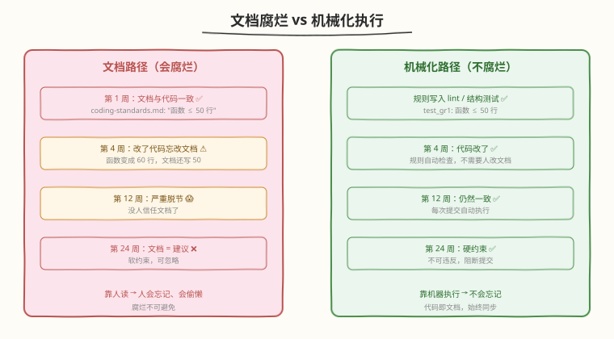
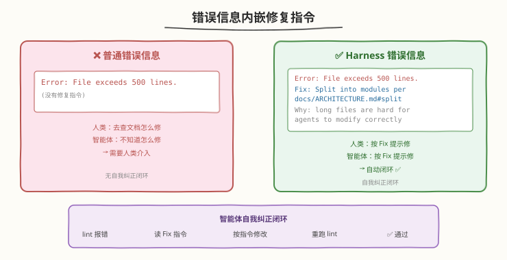
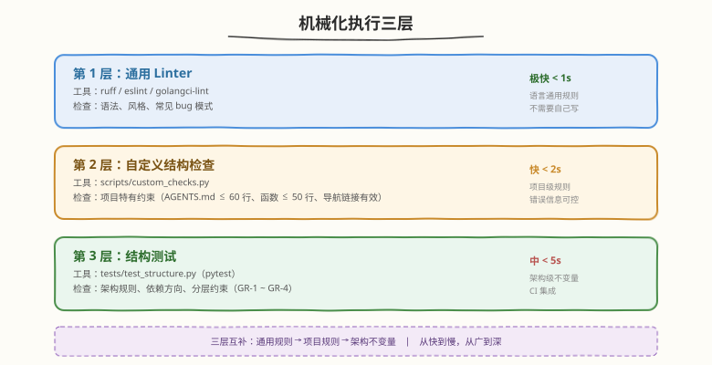

# Day 3：机械化执行

## 🎯 目标

通过今天的学习，你将：

1. 理解"文档会腐烂，lint 规则不会"——自然语言文档与机械化约束的本质区别，以及为什么后者是 harness 的基石
2. 掌握"错误信息内嵌修复指令"的设计模式——让智能体看到 lint 报错就能自我纠正，形成闭环
3. 为练手项目配置 ruff linter，实现自定义结构检查脚本（`scripts/custom_checks.py`）
4. 编写结构测试（`tests/test_structure.py`），用 pytest 验证架构规则是否被遵守
5. 理解"中央强制边界、本地允许自主"的哲学，以及 OpenAI Symphony 的"给目标不规定路径"如何与机械化执行互补
6. 将 Day 2 写在 AGENTS.md 里的自然语言约定，逐一转化为不可违反的硬约束

> 💡 **前置知识**：已完成 Day 2 学习，为项目写好了 AGENTS.md 和基础文档结构
> ⚠️ **环境要求**：Python 3.10+、pip、Day 2 的练手项目

---

## 为什么学机械化执行

Day 2 我们把项目约定写进了 AGENTS.md 和 `docs/coding-standards.md`。比如：

- "函数不超过 50 行"（GR-1）
- "所有 public 函数必须有类型注解"（GR-2）
- "routes/ 不能直接访问 database/"（GR-3）
- "每个模块必须有对应的测试文件"（GR-4）

问题是：**谁来确保这些约定被遵守？**

| 保障方式 | 谁执行 | 可靠性 | 问题 |
|----------|--------|--------|------|
| 靠人读文档 | 人类审查者 | 低 | 人会忘记、会偷懒、会离职 |
| 靠智能体自觉 | AI 智能体 | 很低 | 智能体会忽略文档后半部分 |
| 靠 lint 规则 | 机器自动 | 高 | 不可违反，每次提交都检查 |
| 靠结构测试 | pytest 自动 | 高 | 不通过就阻断，形成背压 |

> 💡 **一句话总结**：文档会腐烂，lint 规则不会。把"你应该做 X"从文档变成 lint 规则——错误信息里内嵌修复指令，智能体看到 lint 报错就能自我纠正。这就是机械化执行的核心。

---

## 核心概念

### 1.1 文档会腐烂

#### 腐烂的机制

文档腐烂不是一次性的"写错了"，而是一个渐进过程：

```
第 1 周：文档与代码完全一致
第 4 周：有人改了代码，忘了改文档 → 小偏差
第 12 周：多次改代码没改文档 → 文档与代码严重脱节
第 24 周：没人再信任文档 → 文档变成"建议"而非"规则"
```



| 维度 | 自然语言文档 | Lint 规则 |
|------|-------------|-----------|
| 执行 | 靠人读 | 自动执行 |
| 腐烂 | 随时间过时 | 代码即文档，始终同步 |
| 纠错 | 靠人发现 | 智能体可自我纠正 |
| 强制力 | 软约束（可忽略） | 硬约束（阻断提交） |
| 扩展性 | 团队越大越难执行 | 团队越大效果越好 |

> ⚠️ **关键区分**：不是说文档没用——AGENTS.md 和架构文档是给智能体提供上下文的必需品。但**规则性的约束**（"函数不超过 50 行"、"routes 不能调 database"）必须机械化，否则它们只是"建议"。

#### 人类品味传播路径

OpenAI 在原文中描述了一个"品味传播"的路径：

```
人类审查评论 → 文档更新 → lint 规则 → 自动应用于所有代码
```

人类的品味一旦被捕捉（编码为规则），就会持续应用于每一行代码——无论人类是否在场审查。

| 传播阶段 | 谁做 | 效果 |
|----------|------|------|
| 人类审查评论 | 工程师 | 发现问题，提出改进 |
| 文档更新 | 工程师 | 把改进写进规范 |
| lint 规则 | 工程师 | 把规范编码为可执行的检查 |
| 自动应用 | 机器 | 每次提交自动执行，不可绕过 |

关键转折点在第三步：从"文档"变成"lint 规则"。只有走到这一步，品味才会被"机械化"——不再依赖人类注意力。

### 1.2 两类约束

OpenAI 在原文中把机械化约束分为两类：

#### 架构约束（结构测试）

验证代码的**结构**是否符合架构规则——不验证行为，验证"组件之间的依赖关系是否合法"。

| 约束 | 验证方式 | 违反后果 |
|------|----------|----------|
| 分层顺序：Types → Config → Repo → Service → Runtime → UI | 结构测试检查 import 方向 | CI 阻塞合并 |
| 依赖方向只能向前 | import 图分析 | CI 阻塞合并 |
| 横切关注点必须通过 Providers 进入 | 检查是否有直接 import | CI 阻塞合并 |

#### 品味不变式（自定义 linter）

验证代码的**风格和品味**是否符合团队标准——更主观，但同样可以机械化。

| 约束 | 验证方式 | 违反后果 |
|------|----------|----------|
| 禁止 `console.log` / `print` 裸输出 | lint 规则匹配 | lint 报错 + 修复指令 |
| Schema/类型的命名约定 | lint 规则匹配 | lint 报错 + 修复指令 |
| 文件大小限制 | 自定义检查脚本 | 检查脚本报错 |
| 函数行数限制 | 自定义检查脚本 | 检查脚本报错 |

### 1.3 错误信息 = 修复指令

这是机械化执行最关键的设计模式。对比两种错误信息：

```
❌ 普通做法：
Error: File exceeds 500 lines.

✅ Harness 做法：
Error: File exceeds 500 lines.
Fix: Split into domain-specific modules following docs/ARCHITECTURE.md#splitting-guide.
Consider extracting types to <domain>/types/ and service logic to <domain>/service/.
```

为什么这很重要？因为错误信息的读者不只是人类，还有**智能体**。



| 错误信息风格 | 人类看到 | 智能体看到 | 结果 |
|-------------|---------|-----------|------|
| `Error: too many lines` | 人去查文档 | 智能体不知道怎么修 | 需要人类介入 |
| `Error: too many lines. Fix: split into modules per docs/X.md` | 人按提示修 | 智能体按提示修 | 自动闭环 |

> 💡 **关键洞察**：错误信息中注入智能体可执行的修复路径 → 自我纠正闭环。智能体看到 lint 报错 → 读 Fix 指令 → 按指令修改 → 重新跑 lint → 通过。整个过程不需要人类介入。

### 1.4 中央强制边界，本地允许自主

OpenAI 用一句话概括了机械化执行的哲学：

> 在中央层面强制执行边界，在本地层面允许自主权。

| 层面 | 强制什么 | 允许什么 |
|------|---------|---------|
| 中央（CI / lint） | 边界、正确性、可重复性 | — |
| 本地（智能体实现） | — | 边界内的具体实现方式 |

类比大型工程平台组织的管理模式：
- **严格的**：架构边界、类型正确性、测试通过
- **自由的**：边界内怎么实现、用什么算法、代码风格

> ⚠️ **重要**：生成的代码不符合人类风格偏好？没关系。正确 + 可维护 + 智能体可读 = 达标。机械化执行管"产出必须满足什么"，不管"怎么实现"。

### 1.5 Symphony 的补充：给目标，不规定路径

OpenAI Symphony 提供了机械化执行的**反向边界**。OpenAI 工程师早期把智能体当作状态机里的刚性节点——每个状态规定智能体只能做特定动作。但这不好用：

> "把智能体当作状态机里的刚性节点并不好用。模型会变得更聪明，也能解决比我们预设框架更大的问题。"

最终他们转向"给目标，不规定状态转换"——给智能体目标 + 工具 + 上下文，让推理能力决定路径。

**这与机械化执行不矛盾，而是分工**：

| 层 | 约束什么 | 怎么约束 |
|----|---------|---------|
| 机械化层 | **结果形态**（不变量、架构、品味） | CI 强制 |
| 目标层 | **意图与边界**（要解决什么问题、不能做什么） | 不规定路径 |

> 💡 **一句话总结**：机械化执行管"产出必须满足什么"，目标层管"为什么做、做到什么程度"。把两者都收紧成"必须按 1-2-3 步骤"会浪费模型的推理能力，也会随模型升级越来越显得笨拙。

---

## 最小可运行示例

### 任务 1：配置 ruff linter

ruff 是 Python 生态最快的 linter（用 Rust 写的），支持数百条规则。

```bash
cd ~/harness-day1

# 安装 ruff
pip install ruff

# 创建配置
cat > pyproject.toml << 'EOF'
[tool.ruff]
line-length = 100
target-version = "py310"
src = ["src", "tests"]

[tool.ruff.lint]
select = [
    "E",    # pycodestyle errors
    "W",    # pycodestyle warnings
    "F",    # pyflakes (未使用变量、import 等)
    "I",    # isort (import 排序)
    "N",    # pep8-naming (命名规范)
    "UP",   # pyupgrade (现代 Python 语法)
    "B",    # flake8-bugbear (常见 bug 模式)
    "SIM",  # flake8-simplify (代码简化)
    "ANN",  # flake8-annotations (类型注解检查)
    "PT",   # flake8-pytest-style (pytest 风格)
]
ignore = [
    "E501",   # 行长度由 line-length 控制，不需要单独报
    "ANN101", # self 不需要类型注解
    "ANN102", # cls 不需要类型注解
]

[tool.ruff.lint.per-file-ignores]
"tests/*" = ["ANN", "N802"]  # 测试文件不强制类型注解，可以用大写开头
EOF
```

验证 ruff 能工作：

```bash
# 运行 lint
ruff check src/ tests/
```

```text
# 预期输出（如果代码已经规范）
All checks passed!
```

故意制造一个违规来验证 ruff 报错：

```bash
# 临时制造一个违规
cat > src/bad_example.py << 'EOF'
import os, sys
def BadFunctionName(x,y):
    print(x+y)
    return x+y
EOF

ruff check src/bad_example.py
```

```text
# 预期输出
src/bad_example.py:1:5: F401 [*] `os` imported but unused
src/bad_example.py:1:8: F401 [*] `sys` imported but unused
src/bad_example.py:2:4: N802 Function name `BadFunctionName` should be lowercase
src/bad_example.py:2:21: ANN001 Missing type annotation for function argument `x`
src/bad_example.py:2:23: ANN001 Missing type annotation for function argument `y`
src/bad_example.py:2:26: ANN201 Missing return type annotation for public function
src/bad_example.py:3:4: T201 `print` found

Found 7 errors.
```

```bash
# 清理违规文件
rm src/bad_example.py
```

> 💡 **观察**：ruff 发现了未使用 import、命名不规范、缺类型注解、用了 print。这就是机械化执行——不靠人读文档，自动发现问题。

### 任务 2：实现自定义结构检查脚本

ruff 覆盖了通用的 lint 规则，但项目特有的约束（如"AGENTS.md ≤ 60 行"、"函数不超过 50 行"）需要自定义脚本。

```bash
mkdir -p scripts
```

```python
# scripts/custom_checks.py —— 项目级结构约束
"""项目级结构约束：lint 规则无法覆盖的部分用脚本守护。

每条检查的错误信息都内嵌了 Fix 修复指令，让智能体可以自我纠正。
运行: python scripts/custom_checks.py
"""

import ast
import sys
from pathlib import Path

ROOT = Path(__file__).resolve().parent.parent


def check_agents_md_exists():
    """AGENTS.md 必须存在——智能体的入口文件。"""
    if not (ROOT / "AGENTS.md").exists():
        print(
            "ERROR: AGENTS.md not found.\n"
            "  Fix: create AGENTS.md with repo structure, conventions, "
            "and navigation. See template in Day 2 tutorial.\n"
            "  Why: AGENTS.md is the agent's entry point — "
            "without it, the agent has no map of the project."
        )
        return False
    return True


def check_agents_md_length():
    """AGENTS.md ≤ 60 行——防止挤占智能体上下文。"""
    agents_md = ROOT / "AGENTS.md"
    if not agents_md.exists():
        return True  # check_agents_md_exists 会报错
    lines = agents_md.read_text().splitlines()
    if len(lines) > 60:
        print(
            f"ERROR: AGENTS.md has {len(lines)} lines (max 60).\n"
            f"  Fix: split content into sub-documents under docs/ "
            f"and add navigation links in AGENTS.md.\n"
            f"  Why: AGENTS.md longer than 60 lines crowds the agent's "
            f"context window, causing 'context rot' and degraded reasoning."
        )
        return False
    return True


def check_agents_md_navigation_links():
    """AGENTS.md 中的导航链接必须指向真实存在的文件。"""
    agents_md = ROOT / "AGENTS.md"
    if not agents_md.exists():
        return True
    content = agents_md.read_text()
    import re
    links = re.findall(r'\]\(([^)]+)\)', content)
    broken = []
    for link in links:
        if link.startswith('http') or link.startswith('#'):
            continue
        link = link.split('#')[0]  # 去掉锚点
        if not link:
            continue
        target = ROOT / link
        if not target.exists():
            broken.append(link)
    if broken:
        print(
            f"ERROR: AGENTS.md has broken navigation links: {broken}\n"
            f"  Fix: create the referenced files or remove the links.\n"
            f"  Why: broken links mislead the agent into looking for "
            f"information that doesn't exist."
        )
        return False
    return True


def check_function_length(max_lines=50):
    """GR-1: 函数不超过 50 行。"""
    violations = []
    for py_file in (ROOT / "src").rglob("*.py"):
        try:
            tree = ast.parse(py_file.read_text())
        except SyntaxError:
            continue
        for node in ast.walk(tree):
            if isinstance(node, (ast.FunctionDef, ast.AsyncFunctionDef)):
                length = node.end_lineno - node.lineno + 1
                if length > max_lines:
                    violations.append(
                        f"  {py_file.relative_to(ROOT)}:{node.lineno} "
                        f"{node.name}() is {length} lines (max {max_lines})"
                    )
    if violations:
        print(
            f"ERROR: GR-1 violated — functions exceed {max_lines} lines:\n"
            + "\n".join(violations) + "\n"
            "  Fix: split long functions into smaller helpers.\n"
            "  Why: long functions are hard to test, understand, "
            "and for agents to modify correctly."
        )
        return False
    return True


def check_public_functions_have_type_hints():
    """GR-2: 所有 public 函数必须有类型注解。"""
    violations = []
    for py_file in (ROOT / "src").rglob("*.py"):
        try:
            tree = ast.parse(py_file.read_text())
        except SyntaxError:
            continue
        for node in ast.walk(tree):
            if isinstance(node, ast.FunctionDef) and not node.name.startswith("_"):
                if not node.returns:
                    violations.append(
                        f"  {py_file.relative_to(ROOT)}:{node.lineno} "
                        f"{node.name}() missing return type annotation"
                    )
                for arg in node.args.args:
                    if arg.arg not in ("self", "cls") and not arg.annotation:
                        violations.append(
                            f"  {py_file.relative_to(ROOT)}:{node.lineno} "
                            f"{node.name}() arg '{arg.arg}' missing annotation"
                        )
    if violations:
        print(
            f"ERROR: GR-2 violated — public functions missing type annotations:\n"
            + "\n".join(violations[:10]) + "\n"
            "  Fix: add type annotations to all public functions.\n"
            "  Why: type annotations are the agent's primary way to "
            "understand function contracts."
        )
        return False
    return True


def check_no_bare_print():
    """禁止 src/ 中使用 bare print()——用 logging 代替。"""
    violations = []
    for py_file in (ROOT / "src").rglob("*.py"):
        try:
            tree = ast.parse(py_file.read_text())
        except SyntaxError:
            continue
        for node in ast.walk(tree):
            if isinstance(node, ast.Call) and isinstance(node.func, ast.Name):
                if node.func.id == "print":
                    violations.append(
                        f"  {py_file.relative_to(ROOT)}:{node.lineno}"
                    )
    if violations:
        print(
            f"ERROR: bare print() found in src/:\n"
            + "\n".join(violations) + "\n"
            "  Fix: replace print() with logging.info/debug/warning.\n"
            "  Why: print() bypasses structured logging, making output "
            "hard to filter and parse."
        )
        return False
    return True


ALL_CHECKS = [
    check_agents_md_exists,
    check_agents_md_length,
    check_agents_md_navigation_links,
    check_function_length,
    check_public_functions_have_type_hints,
    check_no_bare_print,
]


if __name__ == "__main__":
    print("=== Custom Structure Checks ===\n")
    failed = []
    for check in ALL_CHECKS:
        name = check.__name__
        if check():
            print(f"  ✅ {name}")
        else:
            print(f"  ❌ {name}")
            failed.append(name)

    print()
    if failed:
        print(f"FAILED: {len(failed)} check(s) failed: {', '.join(failed)}")
        sys.exit(1)
    else:
        print(f"✅ All {len(ALL_CHECKS)} checks passed.")
```

运行检查：

```bash
python scripts/custom_checks.py
```

```text
# 预期输出
=== Custom Structure Checks ===

  ✅ check_agents_md_exists
  ✅ check_agents_md_length
  ✅ check_agents_md_navigation_links
  ✅ check_function_length
  ✅ check_public_functions_have_type_hints
  ✅ check_no_bare_print

✅ All 6 checks passed.
```

> 💡 **观察**：每条检查的错误信息都包含三部分：ERROR（什么错了）+ Fix（怎么修）+ Why（为什么有这条规则）。智能体看到报错后，可以直接按 Fix 指令修改——不需要人类介入。

### 任务 3：编写结构测试

结构测试与 `custom_checks.py` 的区别：结构测试用 pytest 运行，可以集成到 CI pipeline 和背压门控中（Day 4 会用到）。

```bash
pip install pytest
```

```python
# tests/test_structure.py —— 结构测试
"""验证项目结构约束。

这些测试不测功能正确性，只测结构——架构规则是否被遵守。
与 scripts/custom_checks.py 的区别：这些测试集成到 pytest，
可以被 CI 和背压门控自动调用。
"""

import ast
import re
from pathlib import Path

ROOT = Path(__file__).resolve().parent.parent


# ============================================================
# AGENTS.md 约束
# ============================================================

def test_agents_md_exists():
    """AGENTS.md 必须存在——智能体的入口文件。"""
    assert (ROOT / "AGENTS.md").exists(), (
        "AGENTS.md must exist. "
        "Fix: create AGENTS.md with repo structure, conventions, and navigation."
    )


def test_agents_md_under_60_lines():
    """AGENTS.md ≤ 60 行——防止挤占智能体上下文。"""
    agents_md = ROOT / "AGENTS.md"
    if not agents_md.exists():
        return  # test_agents_md_exists 会报
    lines = agents_md.read_text().splitlines()
    assert len(lines) <= 60, (
        f"AGENTS.md has {len(lines)} lines, max 60. "
        "Fix: split content into sub-documents under docs/ "
        "and add navigation links in AGENTS.md."
    )


def test_agents_md_has_navigation():
    """AGENTS.md 必须包含导航链接——指向子文档。"""
    agents_md = ROOT / "AGENTS.md"
    if not agents_md.exists():
        return
    content = agents_md.read_text()
    links = re.findall(r'\]\(([^)]+)\)', content)
    internal_links = [l for l in links if not l.startswith('http') and not l.startswith('#')]
    assert len(internal_links) >= 1, (
        "AGENTS.md must have at least one navigation link to a sub-document. "
        "Fix: add a '## Navigation' section with links to docs/coding-standards.md, "
        "ARCHITECTURE.md, etc."
    )


def test_agents_md_navigation_links_exist():
    """AGENTS.md 中的导航链接必须指向真实存在的文件。"""
    agents_md = ROOT / "AGENTS.md"
    if not agents_md.exists():
        return
    content = agents_md.read_text()
    links = re.findall(r'\]\(([^)]+)\)', content)
    for link in links:
        if link.startswith('http') or link.startswith('#'):
            continue
        link = link.split('#')[0]
        if not link:
            continue
        target = ROOT / link
        assert target.exists(), (
            f"AGENTS.md links to '{link}' but file does not exist. "
            f"Fix: create the file or remove the link."
        )


# ============================================================
# 黄金规则约束
# ============================================================

def test_gr1_functions_under_50_lines():
    """GR-1: 函数不超过 50 行。"""
    src = ROOT / "src"
    if not src.exists():
        return
    violations = []
    for py_file in src.rglob("*.py"):
        try:
            tree = ast.parse(py_file.read_text())
        except SyntaxError:
            continue
        for node in ast.walk(tree):
            if isinstance(node, (ast.FunctionDef, ast.AsyncFunctionDef)):
                length = node.end_lineno - node.lineno + 1
                if length > 50:
                    violations.append(
                        f"{py_file.relative_to(ROOT)}:{node.lineno} "
                        f"{node.name}() is {length} lines"
                    )
    assert not violations, (
        f"GR-1 violated — functions exceed 50 lines:\n  "
        + "\n  ".join(violations) + "\n"
        "Fix: split long functions into smaller helpers."
    )


def test_gr2_public_functions_have_annotations():
    """GR-2: 所有 public 函数必须有类型注解。"""
    src = ROOT / "src"
    if not src.exists():
        return
    violations = []
    for py_file in src.rglob("*.py"):
        try:
            tree = ast.parse(py_file.read_text())
        except SyntaxError:
            continue
        for node in ast.walk(tree):
            if isinstance(node, ast.FunctionDef) and not node.name.startswith("_"):
                if not node.returns:
                    violations.append(
                        f"{py_file.relative_to(ROOT)}:{node.lineno} "
                        f"{node.name}() missing return annotation"
                    )
    assert not violations, (
        f"GR-2 violated — public functions missing type annotations:\n  "
        + "\n  ".join(violations[:10]) + "\n"
        "Fix: add return type annotations to all public functions."
    )


def test_gr3_no_direct_db_access_in_routes():
    """GR-3: routes/ 不能直接访问 database/——必须通过 service/ 层。"""
    routes_dir = ROOT / "src" / "routes"
    if not routes_dir.exists():
        return
    violations = []
    for py_file in routes_dir.glob("*.py"):
        content = py_file.read_text()
        if "from database" in content or "import database" in content:
            violations.append(str(py_file.relative_to(ROOT)))
    assert not violations, (
        f"GR-3 violated — routes/ directly imports database/:\n  "
        + "\n  ".join(violations) + "\n"
        "Fix: route through service/ layer instead of importing database directly."
    )


# ============================================================
# 项目结构约束
# ============================================================

def test_src_has_init():
    """src/ 下每个子目录都有 __init__.py。"""
    src = ROOT / "src"
    if not src.exists():
        return
    for subdir in src.iterdir():
        if subdir.is_dir():
            assert (subdir / "__init__.py").exists(), (
                f"{subdir.name}/ is missing __init__.py. "
                "Fix: create __init__.py to make it a proper Python package."
            )


def test_tests_mirror_src():
    """每个 src/ 模块都有对应的测试文件。"""
    src = ROOT / "src"
    tests = ROOT / "tests"
    if not src.exists() or not tests.exists():
        return
    src_modules = {f.stem for f in src.rglob("*.py") if f.name != "__init__.py"}
    test_files = {f.stem.replace("test_", "") for f in tests.glob("test_*.py")}
    missing = src_modules - test_files - {"__init__"}
    # 允许 test_structure.py 不对应任何 src 模块
    missing.discard("structure")
    assert not missing, (
        f"Modules without tests: {missing}. "
        "Fix: create test_<module>.py for each src module."
    )
```

运行结构测试：

```bash
pytest tests/test_structure.py -v
```

```text
# 预期输出
============================= test session starts =============================
collected 9 items

tests/test_structure.py::test_agents_md_exists PASSED
tests/test_structure.py::test_agents_md_under_60_lines PASSED
tests/test_structure.py::test_agents_md_has_navigation PASSED
tests/test_structure.py::test_agents_md_navigation_links_exist PASSED
tests/test_structure.py::test_gr1_functions_under_50_lines PASSED
tests/test_structure.py::test_gr2_public_functions_have_annotations PASSED
tests/test_structure.py::test_gr3_no_direct_db_access_in_routes PASSED
tests/test_structure.py::test_src_has_init PASSED
tests/test_structure.py::test_tests_mirror_src PASSED

============================== 9 passed ==============================
```

### 任务 4：故意违规，验证检查能捕获

验证机械化约束真的能捕获违规——这是信任它的前提。

```bash
# 测试 1: 故意写一个超过 50 行的函数
cat > src/long_func.py << 'EOF'
def very_long_function(a, b, c, d, e, f, g, h):
    """This function is intentionally long to test GR-1."""
    result = a
    result = result + b
    result = result + c
    result = result + d
    result = result + e
    result = result + f
    result = result + g
    result = result + h
    temp = a * b
    temp = temp + c * d
    temp = temp + e * f
    temp = temp + g * h
    temp = temp - result
    temp = temp * 2
    temp = temp + 10
    temp = temp - 5
    temp = temp / 2
    temp = temp + a
    temp = temp + b
    temp = temp + c
    temp = temp + d
    temp = temp + e
    temp = temp + f
    temp = temp + g
    temp = temp + h
    temp = temp * 3
    temp = temp - 100
    temp = temp + 42
    temp = temp - 7
    temp = temp * 0
    temp = temp + result
    temp = temp + a + b + c + d
    temp = temp + e + f + g + h
    temp = temp * 0 + result
    return result + temp
EOF

# 运行检查
python scripts/custom_checks.py 2>&1 | grep "GR-1"
```

```text
# 预期输出
ERROR: GR-1 violated — functions exceed 50 lines:
  src/long_func.py:2 very_long_function() is 51 lines (max 50)
  Fix: split long functions into smaller helpers.
  Why: long functions are hard to test, understand, and for agents to modify correctly.
```

```bash
# 测试 2: 验证 pytest 也能捕获
pytest tests/test_structure.py::test_gr1_functions_under_50_lines -v 2>&1 | tail -5
```

```text
# 预期输出
tests/test_structure.py::test_gr1_functions_under_50_lines FAILED

============================== 1 failed ==============================
```

```bash
# 清理违规文件
rm src/long_func.py
```

> 💡 **验证结论**：两种检查方式（脚本 + pytest）都能捕获违规。`custom_checks.py` 适合快速反馈，`test_structure.py` 适合集成到 CI pipeline。Day 4 会把它们统一到 `scripts/check.sh` 背压门控中。

### 任务 5：更新 AGENTS.md 的机械化检查说明

Day 2 的 AGENTS.md 里只写了 `pytest tests/ -v`，现在更新为完整的检查说明：

```bash
cat > AGENTS.md << 'EOF'
# Calculator

> 简单的数学运算库，支持加减乘除和幂运算

## 仓库结构

| 目录 | 内容 | 说明 |
|------|------|------|
| `src/` | 源码 | 每个模块对应一个数学功能 |
| `tests/` | 测试 | pytest，含结构测试 |
| `docs/` | 文档 | 编码规范、执行计划 |
| `scripts/` | 脚本 | 检查与审计 |

## 开发约定

- 语言：Python 3.10+，类型注解必填
- 测试：pytest，覆盖率 > 80%
- 提交：conventional commits
- 函数 ≤ 50 行，public 函数须有 docstring

## 导航

- 编码规范：[docs/coding-standards.md](docs/coding-standards.md)
- 架构说明：[ARCHITECTURE.md](ARCHITECTURE.md)
- 已知问题：[TODO.md](TODO.md)
- 执行计划：[docs/exec-plans/](docs/exec-plans/)

## 机械化检查

完成任务后必须依次运行：
    ruff check src/ tests/
    python scripts/custom_checks.py
    pytest tests/ -v

三项全绿才算任务完成。错误信息中含 Fix 指令，按指令自我纠正后重跑。
EOF

wc -l AGENTS.md
```

```text
# 预期输出
32 AGENTS.md
```

32 行，在 60 行限制内。

### 任务 6：验证完整的检查流程

```bash
# 完整检查流程
echo "=== 1. ruff ==="
ruff check src/ tests/

echo "=== 2. custom_checks ==="
python scripts/custom_checks.py

echo "=== 3. pytest ==="
pytest tests/ -v
```

```text
# 预期输出（三项全绿）
=== 1. ruff ===
All checks passed!

=== 2. custom_checks ===
=== Custom Structure Checks ===

  ✅ check_agents_md_exists
  ✅ check_agents_md_length
  ✅ check_agents_md_navigation_links
  ✅ check_function_length
  ✅ check_public_functions_have_type_hints
  ✅ check_no_bare_print

✅ All 6 checks passed.

=== 3. pytest ===
============================= test session starts =============================
collected 9 items

tests/test_structure.py::test_agents_md_exists PASSED
...
tests/test_structure.py::test_tests_mirror_src PASSED

============================== 9 passed ==============================
```

```bash
git add -A && git commit -m "feat: add ruff config, custom_checks.py, test_structure.py"
```

---

## 深入原理

### 机械化执行的三个层次



| 层次 | 工具 | 检查什么 | 速度 | 覆盖范围 |
|------|------|---------|------|---------|
| 通用 Linter | ruff / eslint / golangci-lint | 语法、风格、常见 bug | 极快（< 1s） | 语言通用规则 |
| 自定义脚本 | `scripts/custom_checks.py` | 项目特有约束 | 快（< 2s） | 项目级规则 |
| 结构测试 | `tests/test_structure.py` | 架构规则、依赖方向 | 中（< 5s） | 架构级不变量 |

三者互补：
- 通用 linter 覆盖"所有 Python 项目都应该遵守的规则"
- 自定义脚本覆盖"这个项目特有的规则"（如 AGENTS.md ≤ 60 行）
- 结构测试覆盖"架构层面的不变量"（如分层依赖方向）

### 为什么不全部用 pytest？

`custom_checks.py` 和 `test_structure.py` 功能重叠——为什么不全部用 pytest？

| 维度 | custom_checks.py | test_structure.py |
|------|-------------------|-------------------|
| 运行方式 | `python scripts/custom_checks.py` | `pytest tests/test_structure.py` |
| 输出格式 | 自定义（人类 + 智能体友好） | pytest 标准格式 |
| 适合场景 | 快速本地反馈、pre-commit hook | CI pipeline、背压门控 |
| 错误信息 | 完全自定义，可内嵌 Fix + Why | 受 assert 格式限制 |
| 与 pytest 测试混用 | 独立 | 与功能测试一起跑 |

实践建议：**两者都保留**。`custom_checks.py` 用于开发期快速反馈（pre-commit hook），`test_structure.py` 用于 CI 和背压门控（Day 4）。

### ArchUnit 与 Fitness Functions

Martin Fowler 把结构测试归入 **Fitness Functions**（适应度函数）——来自进化架构的概念：

> Fitness Function 是一种客观评估架构是否朝期望方向演化的机制。

| 概念 | 来源 | 在 harness 中的对应 |
|------|------|-------------------|
| Fitness Function | 进化架构 | 结构测试 |
| ArchUnit | Java 生态 | `tests/test_structure.py` |
| Layered Architecture | DDD | Types → Config → Repo → Service → Runtime → UI |
| Dependency Rule | Clean Architecture | 依赖只能向前流动 |

在 Java 生态中，ArchUnit 库专门做架构测试：

```java
// ArchUnit 示例（Java 生态，了解即可）
@ArchTest
static final ArchRule routes_should_not_access_database =
    noClasses().that().resideInAPackage("..routes..")
        .should().dependOnClassesThat().resideInAPackage("..database..");
```

Python 生态没有等价的 ArchUnit，但用 AST 解析 + pytest 可以实现同样的效果——这正是 `test_structure.py` 做的事。

### 品味不变式的演化路径

一条品味规则从"人类直觉"到"机械化执行"的演化：

```
阶段 1: 人类直觉
  "我觉得这个函数太长了，拆一下"

阶段 2: 审查评论
  PR review: "这个函数超过 50 行了，请拆分"

阶段 3: 文档规范
  docs/coding-standards.md: "函数不超过 50 行（GR-1）"

阶段 4: 自定义检查
  scripts/custom_checks.py: check_function_length(max_lines=50)

阶段 5: 结构测试
  tests/test_structure.py: test_gr1_functions_under_50_lines()

阶段 6: CI 强制
  GitHub Actions: pytest tests/test_structure.py → 不通过则阻塞合并
```

> 💡 **关键洞察**：每往前一个阶段，约束的可靠性强一级。阶段 3 靠人读文档（会忘记），阶段 4 靠脚本检查（不会忘记但需要手动跑），阶段 6 靠 CI 强制（不可绕过）。**目标是把尽可能多的规则推到阶段 5-6**。

### 机械化验证 AGENTS.md 本身

Day 2 提到"AGENTS.md 的结构可以被机械验证"——今天我们实现了：

| 可验证的属性 | 检查方式 | 检查函数 |
|-------------|----------|---------|
| AGENTS.md 存在 | 结构测试 | `test_agents_md_exists` |
| AGENTS.md ≤ 60 行 | 结构测试 | `test_agents_md_under_60_lines` |
| 有导航链接 | 结构测试 | `test_agents_md_has_navigation` |
| 导航链接指向真实文件 | 结构测试 | `test_agents_md_navigation_links_exist` |
| 函数 ≤ 50 行 | 自定义检查 + 结构测试 | `check_function_length` / `test_gr1` |
| public 函数有类型注解 | 自定义检查 + 结构测试 | `check_public_functions_have_type_hints` / `test_gr2` |

这就是"地图而非手册"与"机械化执行"的交汇点——AGENTS.md 的**结构**被 linter 守护，虽然它的**内容**是自然语言。

---

## 常见陷阱与最佳实践

### 陷阱 1：规则太多导致智能体被"噪声"淹没

```python
# ❌ 错误：一次性启用 50 条 lint 规则
# 智能体每次写代码都被 20 条 lint 报错轰炸 → 花大量时间修 lint 而非写功能

# ✅ 正确：渐进启用，先启用核心规则
# 第一周：E, F, W（基础语法）
# 第二周：I, N, UP（风格 + 现代化）
# 第三周：B, SIM, ANN（bug 防护 + 类型注解）
```

### 陷阱 2：错误信息只说"错了"不说"怎么修"

```python
# ❌ 错误：只报问题，不给修复指令
def check_function_length(max_lines=50):
    if length > max_lines:
        print(f"ERROR: function {name} is too long")
        return False

# ✅ 正确：报问题 + 给 Fix + 给 Why
def check_function_length(max_lines=50):
    if length > max_lines:
        print(
            f"ERROR: {name}() is {length} lines (max {max_lines}).\n"
            f"  Fix: split into smaller helpers.\n"
            f"  Why: long functions are hard for agents to modify correctly."
        )
        return False
```

### 陷阱 3：用自然语言描述本该机械化的规则

```markdown
# ❌ 错误：在 coding-standards.md 里写"函数不要超过 50 行"
# 靠智能体自觉遵守 → 它会忘记

# ✅ 正确：同时写文档 + 实现机械化检查
# docs/coding-standards.md: "GR-1: 函数 ≤ 50 行"
# scripts/custom_checks.py: check_function_length(max_lines=50)
# tests/test_structure.py: test_gr1_functions_under_50_lines()
```

文档解释"为什么"，机械化检查确保"被执行"。两者缺一不可。

### 陷阱 4：把实现细节也变成硬约束

```python
# ❌ 错误：规定实现方式（太刚性）
def test_must_use_list_comprehension():
    # "所有循环必须用列表推导" → 限制了智能体的自主性
    pass

# ✅ 正确：只约束结果形态（边界），不约束实现方式
def test_no_bare_print():
    # "不能用 print()" → 约束输出方式，但不规定用什么替代
    pass
```

记住"中央强制边界，本地允许自主"——管"产出必须满足什么"，不管"怎么实现"。

### 陷阱 5：结构测试与功能测试混在一起

```bash
# ❌ 错误：结构测试和功能测试放同一个文件
tests/
└── test_calculator.py  # 既有 test_add() 又有 test_agents_md_exists()

# ✅ 正确：分开
tests/
├── test_calculator.py     # 功能测试：测 add/subtract/multiply...
└── test_structure.py      # 结构测试：测 AGENTS.md/GR-1/GR-2...
```

结构测试和功能测试的生命周期不同——结构测试几乎不变，功能测试随功能增减。分开后更易维护。

### 最佳实践

| 实践 | 说明 |
|------|------|
| 渐进启用 lint 规则 | 先核心后进阶，避免一次性噪声过多 |
| 每条规则三段式报错 | ERROR（什么错）+ Fix（怎么修）+ Why（为什么） |
| 文档 + 机械化检查成对出现 | 文档解释"为什么"，检查确保"被执行" |
| 只约束边界，不约束实现 | 中央强制边界，本地允许自主 |
| 结构测试与功能测试分离 | `test_structure.py` 独立，不与功能测试混放 |
| 品味规则逐步演化 | 直觉 → 评论 → 文档 → 脚本 → 测试 → CI |
| pre-commit + CI 双层保障 | pre-commit 是开发反馈，CI 是合并门（Day 4） |

---

## 面试要点

1. **什么是"机械化执行"？为什么说"文档会腐烂，lint 规则不会"？**

<details>
<summary>点击查看答案</summary>

- 机械化执行：通过强制执行不变量（lint 规则、结构测试），而非对实施过程进行微观管理
- "文档会腐烂"：自然语言文档随时间与代码脱节——人改代码忘改文档，文档逐渐变成"建议"而非"规则"
- "lint 规则不会"：lint 规则就是代码，代码改了规则就跟着改，始终与代码同步；且自动执行，不可绕过
- 核心转变：把"你应该做 X"从文档变成 lint 规则

</details>

2. **错误信息为什么要内嵌修复指令？**

<details>
<summary>点击查看答案</summary>

- 错误信息的读者不只是人类，还有智能体
- 普通错误信息（`Error: too many lines`）：智能体不知道怎么修，需要人类介入
- 内嵌修复指令（`Error: too many lines. Fix: split into modules per docs/X.md`）：智能体按 Fix 指令修改 → 重新跑 → 通过，形成自我纠正闭环
- 三段式：ERROR（什么错了）+ Fix（怎么修）+ Why（为什么有这条规则）
- 这是 harness 让智能体可靠工作的关键设计模式

</details>

3. **机械化执行的两类约束是什么？**

<details>
<summary>点击查看答案</summary>

- **架构约束（结构测试）**：验证代码结构是否符合架构规则——分层顺序、依赖方向、横切关注点。违反 = CI 阻塞合并
- **品味不变式（自定义 linter）**：验证代码风格是否符合团队标准——命名约定、文件大小、函数行数、禁止 bare print。违反 = lint 报错
- 区别：架构约束管"组件之间怎么依赖"，品味不变式管"代码怎么写"

</details>

4. **"中央强制边界，本地允许自主"是什么意思？**

<details>
<summary>点击查看答案</summary>

- 中央（CI / lint）强制执行：边界、正确性、可重复性
- 本地（智能体实现）允许自由：边界内的具体实现方式
- 类比大型工程平台组织：严格的边界 + 自由的内部实现
- 关键态度：生成的代码不符合人类风格偏好？没关系。正确 + 可维护 + 智能体可读 = 达标
- 机械化执行管"产出必须满足什么"，不管"怎么实现"

</details>

5. **OpenAI Symphony 的"给目标，不规定路径"如何与机械化执行互补？**

<details>
<summary>点击查看答案</summary>

- Symphony 早期把智能体当状态机里的刚性节点——每个状态规定只能做特定动作。不好用，因为模型能解决比预设框架更大的问题
- 最终转向"给目标 + 工具 + 上下文，让推理能力决定路径"
- 与机械化执行的分工：
  - 机械化层：约束**结果形态**（不变量、架构、品味），CI 强制
  - 目标层：约束**意图与边界**（要解决什么、不能做什么），不规定路径
- 把两者都收紧成"必须按 1-2-3 步骤"会浪费模型的推理能力

</details>

6. **custom_checks.py 和 test_structure.py 有什么区别？为什么两者都保留？**

<details>
<summary>点击查看答案</summary>

- custom_checks.py：独立脚本，输出格式自定义，适合 pre-commit hook 快速反馈，错误信息完全可控
- test_structure.py：pytest 测试，标准格式输出，适合 CI pipeline 和背压门控，与功能测试一起运行
- 两者都保留的原因：
  - custom_checks.py 用于开发期快速反馈（人类 + 智能体友好的错误信息）
  - test_structure.py 用于 CI 和背压门控（标准化、可集成）
  - 运行场景不同，互补而非冗余

</details>

7. **品味规则如何从"人类直觉"演化到"机械化执行"？**

<details>
<summary>点击查看答案</summary>

六个阶段：
1. 人类直觉："我觉得这个函数太长了"
2. 审查评论：PR review 中提出
3. 文档规范：写进 docs/coding-standards.md
4. 自定义检查：scripts/custom_checks.py 实现检查
5. 结构测试：tests/test_structure.py 实现 pytest 测试
6. CI 强制：GitHub Actions 自动运行，不通过阻塞合并

每往前一个阶段，约束的可靠性强一级。目标是把尽可能多的规则推到阶段 5-6。

</details>

8. **为什么结构测试要与功能测试分开？**

<details>
<summary>点击查看答案</summary>

- 生命周期不同：结构测试几乎不变（架构规则稳定），功能测试随功能增减
- 关注点不同：结构测试测"架构是否被遵守"，功能测试测"功能是否正确"
- 运行频率不同：结构测试每次提交都跑，功能测试可能按模块选择性运行
- 分开后更易维护：改架构规则只动 test_structure.py，加功能只动 test_<module>.py

</details>

---

## 今日总结

Day 3 我们把 Day 2 写在文档里的约定变成了不可违反的硬约束：

1. **文档会腐烂**：自然语言文档随时间与代码脱节，lint 规则不会——代码即文档，始终同步
2. **两类约束**：架构约束（结构测试，验证分层和依赖方向）+ 品味不变式（自定义 linter，验证风格和标准）
3. **错误信息 = 修复指令**：三段式 ERROR + Fix + Why，让智能体看到报错就能自我纠正，形成闭环
4. **三层机械化**：通用 linter（ruff）→ 自定义脚本（custom_checks.py）→ 结构测试（test_structure.py）
5. **中央强制边界，本地允许自主**：管"产出必须满足什么"，不管"怎么实现"
6. **实践产出**：配置 ruff、实现 6 个自定义检查、编写 9 个结构测试、验证违规捕获、更新 AGENTS.md 检查说明
7. **品味演化**：直觉 → 评论 → 文档 → 脚本 → 测试 → CI，每步可靠性递增

> 💡 **明日预告**：Day 4 将进入"智能体可读性 + 反馈回路"——理解"无聊"技术原则和 Guides × Sensors 矩阵，搭建完整的背压门控脚本 `scripts/check.sh`，让智能体完成任务后自动验证、自我纠正。

---

## 推荐资源

| 资源 | 类型 | 优先级 | 说明 |
|------|------|--------|------|
| [OpenAI — Harness Engineering 原文](https://openai.com/zh-Hans-CN/index/harness-engineering/) | 官方 | ⭐ 必读 | "机械化执行"概念的原始阐述 |
| [Martin Fowler — Encoding Team Standards](https://martinfowler.com/articles/encoding-team-standards.html) | 博客 | ⭐ 必读 | 如何把团队标准编码为可执行约束 |
| [Martin Fowler — Fitness Functions](https://martinfowler.com/articles/fitness-functions.html) | 博客 | 📌 推荐 | 结构测试的理论基础——进化架构 |
| [ruff 官方文档](https://docs.astral.sh/ruff/) | 官方 | ⭐ 必读 | Python linter 配置与规则参考 |
| [ArchUnit (Java)](https://www.archunit.org/) | 开源项目 | 📎 参考 | Java 生态的架构测试库，理解概念 |
| [harness-engineering — concepts/02](https://github.com/deusyu/harness-engineering/blob/main/concepts/02-mechanical-enforcement.md) | 笔记 | 📌 推荐 | "机械化执行"的深度拆解 |
| [OpenAI — Codex Symphony](https://github.com/openai/codex-symphony) | 开源项目 | 📎 参考 | "给目标不规定路径"的实践 |
