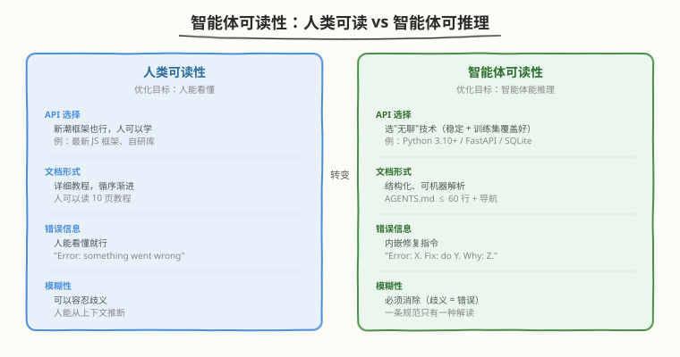
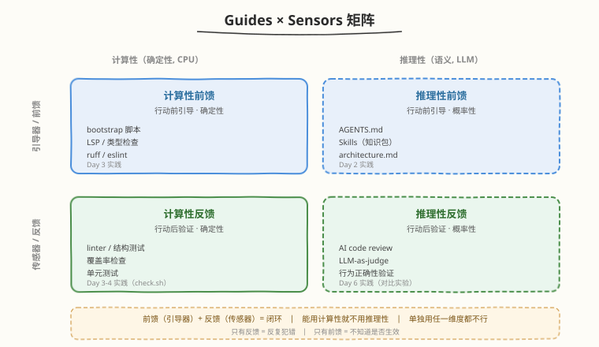
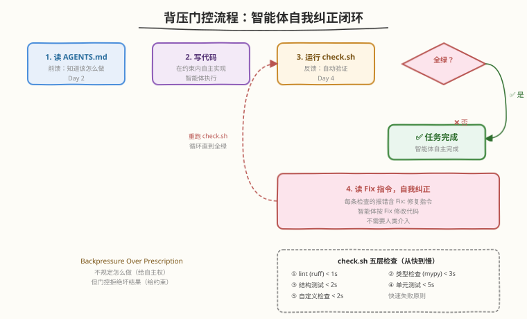

# Day 4：智能体可读性 + 反馈回路

## 🎯 目标

通过今天的学习，你将：

1. 理解"智能体可读性"——为什么智能体的"可读"标准与人类不同，如何为智能体的推理能力优化代码库
2. 掌握"无聊"技术原则——为什么 API 稳定、训练集覆盖好的技术比新潮框架更适合 harness
3. 理解"有时重新实现比包装更划算"的判断标准，以及 git worktree 对智能体可操作性的意义
4. 画出 Guides × Sensors 2×2 矩阵，理解前馈与反馈为什么缺一不可
5. 搭建完整的背压门控脚本 `scripts/check.sh`，将 Day 3 的所有检查统一为智能体的自我验证回路
6. 在 AGENTS.md 中编码"完成任务后必须运行背压"的指令，让智能体形成自我纠正闭环

> 💡 **前置知识**：已完成 Day 3 学习，实现了 ruff 配置、`custom_checks.py` 和 `test_structure.py`
> ⚠️ **环境要求**：Python 3.10+、pip、Day 3 的练手项目（含 ruff / custom_checks.py / test_structure.py）

---

## 为什么学智能体可读性与反馈回路

Day 1-3 我们搭建了 harness 的三层：知识传递层（AGENTS.md）、机械化执行层（ruff + custom_checks + 结构测试）。但还有一个关键问题没回答：**智能体做完任务后，怎么知道自己做得对不对？**

传统工程靠人类 Code Review 来回答这个问题。但在 Harness Engineering 中，人类不参与每一步执行——如果每次都要人类验证，吞吐量就退回到传统水平。

答案就是**反馈回路**：让系统自动验证智能体的产出，不通过就拒绝。这就是"背压门控"——Day 4 的核心实践。

但反馈回路只是故事的一半。另一半是**智能体可读性**：如果你的代码库对智能体不友好，即使有完美的反馈回路，智能体的首次成功率也会很低，陷入反复纠错的循环。

| 概念 | 解决什么问题 | 作用时机 |
|------|-------------|---------|
| 智能体可读性 | 首次成功率低 | 智能体行动**之前**（前馈） |
| 反馈回路 / 背压 | 做完了不知道对不对 | 智能体行动**之后**（反馈） |

> 💡 **一句话总结**：前馈让智能体一开始就做对，反馈让智能体做完后能验证。两者合在一起构成闭环——这就是 Guides × Sensors 矩阵的核心思想。

---

## 核心概念

### 1.1 智能体可读性

#### 人类可读 vs 智能体可读

智能体不是人类。人类可以读一篇长教程理解概念，可以在多个信息源之间自由切换，可以容忍模糊的文档。智能体不能。它的"可读性"标准不同：

| 维度 | 人类可读性 | 智能体可读性 |
|------|-----------|-------------|
| API 选择 | 新潮框架也行 | 选"无聊"技术（API 稳定、训练集覆盖好） |
| 文档形式 | 详细教程 | 结构化、可机器解析 |
| 错误信息 | 人能看懂就行 | 内嵌修复指令 |
| 代码结构 | 灵活 | 清晰的模块边界 |
| 模糊性 | 可以容忍 | 必须消除（歧义 = 错误） |



优化目标从"人类可读"转向"**智能体可推理**"——不是让智能体能"读"到信息，而是让它能"推理"出正确的行为。

#### "无聊"技术原则

选择 API 稳定、在训练数据中覆盖好的技术：

| 推荐 | 不推荐 | 原因 |
|------|--------|------|
| Python 3.10+ | 最新 nightly 版 | 稳定，训练集覆盖充分 |
| FastAPI | 自研框架 | 文档丰富，API 稳定，智能体见过无数次 |
| SQLite | 自研存储引擎 | 智能体见过无数次，行为可预测 |
| pytest | 自研测试框架 | 约定俗成，智能体知道怎么写测试 |
| requests / httpx | 自研 HTTP 客户端 | API 稳定，文档丰富 |
| SQLAlchemy | 自研 ORM | 训练集覆盖好，模式清晰 |

"无聊"不等于"差"——"无聊"意味着**可预测**。智能体在训练数据中见过这些技术无数次，它能准确预测 API 行为，犯错概率低。

> 💡 **关键洞察**："无聊"技术对智能体来说更容易建模：可组合性好、API 稳定、训练数据充分。新潮技术可能更强大，但智能体对它的理解不够深，首次成功率会下降。

#### 有时重新实现比包装更划算

OpenAI 原文给出了一个反直觉的实践：没有引入通用的 `p-limit` 风格包，而是自研了带并发的 map 辅助函数。原因：

| 维度 | 包装上游库 | 重新实现子集 |
|------|-----------|-------------|
| 智能体理解度 | 低（黑盒行为不透明） | 高（代码在仓库里，完全可见） |
| 与自有系统集成 | 需要适配层 | 原生集成（如 OpenTelemetry） |
| 测试覆盖 | 依赖上游 | 100% 自控 |
| 行为可预测性 | 受上游版本影响 | 完全符合运行时预期 |
| 维护成本 | 低（上游维护） | 中（自己维护，但子集小） |

判断标准：**上游行为是否不透明？** 如果是，重新实现子集可能更便宜。

```
包装划算的场景：
  上游库行为透明、API 稳定、智能体熟悉 → 如 requests、pytest

重新实现划算的场景：
  上游库行为不透明、需要深度集成自有系统、只需要小部分功能 → 如并发控制、自定义日志
```

#### 让应用对智能体可操作

OpenAI 原文提出了三个让应用"可被智能体操作"的实践：

| 实践 | 说明 | 效果 |
|------|------|------|
| git worktree 启动 | 应用可以根据 git worktree 启动 | 每次变更启动独立实例，智能体可以测试隔离 |
| Chrome DevTools 协议 | 接入智能体运行时 | DOM 快照、截图、导航 → 智能体可以"看到"前端 |
| 本地可观测性 | LogQL 查日志、PromQL 查指标 | 智能体可以查运行时状态，不需要人类转述 |

这些实践使得以下提示词变得可行：
- "确保服务启动在 800ms 内完成"
- "这四个关键用户旅程中的任何跨度都不得超过两秒"

> ⚠️ **注意**：如果你的应用不能被智能体独立启动和验证，反馈回路就无法自动化。让应用"可启动、可观测、可验证"是背压门控的前提。

### 1.2 Guides × Sensors 矩阵

Martin Fowler 用控制论框架把 harness 的所有组件分为四个象限：



| | 计算性（确定性，CPU） | 推理性（语义，LLM） |
|--|---------|---------|
| **引导器/前馈** | bootstrap 脚本、LSP、类型检查 | AGENTS.md、Skills、architecture.md |
| **传感器/反馈** | linter、结构测试、覆盖率 | AI code review、LLM-as-judge |

#### 四个象限详解

**引导器（Guides / 前馈）**：在智能体行动**之前**引导它，增加首次成功概率。

| 象限 | 例子 | 特点 | Day 对应 |
|------|------|------|---------|
| 计算性前馈 | bootstrap 脚本、LSP、类型检查 | 确定性、快速、便宜 | Day 3（ruff/类型检查） |
| 推理性前馈 | AGENTS.md、Skills、architecture.md | 概率性、慢、贵 | Day 2（AGENTS.md） |

**传感器（Sensors / 反馈）**：在智能体行动**之后**观察，启用自我纠正。

| 象限 | 例子 | 特点 | Day 对应 |
|------|------|------|---------|
| 计算性反馈 | linter、结构测试、覆盖率 | 确定性、快速、便宜 | Day 3（结构测试） |
| 推理性反馈 | AI code review、LLM-as-judge | 概率性、慢、贵 | Day 6（对比实验） |

#### 为什么前馈和反馈缺一不可

> ⚠️ **关键洞察**：单独使用任一维度都不行。

| 只有反馈，没有前馈 | 只有前馈，没有反馈 |
|-------------------|-------------------|
| 智能体不知道该怎么做 | 智能体不知道自己做得对不对 |
| 反复犯同样错误 | 不知道规则是否生效 |
| 首次成功率低 | 规则可能已被违反但无人发现 |
| → 高迭代成本 | → 质量无保障 |

**前馈 + 反馈 = 闭环**：

```
前馈（AGENTS.md + 类型检查）
  → 智能体知道该怎么做 → 首次成功率提高
    → 智能体写代码
      → 反馈（lint + 结构测试 + 背压）
        → 验证结果 → 不通过则自我纠正
          → 重新提交 → 再验证
            → 通过 → 完成
```

> 💡 **类比**：前馈是"出发前看地图"（知道怎么走），反馈是"到了后检查目的地"（确认走对了）。只有地图没有验证 = 可能走错路不自知；只有验证没有地图 = 每次都要试错。两者合在一起 = 又快又准。

### 1.3 背压门控（Back-Pressure）

#### 定义

背压 = 智能体做完任务后，系统自动验证结果，不通过就拒绝。

这是 Ralph 循环的核心信条之一：

| Ralph 信条 | Harness 对应 | 实践方式 |
|-----------|-------------|---------|
| Backpressure Over Prescription | 不规定怎么做，但门控拒绝坏结果 | `scripts/check.sh` |
| Fresh Context Is Reliability | 每次迭代重新读取，防止 context rot | 每次迭代重新读 AGENTS.md |

"Over Prescription"的意思是：**不规定智能体怎么做**（给自主权），**但门控拒绝坏结果**（给约束）。这对应 Day 3 的"中央强制边界，本地允许自主"。

#### 背压门控的完整流程



```
智能体收到任务
  → 读 AGENTS.md（前馈：知道该怎么做）
    → 写代码（在约束内自主实现）
      → 运行 scripts/check.sh（反馈：自动验证）
        → 全绿？→ 是 → 任务完成 ✅
        → 否 → 读 Fix 指令 → 修改 → 重跑 check.sh → 循环
```

#### 背压的五个层次

一个完整的背压门控应该覆盖五个层次：

| # | 检查 | 类型 | 速度 | 作用 |
|---|------|------|------|------|
| 1 | Lint（ruff） | 计算性反馈 | < 1s | 语法、风格、常见 bug |
| 2 | 类型检查（mypy） | 计算性反馈 | < 3s | 类型契约验证 |
| 3 | 结构测试 | 计算性反馈 | < 2s | 架构规则验证 |
| 4 | 单元测试 | 计算性反馈 | < 5s | 功能正确性验证 |
| 5 | 自定义检查 | 计算性反馈 | < 2s | 项目特有约束 |

> 💡 **为什么按这个顺序**：从快到慢。Lint 最快（< 1s），如果 lint 都不通过，后面的检查没意义。先快速失败，节省智能体的迭代时间。

### 1.4 Context Rot 与迭代速度

LangChain 的研究发现了一个关键问题：**上下文窗口填满后，模型性能会退化**（进入"dumb zone"）。

| 上下文状态 | 模型表现 | 类比 |
|-----------|---------|------|
| < 30% 占用 | 推理能力强 | 轻松专注 |
| 30-70% 占用 | 开始遗漏细节 | 注意力分散 |
| > 70% 占用 | 进入 dumb zone | 信息过载 |

应对策略：

| 策略 | 说明 | Harness 对应 |
|------|------|-------------|
| Compaction | 智能压缩和卸载上下文 | Hooks / 中间件自动 compaction |
| 工具输出卸载 | 保留大输出的头尾，完整内容存文件 | 大日志存文件，只传摘要 |
| 渐进式披露 | 按需加载，不在启动时预装所有工具 | AGENTS.md 是目录，Skills 按需加载 |
| Fresh Context | 每次迭代清空上下文重新开始 | Ralph 循环的核心信条 |

HumanLayer 的实战结论：

```
❌ 每次改动跑全量测试 → 慢，迭代次数少，上下文积累多
✅ 优化迭代速度，快速发现和修复问题 → 快，迭代次数多，每次上下文新鲜
✅ 便宜模型做子任务，贵模型做编排 → 成本低，上下文隔离
```

> 💡 **关键洞察**：优化迭代速度比提高首次成功率更重要。快速失败 + 快速纠错 > 慢慢做对。这与 Day 5 将学的"吞吐量改变合并理念"一脉相承。

### 1.5 约束越严，自主性越强

Martin Fowler 给出了一个反直觉的洞察：

> 限制解空间反而让 AI 更可靠。

| 自由度 | 首次成功率 | 迭代次数 | 总耗时 |
|--------|-----------|---------|--------|
| 高自由度（少约束） | 低（搜索空间大） | 多（反复试错） | 长 |
| 低自由度（多约束） | 高（搜索空间小） | 少（一次做对） | 短 |

这是 Ashby 必要多样性定律的实践体现（Day 1 已讲）：约束削减了输出多样性 → 调节器（harness）能覆盖 → 智能体在约束内可以更自主地决策 → "约束越严，自主性越强"。

> 💡 **实践启示**：不要害怕给智能体太多约束。每多一条机械化约束，智能体的搜索空间就缩小一分，首次成功率就提高一分。约束不是限制自主性，而是**保障**自主性。

---

## 最小可运行示例

### 任务 1：审计项目的智能体可读性

打开 Day 3 的练手项目，审计技术选型是否对智能体友好：

```bash
cd ~/harness-day1
```

检查清单：

| 检查项 | 你的项目 | 智能体友好？ |
|--------|---------|-------------|
| 编程语言版本 | | 稳定版？（不是 nightly） |
| Web 框架 | | 主流？（FastAPI/Flask 而非自研） |
| 数据库 | | 主流？（SQLite/PostgreSQL 而非自研） |
| 测试框架 | | 主流？（pytest 而非自研） |
| 依赖管理 | | 标准？（requirements.txt/pyproject.toml） |
| 应用可启动 | | 一条命令启动？（make run / python -m） |
| 应用可观测 | | 有日志/指标？（logging 模块） |

```bash
# 审计脚本
cat > scripts/audit_readability.sh << 'SCRIPT'
#!/bin/bash
echo "=== 智能体可读性审计 ==="
echo ""

check() {
    if [ -e "$2" ]; then
        echo "  ✅ $1 → $2"
    else
        echo "  ⚠️  $1 → 缺失（$3）"
    fi
}

echo "--- 技术选型 ---"
check "Python 版本稳定" "pyproject.toml" "确认 target-version 是稳定版"
check "依赖管理标准" "requirements.txt" "用标准的依赖管理"
check "测试框架主流" "tests/test_structure.py" "用 pytest"

echo ""
echo "--- 应用可操作性 ---"
check "Makefile 可启动" "Makefile" "提供 make run 一键启动"
check "AGENTS.md 入口" "AGENTS.md" "智能体入口文件"
check "架构说明" "ARCHITECTURE.md" "架构规则"

echo ""
echo "--- 可观测性 ---"
check "logging 配置" "src/__init__.py" "检查是否用 logging 而非 print"
check "自定义检查" "scripts/custom_checks.py" "项目特有约束"
check "结构测试" "tests/test_structure.py" "架构规则测试"

echo ""
echo "=== 审计完成 ==="
SCRIPT

chmod +x scripts/audit_readability.sh
bash scripts/audit_readability.sh
```

```text
# 预期输出
=== 智能体可读性审计 ===

--- 技术选型 ---
  ✅ Python 版本稳定 → pyproject.toml
  ✅ 依赖管理标准 → requirements.txt
  ✅ 测试框架主流 → tests/test_structure.py

--- 应用可操作性 ---
  ⚠️ Makefile 可启动 → 缺失（提供 make run 一键启动）
  ✅ AGENTS.md 入口 → AGENTS.md
  ✅ 架构说明 → ARCHITECTURE.md

--- 可观测性 ---
  ✅ logging 配置 → src/__init__.py
  ✅ 自定义检查 → scripts/custom_checks.py
  ✅ 结构测试 → tests/test_structure.py

=== 审计完成 ===
```

### 任务 2：添加 Makefile 让应用可启动

智能体需要能独立启动应用来验证——如果启动步骤只在人脑里，智能体无法自我验证。

```bash
cat > Makefile << 'EOF'
.PHONY: install run test lint check clean

install:
	pip install -r requirements.txt

run:
	python -m src.calculator

test:
	pytest tests/ -v

lint:
	ruff check src/ tests/
	mypy src/ --ignore-missing-imports

check:
	bash scripts/check.sh

clean:
	find . -type d -name __pycache__ -exec rm -rf {} +
	find . -type f -name "*.pyc" -delete
EOF
```

验证：

```bash
make test
```

```text
# 预期输出
============================= test session starts =============================
collected 9 items

tests/test_structure.py::test_agents_md_exists PASSED
...
tests/test_structure.py::test_tests_mirror_src PASSED

============================== 9 passed ==============================
```

### 任务 3：搭建完整的背压门控脚本

这是 Day 4 的核心实践——将 Day 3 的所有检查统一为一个背压门控脚本。

```bash
pip install mypy pytest-cov
```

```bash
cat > scripts/check.sh << 'SCRIPT'
#!/bin/bash
# scripts/check.sh —— 完整的背压门控脚本
# 智能体完成任务后必须运行此脚本，全绿才算任务完成
# 用法: bash scripts/check.sh

set -euo pipefail

# 颜色定义
RED='\033[0;31m'
GREEN='\033[0;32m'
YELLOW='\033[1;33m'
NC='\033[0m' # No Color

PASS=0
FAIL=0

run_check() {
    local name="$1"
    local cmd="$2"
    echo "=== $name ==="
    if eval "$cmd"; then
        echo -e "${GREEN}  ✅ PASSED${NC}"
        PASS=$((PASS + 1))
    else
        echo -e "${RED}  ❌ FAILED${NC}"
        FAIL=$((FAIL + 1))
    fi
    echo ""
}

echo "🚀 Running back-pressure checks..."
echo "================================"
echo ""

# 1. Lint 检查（最快，先跑）
run_check "1/5. Lint (ruff)" \
    "ruff check src/ tests/"

# 2. 类型检查
run_check "2/5. Type Check (mypy)" \
    "mypy src/ --ignore-missing-imports --no-error-summary"

# 3. 结构测试
run_check "3/5. Structure Tests" \
    "pytest tests/test_structure.py -q"

# 4. 单元测试（含覆盖率）
run_check "4/5. Unit Tests (+ coverage)" \
    "pytest tests/ --ignore=tests/test_structure.py -q --cov=src --cov-report=term-missing --cov-fail-under=80"

# 5. 自定义检查
run_check "5/5. Custom Checks" \
    "python scripts/custom_checks.py"

echo "================================"
echo ""

if [ $FAIL -eq 0 ]; then
    echo -e "${GREEN}✅ All $PASS checks passed. Safe to proceed.${NC}"
    exit 0
else
    echo -e "${RED}❌ $FAIL check(s) failed. Fix the errors above and re-run.${NC}"
    echo -e "${YELLOW}   Each error message contains a Fix: instruction.${NC}"
    echo -e "${YELLOW}   Follow the Fix instruction to self-correct, then re-run: bash scripts/check.sh${NC}"
    exit 1
fi
SCRIPT

chmod +x scripts/check.sh
```

运行完整的背压门控：

```bash
bash scripts/check.sh
```

```text
# 预期输出
🚀 Running back-pressure checks...
================================

=== 1/5. Lint (ruff) ===
All checks passed!
  ✅ PASSED

=== 2/5. Type Check (mypy) ===
Success: no issues found in 2 source files
  ✅ PASSED

=== 3/5. Structure Tests ===
..........                                                         [100%]
9 passed
  ✅ PASSED

=== 4/5. Unit Tests (+ coverage) ===
......                                                              [100%]
---------- coverage: src ----------
Name                    Stmts   Miss  Cover   Missing
-----------------------------------------------------
src/__init__.py             0      0   100%
src/calculator.py           8      0   100%
-----------------------------------------------------
TOTAL                       8      0   100%
6 passed

  ✅ PASSED

=== 5/5. Custom Checks ===
=== Custom Structure Checks ===

  ✅ check_agents_md_exists
  ✅ check_agents_md_length
  ✅ check_agents_md_navigation_links
  ✅ check_function_length
  ✅ check_public_functions_have_type_hints
  ✅ check_no_bare_print

✅ All 6 checks passed.
  ✅ PASSED

================================

✅ All 5 checks passed. Safe to proceed.
```

> 💡 **观察**：5 项检查从快到慢依次执行。如果有失败，错误信息中的 `Fix:` 指令告诉智能体怎么修。智能体修完后重跑 `check.sh`，直到全绿——这就是自我纠正闭环。

### 任务 4：故意失败，验证背压拒绝

```bash
# 故意制造一个类型错误
cat > src/bad_type.py << 'EOF'
def add_untyped(x, y):
    return x + y
EOF

bash scripts/check.sh 2>&1 | grep -A2 "FAILED"
```

```text
# 预期输出
=== 2/5. Type Check (mypy) ===
src/bad_type.py:1: error: Function is missing a return type annotation
  ❌ FAILED
```

```bash
# 同时检查 custom_checks 也捕获
bash scripts/check.sh 2>&1 | grep "GR-2"
```

```text
# 预期输出
ERROR: GR-2 violated — public functions missing type annotations:
  src/bad_type.py:1 add_untyped() missing return annotation
  Fix: add return type annotations to all public functions.
```

```bash
# 清理
rm src/bad_type.py
```

### 任务 5：在 AGENTS.md 中编码背压指令

智能体需要被明确告知"完成任务后必须运行背压"。更新 AGENTS.md：

```bash
cat > AGENTS.md << 'EOF'
# Calculator

> 简单的数学运算库，支持加减乘除和幂运算

## 仓库结构

| 目录 | 内容 | 说明 |
|------|------|------|
| `src/` | 源码 | 每个模块对应一个数学功能 |
| `tests/` | 测试 | pytest，含结构测试 |
| `docs/` | 文档 | 编码规范、执行计划 |
| `scripts/` | 脚本 | 检查与审计 |

## 开发约定

- 语言：Python 3.10+，类型注解必填
- 测试：pytest，覆盖率 > 80%
- 提交：conventional commits
- 函数 ≤ 50 行，public 函数须有 docstring

## 导航

- 编码规范：[docs/coding-standards.md](docs/coding-standards.md)
- 架构说明：[ARCHITECTURE.md](ARCHITECTURE.md)
- 已知问题：[TODO.md](TODO.md)
- 执行计划：[docs/exec-plans/](docs/exec-plans/)

## 机械化检查（背压门控）

完成任务后必须运行：
    bash scripts/check.sh

全绿才算任务完成。如有失败，根据错误信息中的 Fix 提示
自我纠正，然后重新运行，直到全绿。

检查覆盖 5 层：lint → 类型 → 结构测试 → 单元测试 → 自定义检查
EOF

wc -l AGENTS.md
```

```text
# 预期输出
35 AGENTS.md
```

35 行，在 60 行限制内。

### 任务 6：验证智能体的自我纠正闭环

让 AI 助手执行一个任务，观察它是否能利用背压门控自我纠正：

```bash
# 给 AI 助手这个指令：
# "给 src/calculator.py 添加一个 factorial(n) 函数，返回 n 的阶乘。
#  负数输入应抛出 ValueError。写对应的测试。
#  完成后运行 bash scripts/check.sh 确保全绿。"
```

观察记录：

| 阶段 | 智能体行为 | 背压结果 |
|------|-----------|---------|
| 读 AGENTS.md | 知道项目约定和检查方式 | — |
| 写代码 | 写 factorial 函数 + 测试 | — |
| 跑 check.sh | 自动验证 | ? |
| 如果失败 | 读 Fix 指令，修改 | ? |
| 重跑 check.sh | 再次验证 | ? |
| 最终 | 全绿 → 完成 | ✅ |

```bash
# 验证最终结果
bash scripts/check.sh
```

```bash
git add -A && git commit -m "feat: add Makefile, check.sh backpressure, update AGENTS.md"
```

> 💡 **实验结论**：如果你在 AGENTS.md 中明确写了"完成后必须运行 `bash scripts/check.sh`"，且 check.sh 的错误信息内嵌了 Fix 指令，智能体应该能完成"写代码 → 验证 → 纠错 → 重验"的闭环，不需要人类介入。这就是背压门控的核心价值。

---

## 深入原理

### 前馈与反馈的控制论基础

Guides × Sensors 矩阵来自控制论——前馈和反馈是控制系统的两个基本模式：

| 控制模式 | 定义 | 在 harness 中的对应 | 例子 |
|----------|------|-------------------|------|
| 前馈（Feedforward） | 在扰动发生前就调整控制量 | 引导器（Guides） | AGENTS.md 告诉智能体规范 |
| 反馈（Feedback） | 在扰动发生后根据偏差调整 | 传感器（Sensors） | lint 检测违规并报错 |

经典控制论认为：**前馈 + 反馈 = 最优控制**。只用前馈无法应对未预见的扰动；只用反馈会有延迟（先犯错再纠正）。两者结合才能既快又准。

### 计算性 vs 推理性

Fowler 矩阵的另一个维度是计算性 vs 推理性：

| 维度 | 计算性 | 推理性 |
|------|--------|--------|
| 执行者 | CPU（确定性程序） | LLM（概率性推理） |
| 速度 | 极快（毫秒级） | 慢（秒级到分钟级） |
| 成本 | 几乎为零 | 每次 API 调用花钱 |
| 可靠性 | 100%（确定性） | 概率性（可能误判） |
| 适合 | 每次提交都跑 | 选择性运行 |

实践原则：**能用计算性就不用推理性**。linter 和结构测试是计算性的——快、便宜、100% 可靠。AI code review 是推理性的——慢、贵、可能误判。在背压门控中，5 层检查全部是计算性的；推理性检查（如 AI code review）只在特殊场景选择性使用。

### 背压门控的执行顺序

为什么 `check.sh` 按 lint → 类型 → 结构 → 单元 → 自定义的顺序？

```
速度递减 ↓          重要性递增 ↓

1. lint      (< 1s)  语法/风格      ← 最快，快速失败
2. 类型检查   (< 3s)  类型契约
3. 结构测试   (< 2s)  架构规则
4. 单元测试   (< 5s)  功能正确性    ← 最重要
5. 自定义检查  (< 2s)  项目特有
```

原则：**快速失败**。如果 lint 都不通过（可能是语法错误），后面的类型检查、单元测试都没意义。先跑最快的检查，失败就立即返回，节省智能体的迭代时间。

### git worktree 与智能体可操作性

OpenAI 原文提到"应用可以根据 git worktree 启动"——这对智能体可操作性至关重要：

```bash
# 传统方式：一个工作目录，切换分支会影响运行中的实例
git checkout feature-a
python -m src.calculator  # 如果同时要测 main 分支，需要停掉重启

# git worktree 方式：多个工作目录，互不干扰
git worktree add ../calc-feature-a feature-a
git worktree add ../calc-main main

# 智能体可以在 feature-a worktree 中修改并测试
# 同时 main worktree 的实例不受影响
cd ../calc-feature-a
python -m src.calculator  # 独立实例
```

| 传统方式 | git worktree |
|----------|-------------|
| 一个目录，切换分支影响运行实例 | 多个目录，每个分支一个独立实例 |
| 智能体测试时可能影响其他进程 | 完全隔离 |
| 需要手动停止/重启 | 各实例独立启停 |

> 💡 **对智能体的意义**：git worktree 让智能体可以在隔离环境中修改代码、启动应用、运行测试，不影响主分支的运行实例。这是"让应用对智能体可操作"的关键基础设施。

### 三个规制维度的成熟度

Day 1 提到 Fowler 的三个规制维度，今天从反馈回路角度重新审视：

| 维度 | 成熟度 | 计算性反馈 | 推理性反馈 | 现状 |
|------|--------|-----------|-----------|------|
| 可维护性 Harness | 最成熟 | lint / 格式化 / 覆盖率 | AI code review（风格） | 工具丰富 |
| 架构适应度 Harness | 中等 | 结构测试 / 依赖分析 | LLM-as-judge（架构） | Fitness Functions |
| 行为 Harness | **最弱** | 单元测试 / 集成测试 | LLM-as-judge（行为） | 房间里的大象 |

> ⚠️ **房间里的大象**：行为 Harness 是当前最薄弱的环节。你的 harness 能保证代码"结构正确"（lint 通过、类型正确、分层合规），但很难保证"行为正确"（功能真的对）。单元测试是最后的防线，但测试覆盖率 ≠ 行为正确性。Day 7 会讨论这个挑战。

---

## 常见陷阱与最佳实践

### 陷阱 1：只有反馈没有前馈

```bash
# ❌ 错误：只有 check.sh，没有 AGENTS.md
# 智能体不知道项目约定 → 首次成功率低 → 反复纠错 → context rot

# ✅ 正确：AGENTS.md（前馈）+ check.sh（反馈）
# 智能体先读 AGENTS.md 知道怎么做 → 首次成功率高 → check.sh 验证 → 闭环
```

### 陷阱 2：背压门控太慢

```bash
# ❌ 错误：check.sh 跑 2 分钟（含全量集成测试 + E2E 测试）
# 智能体每次迭代等 2 分钟 → 迭代次数少 → context 积累 → 性能退化

# ✅ 正确：分层检查，快速失败
# check.sh 只跑快速检查（lint + 类型 + 结构 + 单元，< 15s）
# 集成测试和 E2E 测试放 CI，不在本地迭代中跑
```

### 陷阱 3：错误信息不包含修复指令

```bash
# ❌ 错误：check.sh 失败只说 "FAILED"
# 智能体不知道怎么修 → 需要人类介入

# ✅ 正确：每条检查的失败信息包含 Fix 指令
# 智能体读 Fix → 按指令修改 → 重跑 → 通过
```

### 陷阱 4：选了智能体不熟悉的技术

```python
# ❌ 错误：用了一个新出的、训练集没覆盖的框架
# 智能体对 API 行为预测不准 → 首次成功率低

# ✅ 正确：用"无聊"技术（FastAPI / pytest / SQLite）
# 智能体见过无数次 → API 行为可预测 → 首次成功率高
```

### 陷阱 5：应用无法被智能体独立启动

```bash
# ❌ 错误：启动需要 5 个手动步骤 + 3 个环境变量 + 1 个数据库迁移
# 智能体无法独立启动应用 → 无法自我验证 → 背压门控形同虚设

# ✅ 正确：make run 一键启动
# 智能体跑 make run → 应用启动 → 跑测试 → 验证
```

### 最佳实践

| 实践 | 说明 |
|------|------|
| 前馈 + 反馈成对出现 | AGENTS.md（前馈）+ check.sh（反馈），缺一不可 |
| 快速失败 | check.sh 从快到慢，失败立即返回 |
| 错误信息内嵌 Fix | 每条检查失败都告诉智能体怎么修 |
| 用"无聊"技术 | API 稳定、训练集覆盖好的技术 |
| 一键启动 | Makefile 提供 `make run` / `make test` / `make check` |
| 优化迭代速度 | 快速失败 + 快速纠错 > 慢慢做对 |
| 能用计算性就不用推理性 | lint/结构测试是计算性的，AI review 是推理性 |
| git worktree 隔离 | 让智能体在隔离环境中测试，不影响主分支 |

---

## 面试要点

1. **什么是"智能体可读性"？它与人类可读性有什么区别？**

<details>
<summary>点击查看答案</summary>

- 智能体可读性：优化目标从"人类可读"转向"智能体可推理"——不是让智能体能"读"到信息，而是让它能"推理"出正确行为
- 与人类可读性的区别：
  - API 选择：人类可以学新框架，智能体选"无聊"技术（训练集覆盖好）
  - 文档形式：人类可以读长教程，智能体需要结构化、可机器解析
  - 错误信息：人能看懂就行，智能体需要内嵌修复指令
  - 模糊性：人类可以容忍，智能体必须消除（歧义 = 错误）

</details>

2. **什么是"无聊"技术原则？为什么对智能体更好？**

<details>
<summary>点击查看答案</summary>

- "无聊"技术：API 稳定、在训练数据中覆盖好的技术（如 Python 3.10+、FastAPI、SQLite、pytest）
- 对智能体更好的原因：
  - 可预测：智能体在训练数据中见过无数次，能准确预测 API 行为
  - 可组合性好：API 稳定，不会因版本更新而 break
  - 犯错概率低：训练集覆盖充分，智能体对 API 的"理解"更深
- "无聊"不等于"差"——"无聊"意味着可预测

</details>

3. **什么时候"重新实现比包装更划算"？**

<details>
<summary>点击查看答案</summary>

- 判断标准：上游行为是否不透明？
- 重新实现划算的场景：上游库行为不透明、需要深度集成自有系统、只需要小部分功能
  - 例子：OpenAI 自研并发 map 而非用 p-limit（与 OpenTelemetry 紧密集成、100% 测试覆盖、行为完全可预测）
- 包装划算的场景：上游库行为透明、API 稳定、智能体熟悉
  - 例子：requests、pytest
- 关键：智能体能理解你重写的代码，但理解不了黑盒包装

</details>

4. **画出 Guides × Sensors 2×2 矩阵并解释每个象限**

<details>
<summary>点击查看答案</summary>

| | 计算性（确定性） | 推理性（语义） |
|--|---------|---------|
| 引导器/前馈 | bootstrap 脚本、LSP、类型检查 | AGENTS.md、Skills、architecture.md |
| 传感器/反馈 | linter、结构测试、覆盖率 | AI code review、LLM-as-judge |

- 引导器（前馈）：行动前引导，增加首次成功率
- 传感器（反馈）：行动后观察，启用自我纠正
- 计算性：确定性、快速、便宜，每次提交都跑
- 推理性：概率性、慢、贵，选择性运行

</details>

5. **为什么前馈和反馈缺一不可？**

<details>
<summary>点击查看答案</summary>

- 只有反馈，没有前馈：智能体不知道该怎么做 → 反复犯同样错误 → 首次成功率低 → 高迭代成本
- 只有前馈，没有反馈：智能体不知道自己做得对不对 → 不知道规则是否生效 → 质量无保障
- 前馈 + 反馈 = 闭环：前馈让智能体一开始就做对，反馈让智能体做完后能验证
- 类比：前馈是"出发前看地图"，反馈是"到了后检查目的地"

</details>

6. **什么是背压门控？它的工作流程是什么？**

<details>
<summary>点击查看答案</summary>

- 背压门控：智能体做完任务后，系统自动验证结果，不通过就拒绝
- 工作流程：智能体读 AGENTS.md → 写代码 → 运行 check.sh → 全绿？是→完成 / 否→读 Fix→修改→重跑→循环
- 五层检查：lint → 类型检查 → 结构测试 → 单元测试 → 自定义检查
- 执行顺序：从快到慢，快速失败
- "Backpressure Over Prescription"：不规定怎么做（给自主权），但门控拒绝坏结果（给约束）

</details>

7. **check.sh 为什么按 lint → 类型 → 结构 → 单元 → 自定义的顺序？**

<details>
<summary>点击查看答案</summary>

- 原则：快速失败——从快到慢依次检查
- lint 最快（< 1s），如果语法都不对，后面的检查没意义
- 类型检查（< 3s），类型不对说明契约有问题
- 结构测试（< 2s），架构违规快速检测
- 单元测试（< 5s），功能正确性
- 自定义检查（< 2s），项目特有约束
- 先快速失败节省智能体的迭代时间——如果 lint 就失败了，不需要等 5 秒跑完单元测试再报错

</details>

8. **什么是 Context Rot？如何应对？**

<details>
<summary>点击查看答案</summary>

- Context Rot：上下文窗口填满后，模型性能退化（进入"dumb zone"）
- 应对策略：
  - Compaction：智能压缩和卸载上下文（Hooks/中间件）
  - 工具输出卸载：保留大输出的头尾，完整内容存文件
  - 渐进式披露：按需加载，不在启动时预装所有工具
  - Fresh Context：每次迭代清空上下文重新开始（Ralph 循环核心信条）
- 实践启示：优化迭代速度比提高首次成功率更重要——快速失败 + 快速纠错 > 慢慢做对

</details>

---

## 今日总结

Day 4 我们搭建了 harness 的反馈回路层——智能体可读性与背压门控：

1. **智能体可读性**：优化目标从"人类可读"转向"智能体可推理"。选"无聊"技术（API 稳定、训练集覆盖好），有时重新实现比包装更划算
2. **Guides × Sensors 矩阵**：前馈（引导器）+ 反馈（传感器）= 闭环。计算性（快、便宜）vs 推理性（慢、贵），能用计算性就不用推理性
3. **背压门控**：智能体完成任务后自动验证，不通过就拒绝。`scripts/check.sh` 统一 5 层检查：lint → 类型 → 结构 → 单元 → 自定义
4. **快速失败**：检查从快到慢依次执行，失败立即返回，节省智能体迭代时间
5. **自我纠正闭环**：错误信息内嵌 Fix 指令 → 智能体按指令修改 → 重跑 → 通过，不需要人类介入
6. **Context Rot**：上下文填满后性能退化，应对策略是 compaction、渐进式披露、fresh context
7. **约束越严，自主性越强**：限制解空间反而让 AI 更可靠——Ashby 定律的实践体现
8. **实践产出**：审计智能体可读性、添加 Makefile、搭建 check.sh、验证失败拒绝、更新 AGENTS.md 背压指令

> 💡 **明日预告**：Day 5 将进入"熵管理与吞吐量理念"——理解为什么智能体会复现仓库中的坏模式（熵增），以及"纠错成本低、等待成本高"如何改变合并理念。你将编写黄金规则文档、设计漂移扫描方案，并理解技术债作为"高息贷款"的偿还策略。

---

## 推荐资源

| 资源 | 类型 | 优先级 | 说明 |
|------|------|--------|------|
| [OpenAI — Harness Engineering 原文](https://openai.com/zh-Hans-CN/index/harness-engineering/) | 官方 | ⭐ 必读 | "智能体可读性"与背压概念的原始阐述 |
| [Martin Fowler — Harness Engineering 正式版](https://martinfowler.com/articles/harness-engineering.html) | 博客 | ⭐ 必读 | Guides × Sensors 矩阵的控制论框架 |
| [Martin Fowler — Maintainability Sensors](https://martinfowler.com/articles/sensors.html) | 博客 | ⭐ 必读 | 传感器（反馈）的详细设计 |
| [LangChain — Scaling Managed Agents](https://blog.langchain.dev/scaling-managed-agents/) | 博客 | 📌 推荐 | Context Rot 问题的详细分析与应对 |
| [snarktank/ralph](https://github.com/snarktank/ralph) | 开源项目 | 📌 推荐 | "Backpressure Over Prescription"信条的来源 |
| [harness-engineering — concepts/04](https://github.com/deusyu/harness-engineering/blob/main/concepts/04-agent-readability.md) | 笔记 | 📌 推荐 | "智能体可读性"的深度拆解 |
| [HumanLayer — 6 Levers of Agent Config](https://humanlayer.com/) | 博客 | 📎 参考 | 迭代速度优于首次成功率 |
