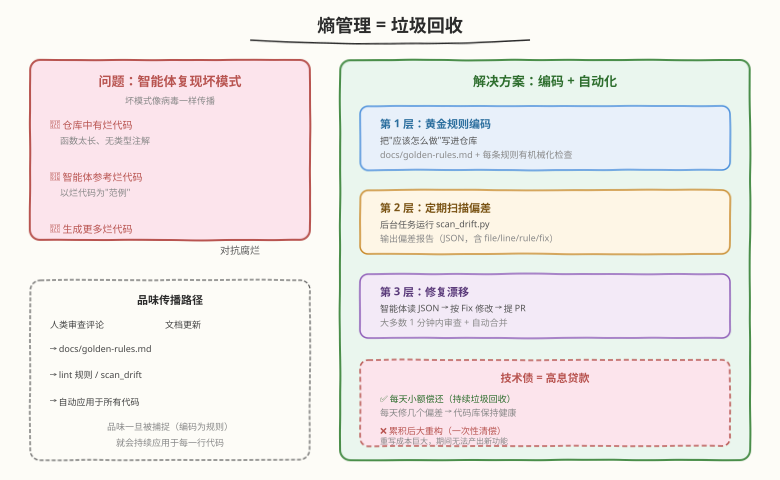
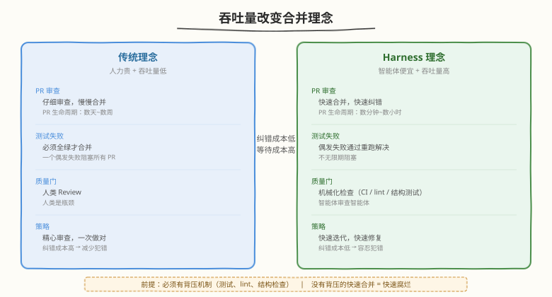

# Day 5：熵管理与吞吐量理念

## 🎯 目标

通过今天的学习，你将：

1. 理解"熵管理 = 垃圾回收"——为什么智能体会复现仓库中的坏模式，以及熵增如何导致代码库腐烂
2. 掌握熵管理三层方案：黄金规则编码 → 定期扫描偏差 → 修复漂移，理解技术债作为"高息贷款"的偿还策略
3. 理解"吞吐量改变合并理念"——为什么"纠错成本低、等待成本高"会颠覆传统 PR 审查模式
4. 区分"可快速纠错"与"不可逆"变更，理解智能体审查智能体的 Ralph 循环
5. 为练手项目编写完整的黄金规则文档（`docs/golden-rules.md`），每条规则都有对应的机械化检查
6. 实现漂移扫描脚本（`scripts/scan_drift.py`），能定期扫描代码是否偏离黄金规则并输出 JSON 报告

> 💡 **前置知识**：已完成 Day 4 学习，搭建了 `scripts/check.sh` 背压门控，理解 Guides × Sensors 矩阵
> ⚠️ **环境要求**：Python 3.10+、Day 4 的练手项目（含 check.sh / custom_checks.py / test_structure.py）

---

## 为什么学熵管理与吞吐量理念

Day 1-4 我们搭建了 harness 的四层：知识传递（AGENTS.md）、机械化执行（ruff + custom_checks + 结构测试）、反馈回路（check.sh 背压门控）、智能体可读性（"无聊"技术 + 一键启动）。这套 harness 能让智能体在约束内可靠地完成单个任务。

但 harness 面对的不是单个任务——它面对的是**成百上千个任务、持续数月运行**。在时间维度上，两个新问题浮出水面：

| 问题 | 本质 | 今天的概念 |
|------|------|-----------|
| 代码库越来越乱 | 智能体复现坏模式 → 漂移累积 → 熵增 | 熵管理 = 垃圾回收 |
| PR 审查成为瓶颈 | 智能体吞吐量远超人类注意力 → 等待成本高 | 吞吐量改变合并理念 |

这两个问题不解决，harness 就不可持续：

- 不管理熵 → 代码库腐烂 → 智能体以烂代码为范例 → 生成更多烂代码 → 恶性循环
- 不改变合并理念 → 人类成为瓶颈 → 智能体等待人类审查 → 吞吐量归零

> 💡 **一句话总结**：概念 5-6 解决"长期运行怎么不腐烂"——熵管理防止代码库退化，吞吐量理念防止人类成为瓶颈。两者共同保障 harness 的可持续性。

---

## 核心概念

### 1.1 熵管理 = 垃圾回收

#### 核心问题：智能体会复现坏模式

智能体不是从零开始写代码——它会**参考仓库中已有的代码模式**。这是它的优势（能快速适配项目风格），也是它最大的风险：

> 智能体会复现仓库中已存在的模式——**包括坏模式**。

如果你有一个写得很烂的文件，智能体会以它为"范例"生成更多烂代码。坏模式像病毒一样在代码库中传播。



OpenAI 在原文中描述了熵增的具体表现：

| 漂移类型 | 例子 | 后果 |
|----------|------|------|
| 重复辅助函数 | 同样的 `format_date()` 在 5 个文件里各有一份 | 改一处忘改其他 → 行为不一致 |
| 不一致的错误处理 | 有的用 `raise ValueError`，有的返回 `None`，有的 log 后吞掉 | 智能体不知道该学哪种 |
| YOLO 式探测 | 不验证数据结构就直接访问 `.["key"]` | 运行时崩溃 |
| 文档与代码不符 | 文档说"返回 dict"，实际返回 list | 智能体基于错误文档生成错误代码 |

#### 失败方案：人工清理

OpenAI 最初尝试用人工清理：

> 团队每周五花 20% 时间清理"AI 残渣"。不出所料，不具备可扩展性。

为什么失败？因为人工清理是**间歇性大额偿还**——清理完一周后，下一周又积累新的残渣。而且人工清理依赖人类注意力，团队越大越难协调。

#### 成功方案：编码 + 自动化

熵管理三层方案：

```
第 1 层：黄金规则编码
  → 把"应该怎么做"写进仓库（docs/golden-rules.md）
  → 每条规则有对应的机械化检查（lint / 结构测试 / 自定义脚本）

第 2 层：定期扫描偏差
  → 后台任务定期运行 scripts/scan_drift.py
  → 扫描代码是否偏离黄金规则
  → 输出偏差报告（JSON 格式，含 file/line/rule/fix）

第 3 层：修复漂移
  → 根据偏差报告发起针对性重构 PR
  → 大多数 1 分钟内审查 + 自动合并
  → 小额持续偿还，不累积到大重构
```

| 层 | 谁做 | 频率 | 产出 |
|----|------|------|------|
| 黄金规则编码 | 人类工程师 | 规则变更时 | docs/golden-rules.md + 机械化检查 |
| 定期扫描偏差 | 后台任务 | 每日/每周 | 偏差报告（JSON） |
| 修复漂移 | 智能体 | 扫描后 | 重构 PR → 自动合并 |

> 💡 **关键洞察**：人类的品味一旦被捕捉（编码为规则），就会持续应用于每一行代码——无论人类是否在场。品味传播路径：人类审查评论 → 文档更新 → lint 规则 → 自动应用于所有代码。

### 1.2 技术债 = 高息贷款

OpenAI 用了一个精准的类比：

| 维度 | 技术债 | 高息贷款 |
|------|--------|---------|
| 本质 | 坏模式在代码库中累积 | 债务在账户中累积 |
| 利息 | 智能体复现坏模式 → 更多坏代码 | 利息复利 → 更多债务 |
| 偿还方式 A | ✅ 每天小额偿还（持续垃圾回收） | ✅ 按月还款 |
| 偿还方式 B | ❌ 累积到痛苦时一次性清偿（重写/大重构） | ❌ 拖到最后一次性还清 |
| 结果 A | 代码库保持健康，智能体有好的范例 | 债务可控 |
| 结果 B | 重写成本巨大，且重写期间无法产出新功能 | 利息压垮借款人 |

```
✅ 持续垃圾回收：
  每天：scan_drift 发现 3 个偏差 → 自动修复 3 个 → 代码库保持干净
  智能体看到的是干净代码 → 生成干净代码 → 良性循环

❌ 累积后大重构：
  前 3 个月：不扫描，偏差累积到 200 个
  第 4 个月：不得不停所有功能开发做大重构
  重写期间：智能体看到的是混乱代码 → 生成混乱代码 → 恶性循环
  重写后：新代码仍有偏差（因为没有黄金规则防止复发）
```

> ⚠️ **注意**：持续垃圾回收的前提是**黄金规则已编码**。没有黄金规则，扫描脚本不知道"什么算偏差"，垃圾回收就无从做起。Day 3 的机械化执行是 Day 5 熵管理的基础。

### 1.3 吞吐量改变合并理念

#### 核心转变

当 Codex 的吞吐量远超人类注意力时，传统的工程规范变得不再有效。核心转变：**纠错成本低，等待成本高。**



| 维度 | 传统理念 | Harness 理念 |
|------|----------|-------------|
| PR 审查 | 仔细审查，慢慢合并 | 纠错成本低，快速合并 |
| 测试失败 | 必须全绿才合并 | 偶发失败通过后续重跑解决 |
| 质量门 | 人类 Review | 机械化检查（CI / lint / 结构测试） |
| PR 生命周期 | 数天到数周 | 数分钟到数小时 |
| 合并门控 | 多个人工门 | 最少阻塞门 |

#### 经济学本质

这个概念的本质是一个**经济学问题**：

```
传统模式：人力贵 + 吞吐量低 → 每个 PR 都要精心审查 → 阻塞门多
Harness 模式：智能体便宜 + 吞吐量高 → 快速迭代修复 → 阻塞门少
```

| 成本类型 | 传统模式 | Harness 模式 |
|----------|---------|-------------|
| 纠错成本 | 高（人改代码慢） | 低（智能体改代码快） |
| 等待成本 | 低（PR 少，等得起） | 高（PR 多，等不起） |
| 最优策略 | 精心审查，一次做对 | 快速合并，快速纠错 |

> 💡 **关键前提**：快速合并的前提是**有足够的背压机制**（测试、lint、结构检查）。没有背压机制的"快速合并"不是"快速迭代"，而是"快速腐烂"。

#### OpenAI 的实战数据

| 指标 | 数据 | 说明 |
|------|------|------|
| PR 数量 | ~1,500 个 / 5 个月 | 人均每天 3.5 个 PR |
| PR 生命周期 | 很短 | 不再是精雕细琢的大作 |
| 扩展后 | 7 人，吞吐量仍在增长 | 瓶颈不在人数 |
| 审查模式 | 智能体审查智能体 | 人类可以审核但不是必须 |

### 1.4 智能体审查智能体

OpenAI 的审查模式演化：

```
阶段 1：人类审查每个 PR（传统模式）
  → 人类成为瓶颈 → 吞吐量受限

阶段 2：人类审查 + 智能体辅助
  → 智能体做初审，人类做终审 → 吞吐量提升但人类仍是瓶颈

阶段 3：智能体审查智能体（Ralph 循环）
  → Codex 本地审核 → 请求额外智能体审查 → 对反馈做出响应 → 循环直到所有审核通过
  → 人类只在例外时介入 → 吞吐量不受人类注意力限制
```

Ralph Wiggum 循环的审查流程：

```
智能体 A 写代码并提交 PR
  → 智能体 B（审查者）审核 PR
    → 如果有问题：智能体 A 根据反馈修改 → 智能体 B 重新审核
    → 如果通过：合并
  → 循环直到所有审核通过
```

> ⚠️ **注意**：这不意味着人类完全不审查。人类可以审核 PR，但**不是必须的**。随着时间推移，几乎所有审核都调整为智能体对智能体。人类的时间花在设计约束和处理例外上，而不是逐个审查 PR。

### 1.5 可快速纠错 vs 不可逆

"快速合并 + 快速纠错"不适用于所有场景。区分"可快速纠错"和"不可逆"是关键：

| 变更类型 | 可快速纠错？ | 审查方式 | 例子 |
|----------|-------------|---------|------|
| 内部实现重构 | ✅ | 机械化检查 | 提取辅助函数、重命名变量 |
| 新增功能 | ✅ | 机械化检查 + 智能体审查 | 添加新 API 端点 |
| Bug 修复 | ✅ | 机械化检查 + 测试 | 修复边界条件 |
| 数据库 schema 变更 | ⚠️ 谨慎 | 人类审查 | 删列、改类型 |
| 公共 API 变更 | ⚠️ 谨慎 | 人类审查 | 改接口签名、删端点 |
| 安全相关变更 | ❌ 不可逆 | 人类审查 | 认证逻辑、权限模型 |
| 数据迁移 | ❌ 不可逆 | 人类审查 | 生产数据批量修改 |

> 💡 **判断标准**：如果这个变更出了问题，能通过后续 PR 快速回滚或修复吗？能 → 可快速纠错。不能（或回滚成本极高）→ 不可逆，需人类审查。

### 1.6 Symphony 的吞吐量跃迁

OpenAI Symphony 把吞吐量哲学**抽象到更高一层**：从"PR 流转速度"到"ticket 流转速度"。

| 层级 | 单位 | 人类介入点 |
|------|------|----------|
| OpenAI 原文 | 1 PR | 提示 + 审查 |
| Symphony | 1 ticket（可产出 0..N 个 PR） | 提交 ticket + 审查 review packet |

数据点：部分团队前三周 PR 数量 **+500%**。原因不是 PR 写得更快，而是**人类不再为每个 PR 付注意力成本**——一个 ticket 内的多次重试、PR 拆分、CI 重跑全由编排器代劳。

> 💡 **前提对齐**：Symphony 仍然依赖原文要求的所有背压机制（CI、lint、测试），并加上可推送到 ticket 状态机的工作流（WORKFLOW.md）。原文的吞吐量哲学是**必要条件**，Symphony 是它的**充分应用**。

---

## 最小可运行示例

### 任务 1：编写黄金规则文档

黄金规则是项目的"不变量"——智能体生成的代码必须遵守。与普通编码规范的区别：黄金规则更少、更核心，每条都有对应的机械化检查。

```bash
cd ~/harness-day1
mkdir -p docs
```

```bash
cat > docs/golden-rules.md << 'EOF'
# 黄金规则

> 这些规则是项目的"不变量"。智能体生成的代码必须遵守。
> 每条规则都有对应的机械化检查——无法被 lint 检查的规则不是黄金规则。

## GR-1：函数不超过 50 行

**为什么**：长函数难以测试、难以理解、难以让智能体正确修改。

**检查**：
- `scripts/custom_checks.py::check_function_length`
- `tests/test_structure.py::test_gr1_functions_under_50_lines`

**Fix 指令**：split into smaller helpers (<50 lines)

## GR-2：所有 public 函数必须有类型注解

**为什么**：类型注解是智能体理解函数契约的主要途径。没有类型注解的函数，
智能体只能猜测参数和返回值的类型——猜测会导致错误。

**检查**：
- `scripts/custom_checks.py::check_public_functions_have_type_hints`
- `tests/test_structure.py::test_gr2_public_functions_have_annotations`
- `mypy src/`

**Fix 指令**：add type annotations to all public functions

## GR-3：禁止在 routes/ 层直接访问 database/

**为什么**：违反分层架构，导致逻辑耦合。routes 层应该只做请求解析和响应组装，
业务逻辑在 service 层，数据访问在 database 层。

**检查**：
- `tests/test_structure.py::test_gr3_no_direct_db_access_in_routes`

**Fix 指令**：route through service/ layer instead of importing database directly

## GR-4：每个模块必须有对应的测试文件

**为什么**：无测试的代码智能体不敢改、不敢删。测试是智能体安全操作的前提。

**检查**：
- `tests/test_structure.py::test_tests_mirror_src`
- `pytest --cov` 覆盖率 > 80%

**Fix 指令**：create test_<module>.py for each src module

## GR-5：禁止 src/ 中使用 bare print()

**为什么**：print() 绕过结构化日志，输出难以过滤和解析。生产代码应该用 logging。

**检查**：
- `scripts/custom_checks.py::check_no_bare_print`

**Fix 指令**：replace print() with logging.info/debug/warning

## GR-6：AGENTS.md ≤ 60 行

**为什么**：AGENTS.md 超过 60 行会挤占智能体上下文，导致 context rot。

**检查**：
- `scripts/custom_checks.py::check_agents_md_length`
- `tests/test_structure.py::test_agents_md_under_60_lines`

**Fix 指令**：split content into sub-documents under docs/ and add navigation links
EOF
```

验证每条规则都有对应的机械化检查：

```bash
# 验证黄金规则数量
grep -c "^## GR-" docs/golden-rules.md
```

```text
# 预期输出
6
```

> 💡 **设计原则**：黄金规则不在多，在精。每条规则必须满足三个条件：① 有明确的"为什么"；② 有对应的机械化检查；③ 错误信息中有 Fix 指令。无法被检查的规则不是黄金规则——它只是"建议"。

### 任务 2：实现漂移扫描脚本

漂移扫描与 `custom_checks.py` 的区别：custom_checks 是**阻断性检查**（不通过就 FAIL），scan_drift 是**报告性扫描**（记录偏差但不阻断）。它用于定期审计代码库健康度。

```bash
cat > scripts/scan_drift.py << 'PYTHON'
"""漂移扫描脚本：定期运行，扫描代码是否偏离黄金规则。

与 custom_checks.py 的区别：
- custom_checks.py 是阻断性检查（不通过 = FAIL，阻断提交）
- scan_drift.py 是报告性扫描（记录偏差，不阻断，用于定期审计）

输出：JSON 格式偏差报告，含 file/line/rule/fix，便于智能体自动修复。

运行: python scripts/scan_drift.py
      python scripts/scan_drift.py --json  (纯 JSON 输出)
"""

import argparse
import ast
import json
import sys
from datetime import datetime
from pathlib import Path

ROOT = Path(__file__).resolve().parent.parent


def scan_function_length(max_lines: int = 50) -> list[dict]:
    """GR-1: 扫描超过 max_lines 行的函数。"""
    violations = []
    src = ROOT / "src"
    if not src.exists():
        return violations
    for py_file in src.rglob("*.py"):
        try:
            tree = ast.parse(py_file.read_text())
        except SyntaxError:
            violations.append({
                "rule": "GR-1",
                "file": str(py_file.relative_to(ROOT)),
                "line": 0,
                "severity": "error",
                "message": f"SyntaxError in {py_file.name}",
                "fix": "fix syntax errors before scanning",
            })
            continue
        for node in ast.walk(tree):
            if isinstance(node, (ast.FunctionDef, ast.AsyncFunctionDef)):
                length = node.end_lineno - node.lineno + 1
                if length > max_lines:
                    violations.append({
                        "rule": "GR-1",
                        "file": str(py_file.relative_to(ROOT)),
                        "function": node.name,
                        "line": node.lineno,
                        "severity": "warning",
                        "message": f"{node.name}() is {length} lines (max {max_lines})",
                        "fix": f"Split {node.name} into smaller functions (<{max_lines} lines)",
                    })
    return violations


def scan_missing_type_hints() -> list[dict]:
    """GR-2: 扫描缺少类型注解的 public 函数。"""
    violations = []
    src = ROOT / "src"
    if not src.exists():
        return violations
    for py_file in src.rglob("*.py"):
        try:
            tree = ast.parse(py_file.read_text())
        except SyntaxError:
            continue
        for node in ast.walk(tree):
            if isinstance(node, ast.FunctionDef) and not node.name.startswith("_"):
                missing = []
                if not node.returns:
                    missing.append("return type")
                for arg in node.args.args:
                    if arg.arg not in ("self", "cls") and not arg.annotation:
                        missing.append(f"arg '{arg.arg}'")
                if missing:
                    violations.append({
                        "rule": "GR-2",
                        "file": str(py_file.relative_to(ROOT)),
                        "function": node.name,
                        "line": node.lineno,
                        "severity": "warning",
                        "message": f"{node.name}() missing: {', '.join(missing)}",
                        "fix": f"Add type annotations to {node.name}(): {', '.join(missing)}",
                    })
    return violations


def scan_bare_print() -> list[dict]:
    """GR-5: 扫描 src/ 中的 bare print()。"""
    violations = []
    src = ROOT / "src"
    if not src.exists():
        return violations
    for py_file in src.rglob("*.py"):
        try:
            tree = ast.parse(py_file.read_text())
        except SyntaxError:
            continue
        for node in ast.walk(tree):
            if isinstance(node, ast.Call) and isinstance(node.func, ast.Name):
                if node.func.id == "print":
                    violations.append({
                        "rule": "GR-5",
                        "file": str(py_file.relative_to(ROOT)),
                        "line": node.lineno,
                        "severity": "warning",
                        "message": "bare print() in src/",
                        "fix": "replace print() with logging.info/debug/warning",
                    })
    return violations


def scan_agents_md_length(max_lines: int = 60) -> list[dict]:
    """GR-6: 扫描 AGENTS.md 行数。"""
    violations = []
    agents_md = ROOT / "AGENTS.md"
    if not agents_md.exists():
        violations.append({
            "rule": "GR-6",
            "file": "AGENTS.md",
            "line": 0,
            "severity": "error",
            "message": "AGENTS.md not found",
            "fix": "create AGENTS.md with repo structure, conventions, and navigation",
        })
        return violations
    lines = agents_md.read_text().splitlines()
    if len(lines) > max_lines:
        violations.append({
            "rule": "GR-6",
            "file": "AGENTS.md",
            "line": max_lines + 1,
            "severity": "warning",
            "message": f"AGENTS.md has {len(lines)} lines (max {max_lines})",
            "fix": "split content into sub-documents under docs/ and add navigation links",
        })
    return violations


def scan_missing_tests() -> list[dict]:
    """GR-4: 扫描缺少测试文件的模块。"""
    violations = []
    src = ROOT / "src"
    tests = ROOT / "tests"
    if not src.exists() or not tests.exists():
        return violations
    src_modules = {f.stem for f in src.rglob("*.py") if f.name != "__init__.py"}
    test_files = {f.stem.replace("test_", "") for f in tests.glob("test_*.py")}
    missing = src_modules - test_files
    for module in sorted(missing):
        violations.append({
            "rule": "GR-4",
            "file": f"src/{module}.py",
            "line": 0,
            "severity": "warning",
            "message": f"no test file for {module}",
            "fix": f"create tests/test_{module}.py",
        })
    return violations


ALL_SCANS = [
    scan_function_length,
    scan_missing_type_hints,
    scan_bare_print,
    scan_agents_md_length,
    scan_missing_tests,
]


def run_all_scans() -> list[dict]:
    """运行所有扫描，返回合并的偏差列表。"""
    all_violations = []
    for scan in ALL_SCANS:
        all_violations.extend(scan())
    return all_violations


def print_human_report(violations: list[dict]) -> None:
    """人类可读的报告格式。"""
    print("=" * 60)
    print("  漂移扫描报告 (Drift Scan Report)")
    print(f"  时间: {datetime.now().strftime('%Y-%m-%d %H:%M:%S')}")
    print("=" * 60)
    print()

    if not violations:
        print("  ✅ No drift detected. All golden rules satisfied.")
        print()
        print("  代码库健康状态：良好")
        return

    # 按规则分组
    by_rule: dict[str, list[dict]] = {}
    for v in violations:
        rule = v.get("rule", "UNKNOWN")
        by_rule.setdefault(rule, []).append(v)

    print(f"  总偏差数: {len(violations)}")
    print(f"  涉及规则: {len(by_rules)}")
    print()

    for rule in sorted(by_rule.keys()):
        items = by_rule[rule]
        print(f"  --- {rule} ({len(items)} violations) ---")
        for v in items:
            sev = v.get("severity", "warning")
            icon = "❌" if sev == "error" else "⚠️"
            file = v.get("file", "?")
            line = v.get("line", 0)
            msg = v.get("message", "")
            fix = v.get("fix", "")
            print(f"  {icon} {file}:{line} — {msg}")
            if fix:
                print(f"      Fix: {fix}")
        print()

    print("  建议运行修复 PR 逐条处理以上偏差。")
    print("  大多数可通过智能体自动修复（Fix 指令已内嵌）。")


def print_json_report(violations: list[dict]) -> None:
    """JSON 格式报告，便于智能体自动处理。"""
    report = {
        "scan_time": datetime.now().isoformat(),
        "total_violations": len(violations),
        "violations": violations,
    }
    print(json.dumps(report, indent=2, ensure_ascii=False))


if __name__ == "__main__":
    parser = argparse.ArgumentParser(description="Scan codebase for golden rule drift")
    parser.add_argument("--json", action="store_true", help="Output JSON format")
    args = parser.parse_args()

    violations = run_all_scans()

    if args.json:
        print_json_report(violations)
    else:
        print_human_report(violations)

    sys.exit(0)  # 漂移扫描不阻断，始终返回 0
PYTHON
```

运行漂移扫描：

```bash
python scripts/scan_drift.py
```

```text
# 预期输出（当前项目应该是干净的）
============================================================
  漂移扫描报告 (Drift Scan Report)
  时间: 2026-08-14 12:00:00
============================================================

  ✅ No drift detected. All golden rules satisfied.

  代码库健康状态：良好
```

### 任务 3：故意制造漂移，验证扫描能捕获

```bash
# 制造多个偏差
cat > src/drift_example.py << 'EOF'
import os

def process_data(data, config):
    result = data
    result = result + 1
    result = result + 2
    result = result + 3
    result = result + 4
    result = result + 5
    result = result + 6
    result = result + 7
    result = result + 8
    result = result + 9
    result = result + 10
    result = result + 11
    result = result + 12
    result = result + 13
    result = result + 14
    result = result + 15
    result = result + 16
    result = result + 17
    result = result + 18
    result = result + 19
    result = result + 20
    result = result + 21
    result = result + 22
    result = result + 23
    result = result + 24
    result = result + 25
    result = result + 26
    result = result + 27
    result = result + 28
    result = result + 29
    result = result + 30
    result = result + 31
    result = result + 32
    result = result + 33
    result = result + 34
    result = result + 35
    result = result + 36
    result = result + 37
    result = result + 38
    result = result + 39
    result = result + 40
    result = result + 41
    result = result + 42
    result = result + 43
    result = result + 44
    result = result + 45
    result = result + 46
    result = result + 47
    result = result + 48
    result = result + 49
    result = result + 50
    print(result)
    return result
EOF

python scripts/scan_drift.py
```

```text
# 预期输出
============================================================
  漂移扫描报告 (Drift Scan Report)
  时间: 2026-08-14 12:05:00
============================================================

  总偏差数: 4
  涉及规则: 4

  --- GR-1 (1 violations) ---
  ⚠️  src/drift_example.py:3 — process_data() is 52 lines (max 50)
      Fix: Split process_data into smaller functions (<50 lines)

  --- GR-2 (1 violations) ---
  ⚠️  src/drift_example.py:3 — process_data() missing: return type, arg 'data', arg 'config'
      Fix: Add type annotations to process_data(): return type, arg 'data', arg 'config'

  --- GR-4 (1 violations) ---
  ⚠️  src/drift_example.py:0 — no test file for drift_example
      Fix: create tests/test_drift_example.py

  --- GR-5 (1 violations) ---
  ⚠️  src/drift_example.py:54 — bare print() in src/
      Fix: replace print() with logging.info/debug/warning

  建议运行修复 PR 逐条处理以上偏差。
  大多数可通过智能体自动修复（Fix 指令已内嵌）。
```

```bash
# 也支持 JSON 输出（便于智能体自动处理）
python scripts/scan_drift.py --json | head -20
```

```text
# 预期输出（JSON 格式）
{
  "scan_time": "2026-08-14T12:05:00",
  "total_violations": 4,
  "violations": [
    {
      "rule": "GR-1",
      "file": "src/drift_example.py",
      "function": "process_data",
      "line": 3,
      "severity": "warning",
      "message": "process_data() is 52 lines (max 50)",
      "fix": "Split process_data into smaller functions (<50 lines)"
    },
    ...
  ]
}
```

```bash
# 清理偏差文件
rm src/drift_example.py
```

> 💡 **观察**：漂移扫描发现了 4 个偏差——函数太长、缺类型注解、缺测试文件、用了 print。每个偏差都有 Fix 指令。智能体可以读 JSON 输出，按 Fix 指令自动修复——这就是"垃圾回收"的自动化流程。

### 任务 4：将漂移扫描集成到 check.sh

漂移扫描本身不阻断（`sys.exit(0)`），但可以集成到 check.sh 中作为"报告性检查"——即使有偏差也不阻断合并，但在终端输出偏差摘要：

```bash
# 在 scripts/check.sh 的末尾（全绿之后）追加漂移扫描
cat >> scripts/check.sh << 'APPEND'

echo ""
echo "=== Drift Scan (report-only, non-blocking) ==="
python scripts/scan_drift.py || true
APPEND
```

验证：

```bash
bash scripts/check.sh 2>&1 | tail -15
```

```text
# 预期输出
================================

✅ All 5 checks passed. Safe to proceed.

=== Drift Scan (report-only, non-blocking) ===
============================================================
  漂移扫描报告 (Drift Scan Report)
  时间: 2026-08-14 12:10:00
============================================================

  ✅ No drift detected. All golden rules satisfied.

  代码库健康状态：良好
```

### 任务 5：更新 AGENTS.md 和文档导航

```bash
# 更新 AGENTS.md 导航，加入 golden-rules.md 链接
cat > AGENTS.md << 'EOF'
# Calculator

> 简单的数学运算库，支持加减乘除和幂运算

## 仓库结构

| 目录 | 内容 | 说明 |
|------|------|------|
| `src/` | 源码 | 每个模块对应一个数学功能 |
| `tests/` | 测试 | pytest，含结构测试 |
| `docs/` | 文档 | 黄金规则、编码规范、执行计划 |
| `scripts/` | 脚本 | 检查、审计、漂移扫描 |

## 开发约定

- 语言：Python 3.10+，类型注解必填
- 测试：pytest，覆盖率 > 80%
- 提交：conventional commits
- 函数 ≤ 50 行，public 函数须有 docstring
- 遵守黄金规则：[docs/golden-rules.md](docs/golden-rules.md)

## 导航

- 黄金规则：[docs/golden-rules.md](docs/golden-rules.md)
- 编码规范：[docs/coding-standards.md](docs/coding-standards.md)
- 架构说明：[ARCHITECTURE.md](ARCHITECTURE.md)
- 已知问题：[TODO.md](TODO.md)

## 机械化检查（背压门控）

完成任务后必须运行：
    bash scripts/check.sh

全绿才算完成。如有失败，按 Fix 指令自我纠正后重跑。
漂移扫描（非阻断）会报告代码库健康状态。
EOF

wc -l AGENTS.md
```

```text
# 预期输出
34 AGENTS.md
```

34 行，在 60 行限制内。

### 任务 6：验证完整流程

```bash
# 完整验证：check.sh 全绿 + 漂移扫描干净 + 结构测试通过
bash scripts/check.sh

# 单独运行漂移扫描
python scripts/scan_drift.py

# 运行结构测试（验证黄金规则被机械化检查）
pytest tests/test_structure.py -v
```

```bash
git add -A && git commit -m "feat: add golden-rules.md, scan_drift.py, update AGENTS.md"
```

---

## 深入原理

### 品味传播的完整路径

Day 3 讲了品味规则从"人类直觉"到"CI 强制"的六阶段演化。Day 5 补上了最后一块——**定期扫描**：

```
阶段 1: 人类直觉 → "这个函数太长了"
阶段 2: 审查评论 → PR review 中提出
阶段 3: 文档规范 → docs/golden-rules.md: "GR-1: 函数 ≤ 50 行"
阶段 4: 自定义检查 → scripts/custom_checks.py: check_function_length()
阶段 5: 结构测试 → tests/test_structure.py: test_gr1_functions_under_50_lines()
阶段 6: CI 强制 → GitHub Actions 自动运行
阶段 7: 漂移扫描 → scripts/scan_drift.py: 定期审计，报告偏差（Day 5 新增）
```

| 阶段 | 阻断性 | 频率 | 作用 |
|------|--------|------|------|
| 4-6 | 阻断（不通过 = 不能合并） | 每次提交 | 防止新代码引入偏差 |
| 7 | 非阻断（报告性） | 定期（每日/每周） | 发现已积累的历史偏差 |

阶段 4-6 是**预防**——防止新代码偏离黄金规则。阶段 7 是**检测**——发现已有代码中的历史偏差。两者互补：预防 + 检测 = 完整的熵管理。

### custom_checks.py vs scan_drift.py 的分工

| 维度 | custom_checks.py | scan_drift.py |
|------|-------------------|---------------|
| 性质 | 阻断性（FAIL = 阻止提交） | 报告性（不阻断，只报告） |
| 频率 | 每次提交（通过 check.sh） | 定期（每日/每周） |
| 目标 | 防止新代码引入偏差 | 发现已有代码的历史偏差 |
| 输出 | PASS / FAIL | JSON 偏差报告 + 人类可读摘要 |
| 退出码 | 0 = 通过，1 = 失败 | 始终 0（不阻断） |
| 智能体用法 | 自我验证（必须全绿） | 自动修复（读 JSON → 按 Fix 修改） |

> 💡 **为什么需要两个**：custom_checks 是"门卫"——不让坏代码进来。scan_drift 是"清洁工"——清理已经进来的坏代码。没有门卫，坏代码源源不断；没有清洁工，历史坏代码持续被智能体复现。两者缺一不可。

### 垃圾回收的自动化流程

OpenAI 描述的垃圾回收流程：

```
定期后台 Codex 任务
  → 扫描偏差（scan_drift.py）
  → 更新质量评分（QUALITY_SCORE.md）
  → 发起重构 PR（智能体读 JSON → 按 Fix 修改）
  → 大多数 1 分钟内审查 + 自动合并
```

用今天实现的工具，这个流程可以具象化为：

```bash
# 1. 扫描偏差
python scripts/scan_drift.py --json > /tmp/drift_report.json

# 2. 智能体读取 JSON 报告，按 Fix 指令逐条修复
#    （智能体可以解析 JSON，按 fix 字段自动修改代码）

# 3. 修复后运行 check.sh 验证
bash scripts/check.sh

# 4. 全绿则提交 PR
git checkout -b fix/drift-cleanup-2026-08-14
git add -A && git commit -m "fix: resolve N drift violations from scan"
# PR → CI → 自动合并
```

> ⚠️ **注意**：垃圾回收 PR 也需要通过 check.sh 背压门控。即使是"清理"操作，也不能引入新的偏差。

### 吞吐量理念的适用边界

"快速合并 + 快速纠错"不是万能的。它的适用条件是：

| 条件 | 满足时 | 不满足时 |
|------|--------|---------|
| 有背压机制 | 快速合并安全 | 快速合并 = 快速腐烂 |
| 变更可逆 | 纠错成本低 | 纠错成本高（不可逆） |
| 智能体吞吐量高 | 等待成本高 | 等待成本低 |
| 代码库健康 | 智能体有好的范例 | 智能体复现坏模式 |

> 💡 **关键判断**：如果你的项目还没有背压机制（check.sh / CI / 结构测试），不要急着采用"快速合并"理念。没有背压的快速合并是"快速腐烂"。先建 harness（Day 2-4），再谈吞吐量（Day 5）。

### Fowler 的技术栈收敛假说

Martin Fowler 提出了一个预测：当编码从手写转向引导生成时，开发者偏好作为选型标准的重要性下降。组织可能基于 harness 的质量和"AI 友好度"来选择技术栈 → 技术栈趋向收敛。

| 传统选型标准 | Harness 时代选型标准 |
|-------------|-------------------|
| 工程师熟悉度 | 智能体熟悉度（训练集覆盖） |
| 社区生态 | API 稳定性 |
| 性能基准 | harness 可驾驭性 |
| 个人偏好 | 可机械化约束程度 |

这意味着：不同团队可能会收敛到相似的技术栈——因为"智能体最熟悉的技术"是有限的（Python / TypeScript / Go / Rust），而"无聊"技术的范围更窄。

---

## 常见陷阱与最佳实践

### 陷阱 1：黄金规则太多，变成"建议清单"

```markdown
# ❌ 错误：写了 30 条"黄金规则"
# GR-1 到 GR-30，很多没有对应的机械化检查
# 结果：智能体记不住，人类不维护，变成"建议"而非"规则"

# ✅ 正确：5-8 条核心规则，每条都有机械化检查
# 无法被检查的规则不是黄金规则——它只是"建议"
```

### 陷阱 2：漂移扫描阻断合并

```python
# ❌ 错误：scan_drift.py 在发现偏差时 sys.exit(1)
# 结果：历史偏差阻断所有新 PR → 智能体无法工作

# ✅ 正确：scan_drift.py 始终 sys.exit(0)
# 漂移扫描是"报告性"，不是"阻断性"
# 阻断新代码的是 custom_checks.py 和 test_structure.py
```

### 陷阱 3：不修复历史偏差，只防止新偏差

```
# ❌ 错误：只有 custom_checks（防止新偏差），没有 scan_drift（修复历史偏差）
# 结果：历史坏代码持续被智能体复现 → 熵持续增长

# ✅ 正确：custom_checks + scan_drift 双管齐下
# custom_checks 防止新偏差进入
# scan_drift 发现历史偏差，智能体自动修复
```

### 陷阱 4：没有背压就追求快速合并

```
# ❌ 错误：项目还没有 check.sh / CI / 结构测试，就采用"快速合并"理念
# 结果：坏代码快速合并 → 快速腐烂

# ✅ 正确：先建 harness（Day 2-4），再谈吞吐量
# 背压机制是"快速合并"的前提条件
```

### 陷阱 5：对不可逆变更也快速合并

```
# ❌ 错误：数据库 schema 变更、公共 API 变更也"快速合并 + 快速纠错"
# 结果：schema 变更出错 → 数据丢失 → 不可逆

# ✅ 正确：区分"可快速纠错"和"不可逆"
# 内部实现、新增功能 → 快速合并
# schema 变更、公共 API、安全相关 → 人类审查
```

### 最佳实践

| 实践 | 说明 |
|------|------|
| 黄金规则 5-8 条 | 每条有"为什么" + 机械化检查 + Fix 指令 |
| custom_checks + scan_drift 分工 | 门卫 + 清洁工，预防 + 检测 |
| scan_drift 非阻断 | 报告性，不阻断合并 |
| 定期运行 scan_drift | 每日或每周，持续垃圾回收 |
| 智能体自动修复 | 读 JSON 报告 → 按 Fix 修改 → 提 PR |
| 小额持续偿还 | 每天修几个偏差，不累积到大重构 |
| 快速合并前提是背压 | 没有背压的快速合并 = 快速腐烂 |
| 区分可逆与不可逆 | 可逆 → 快速合并，不可逆 → 人类审查 |

---

## 面试要点

1. **什么是"熵管理"？为什么智能体会复现坏模式？**

<details>
<summary>点击查看答案</summary>

- 熵管理：防止代码库随时间退化（熵增）的机制
- 智能体会复现仓库中已有的模式——包括坏模式。如果代码库中有写得很烂的文件，智能体会以它为"范例"生成更多烂代码
- 坏模式像病毒一样传播：一个坏文件 → 智能体参考它 → 生成更多坏文件 → 恶性循环
- 漂移类型：重复辅助函数、不一致的错误处理、YOLO 式探测、文档与代码不符

</details>

2. **熵管理的三层方案是什么？**

<details>
<summary>点击查看答案</summary>

- 第 1 层：黄金规则编码——把"应该怎么做"写进仓库（docs/golden-rules.md），每条规则有对应的机械化检查
- 第 2 层：定期扫描偏差——后台任务运行 scan_drift.py，扫描代码是否偏离黄金规则，输出偏差报告
- 第 3 层：修复漂移——根据偏差报告发起针对性重构 PR，智能体按 Fix 指令自动修复，自动合并

</details>

3. **为什么说"技术债 = 高息贷款"？**

<details>
<summary>点击查看答案</summary>

- 技术债的本质：坏模式在代码库中累积，智能体复现坏模式 → 生成更多坏代码（类似利息复利）
- ✅ 每天小额偿还（持续垃圾回收）：每天修几个偏差，代码库保持健康
- ❌ 累积到痛苦时一次性清偿（重写/大重构）：重写成本巨大，且重写期间无法产出新功能
- 关键：持续垃圾回收的前提是黄金规则已编码——没有规则，扫描脚本不知道"什么算偏差"

</details>

4. **custom_checks.py 和 scan_drift.py 有什么区别？**

<details>
<summary>点击查看答案</summary>

| 维度 | custom_checks.py | scan_drift.py |
|------|-------------------|---------------|
| 性质 | 阻断性（FAIL = 阻止提交） | 报告性（不阻断，只报告） |
| 频率 | 每次提交 | 定期（每日/每周） |
| 目标 | 防止新代码引入偏差 | 发现已有代码的历史偏差 |
| 退出码 | 0=通过，1=失败 | 始终 0 |

- custom_checks 是"门卫"——不让坏代码进来
- scan_drift 是"清洁工"——清理已经进来的坏代码
- 两者互补：预防 + 检测 = 完整的熵管理

</details>

5. **什么是"吞吐量改变合并理念"？核心转变是什么？**

<details>
<summary>点击查看答案</summary>

- 当智能体吞吐量远超人类注意力时，传统工程规范失效
- 核心转变：纠错成本低，等待成本高
- 传统：PR 要仔细审查慢慢合并，测试必须全绿，人类 Review 是质量门
- Harness：快速合并 + 快速纠错，偶发失败通过重跑解决，机械化检查是质量门
- 经济学本质：传统模式人力贵+吞吐量低→精心审查；Harness 模式智能体便宜+吞吐量高→快速迭代

</details>

6. **"快速合并"的前提条件是什么？为什么没有背压就不能快速合并？**

<details>
<summary>点击查看答案</summary>

- 前提条件：必须有足够的背压机制（测试、lint、结构检查）来保证基本质量
- 没有背压的"快速合并"不是"快速迭代"，而是"快速腐烂"——坏代码快速合并，没有检查拦截
- 先建 harness（AGENTS.md + check.sh + 结构测试），再谈吞吐量
- 纠错成本低的前提是"能快速发现错误"——这需要背压门控

</details>

7. **如何区分"可快速纠错"和"不可逆"变更？**

<details>
<summary>点击查看答案</summary>

- 判断标准：这个变更出了问题，能通过后续 PR 快速回滚或修复吗？
- 可快速纠错：内部实现重构、新增功能、Bug 修复 → 机械化检查 + 智能体审查
- 谨慎：数据库 schema 变更、公共 API 变更 → 人类审查
- 不可逆：安全相关变更、数据迁移 → 人类审查
- 不可逆变更不能"快速合并 + 快速纠错"——因为纠错成本极高或不可回滚

</details>

8. **什么是"智能体审查智能体"？Ralph 循环的审查流程是什么？**

<details>
<summary>点击查看答案</summary>

- 随着吞吐量增长，人类审查成为瓶颈 → 演化为智能体审查智能体
- Ralph 循环审查流程：智能体 A 写代码并提交 PR → 智能体 B 审查 → 有问题则 A 修改、B 重新审查 → 循环直到通过 → 合并
- 人类可以审核 PR 但不是必须的——人类时间花在设计约束和处理例外上
- 随时间推移，几乎所有审核都调整为智能体对智能体

</details>

---

## 今日总结

Day 5 我们理解了 harness 可持续性的两大支柱——熵管理与吞吐量理念：

1. **熵管理 = 垃圾回收**：智能体会复现仓库中的坏模式（包括坏模式）。熵管理三层方案：黄金规则编码 → 定期扫描偏差 → 修复漂移
2. **技术债 = 高息贷款**：✅ 每天小额偿还（持续垃圾回收），❌ 累积后大重构（重写成本巨大）
3. **黄金规则文档**：6 条核心规则（GR-1 ~ GR-6），每条有"为什么" + 机械化检查 + Fix 指令
4. **漂移扫描脚本**：`scan_drift.py` 定期审计代码库健康度，输出 JSON 偏差报告，智能体可按 Fix 自动修复
5. **custom_checks vs scan_drift**：门卫（阻断新偏差）+ 清洁工（清理历史偏差），预防 + 检测 = 完整熵管理
6. **吞吐量改变合并理念**：纠错成本低、等待成本高 → 快速合并 + 快速纠错。前提是有背压机制
7. **可逆 vs 不可逆**：可快速纠错的变更可以快速合并，不可逆变更（schema/API/安全）需人类审查
8. **智能体审查智能体**：Ralph 循环让审查不受人类注意力限制，人类只在例外时介入

> 💡 **明日预告**：Day 6 是综合实战——将 Day 2-5 的所有产出组装成完整 harness，在真实项目中对比智能体在 harness 内外的行为差异。你将完成 Harnessability 评估，理解 Ashby 必要多样性定律在实践中的体现。

---

## 推荐资源

| 资源 | 类型 | 优先级 | 说明 |
|------|------|--------|------|
| [OpenAI — Harness Engineering 原文](https://openai.com/zh-Hans-CN/index/harness-engineering/) | 官方 | ⭐ 必读 | "熵管理"与"吞吐量改变合并理念"的原始阐述 |
| [Martin Fowler — Feedback Flywheel](https://martinfowler.com/articles/feedback-flywheel.html) | 博客 | ⭐ 必读 | 反馈飞轮：品味传播与持续改进 |
| [Martin Fowler — Harness Engineering 正式版](https://martinfowler.com/articles/harness-engineering.html) | 博客 | 📌 推荐 | 技术栈收敛假说与 Garbage Collection Agents |
| [OpenAI — Codex Symphony](https://github.com/openai/codex-symphony) | 开源项目 | 📌 推荐 | 吞吐量从 PR 级跃迁到 ticket 级的实践 |
| [snarktank/ralph](https://github.com/snarktank/ralph) | 开源项目 | 📌 推荐 | "The Plan Is Disposable"信条——熵管理中的计划重新生成 |
| [harness-engineering — concepts/03](https://github.com/deusyu/harness-engineering/blob/main/concepts/03-entropy-and-garbage-collection.md) | 笔记 | 📌 推荐 | "熵管理"的深度拆解 |
| [harness-engineering — concepts/05](https://github.com/deusyu/harness-engineering/blob/main/concepts/05-throughput-changes-merge.md) | 笔记 | 📎 参考 | "吞吐量改变合并理念"的深度拆解 |
