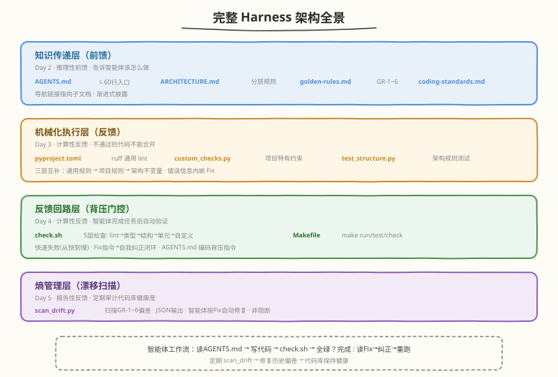
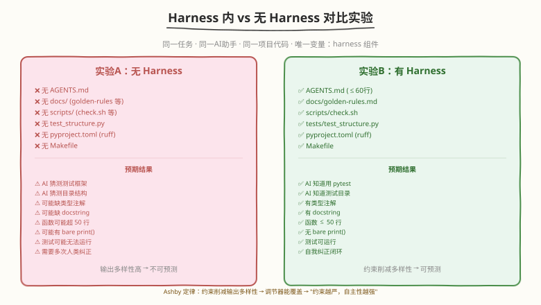
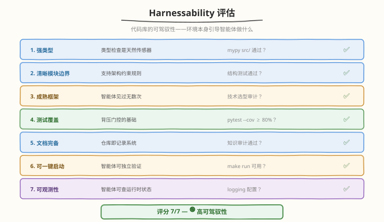

# Day 6：Harness 综合实战

## 🎯 目标

通过今天的学习，你将：

1. 将 Day 2-5 的所有产出组装成一个完整的 harness，验证端到端可用性
2. 设计并执行"Harness 内 vs 无 Harness"的对比实验，用量化数据证明约束系统的价值
3. 完成项目 Harnessability 评估，理解不同代码库对 harness 的适配度差异
4. 深入理解 Ashby 必要多样性定律——为什么"约束越严，自主性越强"在实践中成立
5. 理解三个规制维度（可维护性 / 架构适应度 / 行为）的成熟度差异，识别行为 Harness 这个"房间里的大象"
6. 产出一份可复用的 harness 搭建 checklist，能在新项目中快速复制这套约束系统

> 💡 **前置知识**：已完成 Day 1-5 全部学习，拥有 AGENTS.md、golden-rules.md、custom_checks.py、test_structure.py、check.sh、scan_drift.py
> ⚠️ **环境要求**：Python 3.10+、AI 编程助手（Claude Code / Cursor 等）、Day 5 的练手项目

---

## 为什么学综合实战

Day 1-5 我们逐一学习了六大核心概念并动手实现了各个组件。但这些组件是**分散的**——每天只关注一个维度。Day 6 的目标是把它们**组装成完整的 harness**，并验证：

1. **完整性**：所有组件是否协同工作？有没有遗漏的环节？
2. **有效性**：harness 真的能改善智能体的行为吗？改善程度有多大？
3. **适配性**：你的项目适合被 harness 吗？哪些维度需要改进？

这是从"理解概念"到"端到端实践"的关键一步——只有亲手跑完对比实验，看到量化数据，你才会真正相信 harness 的价值。

> 💡 **一句话总结**：Day 6 是"考试日"——把前五天的学习成果组装成一个完整系统，用对比实验验证它的有效性，用 Harnessability 评估找到改进方向。

---

## 核心概念

### 1.1 完整 Harness 的组件全景

经过 Day 2-5 的逐步搭建，一个完整的 harness 包含以下组件：



| 层 | 组件 | Day | 作用 | 属于 Guides/Sensors |
|----|------|-----|------|-------------------|
| 知识传递 | AGENTS.md | Day 2 | 智能体入口文件（≤60 行） | 推理性前馈 |
| 知识传递 | ARCHITECTURE.md | Day 2 | 架构规则与分层 | 推理性前馈 |
| 知识传递 | docs/golden-rules.md | Day 5 | 黄金规则（不变量） | 推理性前馈 |
| 知识传递 | docs/coding-standards.md | Day 2 | 编码规范细节 | 推理性前馈 |
| 机械化执行 | pyproject.toml (ruff) | Day 3 | 通用 lint 规则 | 计算性反馈 |
| 机械化执行 | scripts/custom_checks.py | Day 3 | 项目特有约束 | 计算性反馈 |
| 机械化执行 | tests/test_structure.py | Day 3 | 架构规则测试 | 计算性反馈 |
| 反馈回路 | scripts/check.sh | Day 4 | 背压门控（5 层检查） | 计算性反馈 |
| 反馈回路 | Makefile | Day 4 | 一键启动/测试/检查 | 计算性前馈 |
| 熵管理 | scripts/scan_drift.py | Day 5 | 漂移扫描（报告性） | 计算性反馈 |

#### 组件间的协同关系

```
智能体收到任务
  │
  ├── 读 AGENTS.md（前馈：知道项目结构和约定）
  │     ├── 导航 → docs/golden-rules.md（前馈：知道不变量）
  │     ├── 导航 → docs/coding-standards.md（前馈：知道编码规范）
  │     └── 导航 → ARCHITECTURE.md（前馈：知道分层规则）
  │
  ├── 写代码（在约束内自主实现）
  │
  ├── 运行 bash scripts/check.sh（反馈：背压门控）
  │     ├── 1. ruff check（计算性反馈：< 1s）
  │     ├── 2. mypy（计算性反馈：< 3s）
  │     ├── 3. pytest test_structure.py（计算性反馈：< 2s）
  │     ├── 4. pytest + coverage（计算性反馈：< 5s）
  │     ├── 5. custom_checks.py（计算性反馈：< 2s）
  │     └── Drift Scan（报告性，不阻断）
  │
  ├── 全绿？→ 是 → 任务完成 ✅
  │         → 否 → 读 Fix 指令 → 修改 → 重跑 → 循环
  │
  └── 定期：scan_drift.py 扫描历史偏差 → 智能体自动修复
```

### 1.2 对比实验设计

对比实验是 Day 6 的核心实践——用同一任务在两种环境下执行，量化 harness 的价值。



#### 实验变量控制

| 变量 | 实验A（无 Harness） | 实验B（有 Harness） |
|------|---------------------|---------------------|
| 项目代码 | 相同（复制一份） | 相同 |
| 任务指令 | 相同 | 相同 |
| AI 助手 | 相同 | 相同 |
| AGENTS.md | ❌ 删除 | ✅ 保留 |
| docs/ | ❌ 删除 | ✅ 保留 |
| scripts/ | ❌ 删除 | ✅ 保留 |
| tests/test_structure.py | ❌ 删除 | ✅ 保留 |
| pyproject.toml (ruff) | ❌ 删除 | ✅ 保留 |
| Makefile | ❌ 删除 | ✅ 保留 |

#### 评估维度

| 维度 | 怎么测量 | 无 Harness 预期 | 有 Harness 预期 |
|------|----------|----------------|----------------|
| 一次通过检查 | check.sh 是否首次全绿 | N/A（无 check.sh） | 可能/不可能 |
| 自我纠正次数 | 智能体重跑 check.sh 的次数 | N/A | 0-3 次 |
| 类型注解完整度 | 有多少函数有返回类型注解 | 低 | 高 |
| 测试覆盖率 | pytest --cov 报告 | 低/无 | > 80% |
| 符合分层架构 | 是否违反依赖方向 | 可能违反 | 遵守 |
| 函数长度合规 | 是否有超过 50 行的函数 | 可能有 | 无 |
| 测试可运行 | pytest 是否通过 | 可能不通过 | 通过 |
| 需要人类介入次数 | 人类需要手动纠正几次 | 多 | 少/零 |

### 1.3 Harnessability 评估

不是所有代码库都同样适合被 harness。Fowler 提出了 **Harnessability（可驾驭性）** 的概念——代码库的结构属性决定了它被 harness 的难易程度。



| 维度 | 说明 | 对 Harness 的意义 | 评估方法 |
|------|------|------------------|---------|
| 强类型 | 类型检查是天然传感器 | 类型检查 = 免费的计算性反馈 | `mypy src/` 是否通过 |
| 清晰模块边界 | 模块间依赖明确 | 支持架构约束规则（结构测试） | 看 import 图是否有环 |
| 成熟框架 | 用主流框架（FastAPI/pytest） | 智能体见过无数次，首次成功率高 | 技术选型审计 |
| 测试覆盖 | 有足够的测试 | 背压门控的基础 | `pytest --cov` 报告 |
| 文档完备 | 关键信息在仓库里 | 仓库即记录系统的基础 | 知识审计（Day 2） |
| 可一键启动 | make run / make test | 智能体可独立验证 | 运行 make run |
| 可观测性 | 日志/指标可用 | 智能体可查运行时状态 | 检查 logging 配置 |

> 💡 **Ambient Affordances（环境可供性）**：Ned Letcher 提出的概念——环境本身的结构属性（可读性、可导航性、可处理性）决定了智能体的成功率。不是"你给智能体什么指令"，而是"环境本身引导智能体做什么"。

### 1.4 Ashby 必要多样性定律的实践验证

Day 1 讲了 Ashby 定律的理论，Day 6 在实践中验证它：

> 调节器必须至少拥有与被调节系统同等的多样性。

在 harness 中的含义：

```
LLM 输出空间（高多样性）：能生成几乎任何代码
  → 如果不加约束，你无法预测输出（多样性太高，人类调节器跟不上）
    → 选定拓扑结构（架构规则 + lint + 类型系统）
      → 削减了输出多样性（只允许符合约束的代码）
        → harness 的调节能力能覆盖输出空间
          → 全面 harness 变得可行
            → "约束越严，自主性越强"
```

对比实验正是验证这个定律的实践：无 harness 时，智能体的输出多样性高（什么代码都可能生成），harness 削减了多样性（只允许符合黄金规则的代码），结果智能体在约束内的表现更好。

### 1.5 三个规制维度的成熟度

Day 4 初步介绍了 Fowler 的三个规制维度，Day 6 从实战角度深入评估：

| 维度 | 成熟度 | 你的项目状态 | 检查方式 |
|------|--------|-------------|---------|
| 可维护性 Harness | 最成熟 | ✅ ruff + 类型注解 + 函数行数 + 命名规范 | check.sh 第 1-2 层 |
| 架构适应度 Harness | 中等 | ✅ 结构测试 + 分层约束 + 依赖方向 | check.sh 第 3 层 |
| 行为 Harness | **最弱** | ⚠️ 单元测试覆盖，但行为正确性仍无可靠保障 | check.sh 第 4 层 |

> ⚠️ **房间里的大象**：你的 harness 能保证代码"结构正确"（lint 通过、类型正确、分层合规），但很难保证"行为正确"（功能真的对）。单元测试是最后的防线，但测试覆盖率 ≠ 行为正确性。这是当前 Harness Engineering 面临的最大挑战——Day 7 会进一步讨论。

---

## 最小可运行示例

### 任务 1：完整 Harness 搭建（90 分钟）

将 Day 2-5 的所有产出组装成一个完整的 harness。如果你的练手项目已经按天推进，大部分组件已经就位——现在做一次完整性检查。

#### 目标文件结构

```
my-harness-practice/
├── AGENTS.md                    # Day 2: 入口文件（≤60 行）
├── ARCHITECTURE.md              # Day 2: 架构说明
├── Makefile                     # Day 4: 一键启动/测试/检查
├── TODO.md                      # Day 2: 已知问题
├── pyproject.toml               # Day 3: ruff 配置
├── requirements.txt             # 依赖管理
├── docs/
│   ├── golden-rules.md          # Day 5: 黄金规则（GR-1 ~ GR-6）
│   ├── coding-standards.md      # Day 2: 编码规范细节
│   └── exec-plans/              # Day 2: 执行计划目录
│       ├── active/
│       └── completed/
├── scripts/
│   ├── check.sh                 # Day 4: 背压门控（5 层 + 漂移扫描）
│   ├── custom_checks.py         # Day 3: 自定义结构检查（6 项）
│   ├── scan_drift.py            # Day 5: 漂移扫描（报告性）
│   └── audit_readability.sh     # Day 4: 智能体可读性审计
├── tests/
│   ├── test_structure.py        # Day 3: 结构测试（9 项）
│   ├── test_calculator.py       # 功能测试
│   └── conftest.py              # pytest fixtures
└── src/
    ├── __init__.py
    └── calculator.py            # 项目代码
```

#### 完整性检查清单

逐项验证每个组件存在且功能正常：

```bash
cd ~/harness-day1

echo "=== Harness 完整性检查 ==="
echo ""

# 1. 知识传递层
echo "--- 知识传递层 ---"
[ -f AGENTS.md ] && echo "  ✅ AGENTS.md" || echo "  ❌ AGENTS.md 缺失"
[ -f ARCHITECTURE.md ] && echo "  ✅ ARCHITECTURE.md" || echo "  ❌ ARCHITECTURE.md 缺失"
[ -f docs/golden-rules.md ] && echo "  ✅ docs/golden-rules.md" || echo "  ❌ golden-rules.md 缺失"
[ -f docs/coding-standards.md ] && echo "  ✅ docs/coding-standards.md" || echo "  ❌ coding-standards.md 缺失"
[ -f TODO.md ] && echo "  ✅ TODO.md" || echo "  ❌ TODO.md 缺失"
echo "  AGENTS.md 行数: $(wc -l < AGENTS.md) (应 ≤ 60)"

# 2. 机械化执行层
echo ""
echo "--- 机械化执行层 ---"
[ -f pyproject.toml ] && echo "  ✅ pyproject.toml (ruff)" || echo "  ❌ pyproject.toml 缺失"
[ -f scripts/custom_checks.py ] && echo "  ✅ scripts/custom_checks.py" || echo "  ❌ custom_checks.py 缺失"
[ -f tests/test_structure.py ] && echo "  ✅ tests/test_structure.py" || echo "  ❌ test_structure.py 缺失"

# 3. 反馈回路层
echo ""
echo "--- 反馈回路层 ---"
[ -f scripts/check.sh ] && echo "  ✅ scripts/check.sh" || echo "  ❌ check.sh 缺失"
[ -f Makefile ] && echo "  ✅ Makefile" || echo "  ❌ Makefile 缺失"
[ -x scripts/check.sh ] && echo "  ✅ check.sh 可执行" || echo "  ⚠️ check.sh 不可执行 (chmod +x)"

# 4. 熵管理层
echo ""
echo "--- 熵管理层 ---"
[ -f scripts/scan_drift.py ] && echo "  ✅ scripts/scan_drift.py" || echo "  ❌ scan_drift.py 缺失"

echo ""
echo "=== 检查完成 ==="
```

```text
# 预期输出
=== Harness 完整性检查 ===

--- 知识传递层 ---
  ✅ AGENTS.md
  ✅ ARCHITECTURE.md
  ✅ docs/golden-rules.md
  ✅ docs/coding-standards.md
  ✅ TODO.md
  AGENTS.md 行数: 34 (应 ≤ 60)

--- 机械化执行层 ---
  ✅ pyproject.toml (ruff)
  ✅ scripts/custom_checks.py
  ✅ tests/test_structure.py

--- 反馈回路层 ---
  ✅ scripts/check.sh
  ✅ Makefile
  ✅ check.sh 可执行

--- 熵管理层 ---
  ✅ scripts/scan_drift.py

=== 检查完成 ===
```

#### 验证 AGENTS.md 完整性

```bash
cat AGENTS.md
```

确认包含五个必要部分：标题定位、仓库结构表、开发约定、导航链接、机械化检查说明。

#### 运行完整背压门控

```bash
bash scripts/check.sh
```

确认 5 层检查全绿 + 漂移扫描报告正常。

### 任务 2：对比实验——Harness 内 vs 无 Harness（60 分钟）

这是 Day 6 的核心实验——用同一任务在两种环境下执行，量化 harness 的价值。

#### 实验准备

```bash
cd ~

# 创建无 harness 的副本
cp -r harness-day1 no-harness-test
cd no-harness-test

# 删除所有 harness 组件
rm -f AGENTS.md
rm -f ARCHITECTURE.md
rm -f TODO.md
rm -f Makefile
rm -f pyproject.toml
rm -rf docs/
rm -rf scripts/
rm -f tests/test_structure.py
rm -f tests/conftest.py

# 确认无 harness 状态
echo "=== 无 Harness 项目状态 ==="
ls -la
echo ""
ls tests/ 2>/dev/null || echo "tests/ 目录已清空或不存在"
```

```text
# 预期输出
=== 无 Harness 项目状态 ===
total 24
drw-r--r--  2 user user 4096 Aug 14 12:00 .
drw-r--r-- 10 user user 4096 Aug 14 12:00 ..
drw-r--r--  2 user user 4096 Aug 14 12:00 src
drw-r--r--  2 user user 4096 Aug 14 12:00 tests

tests/ 目录已清空或不存在
```

#### 实验A：无 Harness 执行

```bash
cd ~/no-harness-test

# 给 AI 助手这个指令：
# "给 src/calculator.py 添加一个 fibonacci(n) 函数，
#  返回第 n 个斐波那契数（从 0 开始）。
#  负数输入抛出 ValueError。
#  写对应的测试。"
```

记录观察结果（填入下表）：

| 观察维度 | 无 Harness 记录 |
|----------|----------------|
| AI 知道用什么测试框架？ | |
| AI 知道测试放哪个目录？ | |
| AI 知道函数命名规范？ | |
| AI 加了类型注解？ | |
| AI 加了 docstring？ | |
| AI 写的测试能跑？ | |
| 函数 ≤ 50 行？ | |
| 有没有 print() 裸输出？ | |
| 需要你手动纠正几次？ | |

```bash
# 尝试运行测试（可能因为没有 pytest 配置而失败）
python -m pytest tests/ -v 2>&1 || echo "pytest 不可用或测试无法运行"
```

#### 实验B：有 Harness 执行

```bash
cd ~/harness-day1

# 给 AI 助手完全相同的指令：
# "给 src/calculator.py 添加一个 fibonacci(n) 函数，
#  返回第 n 个斐波那契数（从 0 开始）。
#  负数输入抛出 ValueError。
#  写对应的测试。
#  完成后运行 bash scripts/check.sh 确保全绿。"
```

记录观察结果：

| 观察维度 | 有 Harness 记录 |
|----------|----------------|
| AI 知道用什么测试框架？ | |
| AI 知道测试放哪个目录？ | |
| AI 知道函数命名规范？ | |
| AI 加了类型注解？ | |
| AI 加了 docstring？ | |
| AI 写的测试能跑？ | |
| 函数 ≤ 50 行？ | |
| 有没有 print() 裸输出？ | |
| check.sh 首次全绿？ | |
| 自我纠正了几次？ | |
| 需要你手动纠正几次？ | |

```bash
# 验证 check.sh 是否全绿
bash scripts/check.sh
```

#### 记录对比数据

将两个实验的结果填入对比表：

| 维度 | 无 Harness | 有 Harness | 改善 |
|------|-----------|-----------|------|
| 知道测试框架 | ❌/✅ | ❌/✅ | |
| 知道测试目录 | ❌/✅ | ❌/✅ | |
| 函数命名规范 | ❌/✅ | ❌/✅ | |
| 类型注解完整 | ❌/✅ | ❌/✅ | |
| 有 docstring | ❌/✅ | ❌/✅ | |
| 测试可运行 | ❌/✅ | ❌/✅ | |
| 函数 ≤ 50 行 | ❌/✅ | ❌/✅ | |
| 无 bare print | ❌/✅ | ❌/✅ | |
| 首次通过 check.sh | N/A | ❌/✅ | |
| 自我纠正次数 | N/A | _ 次 | |
| 人类介入次数 | _ 次 | _ 次 | |

```bash
# 清理实验副本
rm -rf ~/no-harness-test
```

> 💡 **实验预期**：有 Harness 时，AI 助手应该能一次性写出符合项目规范的代码（类型注解、docstring、正确的测试框架和目录、函数行数合规）。如果首次 check.sh 未全绿，AI 应该能根据 Fix 指令自我纠正，最终全绿。无 Harness 时，AI 会猜测项目约定，可能用 unittest 而非 pytest、把测试放错目录、忘记类型注解。

### 任务 3：Harnessability 评估（30 分钟）

评估你的练手项目对 harness 的适配度：

```bash
cd ~/harness-day1

cat > scripts/eval_harnessability.sh << 'SCRIPT'
#!/bin/bash
echo "=== Harnessability 评估 ==="
echo ""

score=0
total=7

# 1. 强类型
echo "--- 1. 强类型 ---"
if mypy src/ --ignore-missing-imports --no-error-summary 2>/dev/null; then
    echo "  ✅ 类型检查通过（天然传感器）"
    score=$((score + 1))
else
    echo "  ⚠️ 类型检查有问题"
fi
echo ""

# 2. 清晰模块边界
echo "--- 2. 清晰模块边界 ---"
if pytest tests/test_structure.py -q 2>/dev/null; then
    echo "  ✅ 结构测试通过（模块边界清晰）"
    score=$((score + 1))
else
    echo "  ⚠️ 结构测试有问题"
fi
echo ""

# 3. 成熟框架
echo "--- 3. 成熟框架 ---"
if [ -f requirements.txt ]; then
    echo "  ✅ 使用标准依赖管理"
    echo "  依赖列表:"
    cat requirements.txt | head -5
    score=$((score + 1))
else
    echo "  ⚠️ 缺少标准依赖管理"
fi
echo ""

# 4. 测试覆盖
echo "--- 4. 测试覆盖 ---"
cov=$(python -m pytest tests/ --ignore=tests/test_structure.py --cov=src --cov-report=term 2>/dev/null | grep TOTAL | awk '{print $NF}' | tr -d '%')
if [ -n "$cov" ] && [ "$cov" -ge 80 ] 2>/dev/null; then
    echo "  ✅ 覆盖率 ${cov}% (≥ 80%)"
    score=$((score + 1))
else
    echo "  ⚠️ 覆盖率 ${cov:-0}% (< 80%)"
fi
echo ""

# 5. 文档完备
echo "--- 5. 文档完备 ---"
docs_count=$(ls docs/*.md ARCHITECTURE.md AGENTS.md TODO.md 2>/dev/null | wc -l)
if [ "$docs_count" -ge 4 ]; then
    echo "  ✅ 文档完备 (${docs_count} 个文档)"
    score=$((score + 1))
else
    echo "  ⚠️ 文档不足 (${docs_count} 个)"
fi
echo ""

# 6. 可一键启动
echo "--- 6. 可一键启动 ---"
if [ -f Makefile ]; then
    echo "  ✅ Makefile 存在（make run / make test / make check）"
    score=$((score + 1))
else
    echo "  ⚠️ 缺少 Makefile"
fi
echo ""

# 7. 可观测性
echo "--- 7. 可观测性 ---"
if grep -r "logging" src/ 2>/dev/null | head -1; then
    echo "  ✅ 使用 logging（可观测）"
    score=$((score + 1))
else
    echo "  ⚠️ 未检测到 logging 配置"
fi
echo ""

echo "================================"
echo "  Harnessability 评分: ${score}/${total}"
echo "================================"
if [ "$score" -ge 6 ]; then
    echo "  🟢 高可驾驭性——harness 效果最佳"
elif [ "$score" -ge 4 ]; then
    echo "  🟡 中等可驾驭性——部分维度需改进"
else
    echo "  🔴 低可驾驭性——需先改善代码库结构"
fi
SCRIPT

chmod +x scripts/eval_harnessability.sh
bash scripts/eval_harnessability.sh
```

```text
# 预期输出
=== Harnessability 评估 ===

--- 1. 强类型 ---
  ✅ 类型检查通过（天然传感器）

--- 2. 清晰模块边界 ---
  ✅ 结构测试通过（模块边界清晰）

--- 3. 成熟框架 ---
  ✅ 使用标准依赖管理
  依赖列表:
  ruff
  mypy
  pytest
  pytest-cov

--- 4. 测试覆盖 ---
  ✅ 覆盖率 100% (≥ 80%)

--- 5. 文档完备 ---
  ✅ 文档完备 (5 个文档)

--- 6. 可一键启动 ---
  ✅ Makefile 存在（make run / make test / make check）

--- 7. 可观测性 ---
  ✅ 使用 logging（可观测）

================================
  Harnessability 评分: 7/7
  🟢 高可驾驭性——harness 效果最佳
================================
```

### 任务 4：产出 Harness 搭建 Checklist

将本周的经验沉淀为一份可复用的 checklist，能在新项目中快速复制这套 harness：

```bash
cat > docs/harness-setup-checklist.md << 'EOF'
# Harness 搭建 Checklist

> 在新项目中复制这套 harness 的步骤清单。
> 按顺序执行，每步完成后打勾。

## Phase 1: 知识传递层（Day 2）

- [ ] 创建 AGENTS.md（≤ 60 行，含仓库结构/约定/导航/检查说明）
- [ ] 创建 ARCHITECTURE.md（分层规则、依赖方向）
- [ ] 创建 docs/coding-standards.md（命名/格式/行数规范）
- [ ] 创建 docs/golden-rules.md（5-8 条核心规则，每条有机械化检查）
- [ ] 创建 TODO.md（已知问题）
- [ ] 创建 docs/exec-plans/（执行计划目录）
- [ ] 审计：所有关键信息是否都在仓库里（不在 Slack/人脑）

## Phase 2: 机械化执行层（Day 3）

- [ ] 配置 linter（pyproject.toml / .eslintrc / golangci-lint）
- [ ] 实现 scripts/custom_checks.py（项目特有约束，错误信息含 Fix）
- [ ] 实现 tests/test_structure.py（架构规则测试）
- [ ] 验证：故意违规，确认检查能捕获
- [ ] 每条黄金规则都有对应的机械化检查

## Phase 3: 反馈回路层（Day 4）

- [ ] 实现 scripts/check.sh（背压门控，5 层检查从快到慢）
- [ ] 创建 Makefile（make run / make test / make check）
- [ ] 在 AGENTS.md 中写明"完成任务后必须运行 bash scripts/check.sh"
- [ ] 验证：故意失败，确认 check.sh 拒绝并给出 Fix 指令
- [ ] 验证：智能体能利用 Fix 指令自我纠正

## Phase 4: 熵管理层（Day 5）

- [ ] 实现 scripts/scan_drift.py（漂移扫描，JSON 输出）
- [ ] 将 scan_drift 集成到 check.sh 末尾（非阻断）
- [ ] 运行首次漂移扫描，记录当前偏差
- [ ] 设计定期扫描计划（每日/每周）

## Phase 5: 验证（Day 6）

- [ ] 运行完整性检查（所有组件存在且功能正常）
- [ ] 运行 Harnessability 评估（≥ 5/7 为合格）
- [ ] 执行 Harness 内 vs 无 Harness 对比实验
- [ ] 记录对比数据（至少 5 个维度）
- [ ] bash scripts/check.sh 全绿
EOF

git add -A && git commit -m "feat: add harness setup checklist, harnessability eval"
```

---

## 深入原理

### 对比实验的统计学意义

单次对比实验可能有偶然性——智能体某次表现好或坏可能是运气。要获得可靠的结论，需要考虑：

| 因素 | 影响 | 应对 |
|------|------|------|
| 任务难度 | 简单任务差异小，复杂任务差异大 | 用多个不同难度的任务测试 |
| 模型版本 | 不同模型对 harness 的敏感度不同 | 记录模型版本 |
| 任务领域 | 智能体对某些领域更熟悉 | 用不同领域的任务测试 |
| 运行次数 | 单次运行有随机性 | 同一任务跑 3-5 次取平均 |

> 💡 **实践建议**：本周的对比实验是定性验证（"harness 有没有改善"）。如果要定量验证（"harness 改善了多少"），需要设计更严格的实验——多个任务 × 多次运行 × 多个维度。

### Ambient Affordances 与 Harnessability

Ned Letcher 的 **Ambient Affordances（环境可供性）** 概念解释了为什么 Harnessability 因项目而异：

| 环境属性 | 高 Harnessability | 低 Harnessability |
|----------|-------------------|-------------------|
| 类型系统 | 强类型（Python + mypy / TypeScript / Rust） | 弱类型（无类型注解的 Python / JS） |
| 模块边界 | 清晰的分层（routes → service → database） | 混乱（到处直接 import） |
| 框架成熟度 | 主流框架（FastAPI / Django / React） | 自研框架（智能体没见过） |
| 测试文化 | 每个模块有测试 | 几乎没有测试 |
| 文档文化 | 决策都写进仓库 | 决策在 Slack/人脑里 |

核心洞察：**不是"你给智能体什么指令"，而是"环境本身引导智能体做什么"**。高 Harnessability 的代码库，环境本身就引导智能体做正确的事——类型系统引导它写类型安全的代码，模块边界引导它遵守分层，测试文化引导它写测试。

### 为什么行为 Harness 是"房间里的大象"

三个规制维度的成熟度差异，根源在于"验证难度"：

| 维度 | 验证什么 | 验证方式 | 难度 | 成熟度 |
|------|---------|---------|------|--------|
| 可维护性 | 代码质量 | lint / 格式化 / 类型检查 | 低（规则明确） | 最成熟 |
| 架构适应度 | 结构合规 | 结构测试 / 依赖分析 | 中（规则可定义） | 中等 |
| 行为 | 功能正确 | 单元测试 / 集成测试 / E2E | 高（行为空间巨大） | 最弱 |

可维护性容易验证——"函数不超过 50 行"是明确的规则，lint 可以 100% 确定。行为正确性难以验证——"这个用户注册功能的行为正确吗？"需要考虑所有输入组合、边界条件、并发场景。

```
可维护性：规则明确 → lint 100% 确定 → 成熟
架构适应度：规则可定义 → 结构测试覆盖 → 中等
行为正确性：行为空间巨大 → 测试覆盖有限 → 最弱
```

> 💡 **当前前沿**：LLM-as-judge（推理性反馈）是行为 Harness 的探索方向——用 LLM 审查代码的行为正确性。但它概率性、慢、贵，无法替代计算性反馈的可靠性。Day 7 会进一步讨论这个挑战。

### 对比实验验证 Ashby 定律

Day 1 讲了 Ashby 定律的理论。Day 6 的对比实验是实践验证：

| 实验 | 输出多样性 | 调节器能力 | 结果 |
|------|-----------|-----------|------|
| 无 Harness | 高（智能体可以生成任何代码） | 低（人类偶尔审查） | 质量不可预测 |
| 有 Harness | 低（只允许符合约束的代码） | 高（lint + 结构测试 + 背压） | 质量可预测 |

```
无 Harness：输出多样性 >> 调节器多样性 → 不可控
有 Harness：约束削减输出多样性 ≤ 调节器多样性 → 可控
```

这就是"约束越严，自主性越强"的实践验证——约束削减了输出多样性，使 harness 的调节能力能覆盖输出空间，智能体在约束内可以更自主地决策。

### git worktree 在对比实验中的应用

如果你想让两个实验**同时运行**（而非先后运行），可以用 git worktree：

```bash
# 主仓库（有 harness）
cd ~/harness-day1

# 创建无 harness 的 worktree
git worktree add ../harness-no-harness experiment-no-harness
cd ../harness-no-harness

# 在 worktree 中删除 harness 组件
rm AGENTS.md docs/ scripts/ tests/test_structure.py pyproject.toml Makefile

# 现在两个工作目录同时存在：
# ~/harness-day1         → 有 harness（主仓库）
# ~/harness-no-harness   → 无 harness（worktree）
# 可以同时在两个目录中让不同的 AI 助手实例工作
```

> 💡 **优势**：git worktree 让两个实验互不干扰——有 harness 的实例在主仓库中运行，无 harness 的实例在 worktree 中运行，两者共享 git 历史但工作目录独立。

---

## 常见陷阱与最佳实践

### 陷阱 1：对比实验任务太简单

```bash
# ❌ 错误：用"添加一个 add() 函数"做对比实验
# 任务太简单，智能体无论有没有 harness 都能做对 → 看不出差异

# ✅ 正确：用需要多个文件协作的任务
# "添加用户注册功能：需要 routes + service + database 三层，
#  需要写测试，需要类型注解，需要错误处理"
# 复杂任务才能暴露 harness 的价值
```

### 陷阱 2：对比实验只做一次

```
# ❌ 错误：只跑一次实验就下结论
# 单次运行有随机性，可能只是运气

# ✅ 正确：同一任务跑 3-5 次，取平均
# 或者用 3 个不同任务，每个跑一次
```

### 陷阱 3：Harnessability 评分低就放弃

```
# ❌ 错误：项目 Harnessability 评分 2/7，认为"不适合 harness"就放弃

# ✅ 正确：低分正是改进方向
# 评分低说明代码库本身需要改善——加类型注解、加测试、加文档
# 改善代码库的 Harnessability 本身就是 harness 的一部分
```

### 陷阱 4：忽略行为 Harness 的缺口

```
# ❌ 错误：check.sh 全绿就认为代码"正确"
# check.sh 只验证了结构和类型，不验证行为正确性

# ✅ 正确：认识到行为 Harness 是最弱环节
# 单元测试覆盖了部分行为，但不是全部
# 对安全关键代码，仍需人类审查行为正确性
```

### 陷阱 5：harness 搭建后不再更新

```
# ❌ 错误：一次性搭建 harness，之后不再维护
# 黄金规则过时、lint 规则不更新、AGENTS.md 与代码脱节

# ✅ 正确：harness 是活的系统
# 定期运行 scan_drift.py → 修复偏差
# 品味传播：审查评论 → 文档更新 → lint 规则 → 自动应用
# 随项目演化更新黄金规则
```

### 最佳实践

| 实践 | 说明 |
|------|------|
| 用复杂任务做对比实验 | 简单任务看不出差异，需要多文件协作的任务 |
| 多次运行取平均 | 单次有随机性，3-5 次更可靠 |
| 记录模型版本 | 不同模型对 harness 的敏感度不同 |
| Harnessability 低分是改进方向 | 不是放弃理由，而是改善代码库的路线图 |
| 认识行为 Harness 的缺口 | check.sh 全绿 ≠ 行为正确 |
| harness 是活的系统 | 定期扫描、更新规则、品味传播 |
| 产出可复用 checklist | 把搭建经验沉淀为可复制的步骤 |
| git worktree 并行实验 | 让对比实验互不干扰 |

---

## 面试要点

1. **一个完整的 harness 包含哪些组件？它们如何协同工作？**

<details>
<summary>点击查看答案</summary>

四层组件：
- 知识传递层：AGENTS.md（入口）、ARCHITECTURE.md（架构）、golden-rules.md（不变量）、coding-standards.md（规范）
- 机械化执行层：pyproject.toml/ruff（通用 lint）、custom_checks.py（项目约束）、test_structure.py（架构测试）
- 反馈回路层：check.sh（背压门控）、Makefile（一键启动）
- 熵管理层：scan_drift.py（漂移扫描）

协同流程：智能体读 AGENTS.md（前馈）→ 写代码 → 运行 check.sh（反馈）→ 全绿？完成 / 失败→读 Fix→纠正→重跑。定期 scan_drift 扫描历史偏差。

</details>

2. **如何设计 Harness 内 vs 无 Harness 的对比实验？**

<details>
<summary>点击查看答案</summary>

- 控制变量：相同项目代码、相同任务指令、相同 AI 助手
- 实验A（无 Harness）：删除 AGENTS.md / docs / scripts / test_structure / pyproject.toml
- 实验B（有 Harness）：保留所有 harness 组件
- 评估维度：一次通过检查、自我纠正次数、类型注解完整度、测试覆盖率、符合分层架构、函数长度合规、测试可运行、人类介入次数
- 注意：任务要足够复杂（多文件协作），多次运行取平均

</details>

3. **什么是 Harnessability？如何评估？**

<details>
<summary>点击查看答案</summary>

- Harnessability：代码库被 harness 的难易程度，由代码库的结构属性决定
- 评估维度（7 项）：
  1. 强类型（类型检查是天然传感器）
  2. 清晰模块边界（支持架构约束）
  3. 成熟框架（智能体见过无数次）
  4. 测试覆盖（背压门控的基础）
  5. 文档完备（仓库即记录系统的基础）
  6. 可一键启动（智能体可独立验证）
  7. 可观测性（智能体可查运行时状态）
- 评分 ≥ 6/7 为高可驾驭性，< 4 为低可驾驭性
- 低分不是放弃理由，而是改进方向

</details>

4. **什么是 Ambient Affordances？它与 Harnessability 有什么关系？**

<details>
<summary>点击查看答案</summary>

- Ambient Affordances（环境可供性）：Ned Letcher 提出的概念——环境本身的结构属性（可读性、可导航性、可处理性）决定了智能体的成功率
- 与 Harnessability 的关系：Harnessability 就是代码库的 Ambient Affordances——不是"你给智能体什么指令"，而是"环境本身引导智能体做什么"
- 高 Harnessability 的代码库，环境本身就引导智能体做正确的事：类型系统引导写类型安全代码，模块边界引导遵守分层，测试文化引导写测试

</details>

5. **三个规制维度的成熟度有什么差异？为什么行为 Harness 是"房间里的大象"？**

<details>
<summary>点击查看答案</summary>

- 可维护性 Harness：最成熟，lint/格式化/类型检查，规则明确可 100% 确定
- 架构适应度 Harness：中等，结构测试/依赖分析，规则可定义但需要实现
- 行为 Harness：最弱，单元测试覆盖有限，行为空间巨大无法完全验证
- "房间里的大象"：check.sh 全绿只验证了结构和类型，不验证行为正确性。测试覆盖率 ≠ 行为正确性。这是当前 Harness Engineering 面临的最大挑战
- 当前前沿：LLM-as-judge（推理性反馈）是探索方向，但概率性、慢、贵

</details>

6. **对比实验如何验证 Ashby 必要多样性定律？**

<details>
<summary>点击查看答案</summary>

- Ashby 定律：调节器必须至少拥有与被调节系统同等的多样性
- 无 Harness：智能体输出多样性高（可以生成任何代码），调节器多样性低（人类偶尔审查）→ 输出多样性 >> 调节器多样性 → 不可控
- 有 Harness：约束削减了输出多样性（只允许符合黄金规则的代码），调节器多样性高（lint + 结构测试 + 背压）→ 输出多样性 ≤ 调节器多样性 → 可控
- 这就是"约束越严，自主性越强"的实践验证——约束削减输出多样性，使 harness 能覆盖输出空间

</details>

7. **如何把 harness 搭建经验复用到新项目？**

<details>
<summary>点击查看答案</summary>

- 产出可复用的搭建 checklist，分 5 个 Phase：
  1. 知识传递层：AGENTS.md + ARCHITECTURE.md + golden-rules.md + coding-standards.md
  2. 机械化执行层：linter 配置 + custom_checks.py + test_structure.py
  3. 反馈回路层：check.sh + Makefile + AGENTS.md 背压指令
  4. 熵管理层：scan_drift.py + 定期扫描计划
  5. 验证：完整性检查 + Harnessability 评估 + 对比实验
- checklist 每步可打勾，按顺序执行

</details>

8. **harness 搭建完成后为什么还需要持续维护？**

<details>
<summary>点击查看答案</summary>

- harness 是活的系统，不是一次性搭建就不变：
  - 黄金规则可能过时（项目演化，规则需要更新）
  - lint 规则需要跟进（新版本可能有更好的规则）
  - AGENTS.md 可能与代码脱节（新增模块后忘记更新导航）
- 持续维护方式：
  - 定期运行 scan_drift.py → 修复偏差
  - 品味传播：审查评论 → 文档更新 → lint 规则 → 自动应用
  - 随项目演化更新黄金规则
- 不维护的 harness 会退化成"腐烂的文档"——回到 Day 3 讲的"文档会腐烂"问题

</details>

---

## 今日总结

Day 6 是综合实战——把前五天的学习成果组装成完整系统并验证有效性：

1. **完整 Harness 搭建**：四层组件（知识传递 + 机械化执行 + 反馈回路 + 熵管理）协同工作，完整性检查确保无遗漏
2. **对比实验**：同一任务在 Harness 内外执行，量化对比 8+ 个维度。预期有 Harness 时智能体一次成功率更高、自我纠正闭环有效、人类介入更少
3. **Harnessability 评估**：7 个维度评估代码库的可驾驭性（强类型/模块边界/成熟框架/测试覆盖/文档/可启动/可观测），低分是改进方向而非放弃理由
4. **Ashby 定律实践验证**：约束削减输出多样性 → 调节器能覆盖 → "约束越严，自主性越强"
5. **行为 Harness 是房间里的大象**：check.sh 全绿 ≠ 行为正确，三个规制维度中行为验证最弱
6. **Ambient Affordances**：不是"给智能体什么指令"，而是"环境本身引导智能体做什么"
7. **可复用 Checklist**：5 个 Phase 的搭建步骤，可在新项目中快速复制

> 💡 **明日预告**：Day 7 是最后一天——了解 Ralph 循环（Harness 的实战模式）、模型与 harness 的耦合、Loop Engineering 等进阶方向，完成 10 道面试题复盘，绘制本周知识图谱。

---

## 推荐资源

| 资源 | 类型 | 优先级 | 说明 |
|------|------|--------|------|
| [OpenAI — Harness Engineering 原文](https://openai.com/zh-Hans-CN/index/harness-engineering/) | 官方 | ⭐ 必读 | 完整 harness 的原始范例 |
| [Martin Fowler — Harness Engineering 正式版](https://martinfowler.com/articles/harness-engineering.html) | 博客 | ⭐ 必读 | 三个规制维度 + Harnessability 概念 |
| [Martin Fowler — Maintainability Sensors](https://martinfowler.com/articles/sensors.html) | 博客 | ⭐ 必读 | 传感器设计与行为 Harness 的挑战 |
| [LangChain — Scaling Managed Agents](https://blog.langchain.dev/scaling-managed-agents/) | 博客 | 📌 推荐 | 模型与 harness 耦合的 Terminal Bench 数据 |
| [snarktank/ralph](https://github.com/snarktank/ralph) | 开源项目 | 📌 推荐 | 完整 harness 的实战实现 |
| [harness-engineering — concepts/06](https://github.com/deusyu/harness-engineering/blob/main/concepts/06-harness-definition.md) | 笔记 | 📌 推荐 | Harness 完整组件清单与 Harnessability |
| [Ned Letcher — Ambient Affordances](https://nedbatchelder.com/) | 博客 | 📎 参考 | 环境可供性概念的原始阐述 |
